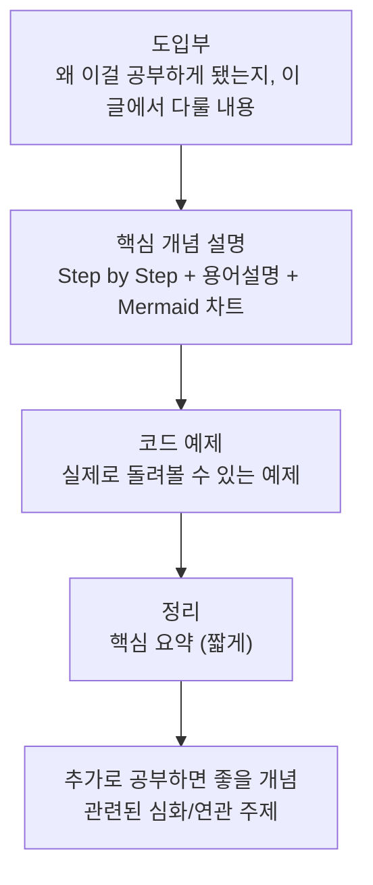
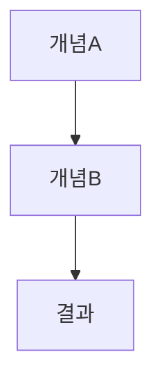

# CLAUDE.md - AI Assistant Guide for Charlie's Wiki

This document provides comprehensive guidance for AI assistants working on this personal wiki project.

---

## Project Overview

### Purpose

This is a **Jekyll-based personal wiki** designed for systematic development learning management. It helps developers track their learning journey using a "도장깨기" (achievement stamps) approach - marking off completed learning items like collecting stamps.

### Target Audience

Developers who want to:

- Track their learning progress systematically
- Build a knowledge base of technical topics
- Maintain a portfolio of completed learning items
- Create interconnected learning resources

### Core Philosophy

- **Progressive Learning**: Break down large topics into manageable items
- **Visual Progress**: Use checkboxes to show completion status
- **Interconnected Knowledge**: Link related posts together
- **Documentation as Learning**: Writing about topics reinforces understanding

---

## Project Architecture

### Technology Stack

- **Jekyll**: Static site generator
- **Markdown**: Content format
- **Liquid**: Templating language
- **JavaScript**: Client-side search
- **CSS**: Custom styling with CSS variables

### Key Features

1. **Category System**: Organize posts by major themes (Roadmap, Programming, Computer-Science)
2. **Tag System**: Cross-reference posts by topics
3. **Search**: Client-side search across all content
4. **Roadmap Tracking**: Master progress tracker with checkboxes
5. **Responsive Design**: Mobile-friendly layout
6. **CV Integration**: Professional portfolio page

### Directory Structure

```mermaid
graph TD
    Root["."] --> Config["_config.yml<br/>Site configuration"]
    Root --> Includes["_includes/<br/>Reusable HTML components"]
    Root --> Layouts["_layouts/<br/>Page templates"]
    Root --> Plugins["_plugins/<br/>Custom Jekyll plugins"]
    Root --> Posts["_posts/<br/>Learning posts (Markdown)"]
    Root --> Assets["assets/<br/>Static files"]
    Root --> Pages["pages/<br/>Fixed pages"]
    Root --> Index["index.html<br/>Home page"]

    Includes --> Header["header.html"]
    Includes --> Footer["footer.html"]

    Layouts --> Default["default.html"]
    Layouts --> PostLayout["post.html"]
    Layouts --> TagPage["tag_page.html"]
    Layouts --> CatPage["category_page.html"]
    Layouts --> CvLayout["cv.html"]

    Plugins --> TagGen["tag_generator.rb"]
    Plugins --> CatGen["category_generator.rb"]

    Assets --> CSS["css/style.css"]
    Assets --> JS["js/search.js"]
    Assets --> Images["images/"]

    Pages --> CV["cv.md"]
    Pages --> Tags["tags.md"]
    Pages --> Categories["categories.md"]
```



---

## Understanding Sample Posts

The `_posts/` directory contains three sample posts that demonstrate the wiki's structure:

### 1. Roadmap Post: `2025-10-10-backend-roadmap.md`

**Category:** `Roadmap`
**Purpose:** Master learning tracker for backend development

**Structure:**

```markdown
---
layout: post
title: "백엔드 개발자 로드맵: 도장깨기"
date: 2025-10-10
categories: Roadmap
tags: [roadmap, backend, learning]
published: true
---

## 1. 프로그래밍 언어 (Programming Language)

- [x] Python - [[Python 기본 문법 정리](/2025/10/11/python-basics.html)]
- [ ] Java
- [ ] Go

## 2. 자료구조 & 알고리즘

- [x] 스택 (Stack) - [[스택의 이해와 구현](/2025/10/12/data-structure-stack.html)]
- [ ] 큐 (Queue)
- [ ] 트리 (Tree)

## 진행 상황

현재 완료한 항목: **2개**
전체 항목: **약 50개**
진행률: **4%**
```

**Key Features:**

- **Checkbox tracking**: `[x]` = completed, `[ ]` = pending
- **Linked learning**: Each completed item links to its detailed post
- **Progress statistics**: Shows completion percentage
- **Organized by topics**: Groups related skills together

**When to Update:**

- Check off items when you complete learning them
- Add links to newly created detailed posts
- Update progress statistics
- Add new topics as needed

### 2. Programming Post: `2025-10-11-python-basics.md`

**Category:** `Programming`
**Purpose:** Detailed programming language tutorial

**Structure:**

- **Introduction**: What is Python and why learn it
- **Core Concepts**: Variables, data types, control flow, functions
- **Code Examples**: Practical, runnable code snippets
- **Best Practices**: Pythonic patterns
- **Next Steps**: Links to advanced topics

**Content Pattern:**

1. Concept explanation
2. Syntax examples
3. Practical use cases
4. Common patterns
5. "다음 학습" (Next Learning) section

### 3. Computer Science Post: `2025-10-12-data-structure-stack.md`

**Category:** `Computer-Science`
**Purpose:** In-depth technical concept deep-dive

**Structure:**

- **Concept Definition**: What is a Stack?
- **Operations**: Core functionality (push, pop, peek, etc.)
- **Implementation**: Complete Python implementation
- **Time Complexity**: Performance analysis
- **Use Cases**: Real-world applications
- **Practice Problems**: Example implementations

**Educational Value:**

- Theory + Practice combination
- Complete working code
- Multiple examples
- Connections to real-world usage

---

## Content Categories

### Roadmap

**Purpose:** Central progress tracking for learning journeys

**Characteristics:**

- High-level overview of skill areas
- Checkbox-based progress tracking
- Links to detailed learning posts
- Progress statistics
- Long-term tracking document

**Best Practices:**

- One roadmap per major skill area (e.g., Backend, Frontend, DevOps)
- Update regularly as you complete items
- Keep progress statistics current
- Use clear topic groupings

**Example Topics:**

- Backend Developer Roadmap
- Frontend Developer Roadmap
- Data Science Roadmap
- DevOps Engineer Roadmap

### Programming

**Purpose:** Programming language fundamentals and patterns

**Characteristics:**

- Language-specific content
- Syntax and idioms
- Code examples
- Best practices
- Practical exercises

**Typical Content:**

- Language basics (Python, JavaScript, Java, Go)
- Framework tutorials (Django, React, Spring)
- Design patterns
- Code quality practices

### Computer-Science

**Purpose:** Fundamental CS concepts and theory

**Characteristics:**

- Timeless concepts
- Implementation + analysis
- Algorithm complexity
- Mathematical foundations
- Problem-solving techniques

**Typical Content:**

- Data structures (Stack, Queue, Tree, Graph)
- Algorithms (sorting, searching, dynamic programming)
- System design concepts
- Computer architecture
- Operating systems concepts

### Career

**Purpose:** 이력서, 포트폴리오, 면접 준비 등 개발자 커리어 전반

**Characteristics:**

- 이력서/포트폴리오 작성법
- 면접 준비 전략
- 커리어 전환 경험
- 실제 사례 기반 Before/After 비교

**Typical Content:**

- PAAR 프레임워크 활용법
- 기술 면접 대응 전략
- 프로젝트 포트폴리오 구성법

---

## PAAR 사고방식 (기술 포스트 공통 적용)

블로그의 모든 기술 포스트는 PAAR(Problem-Analyze-Action-Result) 사고방식이 자연스럽게 녹아들어야 합니다. 이력서나 포트폴리오에서만이 아니라, 기술을 공부하거나 적용해볼 때도 "왜 이걸 선택했는지"가 드러나야 합니다.

### 기술 선택/비교 포스트에서

기술을 소개하거나 비교할 때는 단순 나열이 아니라 의사결정 과정을 보여줍니다:

- **Problem**: 어떤 상황에서 이 기술이 필요했는가?
- **Analyze**: 어떤 대안들을 비교했고, 왜 이걸 선택했는가?
- **Action**: 실제로 어떻게 적용했는가? 트레이드오프는?
- **Result**: 적용 후 결과는? 수치가 있으면 수치로.

### 개념 학습 포스트에서

개념을 설명할 때도 "이 개념이 왜 필요한지(Problem)"와 "실무에서 어떤 판단에 활용되는지(Analyze)"를 포함합니다. 단순히 "X는 Y이다"가 아니라 "이런 상황에서 X를 쓰면 이런 문제를 해결할 수 있다"는 맥락을 제공합니다.

### 포트폴리오와의 연결

블로그 포스트 자체가 포트폴리오의 일부입니다. 기술 포스트에서 의사결정 과정을 잘 보여주면, 블로그 URL을 포트폴리오로 제출했을 때 "이 사람은 기술 선택의 근거를 생각하는 사람이다"라는 인상을 줄 수 있습니다.

---

## Writing New Posts

### Post Naming Convention

```
YYYY-MM-DD-topic-name.md
```

**Examples:**

- `2025-10-15-python-decorators.md`
- `2025-10-16-react-hooks-guide.md`
- `2025-10-17-binary-search-tree.md`

### Front Matter Template

```markdown
---
layout: post
title: "Your Post Title"
date: YYYY-MM-DD
categories: [Roadmap|Programming|Computer-Science]
tags: [tag1, tag2, tag3]
published: true
---
```

**Important Notes:**

- `layout`: Always use `post` for content posts
- `title`: Post title (use quotes if it contains special characters)
- `date`: Must be in YYYY-MM-DD format and match the filename date
  - **Always use today's actual date** (not future dates)
  - Jekyll hides future-dated posts by default
  - Example: If today is 2025-10-12, use `date: 2025-10-12`
- `categories`: Use singular form, choose one primary category
- `tags`: Use array format with square brackets
- `published`: Controls post visibility
  - `true` = Post appears on the site (default for all published content)
  - `false` = Draft post, hidden from builds
  - **Always include this field** when creating or updating posts
- Multi-word categories: Use hyphens (e.g., `Computer-Science` not `Computer Space`)

### Writing Style Guide (블로그 톤 & 가독성)

블로그 포스트는 **내가 직접 공부하고 정리한 느낌**이 나야 한다. 아래 규칙을 반드시 따른다.

#### 톤 & 문체

- **1인칭 서술**: "~해보겠습니다", "제가 이해한 바로는", "처음에는 헷갈렸는데" 등 직접 배운 사람의 시점
- **자연스러운 한국어**: 딱딱한 교과서체 금지. 블로그 글처럼 편하게 쓰되, 핵심은 명확하게
- **경험 기반 서술**: "이 개념은 실제로 ~할 때 유용합니다", "저도 처음에는 ~라고 생각했는데" 같은 표현 활용
- **독백/회고 느낌**: 글 시작이나 중간에 "왜 이걸 공부하게 됐는지", "어디서 막혔는지" 짧게 언급

#### AI 글쓰기 패턴 회피 (필수)

블로그 포스트에서 다음 AI 특유 패턴을 반드시 피한다. ([Humanizer](https://github.com/blader/humanizer) 기반)

**금지 어휘/표현:**
- AI 과용 단어: "delve", "landscape", "tapestry", "testament", "pivotal", "crucial", "vibrant", "underscore", "foster", "garner", "showcase", "intricate", "enduring"
- 과장 표현: "marking a pivotal moment", "serves as a testament", "vital role", "setting the stage for"
- 홍보성 언어: "nestled", "groundbreaking", "breathtaking", "renowned", "must-visit"
- 챗봇 잔재: "I hope this helps!", "Let me know if...", "Great question!"
- 예고 문구: "Let's dive in", "Let's explore", "Here's what you need to know"
- 필러: "In order to", "It is important to note that", "Due to the fact that"
- 권위 트로프: "The real question is", "At its core", "In reality"

**금지 구조/패턴:**
- `is/are` 회피 금지: "serves as", "stands as" 대신 "~이다/~는" 직접 서술
- 부정 병렬 구조: "It's not just X; it's Y" 패턴 사용 금지
- 3의 법칙 강제: 무조건 3개씩 나열하지 말 것. 2개면 2개, 4개면 4개
- 동의어 돌려쓰기: 같은 대상을 매번 다른 단어로 바꿔 부르지 말 것
- 뻔한 긍정 결론: "The future looks bright", "Exciting times lie ahead" 금지
- 헤딩 뒤 반복: 제목을 그대로 반복하는 첫 문장 금지
- 과도한 헤징: "could potentially possibly be argued" 같은 다중 완화 표현 금지

**스타일 규칙:**
- em dash(—) 남용 금지: 쉼표나 마침표로 충분하면 그걸 쓸 것
- 볼드체는 진짜 강조할 때만: 기계적으로 모든 키워드에 볼드 금지
- `**헤더:** 내용` 식 인라인 헤더 리스트 지양
- 모호한 출처 금지: "Experts argue", "Industry reports" 대신 구체적 출처 명시

**자기 검증:**
- 글 작성 후 "이 글이 왜 AI가 쓴 것처럼 보이는가?" 자문하고 해당 부분 수정
- 문장 길이와 구조가 너무 균일하지 않은지 확인
- 의견, 불확실성, 개인 경험이 적절히 섞여 있는지 확인

#### Step by Step 설명 (필수)

개념을 설명할 때는 **반드시 단계별로** 풀어서 설명한다:

```markdown
## 동작 원리

### Step 1: 요청 수신
클라이언트가 HTTP 요청을 보내면, 서버는 이 요청을 받아서...

### Step 2: 미들웨어 처리
요청이 들어오면 등록된 미들웨어를 순서대로 통과합니다...

### Step 3: 핸들러 실행
모든 미들웨어를 통과하면 최종적으로 핸들러가 실행됩니다...
```

- 복잡한 개념일수록 Step을 잘게 나눈다
- 각 Step에는 **왜 이 단계가 필요한지** 한 줄 설명을 덧붙인다
- 가능하면 흐름을 Mermaid 차트로도 시각화한다

#### 용어설명 - Asterisk(*) 인라인 방식

글 중간에 처음 등장하는 전문 용어는 asterisk와 함께 바로 설명한다:

```markdown
이때 *미들웨어(Middleware)*란 요청과 응답 사이에서 특정 처리를 수행하는 중간 소프트웨어를 말합니다.

데이터를 *직렬화(Serialization)*하면 — 즉, 메모리 상의 객체를 저장/전송 가능한 형태로 변환하면 — 네트워크를 통해 전달할 수 있게 됩니다.
```

- 첫 등장 시에만 설명, 이후에는 용어만 사용
- 영어 원어를 괄호 안에 병기
- 설명은 한 문장 이내로 간결하게

#### 다이어그램 — Mermaid 차트 필수

모든 다이어그램, 플로우차트, 구조도는 **반드시 Mermaid 문법**으로 작성한다:

```markdown
\```mermaid
flowchart LR
    A[Client] -->|HTTP Request| B[Server]
    B -->|Route Matching| C[Handler]
    C -->|Response| A
\```
```

- ASCII art, 텍스트 기반 다이어그램 사용 금지
- 개념의 흐름, 구조, 관계를 시각화할 때 적극 활용
- 차트 위에 간단한 설명 한 줄을 덧붙인다 (예: "전체 요청 흐름을 정리하면 다음과 같습니다:")

#### 포스트 구성 순서



### Content Structure Template

````markdown
---
layout: post
title: "Topic Name: Subtitle"
date: YYYY-MM-DD
categories: Category-Name
tags: [tag1, tag2, tag3]
published: true
---

## 들어가며

이번 글에서는 ~에 대해 정리해보려고 합니다.
(왜 이걸 공부하게 됐는지, 어떤 맥락에서 필요한 개념인지 짧게)

---

## 핵심 개념

(개념에 대한 개요. 첫 등장 용어는 *용어(English Term)* 형태로 인라인 설명)



---

## 동작 원리 (Step by Step)

### Step 1: 첫 번째 단계
설명...

### Step 2: 두 번째 단계
설명...

### Step 3: 세 번째 단계
설명...

---

## 코드로 살펴보기

실제로 돌려볼 수 있는 예제입니다.

```python
# 예제 코드
```

---

## 정리

이번 글에서 다룬 내용을 정리하면:
- 핵심 포인트 1
- 핵심 포인트 2
- 핵심 포인트 3

---

## 추가로 공부하면 좋을 개념

이 주제를 더 깊이 이해하려면 아래 개념들도 함께 살펴보면 좋습니다:

- **관련 개념 1**: 한 줄 설명 + [링크]
- **관련 개념 2**: 한 줄 설명 + [링크]
- **심화 주제**: 한 줄 설명
````

### Cross-Linking Posts

**Internal Links Format:**

```markdown
[Link Text](/YYYY/MM/DD/post-title.html)
```

**Example:**

```markdown
Learn more about [Python Basics](/2025/10/11/python-basics.html)
```

**When to Link:**

- From roadmap to detailed posts
- Between related topics
- From basic to advanced concepts
- In "Next Learning" sections

---

## AI Assistant Workflow

### When Adding New Learning Posts

1. **Create the post** with proper naming and front matter
   - Include all required fields: `layout`, `title`, `date`, `categories`, `tags`, `published`
   - Set `published: true` for posts ready to be displayed
2. **Update related roadmap** if applicable:
   ```markdown
   - [x] New Topic - [[Link to new post](/YYYY/MM/DD/new-post.html)]
   ```
3. **Update progress statistics** in roadmap
4. **Add cross-references** in related posts
5. **Verify categories and tags** are consistent

### When Updating Roadmaps

1. **Find completed items** that have associated posts
2. **Change checkbox**: `[ ]` → `[x]`
3. **Add link**: `[[Title](/YYYY/MM/DD/post.html)]`
4. **Recalculate progress**:
   ```markdown
   현재 완료한 항목: **X개**
   전체 항목: **Y개**
   진행률: **Z%**
   ```

### Maintaining Consistency

**Categories:**

- Use existing categories when possible
- New categories should be broad themes
- Avoid too many categories (keep it manageable)

**Tags:**

- Use existing tags for consistency
- Create new tags only when needed
- Use CamelCase for multi-word tags (e.g., `DataStructure`)
- Keep tags specific and meaningful

**Formatting:**

- Use Korean for main content (target audience is Korean)
- Use English for code, technical terms, and proper nouns
- Keep code examples well-commented
- Use consistent heading hierarchy
- 모든 다이어그램/차트는 Mermaid 문법으로 작성 (ASCII art 금지)
- 전문 용어 첫 등장 시 *용어(English Term)* 인라인 설명 필수
- 개념 설명은 반드시 Step by Step으로 구성
- 글 말미에 "추가로 공부하면 좋을 개념" 섹션 포함

---

## Key Features to Maintain

### 1. Quick Links (바로가기)

**Location:** Home page (index.html)
**Cards:**

- 📚 태그 (Tags)
- 🗂️ 카테고리 (Categories)
- 👤 CV

**Purpose:** Fast navigation to main sections

### 2. Search Functionality

**Location:** Header on all pages
**Features:**

- Real-time client-side search
- Searches title, content, and tags
- Results with highlights
- No server required (static site)

### 3. Logo and Branding

**Logo:** `assets/images/logo/orchwang.png`
**Locations:**

- Header (all pages): 50px height
- CV page: 100px width, centered
- Favicon: Multiple sizes for browsers

**Maintain:** Consistent branding across all pages

### 4. Navigation Menu

**Order:** 홈 | 카테고리 | 태그 | CV
**Keep:** Same order in header and quick links

### 5. Responsive Design

- Mobile-friendly layouts
- Logo scales down on mobile
- Navigation adapts for small screens
- Touch-friendly buttons and links

---

## Best Practices

### For Roadmap Management

1. **Start broad, get specific**: Main topics → subtopics → detailed items
2. **Link everything**: Every checked item should link to a learning post
3. **Update regularly**: Review and check off items as you learn
4. **Track progress**: Keep statistics current for motivation
5. **One roadmap per domain**: Don't mix unrelated topics

### For Technical Posts

1. **Step by Step 필수**: 개념 설명은 반드시 단계별로 풀어서 작성
2. **Mermaid 차트 활용**: 흐름, 구조, 관계는 Mermaid로 시각화
3. **용어는 인라인 설명**: 첫 등장 시 *용어(English)* 형태로 바로 풀어줌
4. **코드는 돌려볼 수 있게**: 복붙해서 바로 실행 가능한 예제 포함
5. **"추가로 공부하면 좋을 개념"**: 글 말미에 연관 심화 주제를 안내
6. **블로그 톤 유지**: 교과서가 아니라 내가 정리한 글처럼 서술

### For Knowledge Management

1. **Write as you learn**: Don't wait until you're an expert
2. **Link related content**: Build a web of knowledge
3. **Update old posts**: Improve clarity based on new understanding
4. **Use consistent formatting**: Makes content easier to navigate
5. **Tag thoughtfully**: Makes content discoverable

---

## Common Tasks

### Adding a New Learning Post

```bash
# Use the custom command
/add-post "Python Decorators" Programming "Python,Programming,Advanced"
```

This creates:

- Properly named file in `_posts/`
- Correct front matter
- Basic content template

### Checking Site Locally

```bash
# Start Jekyll server
make serve

# Access at http://localhost:4000
```

### Finding Content

- **By category:** Visit `/pages/categories.html`
- **By tag:** Visit `/pages/tags.html`
- **By search:** Use search box in header

---

## Current State Summary

### Existing Content

- **3 sample posts** demonstrating the wiki structure
- **1 roadmap** (Backend Developer) with 50 items, 2 completed
- **2 detailed posts** (Python Basics, Stack Data Structure)

### Categories

- **Roadmap**: Learning journey trackers
- **Programming**: Language and framework tutorials
- **Computer-Science**: CS fundamentals

### Tags in Use

- `roadmap`, `backend`, `learning`
- `Python`, `Programming`, `Basics`
- `DataStructure`, `Algorithm`, `CS`, `Stack`

### Site Features

- ✅ Category pages with auto-generation
- ✅ Tag pages with auto-generation
- ✅ Client-side search
- ✅ CV/portfolio page
- ✅ Logo and favicon
- ✅ Responsive design
- ✅ Quick links on home page

---

## Guidelines for AI Assistants

### Do's

- ✅ Update roadmap checkboxes when completing topics
- ✅ Cross-link related posts
- ✅ Keep progress statistics current
- ✅ Use consistent categories and tags
- ✅ Always include `published: true` in post front matter
- ✅ **블로그 톤으로 작성** — 직접 배우고 정리한 느낌이 나도록
- ✅ **Step by Step으로 개념 설명** — 단계별 풀이 필수
- ✅ **Mermaid 차트 사용** — 모든 다이어그램은 Mermaid로
- ✅ **용어 인라인 설명** — *용어(English)* 형태로 첫 등장 시 설명
- ✅ **"추가로 공부하면 좋을 개념"** 섹션을 글 말미에 포함
- ✅ **PAAR 사고방식 반영** — 기술 선택/비교 시 "왜 이걸 선택했는지" 의사결정 과정을 포함
- ✅ Include practical, runnable code examples
- ✅ Maintain responsive design
- ✅ Follow established naming conventions

### Don'ts

- ❌ Create new categories unnecessarily
- ❌ Skip front matter in posts
- ❌ Break existing links when renaming
- ❌ Mix multiple categories per post
- ❌ Use spaces in category names (use hyphens)
- ❌ Ignore cross-referencing opportunities
- ❌ Leave roadmaps outdated
- ❌ Create posts without linking to roadmap
- ❌ **교과서/문서 톤으로 작성** — 딱딱한 서술 금지
- ❌ **ASCII art 다이어그램 사용** — 반드시 Mermaid 사용
- ❌ **개념을 한 덩어리로 설명** — Step by Step 없이 나열 금지
- ❌ **용어를 설명 없이 사용** — 첫 등장 시 인라인 설명 필수
- ❌ **AI 과용 단어 사용** — "delve", "landscape", "tapestry", "testament", "pivotal", "crucial" 등 금지
- ❌ **"serves as", "stands as" 우회 표현** — 직접 "~이다"로 서술
- ❌ **"It's not just X; it's Y" 패턴** — 부정 병렬 구조 금지
- ❌ **3의 법칙 강제** — 무조건 3개씩 나열하지 말 것
- ❌ **뻔한 긍정 결론** — "The future looks bright" 류 금지
- ❌ **모호한 출처** — "Experts argue" 대신 구체적 출처 명시
- ❌ **기술 선택 근거 없이 나열** — "X를 사용했다"만 쓰지 말고, 왜 X를 선택했는지 Analyze 포함

---

## Project Goals

This wiki aims to be:

1. **Comprehensive**: Cover all essential topics for target skill area
2. **Interconnected**: All posts link to related content
3. **Progressive**: Clear learning path from basics to advanced
4. **Maintainable**: Easy to update and extend
5. **Motivating**: Visual progress tracking encourages continued learning

---

## Last Updated

This guide reflects the project structure as of April 2026.

**Current Status:**

- Jekyll wiki fully implemented
- Category system operational
- Tag system operational
- 3 sample posts demonstrating structure
- Logo and branding applied
- Search functionality working
- CV page integrated

**Next Steps:**

- Continue adding learning posts
- Update roadmap progress
- Build knowledge connections
- Maintain consistent quality

---

For questions or clarifications about this project, refer to:

- `specs/blueprint.spec.md` - Original design specification
- `README.md` - Setup and usage instructions
- Sample posts in `_posts/` - Content examples
