> **이 글의 목적**
>
> KODIT(신용보증기금) 논술 시험 대비. 논술은 *기술 객관식과 다른 결의 평가* 다. *KODIT가 무엇을 하는 기관인지, 어떤 문제를 어떤 도구로 푸는지, 최근 정책 흐름은 어디로 가는지* 를 *맥락 있게 서술* 할 수 있어야 점수가 나온다.
>
> 정리 기준:
> - **공식 자료**: KODIT *2025 업무가이드*[^1] + *2026년도 업무계획(안)*[^2] + 신용보증기금법 + KODIT 홈페이지 — *최신 공식 문서 직접 정독* 결과 반영
> - 단순 암기보다 *문제·도구·효과* 의 인과로 정리해, 답안에 맥락이 살아 있도록 구성
> - 2026년 신규 사업·정책 변화(ABCDEF·AI 첨단산업 우대보증·P-CBO 직접발행·NEST AI LAB)를 *논술 핵심 키워드* 로 식별
>
> **읽고 나면 답할 수 있는 질문**:
>
> - KODIT의 *본질적 존재 이유* — *시장 실패(market failure)* 와 *정책금융* 의 관계
> - **신용보증 메커니즘** — 누가 보증하고, 누가 대출하고, 누가 부담하는가
> - **P-CBO** 가 왜 *자본시장 정책* 의 핵심 도구인가
> - **녹색공정전환보증·무탄소에너지보증** 이 등장한 *정책 배경*
> - **AI 신용평가·대안 데이터·마이데이터** 가 신용보증 실무에 *어떻게 들어오나*
> - **대위변제·구상권·보증배수** — *위험관리 3대 키워드* 의 의미

---

## 1. KODIT 가 *왜 존재* 하는가 — *시장 실패와 정책금융*

### 1.1 핵심 한 문장

> **KODIT(신용보증기금, Korea Credit Guarantee Fund)** 은 1976년 *신용보증기금법* 으로 설립된 *공적 신용보증기관*. 담보 없는 중소기업이 *신용 만으로 자금을 빌릴 수 있게* 보증서를 발행해, *시장 실패를 보완* 하는 정책금융기관이다.

### 1.2 왜 시장에 맡기지 않나 — *정보 비대칭*

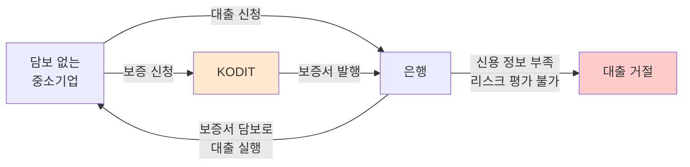

> 💡 은행은 *위험 분산이 어려운 한 건* 에 큰돈을 빌려주지 않는다. *KODIT가 위험을 떠안는다* 는 약속(보증서)이 있어야 *시장이 작동* 한다. 이게 *정책금융의 기본 논리*.

### 1.3 KODIT 정체성 한 줄 요약 (논술 도입부 활용)

> *"KODIT는 *담보 부족·정보 비대칭으로 자금조달이 어려운 중소·중견기업* 에 신용보증을 제공해 *국민 경제의 균형 발전* 에 기여하는 정책금융기관이다 (신용보증기금법 제1조 목적)."*

### 1.4 미션·비전·전략 (2025 업무가이드)

| 구분 | 내용 |
|---|---|
| **미션** | 기업의 미래 성장동력 확충과 국민경제 균형발전에 기여 |
| **비전** | 기업의 도전과 성장에 힘이 되는 동반자 (**Beyond Guarantee**) |
| **핵심가치** | 고객 · 성장 · 혁신 · 협력 |
| **경영방침** | 행복한 일터 / 고객과 함께 / **DDP 혁신**(Digital·Data·Platform) / 글로벌 리더 |
| **3대 전략목표** | ① **미래 성장동력 확충** (혁신성장분야 일자리 87만개 달성) / ② **금융서비스 혁신 선도** (융·복합 금융 140조원 신규 공급) / ③ **지속가능경영 기반 조성** (지속가능경영등급 최우수 달성) |

> 💡 **DDP (Digital·Data·Platform) 혁신** 은 *논술 답안 필수 키워드*. KODIT가 *디지털 전환의 정책금융기관* 임을 보여주는 정체성.

### 1.5 KODIT 일반 현황

| 항목 | 내용 |
|---|---|
| **창립** | 1976.06.01 (신용보증기금법 1974 제정) |
| **법적 성격** | *비영리 특수법인* (신용보증기금법) |
| **본점 소재지** | **대구 동구** (2014.12.21 서울 → 대구 이전) |
| **본부조직** | 4부문 14부 5실 (경영기획·신용사업·전략사업·경영지원) |
| **영업조직** | 영업본부 9, 영업점 110, 재기지원단 15, 채권관리단 11 |
| **해외사무소** | 베트남 하노이 (2026년 *독일·유럽*, *미국·북미* 추가 예정) |

### 1.6 핵심 연혁 (시험 출제 가능성)

| 연도 | 사건 |
|---|---|
| 1976.06.01 | **신용보증기금 창립** (신용보증기금법 1974 제정) |
| 1989.04.01 | 기술보증기금으로 *기술신용보증업무 이관* (KODIT vs KIBO 분리) |
| 1995.05.30 | *산업기반(SOC) 신용보증기금* 설치 |
| 1997.09.01 | 어음보험업무 실시 |
| 2000.07.01 | 유동화회사 특별보증제도 실시 (P-CBO 출발) |
| 2004.03.02 | *매출채권보험* 업무 시작 |
| 2005.03.25 | 한국기업데이터(주)로 신용정보업무 이관 |
| 2009.02.06 | 신보법 개정 — 유동화회사보증업무 *법제화* |
| 2013.05.28 | 신보법 개정 — *보증연계투자업무 법제화* |
| **2014.12.21** | **본점 대구 이전** ★ |
| 2019.06.18 | 문화산업완성보증 업무 개시 |
| 2020.03.18 | *신용정보업 면허* 취득 |
| 2020.12.24 | *벤처확인 전문 평가기관* 지정 |
| 2021.05.24 | **녹색보증** 업무 개시 |
| 2021.12.31 | 신보법 개정 — *중소기업 팩토링 법제화* |
| 2022.06.30 | **녹색 공정전환 보증** 업무 개시 |
| 2023.12.29 | 신보법 개정 — *팩토링 대상을 중견기업으로 확대* |

> 💡 시험에 *"KODIT 본점은?"* → **대구**. *"녹색공정전환보증 업무 개시일은?"* → **2022.6**.

### 1.7 KODIT FRIENDS — 마스코트 6종 (사업 부문별)

| 마스코트 | 부문 |
|---|---|
| 코디 | 신용보증 |
| 그링 | 그린파이낸싱 (녹색보증) |
| 보니 | 스타트업 지원 |
| 든든해 | 신용보험 |
| 서피 | 경영지도 |
| 포포 | 산업기반 신용보증 |

> 💡 마스코트 자체가 시험엔 안 나오지만, *KODIT의 6대 사업 부문* 을 외울 때 매개로 유용.

---

## 2. 본업 키워드 — 신용보증의 메커니즘

### 2.1 보증의 5대 주체

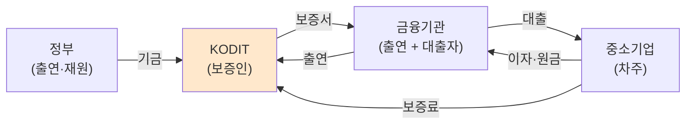

### 2.2 KODIT 주요업무 — 11가지 (2025 업무가이드)

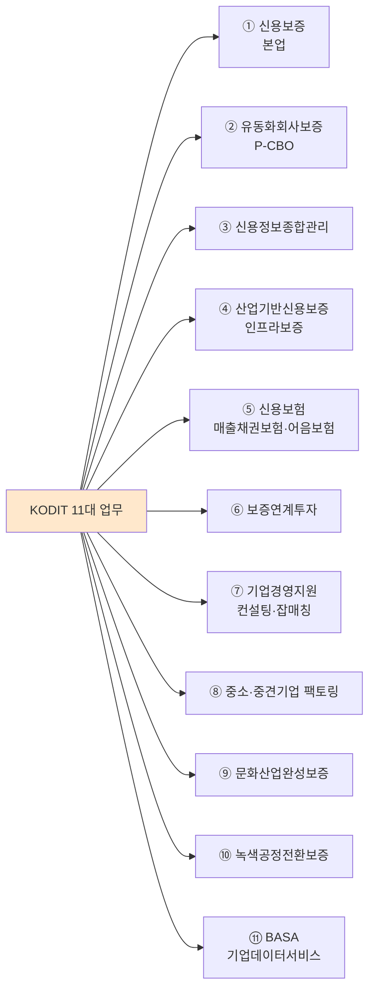

> 🎯 **시험 직출 가능성 높음**: 11가지 업무를 *4축* (본업·자본시장·정책·디지털) 으로 분류 가능.

### 2.3 보증의 종류 (7대 분류)

| 분류 | 내용 |
|---|---|
| **대출보증** | 일반운전자금·시설자금·무역금융·구매자금융·Network Loan·기술개발자금·할인어음 등 |
| **제2금융보증** | 농협·수협·한국농수산식품유통공사·중소벤처기업진흥공단·종합금융회사·보험회사·중소기업창업투자회사·상호저축은행 등 |
| **어음보증** | 지급어음·받을어음·담보어음에 대한 보증 |
| **이행보증** | 입찰·계약·차액·지급·하자보수 보증금 (보증상대기관: 정부·지자체·공공기관·금융회사·민간투자법 사업시행자 등) |
| **지급보증의 보증** | 신용장 개설 등 지급보증 |
| **납세보증** | 세금 분할납부·징수유예 시 담보 |
| **(전자)상거래담보보증** | 중소기업 (전자)상거래 대금지급채무 |

### 2.4 직접보증 vs 위탁보증

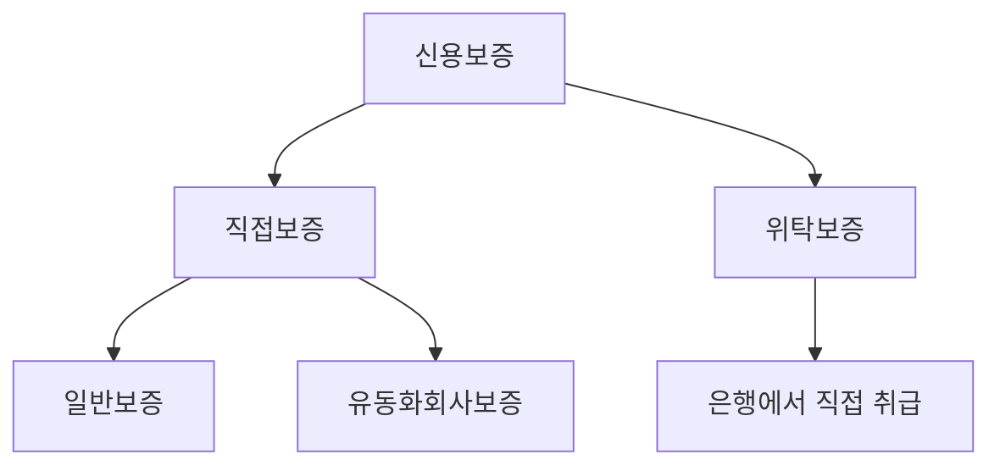

### 2.5 목적별 보증 카테고리 (정책 우대)

| 분류 | 내용 |
|---|---|
| **일반보증** | 운전자금·시설자금 등 통상 사업 자금 |
| **특별보증** | *정책 목적* 한시적 보증 (예: 코로나 특례, 청년창업, 재해복구) |
| **사회적경제·창업** | 사회적 기업·협동조합·예비창업자 대상 |
| **혁신성장·기술기업** | R&D·지식재산 기반 기술기업 |
| **수출·해외진출** | 해외 매출채권·수출이행 |
| **녹색·ESG** | 탄소중립·재생에너지·녹색공정전환 |

### 2.6 보증료(Fee) — *위험에 비례하는 가격*

> 보증료율 = 기본요율 ± 가산·감면. *기업의 신용등급, 보증 종류, 정책 우대* 에 따라 조정.

| 항목 | 수치 |
|---|---|
| **표준 보증료율 범위** | **연 0.5% ~ 3.0%** (대기업 3.5%) |
| 신용등급 ↑ | 요율 ↓ |
| 정책 우대 (혁신·청년·녹색·창업) | 요율 ↓ 0.2~0.7%p 차감 |
| 고위험 업종 | 요율 ↑ (가산) |

> 💡 보증료는 KODIT *주요 수입원* 중 하나. *기업이 부담하는 비용 ≠ 0* 이다 (시중 대출 이자 외 추가 비용).

### 2.7 보증이용 4단계 절차

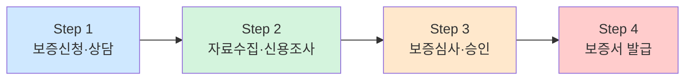

| 단계 | 핵심 활동 |
|---|---|
| ① 신청·상담 | 신보 ON-Biz 통한 비대면 신청 가능 |
| ② 자료수집·조사 | 신용조사 + 직·간접조사 + 현장조사 (담당자 출장) |
| ③ 심사·승인 | 신용평가 + 미래성장성 + 기업가치·기술력·기업가 정신 평가 |
| ④ 발급 | 비대면 약정 + 신용카드 보증료 결제 + 전자보증서 |

> 💡 *현장조사* 는 시험 함정에 자주: *"비대면이라 현장조사 없이 진행"* 같은 보기는 거짓.

### 2.8 매출채권보험 — *대표 부수 사업*

> 기업이 외상매출금(매출채권)을 *못 받을 위험* 을 KODIT가 보장. 거래처 부도·법정관리 등 위험 발생 시 *보험금 지급*.

| 측면 | 내용 |
|---|---|
| 가입 대상 | 매출채권 보유 중소기업 |
| 보장 범위 | 거래처 부도·지급불능 |
| 효과 | 기업의 *신용 거래 활성화*, *연쇄도산 방지* |

---

## 3. 자본시장 키워드 — *P-CBO·보증연계투자*

### 3.1 P-CBO (Primary Collateralized Bond Obligation, 신용보강 회사채)

> *신용도가 낮아 *단독으로 회사채 발행이 어려운* 중소·중견기업의 회사채* 를 *여러 건 묶어 SPV(특수목적법인) 가 ABS(자산유동화증권) 형태로 발행*. KODIT가 *후순위 신용보강* 을 제공해 *투자자가 안심하고 투자*.

#### 구조

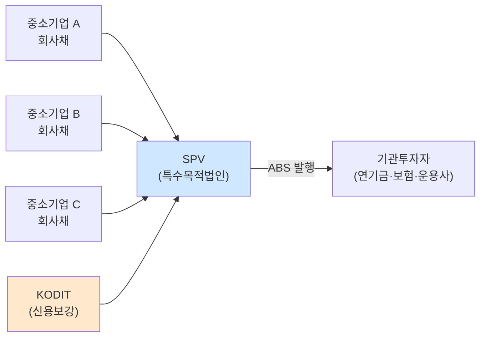

#### 효과

| 측면 | 효과 |
|---|---|
| 중소기업 | *은행 대출이 아닌* 자본시장에서 자금 조달 |
| 자본시장 | 회사채 시장 저변 확대 |
| 정책 | *직접금융 비중 ↑* — 산업금융의 균형 |

> 🎯 **시험 단골**: *"P-CBO 의 도입 배경 + 효과"* — 답안 키워드는 **신용도 낮은 중소·중견 → 자본시장 접근 → 직접금융 활성화**.

#### 2026년 *P-CBO 직접발행* 신규 도입 ★★★

> **2026년부터 KODIT가 *직접 P-CBO를 발행*** (기존 SPV 발행 방식 → 직접발행 병행). 2026년 첫 발행 위해 업무 프로세스 구축·발행조직 신설 추진 중.

| 항목 | 내용 |
|---|---|
| **발행 규모** | 연간 **7,500억원** 범위 |
| **금리 기준** | *국고채금리* (특수채 지위에 맞춰 변경) |
| **투자자군** | 기존 *소수 기관투자자* → *은행·증권사 등으로 확대* |
| **목적** | 기업의 *금융비용 절감* + 유통성 증대 |

> 💡 **논술 키워드**: *"KODIT가 발행 주체로 직접 참여 → 발행 안정성·신뢰도 ↑ + 투자자 저변 확대 → 중소기업 자금조달 비용 ↓"*. 2026년 신규 사업이므로 *논술에 거의 확정* 출제.

#### 유동화회사보증 구조 (구체)

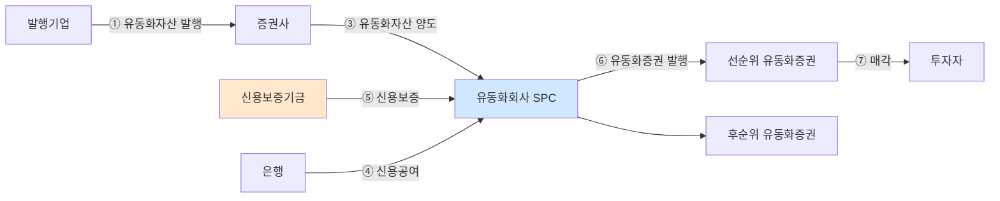

| 측면 | 핵심 |
|---|---|
| **선순위 유동화증권** | KODIT 신용보증으로 회사채등급 *AAA* 로 상향 → 직접금융시장 매각 |
| **후순위 유동화증권** | 발행 *개별 기업* 이 매입 (신용보강 의무) |
| **지원한도** | 중소기업 250억 / 중견기업 1,050억 / 대기업 1,500억 |
| **편입제한** | 채무불이행·CPA 감사의견 부적정·금융업 영위 |

### 3.2 보증연계투자 — *보증 + 지분 투자 결합*

> 보증서 발행에 더해 KODIT가 *해당 기업의 지분에 직접 투자* (또는 메자닌). *성장성 높은 혁신기업* 에 *부채금융 + 자본금융* 을 함께 제공.

| 비교 | 일반보증 | 보증연계투자 |
|---|---|---|
| 자금 형태 | 부채(대출) | 부채 + 지분 |
| 수익원 | 보증료 | 보증료 + *투자 회수 차익* |
| 적합 기업 | 일반 중소기업 | 혁신·고성장 |

### 3.3 산업기반채권 / 유동화 보증

> KODIT는 *유동화 시장(자산유동화증권 시장) 의 신용보강자* 로 기능. 부동산 PF 부실 시기에는 PF ABCP 시장 안정화 역할도 함.

---

## 4. 정책금융 키워드 — *특례보증·녹색·ESG·기술평가*

### 4.1 특례보증

> *정부 정책 목적* 에 따른 한시적·조건부 보증. *경제 위기·산업 전환* 시기에 *대규모 일시 공급*.

| 특례 종류 | 배경 |
|---|---|
| **코로나19 특례보증** (2020~) | 팬데믹 위기 대응 |
| **청년창업 특례** | 청년 창업자 자금 접근성 |
| **재해·재난 특례** | 자연재해·산업재해 피해기업 |
| **수출·환변동 특례** | 환율 급변동 대응 |
| **고용창출·일자리 특례** | 고용 유지·확대 기업 우대 |

### 4.2 녹색공정전환보증·무탄소에너지(CFE) 보증

> *2030 NDC(국가 온실가스 감축목표)* 와 *2050 탄소중립* 정책에 발맞춰 등장한 *녹색금융 전용 보증*.

| 상품 | 대상 |
|---|---|
| **녹색공정전환보증** | 제조업의 *공정 전환·설비 교체* — 탄소 다배출 공정을 저탄소로 |
| **무탄소에너지(CFE, Carbon Free Energy) 보증** | 재생에너지 + 원자력 + 수소 등 *무탄소 전원* 도입 |
| **친환경차·이차전지** | 전기차·수소차·이차전지 가치사슬 |

> 💡 *CFE* 는 *RE100* 과 다르다. **RE100은 재생에너지(태양·풍력 등) 100%**, **CFE는 *재생 + 원전·수소 등* 무탄소 전원 포함**. 한국은 RE100 보다 CFE 를 우선하는 정책 기조 (2024~).

### 4.3 ESG 보증·평가

> 환경(E)·사회(S)·지배구조(G) 측면에서 우수한 기업에 보증 우대 + ESG 평가 자체 모델 운영.

### 4.4 기술평가 (기술가치평가)

> 기업의 *기술력·지식재산(IP)* 을 *재무제표 외 가치* 로 평가. *기술평가등급(TCB, Tech Credit Bureau 모델)* 활용.

| 평가 요소 | 내용 |
|---|---|
| 기술성 | 혁신성·차별성·완성도 |
| 시장성 | 시장 규모·성장성 |
| 사업성 | 수익 모델·실현 가능성 |
| 경영진 | 기술 이해도·실행력 |

> 🎯 *재무가 약한 기술기업* 에게 *기술 자체를 담보처럼* 본다는 발상. *기술금융* 정책의 핵심 인프라.

### 4.5 데이터가치평가

> *기업이 보유한 데이터* 의 경제적 가치를 평가. *데이터가 무형자산으로 인정* 받는 흐름과 연계 (한국 *데이터 산업법* 2022).

| 평가 영역 | 내용 |
|---|---|
| 데이터 자체 | 양·품질·정합성·갱신 주기 |
| 활용 가능성 | 비즈니스 적용 범위·수익화 |
| 법적 권리 | 개인정보·저작권·결합 가능성 |

> 💡 *데이터가치평가* 는 *기술평가의 디지털 시대 확장판*. 기업이 *데이터 자체로 자금 조달* 가능하게 만드는 인프라.

---

## 5. 위험관리 키워드 — *대위변제·구상권·보증배수* ★

### 5.1 대위변제 (代位辨濟)

> 기업이 *대출 원리금을 못 갚을 때* — KODIT가 *기업 대신 은행에 갚음*. 그 순간부터 *KODIT 가 기업에 대해 채권자* 가 된다.

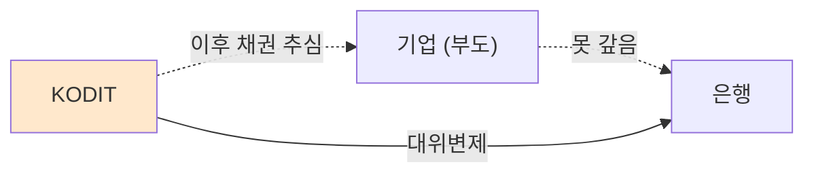

> 🎯 **대위변제율** = (대위변제액 ÷ 보증잔액) — *KODIT 위험관리의 핵심 KPI*. 경기 침체기에 ↑.

### 5.2 구상권 (求償權)

> 대위변제 후 KODIT가 *기업·연대보증인에게 *변제한 금액 회수를 청구할 권리***. *대위변제 → 구상권* 이 한 쌍.

| 단계 | 의미 |
|---|---|
| ① 대위변제 | KODIT가 *은행에* 대신 갚음 |
| ② 구상권 발생 | KODIT가 *기업/연대보증인에 대한* 채권자 |
| ③ 추심·회수 | 자산 환가·소송·채무 조정 |

### 5.3 보증배수 (운용배수)

> **보증배수 = 보증잔액 / 기본재산**. KODIT가 *자기 재원의 몇 배까지 보증을 발행* 했는지를 보여주는 핵심 건전성 지표.

| 보증배수 | 의미 |
|---|---|
| ↑ (높음) | 적은 재원으로 많은 보증 → *지원 효과 ↑*, *위험 노출 ↑* |
| ↓ (낮음) | 보수적 운용 → 안전, 시장 지원 부족 |

> 💡 *법정 한도*: 신용보증기금법은 *기본재산의 일정 배수* 까지만 보증 발행 가능하도록 규제. *보증배수 = 정책 효과와 건전성의 균형점*.

### 5.4 손실 흡수 구조

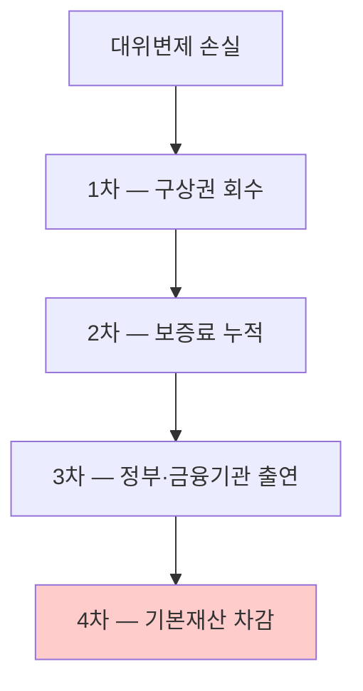

> 부실 → 회수 노력 → 회수 안 되면 *기금이 직접 흡수* 하는 다층 구조. 그래서 *기본재산 안정성* 이 *국민 부담* 과 직결.

---

## 6. AI · 디지털 키워드 — *KODIT 의 다음 10년*

### 6.1 AI 신용평가 (AI Credit Scoring)

> 전통 신용평가는 *재무제표 + 신용 거래 이력* 위주. *창업 초기 기업·매출 작은 기업* 은 *데이터가 부족해 평가 불가*. AI 신용평가가 이를 보완.

| 데이터 종류 | 예시 |
|---|---|
| **전통 데이터** | 재무제표·신용 거래·세금 납부 |
| **대안 데이터 (Alternative Data)** | 카드 매출·간이 영수증·상거래 패턴·SNS·공공 데이터 |
| **비정형 데이터** | 거래처 분포·계약서·뉴스 언급 |

> 🎯 *KODIT 도 자체 AI 신용평가 모델* (예: 비대면 신용평가 시스템) 을 운영해 *심사 시간 단축 + 사각지대 보완*.

### 6.2 대안 데이터 (Alternative Data)

> *전통 금융 데이터 외* 의 데이터로 신용도를 평가. *씬파일러(thin filer, 신용 정보 부족자)* 평가에 결정적.

| 출처 | 활용 |
|---|---|
| 통신비·공공요금 납부 | 결제 성실성 |
| 카드 매출 | 실시간 매출 흐름 |
| 전자세금계산서 | B2B 거래 규모 |
| 상거래 플랫폼 (배민·쿠팡) | 매출 다양화 |

### 6.3 마이데이터 (MyData) — 본인신용정보관리업

> 2020년 *신용정보법 개정* 으로 도입. *본인의 신용·금융 정보* 를 *통합 조회·관리·전송* 할 수 있는 권리. 2022년 본격 시행.

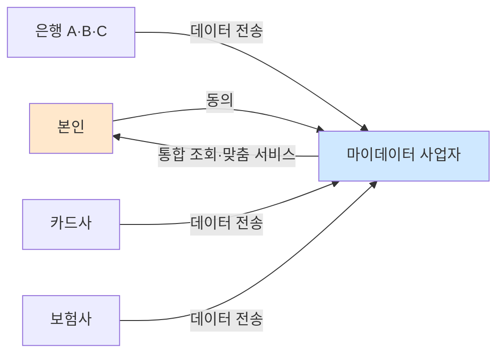

> 💡 KODIT 입장에서 마이데이터는 *기업 신용평가의 데이터 소스 확대* 기회. 기업 대표·임원의 개인 신용 정보까지 *동의 기반* 으로 결합 가능.

### 6.4 데이터 3법 (2020 시행)

> *개인정보보호법 + 정보통신망법 + 신용정보법* 통합 개정. KODIT 같은 금융기관에 직결되는 변화:

| 변화 | 의미 |
|---|---|
| **가명정보** 도입 | 통계·연구·공익 목적 *동의 없이* 활용 |
| **개인정보 결합** 허용 | *지정 결합전문기관* 통한 결합 가능 |
| **마이데이터** 시행 | 본인 신용정보 *전송 요구권* |
| **개인정보보호위원회** 설립 | 통합 감독기구 |

### 6.5 금융분야 AI 활용 가이드라인 (금융위·금감원, 2021)

> 금융권 AI 활용 시 준수해야 할 5대 원칙: *공정성·투명성·책임성·안전성·소비자권리 보호*. KODIT의 AI 신용평가도 이 가이드라인 적용.

> 자세한 내용은 [AI시스템 ② AI 윤리·EU AI Act·XAI](_posts/2026-05-05-ai-system-02-ethics-xai.md) 참조.

### 6.6 RegTech / SupTech

> 금융 규제 자체에 *기술* 을 결합한 분야.

| 용어 | 정의 |
|---|---|
| **RegTech (Regulatory Technology)** | 금융기관이 *규제 준수(compliance)* 를 자동화하는 기술 — AML·KYC·보고서 자동 생성 |
| **SupTech (Supervisory Technology)** | 금융 *감독기관* 이 *감독을 자동화* 하는 기술 — 이상 거래 탐지·실시간 모니터링 |

> 💡 KODIT도 *내부 통제·이상 거래 탐지·AML* 영역에서 RegTech 도입. *전통 금융 ↔ 핀테크 ↔ 정책금융* 경계가 흐려지는 흐름.

### 6.7 BASA — *Business Analytics System on AI* ★★★

> *KODIT 2025 업무가이드* (XI장) 에서 공식 정의 확인. **BASA = Business Analytics System on AI**. *48년간 축적한 국내 최대 기업DB* + *신용평가 노하우* + *빅데이터·AI 기술* 을 융합한 **공신력 있는 기업 데이터 플랫폼 서비스**.

#### 핵심 수치

| 항목 | 내용 |
|---|---|
| **포털** | www.basadata.com (PC·모바일 — 별도 앱 불필요) |
| **기업 DB 규모** | **약 140만개** 사업자 |
| **평가등급** | **매일 1회 재산출** (동태적 기업상태 + 등급 변동 추이) |
| **포함 정보** | 평가등급·1·2차 거래처 부도위험까지 반영한 종합 등급 |

#### BASA 5대 서비스

| 서비스 | 내용 |
|---|---|
| **AI 경영진단** | *온라인 One-Click* 신청 → *30분 이내* 40여 페이지 심층 경영진단 보고서 |
| **기업정보조회** | 140만개 기업정보 맞춤형 검색, 매일 평가등급 재산출 |
| **기업통계** | 타 기관 정보 결합한 차별화된 기업통계, 월 1회 업데이트 |
| **소상공인 전용 BASA** | 간이과세자·간편장부 대상자도 가능 — 자가진단 + *상권분석*·영업환경 분석 |
| **지원사업 성과분석** | 정부·지자체·공공기관 지원 정책 *수혜기업 성과분석* (재무 + 고용 등 비재무) |

> 🎯 **논술 답안 활용**: BASA는 *KODIT의 디지털 전환* (DDP 혁신) 의 *대표 사례*. *48년 축적 데이터 + AI* 의 결합으로 *AI 신용평가*·*대안 데이터* 흐름과 직결.

> 💡 **시험 함정 가능**: *"BASA는 신용보증 신청 전용 시스템이다"* → **거짓** (광범위한 기업 데이터 플랫폼). *"BASA 평가등급은 분기 1회 갱신"* → **거짓** (*매일 1회 재산출*).

---

## 7. 2026년 신규 사업 — *논술 직출 예상* ★★★

> 2026년 업무계획(2025.12 발표) 의 핵심 신규 사업들. 시험일이 2026.5.9 이므로 *논술 출제 가능성 매우 높음*. *배경(왜 도입했나) → 내용(무엇을 어떻게) → 효과* 흐름으로 외울 것.

### 7.1 5대 추진방향 (한 줄씩)

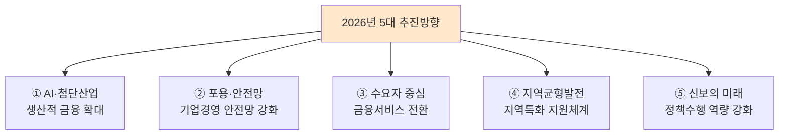

### 7.2 ABCDEF — 미래전략산업 (★★★ 외울 것)

> 2026년 *중점정책부문* 이 기존 *新성장동력* 에서 **미래전략산업** 으로 변경. 핵심 두문자어가 *ABCDEF*.

| 약어 | 산업 |
|---|---|
| **A** | **AI** (인공지능) |
| **B** | **Bio** (바이오) |
| **C** | **Culture** (문화콘텐츠) |
| **D** | **Defense** (방산·우주) |
| **E** | **Energy** (에너지) |
| **F** | **Factory** (제조) |

> 🎯 *"정부의 ABCDEF 산업 발굴·육성 정책에 발맞춰 KODIT가 미래전략산업을 중점정책부문으로 운용"*. 2026년 미래전략산업 보증 공급 *13.5조원* (신설).

### 7.3 (가칭) AI 첨단산업 우대보증 — *2조원 신설* ★★★

| 항목 | 내용 |
|---|---|
| **지원대상** | ABCDEF 산업 + 「국가첨단전략산업법」「조세특례제한법」 전략기술산업 (반도체·이차전지 등) |
| **규모** | **2조원** (정부출연금 + 자체재원) |
| **우대혜택** | 보증료율 *최대 0.7%p 차감* + 보증비율 *95%* |
| **보증한도** | 운전자금 10억 / 시설자금 최대 200억 |

### 7.4 (가칭) 딥테크 맞춤형 보증 프로그램 ★★

> AI 등 *딥테크 분야* 의 R&D~사업화에 *오랜 기간* 이 소요되는 특성을 고려해 *최장 8년간 안정적 자금* 지원.

| 단계 | R&D | 사업화 | 초기 스케일업 |
|---|---|---|---|
| **지원한도** | 20억 | 40억 | **70억** |
| **지원기간** | 2년 | Credit Line 3년 | Credit Line 3년 |

> 💡 기존 *최장 3년·최대 10억* → *최장 8년·최대 70억* 으로 *7배 확대*.

### 7.5 (가칭) NEST AI LAB — AI 스타트업 보육 ★★

> 금융지원·멘토링 + **AI 기술이전** + **AI 학습용 데이터 제공** 까지 원스톱으로 제공하는 *AI 실험실 같은 보육공간*. 기존 *Start-up NEST* + *AI LAB* 통합.

| 기존 NEST | 추가 AI LAB |
|---|---|
| 금융지원(R&D·사업화 자금) | AI 원천기술 개발 지원 (기술이전) |
| 엑셀러레이팅 | AI 학습용 데이터 제공 |
| 기술 멘토링·보육공간 | AI 역량 강화 교육 |

### 7.6 금융부문 AI 선도기관

> 기획재정부 「공공기관 AI 활용 활성화 방안」 에 따라 **2025.9월 KODIT가 금융부문 AI 선도기관으로 선정**. 역할은 *AI 도입·활용 자문, 혁신성과 공유*.

#### 데이터 안심구역

> 「데이터 산업진흥 및 이용촉진에 관한 기본법」에 따라 지정된 건물·시설. *데이터 유출 없이 기업 데이터를 안전하게 분석·활용* 가능. AI 산업의 *데이터 부족 문제* 해소.

### 7.7 (가칭) 장래채권 팩토링 — 기존 팩토링 확장 ★

> 기존 팩토링은 *생산·납품 *이후* 발생한 매출채권* 만 대상. 2026년 *계약서에 근거한 *향후 발생 예정 매출채권*(장래채권)* 까지 확대해 *공급계약 체결 직후 생산자금 조달* 가능.

### 7.8 K-택소노미 적합성 판단 절차 — 녹색금융 활성화 ★★

> *K-택소노미(한국형 녹색분류체계)* — *어떤 경제활동이 녹색에 해당하는지* 의 한국 공식 기준.
>
> KODIT가 *K-택소노미 적합성 판단 절차* 를 통해 *녹색경제활동* 수행 기업이 *저리 자금* 조달 가능하도록 **녹색여신 검토서** 제공 → 은행이 *우대금리* 적용.

| 흐름 | 역할 |
|---|---|
| KODIT | 녹색여신 검토서 제공 |
| 은행 | 검토서 받은 녹색여신에 *우대금리* 적용 |
| 기업 | 저리 자금으로 *녹색경제활동* 수행 |

### 7.9 위기대응 특례보증 (2025.5월 신설)

> 美 관세조치, 산업위기 등에 대응. 2026년 보증총량 *2.6조원* (확대 운용).

| 시점 | 내용 |
|---|---|
| 2025.5 | *추경사업* 으로 도입 — 정부출연금 1,000억 + 자체재원 1,400억 → 3조원 공급 |
| 2026 | 2.6조원 운용 (운용배수 16.2배 — 5종 보증 중 가장 높음) |

### 7.10 그 외 신규 사업

| 사업 | 핵심 |
|---|---|
| **수출 다변화 특례보증** | 한도 0.5조 → **0.8조** 확대 (美 관세 대응) |
| **부실특례 제도** | 재해·재난 피해 기업의 *부실처리 유보* + 정상화 지원 |
| **연대보증 면제 확대 (유동화보증)** | *책임경영* 이행 중소기업 대상 |
| **(가칭) 지역 성장엔진 우대보증** | 동남권(조선·해양·자동차·우주항공) / 호남권(AI·미래모빌리티·재생에너지) 등 권역별 |
| **지역특화 금융허브** | *부산해양금융허브(동남권)* 등 신설 추진 |
| **산학연 클러스터 확대** | 대구·경북(영남대), 충청(충남대) → 2026 *호남권(전남대)*, 강원권, 부산경남권 |
| **AI·데이터 기반 서비스 혁신** | 고객 맞춤형 상품추천·정책자금 종합정보 서비스 |

---

## 8. 2026년 핵심 수치 — *재정 건전성과 보증 총량*

> 2026년 업무계획에서 *논술 답안에 *반드시 포함되면 좋은 수치*.

### 8.1 신용보증 총량 (조원)

| 구분 | 2025년 계획 | 2026년 계획 | 증감 |
|---|---:|---:|---:|
| **고유사업** (소계) | 73.3 | **75.4** | +2.1 |
| 일반보증 | 61.3 | 61.3 | — |
| 위기대응 특례보증 | (신설) | **2.6** | +2.6 |
| 유동화보증 | 12.0 | 11.5 | △0.5 |
| **한시사업** (소계) | 2.3 | 1.1 | △1.2 |
| **합계** | 75.6 | **76.5** | +0.9 |

### 8.2 중점정책부문 공급계획 (조원)

| 구분 | 2025 | 2026 | 비고 |
|---|---:|---:|---|
| 경제기반 강화 | 38.5 | 39.0 | 창업·수출·주력산업 |
| 경제활력 제고 | 20.5 | 22.0 | 고용창출·**미래전략산업(13.5)** |
| **합계** | **59.0** | **61.0** | +2.0 |

### 8.3 재정 건전성 지표 (★ 외울 것)

| 지표 | 2026년 목표 |
|---|---|
| **일반보증 부실률** | **4.5% 이내** |
| **일반보증 운용배수** | **12.5배 이내** |

### 8.4 운용배수 전망 (보증종류별)

| 구분 | 2025 운용배수 | 2026 운용배수 |
|---|---:|---:|
| 일반보증 | 8.5 | 9.2 |
| **위기대응 특례보증** | 6.3 | **16.2** ★ |
| 유동화보증 | 2.6 | 2.6 |
| 소상공인 위탁보증 | 3.2 | 0.9 |
| 저금리 대환보증 | 3.5 | 3.2 |
| **총보증** | 6.1 | **6.5** |

> 💡 위기대응 특례보증의 운용배수가 *16.2배* 로 가장 높음 — *작은 재원으로 큰 위기 대응* 한다는 정책적 의미.

---

## 9. 논술 답안 체크리스트

논술 답안에 *반드시 들어가야 할 요소* 들. 글의 형식보다 *내용의 밀도* 가 점수를 가른다.

- [ ] *구체 사례 1개 이상* (예: 코로나 특례보증 효과, P-CBO 발행 규모)
- [ ] *수치·지표 1개 이상* (예: 보증잔액, 대위변제율, 보증배수)
- [ ] *법령·정책 명* 명시 (예: 신용보증기금법, 데이터 3법, AI 기본법)
- [ ] *최근 1~2년 정책 변화* 반영 (예: CFE, AI 기본법, 마이데이터 2.0)
- [ ] *KODIT 의 역할* 을 *정부·은행·기업* 관계에서 명확히
- [ ] *균형 시각* — 단순 옹호 ✗, *한계와 보완* 도 함께
- [ ] *결론은 *실행 가능한 제언* 으로* — 추상론 ✗

---

## 10. 시험 직전 1분 요약 (논술용)

### 핵심 키워드 매트릭스

| 영역 | 키워드 |
|---|---|
| **본업** | 신용보증·일반보증·특별보증·매출채권보험·보증료(0.5~3.0%) |
| **자본시장** | P-CBO·**P-CBO 직접발행(2026 신규)**·보증연계투자·유동화·SPV·ABS |
| **정책금융** | 특례보증·기술평가·데이터가치평가·녹색공정전환보증·**K-택소노미** |
| **2026 신규 ★★★** | **ABCDEF**·AI 첨단산업 우대보증(2조)·딥테크 8년 70억·NEST AI LAB·금융부문 AI 선도기관·데이터 안심구역·장래채권 팩토링·위기대응 특례보증 |
| **위험관리** | 대위변제·구상권·보증배수·기본재산·**부실률 4.5%**·운용배수 12.5배 |
| **AI·디지털** | **BASA(Business Analytics System on AI)**·AI 신용평가·대안 데이터·마이데이터·데이터 3법·DDP 혁신 |
| **법령·기관** | 신용보증기금법·금융위·**대구 본점**·신용보증재단(별도)·기술보증기금(별도) |
| **미션·비전** | Beyond Guarantee·DDP 혁신·140조 신규·87만 일자리 |

### KODIT vs 형제 기관 — 헷갈리지 않기

| 기관 | 본업 |
|---|---|
| **KODIT (신용보증기금)** | *전국 단위* 일반 중소기업 신용보증 |
| **KIBO (기술보증기금)** | *기술기업* 전문 보증 (별도 법) |
| **지역신용보증재단** | *시·도 단위* 소상공인 보증 |
| **HUG (주택도시보증공사)** | *주거·주택사업* 보증 |

> 💡 셋이 자주 헷갈린다. *KODIT = 일반 중소기업, KIBO = 기술기업, 지역신보 = 소상공인* 으로 외울 것.

### 자주 헷갈리는 한 마디

- *"KODIT가 직접 대출한다"* → **거짓** (보증서만 발행, 대출은 은행)
- *"보증료는 정부 보조금이다"* → **거짓** (기업이 부담하는 비용)
- *"P-CBO 는 SPV 발행만 한다"* → **거짓** (2026년부터 *KODIT 직접발행* 도 개시. 7,500억원/년)
- *"BASA 는 신용보증 신청 시스템이다"* → **거짓** (Business Analytics System on AI — 기업 데이터 플랫폼)
- *"BASA 평가등급은 분기 1회 갱신"* → **거짓** (*매일 1회 재산출*)
- *"KODIT 본점은 서울"* → **거짓** (2014.12 *대구* 이전)
- *"미래전략산업 = 新성장동력"* → **거짓** (2026년부터 *新성장동력 폐지 → 미래전략산업 신설*. ABCDEF)
- *"대위변제 = KODIT 의 손실 확정"* → **거짓** (구상권 회수 후 *순손실* 이 진짜 손실)
- *"RE100 = CFE"* → **거짓** (CFE는 원전·수소까지 포함)
- *"마이데이터는 모든 정보를 자동 수집"* → **거짓** (본인 *동의·전송 요구권* 기반)
- *"K-택소노미는 EU 택소노미와 동일"* → **거짓** (한국형, 원전·LNG 인정 범위 다름)

### 빈출 답안 패턴

| 빈출 유형 | 풀이 키 |
|---|---|
| 정책 도입 의의 | *시장실패 → 정책금융 필요성 → KODIT 역할* |
| 사업 모델 비교 | *기존 한계 → 대안 → KODIT 적용 가능성* |
| AI/디지털 전환 | *대안데이터 + 마이데이터 + AI 모델 + 윤리·규제* 4축 |
| 위험관리 평가 | *보증배수·대위변제율·구상권 회수율* 3지표 |

---

## 11. 시험 후 학습 (선택 — 시험과 무관)

KODIT 같은 정책금융 도메인에서 더 깊이 공부하려면:

- **신용보증기금법 + 시행령·시행규칙** 직접 읽기
- **금융위 보도자료** 매월 한 편씩 — *정책 흐름* 파악
- **OECD·IMF** 의 *공적 신용보증 보고서* — 국제 비교
- **KIBO 도 함께** — KODIT vs KIBO 차이가 *시험에 자주*
- **금융감독원 *금융권 AI 활용 가이드라인* 정독**

---

## 12. 참고 문헌 (References)

[^1]: 신용보증기금. (2025). *2025 KODIT 업무가이드 (KODIT Service Guide)*. — 본 글 핵심 출처

[^2]: 신용보증기금. (2025.12). *2026년도 업무계획(안)*. — 신규 사업·수치 출처

[^3]: 신용보증기금법(법률 제19565호, 일부개정 2023). 국가법령정보센터.

[^3]: 금융위원회·금융감독원. (2021). *금융분야 AI 활용 가이드라인*.

[^4]: 금융위원회. (2020). *데이터 3법 개정 안내*.

[^5]: 한국은행. *통화·신용 보고서* — P-CBO·정책금융 동향 정기 분석.

[^6]: 산업통상자원부. (2024). *무탄소 에너지(CFE) 정책 추진 방향*.

[^7]: 환경부·금융위. (2024). *녹색금융 추진 계획*.

[^8]: 데이터산업진흥법(법률 제18475호, 2022 시행).

### 보조 자료

- 본 위키 [AI시스템 ② AI 윤리·EU AI Act·XAI](_posts/2026-05-05-ai-system-02-ethics-xai.md) — XAI·금융 AI 가이드라인 상세
- 본 위키 [AI 심화 ⑥ 데이터마이닝·차원축소](_posts/2026-05-04-ai-advanced-data-mining.md) — 추천·연관규칙·메타학습
- KODIT 연차보고서·지속가능경영보고서 — 보증잔액·보증배수·대위변제율 *실제 수치* 확인용

> ⚠️ 본 글의 *수치·약어·세부 사업명* 은 시험 직전 *KODIT 공식 홈페이지/보도자료* 에서 한 번 더 확인 권장. 정책금융은 매년 *상품 개편·신설* 이 있어 자료가 쉽게 낡는다.

---

## 13. 다음 학습

- 📌 **5/6~5/8 회독 계획** — [별도 안내]
- 📌 **5/9 시험일** — KODIT 인공지능시스템 + 인공지능개론 + 알고리즘분석 + NCS + 논술
- 📌 시험 후 — *Obsidian + Claude Code + Hermes Agent* 도구 스택 정리
