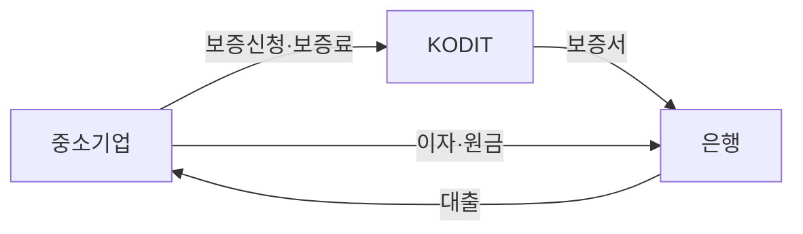

> **이 글의 목적**
>
> 신용보증기금(KODIT) 2026 상반기 채용 시험을 준비하면서 D-14부터 D-1까지 모은 *모든 학습 자료를 한 페이지에 압축* 한 마스터 통합본. 시험 가는 길에 *3번 회독* 할 수 있도록 정리했다.
>
> 통합 출처:
> - 신용보증기금 *2025 업무가이드* + *2026년도 업무계획(안)* (공식 자료)
> - KODIT 논술 14년 기출 (2021~2024)
> - 2025 비상경 채용 필기시험 기출 모범답안
> - 본인 학습 카드 21장 + Part 10 신규 카드 10장 + Part 11 답안 골격
> - 거시경제·금융시장·정책금융 핵심 개념
>
> **사용 시점**:
> - 자기 전 1번 (Part 0 디브리핑 + 절대 외울 8가지)
> - D-1 1번 (Part 1 카드 21장 + Part 11 답안 골격)
> - 시험 직전 1번 (압축 카드 + 인과 사슬 5개)
>
> **시험을 준비하시는 분이 있다면** 이 글이 도움이 되길 바란다. 사실 관계는 시험 직전 *KODIT 공식 자료* 로 한 번 더 검증할 것을 권한다.

---

<a id="part-0"></a>
## 🌙 Part 0. 시험 가는 길 5분 디브리핑

### 0-1. 절대 다시 틀리지 말 것 (치명적 3개)

| 항목 | 잘못 | 정답 |
|---|---|---|
| **응시기관 이름** | ~~신용보증공단~~ | **신용보증기금 (KODIT)** |
| **역선택 정의** | ~~한계기업 중 좀비 선택~~ | **우량 이탈, 불량 잔존** (사전, 은행 식별 실패) |
| **약술 분량** | ~~651자~~ | **300자 ± 20** (압축력 평가가 본질) |

### 0-2. 자기 전 30초 회상 — 눈 감고 떠올릴 것

```text
① 응시기관    → "신용보증기금 (KODIT)" / 이사장 강승준 / 본점 대구
② 역선택      → "우량 이탈, 불량 잔존"
③ 도덕적 해이 → "지원 후 태도 돌변"
④ 5대 수단    → "보·대·간·디·비" (보증/대출/간접/디지털/비금융)
⑤ 약술 분량   → "300자 ±20"
⑥ 금융시장 속도 → "채권 → 외환 → 주식 → 실물"
⑦ KODIT 5단계 → "Easy-Start → 뉴본펭귄 → 리틀펭귄 → 퍼스트펭귄 → Pre-ICON"
⑧ P-CBO       → "유동화회사보증"
⑨ 한계기업 3분화 → "좀비(출구) / 경영위기(회생) / 벤처(성장)"
⑩ ABCDEF      → "AI · Bio · Culture · Defense · Energy · Factory"
```

### 0-3. 신규 외울 7가지 (D-3 종합)

> 카드 21장 늘었지만 *진짜 새로 외울 것* 은 이 7개.

1. **신용보증기금** (응시기관 정확한 이름)
2. **역선택 = 우량 이탈, 불량 잔존**
3. **P-CBO = 유동화회사보증**
4. **5대 수단 = 보·대·간·디·비**
5. **KODIT 5단계 = Easy-Start → 뉴본펭귄 → 리틀펭귄 → 퍼스트펭귄 → Pre-ICON**
6. **퍼스트펭귄 = KODIT 대표 스타트업 지원**
7. **한계기업 3분화 = 좀비(출구) / 경영위기(회생) / 벤처(성장)**

### 0-4. 검증된 강점 3개 (자신감)

- ✅ **이자보상배율**: 영업이익÷이자비용, 3년 연속 1 미만 → 한계기업
- ✅ **이차보전**: "정부가 시장금리와 정책금리 차액 이자를 보조" 정의 정확
- ✅ **메타인지**: 베끼면 베꼈다, 모르면 모른다 인지

### 0-5. 🚨 결정적 약점 — *D-Day 까지 반드시 잡을 것*

> **"카테고리/항목 N개 요구 시 1~2개에서 멈춤"**
>
> - 2025 비상경 기출 자가 진단 결과: 6개 카테고리 요구 → *1개만* 작성 (서술형 30~40점)
> - 약술 공매도: 장점 3개 요구 → *2개만* 작성

**해법 — *빈칸 채우기 훈련***:
- 모르는 항목도 *한 줄이라도* 던지기
- 6개 카테고리 요구 → 6개 헤더 *먼저* 깔고 채우기
- "첫째·둘째·셋째" 시작하면 *반드시* 끝까지

### 0-6. 자기 작성 답안 자가진단 (2026.5.2 기준)

| 답안 | 본인 결과 | 모범답안 격차 |
|---|---|---|
| 공매도 약술 | 🟡 60~70점 | 장점 둘째 누락 + 단점 사실관계 오류 |
| 예대마진 약술 | 🟢 80~85점 | 정책금융 연결 누락 |
| 중소기업 정의 | 🟡 60~70점 | 격식체 부족, 통계 부정확 |
| 이자보상비율 | 🟢 80~85점 | 거시 영향 한 줄 추가 필요 |
| **6대 지원방안** | 🔴 30~40점 | **6개 중 1개만 작성** ★ 약점 |

### 0-7. 🔥 KODIT 논술 14년 기출 빈도 (2021~2024) — *최우선 학습 영역*

> Part 10 상세 분석 참조. *영역별 출제 빈도* 가 곧 *2025·2026 출제 가능성*.

| 영역 | 빈도 | 키워드 |
|---|---|---|
| **ESG / 녹색금융** | **★★★ 4회** | ESG채권·G(지배구조)·녹색금융·K-택소노미 |
| **디지털·AI·CBDC** | **★★ 3회** | 디지털 전환·금융 AI 리스크·CBDC |
| **기업부실·정책금융** | **★★ 3회** | 워크아웃·기업부실 예측·사회적 기업 |
| **정책금융 역할** | **★★ 2회** | 시장실패·정책금융 4대축·재무 사각지대 |
| **거시경제 시사** | **★★ 2회** | 빅컷(2024)·리카르도 대등 정리(2021) |
| **지식재산금융** | ★ 1회 | IP 가치평가·기술금융 |
| **DSR** | ★ 1회 | 가계대출 규제·찬반 |
| **연대보증·재창업** | ★ 1회 | 연대보증 폐지·재기 지원 |

---

<a id="part-1"></a>
## 🗂 Part 1. 핵심 카드 21장 (백지 4줄 형식)

### 🔵 카테고리 A: 거시·통화정책 (4)

#### 카드 1. GDP갭 (Output Gap) ⭐⭐⭐

```
① 정의: 실제GDP - 잠재GDP. 양(+)이면 초과수요·인플레, 음(-)이면 수요부족·침체
② 식: GDP갭률(%) = (실제GDP - 잠재GDP) / 잠재GDP × 100
③ 출처: 한국은행 「경제전망보고서」에서 추정·발표
④ 시사점: 인플레의 선행 결정요인. 통화·재정정책 운용 핵심 판단지표
```

> **잠재GDP 두 관점**: ① 요소투입(노동·자본 완전고용 시 최대 GDP) ② 물가안정(인플레 가속 없이 달성 가능한 최대 GDP)

#### 카드 2. 기준금리 (Base Rate) ⭐⭐⭐

```
① 정의: 한은 금융통화위원회가 결정하는 정책금리. 실체는 7일물 RP금리
② 현재값: 2026.5 현재 연 2.50% (4월 7회 연속 동결)
③ 출처: 2008.3 운용목표를 콜금리에서 7일물 RP금리로 변경
④ 시사점: 통화정책 핵심 수단. 한미 금리역전 (한 2.50% vs 미 3.75~4.00%)
```

> **❗ 약술 출제 패턴**: "기준금리 인상이 환율·물가에 미치는 영향"
> - 환율: 내외 금리차 확대 → 자본 유입 → 원화 강세 → 환율 하락
> - 물가: **총수요 경로(직접) + 환율 경로(간접) 둘 다 써야 만점**
>   - 직접: 차입비용↑ → 소비·투자↓ → 총수요↓ → 물가↓
>   - 간접: 환율↓ → 수입물가↓ → 물가↓

#### 카드 3. 양적완화 QE (Quantitative Easing) ⭐⭐⭐

```
① 정의: 정책금리가 실효하한(ZLB) 도달 시 중앙은행이 장기국채·MBS를 대규모 매입하는 비전통적 통화정책
② 메커니즘: 본원통화 공급 → 장기금리 직접 인하 → 자산가격↑ → 소비·투자 자극
③ 반대 개념: QT (양적긴축) — 만기도래 채권 재투자 중단. Fed 2025.12.1 QT 공식 종료
④ 시사점: 가격(금리)이 아닌 양(유동성)을 조절. 중앙은행 대차대조표 큰 폭 확대
```

| 구분 | 기준금리 | QE |
|---|---|---|
| 조절 대상 | 가격(금리) | 양(유동성) |
| 영향 | 단기금리 | 장기금리 |
| 시점 | 평상시 | ZLB 도달 시 |

#### 카드 4. 테일러 준칙 (Taylor's Rule) ⭐⭐

```
① 정의: 중립금리·현재인플레이션·물가갭·GDP갭의 가중합으로 적정 정책금리 산출
② 식: 목표금리 = 중립금리 + 현재인플레이션 + 0.5×물가갭 + 0.5×GDP갭
③ 출처: 1993 존 테일러(스탠퍼드大) 제안. 한은은 참고지표로 활용
④ 시사점: ⓐ 물가안정·경기안정 이중목표 균형 ⓑ 테일러 원칙(인플레 1%p↑ 시 명목금리 1%p 이상↑) ⓒ 통화정책 투명성·신뢰성 제고
```

> **❗ 헷갈림**: 식의 첫 항 = **중립금리(r*)**, 결과값 = **목표금리(i_t)**. 둘 다 "기준금리"가 아님.

### 🟢 카테고리 B: 외환·국제금융 (2)

#### 카드 5. 환율 영향 ⭐⭐⭐

```
① 정의: 자국통화 vs 외국통화 교환비율 (한국은 통상 1달러당 원화 가격)
② 현재값: 2026.4.28 약 1,473원/USD (2025.10~ 고환율 사태 지속)
③ 영향:
   - 환율↑ (원화 약세): 수출 유리, 수입 불리, 수입물가↑ → 인플레 압력
   - 환율↓ (원화 강세): 수출 불리, 수입 유리, 해외여행 부담↓
④ 시사점: 중소기업은 환헤지 수단 부족 → 양면 모두 정책지원 필요
```

> **❗ 헷갈림**: 환율 상승 = 원화 가치 **하락** = 원화 **약세** = 평가절하. 수출기업 매출 측정 단위는 *원화*. "달러 기준 매출 감소"는 함정.

> **환율 결정 5요인**: ① 금리차 (한국>미국 → 원화 강세) ② 경상수지 흑자 → 강세 ③ 한국 물가↑ → 약세 ④ 외국인 매수 → 강세 ⑤ 정치·지정학 리스크↑ → 약세

#### 카드 6. 한미 금리역전 ⭐⭐⭐

```
① 정의: 미국 연방기금금리가 한국 기준금리를 상회하는 현상
② 현재값: 한 2.50% vs 미 3.75~4.00% (격차 1.25~1.50%p 역전)
③ 인과 사슬 (★서술형 핵심★):
   금리역전 → 자본 유출 → 원화 약세·환율↑ → 수입물가↑·인플레 압력↑ → 한은 정책 딜레마
④ 정책 딜레마:
   - 금리 인상 → 자본 유출 차단·환율 안정 BUT 가계부채·경기 부담
   - 금리 동결 → 가계·경기 보호 BUT 자본 유출·환율 상승 지속
```

### 🟡 카테고리 C: 은행·금융시장 (2)

#### 카드 7. 예대마진·예대금리차 ⭐⭐⭐

```
① 정의: 대출금리 - 예금금리 (%p). 은행 핵심 이자수익원
② 현재값: 2026.3 5대 은행 평균 가계예대금리차 1.51%p (4년 만에 최대 확대)
③ 친척 개념: NIM (순이자마진) = (이자수익-이자비용)/이자수익자산 → 더 정확한 수익성 지표
④ 시사점: 예대금리차 확대 → 중소기업 자금조달 비용↑ → 신용경색 → 금융 갭 심화
   → 정책금융기관 보증으로 신용위험 흡수 필요
```

> **금리 변동 따른 예대마진**:
> - 인상 시 → 마진 **확대** (대출금리 빠르게 ↑, 예금금리 더디게 ↑)
> - 인하 시 → 마진 **축소** (대출금리 빠르게 ↓, 예금금리 *하방경직성*)

> **예대금리차 공시제도** = 통화정책 파급효과 실효성 지표.

#### 카드 8. 환매조건부매매 (RP, Repo) ⭐⭐⭐

```
① 정의: 채권 매도자가 일정 기간 후 미리 정한 가격으로 다시 매수 약정. 형식은 매매, 실질은 채권담보부 단기 자금거래
② 한국 기준금리 = 7일물 RP금리 (2008.3~)
③ 단기금융시장 RP 4대 기능:
   ⓐ 금융기관 단기 자금조달·운용 수단
   ⓑ 담보부 거래로 신용위험 완화
   ⓒ 채권시장 유동성 제고
   ⓓ 한은 공개시장운영 핵심 수단
④ 시사점: 콜시장과 함께 단기자금시장 양대 축 (RP 거래규모가 콜의 수십 배)
```

> **❗ 헷갈림**: RP 매도 = **자금조달**, RP 매수 = **자금운용** (반직관)

### 🔴 카테고리 D: 기업재무·신용 (3)

#### 카드 9. 부채비율 (D/E Ratio) ⭐⭐⭐

```
① 정의: 부채총계 ÷ 자기자본 × 100 (%). 자기자본 대비 부채의존도
② 임계점: 200% (1997 외환위기 후 관행상 기준)
③ 200% 초과 시 4대 리스크:
   ⓐ 재무 레버리지 위험 (자기자본 완충력 부족)
   ⓑ 이자비용 가중 (이자보상배율 악화)
   ⓒ 유동성·차환 위험 (롤오버 실패 시 자금경색)
   ⓓ 신용등급 하락 압력 (악순환)
④ 시사점: 부채비율 = 부채/자기자본 (★ 부채/총자산 아님 ★)
```

#### 카드 10. 한계기업 (좀비기업) ⭐⭐⭐

```
① 정의: 3년 연속 이자보상배율(ICR) < 1인 기업
② 식: ICR = 영업이익 ÷ 이자비용 (1배 미만 = 영업이익으로 이자도 못 갚음)
③ 현황: 한국은행 발표 외감기업의 약 15% 수준 (지속 증가)
④ 거시경제 4대 부정적 영향:
   ⓐ 자원배분 왜곡 (잠재성장률 하락)
   ⓑ 금융기관 부실채권 확대
   ⓒ 신용경색 (정상기업까지 자금난)
   ⓓ 거시충격 증폭 (실업·내수 악순환)
```

> **ICR 해석**:
> - ICR ≥ 3 : 양호
> - 1 ≤ ICR < 3 : 주의
> - **ICR < 1 : 위험 — 본업 이익으로 이자조차 못 갚음**

#### 카드 10-A. 한계기업 3분화 ★★★ (좀비 vs 경영위기 vs 벤처)

> **핵심 통찰**: ICR<1 하나로 셋을 구분 불가. 결정적 차이는 *지속기간 + 회생가능성*.

| 구분 | 좀비기업 | 경영위기 | 벤처 |
|---|---|---|---|
| **ICR** | 3년 연속 < 1 | 1~2년 < 1 | < 1일 수 있음 |
| **시점성** | 만성 (구조적) | 일시적 | 잠재 성장기 |
| **본질** | 회생 가능성↓ | 사업모델 건전 | 적자지만 미래 흑자 |
| **추가 식별** | 영업현금흐름 ⊖, 매출 정체 | 부채비율 급등, 차환 실패 | 매출 성장률, R&D 비중 |
| **🎯 KODIT 처방** | **출구 유도**<br>법정관리·청산 | **회생 지원**<br>워크아웃·자율협약 | **성장 지원**<br>기술보증·투자·BASA |

> **🚨 답안 함정**: "ICR<1이면 다 좀비"라고 쓰면 감점.
> 좀비 = ICR<1 + **3년 연속** + **회생 가능성 평가** 3가지 동시 충족.
> 답안 핵심 한 줄: *"단일 지표 한계 → 다층 평가 필요 → 정책금융기관의 옥석 가리기 역량이 결정적"*

### 🟣 카테고리 E: 정책금융·KODIT (6)

#### 카드 11. 금융 갭 (Financing Gap) ⭐⭐⭐

```
① 정의: 중소기업 자금수요와 시장 자금공급 간 구조적 미스매치 (시장실패 현상)
② 발생 원인 4가지:
   ⓐ 정보비대칭 → 신용할당
   ⓑ 담보 부족
   ⓒ 높은 신용위험 프리미엄·심사 고정비용
   ⓓ 경기 민감성
③ 해결: 정책금융 개입의 이론적 근거
④ 시사점: 신용보증기금(KODIT) 등 정책금융기관 존재 의의의 출발점
```

#### 카드 11-A. 정보비대칭 두 축 ★★★

```
① 정의: 거래 양 당사자가 보유한 정보의 양·질이 다른 상태. 중소기업 금융 갭의 가장 중요한 원인
```

| 구분 | 역선택 (Adverse Selection) | 도덕적 해이 (Moral Hazard) |
|---|---|---|
| **시점** | 계약 체결 **이전** (사전적) | 계약 체결 **이후** (사후적) |
| **주체** | 은행이 차주를 식별 못함 | 차주가 은행 모르게 행동 |
| **핵심 메커니즘** | 금리 일률↑ → **우량 이탈, 불량 잔존** | 지원 후 위험 사업으로 자금 전용 |
| **귀결** | 신용할당 (대출 자체 축소) | 모니터링 비용 폭증 |
| **외울 8글자** | "우량 이탈, 불량 잔존" | "지원 후 태도 돌변" |

> **KODIT 연결**: 신용보증으로 은행의 신용위험 흡수 → 정보비대칭에서 비롯된 신용할당 완화 → 중소기업 자금조달 가능성 확대.
> **정책금융 개입의 가장 강력한 이론적 정당화 근거.**

#### 카드 11-B. 신용보증기금(KODIT) 공식 정의 ★★★

```
① 정의: 담보력이 부족한 중소·중견기업의 채무를 보증하여 금융기관 대출을 가능케 하는 정책금융기관
② 이사장: 강승준 (2026.5 기준)
③ 본점: 대구광역시 동구 첨단로 7 (신서동, 우 41068)
④ 시사점: 정보비대칭에 따른 시장실패 보완 + 담보 부족 보완의 이중 역할
⑤ KODIT 공식 업무 분류:
   ⓐ 신용보증 (본업)
   ⓑ 유동화회사보증 (= P-CBO)
   ⓒ 투·융자복합금융 (보증연계투자, M&A보증, VC펀드출자금보증)
   ⓓ 산업기반신용보증
   ⓔ 신용보험 (매출채권보험, 어음보험)
   ⓕ 스타트업지원 (Start-up Nest, U-Connect, NEST Space)
   ⓖ 기술/벤처/데이터 평가 (BASA 포함)
   ⓗ 경영지도 (컨설팅·잡매칭·기업연수)
   ⓘ 중소·중견기업 팩토링
   ⓙ 녹색금융 (녹색공정전환보증, 무탄소에너지보증)
```

> **🚨 절대 다시 틀리지 말 것**:
> ✗ 신용보증**공단** (존재하지 않는 기관)
> ✓ 신용보증**기금** (KODIT, 응시 기관)

> **유사 기관 구분**:
> - 신용보증**기금** (KODIT) — 일반 중소·중견기업 보증
> - 기술보증**기금** (KIBO) — 기술기업 특화 보증
> - 지역신용보증재단 (지역신보) — 소상공인·자영업자 보증

#### 카드 11-C. KODIT 혁신스타트업 성장지원 5단계 ★★★

> **출처**: KODIT 공식 홈페이지 (주요업무 > 신용보증 > 성장단계별 지원 프로그램)

| 성장단계 | 프로그램 | 업력 | 최대한도 |
|---|---|---|---|
| 창업초기 | **Easy-Start 보증** | 3년 이하 | 2억 |
| 연구개발 | **뉴본펭귄 보증** | 5년 이하 | 일반 10억 / **딥테크 20억** |
| 초기사업화 | **리틀펭귄 보증** | 7년 이하 | 20억 |
| 본격성장 | **퍼스트펭귄 보증** ⭐ | 7년 이하 | 40억 |
| 도약 | **Pre-ICON 보증** | 2~10년 | 70억 |

> **📌 퍼스트펭귄 보증 = KODIT 대표 스타트업 지원 제도** (공식 표현).
> *"무리 중에서 처음 바다에 뛰어든 펭귄처럼, 현재의 불확실성을 감수하고 과감하게 도전하는 기업."*

> **딥테크 맞춤형 트랙 (별도)**: 딥테크 뉴본펭귄(5년 이하, 20억) / 딥테크 퍼스트펭귄(7년 이하, 40억) / 딥테크 Pre-ICON(2~10년, 70억). 보증료율 0.5%/0.7% 고정, 보증비율 90%+.

#### 카드 11-D. KODIT 스타트업 지원 4트랙

```
① 출처: KODIT 공식 (주요업무 > 스타트업지원 업무)
② 4트랙:
   ⓐ Start-up Nest    : 발굴·육성 프로그램 (보육)
   ⓑ U-Connect        : 투자 연계 (네트워킹)
   ⓒ 스타트업 전담 지원프로그램 (5단계 보증, 카드 11-C)
   ⓓ NEST Space       : 공간 지원 (입주 사무실 등)
③ 시사점: 신보는 "보증기관"을 넘어 "스타트업 생태계 큐레이터"로 확장 중
```

> **답안 활용**: *"신보는 보증·투자 연계·공간 지원·전담 프로그램의 4트랙으로 스타트업 생태계 전반을 지원하며, 단순 신용보증 기관을 넘어 종합 스타트업 지원 플랫폼으로 진화하고 있다."*

#### 카드 12. 정책금융기관 5대 지원수단 ★★★ (최우선)

> **★★★ 5개 명칭만 외워도 절반은 간다 ★★★**

```
① 보증     : 신용보증, 기술보증, P-CBO, 매출채권보험
            (신보 2026 보증총량 76.5조, AI·첨단산업 집중)
② 직접대출 : 시설·운영·R&D 정책자금 (산업은행·중진공)
③ 간접지원 : 이차보전, 모태펀드 출자, 환변동보험(K-sure)
④ 디지털인프라 : 대안신용평가, 마이데이터, BASA 플랫폼
⑤ 비금융   : 경영컨설팅, 기술평가, 해외판로 지원

→ 5축 입체적 결합으로 금융 갭 해소
```

> 축약 키: **"보·대·간·디·비"**

> **이차보전 ≠ 독립 수단**: 이차보전은 ③ 간접지원의 *하위 메커니즘*. 5대 수단 답할 때 "이차보전"을 5개 중 하나로 쓰면 분류 오류.

### 🆕 카테고리 시사·자본시장 (4)

#### 카드 12-A. 공매도 (Short Selling) ⭐⭐⭐ — 2025 비상경 기출

```
① 정의: 미보유 주식을 빌려서 매도 → 주가 하락 시 저가 매수 상환으로 차익 실현
② 종류: 차입 공매도(합법) vs 무차입 공매도(한국 2000년 금지)
③ 장점 3가지:
   첫째, 가격 발견 기능 (과대평가 종목 식별)
   둘째, 시장 유동성 공급 (매도 거래량↑)
   셋째, 헤지 수단 제공 (가격 하락 위험 분산)
④ 단점 3가지:
   첫째, 주가 하락 압력 (정상 기업 주가 왜곡)
   둘째, 시장 변동성 확대 (패닉 매도 증폭)
   셋째, 정보비대칭 악화 (기관·외국인 우위)
⑤ 시사: 2024 한국 전면금지 → 2025.3.31 재개 + NSDS 구축 + 담보비율 105%
```

> **🚨 함정**: "주가조작 가능"을 단점으로 쓰지 말 것 (불법행위 ≠ 공매도 자체 단점). 마무리에 *"균형"* 키워드.

#### 카드 13. DSR (총부채원리금상환비율) ⭐⭐⭐

```
① 정의: 차주의 연간 (모든 대출 원금+이자) ÷ 연간 소득 → 상환능력 측정 가계대출 규제 지표
② 식: DSR(%) = Σ(원리금 상환액) / 연소득 × 100
③ 규제: 1금융권 40%, 2금융권 50% (스트레스 DSR 적용)
④ 출처: 금융위원회 가계부채 규제 정책
```

| 비교 | DTI | DSR |
|---|---|---|
| 산식 | 신규 주담대 원리금 + 기존 대출 *이자만* | 모든 대출 *원금+이자 전부* |
| 엄격도 | 약함 | **강함** |

> **KODIT 직무 연결**: 가계대출 규제이지만 *개인사업자(중소기업주) 대출에도 적용*. "중소기업 자금난" 서술 문제에서 *간접 시사 한 줄*: *"DSR 강화로 개인사업자 차입 위축 → 정책금융 보완 역할 중요."*

#### 카드 14. 2026.5 한은 긴축전환 시사 ★★★ (시사 골드)

```
① 배경: 중동전쟁 → 유가↑·환율↑ → 공급충격 인플레 압력
        JP모건 2.7%, BoA 2.9%로 물가전망 상향
② 시그널: 유상대 한은 부총재, 금리 인상 기조 공식화
③ 시장 전망: 7월 첫 인상 → 10·11월 추가 → 연내 3% 도달
④ 영향:
   ⓐ 채권시장: 즉시 금리 상승 기대 반영 (선제 반응)
   ⓑ 한미 금리역전 축소 (한 2.50→3.00 vs 미 3.75~4.00)
   ⓒ 중기·자영업자 부담:
      0.25%p 인상당 자영업자 이자 1.8조↑
      연내 2회 인상 시 3.5조↑ 추산
   ⓓ 한계기업 증가 압력 (좀비기업 비중 확대)
⑤ KODIT 시사점: 긴축기 = 정책금융 수요 확대기 → 신용보증·이차보전 역할 핵심
```

> **🔥 골드 시사 — 본인 카드 5장 동시 연결**:
>
> ```
> 긴축전환 (카드 2)
>     ↓
> 공급충격 인플레 (카드 1, 중동전쟁)
>     ↓
> 한미 금리역전 축소 (카드 6)
>     ↓
> 중기 차입비용↑ (카드 7 예대마진)
>     ↓
> 한계기업 증가 (카드 10·10-A)
>     ↓
> 정책금융 수요 확대 (카드 11·12)
> ```

> **🩺 추가 데이터**:
> - 4대 은행 중기·자영업 연체액 3조 150억 (전분기 +4,860억)
> - 4대 은행 중기 연체율 0.45 → 0.53%
> - 지방은행 4곳 중기 연체율 1.07 → 1.46% (1년)
> - 신규 주담대 평균금리 4.34% (6개월 연속 상승)

#### 카드 14-A. KODIT-IBK 협약보증 MOU (2026.5) ★★★

```
① 체결: 2026.5.24 (이사장 강승준 - IBK기업은행)
② 명칭: '혁신창업기업 성장과 생산적 금융 활성화를 위한 금융지원 업무협약'
③ 출연 구조 (★레버리지 핵심★):
   IBK 75억 출연 → KODIT 5,000억 협약보증 공급 = 약 66.7배 레버리지
④ 지원 대상:
   ⓐ 딥테크 (AI·반도체·소재·부품)
   ⓑ 글로컬 스타트업
   ⓒ Start-up NEST 기업
   ⓓ 혁신스타트업 일반
⑤ 혜택:
   ⓐ 보증료 차감: 최대 3년간 0.5%p (KODIT 부담)
   ⓑ 대출금리 우대: 최대 1.5%p (IBK 부담)
   → 차주 입장에서 보증료+금리 동시 인하 효과
⑥ 의의:
   ⓐ 정책금융기관(KODIT) + 정책은행(IBK) 협업 모범
   ⓑ 단일 기관 한계 극복
   ⓒ 출연-보증 메커니즘으로 자금 레버리지 극대화
```

> **단어 정의**:
> - **딥테크 (Deep Tech)**: AI·반도체·소재·부품·바이오 등 고도 기술 기반 스타트업. R&D 집약형. KODIT 보증총량 76.5조 중 "AI·첨단산업 집중" 방향과 직결.
> - **글로컬 (Glocal) 스타트업**: Global + Local 합성. 지역 기반 + 글로벌 진출 지향.

> **🔥 답안 활용 (서술형 골든 시사)**:
> *"정책금융은 단일 기관 단독 작동에 한계가 있으며, 보증기관(KODIT)과 정책은행(IBK)의 협업을 통해 보증료·금리 동시 인하 효과를 창출할 수 있다. 2026.5 KODIT-IBK 협약(딥테크·글로컬 스타트업 5,000억 협약보증)이 대표 사례다."*

---

<a id="part-2"></a>
## 🏦 Part 2. KODIT 사업 키워드 통합

### 2-1. KODIT 정체성

| 구분 | 내용 |
|---|---|
| **법적 정의** | 신용보증기금법(1974 제정) 제1조 |
| **목적** | "담보능력이 미약한 기업의 채무를 보증하게 하여 기업의 자금융통을 원활히 하고, 신용정보의 효율적인 관리·운용을 통하여 건전한 신용질서를 확립함으로써 균형 있는 국민경제의 발전에 이바지" |
| **창립일** | 1976.06.01 |
| **소속** | 금융위원회 산하 준정부기관 |
| **본점** | 대구 동구 첨단로 7 (2014.12 이전) |
| **이사장** | 강승준 (2026.5) |
| **법적 성격** | 비영리 특수법인 |
| **본부조직** | 4부문 14부 5실 |
| **영업조직** | 영업본부 9, 영업점 110, 재기지원단 15, 채권관리단 11 |
| **해외사무소** | 베트남 하노이 (2026 독일·미국 추가 예정) |

### 2-2. 미션·비전·전략

| 구분 | 내용 |
|---|---|
| **미션** | 기업의 미래 성장동력 확충과 국민경제 균형발전에 기여 |
| **비전** | 기업의 도전과 성장에 힘이 되는 동반자 (**Beyond Guarantee**) |
| **핵심가치** | 고객 · 성장 · 혁신 · 협력 |
| **경영방침** | 행복한 일터 / 고객과 함께 / **DDP 혁신**(Digital·Data·Platform) / 글로벌 리더 |
| **3대 전략목표** | ① 미래 성장동력 확충 (혁신성장분야 일자리 87만개) ② 금융서비스 혁신 선도 (융·복합 금융 140조 신규 공급) ③ 지속가능경영 기반 조성 |

### 2-3. KODIT 11대 업무

```
① 신용보증 (본업)
② 유동화회사보증 (= P-CBO)
③ 신용정보종합관리
④ 산업기반신용보증 (인프라보증)
⑤ 신용보험 (매출채권보험·어음보험)
⑥ 보증연계투자
⑦ 기업경영지원 (컨설팅·잡매칭)
⑧ 중소·중견기업 팩토링
⑨ 문화산업완성보증
⑩ 녹색공정전환보증
⑪ BASA (기업데이터서비스)
```

### 2-4. 신용보증 종류 7가지

```
① 대출보증     : 일반운전자금·시설자금·무역금융·구매자금융·Network Loan·할인어음
② 제2금융보증  : 농협·수협·중진공·종금사·보험사·중기창투사·상호저축은행
③ 어음보증     : 지급어음·받을어음·담보어음
④ 이행보증     : 입찰·계약·차액·지급·하자보수 보증금
⑤ 지급보증의 보증 : 신용장 개설 등
⑥ 납세보증     : 세금 분할납부·징수유예 시 담보
⑦ (전자)상거래담보보증 : 중소기업 대금지급채무
```

### 2-5. 보증 메커니즘



- **보증료율**: 연 0.5~3.0% (대기업 3.5%)
- **보증이용 4단계**: 신청·상담 → 자료수집·신용조사 → 보증심사·승인 → 보증서 발급
- **직접보증 vs 위탁보증**: 직접(일반보증·유동화) / 위탁(은행 직접 취급)

### 2-6. P-CBO (유동화회사보증)

```
구조: 중소기업 회사채 → 증권사 인수 → SPV(유동화회사)
       → KODIT 신용보증으로 AAA 등급 상향 → 자본시장 매각

지원한도: 중소기업 250억 / 중견기업 1,050억 / 대기업 1,500억
편입제한: 채무불이행·CPA 부적정·금융업
```

> **2026 신규 — P-CBO 직접발행** ★★★
> - 발행 규모: 연 7,500억 범위
> - 금리 기준: 국고채금리 (특수채 지위)
> - 투자자군: 소수 기관 → 은행·증권사 등 확대

### 2-7. BASA (Business Analytics System on AI) ★★★

> KODIT 2025 업무가이드 XI장 공식 정의. *48년 축적 기업DB + 신용평가 노하우 + 빅데이터·AI* 융합한 공신력 있는 기업 데이터 플랫폼.

| 항목 | 내용 |
|---|---|
| **포털** | www.basadata.com (PC·모바일) |
| **기업 DB** | 약 140만개 사업자 |
| **평가등급** | **매일 1회 재산출** |

**BASA 5대 서비스**:

```
① AI 경영진단         : One-Click 30분 이내 40여 페이지 보고서
② 기업정보조회       : 140만개 맞춤형 검색
③ 기업통계           : 타 기관 정보 결합, 월 1회 업데이트
④ 소상공인 전용 BASA : 간이과세자도 가능, 상권분석
⑤ 지원사업 성과분석  : 정부·지자체·공공기관 수혜기업 성과
```

> **함정**: BASA 평가등급은 *분기 1회*가 아니라 **매일 1회 재산출**.

### 2-8. 2026 신규 사업 ★★★

#### 5대 추진방향

```
① AI·첨단산업    : 생산적 금융 확대
② 포용·안전망    : 기업경영 안전망 강화
③ 수요자 중심    : 금융서비스 전환
④ 지역균형발전   : 지역특화 지원체계
⑤ 신보의 미래    : 정책수행 역량 강화
```

#### ABCDEF — 미래전략산업 (★★★ 외울 것)

| 약어 | 산업 |
|---|---|
| **A** | **AI** (인공지능) |
| **B** | **Bio** (바이오) |
| **C** | **Culture** (문화콘텐츠) |
| **D** | **Defense** (방산·우주) |
| **E** | **Energy** (에너지) |
| **F** | **Factory** (제조) |

> 2026 미래전략산업 보증 공급 **13.5조원** (신설). 기존 *新성장동력* 폐지.

#### 신규 사업 6종

| 사업 | 핵심 |
|---|---|
| **(가칭) AI 첨단산업 우대보증** | 2조원, 보증료 0.7%p 차감, 보증비율 95%, 운전 10억/시설 200억 |
| **(가칭) 딥테크 맞춤형 보증** | 최장 8년, 최대 70억 (R&D 20억·사업화 40억·초기 스케일업 70억) |
| **(가칭) NEST AI LAB** | AI 원천기술 이전 + AI 학습용 데이터 + 역량 강화 교육 |
| **금융부문 AI 선도기관** | 기재부 「공공기관 AI 활용 활성화 방안」, 2025.9 선정 |
| **데이터 안심구역** | 데이터 산업진흥법 기반 |
| **(가칭) 장래채권 팩토링** | 매출채권 → 장래채권까지 확대 (계약서 근거) |

#### K-택소노미 적합성 판단 (녹색금융)

> *K-택소노미 = 한국형 녹색분류체계*. KODIT가 적합성 판단 → **녹색여신 검토서** 제공 → 은행 우대금리 적용.

#### 위기대응 특례보증 (2025.5 신설)

- 美 관세조치, 산업위기 대응
- 2026 보증총량 **2.6조원** (운용배수 16.2배 — 5종 보증 중 최고)

### 2-9. 2026 핵심 수치 (외울 것)

| 지표 | 2026 목표 |
|---|---:|
| **신용보증 총량** | **76.5조** (25년 75.6 → 0.9↑) |
| **중점정책공급** | 61.0조 |
| **미래전략산업** | 13.5조 (신설) |
| **위기대응 특례** | 2.6조 |
| **일반보증 부실률** | **4.5% 이내** |
| **일반보증 운용배수** | **12.5배 이내** |
| **위기대응 운용배수** | 16.2배 (최고) |

### 2-10. 위험관리 키워드

#### 대위변제 → 구상권

```
기업 부도 → KODIT 대위변제(은행 대신 갚음) → 구상권 발생 → 추심·회수
```

#### 보증배수

> **보증배수 = 보증잔액 / 기본재산**. KODIT 자기재원 대비 보증발행 배율.
> *높음 = 지원효과↑·위험↑* / *낮음 = 안전·지원 부족*

#### 손실 흡수 4단

```
대위변제 손실 → ① 구상권 회수 → ② 보증료 누적
            → ③ 정부·금융기관 출연 → ④ 기본재산 차감
```

### 2-11. 정책금융기관 협의회 7대 공동사업

```
① 생산적금융 확대        ⑤ 모험자본
② 국민성장펀드           ⑥ 녹색전환
③ 지역금융              ⑦ 중소·중견기업 신성장 동력
④ 벤처·스타트업
```

> 신보·산은·기은·수은·무보·기보 6개 기관 협력체.

### 2-12. KODIT vs 형제 기관

| 기관 | 본업 |
|---|---|
| **KODIT (신용보증기금)** | *전국 단위* 일반 중소·중견기업 신용보증 |
| **KIBO (기술보증기금)** | *기술기업* 전문 보증 (별도 법) |
| **지역신용보증재단** | *시·도 단위* 소상공인 보증 |
| **HUG (주택도시보증공사)** | *주거·주택사업* 보증 |

### 2-13. 핵심 연혁

| 연도 | 사건 |
|---|---|
| 1976.06.01 | **신용보증기금 창립** |
| 1989.04.01 | KIBO에 *기술신용보증 이관* |
| 1995.05.30 | *산업기반(SOC) 신용보증* 설치 |
| 1997.09.01 | 어음보험 시작 |
| 2000.07.01 | *유동화회사 특별보증* 실시 (P-CBO 출발) |
| 2004.03.02 | *매출채권보험* 시작 |
| 2009.02.06 | 신보법 개정 — 유동화회사보증 *법제화* |
| 2013.05.28 | 신보법 개정 — *보증연계투자 법제화* |
| **2014.12.21** | **본점 대구 이전** ★ |
| 2019.06.18 | 문화산업완성보증 개시 |
| 2020.03.18 | 신용정보업 면허 취득 |
| 2021.05.24 | **녹색보증** 개시 |
| 2022.06.30 | **녹색공정전환보증** 개시 |
| 2023.12.29 | 신보법 개정 — *팩토링 중견기업 확대* |

---

<a id="part-3"></a>
## 📊 Part 3. 거시경제·금융 핵심 정리

### 3-1. 경제 vs 금융

- **경제**: 한정 자원으로 무엇을 얼마나 생산·소비·분배할지 활동 전체
- **금융**: 그중 *돈이 남는 사람 → 필요한 사람* 으로 흘러가게 하는 활동
- 비유: 경제 = 몸 전체 / 금융 = 혈액 순환

### 3-2. GDP

- **정의**: 일정기간 한 나라 안에서 새로 생산된 *최종* 재화·서비스의 시장가치 총합
- **3대 핵심**: "한 나라 안에서" / "최종" / "새로 생산된"
- **명목 GDP** vs **실질 GDP**(기준연도 가격, 물가 영향 제거)
- **GDP 성장률** = (올해 실질 - 작년 실질) / 작년 실질 × 100

### 3-3. 물가·인플레이션

| 용어 | 정의 |
|---|---|
| **인플레이션** | 물가가 지속적으로 오름 (= 돈 가치 하락) |
| **디플레이션** | 물가가 지속적으로 떨어짐 |
| **디스인플레이션** | 물가는 오르지만 *상승 속도 둔화* |
| **스태그플레이션** | 경기침체 + 인플레 동시 (가장 골치) |
| **CPI** | 소비자물가지수 (통계청) |
| **PPI** | 생산자물가지수 (한은) — CPI 선행지표 |
| **근원물가** | 농산물·석유류 제외, 추세 파악 |

> 한은 물가안정목표 **2%** (소비자물가 상승률).

### 3-4. 금리

| 용어 | 정의 |
|---|---|
| **기준금리** | 한은 금통위 결정 정책금리 (현재 2.50%) |
| **콜금리** | 금융기관 간 1일물 자금거래 금리 |
| **시장금리** | 국채·회사채·CD·CP |
| **여신금리** | 은행이 빌려줄 때 |
| **수신금리** | 은행이 받을 때 |
| **실질금리** | 명목금리 - 기대인플레 (피셔 방정식) |

#### 통화정책 파급경로

```
한은 기준금리 → 콜금리 → 단기 시장금리 → 장기 시장금리
            → 예금·대출금리 → 소비·투자·환율 → 물가·성장
```

#### 금리와 경제

- **금리 ↑** → 대출비용↑ → 소비·투자↓ → 경기 둔화 → 물가↓ + 환율↓ (원화 강세)
- **금리 ↓** → 대출비용↓ → 소비·투자↑ → 경기 활성 → 물가↑ + 환율↑ (원화 약세)

### 3-5. 통화정책 vs 재정정책

| 구분 | 통화정책 | 재정정책 |
|---|---|---|
| **주체** | 한국은행 | 정부 (기재부) |
| **수단** | 금리, 통화량 | 세금, 정부지출 |
| **예시** | 기준금리 인상 | 추경 편성, 세율 인하 |

#### 통화정책 3대 도구

```
① 공개시장운영 : 한은이 채권 매매로 시중 자금 흡수/공급 (가장 자주)
② 여수신제도   : 한은이 시중은행과 직접 자금 거래
③ 지급준비제도 : 시중은행이 예금 일정비율을 한은에 의무 예치
```

#### 비전통적 — 양적완화 (QE)

> 중앙은행 *대규모 자산매입* 으로 유동성 공급 (2008 금융위기, 코로나).

### 3-6. 환율

- **정의**: 자국통화 vs 외국통화 교환비율
- **상승 = 원화 약세 = 평가절하** (헷갈림 주의)
- **결정 5요인**: 금리차 · 경상수지 · 물가 · 자본이동 · 정치 리스크

### 3-7. 경기변동

- **4국면**: 호황 → 후퇴 → 침체 → 회복 → 호황
- **선행지표**: 코스피, 건설수주, 재고순환
- **동행지표**: 광공업생산, 소매판매, 비농림어업취업자
- **후행지표**: 실업률, 회사채 유통수익률
- **CI (경기종합지수)**: 통계청 발표

### 3-8. 자본시장 — 공매도

> 보유하지 않은 주식을 빌려 먼저 매도 → 주가 하락 시 더 낮은 가격에 매수 → 차익실현 + 빌린 주식 상환.

| 분류 | 내용 |
|---|---|
| **차입공매도 (covered)** | 한국 허용 |
| **무차입공매도 (naked)** | 한국 *자본시장법상 금지* |

**순기능**: 가격발견 / 시장 유동성 / 위험관리 / 국제정합성
**역기능**: 변동성 확대 / 불공정거래 결합 / 정보비대칭 / 결제불이행

> **2025.3.31 재개**, 한국거래소 **NSDS(중앙점검시스템)** 구축, **담보비율 105%**.

### 3-9. 중소기업기본법 제2조 (정의)

```
① 업종별 평균매출액 기준 (예: 제조업 일부 1,500억 이하)
② 자산총액 5,000억 미만
③ 독립성 기준 (상호출자제한기업집단 비소속 등)
※ 일부 미충족 시 중견기업 분류
```

> **양적 비중**: 사업체 수 약 **99%**, 종사자 수 약 **80%**.

---

<a id="part-4"></a>
## 🎯 Part 4. 답안 작성 골격 4종

### 4-1. 약술 4단 (300자 ± 20)

```
[1] 정의 (1~2문장) — 교과서적으로 정확
[2] 분류·구성·원리 (2~3문장) — 핵심 메커니즘
[3] 영향·장단점·비교 (2~3문장) — 가장 중요
[4] 시사점·신보 연계 (1~2문장) — 차별화 포인트
```

> ⚠ 군더더기 금지. "예: 한미 금리역전" 같은 부가 사례 넣지 말 것.

### 4-2. 비교형 약술 (300자 ± 20)

```
① A 정의 (1문장)
② B 정의 (A와 대비되도록 1문장)
③ 차이점 N가지 (첫째·둘째·셋째)
④ 양자 관계·시사점 한 줄
```

### 4-3. 일반 서술형 (1,500자, 다항)

```
[질문 1]
① 정의
② 본질·메커니즘
③ 분류·원인 (번호 매김)
④ 시사점

[질문 2] 동일 구조 반복
[질문 3] 동일 구조 반복

[종합] "요컨대 ~" 한 문단으로 압축
       → 시장실패 보완 ↔ 정부실패 회피 균형
```

> 질문 수 × 350자 + 종합 100~200자 ≈ 1,500자.

### 4-4. 시사 서술형 — 긴축전환과 정책금융 (가상 답안)

```
[(1) 긴축 전환의 배경] (350자)
- 중동전쟁발 공급충격 → 인플레 압력
- 한은, 7월 인상 시그널 (연내 3% 도달 전망)
- 공급충격 인플레의 통화정책 대응 어려움 (수요 위축으로 양방 부담)

[(2) 중소기업 영향] (500자)
- ⓐ 차입비용 직접 상승 (0.25%p당 자영업자 이자 1.8조↑)
- ⓑ 예대마진 확대 → 자금조달 비용 가중 (5대 은행 가계예대금리차 1.51%p)
- ⓒ 한계기업 증가 (이자보상배율 악화)
- ⓓ 4대은행 중기 연체율 0.45→0.53% 상승

[(3) 정책금융기관 역할] (500자)
- ⓐ 신용보증: 신용위험 흡수, KODIT 본업
- ⓑ 이차보전: 시장금리-정책금리 차액 보전
- ⓒ P-CBO·매출채권보험: 자금조달 다변화
- ⓓ BASA·대안신용평가: 정보비대칭 완화

[종합] (150자)
긴축기일수록 시장실패 확대 → 정책금융 보완 역할 결정적,
단 좀비기업 연명 회피 위한 옥석 가리기 병행
```

### 4-5. 답안 5대 절대 원칙

```
① 정의는 무조건 첫 문장. "~란 ~이다"
② 분류는 표·번호로. "첫째·둘째·셋째" 또는 "①②③"
③ 추상 → 구체 흐름. 일반론 한 줄 후 사례·수치 한 줄
④ 신보로 끝내라. "신용보증기금은 ~을 통해 ~한다" 반드시 포함
⑤ 법조항·고유명사로 신뢰도. "신용보증기금법 제1조", "중기법 제2조", "BASA",
   "정책금융기관 협의회 7대 공동사업" 같은 고유 표현 1개 이상
```

---

<a id="part-5"></a>
## 🛡 Part 5. 11대 함정 체크리스트

### 함정 1. 출제 의도 키워드 놓침
- 증상: "기능"을 묻는데 "수단"만 답함
- 해법: 30초 키워드 분석 — 기능/차이/영향/원인 무게중심 다름

### 함정 2. 사실관계 거꾸로
- ✗ 부채비율 = 부채/총자산 → ✓ 부채/자기자본
- ✗ 환율↑ = 수출기업 매출↓ → ✓ 원화환산 매출↑
- ✗ 금리↑ → 물가↑ → ✓ 금리↑ → 물가↓

### 함정 3. "기준금리" 3가지 의미 혼재
- **기준금리** = 한은 결정 정책금리 (2.50%)
- **중립금리** = 이론적 균형금리 (r*, 보통 2%)
- **목표금리** = 테일러 준칙이 산출 (i_t)

### 함정 4. 번호 매기기 미사용
- 출제자가 N가지 요구하면 *무조건* 번호 매김. 첫째 시작했으면 셋째까지.

### 함정 5. 카테고리 명시 누락
- 출제자가 카테고리 명시 → 답안에 헤더 그대로 박기. *"첫째, 보증 측면에서 ~"*

### 함정 6. 인사이트 과잉 → 본 답안 분량 부족
- 약술 300자 = 출제 의도에 80% 할애. 부가 인사이트는 완결 후 여유 있을 때만.

### 함정 7. 검산 미수행 → 오타·미완성
- 시험지 끝나기 전 1분 검산 절대 사수. 약술 1개당 30초.

### 함정 8. 응시기관 명칭 오류 (가장 치명적) 🆕
- ✗ 신용보증**공단** → ✓ **신용보증기금 (KODIT)**

### 함정 9. 약술 분량 폭증 🆕
- ✗ 651자 → ✓ **300자 ±20**
- 작성 직후 글자 수 추정 → 50자 이상 초과 시 즉시 줄이기

### 함정 10. 정보비대칭 두 축 정의 거꾸로 🆕
- 역선택 = "**우량 이탈, 불량 잔존**" (사전, 은행 식별 실패)
- 도덕적 해이 = "**지원 후 태도 돌변**" (사후, 차주 행동 변화)

### 함정 11. 금융시장 반응 속도 무시 🆕
- **채권시장 (분~시간)** → 외환시장 (시간~일) → 주식시장 (일) → 실물·GDP갭 (분기)
- "선제적 긴축"·"시그널"·"전환"은 *forward guidance* → 채권시장 1순위 반응

---

<a id="part-6"></a>
## 📝 Part 6. 약술·서술 모범답안 5개 (2025 비상경 기출 완성형)

> **출처**: 신용보증기금 2025 비상경 채용 필기시험 기출. 본인 자가 작성 → 진단 → 모범답안 완성형.

### 6-1. 약술 #1 — 공매도의 정의와 장단점 (300자 ±20)

#### 모범답안

> 공매도(Short Selling)란 보유하지 않은 주식을 빌려서 매도한 후, 주가 하락 시 저가에 매수하여 상환함으로써 차익을 얻는 거래 기법이다. 종류로는 차입 공매도와 무차입 공매도가 있으며, 한국에서는 무차입 공매도가 2000년에 금지되었다. 공매도의 장점은 다음과 같다. 첫째, 가격 발견 기능을 수행하여 과대평가된 종목을 식별하고 적정 가격 형성에 기여한다. 둘째, 매도 거래량 증가로 시장 유동성을 공급한다. 셋째, 보유 주식의 가격 하락 위험을 분산하는 헤지 수단을 제공한다. 단점은 다음과 같다. 첫째, 주가 하락 압력으로 정상 기업 주가도 일시적으로 왜곡될 수 있다. 둘째, 위기 시 패닉 매도를 증폭시켜 시장 변동성을 확대시킨다. 셋째, 기관·외국인이 개인 대비 정보·자금 우위에 있어 정보비대칭을 악화시킨다. 2024년 한국은 공매도를 전면 금지한 바 있으며, 규제와 시장 효율성의 균형이 요구된다.

#### 인과 사슬 골격

```
[정의]
공매도 = 미보유 주식 빌려서 매도 → 저가 매수 상환
        ↓
[종류]
차입 공매도 (합법) vs 무차입 공매도 (한국 2000년 금지)
        ↓
[장점 — 첫째·둘째·셋째]
첫째, 가격 발견 기능 (과대평가 종목 식별)
둘째, 시장 유동성 공급 (매도 거래량 증가)
셋째, 헤지 수단 제공 (가격 하락 위험 분산)
        ↓
[단점 — 첫째·둘째·셋째]
첫째, 주가 하락 압력 (정상 기업 주가 왜곡)
둘째, 시장 변동성 확대 (패닉 매도 증폭)
셋째, 정보비대칭 악화 (기관·외국인 우위)
        ↓
[마무리]
2024년 한국 공매도 전면 금지 사례
규제와 시장 효율성의 균형 필요
```

#### 핵심 키워드

`공매도(Short Selling)` `차입 공매도` `무차입 공매도` `가격 발견 기능` `시장 유동성 공급` `헤지 수단` `주가 하락 압력` `시장 변동성` `정보비대칭`

#### 🚨 함정 주의

- ✗ "주가조작 가능"을 단점으로 쓰지 말 것 (불법행위 ≠ 공매도 자체 단점)
- ✗ "테이퍼링 = 긴축" 식 단순화 함정과 같은 류
- ✓ 마무리에 *"균형"* 키워드로 양면적 평가

> **추가 사실 (D-3 시점)**: 2025.3.31 재개, 한국거래소 **NSDS(중앙점검시스템)** 구축, 담보비율 105%, 상환 90일·최대 12개월.

---

### 6-2. 약술 #2 — 예대마진과 기준금리 변동 (300자 ±20)

#### 모범답안

> 예대마진(예대금리차)이란 은행의 대출금리와 예금금리의 격차로, 은행 이자수익의 본질적 원천이다. 2026년 3월 5대 은행 평균 가계예대금리차는 1.51%p로 4년 만에 최대 수준을 기록하였다. 기준금리 변동에 따른 예대마진의 차이는 다음과 같다. 첫째, 기준금리 인상 시 일반적으로 대출금리가 예금금리보다 빠르게 상승하여 예대마진이 확대되는 경향이 있다. 이는 중소기업의 자금조달 비용 증가와 가계 이자부담 가중을 초래하며, 신용위험이 높은 중소기업일수록 신용경색에 노출되어 금융 갭이 심화된다. 둘째, 기준금리 인하 시 대출금리가 먼저 하락하면서 예대마진이 일시적으로 축소될 수 있으나, 시간이 경과함에 따라 예금금리도 하락하여 마진이 회복된다. 인하 국면에서는 중소기업의 투자 확대와 소비 활성화를 통한 경기 회복이 기대된다. 따라서 기준금리 변동의 비대칭적 파급은 예대금리차 비교공시제도 등을 통한 시장 모니터링과 정책금융기관의 신용보강이 필요함을 시사한다.

#### 인과 사슬 골격

```
[정의]
예대마진 = 대출금리 - 예금금리 (%p)
은행 이자수익의 본질적 원천
        ↓
[현황]
2026년 3월 5대 은행 평균 1.51%p (4년 만에 최대)
        ↓
[기준금리 인상 시]
대출금리 ↑ (예금금리보다 빠르게)
→ 예대마진 확대
→ 중소기업 자금조달 비용 ↑
→ 신용경색 → 금융 갭 심화
        ↓
[기준금리 인하 시]
대출금리 ↓ (먼저 하락)
→ 예대마진 일시 축소
→ 중소기업 투자 확대, 소비 활성화
→ 경기 회복 기대
        ↓
[시사점]
비대칭적 파급 → 예대금리차 비교공시제도
정책금융기관의 신용보강 필요
```

#### 핵심 키워드

`예대마진` `예대금리차` `대출금리` `예금금리` `5대 은행 1.51%p` `예대금리차 비교공시제도` `신용경색` `금융 갭` `정책금융기관 신용보강`

#### 시사 사실 (2026.5 기준)

- 5대 은행: KB국민·신한·하나·우리·NH농협
- 2026.3 평균 가계예대금리차: **1.51%p** (4년 만에 최대)
- 가계대출금리: 4.27% / 저축성수신금리: 2.79%
- 은행별: 신한 1.64 / 농협 1.55 / 우리 1.50 / 하나 1.46 / KB 1.41
- 인터넷은행: 토스 3.20 / 카카오 1.64 / 케이 2.43

---

### 6-3. 서술 #1 — 중소기업의 정의와 중요성 (1,500자 중 일부)

#### 모범답안

> 중소기업이란 「중소기업기본법」 제2조에 따라 매출액·자산총액·종업원 수 등 일정 기준을 충족하는 기업으로, 업종별로 차등 적용되며 중기업·소기업·소상공인으로 세분화된다. 일반적으로 제조업의 경우 평균 매출액 1,500억 원 이하 또는 자산총액 5,000억 원 이하의 기업이 해당된다.
>
> 중소기업의 중요성은 다음과 같다. 첫째, 양적 측면에서 한국 경제의 근간을 형성한다. 중소기업은 전체 사업체 수의 약 **99.9%**, 고용의 약 **80%**, 부가가치의 약 **50%**를 차지하여 국민경제의 핵심 구성요소이다. 둘째, 산업 생태계의 기반을 제공한다. 대기업 공급망의 핵심 협력업체로서 부품·소재 공급을 담당하며, 산업 다양성을 확보하여 경제의 회복력을 높인다. 셋째, 혁신과 고용 창출의 원천이다. 벤처·스타트업을 통한 기술혁신과 신규 일자리 창출의 핵심 주체로, 지역 균형 발전에도 기여한다.

#### 핵심 통계 (외울 것 ★★★)

| 항목 | 비중 |
|---|---|
| 사업체 수 | 약 **99.9%** |
| 고용 | 약 **80%** |
| 부가가치 | 약 **50%** |

> 💡 기존 단순 *99%/80%* 보다 정확한 수치 — *99.9%·80%·50%* 3개 다 외우기.

---

### 6-4. 서술 #2 — 이자보상비율과 1 미만 의미

#### 모범답안

> 이자보상비율(Interest Coverage Ratio)은 기업의 영업이익을 이자비용으로 나눈 값으로, 영업활동을 통한 이자부담 능력을 측정하는 핵심 재무안정성 지표이다. 산식은 영업이익 ÷ 이자비용으로 산출되며, 동 비율이 높을수록 재무건전성이 양호함을 의미한다.
>
> 이자보상비율이 1 미만인 경우는 영업이익만으로 이자비용조차 충당하지 못하는 상태를 의미한다. 이러한 상태가 3년 연속 지속될 경우 한계기업(좀비기업)으로 분류되며, 한국은행 발표에 따르면 외감기업 중 한계기업 비중은 약 **15%** 수준으로 지속 증가 추세이다. 이자보상비율 1 미만의 거시경제적 영향은 다음과 같다. 첫째, 자원배분의 비효율을 초래하여 잠재성장률을 저하시킨다. 둘째, 금융기관의 부실채권(고정이하여신) 확대로 건전성을 악화시킨다. 셋째, 정상 기업까지 자금조달이 어려워지는 신용경색을 유발한다. 넷째, 한계기업의 연쇄 도산은 실업과 내수 위축을 통해 거시경제 충격을 증폭시킨다.

#### 거시 영향 4가지 (외울 것)

```
① 자원배분 비효율 → 잠재성장률 저하
② 부실채권(고정이하여신) 확대 → 금융기관 건전성 악화
③ 신용경색 → 정상기업 자금조달 어려움
④ 연쇄 도산 → 실업·내수 위축 → 거시충격 증폭
```

---

### 6-5. 서술 #3 — 중소기업 6대 지원방안 ★★★ (가장 약점 영역)

> **🚨 본인 자가진단 30~40점**: 6개 카테고리 중 *1개만* 작성 → D-Day 까지 빈칸 채우기 훈련 필수.

#### 모범답안

> 중소기업의 지속가능한 성장을 위해서는 다층적·입체적 지원이 요구된다.

##### 첫째, 금융 측면

신용보증기금(KODIT)·기술보증기금(KIBO)의 신용보증 및 기술보증을 통해 담보 부족 문제를 해소하고, 정책자금 직접대출과 이차보전을 통해 자금조달 비용을 경감한다. **P-CBO** 발행으로 신용도 낮은 중소기업의 자본시장 접근성을 제고하며, **BASA** 플랫폼과 **마이데이터** 기반 대안신용평가로 정보비대칭을 완화한다.

##### 둘째, 인력 측면

청년 채용 장려금과 **내일채움공제**(중소기업 핵심인력 성과보상기금)를 통해 우수 인력의 유입과 장기근속을 유도한다. 외국인 인력 도입(**E-9 비자**) 확대로 구조적 인력난을 완화하고, 직업훈련 지원으로 재직자 역량을 강화한다.

##### 셋째, 시장 측면

「중소기업제품 구매촉진법」에 따른 **공공조달 우선구매제도**로 안정적 판로를 확보하고, **동반성장 협약**을 통해 대-중소기업 상생협력을 촉진한다. KOTRA·중기부 협업의 해외전시회 지원으로 글로벌 진출을 뒷받침한다.

##### 넷째, 제도 측면

「중소기업기본법」·「중소기업진흥법」을 근간으로 **중기간 경쟁제품** 지정, 불공정거래 시정 등 보호장치를 운영한다. **가업승계세제** 지원으로 중소기업의 영속성을 확보한다.

##### 다섯째, 지역발전 측면

지역특화산업 육성과 **지역성장펀드**를 통해 비수도권 14개 시·도에 거점 모펀드를 조성하며, 향후 5년간 모펀드 2조 원, 자펀드 3조 5천억 원 규모의 지역 벤처투자 생태계를 구축한다.

##### 여섯째, 기술 측면

R&D 자금 지원(**TIPS**, 중기부 R&D)과 기술이전·사업화 지원으로 혁신 역량을 제고한다. 산학연 협력과 **스마트공장** 보급으로 디지털 전환을 가속화한다.

##### 종합

요컨대 중소기업은 한국 경제의 근간이며, 한계기업 증가가 시사하는 구조적 위험에 대응하기 위해서는 **금융·인력·시장·제도·지역·기술 6대 측면의 입체적 지원**이 필수적이다. 특히 **정책금융기관의 선제적 보증 공급과 디지털 인프라 기반 평가체계 고도화**는 정보비대칭을 근본적으로 완화하여 중소기업 생태계의 회복력을 강화할 핵심 수단이다.

#### 6대 지원 카테고리 핵심 키워드 (★★★ 외워야 함)

```
금융     : KODIT·KIBO 보증, 정책자금, 이차보전, P-CBO, BASA, 대안신용평가
인력     : 청년 채용 장려금, 내일채움공제, 외국인 인력(E-9)
시장     : 공공조달 우선구매제도, 동반성장 협약, KOTRA 해외판로
제도     : 중기법·진흥법, 중기간 경쟁제품, 가업승계세제
지역발전 : 지역특화산업, 지역성장펀드 (비수도권 14개 시·도)
기술     : TIPS, R&D 자금, 기술이전·사업화, 스마트공장
```

#### 🎯 답안 작성 시 빈칸 채우기 훈련법

```
1) 답안 시작 전 6개 카테고리 헤더 *먼저* 깔기
   첫째 금융 / 둘째 인력 / 셋째 시장 / 넷째 제도 /
   다섯째 지역발전 / 여섯째 기술

2) 모르는 카테고리도 한 줄이라도 던지기
   - 핵심 키워드 1~2개만 박아도 점수 ↑
   - 빈칸으로 두면 0점, 한 줄이라도 쓰면 5~10점

3) 마지막 종합 한 문단
   "6대 측면의 입체적 지원" + "정책금융기관 + 디지털 인프라"
```

---

### 영역별 신보 사업 매핑 (외울 것)

| 영역 | 신보 사업 |
|---|---|
| 금융 | 신용보증 / 보증연계투자 / 유동화회사보증 / 매출채권·어음보험 |
| 인력 | 일자리 창출 협약보증 |
| 시장 | 수출중소기업 특례보증 / 무역협회 협업 컨설팅 |
| 제도 | 벤처확인 전문 평가기관 |
| 지역 | 대구 본점 / 9개 영업본부 / 정책금융기관 협의회 |
| 기술 | 기술·벤처·데이터 평가 / 녹색보증 / Start-up NEST |

---

<a id="part-7"></a>
## 📅 Part 7. 학습 플랜 D-3 ~ D-1

> **사용자 근무 형태**: 5/6(수) 반차 / 5/7(목) 재택 / 5/8(금) 휴가

### Day 1 — 5/6 (수) 반차 [6~7h] : *논술 + AI개론·심화 절반*

| 시간 | 활동 |
|---|---|
| 13:00~14:30 | 이 마스터 통합본 Part 0~2 정독 + 논술 답안 1편 자작 (50분 시간 재고) |
| 14:30~16:00 | AI개론 ①~④ 1분 요약 회독 + 인물·연도 표 손으로 다시 적기 |
| 16:30~17:30 | 신경망 보강 2건 (활성화 미분 + 과적합 완화) |
| 19:00~20:30 | AI 심화 ①~③ 1분 요약 회독 |
| 20:30~22:00 | NCS 모의고사 1회 + 오답 |

> 🎯 D-3 핵심: *논술 답안 1편 완성* + AI개론·AI 심화 절반 회독 + NCS 시간 감각

### Day 2 — 5/7 (목) 재택 [4~5h] : *나머지 회독 + 알고리즘*

| 시간 | 활동 |
|---|---|
| 점심 60분 | AI 심화 ④ 회독 |
| 18:30~20:00 | AI 심화 ⑤⑥ 회독 |
| 20:00~21:30 | 알고리즘 ①②③ 회독 + 정렬 표·그래프 표·DP 점화식 손으로 적기 |
| 21:30~22:30 | NCS 모의고사 2회 + 오답 |

> 🎯 D-2 핵심: 15편 1분 요약 *모두 통과* + 정렬·그래프 비교표 손에 익히기

### Day 3 — 5/8 (금) 휴가 [9~10h] : *실전 시뮬레이션*

| 시간 | 활동 |
|---|---|
| 9:00~10:30 | AI시스템 ①② 회독 + EU AI Act 4등급·XAI 3대장 암기 |
| 10:30~12:00 | 이 마스터 통합본 *Part 3~6* 정독 |
| 13:00~15:00 | 23·24·25 기출 75문항 빠른 재풀이 (함정 위주) |
| 15:00~16:30 | 기출 오답 + 약점 보강 |
| 17:00~18:30 | **전과목 통합 모의** (시간 재고 — 25분 NCS + 70분 전공 + 70분 논술) |
| 18:30~19:30 | 모의 채점 + 약점 식별 |
| 19:30~21:00 | "1분 요약" 압축 카드 A4 양면 1장 출력 + 가방 준비 |
| 21:00~22:00 | 마지막 약점 영역 1회독 |
| 22:00 | **취침 (시험 컨디션 ★)** |

> 🎯 D-1 핵심: *실전 모의 1회* + *압축 카드 1장 완성*

---

<a id="part-8"></a>
## 📚 Part 8. 누적 단어장

### 8-1. KODIT·정책금융 (15)

| 용어 | 정의 |
|---|---|
| 신용보증 | 담보 부족 기업 채무를 제3기관이 대신 보증 |
| 보증료율 | 보증서 발급 시 기업이 신보에 내는 수수료(연 0.5~3.0%) |
| 정책금융 | 시장이 안 하는 영역을 공공이 메우는 금융 |
| KODIT | Korea Credit Guarantee Fund (신용보증기금) |
| KIBO | 기술보증기금 |
| P-CBO | Primary CBO = *유동화회사보증* (KODIT 공식) |
| 보증연계투자 | 보증 + 지분/메자닌 동시 |
| 매출채권보험 | 외상매출금 + 받을어음 |
| 유동화 | 비유동 자산을 시장성 증권으로 전환 |
| 대위변제 | KODIT가 기업 대신 은행에 갚음 |
| 구상권 | 대위변제 후 기업·연대보증인에 청구할 권리 |
| 보증배수 | 보증잔액 / 기본재산 |
| BASA | Business Analytics System on AI |
| 이차보전 | 정부가 시장-정책금리 차액 이자를 보조 (간접지원 하위) |
| 정책금융기관 협의회 | 신보·산은·기은·수은·무보·기보 6개 협력체 |

### 8-2. 거시경제 (20)

| 용어 | 정의 |
|---|---|
| GDP | 일정기간 한 나라 안 최종 재화·서비스 시장가치 |
| 실질 GDP | 물가 영향 제거한 GDP |
| GDP갭 | 실제GDP - 잠재GDP |
| CPI | 소비자물가지수 (통계청) |
| PPI | 생산자물가지수 (한은) |
| 근원물가 | 농산물·석유류 제외 |
| 인플레이션 | 물가가 지속적으로 오름 |
| 디플레이션 | 물가가 지속적으로 떨어짐 |
| 스태그플레이션 | 경기침체 + 인플레 동시 |
| 기준금리 | 한은 금통위 결정 정책금리 (현재 2.50%) |
| 콜금리 | 금융기관 간 1일물 금리 |
| 실질금리 | 명목금리 - 기대인플레 |
| 공개시장운영 | 한은 채권 매매로 통화량 조절 |
| 지급준비제도 | 예금 일정비율 한은 의무 예치 |
| QE (양적완화) | 중앙은행 대규모 자산매입 |
| QT (양적긴축) | 만기도래 채권 재투자 중단 |
| 환율 | 자국 vs 외국통화 교환비율 |
| 테일러 준칙 | 적정 정책금리 산출 규칙 |
| RP (Repo) | 환매조건부매매 (한국 기준금리 = 7일물 RP) |
| 통화정책 파급경로 | 기준금리 → 콜 → 시장 → 예대 → 실물 |

### 8-3. 금융시장·기업재무 (15)

| 용어 | 정의 |
|---|---|
| 공매도 | 빌려 매도 후 저가 매수로 차익 |
| 차입공매도 | 한국 허용 |
| 무차입공매도 | 한국 자본시장법상 *금지* |
| NSDS | 한국거래소 무차입 공매도 중앙점검 시스템 |
| 예대마진 | 대출금리 - 예금금리 |
| NIM | (이자수익-이자비용)/이자수익자산 평균잔액 |
| 예대금리차 공시제도 | 통화정책 실효성 지표 |
| 한미 금리역전 | 미 정책금리가 한 기준금리 상회 |
| 부채비율 | 부채/자기자본 (200% 임계) |
| 이자보상비율(ICR) | 영업이익/이자비용 |
| 한계기업 | 3년 연속 ICR < 1 |
| 좀비기업 | 한계기업의 다른 표현 |
| 시장실패 | 자원배분 실패 — 정책금융 정당화 |
| 역선택 | 사전 — *우량 이탈, 불량 잔존* |
| 도덕적 해이 | 사후 — *지원 후 태도 돌변* |

### 8-4. 신규·시사 (10)

| 용어 | 정의 |
|---|---|
| ABCDEF | AI·Bio·Culture·Defense·Energy·Factory |
| 미래전략산업 | 2026 KODIT 중점정책부문 (新성장동력 폐지) |
| AI 첨단산업 우대보증 | 2조원, 보증료 0.7%p 차감 |
| 딥테크 | AI·반도체·소재·바이오 등 고도 기술 |
| 글로컬 스타트업 | Global+Local 합성 |
| K-택소노미 | 한국형 녹색분류체계 |
| CFE | Carbon Free Energy (재생+원전+수소) |
| DSR | 모든 대출 원리금/연소득 (1금융 40%) |
| 데이터 3법 | 개보법+정통망법+신정법 (2020) |
| 마이데이터 | 본인 신용정보 통합 조회·전송 권리 |

### 8-5. 답안 작성 (5)

| 용어 | 정의 |
|---|---|
| 가격발견 기능 | 시장가격이 정보를 빠르게 반영 |
| 신용할당 | 정보비대칭으로 대출 자체 축소 |
| 신용경색 | 자금경색, 시장 통한 자금조달 어려움 |
| 옥석 가리기 | 좀비/경영위기/벤처 분별 |
| 정책금융 보완 역할 | 시장실패 발생 영역에서 공공이 메움 |

### 8-6. 14년 기출 신규 키워드 (15) — Part 10 카드 15~24 핵심

| 용어 | 정의 |
|---|---|
| **빅컷 (Big Cut)** | 50bp(0.5%p) 이상 대폭 금리 인하 (2024.9 미 연준) |
| **워크아웃** | 기업개선작업, 「기촉법」 채권은행 75% 동의 자율협약 |
| **부실징후기업** | 워크아웃 대상으로 통보받은 일시적 경영난 기업 |
| **대리인 비용** | 주인-대리인 정보비대칭에서 발생 (감시·확약·잔여손실) |
| **터널링** | 대주주가 회사 자산을 사적으로 빼돌리는 행위 |
| **스튜어드십 코드** | 기관투자자의 적극적 주주활동 가이드라인 |
| **Green Bond** | 녹색채권 — 환경 프로젝트 자금조달 |
| **Social Bond** | 사회적채권 — 사회 인프라 자금조달 |
| **SLB** | Sustainability-Linked Bond — KPI 미달성 시 금리 가산 |
| **CBDC** | Central Bank Digital Currency (중앙은행 디지털화폐) |
| **disintermediation** | 시중은행 중개 기능 약화 (CBDC 부작용) |
| **리카르도 대등 정리** | 세금 vs 국채 동등 효과 — 재정정책 효과 ✗ (가정 충족 시) |
| **DX** | Digital Transformation (디지털 전환) |
| **BaaS** | Banking as a Service — 은행 기능을 API로 제공 |
| **IP 금융** | 지식재산 담보·보증·투자·유동화 |

### 8-7. 6대 지원방안 키워드 (12) — 빈칸 채우기 필수 단어

| 용어 | 영역 | 정의 |
|---|---|---|
| **내일채움공제** | 인력 | 중소기업 핵심인력 성과보상기금 (장기근속 유도) |
| **E-9 비자** | 인력 | 외국인 비전문 취업 비자 |
| **공공조달 우선구매제도** | 시장 | 「중소기업제품 구매촉진법」 근거 |
| **동반성장 협약** | 시장 | 대-중소기업 상생협력 |
| **KOTRA** | 시장 | 대한무역투자진흥공사 (해외판로) |
| **중기간 경쟁제품** | 제도 | 중소기업끼리만 입찰 가능 품목 |
| **가업승계세제** | 제도 | 중소기업 영속성 확보 (상속·증여세 특례) |
| **지역성장펀드** | 지역 | 비수도권 14개 시·도 모펀드 |
| **TIPS** | 기술 | Tech Incubator Program for Startup (민간 매칭 R&D) |
| **스마트공장** | 기술 | 제조 디지털 전환 |
| **5대 은행** | 시장 | KB국민·신한·하나·우리·NH농협 |
| **외감기업 한계기업 비중** | 거시 | 약 15% (한은) |

---

<a id="part-9"></a>
## 🎒 Part 9. 시험 당일 휴대 체크리스트

### 9-1. 가방에 넣을 것

- [ ] **이 마스터 통합본 압축본 (A4 1장 양면)** — Part 0 디브리핑 + 카드 21장 4줄 요약
- [ ] 신분증 + 수험표
- [ ] 공학용 계산기 (통신 X) — 당일 초기화 필수
- [ ] 시계 (휴대폰 X)
- [ ] 필기구 + 여분
- [ ] 가벼운 간식 + 물

### 9-2. 가는 길에 훑을 핵심 5개

```
① 5기준 의사결정    : Laplace · Maximax · Maximin · Hurwitz · Savage
② 퍼지 연산        : 합 max / 교 min / 여 1-x
③ 정렬 6종 표      : 안정성·복잡도
④ EU AI Act 4등급
⑤ KODIT 핵심 매트릭스 :
   - 응시기관 = 신용보증기금
   - 5단계 = Easy-Start → 뉴본펭귄 → 리틀펭귄 → 퍼스트펭귄 → Pre-ICON
   - 5대 수단 = 보·대·간·디·비
   - ABCDEF = AI·Bio·Culture·Defense·Energy·Factory
   - P-CBO = 유동화회사보증
```

### 9-3. 시험장 도착 후

1. 화장실
2. 호흡 정리
3. 가방에서 **압축본만** 꺼내 디브리핑 1번 더
4. 시험 시작 전 5분: 0-2 *자기 전 30초 회상* 10가지 다시
5. **새 자료 보지 않기** — 컨디션 보존

### 9-4. 시험 중 절대 사수

```
[각 문항]
30초 키워드 분석 → 30초 골격 잡기 → 답안 작성 → 1분 검산

[모든 답안에]
"신용보증기금" 표기 사수
법조항·고유명사 1개 이상 박기

[약술 분량]
300자 ±20

[서술 분량]
1,500자 ±50
```

### 9-5. 🚨 결정적 약점 — *빈칸 채우기 훈련*

> 자가 진단 결과: 6개 카테고리 요구 → *1개만 작성 (30~40점)*. 절대 반복 금지.

```
[N개 요구 시]
1) 답안 시작 전 *N개 헤더 먼저 깔기*
   서술 6대 지원 → 첫째·둘째·셋째·넷째·다섯째·여섯째 미리

2) 모르는 항목도 한 줄이라도 던지기
   - 빈칸 = 0점
   - 키워드 1~2개 박아도 5~10점

3) "첫째" 시작했으면 *반드시 끝까지*
   2개에서 멈추지 말 것
```

#### 6대 지원 빈칸 빠른 채우기 (시험장 직전 외울 것)

```
첫째 금융     : KODIT·KIBO 보증 / 정책자금·이차보전 / P-CBO / BASA·마이데이터
둘째 인력     : 청년 채용 장려금 / 내일채움공제 / E-9 비자
셋째 시장     : 공공조달 우선구매 / 동반성장 협약 / KOTRA 해외판로
넷째 제도     : 중기법·진흥법 / 중기간 경쟁제품 / 가업승계세제
다섯째 지역   : 지역특화산업 / 지역성장펀드 (비수도권 14개 시·도)
여섯째 기술   : TIPS / R&D 자금 / 기술이전·사업화 / 스마트공장
```

#### 중소기업 통계 3종 (반드시 외울 것)

```
사업체 수    99.9%
고용         80%
부가가치     50%
한계기업     15% (외감기업 중)
```

### 9-6. 절대 규칙 4개

```
① NLP 시리즈는 버려라      — 시험 직결 ✗
② 회독은 1분 요약 섹션만   — 전문 정독 ✗
③ N개 요구 시 N개 헤더 먼저 — 1~2개 멈춤 = 30~40점
④ 5/8 밤 22시엔 무조건 자라 — 컨디션 50% + 실력 50%
```

---

<a id="part-10"></a>
## 🔥 Part 10. KODIT 논술 14년 기출 분석 (2021~2024)

> **출처**: 사용자 제공 KODIT 논술 기출 정리 (2021 상~2024 하반기, 8회차 16문항).
> **활용**: 출제 빈도 ↑ 영역 = *2026 출제 가능성 ↑*. 신규 카드 10장으로 즉시 답안 가능 상태로 만들기.

### 10-1. 14년 기출 전체 (2021~2024)

| 회차 | 문항 |
|---|---|
| **24년 하반기** | ① (이공계) **빅컷의 정의와 미 경제 영향** ② (경영/경제) **금융기관 AI 도입 리스크와 대응방안** ③ (보훈) 분식회계 |
| **24년 상반기** | ① **워크아웃·P-CBO 의의·특징 + 신보 대응방안** ② **DSR 제도 특징 + 금융소비자 권익 측면 찬반** |
| **23년 하반기** | ① **기업부실 다양한 측면 정의 + 현실적 예측방안** ② **ESG의 G + 대리인 비용 + 중소기업 지배구조** |
| **23년 상반기** | ① **ESG 패러다임 + 정책금융 역할** ② **중견·중소 금융 애로 + 재무 사각지대 + 정책금융** |
| **22년 하반기** | ① **지식재산금융 개념·가치평가 필요성** ② **디지털 전환 핵심 + 디지털 금융 추진방안** |
| **22년 상반기** | ① **연대보증 유지·폐지 + 재창업·재취업 지원방안** ② **CBDC 순기능·역기능 + 도입 설계 방향** |
| **21년 하반기** | ① **리카르도 대등 정리 + 확장적 재정정책** ② **녹색금융 개념·범위·문제·개선** |
| **21년 상반기** | ① **사회경제적 기업 + 평가시스템·평가방법** ② **ESG 채권 종류·장단점·활성화** |

### 10-2. 신규 카드 10장 — 4줄 형식 ★★★

#### 카드 15. 빅컷 (Big Cut) ★★★ — 2024 하반기 이공계 직출

```
① 정의: 중앙은행이 통상 25bp(0.25%p)가 아닌 50bp(0.50%p) 이상 대폭 금리 인하
② 사례: 2024.9 미국 연준 50bp 인하 (코로나 이후 첫 빅컷)
③ 메커니즘: 경기침체 우려 선제 대응 → 시장 신호 강력 + 자산가격 부양
④ 미 경제 영향:
   ⓐ 단기: 주식·채권 동반 상승, 달러 약세
   ⓑ 중기: 소비·투자 회복, 인플레 재점화 가능성
   ⓒ 장기: 한미 금리역전 축소 → 한국 자본 유출 압력 ↓
   ⓓ 신흥국: 자본 유입·통화 강세
```

> **답안 핵심**: 빅컷 = *대폭 금리 인하* (보통의 두 배 이상). *예방적 vs 사후적* 인하 차이도 언급. 한국 영향: 환율·자본 유출 압력 동시 완화.

#### 카드 16. 워크아웃 (Workout) ★★★ — 2024 상반기 직출

```
① 정의: 일시적 경영난 기업과 채권금융기관 간 자율적 합의로 진행되는
        기업개선작업 (Corporate Restructuring)
② 근거: 「기업구조조정촉진법」(기촉법) — 채권은행 75% 동의
③ 절차:
   ⓐ 부실징후기업 통보 → ⓑ 워크아웃 신청 → ⓒ 채권단 협의회 구성
   → ⓓ 자산실사 → ⓔ 경영정상화 계획(채무조정·신규자금) → ⓕ 이행 점검
④ vs 법정관리(회생절차): 워크아웃 = 자율·금융기관 중심 / 법정관리 = 법원·전체 채권자
```

> **신보 역할**: 만기연장·상환유예 + 위기대응 특례보증 + *재기지원단(재창업 컨설팅)* + Build-up·Value-up 프로그램.

#### 카드 17. 대리인 비용 (Agency Cost) ★★★ — 2023 하반기

```
① 정의: 주인(Principal)과 대리인(Agent) 간 정보비대칭·이해상충에서 발생하는 비용
② 3대 갈등:
   ⓐ 주주(주인) ↔ 경영자(대리인) — 사익추구·태만
   ⓑ 대주주 ↔ 소액주주 — 일감몰아주기·터널링
   ⓒ 채권자 ↔ 주주 — 위험전가·과소투자
③ 구성: 감시비용(Monitoring) + 확약비용(Bonding) + 잔여손실(Residual Loss)
④ 완화 수단:
   ⓐ 이사회 독립성 (사외이사 의무화)
   ⓑ 스톡옵션·성과연동 보상
   ⓒ 외부 감사·내부통제
   ⓓ 적극적 주주 활동 (스튜어드십 코드)
```

#### 카드 18. ESG의 G — 지배구조 (Governance) ★★★ — 2023 하반기

```
① 정의: 기업의 의사결정 구조와 이해관계자 권리 보호 메커니즘
② 4대 축:
   ⓐ 이사회 (독립성·다양성·전문성·사외이사 비율)
   ⓑ 주주 권리 (소수주주권·집중투표제·전자투표)
   ⓒ 감사 (감사위원회·외부감사·내부통제)
   ⓓ 공시·투명성 (지속가능경영보고서·통합공시)
③ 중소기업 적정 지배구조:
   ⓐ 가족경영 → 전문경영체제 점진적 전환
   ⓑ 사외이사 1인 이상 의무화 (자산 1천억↑)
   ⓒ 가업승계 + 외부 감사 결합
④ 시사점: G가 약하면 대리인 비용 ↑ → 자금조달 비용 ↑ → 신용평가 ↓
```

> **신보 연계**: KODIT는 ESG 보증 평가 시 G 지표 가중. *기술평가 + 지배구조 평가* 결합으로 중소기업 자금조달 지원.

#### 카드 19. ESG 채권 (Sustainable Bonds) — 2021 상반기

```
① 정의: 환경·사회·지배구조 개선 목적 자금조달용 특수목적채권
② 4대 종류:
   ⓐ 녹색채권 (Green Bond) — 환경 프로젝트 (재생에너지·친환경 건물)
   ⓑ 사회적채권 (Social Bond) — 사회 인프라 (저소득층 주거·교육·의료)
   ⓒ 지속가능채권 (Sustainability Bond) — Green + Social 결합
   ⓓ 지속가능연계채권 (SLB, Sustainability-Linked Bond)
       — KPI 미달성 시 금리 가산
③ 발행자 장점: ESG 평판·투자자 저변·저금리
④ 발행자 단점: 외부 검증·인증 비용·그린워싱 위험
⑤ 활성화 방안: K-택소노미 정착 + ESG 평가 표준화 + 세제 혜택
```

#### 카드 20. CBDC (중앙은행 디지털화폐) — 2022 상반기

```
① 정의: 중앙은행이 직접 발행·관리하는 법정 디지털화폐 (Central Bank Digital Currency)
② 한국: 한은 CBDC 모의실험·파일럿 진행 중 (2025)
③ 순기능:
   ⓐ 통화정책 전달력 강화 (직접 가계 지급 가능)
   ⓑ 결제 인프라 효율화 (수수료 ↓·24시간 정산)
   ⓒ 금융 포용성 (은행계좌 없어도 가능)
   ⓓ 자금세탁 방지 (거래 추적성)
④ 역기능:
   ⓐ 시중은행 disintermediation (예금 이탈 → 신용창출 ↓)
   ⓑ 프라이버시 침해 (정부의 거래 추적)
   ⓒ 사이버 보안 위험
   ⓓ 통화주권·환율 충격 (국경간 CBDC)
⑤ 설계 방향: 2층 구조(한은-시중은행), 익명성 단계화, 금리 부과 유연성
```

#### 카드 21. 리카르도 대등 정리 (Ricardian Equivalence) — 2021 하반기

```
① 정의: 정부가 *세금* 과 *국채발행* 중 어느 방식으로 자금을 조달해도 거시경제 효과는 동일하다는 이론
② 가정:
   ⓐ 합리적 가계가 정부의 미래 세금 인상을 정확히 예측
   ⓑ 무한한 시계 (다세대 이타성)
   ⓒ 완전한 자본시장
③ 메커니즘:
   확장적 재정정책 → 국채발행 → 가계가 "미래 세금 ↑" 예상
   → 현재 저축 ↑ → 소비 변화 없음 → 재정정책 효과 0
④ 한계: ⓐ 가계 근시안 ⓑ 유동성 제약 ⓒ 미래 불확실성 → *실제 효과는 부분적*
```

> **답안 활용**: *"리카르도 대등 정리가 성립하면 확장적 재정정책의 총수요 효과가 상쇄되지만, 현실에서는 가정이 완전히 충족되지 않아 부분적 효과만 발생한다."*

#### 카드 22. 디지털 전환 (DX) — 2022 하반기

```
① 정의: 디지털 기술로 비즈니스 모델·프로세스·고객 경험을 근본 재설계
② 금융권 디지털 전환 4축:
   ⓐ 데이터 (마이데이터·대안신용평가·BASA)
   ⓑ AI (신용평가·이상거래탐지·챗봇)
   ⓒ 플랫폼 (오픈뱅킹·BaaS·임베디드 금융)
   ⓓ 인프라 (클라우드·블록체인·API)
③ KODIT 추진:
   ⓐ DDP 혁신 (Digital·Data·Platform)
   ⓑ BASA 플랫폼
   ⓓ AI 신용평가 모델
   ⓔ 비대면 보증 (신보 ON-Biz)
④ 핵심 가치: 정보비대칭 완화 + 금융 접근성 ↑ + 비용 절감
```

#### 카드 23. 사회적 기업 (사회경제적 기업) — 2021 상반기

```
① 정의: 「사회적기업 육성법」(2007)에 따라 사회적 목적 우선 추구하면서 영업활동 수행
② 5대 유형:
   ⓐ 일자리 제공형 (취약계층 고용)
   ⓑ 사회서비스 제공형 (돌봄·교육·문화)
   ⓒ 지역사회 공헌형
   ⓓ 혼합형
   ⓔ 기타형 (창의·혁신)
③ 순기능: 일자리 창출·사회 서비스 공백 보완·지역경제 활성화
④ KODIT 평가 방향:
   ⓐ 정량(매출·고용) + 정성(사회적 가치 SROI)
   ⓑ 지속가능성 평가 (수익 모델·재정 자립도)
   ⓒ 거버넌스 평가 (이사회·이해관계자 참여)
   ⓓ 외부 인증 결합 (사회적기업 인증·SK SOVAC)
```

#### 카드 24. 지식재산(IP) 금융 — 2022 하반기

```
① 정의: 특허·상표·저작권 등 *무형자산* 을 활용한 자금조달
② 종류:
   ⓐ IP 담보대출 (특허권 담보)
   ⓑ IP 보증 (KODIT·KIBO 기술평가 기반)
   ⓒ IP 투자 (IP 가치평가 후 지분 인수)
   ⓓ IP 유동화 (IP 자산을 ABS로)
③ 가치평가 필요성:
   ⓐ 무형자산 시장가격 미존재 → 객관적 평가 필요
   ⓑ 담보·보증 한도 산정 근거
   ⓒ M&A·라이선싱 거래 표준
④ 평가 방법:
   ⓐ 시장접근법 (유사 거래 비교)
   ⓑ 비용접근법 (개발 비용)
   ⓒ 수익접근법 (미래 현금흐름 할인) — 가장 정교
```

> **신보 연계**: KODIT는 *지식재산(IP) 보증 프로그램* 운영 — 우수 IP 보유 중소기업에 보증한도 우대 + 보증료 차감.

### 10-3. 영역별 답안 골격 (시험 직전 압축)

#### 골격 A — ESG / 녹색금융 답안 (★★★ 4회 출제)

```
[정의] ESG = 환경·사회·지배구조 / 녹색금융 = ESG 중 E 중심 자금조달
[배경] 기후위기 + 자본주의 한계 + 투자자 압력 (스튜어드십)
[메커니즘] K-택소노미 → 녹색여신 검토서 (KODIT) → 은행 우대금리
[KODIT 역할] 녹색공정전환보증 / 무탄소에너지(CFE) 보증 / ESG 평가
[시사] 그린워싱 방지 + 인증 표준화 + 세제 혜택
```

#### 골격 B — AI·디지털 답안 (★★ 3회)

```
[정의] AI = 데이터 학습 의사결정 / DX = 디지털 기술로 비즈 재설계
[리스크 5가지]
  ① 알고리즘 편향 (역사·대표성 편향)
  ② 설명가능성 부족 (블랙박스)
  ③ 사이버 보안 (적대적 공격·데이터 포이즈닝)
  ④ 개인정보 침해
  ⑤ 책임소재 모호 (AI 핑계 ✗)
[대응] 금융위 AI 가이드라인 5원칙 + EU AI Act 4등급 + XAI 도입
[KODIT] BASA + AI 신용평가 + 데이터 안심구역
```

#### 골격 C — 기업부실·정책금융 답안 (★★ 3회)

```
[기업부실 다양한 측면]
  재무: ICR<1, 부채비율>200%, 차환위험
  영업: 매출 정체, 영업현금흐름 ⊖
  지배구조: 대리인 비용·소유집중
  거시: 경기침체·금리상승 노출
[예측방안]
  ① 다층 평가 (재무 + 비재무)
  ② AI·BASA 등 대안데이터
  ③ 좀비/경영위기/벤처 3분화
  ④ 산업·거시 시나리오 결합
[KODIT] 재기지원단 + 워크아웃 연계 + Build-up·Value-up
```

#### 골격 D — 거시경제 시사 답안 (★★ 2회)

```
[빅컷 (2024)]
  - 정의: 50bp 이상 대폭 인하
  - 미국 영향: 자산↑·달러↓·인플레 재점화
  - 한국 영향: 자본유출↓·환율 안정·중소기업 자금조달 ↑
  - KODIT 시사: 정책금융 수요 다소 완화 BUT 한계기업 옥석 가리기 지속

[리카르도 (2021)]
  - 정의: 세금 vs 국채 동등 효과
  - 가정: 합리적 기대·무한 시계·완전 자본시장
  - 한계: 가계 근시안·유동성 제약
  - 정책 시사: 재정정책 효과 *부분적* — 통화정책과 정책믹스 필요
```

### 10-4. 14년 기출 절대 외울 키워드 ★★★

| 영역 | 외울 키워드 |
|---|---|
| **ESG/녹색** | E·S·G / Green Bond·Social Bond·Sustainability Bond·SLB / K-택소노미 / 그린워싱 |
| **AI·디지털** | DX·DDP / 알고리즘 편향·XAI / CBDC 2층 구조 / BaaS·임베디드 금융 |
| **기업부실** | 워크아웃 (기촉법, 75% 동의) / 부실징후기업 / 좀비 vs 경영위기 vs 벤처 |
| **거시** | 빅컷 (50bp+) / 리카르도 대등 정리 / 재정정책 효과 *부분적* |
| **기타** | 대리인 비용 (감시·확약·잔여손실) / IP 가치평가 (시장·비용·수익접근법) / 사회적 기업 5유형 |

### 10-5. 2026 출제 예상 톱 5

> 14년 기출 빈도 + 2025 시사 흐름 종합.

| 순위 | 예상 주제 | 근거 |
|---|---|---|
| **1** | **AI·금융 리스크 + 대응** | 24하 출제, EU AI Act 2026.8 적용, 금융 AI 가이드라인 |
| **2** | **녹색금융 + K-택소노미** | 21하·22하·23상 3회 출제. 2050 탄소중립 + CFE 정책 |
| **3** | **기업부실·워크아웃** | 24상·23하 출제. 긴축전환 + 한계기업 증가 |
| **4** | **빅컷·통화정책 전환** | 24하 직출. 2026 한은 인상 시그널 |
| **5** | **CBDC·디지털 화폐** | 22상 출제. 한은 파일럿 + 글로벌 확산 |

> 💡 **준비 우선순위**: ① AI 리스크·대응 (Part 1 카드 + AI시스템 ② 포스트) → ② 녹색금융 (카드 19·22 + KODIT 신규 사업) → ③ 워크아웃 (카드 16) → ④ 빅컷 (카드 15) → ⑤ CBDC (카드 20)

---

<a id="part-11"></a>
## 🎯 Part 11. 출제 가능 10주제 답안 골격 (3회독용)

> **출처**: `predicted_financial_essay.md` 16개 연습문제 + 자기소개 2개를 **10개 주제 그룹** 으로 압축.
> **사용법**: 시험 전 3번 회독 — *답안 골격 + 핵심 키워드 + 함정* 만 머릿속에 박기.
> **★ 표시**: 출제 가능성 ★★★ 최우선 / ★★ 출제 가능 / ★ 보조

### 주제 인덱스 (10개)

| # | 주제 | 출제 가능성 | 연습문제 매핑 |
|---|---|---|---|
| 11-1 | **통화정책 도구** (QE·테이퍼링·기준금리) | ★★★ | 1, 15, 16 |
| 11-2 | **환율·금리역전·콜/RP** | ★★★ | 1, 14, 16 |
| 11-3 | **GDP·잠재GDP·경기판단** | ★★ | 7 |
| 11-4 | **공급충격 인플레** (유가·스태그·물가목표) | ★★★ | 3, 4, 6 |
| 11-5 | **무역·관세·수출경합** | ★★ | 5 |
| 11-6 | **자본시장 안정** (코스피·서킷·공매도) | ★★ | 8, 9 |
| 11-7 | **AI·디지털 전환** | ★★★ | 10 |
| 11-8 | **가계부채·DSR·PF** | ★★ | 11, 12 |
| 11-9 | **금융 구조·정책금융** (간접/직접·도덕적 해이·이차보전) | ★★★ | 13, 16 |
| 11-10 | **자기소개** (50년 견인·특례보증) | ★★★ (입사) | 자기소개 1, 2 |

> 💡 **3회독 전략**: 1회독 = 골격 흐름 / 2회독 = 키워드 박스 / 3회독 = 함정 + 신보 연결만

---

### 11-1. 통화정책 도구 ★★★

> **포함**: 양적완화(QE) · 테이퍼링 · 양적긴축(QT) · 기준금리 · 빅컷

#### 핵심 4구분

```
QE (양적완화)    : 자산매입 *시작·확대* → 본원통화 ↑
Tapering (테이퍼링): 자산매입 *점진 축소* → 매입 속도 ↓ (보유는 유지)
QT (양적긴축)    : 만기도래 채권 재투자 *중단* → 보유 ↓
빅컷 (Big Cut)   : 50bp+ 대폭 금리 인하 (보통의 두 배)
```

> 🚨 **함정**: *"테이퍼링 = 긴축"* → **거짓** (테이퍼링은 *완화의 속도 줄이기*, 보유는 그대로)

#### 약술 골격 — 기준금리 인상 → 환율·물가 (★★★)

```
[정의] 기준금리 = 한은 금통위 결정 정책금리 (현재 2.50%, 7일물 RP금리)
[환율 경로]
  내외 금리차 ↑ → 자본 유입 → 원화 강세 → 환율 ↓
  → 수입 중소기업 유리 / 수출 중소기업 불리 (분리!)
[물가 두 경로 — 둘 다 써야 만점!]
  ① 직접: 차입비용 ↑ → 소비·투자 ↓ → 총수요 ↓ → 물가 ↓
  ② 간접: 환율 ↓ → 수입물가 ↓ → 물가 ↓
[시사] 한미 금리역전 (한 2.50% vs 미 3.75~4.00%) → 정책 딜레마
```

#### 핵심 키워드 박스

```
ZLB(실효하한) · MBS · 본원통화 · 7일물 RP금리 · 빅컷 50bp
한미 금리역전 · 정책 딜레마 · 통화정책 파급경로
```

---

### 11-2. 환율·금리역전·콜/RP ★★★

#### 환율 약술 골격

```
[정의] 자국 vs 외국통화 교환비율 (한국 통상 1달러당 원화)
[방향 — 함정 회피!]
  환율 ↑ = 원화 약세 = 평가절하
[수출 vs 수입 분리]
  환율 ↑ (원화 약세): 수출 *유리* / 수입 *불리* / 수입물가 ↑ → 인플레
  환율 ↓ (원화 강세): 수출 *불리* / 수입 *유리*
[중소기업 시사] 환헤지 수단 부족 → K-sure 환변동보험·신보 환변동 보증
[현재값] 2026.4 약 1,473원/USD (고환율 사태)
```

> 🚨 **함정**: *"수출기업 매출 측정 단위 = 원화"* → "달러 기준 매출 감소" 식 함정 회피

#### 한미 금리역전 인과 사슬 (서술형 핵심) ★★★

```
금리역전 (한 2.50% < 미 3.75~4.00%)
    ↓
자본 유출 (한국 → 미국)
    ↓
원화 약세 · 환율 ↑
    ↓
수입물가 ↑ · 인플레 압력 ↑
    ↓
한은 정책 딜레마:
  - 금리 인상 → 자본유출 차단 BUT 가계부채·경기 부담
  - 금리 동결 → 가계 보호 BUT 자본유출 지속
```

#### 콜시장 vs RP시장 약술

```
[콜시장]   1일물 · *무담보* · 금융기관 간 단기 자금
[RP시장]   *담보부* 단기 (한국 기준금리 = 7일물 RP)
[규모]     RP > 콜 (수십 배)
[기능]     공개시장운영 핵심 수단
```

> 🚨 **함정**: RP 매도 = *자금조달*, RP 매수 = *자금운용* (반직관)

#### 핵심 키워드 박스

```
환율 결정 5요인 · 금리역전 · 자본 유출 · 환변동보험 (K-sure)
콜시장 (1일·무담보) · RP시장 (담보·7일) · 공개시장운영
```

---

### 11-3. GDP·잠재GDP·경기판단 ★★

#### GDP 성장률 약술 골격

```
[정의] 경제성장률 = (올해 실질 GDP - 작년 실질 GDP) / 작년 실질 GDP × 100
[3대 핵심 단어] "한 나라 안에서" / "최종" / "새로 생산된"
[해석 주의]
  ① 명목 vs 실질 (실질 = 물가 영향 제거)
  ② 전기 대비 vs 전년 동기 대비
  ③ 기저효과
  ④ 분기 데이터 일시 변동성
```

#### 잠재GDP·GDP갭 약술 골격

```
[잠재GDP] 인플레 가속 없이 달성 가능한 최대 GDP (요소투입·물가안정 두 관점)
[GDP갭]   실제GDP - 잠재GDP
  + (양):  초과수요 → 인플레 압력
  - (음):  수요부족 → 디플레·침체
[활용]   한은 「경제전망보고서」발표. 통화·재정정책 운용 핵심 판단지표
```

#### 1분기 양호 + 하방 위험 확대 (서술 골격)

```
[원인 분석]
  ① 대외 충격 (미 관세·중동·공급충격)
  ② 내수 부진 (가계부채·소비 위축)
  ③ 고금리 누적 (한미 금리역전 지속)
  ④ 한계기업 증가 (좀비비중 ↑)
[신보 안전망]
  - 단기: 위기대응 특례보증 (2026 2.6조) · 만기연장
  - 장기: BASA 조기경보 · 좀비/경위/벤처 3분화
```

---

### 11-4. 공급충격 인플레 ★★★

> **포함**: 유가·경상수지·스태그플레이션·물가안정목표제·공급병목·소프트랜딩

#### 약술 골격 ① — 스태그플레이션

```
[정의] 경기침체(Stagnation) + 인플레(Inflation) *동시* 발생
[원인] 공급충격 (유가·전쟁·공급망)
[한국 가능성] 중동·관세·고환율 → 공급충격 압력 ↑
[정책 딜레마] 통화정책 양방 부담 (수요 위축으로도 인플레 못 잡음)
```

#### 약술 골격 ② — 물가안정목표제

```
[정의] 한은 *2%* 물가안정목표 (소비자물가 상승률 기준)
[메커니즘] 기준금리 조절로 인플레 통제
[공급충격 한계]
  ① 수요 위축으로 양방 부담 (성장 ↓ + 물가 ↑ 동시)
  ② 통화정책 시차 vs 즉각적 충격
  ③ 신뢰성 손상 위험
```

#### 약술 골격 ③ — 공급병목

```
[정의] 공급망 일부 정체로 *전체 생산 제약*
[중소기업 영향] 원자재·부품 조달 어려움 / 납기 지연 / 원가 ↑
[사례] 코로나 반도체·물류 / 중동 호르무즈 / 미중 갈등
```

#### 서술 골격 — 유가 급등 → 한국·중소기업

```
[1. 한국 경제 영향 — 3축 모두]
  물가: 수입물가 ↑ → CPI 압력 / 운송비 전반 ↑
  성장: 가계 가처분소득 ↓ → 소비 ↓ → GDP 둔화
  금융: 해외요인發 인플레 → 한은 정책 딜레마

[2. 신보 대응 — 단·장기 분리]
  단기: 운전자금 보증 확대 / 위기대응 특례보증 / 보증료 인하
  장기: 녹색공정전환보증·CFE 보증 (에너지 자립) / 데이터 기반 조기 경보
```

#### 핵심 키워드 박스

```
공급충격 · 스태그플레이션 · 물가안정목표 2% · 코어 인플레
경상수지 4구성 (상품·서비스·본원소득·이전소득)
호르무즈 해협 · OPEC+ · 위기대응 특례보증 (2026 2.6조)
소프트랜딩 (점진 둔화) vs 하드랜딩 (급격 침체)
```

---

### 11-5. 무역·관세·수출경합 ★★

> **포함**: 상호관세 · 보편관세 · 수출경합도 · 트럼프 보호무역주의

#### 약술 골격 ① — 상호관세

```
[정의] 상대국이 부과하는 관세 *수준에 맞춰* 자국도 동일 수준 부과
[보편관세] 모든 수입품에 *일률* 부과 (트럼프 10~25% 등)
[보호무역주의] 자국 산업 보호를 위한 무역장벽 강화 흐름
[2025 시사] 트럼프 2.0 (2025.1~) 상호관세·중국 60% 등 관세 부활
```

#### 약술 골격 ② — 수출경합도지수

```
[정의] 두 국가의 수출구조가 *얼마나 유사한가* 측정 (0~1)
[높을수록] 경쟁 격화 / 미·중 분쟁 시 *대체 수혜* 가능성도 ↑
[한국·중국 경합도] 높음 → 미·중 갈등 직접 영향 + 간접 기회
[시사] 시장 다변화 + 고부가가치 전환 필요
```

#### 서술 골격 — 트럼프 상호관세 → 한국 수출 중소기업

```
[1. 영향 — 매출·비용·금융 3축 모두]
  매출: 미 시장 가격경쟁력 ↓ · 주문 감소 · 공급망 우회 비용
  비용: 환율 변동성 · 원자재 수입가 ↑ (中 의존 시) · 보복관세
  금융: 매출채권 회수 위험 ↑ · 운전자금 부족 · 환변동 손실

[2. 신보 대응 — 4축]
  ① 위기대응 특례보증 (2.6조원, 美 관세조치 대응 신설)
  ② 수출 다변화 특례보증 (0.5→0.8조 확대)
  ③ 해외지원센터 확대 (베트남 → 독일·미국)
  ④ 매출채권보험 + 환변동 컨설팅
```

#### 핵심 키워드 박스

```
상호관세 · 보편관세 · 보호무역주의 · 수출경합도지수
RCEP · CPTPP · 다변화 · 고부가가치 · 위기대응 특례보증 (2.6조)
수출 다변화 특례보증 (0.8조) · 해외지원센터 (베/독/미)
```

---

### 11-6. 자본시장 안정 ★★

> **포함**: 코스피 · 주가지수 · 서킷브레이커 · 사이드카 · 공매도 · 정보비대칭

#### 약술 골격 ① — 주가지수·코스피

```
[정의] 주식시장 전반의 가격 변동을 지수화 (KOSPI = 시가총액 가중평균)
[경제적 의미]
  ① 경기 *선행지표* (3~6개월 선행)
  ② 자산효과 → 소비·투자 영향
  ③ 자금조달 채널 (직접금융)
  ④ 외국인 자금 유출입 거울
```

#### 약술 골격 ② — 서킷브레이커 vs 사이드카

```
[서킷브레이커]
  대상: *현물 시장* (코스피·코스닥)
  발동: 8% / 15% / 20% (3단계, 20분~)
[사이드카]
  대상: *선물 시장*
  발동: 코스피200 선물 5% 이상 변동 → *5분간* 호가 정지
[공통 목적] 패닉 시 매매 정지로 시장 안정
```

#### 약술 골격 ③ — 공매도 (★ 25년 비상경 기출 직출)

```
[정의] 미보유 주식을 빌려 매도 → 주가 하락 시 저가 매수 상환 → 차익
[종류]
  차입공매도 (합법) / 무차입공매도 (한국 2000년 금지)
[순기능 3] 가격발견 / 유동성 / 헤지
[역기능 3] 변동성 ↑ / 정보비대칭 / 결제불이행
[시사] 2024 전면금지 → 2025.3.31 재개. NSDS · 담보비율 105%
```

> 🚨 **함정**: *"주가조작 가능"* 을 단점으로 쓰지 말 것 (불법 ≠ 공매도 자체 단점)

#### 약술 골격 ④ — 정보비대칭

```
[정의] 거래 양 당사자 정보 격차
[역선택 (사전)] "우량 이탈, 불량 잔존" — 은행 식별 실패
[도덕적 해이 (사후)] "지원 후 태도 돌변" — 차주 행동 변화
[공매도 사례]
  기관·외국인 vs 개인 → 정보·자금 우위 차이
  → NSDS·105% 담보비율 등 제도적 보완
```

#### 서술 골격 — 공매도 재개 + 중소기업 자금조달

```
[1. 공매도 재개 균형 평가]
  긍정: 가격발견·유동성·국제 정합성·외국인 유입
  부정: 변동성·결제 위험·개인 정보 격차
  쟁점: 제도 신뢰성 (NSDS·105%·90일·12개월)

[2. 변동성 확대 → 중소기업 자금조달]
  영향: 주가 변동성 → 투자심리 위축 → IPO·CB·BW 발행 위축
  → 직접금융 ↓ → 간접금융 의존 ↑ → 금융 갭 심화
  신보 역할:
    ① P-CBO 직접발행 개시 (2026, 7,500억) → 직접금융 보강
    ② 매출채권보험 → 거래 안전망
    ③ BASA → 정보비대칭 완화
```

#### 핵심 키워드 박스

```
KOSPI · 시가총액 가중 · 선행지표 · 자산효과
서킷브레이커 (현물 8/15/20) · 사이드카 (선물 5%·5분)
공매도 · 차입/무차입 · NSDS · 담보비율 105% · 자본시장법
역선택 (우량 이탈, 불량 잔존) · 도덕적 해이 (지원 후 태도 돌변)
```

---

---

### 11-7. AI·디지털 전환 ★★★

> **포함**: 생성형 AI · 4차 산업혁명 · 디지털 전환 · AI 양극화

#### 약술 골격 ① — 생성형 AI

```
[정의] 학습 데이터 패턴으로 *새로운 콘텐츠 생성* (텍스트·이미지·영상·코드)
       대표: ChatGPT(2022)·Claude·Gemini·Stable Diffusion
[중소기업 영향]
  ① 생산성 ↑ (마케팅·문서·고객응대 자동화)
  ② 비용 ↓ (외주·인건비 절감)
  ③ 진입장벽 ↓ (소규모 팀이 대기업 수준 산출물)
  ④ 양극화 ↑ (도입 vs 미도입 격차)
[리스크] 환각·저작권·데이터 유출·일자리 대체
```

#### 약술 골격 ② — 4차 산업혁명

```
[정의] AI·IoT·빅데이터·로봇·바이오 융합한 *초연결·초지능* 산업혁명
[중소기업 기회]
  ① 디지털 전환 비용 ↓ (클라우드·SaaS)
  ② 글로벌 시장 직접 진출 (이커머스·플랫폼)
  ③ 데이터 기반 신용평가 (BASA·대안 데이터)
[중소기업 위협]
  ① 기술 격차 → 산업 양극화
  ② 인력·자금 부족
  ③ 사이버 보안 위험
```

#### 서술 골격 — AI 양극화 + 신보 역할

```
[1. AI 양극화 원인 — 기술·자금·인력 *3축 모두*]
  기술: 대기업 R&D 집중 / 중소기업 도입률 ↓ / 데이터 보유량 격차
  자금: AI 도입 초기비용 (인프라·라이선스) / 자본시장 접근 어려움
  인력: 데이터·AI 인재 대기업 쏠림 / 중소 임금 격차
  → 금융환경: 대기업 신용도 ↑ / 중소 *재무제표 평가 불리*

[2. 신보 AI 대전환 시대 역할 — 4축]
  ① (가칭) AI 첨단산업 우대보증 — 2조원, 보증료 0.7%p 차감
  ② (가칭) 딥테크 맞춤형 보증 — 최장 8년·최대 70억
  ③ (가칭) NEST AI LAB — AI 원천기술 이전 + 학습 데이터 + 역량 교육
  ④ BASA·금융부문 AI 선도기관 — 데이터 안심구역 + 대안신용평가
  중점정책부문: ABCDEF (AI·Bio·Culture·Defense·Energy·Factory)
```

#### 핵심 키워드 박스

```
생성형 AI · LLM · 환각 · 4차 산업혁명 · 디지털 전환 (DX)
DDP 혁신 (Digital·Data·Platform) · 산업 양극화
ABCDEF · AI 첨단산업 우대보증 · 딥테크 8년 70억
NEST AI LAB · 데이터 안심구역 · 금융부문 AI 선도기관
```

> 🚨 **함정**: AI 도입 리스크 묻는데 *"편향 / 설명가능성 / 보안"* 만 언급하지 말 것.
> → **5가지 리스크**: ① 알고리즘 편향 ② 설명가능성 부족(블랙박스) ③ 사이버 보안 ④ 개인정보 침해 ⑤ 책임소재 모호 (AI 핑계 ✗)

---

### 11-8. 가계부채·DSR·PF ★★

> **포함**: 가계부채 · DSR · 부동산 PF · 고정이하여신

#### 약술 골격 ① — 가계부채

```
[정의] 가계가 금융기관에서 빌린 모든 부채 잔액
[현황] 한국 GDP 대비 가계부채 *세계 최고 수준* (약 100%)
[부채비율]
  - 기업: 부채/자기자본 (200% 임계)
  - 가계: 부채/가처분소득 (160% 위험)
[3대 위험]
  ① 소비 위축 (DSR 상승 → 가처분소득 ↓)
  ② 금융안정 위협 (대출 부실 → NPL ↑)
  ③ 통화정책 제약 (금리 인상 못함)
```

#### 약술 골격 ② — 금리 인하 vs 가계부채 정책 딜레마

```
[딜레마] 금리 인하 = 경기 부양 BUT 가계부채 ↑
[규제] DSR 1금융 40% / 2금융 50% / 스트레스 DSR 적용
[딜레마 해소] 핀셋 규제 (LTV·DTI·차주별 한도) + 정책금융 보완
```

#### 약술 골격 ③ — 프로젝트 파이낸싱(PF)

```
[정의] *프로젝트의 미래 현금흐름* 을 담보로 자금조달 (모회사 신용 ✗)
[부실화 원인]
  ① 분양 부진 (수요 위축)
  ② 금리 상승 (이자 부담)
  ③ 건설사 위험 (시공 능력 약화)
  ④ 토지비 상승
[현황] 2024~ 부동산 PF 위기 → 저축은행·증권사 NPL ↑
```

#### 약술 골격 ④ — 고정이하여신비율

```
[정의] 고정이하여신 (NPL) ÷ 총여신 × 100
[고정이하] 3개월 이상 연체 + 회수 어려움 (정상·요주의 다음 단계)
[5단계] 정상 / 요주의 / 고정 / 회수의문 / 추정손실
[영향] PF 부실 → NPL 비율 ↑ → BIS 자기자본비율 압박 → 신규 대출 ↓
```

#### 서술 골격 — 가계부채 + 고금리 → 중소기업

```
[1. 가계부채 위험 — 소비·금융안정·통화정책 *3축 모두*]
  소비: DSR ↑ → 가처분소득 ↓ → 내수 부진 → 중소기업 매출 ↓
  금융안정: 가계대출 부실 → 은행 NPL ↑ → 자기자본비율 압박
  통화정책: 금리 인상 못함 → 인플레 통제력 ↓ → 환율 상승 압력

[2. 고금리 → 중소기업 + 신보 대응]
  영향:
    ① 자금조달 비용 ↑ (대출 이자·예대마진 1.51%p)
    ② 매출 위축 (가계 소비 ↓)
    ③ 한계기업 증가 (3년 연속 ICR<1)
    ④ 자영업자 연체율 ↑ (4대은행 0.45→0.53%)
  신보:
    - 단기: 위기대응 특례보증 (2.6조) · 만기연장·상환유예
    - 장기: BASA 조기경보 · 좀비/경위/벤처 3분화 · 재기지원단
```

#### 서술 골격 — PF 부실 → 중소기업

```
[1. PF 부실 파급 경로]
  저축은행 (PF 노출 큼) → 증권사 (브릿지론) → 시중은행 (간접)
  → 건설업 → 협력 중소기업 (자재·인테리어·하청)
  → 실물경제 (고용·소비)

[2. 신보 대응]
  ① 건설 협력 중소기업 보증 확대
  ② 매출채권보험 (대금 회수 위험 흡수)
  ③ 위기대응 특례보증 (PF 충격 완화)
  ④ 만기연장·이차보전
```

#### 핵심 키워드 박스

```
가계부채 GDP 대비 100% · DSR 40/50% · 스트레스 DSR · LTV · DTI
PF (Project Financing) · 브릿지론 · NPL · 고정이하여신
BIS 자기자본비율 · 5단계 (정상~추정손실)
저축은행 · 증권사 PF 노출 · 위기대응 특례보증 (2.6조)
```

---

### 11-9. 금융 구조·정책금융 ★★★

> **포함**: 간접/직접금융 · 도덕적 해이 · 정보비대칭 · 5대 수단 · 한계기업

#### 약술 골격 ① — 간접금융 vs 직접금융

```
[간접금융] 은행이 *예금 → 대출* 중개 (간접 자금 흐름)
[직접금융] *주식·채권 발행* 으로 자금 수요자가 직접 조달
[한국 중소기업 현황]
  - 간접금융 *과의존* (약 70~80%)
  - 직접금융 접근 어려움 (회사채 단독 발행 ✗ → P-CBO 필요)
[시사] 직접금융 비중 ↑ 위해 P-CBO·자본시장 보강
```

#### 약술 골격 ② — 도덕적 해이 (정책금융 맥락)

```
[정의] 사후 시점에 차주가 은행 모르게 *위험 행동* (지원 후 태도 돌변)
[정책금융 도덕적 해이]
  ① 좀비기업 연명 (지원에 안주, 구조조정 회피)
  ② 과잉 의존 (시장 자금 노력 X)
  ③ 위험 사업 전용 (보증 받고 고위험 투자)
[완화]
  ① BASA·대안신용평가 → 모니터링 강화
  ② 차등 보증료 (위험 비례)
  ③ 좀비/경위/벤처 3분화 → 옥석 가리기
```

#### 서술 골격 — 중소기업 금융 구조 문제 + 신보 변화

```
[1. 현행 구조 문제점 — 3축 모두]
  ① 간접금융 편중
     - 은행 의존 ↑ → 시스템 리스크 집중
     - 직접금융 접근 ↓ (P-CBO 한계)
  ② 정보비대칭
     - 역선택: 우량 이탈, 불량 잔존
     - 도덕적 해이: 지원 후 태도 돌변
  ③ 도덕적 해이 (별도)
     - 좀비기업 연명 → 자원배분 왜곡

[2. 신보 변화 방향 (생산적 금융 전환)]
  ① 본업 진화: 신용보증 → 데이터 기반 평가 (BASA·DDP 혁신)
  ② 직접금융 보강: P-CBO 직접발행 (2026, 7,500억)
  ③ 미래전략산업 (ABCDEF) 우대보증 — 13.5조원
  ④ 디지털 전환 — 비대면 보증·AI 신용평가
  ⑤ 협업: 정책금융기관 협의회 7대 공동사업
[종합] 신보법 제1조 "균형있는 국민경제 발전" + 시장실패 보완
```

#### 5대 수단 다시 확실히 (★★★ 결정적 약점!)

```
① 보증 (Guarantee)        : 신용보증·기술보증·P-CBO·매출채권보험
② 직접대출 (Direct Loan)  : 정책자금 (산은·기은·중진공)
③ 간접지원 (Subsidy)      : 이차보전·모태펀드 출자·환변동보험(K-sure)
                             ★ 환변동보험 = 여기 ★
④ 디지털 인프라            : 대안신용평가·마이데이터·BASA
⑤ 비금융                   : 경영컨설팅·기술평가·해외판로 지원
```

> 🚨 **함정 3가지**:
> ① *"이차보전 = 5대 수단 중 하나"* → **거짓** (이차보전은 ③ 간접지원의 하위)
> ② *"환변동보험 = 비금융"* → **거짓** (③ 간접지원)
> ③ *"보증 = 간접지원"* → **거짓** (① 보증은 별개)

#### 핵심 키워드 박스

```
간접금융 · 직접금융 · 회사채 · P-CBO 직접발행 (2026, 7,500억)
역선택 (우량 이탈, 불량 잔존) · 도덕적 해이 (지원 후 태도 돌변)
5대 수단 = 보·대·간·디·비
시장실패 · 신보법 제1조 · DDP 혁신 · ABCDEF
정책금융기관 협의회 7대 공동사업
```

---

### 11-10. 자기소개 약식 2개 ★★★ (입사 약식)

> **포함**: 자기소개 1 (50년 견인 사업) · 자기소개 2 (특례보증 + 재무 건전성)

#### 자기소개 1 골격 — 50년 견인 사업

```
[① 사업 분야 선정 — 추천: BASA + 데이터가치평가]
  근거 4가지:
    ① AI 전환    : 무형자산 평가 → 데이터가치평가가 새 평가축
    ② 공급망 재편: 비재무·네트워크 정보 필수 → BASA 데이터
    ③ 인구구조  : 외국인 사업자 ↑ + 대면 심사 한계 → 디지털 평가
    ④ 기후위기  : ESG·탄소배출 데이터 통합 필요

[② 인사 시스템 4축]
  채용: 이공계 채용 단위 확대 + 데이터 엔지니어 경력직 상시채용
  배치: 데이터 평가 트랙 + 영업 트랙 듀얼 커리어패스
  연수: 영업 → 데이터 리터러시 / 기술 → 정책금융 도메인
  보상: 직무급 도입 + 전문 자격·기술 역량 가산

[② 영업 조직 — 허브-스포크]
  - 권역별 데이터 평가 거점 신설
  - 기존 영업점 → 데이터 수집·검증 노드 재편
  - 본부 데이터 플랫폼 ↔ 영업점 단말 실시간 연계
  - *폐쇄망 인프라* (데이터 주권·보안)
  - 기업밸류업센터·재기지원단 = 우선 적용 거점
```

#### 자기소개 2 골격 — 특례보증 + 재무 건전성

```
[1-① 일반보증으로 안 되는 이유]
  ① 일반보증 = 평시 정상 분포 가정 → 위기 시 정상 기업도 거절
  ② 시중은행 = 위기 회피 → 흑자도산 위험
  ③ 특례보증 = 위기 특화 별도 트랙 (시간 축 분리)
  ④ 시그널 효과 = 시장 심리 안정

[1-② 보증조건 5가지]
  ① 보증비율 ↑ (정책기관 위험 흡수 ↑)
  ② 보증한도 확대 (일반보증과 별도 운영)
  ③ 보증료율 인하·면제
  ④ 핀셋 대상 (충격 업종·지역 우선) + 좀비기업 차단
  ⑤ 일몰조항 (위기 종료 시 자동 종결, 출구 전략)

[2 지속가능성 5방안]
  ① 정부 출연금 사전 확보 (위기 대응 = 재정 영역)
  ② P-CBO 활용 (보증부 채권 시장 분산)
  ③ 차등 보증료 (위험도 비례)
  ④ 사후관리·구상권 강화
  ⑤ BASA 데이터 기반 조기 경보
[종합] 정책금융 리스크 관리 = 데이터 인프라 정밀도
       → BASA 등 데이터 사업 확장과 자연스럽게 연결
```

#### 자기소개 핵심 키워드

```
BASA · 데이터가치평가 · 듀얼 커리어패스 · 허브-스포크
폐쇄망 · 데이터 주권 · 기업밸류업센터 · 재기지원단
일반보증 vs 특례보증 · 일몰조항 · 정부 출연금
P-CBO 분산 · 차등 보증료 · 구상권 · BASA 조기 경보
```

---

### 11-11. 인과 사슬 매트릭스 (★★★ A → B → C → D)

> **사용법**: A 변수가 바뀔 때 B·C·D·E 어디까지 영향이 가는지 *외워야 만점*. 시험에서 *"~의 영향을 N가지 측면에서"* 형태로 직출.

#### 사슬 ① 기준금리 인상 → 7대 영향

```
기준금리 ↑
  ├─ 환율: 내외 금리차 ↑ → 자본 유입 → 원화 강세 → 환율 ↓
  ├─ 물가 (직접): 차입비용 ↑ → 소비·투자 ↓ → 총수요 ↓ → 물가 ↓
  ├─ 물가 (간접): 환율 ↓ → 수입물가 ↓ → 물가 ↓ ★ 만점 키
  ├─ 자산: 채권가격 ↓ · 주가 ↓ · 부동산 ↓
  ├─ 가계: 대출이자 ↑ → 가처분소득 ↓ → DSR ↑ → 소비 위축
  ├─ 기업: 자금조달 비용 ↑ → 한계기업 증가 → 한계기업 비중 ↑
  └─ 정부: 국채 이자 부담 ↑ → 재정 압박
```

#### 사슬 ② 기준금리 인하 → 7대 영향 (역방향)

```
기준금리 ↓
  ├─ 환율: 자본 유출 → 원화 약세 → 환율 ↑
  ├─ 물가: 차입비용 ↓ → 소비·투자 ↑ → 총수요 ↑ → 물가 ↑ + 수입물가 ↑
  ├─ 자산: 채권가격 ↑ · 주가 ↑ · 부동산 ↑ (자산효과)
  ├─ 가계: 대출이자 ↓ + *가계부채 ↑* → 정책 딜레마
  ├─ 기업: 자금조달 비용 ↓ → 투자 활성화
  └─ 통화: 통화량 ↑ → 인플레 압력
```

#### 사슬 ③ 환율 ↑ (원화 약세) → 6대 영향

```
환율 ↑ (원화 약세)
  ├─ 수출: 가격 경쟁력 ↑ → 수출 *유리*
  ├─ 수입: 원자재·소비재 가격 ↑ → 수입 *불리*
  ├─ 물가: 수입물가 ↑ → CPI 상승 → 인플레 압력
  ├─ 외화부채: 원화 환산 부담 ↑ → 기업 재무 악화
  ├─ 해외투자: 원화 가치 ↓ → 해외 자산 매력 ↑
  └─ 관광: 외국인 한국 여행 *유리* / 한국인 해외 여행 *불리*
```

#### 사슬 ④ 환율 ↓ (원화 강세) → 6대 영향 (역방향)

```
환율 ↓ (원화 강세)
  ├─ 수출: 가격 경쟁력 ↓ → 수출 *불리*
  ├─ 수입: 원자재·소비재 가격 ↓ → 수입 *유리*
  ├─ 물가: 수입물가 ↓ → 디플레 압력
  ├─ 외화부채: 원화 환산 부담 ↓ → 기업 재무 개선
  ├─ 해외투자: 해외 자산 매력 ↓
  └─ 관광: 한국인 해외여행 *유리*
```

#### 사슬 ⑤ 유가 상승 → 8대 영향 (★★ 공급충격)

```
국제유가 ↑
  ├─ 직접 비용: 운송비·연료비·전력비 ↑ → 모든 산업 원가 ↑
  ├─ 물가: 수입물가 ↑ → CPI 상승 (특히 운송·식품)
  ├─ 무역수지: 수입 부담 ↑ → 경상수지 악화
  ├─ 환율: 무역수지 악화 → 원화 약세 압력
  ├─ 가계: 가처분소득 ↓ → 소비 위축 → 내수 부진
  ├─ 성장: 총수요 ↓ → GDP 둔화 → 잠재성장률 하락
  ├─ 정책: 한은 *스태그플레이션* 딜레마 (긴축 vs 부양)
  └─ 중소기업: 제조업 원가 직격 + 자영업 운송비 부담
```

#### 사슬 ⑥ 한미 금리역전 (한 < 미) → 5단계 (★★★)

```
한미 금리역전 (한 2.50% < 미 3.75~4.00%)
  ↓
[1] 자본 유출 (한국 → 미국)
  ↓
[2] 원화 약세 · 환율 ↑
  ↓
[3] 수입물가 ↑ → 인플레 압력 ↑
  ↓
[4] 한은 정책 딜레마:
    - 금리 인상: 자본유출 차단 BUT 가계부채·경기 부담
    - 금리 동결: 가계 보호 BUT 자본유출·환율 지속
  ↓
[5] 중소기업: 자금조달 비용 ↑ + 환율 변동성 ↑ → 신보 정책금융 수요 ↑
```

#### 사슬 ⑦ 가계부채 증가 → 5대 영향

```
가계부채 ↑
  ├─ 소비: DSR ↑ → 가처분소득 ↓ → 내수 부진 → 중소기업 매출 ↓
  ├─ 금융안정: 가계대출 부실 → 은행 NPL ↑ → BIS 자기자본 ↓
  ├─ 통화정책: 금리 인상 어려움 → 인플레 통제 약화 → 환율 압력
  ├─ 부동산: 가계대출 → 부동산 → PF · 가격 변동 위험
  └─ 거시: 시스템 리스크 → 신용경색 → 정상기업까지 자금난
```

#### 사슬 ⑧ PF 부실 → 4단계

```
부동산 PF 부실
  ↓
[1] 저축은행 (PF 노출 큼) NPL ↑ → 자기자본 압박
  ↓
[2] 증권사 (브릿지론) → 시중은행 (간접 노출)
  ↓
[3] 건설업 → 협력 중소기업 (자재·하청·인테리어)
  ↓
[4] 실물경제: 고용 ↓ · 분양 ↓ · 가계 자산 ↓ → 소비 위축
```

#### 사슬 ⑨ AI 도입 → 5대 영향 (양극화)

```
AI 도입 (생성형 AI · 4차 산업혁명)
  ├─ 일자리: 단순 사무 자동화 → 중간 숙련 직무 대체
  ├─ 생산성: 도입 기업 ↑ / 미도입 ↓ → *산업 양극화*
  ├─ 자금조달: 데이터·무형자산 가치 ↑ → 전통 평가 한계
  ├─ 정보비대칭: AI·데이터 격차 → 신용평가 격차
  └─ 신보 역할: BASA·AI 첨단산업 우대보증 (2조)·NEST AI LAB
```

#### 사슬 ⑩ 보호무역·관세 → 5대 영향

```
미 상호관세·보편관세 부과
  ├─ 수출: 가격 경쟁력 ↓ → 매출 ↓ → 수주 감소
  ├─ 비용: 보복관세 (한→미) → 원자재·중간재 가격 ↑
  ├─ 환율: 무역분쟁 → 안전자산 달러 강세 → 원화 약세
  ├─ 공급망: 미·중 분리 → 우회 수출 비용 → 한국 *대체 수혜* 가능성
  └─ 신보: 수출 다변화 특례 (0.8조) · 해외지원센터 확대
```

#### 사슬 ⑪ ESG / 녹색금융 → 5대 영향

```
ESG 패러다임 (E·S·G)
  ├─ 비용: 친환경 설비 투자 → 단기 비용 ↑
  ├─ 자금조달: ESG 채권 (Green/Social/Sust./SLB) → 저금리 유리
  ├─ 글로벌 규제: CBAM (탄소국경조정세) · RE100 → 수출 제약
  ├─ 신용평가: ESG 등급 → 신용등급에 반영 → 금리 차이
  └─ 신보: 녹색공정전환보증 · CFE 보증 · K-택소노미 · 녹색여신 검토서
```

#### 사슬 ⑫ 공매도 재개 → 4대 영향

```
공매도 재개 (2025.3.31)
  ├─ 가격발견: 과대평가 종목 정상화
  ├─ 변동성: 단기 *변동성 ↑* (하락기 매도 압력)
  ├─ 외국인: 헤지 수단 회복 → 외국인 자금 유입
  └─ 개인: 정보·자금 격차 → NSDS·105% 담보비율로 보완
```

### 11-12. 답안 작성 시 인과 사슬 활용법

```
[Step 1] 문제에서 "N가지 측면" 키워드 확인
[Step 2] 위 12개 사슬 중 해당 변수 매칭
[Step 3] N개 헤더 *먼저* 깔기 → 한 줄씩 채움
[Step 4] 각 영향에 *수치/사례* 한 줄 박기 (DSR 40%, 5대 은행 1.51%p, 한미 금리차 1.25~1.50%p 등)
[Step 5] 마지막에 *신보 사업* 1개 + *신보법 제1조* 인용
```

### 11-13. 외울 인과 사슬 핵심 5개 (시험 직전)

```
1. 기준금리 ↑ → 환율↓ + 물가↓(직접+간접) + 가계DSR↑ + 한계기업↑ + 정부이자↑
2. 환율 ↑   → 수출↑ + 수입↓ + 수입물가↑ + 외화부채↑ + 인플레↑
3. 유가 ↑   → 운송비↑ + CPI↑ + 경상수지↓ + 환율↑ + 소비↓ + GDP↓ + 스태그
4. 한미 금리역전 → 자본유출 → 원화약세 → 인플레 → 한은 딜레마
5. 가계부채 ↑ → 소비↓ + 금융안정 위협 + 통화정책 제약 + 부동산 + 시스템리스크
```

---

> 💡 **Part 11 전체 회독 가이드**:
> - 1회독 (30~40분) : 11-1 ~ 11-10 골격 흐름만
> - 2회독 (20~30분) : 키워드 박스 + 함정만
> - 3회독 (15~20분) : 11-11 인과 사슬 12개 + 11-13 핵심 5개

---

## 🔥 마지막 한 마디

> D-7부터 D-3까지 한 일은 단순히 "답안 쓰는 법"을 익힌 게 아니라
> **"자기 답안의 약점을 정확히 진단하고, 시사를 카드와 연결하고, 공식 출처로 사실관계를 확정"** 한 것.
>
> 카드 12장 → 22장 → **32장** 으로 늘었지만 (Part 10 신규 10장 포함),
> 실제로 새로 외울 핵심은 **8가지** 뿐:
>
> ① 신용보증기금 (응시기관 정확한 이름)
> ② 역선택 = 우량 이탈, 불량 잔존
> ③ P-CBO = 유동화회사보증
> ④ 5대 수단 = 보·대·간·디·비
> ⑤ KODIT 5단계 = Easy-Start → 뉴본펭귄 → 리틀펭귄 → 퍼스트펭귄 → Pre-ICON
> ⑥ 퍼스트펭귄 = KODIT 대표 스타트업 지원
> ⑦ 한계기업 3분화 = 좀비(출구) / 경영위기(회생) / 벤처(성장)
> ⑧ **6대 지원 헤더 = 금융·인력·시장·제도·지역·기술** (N개 요구 시 N개 먼저 깔기)
>
> **결정적 약점 한 줄**: *"카테고리 N개 요구 시 1~2개에서 멈춤"* — 빈칸 채우기 훈련으로 잡을 것.
> 통계 3종 ★: *사업체 99.9% / 고용 80% / 부가가치 50%*
>
> **"단어 베끼기 → 단어 찾아 쓰기 → 백지 4줄 → 인과 사슬 답안 → 약점 자기진단 → 시사 카드 연결 → 공식 자료 확정"**
>
> 합격합시다 🔥
