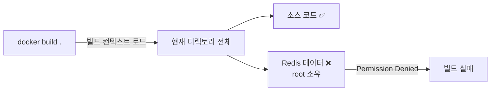
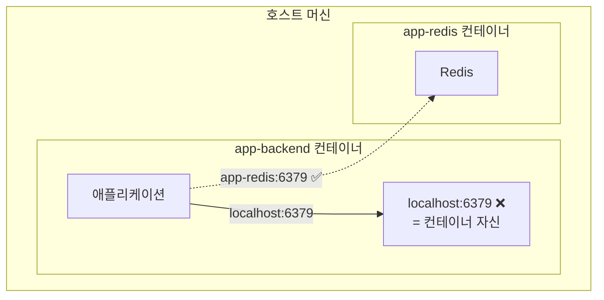
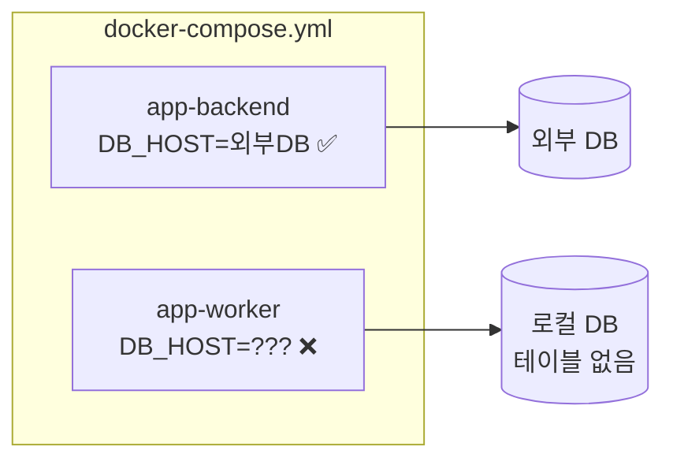

## 들어가며

최근 로컬에서 Docker Compose로 개발환경을 구축하다가 온갖 에러를 만났습니다. "이게 왜 안 되지?" 하면서 몇 시간씩 삽질한 경험들을 정리해봤어요. 저처럼 Docker로 로컬 개발환경 세팅하다가 막히는 분들께 도움이 되면 좋겠습니다.

---

## 1. 빌드할 때 Permission Denied

### 증상

```
failed to solve: error from sender: open .localcontainer/localdata/redis/appendonlydir: permission denied
```

처음 `docker compose build` 했을 때 이 에러가 떴습니다. 뭔가 권한 문제라는 건 알겠는데, 왜 빌드하는데 Redis 데이터 폴더를 읽으려 하는 걸까요?

### 원인

Docker 빌드할 때 *빌드 컨텍스트(Build Context)*를 로드하는데 — 쉽게 말해 현재 디렉토리 전체를 Docker 데몬에 보내는 과정이에요 — 이때 Redis가 root 권한으로 만든 데이터 파일까지 읽으려 해서 권한 에러가 납니다.



### 해결

`.dockerignore`에 데이터 디렉토리를 추가합니다:

```gitignore
# 컨테이너 데이터 제외 (Redis, Postgres 등)
.localcontainer/localdata/
```

> **주의**: `.localcontainer/` 전체를 제외하면 entrypoint 스크립트까지 빠져서 다른 에러가 납니다!

---

## 2. Entrypoint 스크립트 not found

### 증상

```
COPY ./.localcontainer/entrypoint.sh /entrypoint.sh
failed to solve: "/.localcontainer/entrypoint.sh": not found
```

위 에러를 해결하려고 `.dockerignore`에 `.localcontainer/`를 추가했더니 이번엔 이 에러가...

### 원인

`.dockerignore`가 너무 광범위하게 제외해서 필요한 스크립트까지 빠진 겁니다.

### 해결

데이터 폴더만 정확히 제외:

```gitignore
# ❌ 잘못된 설정 (스크립트까지 제외됨)
.localcontainer/

# ✅ 올바른 설정 (데이터만 제외)
.localcontainer/localdata/
```

---

## 3. 컨테이너가 안 꺼져요

### 증상

```
Error response from daemon: cannot stop container: abc123: permission denied
```

`docker stop`이 안 먹힙니다. 컨테이너가 좀비가 된 느낌...

### 원인

보통 *AppArmor*나 *cgroups* 관련 이슈입니다. Linux 보안 모듈이 Docker 데몬의 컨테이너 제어를 막는 경우예요.

### 해결

```bash
# 강제 종료
sudo docker rm -f <container_id>

# AppArmor 문제인 경우
sudo aa-remove-unknown
sudo systemctl restart docker
```

---

## 4. 포트 충돌

### 증상

```
Bind for 0.0.0.0:6379 failed: port is already allocated
```

### 진단

```bash
# 누가 포트 쓰고 있는지 확인
lsof -i :6379

# Docker 컨테이너 중인지 확인
docker ps -a --format "table {{.Names}}\t{{.Ports}}" | grep 6379
```

### 해결

```bash
# 기존 컨테이너 중지
docker stop <충돌나는_컨테이너>

# 또는 .env에서 다른 포트 사용
REDIS_PORT=6380
```

---

## 5. 컨테이너 내부에서 localhost 연결 실패

이게 제일 삽질을 많이 한 부분입니다.

### 증상

```
event: connected
data: {"message": "Connected to notification stream"}

event: error
data: {"message": "Failed to connect to Redis: ConnectionError"}
```

SSE 연결은 되는데 바로 Redis 연결 에러가 나요.

로그를 더 보니:
```
Error 111 connecting to localhost:6379. Connection refused.
```

### 원인

여기서 핵심은 **컨테이너 내부의 localhost는 호스트 머신이 아니라 컨테이너 자신**이라는 점입니다.



제 경우 `DJANGO_SETTINGS_MODULE` 환경변수가 설정 안 돼서 기본 설정(`localhost`)이 적용된 거였습니다.

### 해결

**docker-compose.yml에 환경변수를 명시적으로 추가**:

```yaml
services:
  app-backend:
    environment:
      DJANGO_SETTINGS_MODULE: myapp.settings.container  # 이거 빠졌었음!
      REDIS_HOST: app-redis  # 컨테이너 이름으로!
```

> **중요**: entrypoint.sh에서 `export`하는 것만으론 부족합니다. Docker 환경변수로 직접 넣어야 해요.

### 확인

```bash
# 환경변수 확인
docker exec app-backend printenv | grep -E "REDIS|DJANGO"

# 컨테이너 내부에서 Redis 연결 테스트
docker exec app-backend python -c "
import redis
r = redis.Redis(host='app-redis', port=6379)
print(r.ping())  # True면 성공
"
```

---

## 6. 워커 컨테이너가 다른 DB를 보고 있음

### 증상

```
django.db.utils.ProgrammingError: relation "django_celery_results_taskresult" does not exist
```

분명 마이그레이션 다 했는데 테이블이 없다고?

### 원인

**메인 앱과 워커가 서로 다른 DB를 보고 있었습니다.**



docker-compose.yml에서 메인 서비스에만 DB 환경변수를 넣고, 워커 서비스에는 안 넣은 거죠.

### 진단

```bash
# 메인 앱 DB 설정
docker exec app-backend env | grep DB_HOST

# 워커 DB 설정
docker exec app-worker env | grep DB_HOST

# 두 개가 다르면 문제!
```

### 해결

**모든 서비스에 동일한 DB 환경변수 추가**:

```yaml
services:
  app-backend:
    environment:
      DB_HOST: ${DB_HOST:-app-postgres}
      DB_PORT: ${DB_PORT:-5432}
      # ...

  app-worker:  # 여기도 똑같이!
    environment:
      DB_HOST: ${DB_HOST:-app-postgres}
      DB_PORT: ${DB_PORT:-5432}
      # ...

  app-beat:  # 여기도!
    environment:
      DB_HOST: ${DB_HOST:-app-postgres}
      DB_PORT: ${DB_PORT:-5432}
      # ...
```

---

## 정리

Docker 로컬 개발환경에서 자주 겪는 문제들:

| 문제 | 핵심 원인 |
|------|----------|
| Permission Denied (빌드) | `.dockerignore` 설정 누락 |
| localhost 연결 실패 | 컨테이너 내부 localhost ≠ 호스트 |
| 서비스 간 설정 불일치 | 환경변수 복사 누락 |
| 포트 충돌 | 이전 컨테이너 미정리 |

가장 중요한 건 **컨테이너 네트워크는 호스트와 분리되어 있다**는 점입니다. `localhost`가 아니라 컨테이너 이름(서비스 이름)으로 통신해야 해요.

---

## 자주 쓰는 디버깅 명령어

```bash
# 환경변수 확인
docker exec <컨테이너> printenv | grep -E "DB_|REDIS_"

# 로그 실시간 확인
docker logs -f <컨테이너>

# 컨테이너 내부 접속
docker exec -it <컨테이너> bash

# 전체 재빌드
docker compose down && docker compose up -d --build
```

---

## 추가로 공부하면 좋을 개념

- **Docker 네트워킹**: bridge, host, overlay 네트워크의 차이
- **Docker Compose profiles**: 개발/테스트 환경별 서비스 구성
- **멀티스테이지 빌드**: 이미지 사이즈 최적화
- **Health check**: 컨테이너 상태 모니터링
