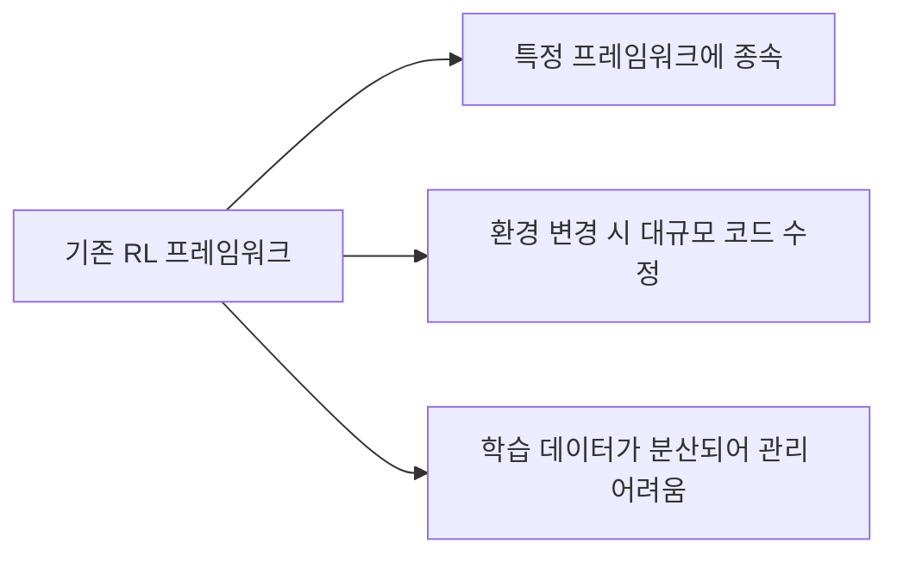
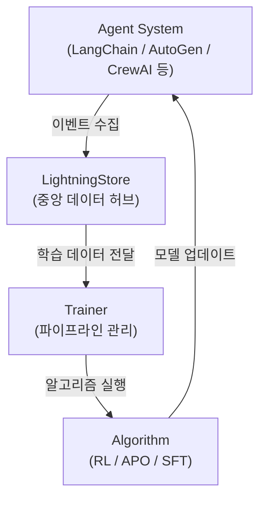
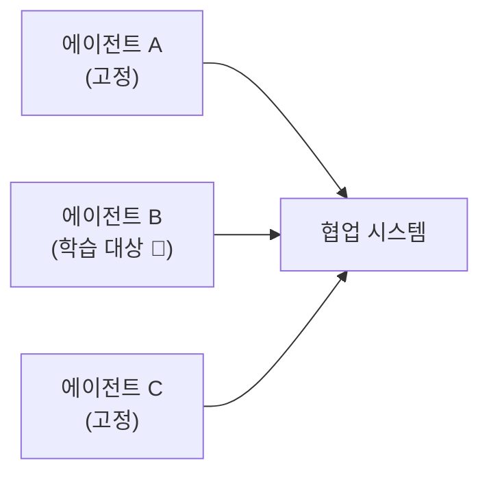

## 들어가며

AI 에이전트를 만들다 보면 한 번쯤 이런 생각이 듭니다. "이 에이전트, 좀 더 똑똑하게 만들 수 없을까?" 프롬프트를 수동으로 고치는 건 한계가 있고, 강화학습을 붙이자니 기존 코드를 전부 뜯어고쳐야 할 것 같고...

Microsoft Research에서 공개한 *Agent Lightning*은 바로 이 문제를 해결하려고 만들어졌습니다. **기존 에이전트 코드를 거의 수정하지 않고도** 강화학습(RL)과 자동 프롬프트 최적화를 적용할 수 있는 프레임워크입니다.

이번 글에서는 [PyTorch 한국 사용자 모임의 Agent Lightning 소개 글](https://discuss.pytorch.kr/t/agent-lightning-microsoft-ai/8059)을 바탕으로 핵심 개념과 아키텍처를 정리해보겠습니다.

---

## 핵심 개념: "Zero Code Change"

Agent Lightning의 가장 큰 철학은 **"Zero Code Change"**입니다. 기존 에이전트 프레임워크가 뭐든 — LangChain이든, AutoGen이든, CrewAI든, 심지어 순수 Python + OpenAI API든 — 코드를 거의 건드리지 않고 학습 파이프라인을 붙일 수 있습니다.

단순한 라이브러리가 아니라, **AI 에이전트의 성능 향상 루프를 자동화하는 트레이너**라고 이해하면 됩니다. 학습 로그 수집 → 학습 결과 반영 → 반복 개선, 이 과정을 자동으로 관리해줍니다.

---

## 기존 접근 방식의 문제점

기존에 에이전트에 *강화학습(Reinforcement Learning, RL)*을 적용하려면 — 즉, 에이전트가 시행착오를 통해 스스로 개선하도록 만들려면 — 꽤 큰 장벽이 있었습니다.



| 측면 | 기존 시스템 | Agent Lightning |
|------|----------|-----------------|
| 설계 | 프레임워크 종속 | 프레임워크 독립적 |
| 접근방식 | 모델 중심(Model-centric) | 이벤트 기반(Event-driven) |
| 데이터 관리 | 분산 처리 | 중앙 허브(LightningStore) |

---

## 아키텍처 (Step by Step)

Agent Lightning의 구조는 크게 세 단계로 나뉩니다.



### Step 1: 이벤트 수집 — LightningStore

에이전트가 동작하면서 발생하는 모든 상호작용을 *이벤트(Event)*로 구조화해서 중앙 저장소에 기록합니다. 프롬프트, 응답, 툴 호출, 보상 등이 모두 여기에 쌓입니다.

기존 코드에 `agl.emit_xxx()` 같은 헬퍼 함수 몇 줄만 추가하면 되고, 자동 추적기(tracer)를 쓰면 아예 코드 수정 없이도 수집이 가능합니다.

### Step 2: 학습 파이프라인 — Trainer

*Trainer*는 LightningStore에 쌓인 데이터를 학습 알고리즘에 전달하는 역할을 합니다. 데이터셋 생성, 정책 갱신, 모델 업데이트를 자동으로 수행합니다.

사용자는 파이프라인 관리가 아니라 **학습 전략 자체에만 집중**할 수 있습니다.

### Step 3: 알고리즘 실행 — Algorithm

실제 학습이 이루어지는 단계입니다. 다양한 알고리즘을 지원합니다:

- **RL (강화학습)**: 보상 기반으로 에이전트 행동 최적화
- **APO (자동 프롬프트 최적화)**: *APO(Automatic Prompt Optimization)*란 에이전트의 시스템 프롬프트를 자동으로 개선하는 기법입니다
- **SFT (지도 미세조정)**: *SFT(Supervised Fine-Tuning)*란 정답 데이터를 기반으로 모델을 추가 학습하는 방식입니다
- 사용자 정의 알고리즘도 추가 가능

---

## 핵심 기능 5가지

### 1. 프레임워크 독립적 학습

LangChain, AutoGen, CrewAI, OpenAI Agent SDK 등 어떤 프레임워크든 호환됩니다. API 레벨에서 프롬프트와 응답, 보상 데이터를 수집해서 학습 루프에 통합하는 방식이라 가능한 겁니다.

### 2. 선택적 에이전트 최적화

*다중 에이전트 시스템(Multi-Agent System)*에서 전체를 한꺼번에 학습할 필요 없이, **특정 에이전트만 골라서** 강화학습을 적용할 수 있습니다.



예를 들어 대화형 시스템에서 평가자(critic) 에이전트만 학습 대상으로 지정할 수 있습니다.

### 3. 다양한 학습 알고리즘

RL, APO, SFT를 기본 지원하고, 커스텀 알고리즘도 플러그인 방식으로 추가할 수 있습니다.

### 4. Zero Code Change 적용

기존 코드에 헬퍼 함수 몇 줄만 추가하거나, 자동 추적기를 사용하면 됩니다. 기존 워크플로우를 유지하면서 학습 파이프라인만 덧붙이는 구조입니다.

### 5. 중앙화된 데이터 관리

LightningStore가 모든 학습 데이터를 중앙에서 관리하기 때문에, 실험 추적과 재현이 쉽습니다.

---

## 코드로 살펴보기

공식 문서 기준으로, 기존 에이전트에 Agent Lightning을 적용하는 흐름은 대략 이렇습니다:

```python
import agent_lightning as agl

# 1. LightningStore 초기화
store = agl.LightningStore()

# 2. 기존 에이전트 실행 시 이벤트 기록
# 기존 코드에 헬퍼 함수만 추가
agl.emit_prompt(store, prompt="사용자 질문...")
response = my_agent.run(prompt)
agl.emit_response(store, response=response)
agl.emit_reward(store, reward=compute_reward(response))

# 3. Trainer로 학습 실행
trainer = agl.Trainer(
    store=store,
    algorithm="rl",  # 또는 "apo", "sft"
)
trainer.train()
```

핵심은 `agl.emit_xxx()` 헬퍼 함수 몇 줄이 전부라는 점입니다. 기존 에이전트 로직은 그대로 유지됩니다.

---

## 정리

이번 글에서 다룬 내용을 정리하면:

- **Agent Lightning**은 기존 AI 에이전트 코드를 거의 수정하지 않고 강화학습/프롬프트 최적화를 적용하는 Microsoft Research의 프레임워크
- **이벤트 기반 아키텍처**로 프레임워크 독립적이며, LangChain/AutoGen/CrewAI 등과 모두 호환
- **Store → Trainer → Algorithm** 3단계 구조로 학습 파이프라인을 자동화
- 다중 에이전트 환경에서 **특정 에이전트만 선택적으로 최적화** 가능
- MIT 라이선스로 상업적 사용도 자유

---

## 추가로 공부하면 좋을 개념

이 주제를 더 깊이 이해하려면 아래 개념들도 함께 살펴보면 좋습니다:

- **RLHF (Reinforcement Learning from Human Feedback)**: 사람의 피드백을 보상으로 사용하는 강화학습 기법
- **GRPO / PPO**: Agent Lightning이 지원하는 대표적인 RL 알고리즘들
- **DSPy**: 프롬프트 최적화를 프로그래밍적으로 접근하는 또 다른 프레임워크
- **Multi-Agent Orchestration**: 여러 에이전트가 협업하는 시스템 설계 패턴
- **공식 GitHub**: [microsoft/agent-lightning](https://github.com/microsoft/agent-lightning)
- **논문**: "Train ANY AI Agents with Reinforcement Learning" (arXiv:2508.03680)
- **원문**: [PyTorch 한국 사용자 모임 — Agent Lightning 소개](https://discuss.pytorch.kr/t/agent-lightning-microsoft-ai/8059)
