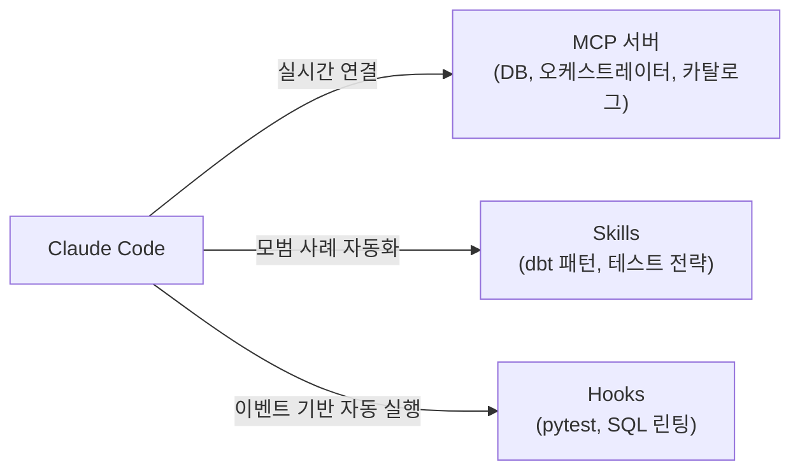
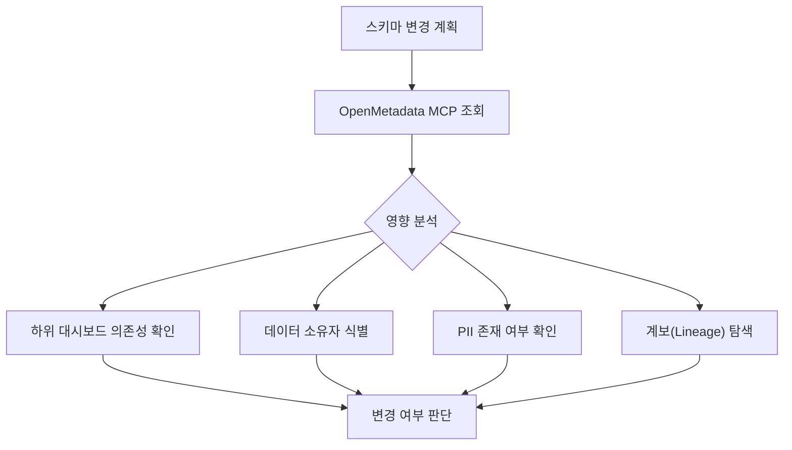
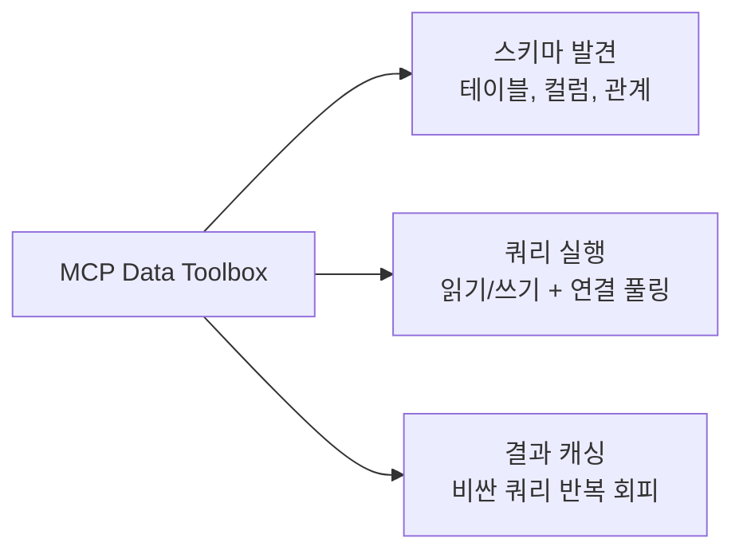
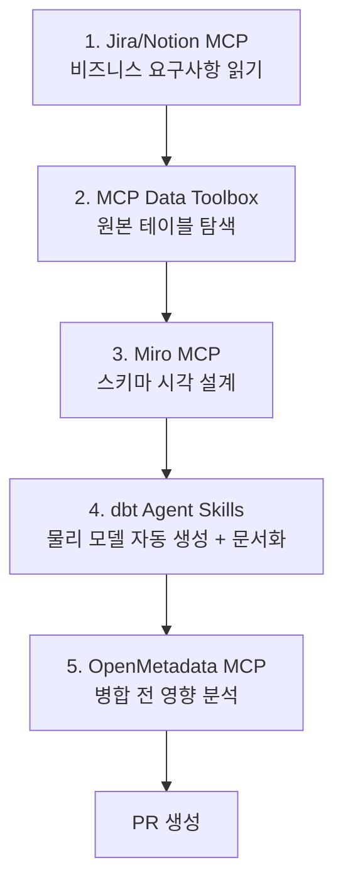

## 들어가며

요즘 Claude Code를 데이터 엔지니어링 작업에 써보면서 "이걸 진작 알았으면 좋았을 텐데" 싶은 순간이 많았습니다. 단순히 코드 자동완성 수준이 아니라, **데이터 스택 전체를 하나의 세션 안에서 연결**할 수 있다는 게 핵심이더라고요.

이번 글에서는 [The Pipe and The Line의 "Intro: Claude Code for Data Engineers"](https://thepipeandtheline.substack.com/p/intro-claude-code-for-data-engineers) 글을 바탕으로, Claude Code가 데이터 엔지니어링 워크플로우에 어떻게 통합되는지 정리해보겠습니다.

---

## 핵심 개념: 세 가지 통합 메커니즘

Claude Code가 데이터 스택과 연결되는 방식은 크게 세 가지입니다.



- **MCP 서버**: *MCP(Model Context Protocol)*란 Claude가 외부 도구(데이터베이스, 오케스트레이터, 메타데이터 카탈로그 등)에 실시간으로 접근할 수 있게 해주는 프로토콜입니다.
- **Skills**: 반복되는 모범 사례를 Claude에 인코딩해두는 방식입니다. dbt 패턴, 테스팅 전략, 마이그레이션 가이드 등을 자동으로 따르게 합니다.
- **Hooks**: 특정 이벤트(커밋, 파일 저장 등) 전후에 자동으로 실행되는 명령입니다. CI/CD를 AI 워크플로우 안에 내장하는 셈이죠.

---

## 데이터 모델링: 가장 성숙한 영역

### Step 1: dbt Agent Skills로 모델링 자동화

현재 Claude Code 생태계에서 **데이터 모델링이 가장 성숙한 통합 영역**입니다. 그 중심에 dbt Labs가 오픈소스로 공개한 *dbt Agent Skills*가 있습니다.

dbt Agent Skills가 할 수 있는 것들:

**Core/OSS 호환:**
- 모델 구축 및 수정, 오류 디버깅
- 소스 탐색 및 단위 테스트 (TDD 가능)
- CLI 명령어를 올바른 플래그와 선택자로 실행
- dbt 공식 문서를 효율적으로 조회

**Cloud 전용:**
- *시맨틱 레이어(Semantic Layer)* — 비즈니스 로직을 중앙에서 정의하는 계층 — 활용
- 자연어로 데이터 쿼리
- 작업 문제 해결

제가 느낀 가장 큰 장점은 **문서화가 기본으로 따라온다**는 점이었습니다. 모델을 만들면서 메타데이터 작성을 자연스럽게 가속화해주고, 최신 dbt 모범 사례를 자동으로 준수하게 됩니다.

### Step 2: OpenMetadata MCP로 영향 분석

모델을 변경하기 전에 "이거 바꾸면 어디가 깨지지?" 확인하고 싶을 때가 많죠. *OpenMetadata MCP*는 바로 이 영향 분석을 Claude 세션 안에서 해결합니다.



스키마 변경, *계보(Lineage)* 탐색 — 데이터가 어디서 와서 어디로 가는지 추적하는 것 — , 데이터 검색까지 한 세션에서 처리할 수 있습니다.

---

## Hooks: AI가 쓴 코드를 자동으로 검증하기

개인적으로 데이터 엔지니어가 가장 간과하기 쉬운 기능이 Hooks라고 생각합니다. **CI/CD를 AI 워크플로우 내부에 구현**하는 거니까요.

### Step 1: pytest — 커밋 전 자동 테스트

```json
{
  "event": "PreCommit",
  "command": "python3 -m pytest tests/ -x -q"
}
```

Claude가 작성한 코드가 테스트를 통과해야만 커밋이 진행됩니다. 테스트 실패하면 커밋 자체가 막히니까, 나쁜 코드가 저장소에 들어갈 일이 없죠.

### Step 2: sqlfluff — 파일 저장 시 SQL 린팅

```json
{
  "event": "PostToolUse",
  "matcher": "Write|Edit",
  "command": "sqlfluff lint --dialect snowflake $FILE_PATH"
}
```

*sqlfluff*는 SQL 린터(linter)로, 팀의 스타일 규칙, 명명 규칙, 안티패턴을 자동으로 검사합니다. Claude가 `.sql` 파일을 저장할 때마다 바로 체크가 돌아갑니다.

### Step 3: dbt test — 모델 변경 후 자동 테스트

```json
{
  "event": "PostToolUse",
  "matcher": "Write|Edit",
  "command": "dbt test --select $(basename $FILE_PATH .sql)"
}
```

모델 파일이 수정되면 해당 모델의 dbt 테스트가 자동으로 실행됩니다.

> 핵심 원칙: **AI를 신뢰하지 말고, 품질 검사를 건너뛸 수 없게 자동화하라.**

---

## MCP Data Toolbox: 30개 이상 DB를 하나로

Google이 오픈소스로 공개한 *MCP Data Toolbox*는 다양한 데이터베이스를 단일 `tools.yaml` 설정 파일로 관리할 수 있게 해줍니다.

### 주요 기능



- **스키마 발견**: 테이블, 컬럼, 관계를 자동으로 탐색
- **쿼리 실행**: 읽기/쓰기 작업을 연결 풀링과 함께 처리
- **결과 캐싱**: 비용이 큰 쿼리의 반복 실행을 회피

### 언제 전문화된 MCP를 쓸까?

| MCP | 사용 시기 |
|-----|----------|
| **Snowflake MCP** | Cortex RAG, 시맨틱 모델링, 오케스트레이션 |
| **PostgreSQL MCP Pro** | 상태 분석, 인덱스 권장사항 |
| **MotherDuck MCP** | 로컬 개발 및 프로토타이핑 |

**추천 전략**: Data Toolbox를 기본값으로 쓰고, 주요 웨어하우스용 전문 MCP 하나를 추가하는 조합이 가장 실용적입니다.

---

## 오케스트레이션: Airflow MCP

Astronomer가 오픈소스로 공개한 *Airflow MCP*는 Apache Airflow 2.x/3.x와 호환되며, dbt Cloud 없이도 동작합니다.

### 주요 도구

| 도구 | 역할 |
|------|------|
| `explore_dag` | DAG 메타데이터, 태스크, 최근 실행, 소스 코드 탐색 |
| `diagnose_dag_run` | UI 없이 실패한 실행 디버깅 |
| `get_system_health` | Airflow 상태, 임포트 오류, 경고, DAG 통계 확인 |

처음에는 "Airflow UI 보면 되지 않나?" 싶었는데, 실제로 써보면 Claude 세션 안에서 DAG 실패를 디버깅하고 바로 코드를 수정하는 흐름이 훨씬 빠릅니다. 컨텍스트 스위칭이 줄어드는 게 체감됩니다.

---

## 통합 워크플로우: 개념 모델에서 물리 모델까지

여러 MCP를 하나의 세션에서 연결하면 진정한 시너지가 발생합니다. 다음은 한 세션 안에서 개념 모델부터 물리 모델까지 완성하는 흐름입니다.



한 세션에서 요구사항 확인부터 영향 분석까지 끝낼 수 있다는 건, 기존에 반나절 걸리던 작업을 크게 단축할 수 있다는 뜻입니다.

---

## Docs-as-MCP: 환각 방지

Claude가 *환각(Hallucination)* — 실제로 없는 API나 함수를 있는 것처럼 답변하는 현상 — 을 일으키는 걸 방지하려면, 현재 문서를 컨텍스트에 직접 주입하는 게 효과적입니다.

사용할 수 있는 도구들:
- **Context7**: 라이브러리 문서를 실시간으로 주입
- **gitingest**: Git 저장소 내용을 컨텍스트로 변환
- **docs-mcp-server**: 커스텀 문서를 MCP로 제공

이를 통해 Claude가 정확한 API 시그니처로 작동하도록 보장할 수 있습니다.

---

## 정리

이번 글에서 다룬 내용을 요약하면:

- **MCP, Skills, Hooks** 세 가지가 Claude Code를 데이터 스택과 통합하는 핵심 메커니즘
- **데이터 모델링**(dbt Agent Skills + OpenMetadata)이 현재 가장 성숙한 영역
- **Hooks로 CI/CD를 AI 워크플로우에 내장**하면 품질을 자동으로 보장
- **여러 MCP를 한 세션에서 조합**할 때 진정한 가치가 발현됨

---

## 추가로 공부하면 좋을 개념

이 주제를 더 깊이 이해하려면 아래 개념들도 함께 살펴보면 좋습니다:

- **MCP 프로토콜 스펙**: Claude가 외부 도구와 통신하는 방식의 기술적 세부사항
- **dbt Semantic Layer**: 비즈니스 로직을 중앙에서 관리하는 시맨틱 계층 설계
- **Airflow 3.x의 변경점**: 최신 Airflow에서 달라진 아키텍처와 MCP 호환성
- **Data Contract**: 데이터 생산자와 소비자 간의 계약 기반 품질 보장 패턴
- **원문**: [Intro: Claude Code for Data Engineers — The Pipe and The Line](https://thepipeandtheline.substack.com/p/intro-claude-code-for-data-engineers)
