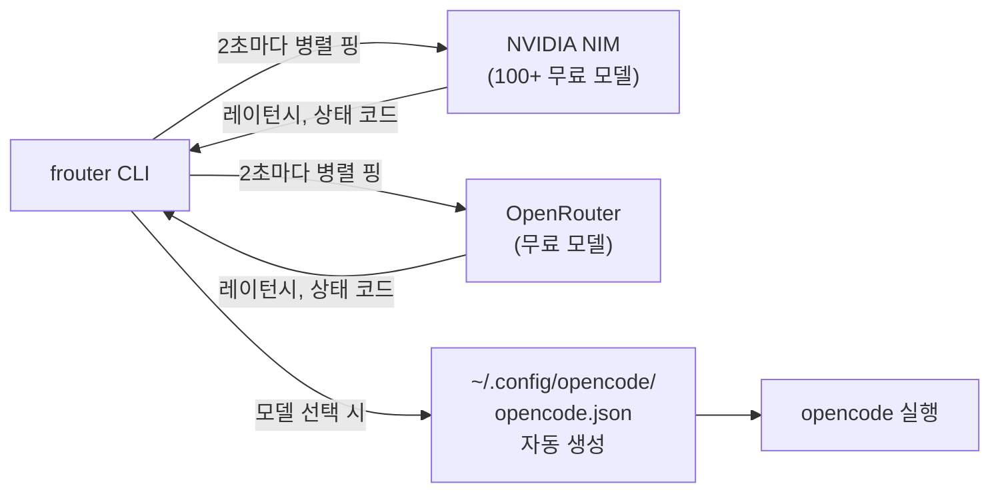
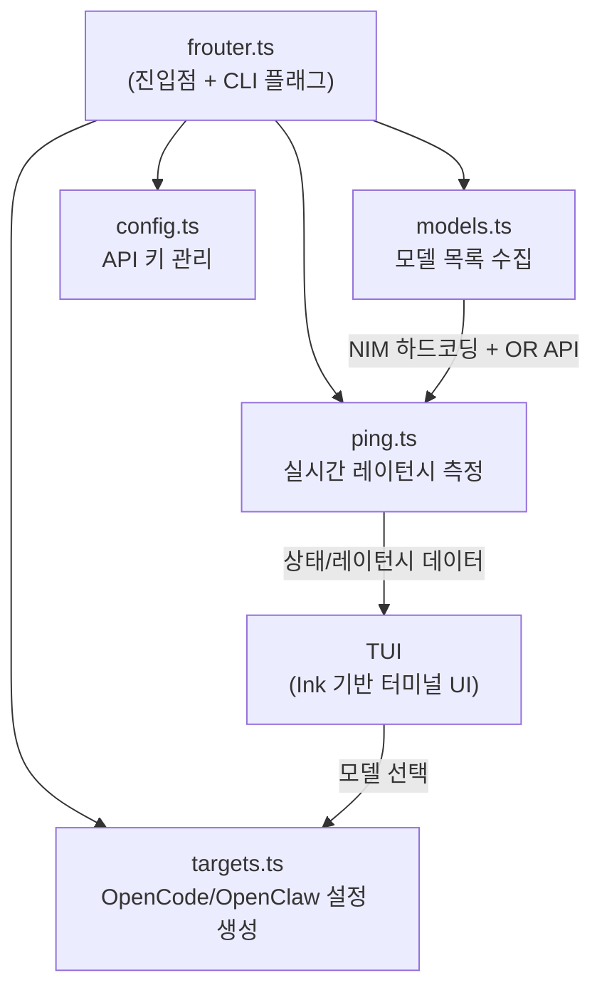

## 들어가며

OpenCode나 비슷한 AI 코딩 에이전트를 쓸 때, 무료 모델이 여러 개 있으면 고민이 됩니다. "지금 어떤 모델이 살아있지?", "어떤 게 가장 빠르지?", "S+ 티어 모델 중에 레이턴시 낮은 건?" 같은 질문에 매번 직접 확인하기가 번거롭죠.

[frouter](https://github.com/jyoung105/frouter)는 이 문제를 해결하는 CLI 도구입니다. NVIDIA NIM과 OpenRouter에서 제공하는 **무료 AI 모델 164개를 실시간으로 핑(ping)해서**, 지금 당장 쓸 수 있는 가장 좋은 모델을 알려줍니다. 모델을 고르면 OpenCode 설정 파일까지 자동으로 작성해줍니다.

코드를 직접 뜯어보면서 이해한 내용을 정리합니다.

---

## 핵심 개념: "무료 모델 라우터"

frouter가 하는 일을 한 문장으로 요약하면 이겁니다:

> 무료 AI 모델들을 2초마다 핑해서 상태를 실시간 모니터링하고, 가장 좋은 모델을 골라 OpenCode 설정에 자동 반영한다.



"라우터"라는 이름이 붙은 이유가 있습니다. 네트워크 라우터가 가장 빠른 경로를 찾아주듯, frouter는 가장 빠르고 안정적인 무료 모델을 찾아줍니다.

---

## 아키텍처 (Step by Step)

코드를 분석해보면, frouter는 4개의 핵심 모듈로 구성되어 있습니다.



### Step 1: 모델 목록 수집 — `models.ts`

frouter는 두 가지 방식으로 모델 목록을 가져옵니다.

**NVIDIA NIM**: 100개 이상의 무료 모델이 **코드에 하드코딩**되어 있습니다. NIM API가 응답하면 동적으로 갱신하고, 실패하면 하드코딩 목록을 *폴백(Fallback)* — 1차 방법이 실패했을 때 대체로 사용하는 예비 방법 — 으로 씁니다.

```typescript
// NVIDIA NIM은 하드코딩 + 동적 갱신 하이브리드
let nimModels = null;
if (nvidiaKey && !noFetch)
  nimModels = await fetchNimModels(nvidiaKey);  // API 호출 시도
const source = nimModels || getNimModels();      // 실패하면 하드코딩 사용
```

**OpenRouter**: `/api/v1/models` API를 호출해서 **무료 모델만 필터링**합니다. 조건이 꽤 엄격합니다 — prompt와 completion 가격이 둘 다 "0"이고, `tools`를 지원하는 모델만 가져옵니다.

```typescript
// 무료 + 도구 호출 지원 모델만 필터
.filter(m =>
  m?.pricing?.prompt === "0" &&
  m?.pricing?.completion === "0" &&
  m.supported_parameters.includes("tools")
)
```

각 모델에는 `model-rankings.json`에서 가져온 **SWE-bench 점수 기반 티어**가 매겨집니다. S+부터 C까지 8단계입니다.

| 티어 | SWE-bench 점수 | 설명 |
|------|---------------|------|
| **S+** | 70% 이상 | 최정상급 |
| **S** | 60~70% | 우수 |
| **A+** | 50~60% | 준수 |
| **A** | 40~50% | 양호 |
| **A-** | 35~40% | 무난 |
| **B+** | 30~35% | 평균 |
| **B** | 20~30% | 평균 이하 |
| **C** | 20% 미만 | 경량/엣지 |

### Step 2: 실시간 핑 — `ping.ts`

여기가 frouter의 핵심 엔진입니다. 각 모델에 실제 *chat completion 요청*을 보내서 *TTFB(Time To First Byte)* — 첫 번째 바이트가 도착하는 데까지 걸리는 시간 — 를 측정합니다.

```typescript
// 실제로 chat/completions에 POST 요청을 보냄
const body = JSON.stringify({
  model: modelId,
  messages: [{ role: "user", content: "hi" }],
  max_tokens: 1,   // 토큰 1개만 — 비용 최소화
});
```

핑 로직에 들어가 있는 최적화가 인상적이었습니다:

**이중 패스 전략**: 첫 번째 패스에서는 아직 응답을 받지 못한 "pending" 모델을 동시성 64로 빠르게 훑고(타임아웃 2.5초), 두 번째 패스에서는 이미 데이터가 있는 모델을 동시성 20으로 안정적으로 핑합니다(타임아웃 6초).

```typescript
// 1차: pending 모델 빠르게 스캔 (동시성 64, 타임아웃 2.5초)
await pooled(pendingFirstPass, INITIAL_PING_CONCURRENCY, 
  (m) => runPing(m, INITIAL_TIMEOUT_MS));

// 2차: 기존 모델 안정적 핑 (동시성 20, 타임아웃 6초)
await pooled(steadyState, PING_CONCURRENCY, 
  (m) => runPing(m, TIMEOUT_MS));
```

**점진적 백오프**: 연속 3회 실패한 모델은 핑 주기를 지수적으로 늘립니다. 죽은 모델에 자원을 낭비하지 않기 위한 장치입니다.

```typescript
if (m._consecutiveFails >= BACKOFF_THRESHOLD) {
  const delay = Math.min(32, 2 ** (m._consecutiveFails - BACKOFF_THRESHOLD));
  m._skipUntilRound = _roundCounter + delay;
}
```

**티어 우선 핑**: S+ 티어 모델부터 먼저 핑합니다. 좋은 모델의 상태를 빨리 알 수 있게요.

**Keep-Alive 에이전트**: 호스트별로 HTTP 에이전트를 캐싱해서 TCP 연결을 재사용합니다. 164개 모델을 2초마다 핑할 때 연결 오버헤드를 크게 줄여줍니다.

**Epoch 기반 스테일 커밋 방지**: 프로바이더가 변경되면 epoch를 증가시키고, 이전 epoch의 in-flight 결과를 무시합니다. 비동기 환경에서 오래된 결과가 최신 상태를 덮어쓰는 걸 방지하는 장치입니다.

### Step 3: API 키 관리 — `config.ts`

API 키 우선순위가 명확하게 정의되어 있습니다:

```
환경변수 (NVIDIA_API_KEY 등) → ~/.frouter.json → 키 없이 핑 (레이턴시만 표시)
```

첫 실행 시 셋업 위저드가 뜨는데, 각 프로바이더의 키 발급 페이지를 브라우저로 자동으로 열어줍니다. 키 입력은 마스킹 처리됩니다(비밀번호 입력처럼 `•`로 표시). 설정 파일은 `0600` 퍼미션으로 저장됩니다.

| 프로바이더 | 키 접두사 | 무료 키 발급 |
|-----------|----------|-------------|
| NVIDIA NIM | `nvapi-` | build.nvidia.com |
| OpenRouter | `sk-or-` | openrouter.ai/settings/keys |

### Step 4: 설정 생성 — `targets.ts`

모델을 선택하면 OpenCode와 OpenClaw 설정 파일을 자동 생성합니다. 기존 설정은 타임스탬프 백업을 만든 뒤 덮어씁니다.

```typescript
// 기존 설정 백업 후 새 설정 저장
const ts = new Date().toISOString().replace(/[:.]/g, "-");
const backupPath = `${path}.backup-${ts}`;
copyFileSync(path, backupPath);
```

OpenCode 설정에는 프로바이더 블록과 모델 ID가 들어갑니다:

```json
{
  "provider": {
    "nvidia": {
      "npm": "@ai-sdk/openai-compatible",
      "name": "NVIDIA NIM",
      "options": {
        "baseURL": "https://integrate.api.nvidia.com/v1",
        "apiKey": "{env:NVIDIA_API_KEY}"
      }
    }
  },
  "model": "nvidia/deepseek-ai/deepseek-v3.2"
}
```

재밌는 디테일이 있는데, 특정 모델은 프로바이더 폴백 규칙이 있습니다. 예를 들어 NIM에서 선택한 Stepfun 모델은 실제로 OpenRouter로 리매핑됩니다.

---

## TUI: 터미널 대시보드

frouter의 TUI는 React 기반 터미널 UI 프레임워크인 *Ink*로 만들어져 있습니다. 모델 목록이 2초마다 갱신되면서 실시간 대시보드를 보여줍니다.

### 표시 컬럼

| 컬럼 | 의미 |
|------|------|
| `#` | 순위 |
| `Tier` | SWE-bench 기반 능력 등급 (S+ ~ C) |
| `Provider` | NIM 또는 OpenRouter |
| `Model` | 모델명 |
| `Ctx` | 컨텍스트 윈도우 크기 |
| `AA` | Arena Elo / 지능 점수 |
| `Avg` | HTTP 200 응답만의 롤링 평균 레이턴시 |
| `Lat` | 최신 핑 레이턴시 |
| `Up%` | 이번 세션의 업타임 |
| `Verdict` | 상태 요약 |

### Verdict 체계

상태를 직관적으로 보여주는 이모지 기반 판정 시스템입니다:

| Verdict | 조건 |
|---------|------|
| 🚀 Perfect | 평균 < 400ms |
| ✅ Normal | 평균 < 1000ms |
| 🐢 Slow | 평균 < 3000ms |
| 🐌 Very Slow | 평균 < 5000ms |
| 💀 Unusable | 평균 5000ms 이상 |
| 🔥 Overloaded | HTTP 429 (레이트 리밋) |
| ⚠️ Unstable | 응답하다가 실패 |
| 👻 Not Active | 한 번도 응답 안 함 |

### 기본 정렬

가용성(살아있는 모델 우선) → 높은 티어 우선(S+ → C) → 낮은 레이턴시 순입니다. 키보드 `0`~`9`로 정렬 기준을 바꿀 수 있고, 같은 키를 다시 누르면 역순 정렬됩니다.

---

## 모델 카탈로그 자동 동기화

`model-rankings.json`은 GitHub Actions로 자동 갱신됩니다:

- **매일**: NIM/OpenRouter 모델 목록 동기화
- **매주 월요일**: Artificial Analysis 지능 점수(AA) 갱신
- 변경사항이 있으면 자동으로 PR을 생성하고, 새 모델의 티어가 미정이면 `needs-tier-review` 라벨을 붙임

164개 모델의 메타데이터(SWE-bench 점수, AA 지능 점수, 컨텍스트 크기 등)가 이 파일에 들어있습니다.

---

## 코드에서 인상적이었던 부분

분석하면서 엔지니어링 품질이 꽤 높다고 느낀 점들입니다.

**1. 핑 최적화의 깊이**: 단순히 HTTP GET을 날리는 게 아니라, 실제 chat completion POST 요청으로 TTFB를 측정합니다. Keep-alive 에이전트, 이중 패스, 점진적 백오프, 스테일 커밋 방지까지 — 164개 모델을 2초마다 핑하는 부하를 감당하기 위한 최적화가 체계적입니다.

**2. 폴백 전략**: NIM 모델 목록은 하드코딩 + API 동적 갱신 하이브리드입니다. API가 죽어도 하드코딩 목록으로 동작하고, API가 살아있으면 최신 목록을 씁니다. 프로바이더 간 모델 리매핑(NIM Stepfun → OpenRouter)도 우아하게 처리합니다.

**3. 보안 의식**: 설정 파일은 `0600` 퍼미션, 키 입력은 마스킹, 기존 설정은 타임스탬프 백업. 작은 CLI 도구인데도 이런 부분이 신경 쓰여 있습니다.

---

## 설치와 사용법

```bash
# 설치
npx frouter-cli

# 실행
frouter

# 스크립트용: 가장 좋은 모델 ID만 출력
MODEL=$(frouter --best)
echo "Best model: $MODEL"
```

첫 실행 시 셋업 위저드가 API 키를 안내합니다. NVIDIA NIM과 OpenRouter 모두 무료 키를 발급받을 수 있습니다.

---

## 정리

이번 글에서 다룬 내용을 정리하면:

- **frouter**는 NVIDIA NIM + OpenRouter의 무료 AI 모델 164개를 실시간 핑해서 최적 모델을 추천하는 CLI 라우터
- **이중 패스 + 점진적 백오프 + Keep-alive** 등 정교한 핑 최적화로 대량 모델 모니터링을 처리
- SWE-bench 점수 기반 **S+ ~ C 8단계 티어** 시스템으로 모델 능력 분류
- 모델 선택 시 **OpenCode/OpenClaw 설정 자동 생성** + 기존 설정 백업
- GitHub Actions로 **모델 카탈로그 자동 동기화** (매일/매주)

---

## 추가로 공부하면 좋을 개념

이 주제를 더 깊이 이해하려면 아래 개념들도 함께 살펴보면 좋습니다:

- **SWE-bench**: AI 모델의 소프트웨어 엔지니어링 능력을 평가하는 벤치마크. frouter의 티어 기준
- **OpenCode**: 오픈소스 AI 코딩 에이전트. frouter가 설정을 자동 생성하는 대상
- **NVIDIA NIM**: NVIDIA의 무료 AI 모델 호스팅 서비스. 100개 이상의 모델을 무료로 제공
- **Ink (React for CLI)**: React 컴포넌트로 터미널 UI를 만드는 프레임워크. frouter의 TUI가 이걸로 만들어짐
- **원본 저장소**: [jyoung105/frouter (GitHub)](https://github.com/jyoung105/frouter)
