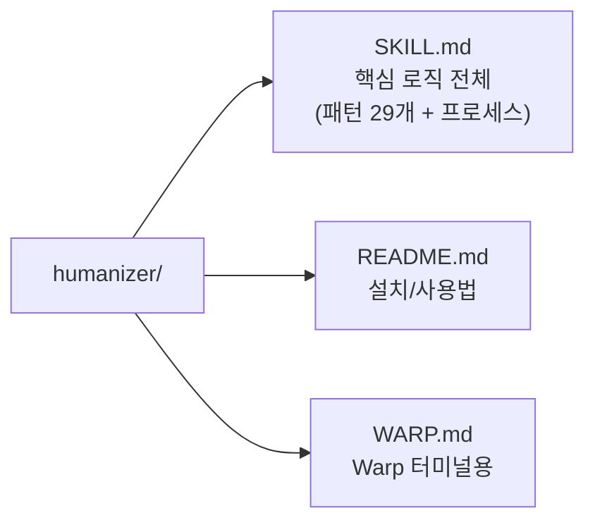
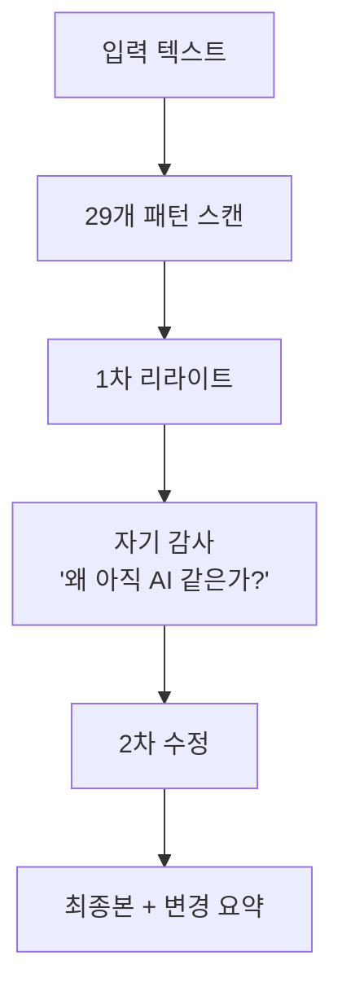

## 들어가며

AI로 글을 쓰다 보면 한 번쯤 이런 경험이 있을 겁니다. 분명 내용은 맞는데, 읽어보면 어딘가 "이거 AI가 썼지?" 하는 느낌이 나는 거죠. "pivotal moment", "delve into", "it's not just X, it's Y" 같은 표현이 반복되고, 문장이 너무 깔끔하고, 모든 리스트가 딱 3개씩...

[Humanizer](https://github.com/blader/humanizer)는 바로 이 문제를 해결하는 Claude Code / OpenCode용 *Skill*입니다. GitHub 별 14.6k를 받았는데, 재밌는 건 **코드가 한 줄도 없다**는 것입니다. 마크다운 파일 하나에 프롬프트와 패턴 규칙만 담겨 있어요.

이번 글에서는 Humanizer가 탐지하는 29개 AI 글쓰기 패턴과 동작 원리를 정리하고, 실제로 글 쓸 때 어떻게 활용할 수 있는지 살펴보겠습니다.

---

## 핵심 개념: AI 글쓰기의 "냄새"

Wikipedia의 *WikiProject AI Cleanup*이라는 프로젝트가 있습니다. 수천 건의 AI 생성 텍스트를 관찰하면서 "AI가 쓴 글의 공통 패턴"을 정리한 건데, Humanizer는 이걸 기반으로 만들어졌습니다.

핵심 원리는 간단합니다:

> LLM은 통계적으로 가장 가능성이 높은 다음 단어를 예측합니다. 그 결과, 가장 넓은 범위에 적용 가능한 가장 평균적인 표현이 나옵니다.

그래서 AI 글은 **틀린 건 아닌데 개성이 없고**, 패턴이 반복되는 거죠.

---

## 저장소 구조: 코드 없는 프로젝트



실행 코드가 0줄입니다. 전체 로직이 `SKILL.md`라는 마크다운 파일 하나에 담겨 있고, Claude Code가 이 파일을 *Skill*로 읽어서 동작합니다. 프롬프트 엔지니어링만으로 별 14.6k를 받은 셈이에요.

---

## 동작 원리 (Step by Step)

### Step 1: 패턴 탐지

텍스트를 받으면 29개 AI 글쓰기 패턴을 스캔합니다. 각 패턴에는 "감시 단어(words to watch)" 목록이 있어서, 이걸 기준으로 문제 구간을 찾습니다.

### Step 2: 1차 리라이트

문제가 발견된 구간을 자연스러운 표현으로 재작성합니다. 핵심 의미는 유지하면서, AI 특유의 표현만 교체합니다.

### Step 3: 자기 감사 (Self-Audit)

여기가 핵심입니다. 1차 리라이트가 끝나면 스스로 이렇게 질문합니다:

> "아래 글이 왜 아직도 AI가 쓴 것처럼 보이는가?"

남아있는 문제를 직접 짚어냅니다.

### Step 4: 2차 수정

자기 감사에서 발견한 문제를 다시 수정합니다.

### Step 5: 최종 출력

최종본과 함께 변경 사항 요약을 제공합니다.



이 **이중 검증 구조**가 단순히 "AI 단어를 빼라"는 규칙보다 훨씬 효과적입니다. 1차에서 놓친 미묘한 패턴을 2차에서 잡아내거든요.

---

## 29개 AI 글쓰기 패턴

4개 카테고리로 나뉩니다. 전부 외울 필요는 없고, 자주 걸리는 것들 위주로 알아두면 됩니다.

### 카테고리 1: 내용 패턴 (Content)

| # | 패턴 | 감시 단어 예시 |
|---|------|--------------|
| 1 | 과장된 중요성 부여 | "pivotal moment", "testament to", "vital role" |
| 2 | 언론 나열식 권위 부여 | "featured in NYT, BBC, and..." |
| 3 | `-ing` 분사구로 가짜 깊이 | "highlighting", "showcasing", "underscoring" |
| 4 | 홍보성 언어 | "nestled", "vibrant", "groundbreaking" |
| 5 | 모호한 출처 | "Experts argue", "Industry reports" |
| 6 | 뻔한 "도전과 전망" 섹션 | "Despite challenges... continues to thrive" |

**Before:**
> The Statistical Institute was officially established in 1989, **marking a pivotal moment** in the evolution of regional statistics. This initiative was part of **a broader movement** across Spain.

**After:**
> The Statistical Institute was established in 1989 to collect and publish regional statistics independently from Spain's national office.

### 카테고리 2: 언어 패턴 (Language)

| # | 패턴 | 예시 |
|---|------|------|
| 7 | AI 특유 단어 과다 | "delve", "landscape", "tapestry", "underscore" |
| 8 | `is/are` 회피 | "serves as" → 그냥 "is"로 쓰면 됨 |
| 9 | 부정 병렬 구조 남용 | "It's not just X; it's Y" |
| 10 | 3의 법칙 강제 | 뭐든 3개씩 나열 |
| 11 | 동의어 돌려쓰기 | protagonist → main character → central figure |
| 12 | 가짜 범위 표현 | "from X to Y, from A to B" |
| 13 | 수동태와 주어 생략 | "No configuration needed" → "You don't need a config file" |

**Before:**
> Gallery 825 **serves as** LAAA's exhibition space. The gallery **features** four spaces and **boasts** over 3,000 square feet.

**After:**
> Gallery 825 **is** LAAA's exhibition space. The gallery **has** four rooms totaling 3,000 square feet.

### 카테고리 3: 스타일 패턴 (Style)

| # | 패턴 | 문제 |
|---|------|------|
| 14 | em dash(—) 남용 | 쉼표나 마침표로 충분한 곳에 — 사용 |
| 15 | 볼드체 과다 | 기계적으로 **강조** 남발 |
| 16 | 인라인 헤더 리스트 | `**헤더:** 내용` 식 반복 |
| 17 | 제목 Title Case | "Strategic Negotiations And Global Partnerships" |
| 18 | 이모지 장식 | 제목마다 붙는 불필요한 이모지 |
| 19 | 둥근 따옴표 | ChatGPT 특유의 curly quotes |

### 카테고리 4: 소통 패턴 (Communication)

| # | 패턴 | 감시 표현 |
|---|------|----------|
| 20 | 챗봇 잔재 | "I hope this helps!", "Let me know if..." |
| 21 | 학습 마감 면책 | "as of my last update..." |
| 22 | 아첨조 | "Great question!", "You're absolutely right!" |
| 23 | 필러 문구 | "In order to", "It is important to note" |
| 24 | 과도한 헤징 | "could potentially possibly be argued" |
| 25 | 뻔한 긍정 결론 | "The future looks bright" |
| 26 | 하이픈 단어쌍 과다 | "cross-functional", "data-driven" 일관 사용 |
| 27 | 권위 트로프 | "The real question is", "At its core" |
| 28 | 예고 문구 | "Let's dive in", "Here's what you need to know" |
| 29 | 헤딩 뒤 반복 문장 | 제목을 그대로 반복하는 첫 문장 |

---

## Voice Calibration: 내 문체로 다듬기

단순히 AI 패턴을 빼는 것만으로는 부족합니다. 패턴을 다 제거해도 **개성 없는 글**은 여전히 AI처럼 읽힙니다.

Humanizer는 사용자의 글 샘플을 제공하면 그 문체를 분석해서 리라이트에 반영합니다:

- 문장 길이 패턴 (짧고 펀치감 있는지, 길고 유려한지)
- 어휘 수준 (캐주얼? 학술적?)
- 문단 시작 방식
- 구두점 습관 (대시를 많이 쓰는지, 괄호를 좋아하는지)
- 전환 방식 (접속사를 쓰는지, 그냥 다음 포인트로 넘어가는지)

```
/humanizer
이 텍스트를 다듬어줘. 내 글쓰기 스타일은 [파일 경로] 참고해줘.
```

---

## 설치와 사용법

Claude Code에서 바로 쓸 수 있습니다:

```bash
# 설치
mkdir -p ~/.claude/skills
git clone https://github.com/blader/humanizer.git ~/.claude/skills/humanizer

# 사용
/humanizer
[다듬고 싶은 텍스트]
```

---

## 코드로 살펴보기

"코드"라고 하기엔 좀 그렇지만, SKILL.md의 핵심 구조를 보면:

```yaml
# SKILL.md 프론트매터
---
name: humanizer
version: 2.5.1
description: Remove signs of AI-generated writing from text.
license: MIT
compatibility: claude-code opencode
allowed-tools:
  - Read
  - Write
  - Edit
  - Grep
  - Glob
  - AskUserQuestion
---
```

이 프론트매터 다음에 29개 패턴 설명, Before/After 예제, 편집 프로세스가 순서대로 나옵니다. Claude Code는 이 마크다운을 읽고 그대로 따릅니다.

재밌는 건, 이 Skill 자체가 **프롬프트 엔지니어링의 좋은 예제**라는 점입니다. 패턴마다 "감시 단어 → 문제 설명 → Before/After"를 일관되게 제공해서, LLM이 정확히 무엇을 고쳐야 하는지 이해할 수 있게 만들었어요.

---

## 정리

이번 글에서 다룬 내용을 정리하면:

- **Humanizer**는 AI 생성 글의 패턴을 탐지하고 제거하는 Claude Code Skill
- 코드 0줄, 마크다운 파일 하나로 동작 — 프롬프트 엔지니어링의 좋은 사례
- **29개 패턴**을 4개 카테고리(내용/언어/스타일/소통)로 분류
- **이중 검증 구조**: 1차 리라이트 → 자기 감사 → 2차 수정
- Voice Calibration으로 개인 문체 반영 가능
- Wikipedia의 AI Cleanup 프로젝트가 원본 데이터 소스

---

## 추가로 공부하면 좋을 개념

이 주제를 더 깊이 이해하려면 아래 개념들도 함께 살펴보면 좋습니다:

- **Wikipedia:Signs of AI writing**: Humanizer의 원본 패턴 가이드
- **Claude Code Skills 구조**: 커스텀 Skill을 직접 만드는 방법
- **Prompt Engineering 패턴**: Few-shot, Chain-of-Thought 등 프롬프트 설계 기법
- **AI 텍스트 탐지기**: GPTZero, Originality.ai 등 탐지 도구와의 비교
- **원본 저장소**: [blader/humanizer (GitHub)](https://github.com/blader/humanizer)
