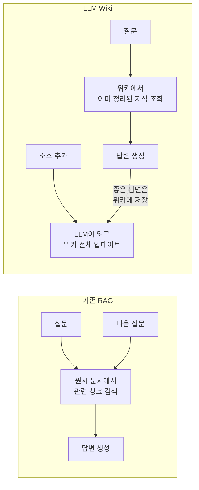
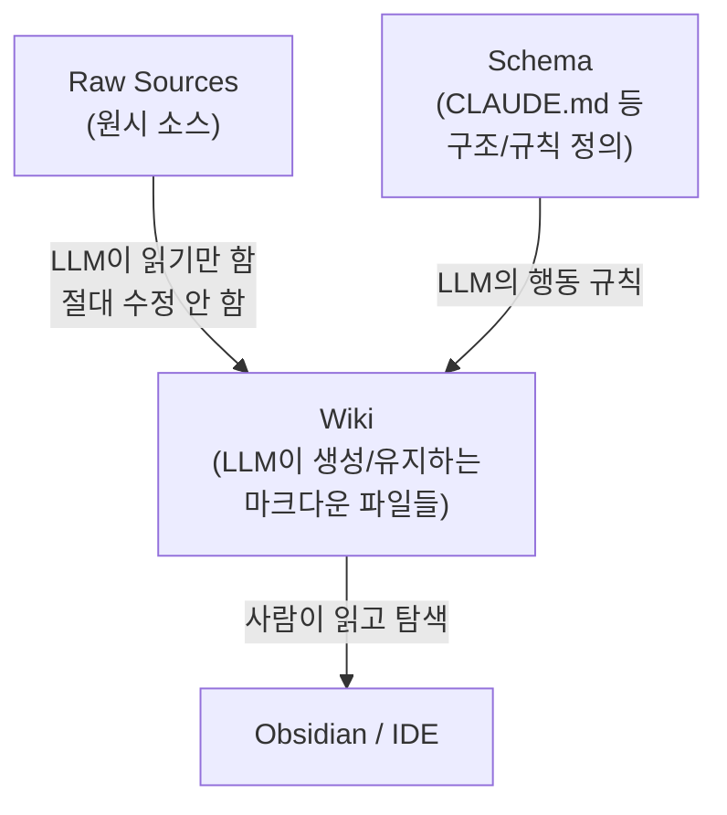
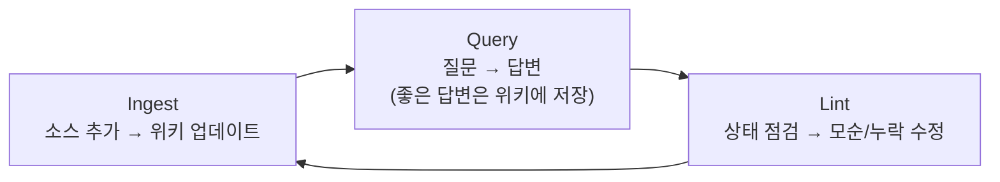

## 들어가며

ChatGPT에 파일을 올리고 질문하면 답은 해줍니다. 근데 다음 날 같은 질문을 하면? 또 처음부터 찾아서 답하죠. 어제 했던 분석이 쌓이지 않습니다. NotebookLM도, RAG도 마찬가지입니다. 매번 원시 문서에서 관련 조각을 검색하고, 조합하고, 답변을 만들어내는 걸 반복합니다.

"지식이 축적되지 않는다" — 이게 기존 방식의 근본적인 한계입니다.

[LLM Wiki](https://gist.github.com/unclejobs-ai/7af4a9e3446751b8e2c3bc66d23fa0ac)는 이 문제에 대한 다른 접근을 제안합니다. LLM이 질문에 답하는 데 그치지 않고, **직접 위키를 구축하고 유지관리**하게 만드는 패턴입니다.

---

## 핵심 개념: 축적되는 지식

기존 RAG와 LLM Wiki의 차이를 한 마디로 말하면 이겁니다.



- **RAG**: 매번 원시 문서에서 지식을 재발견합니다. 5개 문서를 종합해야 하는 질문이면, 매번 5개를 찾아서 짜맞춥니다.
- **LLM Wiki**: 소스를 추가할 때 LLM이 한 번 읽고, 요약하고, 기존 위키에 통합합니다. 상호참조는 이미 만들어져 있고, 모순도 이미 표시되어 있습니다.

위키는 *영속적이고 복리로 축적되는 산출물*입니다. 소스를 추가하고 질문을 할 때마다 점점 더 풍부해집니다.

---

## 아키텍처 (Step by Step)

### Step 1: 3계층 구조 이해하기

LLM Wiki는 세 가지 레이어로 구성됩니다.



| 레이어 | 역할 | 소유자 |
|--------|------|--------|
| **Raw Sources** | 기사, 논문, 데이터 파일 등 원본. *불변(Immutable)*으로 유지 | 사람이 큐레이션 |
| **Wiki** | 요약, 엔티티 페이지, 개념 페이지, 비교, 종합 분석 | LLM이 작성/유지 |
| **Schema** | 위키 구조, 규칙, 워크플로우를 정의하는 설정 파일 | 사람과 LLM이 함께 발전 |

원문에서 이런 비유를 씁니다: "Obsidian은 IDE이고, LLM은 프로그래머이고, 위키는 코드베이스다." 꽤 정확한 비유라고 생각합니다. 사람은 코드 리뷰어 역할이고요.

### Step 2: 3가지 오퍼레이션

위키를 운영하는 핵심 작업은 세 가지입니다.

**수집(Ingest)**: 새 소스를 추가하면 LLM이 읽고, 핵심을 추출하고, 위키 전반에 반영합니다. 하나의 소스가 10~15개 위키 페이지에 영향을 줄 수 있습니다. 엔티티 페이지 업데이트, 인덱스 갱신, 관련 개념 페이지 수정, 로그 기록까지 한 번에 처리합니다.

**질의(Query)**: 위키를 대상으로 질문합니다. LLM이 인덱스에서 관련 페이지를 찾고, 읽은 뒤, 인용과 함께 답변을 만듭니다. 여기서 중요한 포인트가 있는데, **좋은 답변은 새로운 위키 페이지로 저장**할 수 있습니다. 비교 분석이나 발견한 연결 관계가 채팅 기록 속에 사라지지 않고 지식 베이스에 축적되는 거죠.

**점검(Lint)**: 주기적으로 위키 상태를 검사합니다. 페이지 간 모순, 새로운 소스가 대체한 오래된 주장, 인바운드 링크 없는 고아 페이지, 자체 페이지가 없는 중요 개념, 누락된 상호참조 등을 확인합니다.



### Step 3: 인덱스와 로그

위키가 커지면 탐색이 어려워집니다. 두 개의 특별한 파일이 이걸 해결합니다.

**index.md** — 콘텐츠 중심 카탈로그입니다. 모든 위키 페이지를 링크, 한 줄 요약, 메타데이터와 함께 카테고리별로 정리합니다. LLM은 질의에 답할 때 이 인덱스를 먼저 읽어서 관련 페이지를 찾습니다. 소스 100개, 페이지 수백 개 규모에서도 임베딩 기반 RAG 인프라 없이 잘 작동한다고 합니다.

**log.md** — 시간순 기록입니다. 수집, 질의, 점검 이력을 추가 전용(append-only)으로 기록합니다. 각 항목을 `## [2026-04-02] ingest | Article Title` 같은 형식으로 쓰면 `grep`으로 파싱할 수 있어서 편합니다.

---

## 이 방식이 효과적인 이유

원문에서 가장 와닿았던 문장이 있습니다:

> 사람이 위키를 포기하는 이유는 유지관리 부담이 가치보다 빠르게 증가하기 때문이다. LLM은 지루해하지 않고, 상호참조 업데이트를 잊지 않으며, 한 번에 15개 파일을 수정할 수 있다.

정말 그렇습니다. Notion이든 Obsidian이든, 초반에 열심히 정리하다가 결국 유지관리가 귀찮아서 방치하게 되잖아요. LLM에게 이 허드렛일을 맡기면 유지관리 비용이 거의 0에 수렴합니다.

사람의 역할은 **소스를 큐레이션하고, 분석 방향을 잡고, 좋은 질문을 하고, 이 모든 것이 무엇을 의미하는지 생각하는 것**입니다. 나머지는 LLM이 합니다.

---

## 활용 사례

이 패턴은 다양한 맥락에 적용할 수 있습니다:

- **개인**: 목표, 건강, 자기 개선 추적. 일기, 기사, 팟캐스트 메모를 축적
- **리서치**: 수주~수개월간 하나의 주제를 깊이 파고들면서 위키를 성장시킴
- **책 읽기**: 챕터별로 캐릭터, 테마, 플롯 페이지를 만들어가는 동반자 위키
- **비즈니스/팀**: Slack 스레드, 회의록, 프로젝트 문서를 LLM이 내부 위키로 정리
- **경쟁 분석, 여행 계획, 수업 노트** 등 지식이 시간에 걸쳐 축적되는 모든 분야

---

## 실전 팁 (역자 주석에서 발췌)

원문 Gist에는 한국어 번역과 함께 실전에서 바로 쓸 수 있는 역자 주석이 10개 포함되어 있습니다. 그중 특히 유용한 것들을 정리합니다.

### Obsidian 연동

Obsidian 볼트를 LLM 에이전트의 작업 디렉토리로 직접 잡으면 됩니다. Claude Code라면 볼트 루트에서 세션을 열면 끝입니다. LLM이 파일을 수정할 때마다 Obsidian이 자동 감지해서 실시간 반영합니다.

### 스키마(CLAUDE.md)에 넣어야 할 것들

원문에서 "스키마가 핵심"이라고 했지만 구체적 내용은 빠져 있습니다. 최소한 이것들이 필요합니다:

- **디렉토리 구조**: `raw/`, `wiki/entities/`, `wiki/concepts/`, `wiki/sources/` 등
- **페이지 템플릿**: 프론트매터 스키마와 필수 섹션
- **네이밍 규칙**: 파일명 `kebab-case`, 링크 방식 통일
- **수집 워크플로우**: "새 소스가 들어오면 이 순서로 처리하라" 체크리스트
- **금지 사항**: "원시 소스는 절대 수정하지 마라" 등

### 프론트매터 예시

```yaml
---
title: "Attention Is All You Need 논문 요약"
type: source
source_url: https://arxiv.org/abs/1706.03762
author: Vaswani et al.
date_ingested: 2026-04-05
date_published: 2017-06-12
tags: [transformer, attention, deep-learning]
related: [[transformer]], [[self-attention]], [[seq2seq]]
---
```

`type`을 `entity`, `concept`, `source`로 구분하고, `source_count` 필드를 넣으면 Dataview 플러그인으로 "가장 많이 등장하는 개념 TOP 20" 같은 뷰를 바로 만들 수 있습니다.

### 소스 수집 형태별 팁

| 소스 형태 | 수집 방법 |
|----------|----------|
| 웹 기사 | Obsidian Web Clipper로 마크다운 변환 |
| YouTube | `yt-dlp --write-auto-sub`로 자막 추출 |
| PDF 논문 | `marker` 등으로 마크다운 변환 |
| 트위터 스레드 | Thread Reader App → Web Clipper |
| 팟캐스트 | Whisper로 트랜스크립트 생성 |

### 한국어 위키 운영 주의사항

- **파일명은 영어 `kebab-case`**: 한글 파일명은 URL 인코딩, git 호환성 문제가 생김
- **검색**: 한국어는 *교착어(Agglutinative Language)* — 어근에 접사가 붙어 단어가 형성되는 언어 — 라 형태소 분석 없이 검색이 부정확. `index.md`에 영어 키워드를 병기하는 것도 방법
- **태그 병기**: `tags: [인공지능, artificial-intelligence]` 식으로 한영 모두 넣으면 Dataview 쿼리에서 양쪽 다 잡힘

### 세션 간 컨텍스트 유실 해결

LLM Wiki가 해결하는 가장 실질적인 문제입니다. LLM 에이전트는 세션이 끝나면 대화를 잊습니다. 어제 2시간 파고든 분석도 새 세션에서는 처음부터 다시 시작해야 하죠.

위키가 있으면 새 세션을 열었을 때 "index.md를 먼저 읽어"라고 지시하면 됩니다. 어제의 분석은 위키 페이지로 남아 있고, 오늘은 거기서 이어갈 수 있습니다. 스키마에 "세션 시작 시 `index.md`와 `log.md`를 먼저 읽어라"고 써두면 자동화됩니다.

### 비용 감각

- 소스 1건 수집: 수만~십수만 토큰 (기존 위키 페이지 읽기 + 수정된 페이지 출력)
- 질의 1건: 상대적으로 가벼움 (인덱스 + 관련 페이지 2~5개)
- 위키 100페이지 이상: `qmd` 같은 검색 도구 도입 시점

### RAG와의 병행

원문이 RAG를 대체재처럼 설명하지만, 실제로는 **보완재**로 쓸 수 있습니다. 위키가 1차 지식 레이어(컴파일된 지식), 원시 소스에 대한 RAG가 2차 레이어(원문 검증 도구)인 구조입니다.

---

## 정리

이번 글에서 다룬 내용을 정리하면:

- **LLM Wiki**는 RAG와 다르게 지식을 축적하는 패턴. 매번 재검색이 아니라 한 번 정리하고 계속 업데이트
- **3계층 아키텍처**: Raw Sources(불변) → Wiki(LLM 소유) → Schema(공동 발전)
- **3가지 오퍼레이션**: Ingest(수집), Query(질의), Lint(점검)
- 사람은 큐레이션과 방향 설정, LLM은 정리와 유지관리를 담당
- Obsidian + Claude Code 조합으로 실시간 위키 구축이 가능
- 세션 간 컨텍스트 유실 문제를 가장 직접적으로 해결하는 패턴

---

## 추가로 공부하면 좋을 개념

이 주제를 더 깊이 이해하려면 아래 개념들도 함께 살펴보면 좋습니다:

- **Vannevar Bush의 Memex (1945)**: LLM Wiki의 정신적 조상. 문서 간 연상적 경로를 가진 개인 지식 저장소 개념
- **Zettelkasten 메서드**: 니클라스 루만의 메모 상자 시스템. 원자적 메모와 상호 링크 기반 지식 관리
- **qmd**: 마크다운 파일용 로컬 검색 엔진. BM25/벡터 하이브리드 검색 + MCP 서버 지원
- **Dataview (Obsidian 플러그인)**: 프론트매터 기반 동적 쿼리로 위키를 데이터베이스처럼 활용
- **원문 Gist**: [LLM Wiki — unclejobs-ai](https://gist.github.com/unclejobs-ai/7af4a9e3446751b8e2c3bc66d23fa0ac) (한국어 번역 + 역자 주석 10개 포함)
