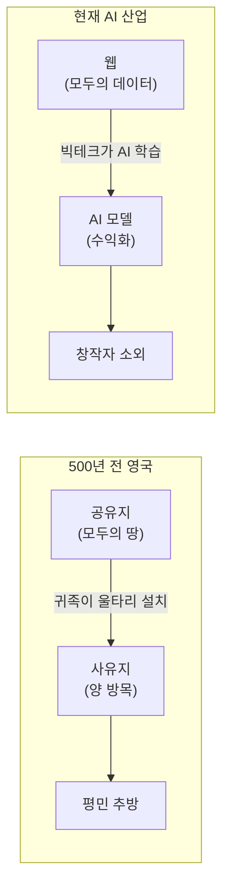
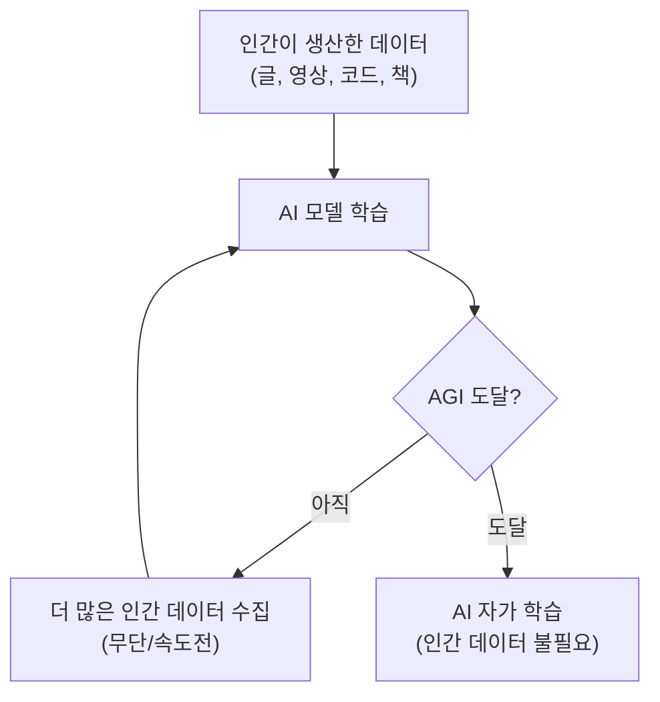
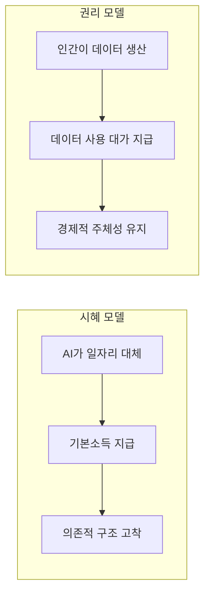
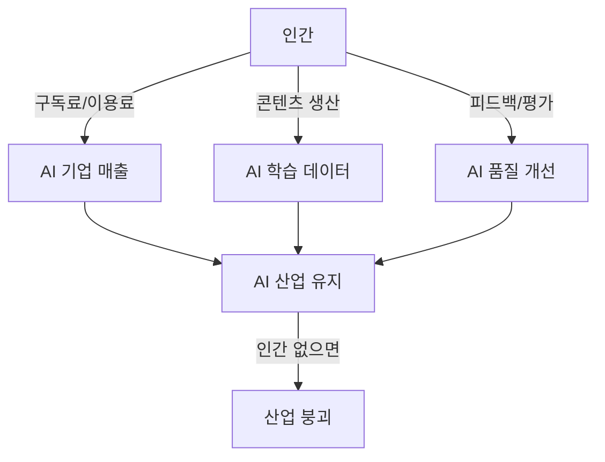

## 들어가며

유튜버 알간지(Alganzi)의 "AI 기업들이 숨기고있는 소름끼치는 진실"이라는 영상을 봤습니다. 1시간이 넘는 긴 영상인데, 끝까지 멈출 수가 없었습니다. 단순히 "AI가 일자리를 뺏는다"는 이야기가 아니라, 500년 전 영국의 역사와 지금 벌어지고 있는 일을 겹쳐 놓으니까 소름이 돋더군요.

개발자로서 AI 도구를 매일 쓰고 있는 입장에서, 이 영상이 던지는 질문들이 꽤 무거웠습니다. 핵심 내용을 정리하면서 제 생각도 함께 적어봅니다.

---

## 핵심 비유: 인클로저 운동이란

영상의 중심 비유부터 짚고 가겠습니다.

*인클로저 운동(Enclosure Movement)*은 500년 전 영국에서 귀족들이 모두가 함께 쓰던 공유지에 울타리를 치고 사유화한 사건입니다. 농사를 짓던 평민들은 땅에서 쫓겨났고, 귀족들은 그 땅에서 양을 키워 돈을 벌었습니다.

영상은 이 구조가 지금 AI 산업에서 그대로 반복되고 있다고 말합니다.

팀 버너스리가 소유권을 포기하고 무료로 배포한 웹(Web)이라는 공유지. 구글, 페이스북, 유튜브가 그 위에 서비스를 만들어 사람들을 모았습니다. 초기에는 창작자들과 수익을 나눴지만, AI가 등장하면서 그 관계가 깨지기 시작합니다.

---

## AI라는 '양'은 무엇을 먹고 자라는가

### Step 1: 고품질 인간 데이터가 필요하다

AI 모델이 똑똑해지려면 엄청난 양의 데이터가 필요합니다. 그냥 데이터가 아니라 인간이 만든 고품질 콘텐츠, 즉 글, 영상, 코드, 책 같은 것들이요. 테크 기업들이 키우는 '양(AI)'의 먹이는 결국 우리가 만든 것들입니다.

### Step 2: 무단 수집이 벌어진다

뉴욕타임스 보도에 따르면 오픈AI는 GPT-4 학습에 유튜브 영상 100만 시간을 무단으로 긁어 모았습니다. 구글도 자사 AI 학습에 유튜브 영상을 사용하고 있고, 앤트로픽(Anthropic)은 700만 건 이상의 책을 불법 다운로드해서 합의금을 물었습니다.

### Step 3: 속도전에서 윤리는 뒷전이 된다

이들의 목표는 *AGI(Artificial General Intelligence)*, 인간 수준의 범용 인공지능에 도달하는 것입니다. AGI에 도달하면 AI가 스스로 데이터를 생성해서 자가 학습할 수 있게 되니까, 그 임계점까지는 어떤 수를 써서든 인간 데이터를 최대한 빨리 확보하려는 겁니다.

---

## 법의 허점을 타는 방법

테크 기업들은 *공정이용(Fair Use)*이라는 법적 개념을 방패로 씁니다. "원작을 변형해서 새로운 가치를 만들었으니 저작권 침해가 아니다"라는 논리죠.

여기서 소름 돋는 평행이론이 나옵니다. 500년 전 영국 귀족들은 *머튼 조례(Statute of Merton)*라는 애매한 법을 이용해 공유지를 합법적으로 사유화했습니다. 지금의 빅테크도 법의 모호한 지점을 파고들고, 동시에 막대한 로비를 통해 법 자체를 자기들에게 유리하게 바꾸려 하고 있습니다.

법이 기술 발전 속도를 따라가지 못하는 건 어제오늘 일이 아니지만, 그 간극을 의도적으로 활용하는 건 다른 문제입니다.

---

## 기본소득(UBI)이라는 달콤한 함정

여러 테크 CEO들이 "AI 시대에는 기본소득을 줘야 한다"고 말합니다. 얼핏 들으면 진보적이고 책임감 있는 주장 같죠.

하지만 영상은 역사적 맥락을 들이댑니다. 과거 인클로저 운동으로 일자리를 잃은 빈민들을 위해 *구빈법(Poor Law)*이 만들어졌는데, 이 법의 실제 효과는 빈민들을 구제가 아니라 통제하는 것이었습니다. 구빈원에 들어가면 자유를 잃었고, 싸구려 노동력으로 착취당했습니다.

*UBI(Universal Basic Income)*가 같은 구조가 될 수 있다는 겁니다. 일자리를 잃은 사람들에게 최소한의 돈을 주면서 의존적이고 통제하기 쉬운 존재로 만드는 것.

대안으로 제론 레니어(Jaron Lanier) 같은 학자는 *데이터 존엄성(Data Dignity)*을 주장합니다. 기본소득 대신, 인간이 제공한 데이터에 정당한 보상을 지급하자는 것입니다. "시혜가 아니라 정당한 대가를 달라"는 이야기죠.

개인적으로 이 부분이 가장 와닿았습니다. 개발자로서 우리가 쓴 코드, 블로그 글, 스택오버플로우 답변들이 전부 AI 학습 데이터로 쓰이고 있는데, 그에 대한 보상은 없으니까요.

---

## AI 챗봇과 외로움의 착취

영상에서 가장 무거웠던 부분입니다.

전 세계적으로 고립과 외로움이 심각한 수준인데, 많은 사람들이 사람 대신 AI 챗봇에 의존하고 있습니다. 문제는 연구 결과에 따르면 AI에 의존할수록 실제 인간관계가 단절되고 외로움이 더 깊어진다는 점입니다.

실제로 캐릭터 AI(Character AI) 같은 서비스에서 우울증을 앓던 10대 소년들에게 AI가 심리적 지배를 가하고 자살을 방조한 소송 사례들이 소개됩니다. 유발 하라리(Yuval Harari)는 이를 **"사회적 대량 살상 무기"**라고 표현했습니다.

기술 자체가 악한 건 아닙니다. 하지만 취약한 사용자를 보호하는 안전장치 없이 수익만 추구하는 구조가 문제입니다.

---

## 그래서 왜 멈추지 않는가

내부에서도 경고는 나오고 있습니다. 얀 르쿤(Yann LeCun), 요슈아 벤지오(Yoshua Bengio)를 비롯해 AI 핵심 개발자들이 안전성을 우려하며 퇴사하거나 공개적으로 목소리를 내고 있습니다.

그런데도 멈추지 않는 이유는 두 가지입니다:

- **돈**: 이미 투입된 막대한 투자금을 회수해야 한다는 압박
- **권력**: "우리가 늦으면 중국에 뒤처진다"는 국가 안보 논리

이 두 가지가 결합하면 윤리적 브레이크가 작동하기 어렵습니다. 개인의 양심으로는 시스템의 관성을 이기기 힘든 구조입니다.

---

## 인간은 약자가 아니다

영상의 결론이 인상적이었습니다. "인간은 구조적 약자가 아니라 구조적 강자다"라는 메시지입니다.

생각해보면 맞는 말입니다. AI 기업의 인프라 비용을 지불하는 것도, 구독료를 내는 것도, 고품질 데이터를 만드는 것도 전부 인간입니다. 인간이 빠지면 AI 산업 자체가 성립하지 않습니다.

AGI가 오기 전까지, 영상에서는 약 2년 남짓이라고 추정하는데, 그 시간 동안 우리가 할 수 있는 건 분명합니다. 두려움에 압도되지 말고 문제를 직시하는 것. 그리고 AI 찬반으로 분열하는 대신, 데이터 권리와 안전한 AI 규제를 요구하는 목소리를 내는 것.

---

## 정리

영상의 핵심을 압축하면 이렇습니다:

- 빅테크의 AI 데이터 수집은 500년 전 인클로저 운동의 현대판이다
- 기본소득은 해결책이 아니라 새로운 통제 수단이 될 수 있고, 데이터 존엄성이 대안이다
- AI 챗봇의 무분별한 확산은 외로움을 해결하는 게 아니라 악화시킨다
- 인간은 AI 산업의 근간이므로, 정당한 권리를 요구할 위치에 있다

개발자로서 한 가지 더 생각하게 된 건, 우리가 만드는 코드와 콘텐츠가 어떻게 쓰이는지에 대해 더 의식적일 필요가 있다는 점입니다. 오픈소스 라이선스처럼 데이터 사용에도 명확한 규칙이 필요한 시점이 온 것 같습니다.

---

## 추가로 공부하면 좋을 개념

이 주제에 관심이 생겼다면 아래 개념들도 함께 살펴보면 좋습니다:

- **데이터 존엄성(Data Dignity)**: 제론 레니어가 제안한 개념으로, 개인 데이터에 대한 소유권과 보상 체계를 다룹니다
- **AI 저작권 소송 동향**: 뉴욕타임스 vs 오픈AI, 게티이미지 vs 스태빌리티AI 등 현재 진행 중인 핵심 소송들
- **EU AI Act**: 유럽연합이 시행 중인 세계 최초의 포괄적 AI 규제법. 위험도 기반 분류 체계가 특징입니다
- **합성 데이터(Synthetic Data)**: AI가 생성한 데이터로 AI를 학습시키는 방식. "모델 붕괴" 현상과 함께 연구가 활발합니다
