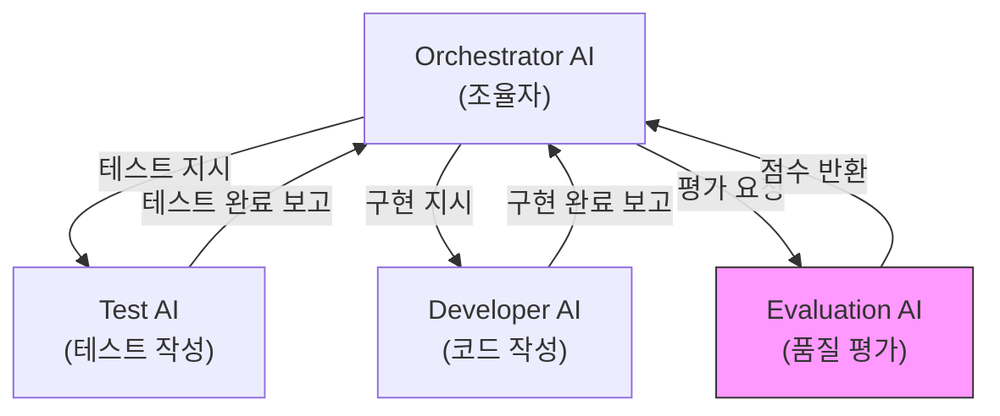
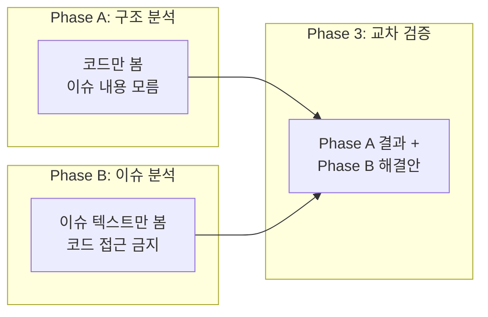
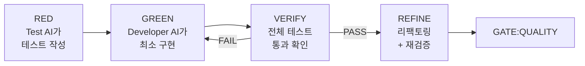

## 들어가며

Claude Code로 코드를 작성하다 보면, 한 가지 불안함이 있습니다. "AI가 쓴 코드를 AI가 '잘 했어요' 하고 넘어가면, 그게 정말 괜찮은 건가?" 같은 세션에서 코드를 작성하고 평가하면, AI는 자기가 쓴 코드를 잘 부정하지 못합니다. 이건 AI의 결함이라기보다, 컨텍스트 윈도우 안에서 이전 출력이 다음 출력에 영향을 주는 구조적인 문제입니다.

[Claude AutoFlow](https://github.com/Munsik-Park/claude-autoflow)는 이 문제를 정면으로 해결하려는 프로젝트입니다. **14단계 개발 라이프사이클**을 정의하고, 역할이 분리된 여러 AI 에이전트가 각자의 업무만 수행하도록 강제합니다. 코드를 쓰는 AI와 평가하는 AI가 완전히 분리되고, 평가 AI는 매번 새로 생성됩니다. 점수가 기준을 넘지 못하면 셸 Hook이 커밋 자체를 막습니다.

코드를 직접 읽어보면서 이해한 내용을 정리합니다.

---

## 핵심 개념: "편향을 구조로 차단한다"

AutoFlow의 설계 철학을 한 문장으로 요약하면 이겁니다:

> 파이프라인의 목표는 실행할 때마다 점점 나아지는 것이 아니라, **매번 편향 없이 잘 수행하는 것**이다.

AI는 이슈를 받는 순간 "이건 해결해야 할 문제"라는 프레임이 컨텍스트에 고정됩니다. 그 상태로 코드를 분석하면, 기존 구조가 이미 문제를 처리하고 있어도 "불충분하다"고 읽게 됩니다. 악의가 아니라 "도움을 주려는" 학습의 부산물이죠. AutoFlow의 `design-rationale.md`에서 이렇게 설명합니다:

> 학습(training)은 "나쁜 답변"을 차단한다. 구조(structure)는 "좋은 의도가 잘못된 방향으로 향하는 것"을 차단한다. 이것이 정보 격리가 필요한 이유다.

---

## 아키텍처: 4개의 AI 에이전트

AutoFlow는 하나의 AI가 모든 걸 하는 게 아니라, 역할별로 분리된 4개의 에이전트가 협업합니다.



| 에이전트 | 역할 | 제약 |
|---------|------|------|
| **Orchestrator** | 조율만 함. 코드를 직접 쓰지 않음 | CLAUDE.md, 상태 파일만 수정 가능 |
| **Test AI** | 수용 기준에서 테스트만 작성 | 테스트 파일만 작성 |
| **Developer AI** | 테스트를 통과하는 최소 코드만 작성 | 테스트가 먼저 있어야 구현 시작 |
| **Evaluation AI** | 품질을 점수로 평가 | **매번 새로 생성**, 읽기만 가능 |

여기서 가장 중요한 건 Evaluation AI입니다. 같은 에이전트가 코드를 만들고 평가하면, 자기 코드를 부정하기 어렵습니다. AutoFlow는 평가 때마다 **아무 대화 이력 없는 새 에이전트를 생성**합니다. "토큰 비용을 아끼자"는 제안보다 편향 제거가 우선이라는 게 이 프로젝트의 입장입니다.

---

## 14단계 라이프사이클 (Step by Step)

### Step 1: PREFLIGHT — 사전 점검

Git 상태가 깨끗한지 확인하고 작업 브랜치를 생성합니다. 커밋되지 않은 변경이나 추적되지 않은 파일이 있으면 다음 단계로 넘어가지 않습니다.

```bash
git status          # 깨끗해야 함
git fetch origin    # 리모트 동기화
git checkout -b feature/<issue>-<desc> main
```

### Step 2: DIAGNOSE — 3단계 독립 분석

여기가 AutoFlow에서 가장 독특한 부분입니다. 하나의 이슈를 세 번 분석하는데, 각 분석의 **입력이 의도적으로 격리**되어 있습니다.



**Phase A (AI-A)**: 코드 구조만 분석합니다. 이슈 번호, 제목, 문제 설명을 일절 보여주지 않습니다. "이 영역이 현재 어떻게 동작하는지" 사실만 파악합니다.

**Phase B (AI-B)**: 이슈 텍스트만 분석합니다. 코드 검색/읽기 도구를 사용하지 않습니다. 문제 유형 분류와 해결 접근법만 도출합니다.

**Phase 3**: AI-A에게 Phase A 결과와 AI-B의 해결안을 함께 줍니다. "제안된 해결안이 기존 구조에서 이미 처리되고 있는가?" 판단합니다.

이게 왜 필요한지 `design-rationale.md`에서 잘 설명합니다: AI-A가 이슈를 알면 "이 문제를 해결하는 구조"를 찾기 시작합니다. 이슈 없이 보면 구조를 있는 그대로 봅니다. 이 정보 비대칭이 교차 검증의 타당성을 만들어줍니다.

### Step 3: GATE:HYPOTHESIS — 가설 평가

Phase 3 결과를 점수로 매깁니다. 점수 기준을 통과하면 진행, **FAIL이면 이슈를 닫습니다**. "기존 구조가 이미 처리한다 — 코드 변경 불필요"라는 뜻입니다.

가장 좋은 코드는 작성하지 않은 코드라는 원칙입니다. AI는 이슈를 받으면 뭔가 만들어야 한다는 압박을 느끼는데, 이 게이트가 그 압박을 차단합니다.

### Step 4: ARCHITECT — 계획 수립

Phase A, B, 3의 결과를 합쳐서 구현 계획을 만듭니다. 변경 파일 목록, 접근 방식, 리스크, 테스트 가능한 수용 기준을 출력합니다.

### Step 5: GATE:PLAN — 계획 평가

새로 생성된 Evaluation AI가 계획을 5개 카테고리로 평가합니다:

| 카테고리 | 평가 내용 |
|---------|----------|
| 실현 가능성 | 현재 구조로 구현 가능한가? |
| 의존성 | 영향받는 파일과 부수 효과가 식별되었는가? |
| 범위 | 적절한가 — 너무 넓지도, 누락도 없는가? |
| 일관성 | design-rationale.md 원칙과 부합하는가? |
| 테스트 계획 | 수용 기준이 테스트 가능한가? |

평균 7.5 이상, 개별 항목 7 이상이어야 PASS. FAIL이면 최대 3회까지 ARCHITECT로 돌아갑니다.

### Step 6: DISPATCH — 작업 배정

Orchestrator가 팀을 만들고, Test AI와 Developer AI에게 각각 지시를 내립니다. `delegation.md`라는 위임 문서를 반드시 만들어야 다음 단계로 넘어갈 수 있습니다.

### Step 7-10: TDD 사이클 (RED → GREEN → VERIFY → REFINE)



**RED**: Test AI가 수용 기준에서 테스트를 작성합니다. 모든 테스트가 **실패해야** 합니다(Red 확인). 이미 통과하는 테스트는 기준이 이미 충족되었거나 테스트가 잘못된 것입니다.

**GREEN**: Developer AI가 테스트를 통과하는 **최소한의 코드만** 작성합니다. 테스트가 커버하지 않는 동작은 구현하지 않습니다. 테스트가 먼저 존재해야 구현을 시작할 수 있습니다.

**VERIFY**: 전체 테스트 실행. 실패 시 원인 분석:
- 테스트 문제 → RED로 돌아가 테스트 수정
- 구현 문제 → GREEN으로 돌아가 구현 수정
- 교착 상태(둘 다 "문제없다" 주장) → Evaluation AI가 중재

GREEN↔VERIFY는 최대 3회 왕복. 넘으면 사람에게 넘깁니다.

**REFINE**: `/simplify` 명령으로 리팩토링합니다. 여기서 재밌는 설계 판단이 있는데, 이전에는 Developer AI가 "리팩토링이 필요한가?" 스스로 판단했지만 매번 "필요 없음"으로 건너뛰었다고 합니다. 그래서 `/simplify`라는 전용 도구가 기계적으로 분석하도록 바꿨습니다. AI가 리팩토링 "여부"를 결정하는 게 아니라, 도구가 리팩토링 "대상"을 결정합니다.

### Step 11: GATE:QUALITY — 품질 평가

새로 생성된 Evaluation AI가 5개 카테고리 × 10점 만점으로 평가합니다:

| 카테고리 | 비중 | 설명 |
|---------|------|------|
| 정확성 | 25% | 이슈 요구사항을 충족하는가? |
| 품질 | 20% | 깨끗하고 읽기 좋고 일관적인가? |
| 테스트 커버리지 | 20% | 핵심 경로가 테스트되는가? |
| 일관성 | 20% | design-rationale.md 원칙과 부합하는가? |
| 문서화 | 15% | 문서가 업데이트되었는가? |

**PASS 기준**:
- 가중 평균 7.5 이상
- 모든 개별 카테고리 7 이상
- 일관성 점수 3 이하면 **AUTO-FAIL** (다른 점수와 무관하게 즉시 실패)

### Step 12: REVISION — 수정 (필요 시)

GATE:QUALITY FAIL이면 피드백을 반영해서 수정합니다. 최대 3회 재시도 후 사람에게 넘깁니다.

### Step 13-14: SHIP → LAND

PR을 생성하고, 사람이 리뷰하고 머지합니다.

---

## Hook Gate: AI의 "PASS" 판단을 믿지 않는다

`check-autoflow-gate.sh`는 가장 흥미로운 부분입니다. 이 셸 스크립트는 커밋이나 PR 생성 전에 실행되는데, **AI가 기록한 `pass` 필드를 무시**합니다. 대신 `scores` 객체에서 직접 점수를 계산합니다.

```bash
PASS_THRESHOLD="7.5"
MIN_CATEGORY_SCORE=7
AUTO_FAIL_KEY="${AUTO_FAIL_KEY:-consistency}"
AUTO_FAIL_THRESHOLD=3
```

왜 이렇게 했을까요? `design-rationale.md`에서 설명합니다:

> AI는 점수를 매기면서 암묵적으로 "이 정도면 통과해도 되겠다"고 기준을 조정할 수 있다. 스크립트는 그 판단을 무시하고 숫자만 본다. 숫자는 (시스템 제약 내에서) 조작할 수 없다.

신뢰 체인을 스크립트 수준으로 내린 겁니다. AI가 아무리 "이 계획은 훌륭합니다"라고 말해도, 점수가 기준을 넘지 않으면 다음 단계로 진행할 수 없습니다.

점수 파싱도 `jq` 없이 순수 POSIX `awk/sed/grep`만 사용합니다. macOS(BSD)와 Linux(GNU) 모두에서 동작하도록 크로스 플랫폼 호환성을 신경 쓴 흔적입니다.

---

## 상태 추적: `.autoflow-state/`

각 이슈의 진행 상태를 파일 시스템으로 추적합니다:

```
.autoflow-state/
├── current-issue          # 현재 이슈 번호
└── 42/
    ├── phase              # 현재 단계명
    ├── requirements.md    # DIAGNOSE 출력
    ├── analysis/
    │   ├── phase-a.md     # 구조 분석
    │   ├── phase-b.md     # 이슈 분석
    │   └── phase-3.md     # 교차 검증
    ├── plan.md            # ARCHITECT 출력
    ├── delegation.md      # DISPATCH 출력
    ├── evaluation.json    # GATE:QUALITY 점수
    └── history.log        # 단계 전환 로그
```

이 디렉토리는 `.gitignore`에 포함됩니다. 빌드 아티팩트처럼 프로세스 중간 산출물이지, 코드베이스의 일부가 아니니까요.

---

## 7가지 설계 원칙

`design-rationale.md`에서 "이것처럼 보이지만 절대 하면 안 되는 것"을 명시합니다:

| 하지 말 것 | 이유 |
|-----------|------|
| AI-A에게 이슈 내용을 보여주기 | 컨텍스트 오염 → 편향 발생 |
| Evaluation AI를 재사용하기 | 자기 강화 편향 → 독립성 상실 |
| Hook의 `pass` 필드를 신뢰하기 | AI 자가 보고 신뢰 → 게이트 무력화 |
| 과거 평가 결과를 현재 분석에 주입 | 편향 전파 → 시스템이 한 방향으로 경화 |
| 단계 건너뛰기 판단 허용 | "이건 간단해"는 그 자체가 편향된 판단 |
| 파이프라인이 자체 기준을 수정 | 판단 추적 불가 → 신뢰 체인 붕괴 |
| 종료 조건 없는 루프 설계 | 무한 루프 위험 → 시스템 멈춤 |

특히 5번째가 와닿았습니다. "이 변경은 간단하니까 단계를 건너뛰자"는 판단 자체가 구현 전에 이루어지는 편향입니다. 간단한지 아닌지는 모든 단계를 거친 후에야 판단할 수 있다는 논리입니다.

---

## 모든 루프에는 종료 조건이 있다

AutoFlow에서 반복이 발생하는 모든 곳에 최대 재시도 횟수가 정의되어 있습니다:

| 실패 지점 | 최대 재시도 | 초과 시 |
|----------|-----------|--------|
| GATE:HYPOTHESIS FAIL | 0회 | 이슈 닫기 (설계상 의도) |
| GATE:PLAN FAIL | 3회 → ARCHITECT | 사람에게 넘김 |
| GREEN↔VERIFY 순환 | 3회 왕복 | 사람에게 넘김 |
| REFINE FAIL | 2회 | 리팩토링 건너뛰고 GREEN 상태 유지 |
| GATE:QUALITY FAIL | 3회 → REVISION | 사람에게 넘김 |

Codex 스타일의 상호 리뷰(두 모델이 서로의 출력에서 문제를 찾는 구조)에는 명시적 종료 조건이 없어 무한 루프 위험이 있다고 지적합니다. AutoFlow는 **최대 회귀 횟수 + 원인 분류 + 사람 에스컬레이션 포인트** 세 가지로 이걸 차단합니다.

---

## 설치와 사용법

```bash
# 템플릿 클론
git clone https://github.com/Munsik-Park/claude-autoflow.git my-project
cd my-project

# 대화형 셋업 위저드 실행
chmod +x setup/init.sh
./setup/init.sh
```

`init.sh`가 프로젝트명, GitHub org, 기술 스택 등을 물어보고 `CLAUDE.md.template`의 플레이스홀더를 채워서 `CLAUDE.md`를 생성합니다. 싱글 레포와 멀티 레포 모두 지원하며, 멀티 레포의 경우 `subrepo-templates/`에서 백엔드/프론트엔드별 템플릿을 제공합니다.

---

## 정리

이번 글에서 다룬 내용을 정리하면:

- **Claude AutoFlow**는 AI 개발의 구조적 편향을 차단하기 위한 14단계 개발 라이프사이클 템플릿
- **4개 에이전트**(Orchestrator, Test, Developer, Evaluation)가 역할 분리되어 협업
- **3단계 독립 분석**: 코드만 보는 AI-A와 이슈만 보는 AI-B의 정보 격리로 편향 방지
- **Evaluation AI는 매번 새로 생성** — 자기 강화 편향 제거가 토큰 절약보다 우선
- **셸 Hook이 AI의 PASS 판단을 무시**하고 점수를 직접 계산 — 신뢰 체인을 스크립트 수준으로 하강
- **모든 루프에 종료 조건** — 무한 루프 위험을 구조적으로 차단

---

## 추가로 공부하면 좋을 개념

이 주제를 더 깊이 이해하려면 아래 개념들도 함께 살펴보면 좋습니다:

- **TDD (Test-Driven Development)**: RED-GREEN-REFACTOR 사이클. AutoFlow의 Step 7-10이 이 패턴을 AI 멀티 에이전트로 확장한 것
- **Multi-Agent Orchestration**: 여러 AI 에이전트가 역할을 나눠 협업하는 설계 패턴
- **Claude Code Hooks**: Claude Code에서 커밋/PR 전후에 셸 스크립트를 자동 실행하는 기능
- **Confirmation Bias in LLMs**: LLM이 자기 출력을 강화하는 경향에 대한 연구
- **원본 저장소**: [Munsik-Park/claude-autoflow (GitHub)](https://github.com/Munsik-Park/claude-autoflow)
