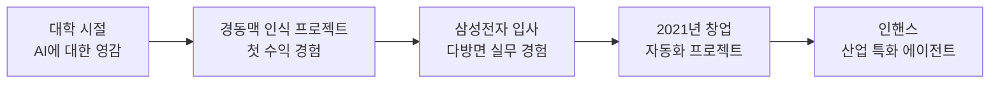
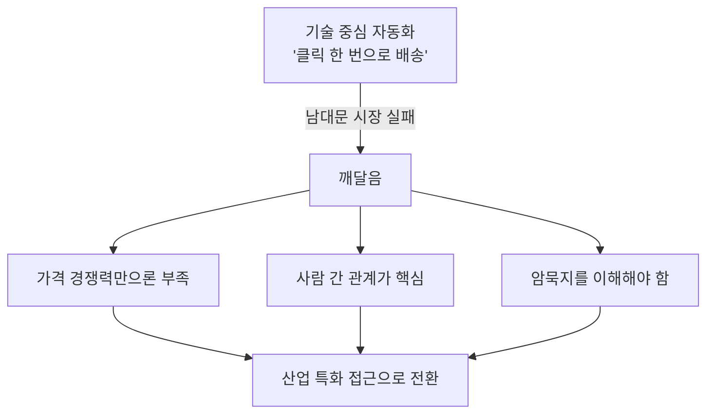
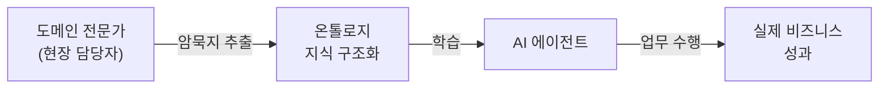

## 들어가며

최근에 인핸스라는 AI 에이전트 스타트업의 창업기를 다룬 영상을 봤는데, 꽤 인상 깊었습니다. 단순히 "AI로 대박 났다"는 이야기가 아니라, 현장에서 수없이 부딪히면서 결국 자기만의 기술적 해자를 만들어간 과정이 생생하게 담겨 있었거든요.

특히 개발자 출신 창업자가 어떻게 도메인 지식과 기술력을 결합해서 실제 매출로 연결시켰는지, 그 과정에서 어떤 커리어 선택이 있었는지가 흥미로웠습니다. 정리해봅니다.

---

## 인핸스는 어떤 회사인가

*인핸스(Enhance)*는 특정 산업을 깊이 이해하고 기업의 실제 업무에 맞춰 동작하는 **산업 특화 AI 에이전트**를 만드는 회사입니다. 범용 챗봇이 아니라, 커머스, 제조, 금융 같은 각 산업의 업무 프로세스를 학습한 에이전트를 공급하는 거죠. 최근 약 100억 원의 매출을 달성했다고 합니다.

---

## 창업까지의 커리어 경로

이승현 대표의 커리어 여정을 보면, 각 단계마다 나중에 창업에 필요한 역량을 쌓아간 흐름이 보입니다.

### Step 1: 영감의 시작 - 영화 한 편

대학 시절 영화 '허(Her)'를 보고 AI가 사람과 대화하며 일을 대신해주는 세상에 매료됐다고 합니다. 저도 이 영화 봤을 때 "이런 게 진짜 되면 세상이 바뀌겠다" 싶었는데, 이 사람은 거기서 한 발 더 나아가 직접 만들겠다고 결심한 거죠.

### Step 2: 첫 번째 성공 체험 - 경동맥 인식 프로그램

의대 교수님의 제안으로 팀원들과 경동맥 인식 프로그램을 만들었는데, 실제로 수익이 났습니다. "내가 만든 게 돈이 된다"는 경험은 강력합니다. 이때 유의미한 걸 만들고 수익을 나누는 구조, 즉 창업의 본질을 맛본 셈입니다.

### Step 3: 삼성전자에서의 전략적 커리어 설계

여기가 제일 인상 깊었습니다. 개발은 할 줄 아는데, 기업 운영 전반(마케팅, 인사, 재무)을 모른다는 걸 자각하고 삼성전자에 입사합니다. 그런데 엔지니어로 들어가서 그냥 개발만 한 게 아닙니다.

**본인이 직접 손을 들고 부서 이동을 자청**하면서 인사팀, AI 프로젝트, UX/디자인 팀까지 돌았습니다. 대기업에서 이렇게 움직이는 사람은 많지 않은데, 결국 이 경험들이 창업 후 사업 운영의 기반이 됐습니다.

---

## 창업 초기: 현장에서 배운 것들

### Step 4: 첫 자동화 - 중국 수입 물류

2021년, 룸메이트가 중국에서 신발 박스를 수입해 파는 사업을 하고 있었는데, 수작업이 너무 많았습니다. 이걸 자동화해주면서 창업 아이디어가 구체화됩니다.

첫 프로젝트는 꽤 야심찼습니다. 중국 공장 상품을 클릭 한 번으로 국내 창고까지 배송하는 자동화 시스템. 기술적으로는 잘 동작했지만, 남대문 시장에 가져갔을 때 반응은 냉담했습니다.

### Step 5: 가격이 아니라 관계와 암묵지

여기서 배운 교훈이 핵심입니다. 시장 상인들이 이 시스템을 안 쓴 이유는 기술이 부족해서가 아니었습니다.

> 가격 경쟁력보다 사람 간의 관계, 그리고 문서화되지 않은 업무 프로세스인 **암묵지**가 더 중요했다.

*암묵지(Tacit Knowledge)*란 매뉴얼에는 안 적혀 있지만 현장에서 오래 일한 사람만 아는 노하우를 말합니다. "이 공장은 화요일에 발주하면 금요일에 오고, 저 공장은 사장님한테 직접 전화해야 빨리 나온다" 같은 것들이죠.

---

## 기술적 돌파구: 온톨로지

### Step 6: 기업마다 다른 업무를 어떻게 학습시킬까

기업마다 판매 전략, 재고 관리, 고객 응대 방식이 전부 다릅니다. 범용 자동화 도구로는 이걸 커버할 수 없다는 걸 깨닫고, 각 기업에 맞게 커스터마이징 가능한 플랫폼을 만들기 시작합니다.

### Step 7: 온톨로지로 암묵지를 구조화하다

여기서 삼성전자 연구소 시절의 경험이 빛을 발합니다. *온톨로지(Ontology)*는 세상의 지식과 개념 간 관계를 체계적으로 정의해서 AI가 이해할 수 있는 형태로 만드는 지식 체계입니다.

쉽게 말하면 이런 겁니다:

- 현장 전문가들이 갖고 있는 암묵지를 추출하고
- 온톨로지로 구조화해서
- 에이전트가 빠르게 학습하도록 만든 겁니다

이 접근 덕분에 새로운 산업에 진입할 때마다 처음부터 다시 만드는 게 아니라, 해당 산업의 도메인 지식만 온톨로지에 녹여넣으면 에이전트가 동작할 수 있게 됐습니다.

---

## 확장과 비전

커머스와 리테일에서 시작했지만, 기술적 확신이 쌓이면서 제조, 금융, 국방까지 영역을 넓혀가고 있습니다.

2026년 3월에는 알파고와 이세돌 9단 대국 10주년 행사를 열면서, AI와 인간의 관계가 '대결'에서 '협업'으로 바뀌었다는 메시지를 던졌습니다. 이승현 대표는 "AI 시대의 마이크로소프트 같은 글로벌 운영 체제 기업"을 목표로 하고 있다고 합니다.

---

## 개발자 커리어 관점에서 배울 점

이 이야기를 보면서 몇 가지 생각이 들었습니다.

**"T자형 커리어"의 실제 사례다.** 이승현 대표가 삼성에서 엔지니어링 외에 인사, UX, AI 프로젝트를 돌아본 건 전형적인 T자형 인재 전략입니다. 기술적 깊이(세로축)를 유지하면서 비즈니스 이해(가로축)를 넓힌 거죠. 당장은 비효율적으로 보일 수 있지만, 창업이나 리더십 역할에서 이 폭이 결정적인 차이를 만듭니다.

**현장 경험 없이 기술만으로는 한계가 있다.** 남대문 시장 실패 에피소드가 이걸 잘 보여줍니다. 기술적으로 완벽한 솔루션이라도 현장의 맥락을 모르면 아무도 안 씁니다. 개발자가 도메인 지식을 쌓아야 하는 이유이기도 하고요.

**대기업 경험을 전략적으로 활용할 수 있다.** "대기업 다니다 나왔다"가 아니라, 대기업에서 뭘 배울지 미리 계획하고 능동적으로 움직인 점이 다릅니다. 부서 이동을 자청한 건 상당한 주체성이 필요한 행동입니다.

---

## 정리

- 인핸스는 범용 AI가 아니라 **산업별 암묵지를 온톨로지로 구조화**해서 에이전트를 만드는 접근으로 100억 매출을 달성
- 창업 전 삼성에서의 **다방면 실무 경험**이 사업 운영의 기반이 됨
- 기술만으로는 부족하고, **현장의 맥락(암묵지)을 이해하는 것**이 제품의 성패를 가름
- 온톨로지 기술 덕분에 새로운 산업으로의 **확장이 구조적으로 가능**해짐

---

## 추가로 공부하면 좋을 개념

- **온톨로지(Ontology)와 지식 그래프**: AI가 도메인 지식을 이해하는 방식의 기술적 배경. [위키피디아 - Ontology (information science)](https://en.wikipedia.org/wiki/Ontology_(information_science))
- **암묵지와 형식지**: 노나카 이쿠지로의 SECI 모델. 조직 내 지식이 어떻게 전환되는지를 설명하는 프레임워크
- **T자형 인재 전략**: 기술적 깊이와 비즈니스 폭을 동시에 갖추는 커리어 설계 방법론
- **도메인 주도 설계(DDD)**: 소프트웨어 설계에서 도메인 지식을 코드에 녹여내는 접근. 인핸스의 온톨로지 접근과 철학적으로 맞닿아 있음

---

> 참고 영상: [인핸스 창업 스토리 (YouTube)](https://www.youtube.com/watch?v=w1QD28jkeAg)
