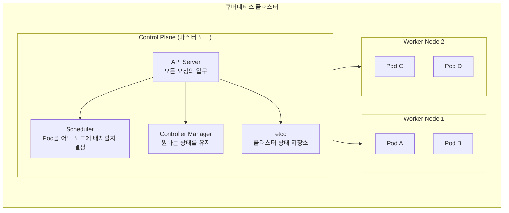
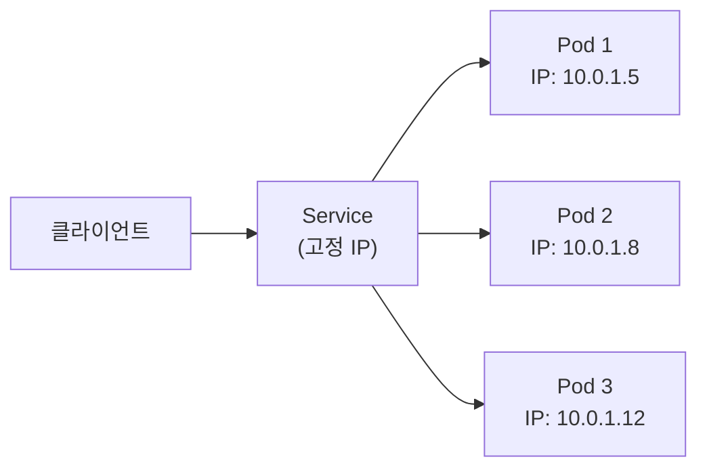
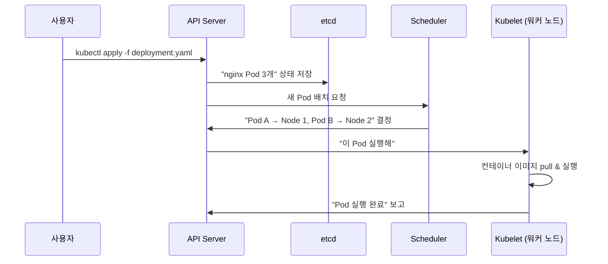

## 들어가며

도커를 어느 정도 쓸 줄 알게 되면, 자연스럽게 듣게 되는 이름이 있습니다. 쿠버네티스. "컨테이너 여러 개 관리하려면 쿠버네티스 써야지"라는 얘기를 주변에서 들었는데, 처음엔 솔직히 잘 안 와닿았습니다. "도커 컴포즈로 충분하지 않나?" 싶었거든요.

그런데 컨테이너가 10개, 20개로 늘어나고, 트래픽에 따라 자동으로 늘렸다 줄였다 해야 하고, 컨테이너가 죽으면 알아서 다시 살아나야 하는 상황을 생각하면 얘기가 달라집니다. 도커 컴포즈로는 감당이 안 되는 영역이 생기는 겁니다.

이번 글에서는 쿠버네티스가 왜 필요하고, 어떻게 동작하는지를 하나씩 풀어보겠습니다.

---

## 컨테이너는 아는데, 오케스트레이션은 뭔가

쿠버네티스를 이해하려면, 먼저 왜 *컨테이너 오케스트레이션(Container Orchestration)*이라는 개념이 나왔는지를 알아야 합니다.

*컨테이너(Container)*는 애플리케이션과 실행 환경을 하나로 묶은 격리된 실행 단위입니다. Docker로 만든 그 컨테이너 맞습니다. 컨테이너 하나 돌리는 건 쉽습니다. `docker run` 하면 끝이니까요.

문제는 컨테이너가 많아질 때입니다:

- 웹 서버 컨테이너 3개를 띄우고 싶은데, 하나가 죽으면?
- 트래픽이 갑자기 몰리면 자동으로 컨테이너를 더 띄우고 싶다면?
- 새 버전을 배포할 때, 서비스 중단 없이 하나씩 교체하고 싶다면?
- 서버 10대에 컨테이너 50개를 어떤 서버에 얼마나 배치할지 결정해야 한다면?

이런 문제들을 사람이 일일이 하는 건 현실적으로 불가능합니다. 컨테이너 수십, 수백 개를 자동으로 관리해주는 시스템이 필요한데, 그게 컨테이너 오케스트레이션입니다. 오케스트라의 지휘자가 각 악기의 타이밍과 볼륨을 조율하듯이, 컨테이너 오케스트레이터가 어떤 컨테이너를 어디에 몇 개 띄울지 조율해줍니다.

그리고 이 오케스트레이션 도구 중에서 사실상 표준이 된 게 쿠버네티스입니다.

---

## 쿠버네티스란

*쿠버네티스(Kubernetes, 줄여서 K8s)*는 구글이 내부에서 쓰던 컨테이너 관리 시스템(Borg)을 바탕으로 2014년에 오픈소스로 공개한 컨테이너 오케스트레이션 플랫폼입니다. 이름이 긴데, 보통 K8s라고 줄여 씁니다. (K와 s 사이에 글자가 8개라서)

쿠버네티스가 해주는 일을 한 줄로 요약하면:

> **"내가 원하는 상태를 선언하면, 쿠버네티스가 그 상태를 알아서 유지해준다."**

예를 들어 "nginx 컨테이너를 3개 띄워줘"라고 선언하면, 쿠버네티스는 항상 3개가 돌아가도록 관리합니다. 하나가 죽으면 자동으로 새로 만들고, 서버 자원이 부족하면 다른 서버로 옮기고. 이걸 *선언적 관리(Declarative Management)*라고 합니다.

---

## 쿠버네티스 구조 이해하기 (Step by Step)

### Step 1: 클러스터 — 전체 묶음

쿠버네티스의 가장 큰 단위는 *클러스터(Cluster)*입니다. 클러스터는 여러 대의 서버(노드)를 하나의 시스템처럼 묶어놓은 것입니다. 우리가 "쿠버네티스를 쓴다"는 건 결국 이 클러스터 위에서 컨테이너를 운영한다는 뜻입니다.

클러스터는 두 종류의 노드로 구성됩니다:



- **Control Plane (컨트롤 플레인)**: 클러스터의 두뇌. 어떤 컨테이너를 어디에 띄울지 결정하고 관리
- **Worker Node (워커 노드)**: 실제로 컨테이너가 돌아가는 서버

### Step 2: Pod — 컨테이너를 감싸는 최소 단위

쿠버네티스에서는 컨테이너를 직접 다루지 않고, *Pod(파드)*라는 단위로 감싸서 관리합니다. Pod는 쿠버네티스가 관리하는 가장 작은 배포 단위입니다.

보통 Pod 하나에 컨테이너 하나가 들어갑니다. "그냥 컨테이너랑 뭐가 다른 거지?" 싶을 수 있는데, Pod는 컨테이너에 네트워크와 스토리지 같은 쿠버네티스 기능을 붙여주는 래퍼라고 생각하면 됩니다. 같은 Pod 안의 컨테이너들은 같은 IP와 볼륨을 공유합니다.

### Step 3: Deployment — Pod를 원하는 개수만큼 유지

Pod를 직접 만들 수도 있지만, 실제로는 *Deployment(디플로이먼트)*를 통해 Pod를 관리합니다. Deployment에 "이 Pod를 3개 유지해줘"라고 선언하면, 쿠버네티스가 항상 3개를 유지합니다.

```yaml
apiVersion: apps/v1
kind: Deployment
metadata:
  name: my-web
spec:
  replicas: 3          # Pod 3개 유지
  selector:
    matchLabels:
      app: my-web
  template:
    metadata:
      labels:
        app: my-web
    spec:
      containers:
        - name: web
          image: nginx:1.25
          ports:
            - containerPort: 80
```

이 YAML을 적용하면 nginx Pod 3개가 생깁니다. 하나가 죽으면? Deployment가 알아채고 새 Pod를 하나 더 만들어서 다시 3개로 맞춥니다. 이걸 *자가 치유(Self-Healing)*라고 부릅니다.

### Step 4: Service — Pod에 접근하는 안정적인 주소

Pod는 생성될 때마다 IP가 바뀝니다. Pod가 죽고 새로 만들어지면 IP가 달라지는 거죠. 그러면 다른 서비스에서 이 Pod에 어떻게 접근할까요?

*Service(서비스)*가 이 문제를 해결합니다. Service는 여러 Pod 앞에 고정된 주소를 만들어주는 로드밸런서입니다.



Pod IP가 바뀌어도 Service 주소는 고정이니까, 다른 서비스에서는 Service 주소만 알면 됩니다. Service가 알아서 살아있는 Pod에 트래픽을 분배해줍니다.

### Step 5: 그 밖의 주요 리소스

실제 운영에서 자주 쓰는 리소스들을 간단히 정리하면:

| 리소스 | 하는 일 | 예시 |
|--------|---------|------|
| **ConfigMap** | 설정값 저장 (환경변수 등) | DB 접속 URL, 기능 플래그 |
| **Secret** | 민감 정보 저장 (base64 인코딩) | 비밀번호, API 키 |
| **Ingress** | 외부 HTTP 요청을 내부 Service로 라우팅 | 도메인 → Service 연결 |
| **Namespace** | 리소스를 논리적으로 분리 | dev / staging / prod 구분 |
| **PersistentVolume** | Pod에 영구 스토리지 연결 | 데이터베이스 데이터 보존 |

---

## 쿠버네티스 동작 흐름 — 실제로 뭐가 일어나는가

"nginx 3개 띄워줘"라고 했을 때 쿠버네티스 내부에서 일어나는 일을 순서대로 따라가 보겠습니다.



이 과정이 자동으로 반복됩니다. Pod가 죽으면 Controller Manager가 "어, 3개여야 하는데 2개밖에 없네?" 하고 감지해서 다시 위 흐름을 실행합니다.

---

## kubectl — 쿠버네티스와 대화하는 도구

쿠버네티스를 조작할 때 쓰는 CLI 도구가 *kubectl(큐브컨트롤)*입니다. 자주 쓰는 명령어를 몇 개 소개하면:

```bash
# 클러스터 상태 확인
kubectl cluster-info

# Pod 목록 보기
kubectl get pods

# Deployment 목록 보기
kubectl get deployments

# YAML 파일로 리소스 생성/수정
kubectl apply -f deployment.yaml

# Pod 로그 확인
kubectl logs my-web-pod-abc123

# Pod 안에 접속 (디버깅용)
kubectl exec -it my-web-pod-abc123 -- /bin/bash

# 리소스 삭제
kubectl delete -f deployment.yaml
```

처음에는 `get`, `apply`, `logs`, `describe` 네 개만 알아도 대부분의 상황에서 충분합니다. `kubectl describe pod [이름]`은 Pod가 왜 안 뜨는지 디버깅할 때 진짜 많이 쓰게 됩니다.

---

## 도커 컴포즈 vs 쿠버네티스 — 언제 뭘 써야 할까

처음에 제가 가졌던 의문 "도커 컴포즈로 충분하지 않나?"에 대한 답을 정리하면:

| 기준 | Docker Compose | Kubernetes |
|------|---------------|------------|
| **용도** | 로컬 개발, 소규모 배포 | 프로덕션 운영, 대규모 서비스 |
| **서버 수** | 단일 서버 | 여러 서버(클러스터) |
| **자가 치유** | 없음 (죽으면 수동 재시작) | 자동 복구 |
| **오토스케일링** | 없음 | 트래픽에 따라 자동 확장/축소 |
| **롤링 업데이트** | 지원 안 함 | 무중단 배포 기본 지원 |
| **학습 곡선** | 낮음 | 높음 |

정리하면, 로컬에서 개발하거나 서버 한 대로 충분한 상황이면 도커 컴포즈가 낫습니다. 서비스가 커져서 서버 여러 대에 컨테이너 수십 개를 안정적으로 운영해야 하면 쿠버네티스가 필요합니다. 둘 중 하나를 고르는 게 아니라, 단계에 따라 자연스럽게 넘어가는 거라고 보면 됩니다.

---

## 정리

- **컨테이너 오케스트레이션**은 컨테이너 여러 개를 자동으로 관리하는 것. 쿠버네티스가 사실상 표준
- 쿠버네티스의 핵심 개념은 **클러스터 → 노드 → Pod → 컨테이너** 순으로 내려가는 계층 구조
- **Deployment**로 "Pod를 몇 개 유지해줘"라고 선언하면, 쿠버네티스가 알아서 유지 (선언적 관리)
- **Service**가 Pod에 고정 주소를 만들어줘서, Pod IP가 바뀌어도 접근에 문제없음
- 리소스 정의는 전부 YAML 파일. 이 YAML 관리가 복잡해지면 다음 단계로 Helm을 쓰게 됨

---

## 추가로 공부하면 좋을 개념

쿠버네티스 기본이 잡혔다면 다음 주제들을 이어서 보면 좋습니다:

- **Helm Chart**: 쿠버네티스 YAML 파일들을 패키지로 묶어서 관리하는 도구. [이 블로그의 Helm 포스트](/2026/04/21/kubernetes-helm-chart-beginner-guide.html)에서 다룸
- **Namespace와 RBAC**: 클러스터를 팀별/환경별로 분리하고 권한을 제어하는 방법. 멀티테넌트 환경에서 필수
- **Ingress Controller**: 외부 트래픽을 Service로 라우팅하는 실전 설정. nginx-ingress가 가장 보편적
- **HPA (Horizontal Pod Autoscaler)**: CPU/메모리 사용량에 따라 Pod 개수를 자동 조절하는 오토스케일링
- **Persistent Volume**: 컨테이너가 죽어도 데이터가 보존되도록 하는 스토리지 관리. DB 운영 시 필수
