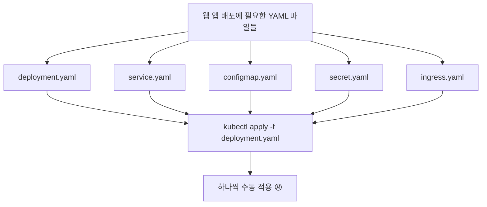
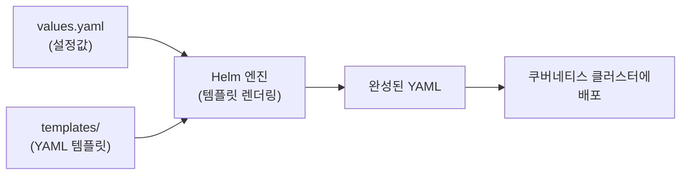
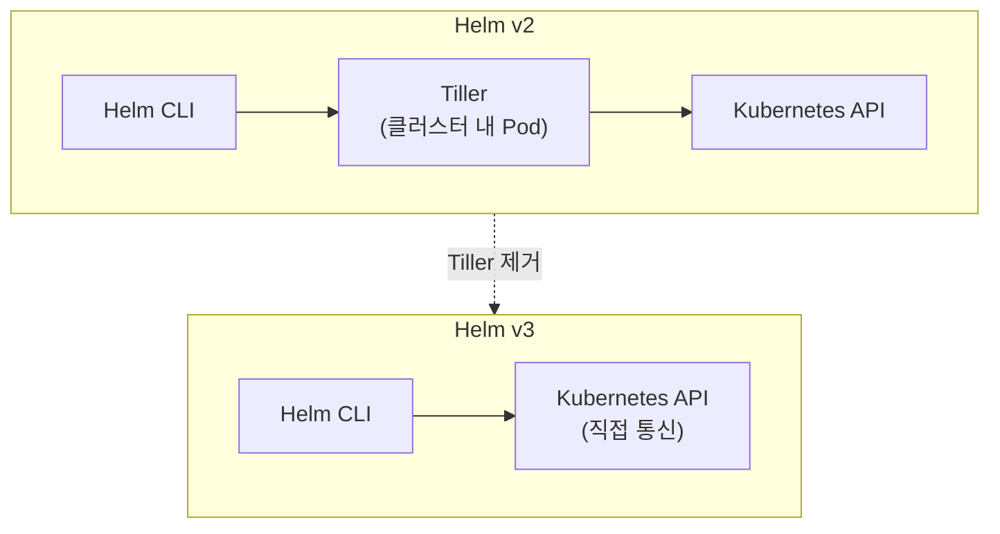

## 들어가며

쿠버네티스를 처음 써봤을 때 가장 먼저 느낀 건 "YAML 파일이 너무 많다"였습니다. Deployment 하나, Service 하나, ConfigMap 하나... 마이크로서비스가 5개만 돼도 YAML 파일이 15개 이상 쏟아집니다. 거기에 개발/스테이징/프로덕션 환경별로 살짝씩 다른 설정까지 관리하려면, 복붙하다가 실수하는 건 시간 문제였습니다.

"이걸 좀 더 체계적으로 관리할 수 없나?" 하고 찾아본 게 *Helm*이었고, 써보고 나서 "왜 진작 안 썼지?" 싶었습니다. 이번 글에서는 Helm이 뭔지, 왜 필요한지, 어떻게 동작하는지를 처음부터 차근차근 정리해보겠습니다.

> 쿠버네티스 자체가 아직 익숙하지 않다면, [쿠버네티스가 뭔데 다들 쓰라고 하는 걸까](/2026/04/21/kubernetes-beginner-guide.html)를 먼저 읽어보시면 좋습니다.

---

## Helm이 뭔데?

*Helm*은 쿠버네티스의 패키지 매니저입니다. 이게 뭔 말이냐면, 우리가 이미 쓰고 있는 패키지 매니저를 떠올리면 됩니다:

| 환경 | 패키지 매니저 | 하는 일 |
|------|------------|--------|
| Ubuntu | `apt` | 시스템 패키지 설치/관리 |
| Mac | `brew` | 개발 도구 설치/관리 |
| Node.js | `npm` | JS 라이브러리 설치/관리 |
| Python | `pip` | Python 패키지 설치/관리 |
| **Kubernetes** | **`helm`** | **쿠버네티스 리소스 설치/관리** |

`apt install nginx` 하면 nginx가 알아서 설치되잖아요? Helm도 마찬가지입니다. `helm install my-app ./my-chart` 하면 그 앱에 필요한 쿠버네티스 리소스들이 한 번에 배포됩니다.

---

## 왜 Helm이 필요한가 — YAML 지옥의 현실

Helm이 왜 필요한지 이해하려면, Helm 없이 쿠버네티스에 앱을 배포하는 과정을 먼저 봐야 합니다.

웹 애플리케이션 하나를 쿠버네티스에 올린다고 가정하면, 최소한 이런 리소스들이 필요합니다:

- **Deployment**: *Pod(파드)*를 몇 개 띄울지, 어떤 이미지를 쓸지 정의
- **Service**: Pod를 네트워크로 노출시켜서 접근 가능하게 만듦
- **ConfigMap**: DB 주소, API URL 같은 설정값 저장
- **Secret**: 비밀번호, API 키 같은 민감 정보 저장
- **Ingress**: 외부 도메인과 연결

리소스 하나당 YAML 파일 하나. 벌써 5개입니다.



마이크로서비스가 5개면? 25개. 거기에 dev/staging/prod 환경 3개면? 75개. 이게 YAML 지옥입니다.

그리고 진짜 문제는 이 YAML 파일들이 **거의 비슷하다**는 겁니다. 이미지 이름이랑 포트 번호만 다르고 나머지는 똑같은데, 복사해서 붙여넣기를 반복해야 합니다. 여기서 오타 하나 나면 디버깅에 한 시간 날리는 건 기본이고요.

---

## Helm Chart의 구조 이해하기 (Step by Step)

### Step 1: Helm Chart가 뭔지 파악하기

*Helm Chart(헬름 차트)*는 쿠버네티스 리소스들을 하나로 묶은 패키지입니다. 아까 그 5개의 YAML 파일을 하나의 폴더에 정리하고, 변하는 값만 따로 빼놓은 구조라고 보면 됩니다.

Chart의 기본 디렉토리 구조를 살펴보겠습니다:

```
my-chart/
├── Chart.yaml          # 차트 메타정보 (이름, 버전 등)
├── values.yaml         # 기본 설정값
├── templates/          # 쿠버네티스 리소스 템플릿들
│   ├── deployment.yaml
│   ├── service.yaml
│   ├── configmap.yaml
│   └── _helpers.tpl    # 반복되는 템플릿 함수
└── charts/             # 의존성 차트 (다른 차트를 가져다 쓸 때)
```

### Step 2: 템플릿이 어떻게 동작하는지 이해하기

핵심은 `templates/` 폴더 안의 YAML 파일이 **일반 YAML이 아니라 Go 템플릿**이라는 겁니다. 변수를 넣을 수 있어요.

기존 YAML과 Helm 템플릿을 비교하면 이렇습니다:

**기존 방식 — 값이 하드코딩됨:**

```yaml
# deployment.yaml
apiVersion: apps/v1
kind: Deployment
metadata:
  name: my-web-app
spec:
  replicas: 3
  template:
    spec:
      containers:
        - name: my-web-app
          image: my-web-app:1.2.0
          ports:
            - containerPort: 8080
```

**Helm 템플릿 — 변수로 주입:**

```yaml
# templates/deployment.yaml
apiVersion: apps/v1
kind: Deployment
metadata:
  name: {{ .Release.Name }}
spec:
  replicas: {{ .Values.replicaCount }}
  template:
    spec:
      containers:
        - name: {{ .Chart.Name }}
          image: "{{ .Values.image.repository }}:{{ .Values.image.tag }}"
          ports:
            - containerPort: {{ .Values.containerPort }}
```

`{{ .Values.xxx }}` 부분이 values.yaml에서 값을 가져오는 부분입니다. 그래서 템플릿은 한 번만 만들고, 값만 바꿔가면서 여러 환경에 재사용할 수 있는 겁니다.

### Step 3: values.yaml로 값 주입하기

values.yaml은 템플릿에 들어갈 기본값을 정의하는 파일입니다:

```yaml
# values.yaml
replicaCount: 3
image:
  repository: my-web-app
  tag: "1.2.0"
containerPort: 8080
service:
  type: ClusterIP
  port: 80
```

이걸 *Value Injection(값 주입)*이라고 부릅니다. Helm이 템플릿을 렌더링할 때 values.yaml의 값을 템플릿의 변수 자리에 채워넣는 방식입니다.

전체 흐름을 정리하면 이렇습니다:



### Step 4: 환경별로 다른 값 넣기

개발 환경과 프로덕션 환경에서 replica 수나 이미지 태그가 다를 수 있습니다. 이때 values 파일을 환경별로 따로 만들면 됩니다:

```yaml
# values-dev.yaml
replicaCount: 1
image:
  tag: "latest"
```

```yaml
# values-prod.yaml
replicaCount: 5
image:
  tag: "1.2.0"
```

배포할 때 `-f` 옵션으로 어떤 values 파일을 쓸지 지정합니다:

```bash
# 개발 환경 배포
helm install my-app ./my-chart -f values-dev.yaml

# 프로덕션 배포
helm install my-app ./my-chart -f values-prod.yaml
```

같은 차트 하나로 환경만 바꿔서 배포할 수 있으니, YAML 복붙 지옥에서 완전히 벗어나는 겁니다.

---

## Helm의 핵심 기능 3가지

### 1. 템플릿 엔진 — 반복 작업 제거

위에서 본 것처럼, 공통 구조를 템플릿으로 만들고 값만 주입하는 방식입니다. 마이크로서비스가 10개여도 템플릿은 하나면 됩니다.

### 2. 릴리스 관리 — 배포 이력 추적과 롤백

Helm으로 배포하면 각 배포가 *Release(릴리스)*로 기록됩니다. 언제 어떤 버전을 배포했는지 이력이 남고, 문제가 생기면 이전 버전으로 되돌릴 수 있습니다.

```bash
# 배포 이력 확인
helm history my-app -n my-namespace

# 이전 버전으로 롤백 (예: revision 2로)
helm rollback my-app 2 -n my-namespace

# 차트 업그레이드
helm upgrade my-app ./my-chart -f values-prod.yaml -n my-namespace
```

`kubectl apply`로 배포하면 "아까 뭘 적용했더라?" 하고 뒤적거려야 하는데, Helm은 이 이력을 자동으로 관리해줍니다. 프로덕션에서 배포 후 장애가 나면 `helm rollback` 한 줄이면 이전 상태로 복구되니까, 심리적 안정감이 다릅니다.

### 3. 차트 레포지토리 — 남이 만든 걸 가져다 쓰기

MongoDB, Redis, Prometheus, Grafana 같은 유명한 오픈소스들은 이미 잘 만들어진 Helm Chart가 공개되어 있습니다. [Artifact Hub](https://artifacthub.io/)에서 검색하면 됩니다.

```bash
# 공개 차트 저장소 추가
helm repo add bitnami https://charts.bitnami.com/bitnami

# MongoDB 설치 — 이 한 줄이면 끝
helm install my-mongo bitnami/mongodb
```

MongoDB를 쿠버네티스에 올리려면 StatefulSet, PersistentVolume, Service, Secret 등을 다 직접 작성해야 하는데, Helm Chart 하나면 이 모든 게 한 번에 배포됩니다.

---

## Helm v2에서 v3으로 — 뭐가 바뀌었나

Helm에는 큰 버전 전환이 있었습니다. 지금 쓰는 건 v3이고, v2와의 차이를 알아두면 레거시 환경을 만났을 때 당황하지 않습니다.



### Helm v2의 문제: Tiller

v2에서는 *Tiller(틸러)*라는 Pod가 클러스터 안에서 돌아가면서 차트 설치를 중개했습니다. 문제는 이 Tiller가 `cluster-admin` 권한을 갖고 있었다는 겁니다. 클러스터에서 뭐든 할 수 있는 슈퍼 유저가 상시 떠 있는 셈이라, 보안 위험이 컸습니다.

### Helm v3에서 달라진 점

- **Tiller 제거**: Helm CLI가 Kubernetes API와 직접 통신
- **사용자 권한 기반**: 사용자의 kubeconfig에 설정된 *RBAC(Role-Based Access Control, 역할 기반 접근 제어)* 권한을 그대로 사용
- **릴리스 저장 방식 변경**: 릴리스 정보를 Kubernetes Secret으로 저장 (v2에서는 Tiller의 ConfigMap에 저장)

지금 새로 시작한다면 v3만 알면 됩니다. 다만 오래된 블로그 글이나 회사 위키에서 Tiller 설정이 나오면, "아, 이건 v2 시절 얘기구나" 하고 넘기면 됩니다.

---

## 실전: Helm Chart 만들어보기

직접 차트를 하나 만들어봐야 감이 옵니다. Helm CLI로 기본 차트 스캐폴딩을 생성할 수 있습니다.

```bash
# Helm 설치 (Mac)
brew install helm

# 차트 생성
helm create my-web-app
```

이 명령어를 실행하면 아래 구조가 자동으로 만들어집니다:

```
my-web-app/
├── Chart.yaml
├── values.yaml
├── charts/
├── templates/
│   ├── deployment.yaml
│   ├── service.yaml
│   ├── ingress.yaml
│   ├── hpa.yaml
│   ├── serviceaccount.yaml
│   ├── _helpers.tpl
│   ├── NOTES.txt
│   └── tests/
│       └── test-connection.yaml
└── .helmignore
```

여기서 `values.yaml`을 열어서 원하는 설정으로 수정하고, 필요 없는 템플릿은 지우면 됩니다.

```bash
# 로컬에서 렌더링 결과 확인 (실제 배포 없이)
helm template my-app ./my-web-app

# 문법 검증
helm lint ./my-web-app

# 실제 배포
helm install my-app ./my-web-app -n my-namespace
```

`helm template`은 배포 전에 렌더링된 YAML을 미리 확인할 수 있어서, "이게 진짜 내가 의도한 대로 만들어졌나?" 체크하기 좋습니다. 제가 처음 Helm 쓸 때 이 명령어를 몰라서, 배포 후에야 "어, 왜 이렇게 됐지?" 하면서 삽질한 적이 있었거든요.

---

## 정리

이번 글에서 다룬 내용을 요약하면:

- **Helm**은 쿠버네티스의 패키지 매니저. apt나 brew의 쿠버네티스 버전이라고 생각하면 됨
- **Helm Chart**는 쿠버네티스 리소스들을 하나로 묶은 패키지. 템플릿 + values로 구성
- YAML 복붙 지옥에서 벗어나려면 템플릿 엔진을 활용해서 값만 갈아끼우면 됨
- 환경별 배포는 values 파일만 분리하면 해결
- 릴리스 관리로 배포 이력 추적과 롤백이 가능
- v3에서 Tiller가 사라지면서 보안과 구조가 개선됨

---

## 추가로 공부하면 좋을 개념

이 글에서 Helm의 기본 개념을 잡았다면, 다음 단계로 이런 주제들을 살펴보면 좋습니다:

- **Helmfile**: 여러 Helm 릴리스를 선언적으로 관리하는 도구. 차트가 많아지면 Helmfile로 한 번에 관리하는 게 편함
- **Kustomize**: Helm과 다른 접근 방식의 쿠버네티스 설정 관리 도구. 템플릿이 아니라 패치 기반으로 동작해서 상황에 따라 Kustomize가 더 나을 때도 있음
- **Chart Dependencies**: 차트 안에서 다른 차트를 의존성으로 가져다 쓰는 방법. 예를 들어 앱 차트에서 Redis 차트를 서브차트로 포함시킬 수 있음
- **Helm Hooks**: 배포 전/후에 Job이나 테스트를 실행하는 기능. DB 마이그레이션 같은 작업에 유용
- **ArgoCD + Helm**: GitOps 방식으로 Helm 차트를 자동 배포하는 조합. 프로덕션 환경에서 많이 쓰이는 패턴
