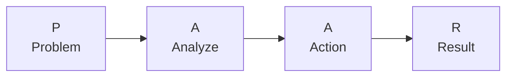
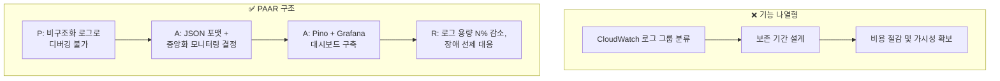

## 들어가며

최근에 개발자 이력서 관련 영상을 하나 봤는데, 꽤 와닿는 내용이었습니다. 5개 기업에 동시 합격한 개발자의 이력서 비포/애프터를 전부 공개한 영상인데요([원본 영상](https://www.youtube.com/watch?v=f_kN5j7KSwk)).

핵심 메시지는 이거였습니다. AI가 코드를 뚝딱 만들어주는 시대에 "무엇을 만들었다"는 더 이상 차별점이 아니다. 그럼 면접관은 뭘 보고 싶어할까?

**의사결정 과정**입니다. 왜 그 기술을 골랐는지, 어떤 대안을 비교했는지, 트레이드오프를 어떻게 관리했는지. 이걸 체계적으로 보여주는 구조가 PAAR 프레임워크고, 저도 정리해보면서 "아 이건 나한테도 필요하다" 싶었습니다.

이 글에서는 PAAR의 각 단계와 실제 Before/After 예시를 정리해보겠습니다.

---

## PAAR 프레임워크란?

이력서 작성법을 찾아보면 PAR(Problem-Action-Result)이 많이 나옵니다. PAAR은 여기서 한 단계 더 들어간 겁니다. Action 앞에 **Analyze**가 끼어들어요.

| 단계 | 질문 |
|------|------|
| **Problem** | 왜 이 문제가 중요했는가? |
| **Analyze** | 어떤 선택지를 검토했고, 왜 그 결정을 내렸는가? |
| **Action** | 어떤 트레이드오프를 관리하며 실행했는가? |
| **Result** | 어떤 자료(수치)로 검증했는가? |

핵심은 **Analyze**입니다. 면접관이 이 단계에서 보고 싶은 건:

- 무엇을 고민했는지
- 결정을 어떻게 내렸는지
- 그 결과 어떤 대안이 나왔는지

---

## 왜 Analyze가 핵심인가?

솔직히 예전에는 "이걸 구현할 수 있다"는 것만으로 충분했습니다. 그런데 지금은 구현 자체를 AI가 해줍니다. 그러면 남는 경쟁력이 뭐냐면, **분석하고 설계하는 능력**이에요. 문제를 정의하고, 선택지를 비교하고, 상황에 맞는 결정을 내리는 것. 이건 아직 사람의 영역입니다.

면접관이 진짜 궁금한 건 이겁니다:

- 기술을 적용하기 전에 어떤 갈등 상황이 있었는지
- 어떤 사고의 흐름을 거쳐 해당 기술을 선택했는지
- 선택하지 않은 대안은 왜 탈락시켰는지

"Redis를 도입해서 성능을 개선했다"는 아무 정보가 없습니다. "로컬 캐시 vs Redis vs Memcached를 비교했고, 우리 서비스가 다중 인스턴스 환경이라 분산 캐시가 필수였고, Memcached 대비 Redis가 데이터 구조 다양성 면에서 유리해서 선택했다"가 되어야 면접관 머릿속에 그림이 그려집니다.

---

## 자기소개 Before / After

### Before

> 불편함을 개선하여 누군가에게 편리함을 제공하는 것에 행복함을 느끼는 개발자입니다.

이 문장의 문제점:
- 감성적이지만 아무 정보가 없음
- 백엔드 개발자인지조차 알 수 없음
- 어떤 규모와 서비스를 다뤘는지 모름
- 수백 개의 이력서에 다 있는 표현

### After

> 하루 N억 건 이상의 발송 트래픽과 초당 수만 건의 사용자 이벤트를 안정적으로 처리하기 위해 견고한 시스템을 구축해온 2년차 백엔드 엔지니어

이게 강력한 이유:
- 첫 문장에 규모감이 드러남
- 역할(백엔드 엔지니어)이 명확
- 핵심 키워드(트래픽, 이벤트, 시스템)가 포함
- 면접관이 "이 사람 어떻게 했지?" 궁금해지는 도입부

차이는 단순합니다. **숫자가 있는가, 없는가.** 추상적 감성 대신 구체적 팩트가 면접관의 시선을 잡습니다.

---

## 핵심역량 Before / After

자기소개뿐 아니라 "핵심역량" 섹션도 같은 원리입니다.

### Before

> **실행을 통한 성장** - 새로운 것을 학습하고 사용하는 데에 두려움이 없으며 발생하는 오류나 에러에 대해서 집요하게 해결하고 개선하기 위해 노력합니다...
>
> **고객 경험 개발** - 개발의 시작부터 끝까지 서비스를 제공받는 고객의 입장에서 진행합니다. 개발자는 클라이언트를 위해 존재하니까요

누구나 쓸 수 있는 마인드셋 이야기입니다. "집요하게 해결합니다"는 모든 개발자가 자기소개에 넣는 말이에요. 면접관 입장에서는 이 사람이 실제로 뭘 할 수 있는 사람인지 전혀 감이 안 잡힙니다.

### After

> **01. 점진적인 MSA 전환을 주도하여 장애 전파 최소화**
> AWS 서버리스 + 비동기 처리 도입 → 서비스 안정성 확보
>
> **02. 데이터 파이프라인 구축 → 처리 시간 단축 + 비용 효율 개선**
> 데이터 기반 의사결정 환경 구축
>
> **03. 테스트 코드 작성 문화 정착**
> 신뢰할 수 있는 엔지니어링 문화를 만든 경험

Before는 "나는 이런 사람이다"라는 성격 묘사고, After는 "나는 이런 걸 해본 사람이다"라는 실적 요약입니다. 면접관이 궁금해지는 건 후자예요. "MSA 전환을 어떻게 점진적으로 했지?", "파이프라인 비용을 얼마나 줄였지?" 같은 후속 질문이 자연스럽게 나옵니다.

핵심역량은 마인드셋이 아니라 **증명 가능한 임팩트**로 채워야 합니다.

---

## PAAR vs STAR: 왜 STAR가 아니라 PAAR인가?

이력서 작성법을 찾으면 *STAR 기법(Situation-Task-Action-Result)*이 많이 나옵니다. STAR도 나쁘진 않은데, PAAR과는 강조점이 다릅니다.

| | STAR | PAAR |
|---|---|---|
| 첫 단계 | **S**ituation (상황 설명) | **P**roblem (비즈니스 임팩트 있는 문제) |
| 두 번째 | **T**ask (주어진 과제) | **A**nalyze (왜 이 방법을 택했나?) |
| 세 번째 | **A**ction (행동) | **A**ction (실제로 뭘 했나?) |
| 네 번째 | **R**esult (결과) | **R**esult (수치로 검증된 결과) |

STAR는 "상황 → 과제 → 행동 → 결과" 순서로 이야기를 풀어갑니다. 구조 자체는 괜찮은데, 면접관이 가장 궁금해하는 **"다른 방법은 검토 안 했어요?"**에 대한 답이 빠져있어요.

PAAR의 Analyze가 바로 그 빈칸을 채웁니다. "왜 이 방법?"이라는 질문에 선제적으로 답하는 겁니다. Analyze를 어떻게 쓰느냐가 이력서의 합격 여부를 가릅니다.

---

## 경력 기술 Before / After: 기능 나열형 vs PAAR 구조

이번엔 실제 경력 기술서에서 같은 경험을 어떻게 다르게 쓸 수 있는지 보겠습니다.

### Before (기능 나열형)

> **AWS CloudWatch를 통한 서비스 장애 로깅 전략 개선**
> - 로그 레벨 별로 CloudWatch의 로그 그룹을 분류
> - 로그 그룹 별 보존 기간 및 S3 마이그레이션 전략 설계
> - CloudWatch의 비용 절감 및 로그 가시성 확보

> **이미지 업로드 서비스 개선**
> - serverless framework를 활용한 이미지 업로드 서버 구축
> - sharp 라이브러리를 사용하여 이미지 content-type을 webp로 변환
> - 이를 통해 파일의 용량을 최대 61%까지 줄일 수 있게 되었음

이 방식의 문제:
- 왜 했는지 모름 (동기 없음)
- 어떻게 분석했는지 모름 (사고 과정 부재)
- 임팩트 불명확 ("확보", "되었음"으로 끝남)

### After (PAAR 구조)

> **로그 수집 및 모니터링 시스템 구축**
>
> **Problem**: 하루 N GB 로그가 비구조화 텍스트로 쌓여 디버깅이 불가능했음. 고객사 리포트를 통해서야 장애를 인지하는 상황.
>
> **Analyze**: JSON 포맷 도입을 결정하고, 중앙화된 모니터링 환경의 필요성을 인지. 비즈니스 로직과 알림 로직을 격리하는 방향으로 설계.
>
> **Action**: Pino 도입 + 로깅 컨벤션 정의. Grafana 통합 대시보드 + Alerting 구성.
>
> **Result**: 로그 용량 N% 감소, 검색 효율성 향상. 고객 리포트 이전에 장애 선제 대응 체계 확보.

같은 경험인데 설득력이 완전히 다릅니다. Before는 "뭘 했다"의 나열이고, After는 "왜 → 어떻게 판단 → 뭘 함 → 얼마나 좋아짐"의 스토리입니다.

---

## 성과 표현 Before / After

성과를 표현하는 문장 자체도 바꿔야 합니다.

### Before

| 표현 | 문제 |
|------|------|
| ~할 수 있게 됨 | 가능성이지 실제 결과가 아님 |
| ~하는 계기가 되었음 | 본인의 성과인지 불분명 |
| 비용 절감 및 가시성 확보 | 얼마나? 수치 없음 |
| 안정성 향상과 리소스 확보 | 모호함의 극치 |

### After

| 표현 | 강점 |
|------|------|
| 처리량 N배 이상 개선 | 방향 + 규모가 명확 |
| 중복 발송 0건 유지 | 절대 수치로 신뢰감 |
| P99 응답속도 N% 이상 개선 | 기술적 지표 활용 |
| 조회 성능 수 초 → 수백 ms | 전후 비교가 직관적 |

**측정할 수 없으면 성과가 아닙니다.** 정확한 숫자를 모르더라도 N을 쓰세요. N이라도 쓰면 "이 사람은 수치로 사고하는 사람이구나"라는 방향성이 보입니다.

---

## 효과 있었던 것 vs 시간 낭비였던 것

영상에서 실제로 이력서를 PAAR로 개선하고 면접까지 거친 사람의 회고도 인상 깊었습니다.

### 효과 있었던 것

- PAAR 구조로 전면 재작성
- 모호한 표현 → 수치 기반 성과로 교체
- 불필요한 감성 섹션 과감히 삭제

### 시간 낭비였던 것

- 프로젝트를 하나 더 하려고 한 것 (양보다 질)
- 기술 스택만 나열한 것 (도구 목록은 차별점이 안 됨)
- 감성 에세이로 차별화하려 한 것 (면접관은 팩트를 원함)

---

## 실제 면접에서 나온 질문들

PAAR로 이력서를 쓰면 면접관의 질문도 달라집니다. 기술 나열형 이력서는 "이거 해봤어요?" 수준의 질문을 받는데, PAAR 구조 이력서는 의사결정을 검증하는 깊은 질문이 옵니다.

### 질문 1: "서버리스 아키텍처를 도입하셨는데, 비용/콜드스타트 이슈는 없었나요?"

면접관이 실제로 묻고 싶은 건: **서버리스가 아니어도 해결 가능한 문제를 왜 서버리스로 풀었나요?**

기술 의사결정의 근거와 트레이드오프를 검증하는 질문입니다. "왜 이 기술?"에 항상 대답할 수 있어야 해요.

좋은 답변 예시:
> 환경 자체는 서버리스가 아니어도 해결 가능한 상황이었습니다. 하지만 규모가 작은 스타트업이라 DevOps 팀이 없었고, 개발자들이 인프라 세팅이 아니라 문제 해결에 집중해야 하는 상황이었습니다. 서버리스를 도입해서 운영 부담을 최소화했고, 트래픽이 늘어나는 상황에서도 별도 스케일링 작업 없이 유연하게 대처할 수 있었습니다.

이 답변이 좋은 이유는 "할 수 있었다"가 아니라 "우리 상황에서 이게 최선이었다"는 맥락을 보여주기 때문입니다.

### 질문 2: "개발할 때 AI를 어느 정도 활용하나요? AI 제품 관련 프로젝트 경험이 있나요?"

요즘 면접에서 점점 자주 나오는 질문입니다. 솔직하게 "잘 쓰지 않는다"고 답해도 괜찮아요. 다만, 이유가 있어야 합니다. "써볼 생각이 없다"와 "아직 우리 워크플로우에 맞는 활용법을 찾는 중이다"는 면접관에게 전혀 다른 인상을 줍니다.

---

## 지금 당장 이력서에 적용하는 법

### Step 1: "~했습니다"로 끝나는 문장 찾기

이력서를 열어서 Action만 서술된 문장을 찾으세요. 그 문장 앞에 Problem이 빠져있을 겁니다. "왜 했는지"를 한 줄만 추가해도 설득력이 달라집니다.

### Step 2: 가장 잘한 프로젝트 1개를 PAAR 초안으로 쓰기

P-A-A-R 4줄이면 됩니다. 쓰다가 막히는 지점이 보완해야 할 부분이에요. Analyze에서 막히면 당시 의사결정 근거를 되돌아보세요. Result에서 막히면 지금이라도 수치를 측정하세요.

### Step 3: 수치가 없는 문장마다 "N" 채워넣기

정확한 숫자보다 방향성이 먼저입니다. "성능 개선"이라고만 쓰여있다면 "N% 개선"으로 바꾸세요. 나중에 N을 채우면 됩니다. 수치가 표기되지 않았다면, 일단 N이라도 표기하세요.

---

## 정리

이력서는 자서전이 아니라 마케팅 문서입니다. 경험을 PAAR 구조로 번역하세요.

- PAAR에서 Analyze가 핵심이다. AI 시대에 남은 경쟁력은 의사결정 능력이다.
- 자기소개 첫 문장에 숫자를 넣어라. 감성 대신 팩트로 후킹해야 한다.
- 모든 성과는 수치로 마무리한다. 측정할 수 없으면 증명할 수 없다.
- 도메인 전문성은 약점이 아니라 차별점이다. 특정 분야의 깊은 경험을 부끄러워하지 말 것.

---

## 추가로 공부하면 좋을 개념

- 기술 면접에서의 PAAR 활용: 구두 답변에서도 같은 구조를 적용하는 방법
- 포트폴리오 프로젝트 선별 기준: 어떤 프로젝트를 남기고 어떤 걸 빼야 하는지
- 수치화가 어려운 프로젝트 대응법: 정량 지표가 없을 때 정성적 근거를 구조화하는 방법
- *ADR(Architecture Decision Record)*: 기술 의사결정을 기록하는 습관이 이력서에도 연결됨
