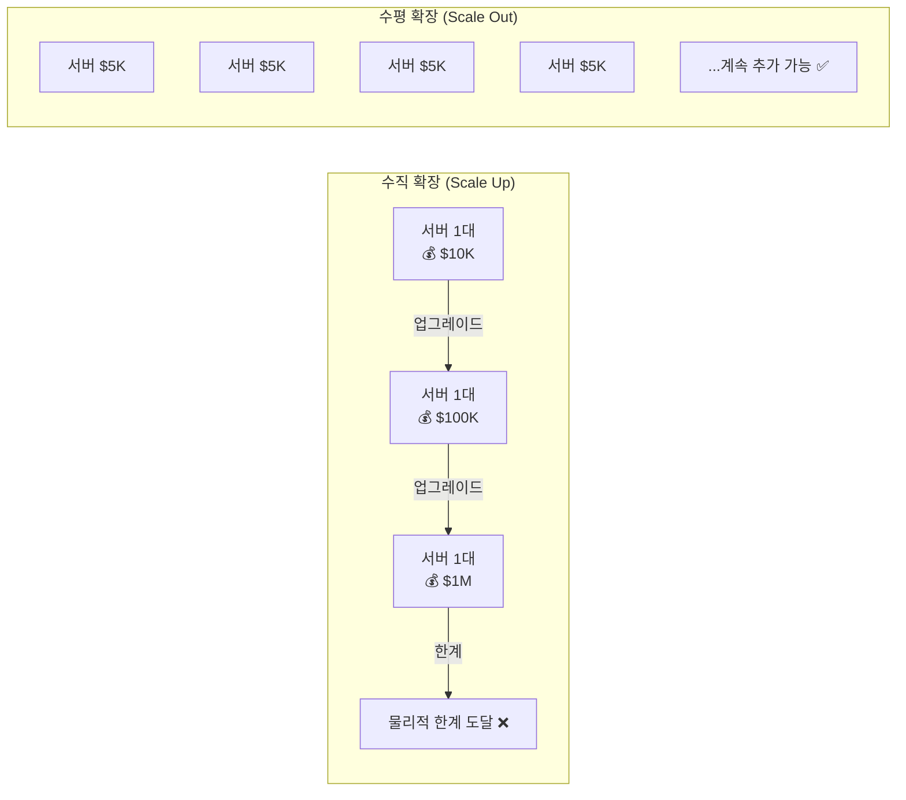
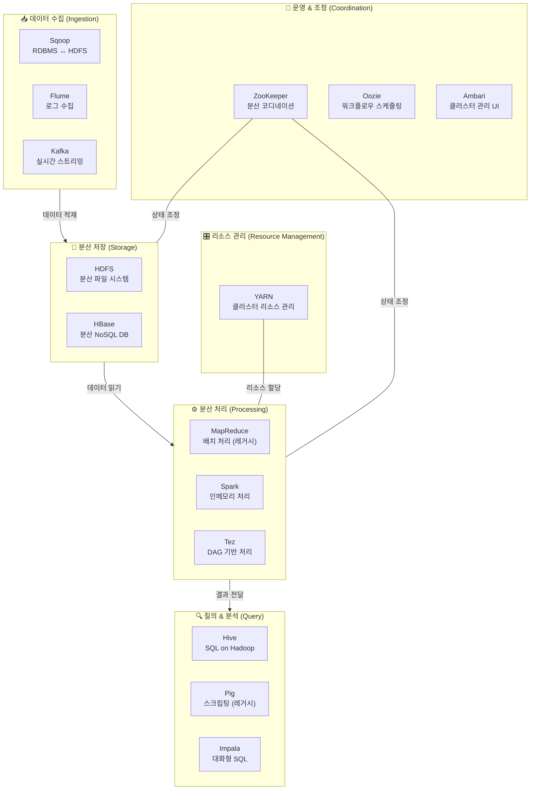
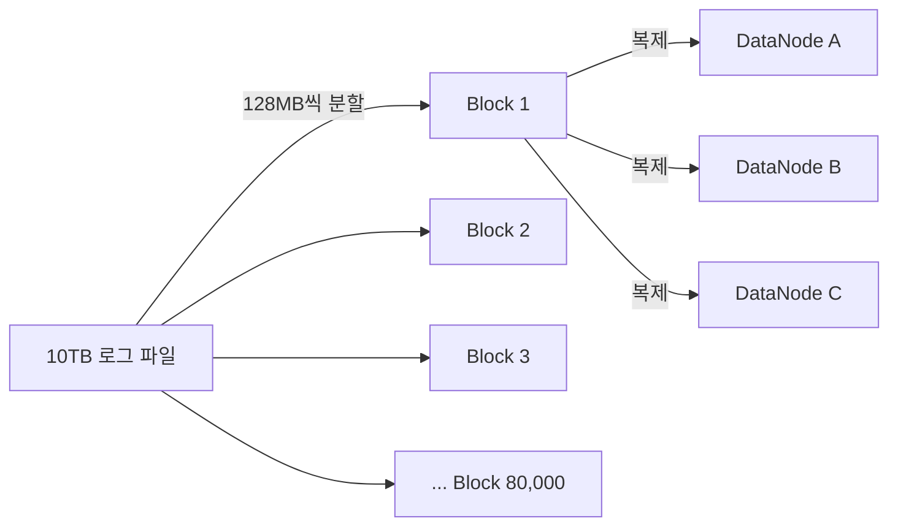
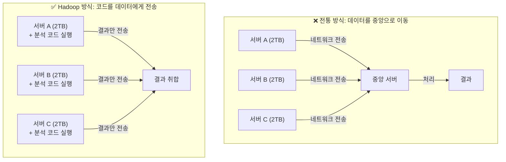
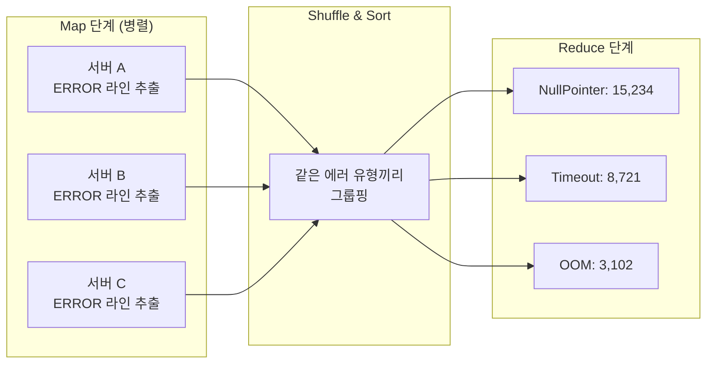
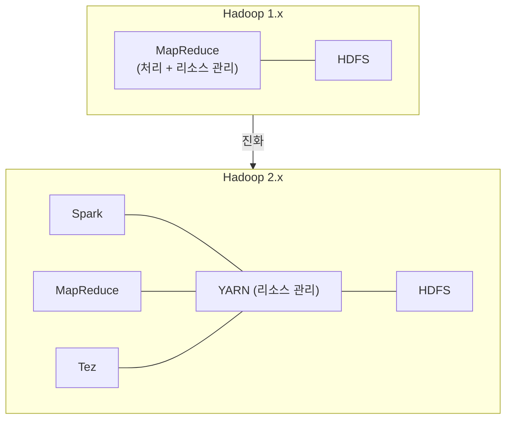
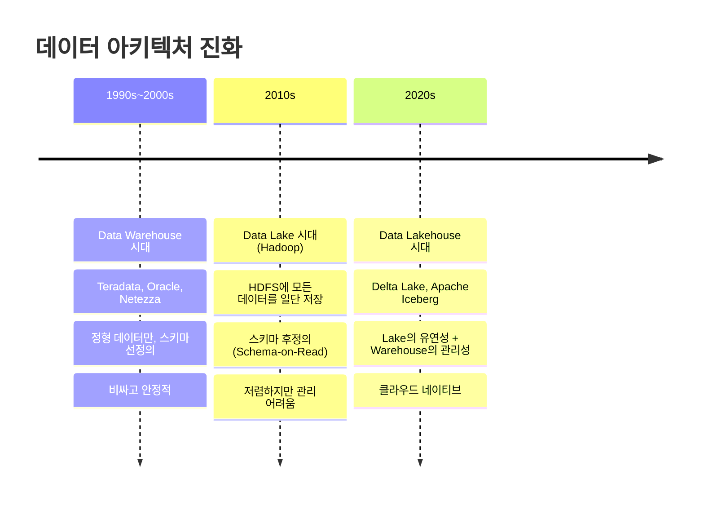

## 들어가며

빅데이터라는 단어를 처음 접했을 때, 솔직히 "데이터가 크면 서버를 좋은 걸로 바꾸면 되지 않나?" 싶었습니다. 그런데 하루에 수십 테라바이트가 쏟아지는 환경에서는, 아무리 비싼 서버를 사도 감당이 안 됩니다. 돈이 기하급수적으로 들어요.

Hadoop은 이 문제를 "비싼 서버 한 대" 대신 "싼 서버 수천 대"로 풀겠다는 발상에서 시작했습니다. 그리고 이 단순한 발상 하나가 지난 20년간 데이터 엔지니어링의 판을 완전히 바꿔놓았습니다.

이번 글은 Hadoop 생태계 시리즈의 첫 번째 글입니다. 개별 컴포넌트를 깊이 파기 전에, 전체 그림부터 머릿속에 그려보겠습니다. "이 동물원에 어떤 동물들이 있고, 각각 무슨 역할을 하는지" 한눈에 보는 지도를 만드는 게 이번 글의 목표입니다.

---

## 왜 Hadoop이 필요했는가

### 기존 방식의 한계

2000년대 초반까지 데이터 처리의 주류는 *RDBMS(Relational Database Management System)*였습니다. Oracle, MySQL, SQL Server 같은 관계형 데이터베이스에 데이터를 넣고, SQL로 조회하는 방식이죠.

이 방식은 *수직 확장(Vertical Scaling)* — 서버의 CPU, 메모리, 디스크를 더 좋은 걸로 교체하는 것 — 에 의존합니다. 데이터가 늘면 서버를 업그레이드하는 거죠.

문제는 구글, 야후, 페이스북 같은 회사들이었습니다. 하루에 페타바이트 단위의 데이터가 쏟아지는데, 수직 확장은 물리적 한계가 있습니다. 아무리 좋은 서버를 사도 CPU와 메모리에는 물리적 상한이 있고, 가격은 지수적으로 올라갑니다.

*수평 확장(Horizontal Scaling)*은 반대 접근입니다. 서버 한 대를 업그레이드하는 대신, 저렴한 서버를 여러 대 붙이는 겁니다. 이론적으로 확장에 한계가 없고, 비용도 선형적으로 증가합니다.

Hadoop은 수평 확장 방식으로 빅데이터 문제를 풀겠다는 프로젝트입니다.

### 구글이 쏘아올린 세 편의 논문

Hadoop의 탄생 배경을 이해하려면 구글의 논문 세 편을 알아야 합니다. 이 논문들이 없었으면 Hadoop도 없었습니다.

| 연도 | 논문 | 핵심 아이디어 | Hadoop에서의 구현 |
|------|------|--------------|-------------------|
| 2003 | **Google File System (GFS)** | 대용량 파일을 여러 서버에 분산 저장, 자동 복제로 장애 대응 | **HDFS** |
| 2004 | **MapReduce** | 데이터를 쪼개서 병렬 처리(Map)하고 결과를 합침(Reduce) | **MapReduce** |
| 2006 | **BigTable** | 수천 대 서버에 걸친 분산 NoSQL 저장소 | **HBase** |

더그 커팅(Doug Cutting)과 마이크 카파렐라(Mike Cafarella)가 웹 크롤러 프로젝트인 Nutch를 개발하다가, 구글의 GFS와 MapReduce 논문을 읽고 오픈소스로 구현한 것이 Hadoop의 시작입니다. 프로젝트 이름은 더그 커팅의 아들이 가지고 놀던 노란 코끼리 인형에서 따왔습니다.

---

## Hadoop 생태계 전체 지도

Hadoop 생태계는 하나의 소프트웨어가 아닙니다. 수십 개의 프로젝트가 각자 역할을 나눠 맡고 있는 하나의 생태계입니다. 처음 보면 프로젝트가 너무 많아서 압도당하는데, 역할별로 묶어서 보면 구조가 보입니다.

### 역할별 분류

각 컴포넌트가 하는 일을 한 줄로 정리하면 이렇습니다:

**저장소 (어디에 데이터를 쌓을 것인가)**
- **HDFS** — 대용량 파일을 여러 서버에 쪼개서 저장하는 분산 파일 시스템
- **HBase** — HDFS 위에서 돌아가는 실시간 읽기/쓰기 가능한 NoSQL 데이터베이스

**데이터 수집 (어떻게 데이터를 가져올 것인가)**
- **Sqoop** — RDBMS(Oracle, MySQL 등)와 HDFS 사이에서 데이터를 옮기는 도구
- **Flume** — 로그 데이터를 실시간으로 수집해서 HDFS에 적재
- **Kafka** — 범용 실시간 스트리밍 플랫폼 (Hadoop 바깥에서도 널리 쓰임)

**데이터 처리 (어떻게 데이터를 가공할 것인가)**
- **MapReduce** — Hadoop의 원조 배치 처리 엔진. 느리지만 안정적
- **Spark** — MapReduce를 대체한 인메모리 처리 엔진. 10~100배 빠름
- **Tez** — MapReduce보다 효율적인 DAG 기반 실행 엔진. Hive의 백엔드로 사용

**질의 & 분석 (SQL로 데이터를 조회할 수 있을까)**
- **Hive** — SQL로 Hadoop 데이터를 조회. 내부적으로 MapReduce/Tez/Spark로 변환
- **Pig** — 데이터 변환용 스크립트 언어. 현재는 거의 사용되지 않음
- **Impala** — HDFS 데이터에 대한 대화형 SQL 엔진

**리소스 관리 (서버 자원을 어떻게 나눌 것인가)**
- **YARN** — 클러스터의 CPU, 메모리를 각 작업에 배분하는 리소스 관리자

**운영 & 조정 (클러스터를 어떻게 관리할 것인가)**
- **ZooKeeper** — 분산 시스템의 설정 관리, 네이밍, 동기화를 담당
- **Oozie** — Hadoop 작업들을 순서대로 실행하는 워크플로우 스케줄러
- **Ambari** — 클러스터 설치, 모니터링, 관리를 위한 웹 UI

---

## Hadoop은 어떻게 동작하는가 (Step by Step)

전체 흐름을 간단한 시나리오로 따라가 보겠습니다. "10TB짜리 웹 로그 파일에서 에러 발생 빈도를 분석하라"는 작업을 Hadoop으로 처리한다고 가정합니다.

### Step 1: 데이터 저장 — HDFS에 파일 올리기

10TB 파일을 그대로 한 서버에 저장하지 않습니다. HDFS는 이 파일을 128MB 크기의 *블록(Block)*으로 쪼갭니다. 10TB면 약 80,000개의 블록이 됩니다.

각 블록은 기본적으로 3개씩 복제되어 서로 다른 서버(DataNode)에 저장됩니다. 서버 한 대가 고장나도 데이터를 잃지 않기 위해서입니다.

*NameNode*는 "어떤 블록이 어떤 DataNode에 있는지"를 기록하는 메타데이터 관리자입니다. 파일 시스템의 전화번호부라고 생각하면 됩니다.

### Step 2: 리소스 확보 — YARN이 자원 배분

분석 작업을 실행하려면 CPU와 메모리가 필요합니다. YARN의 *ResourceManager*가 클러스터 전체의 여유 자원을 확인하고, 이 작업에 필요한 만큼 할당합니다.

각 서버의 *NodeManager*가 "내 서버에 CPU 8코어, 메모리 32GB 남아있어요"라고 보고하면, ResourceManager가 이걸 취합해서 작업에 배분합니다.

### Step 3: 데이터 처리 — 계산을 데이터가 있는 곳으로

여기서 Hadoop의 핵심 철학이 등장합니다: **"데이터를 옮기지 말고, 코드를 데이터가 있는 곳으로 보내라."**

전통적인 방식은 데이터를 중앙 서버로 모아서 처리했습니다. 하지만 10TB를 네트워크로 옮기려면 시간이 엄청 걸립니다. Hadoop은 반대로, 분석 프로그램을 각 DataNode로 보냅니다. 데이터가 있는 바로 그 서버에서 처리하는 겁니다.

이 원칙을 *데이터 지역성(Data Locality)*이라고 합니다. 네트워크 병목을 줄이는 핵심 전략입니다.

### Step 4: Map과 Reduce

MapReduce 엔진이 작업을 두 단계로 나눠 실행합니다:

**Map 단계**: 각 서버에서 자기가 가진 블록을 읽고, "ERROR" 키워드가 포함된 라인을 찾아 `(에러 유형, 1)` 형태로 출력합니다. 80,000개 블록이 수천 대 서버에서 동시에 처리됩니다.

**Reduce 단계**: Map의 결과를 에러 유형별로 모아서 합산합니다. "NullPointerException: 15,234건", "TimeoutException: 8,721건" 같은 최종 결과가 나옵니다.

### Step 5: 결과 저장

최종 결과는 다시 HDFS에 저장되거나, Hive 테이블로 조회할 수 있게 됩니다.

---

## Hadoop 버전별 변화

Hadoop도 계속 발전해왔습니다. 버전별 주요 변화를 알아두면, 기술 문서를 읽을 때 맥락이 잡힙니다.

### Hadoop 1.x (2011)

초기 버전입니다. NameNode가 단일 장애점(SPOF)이었고, MapReduce가 유일한 처리 엔진이었습니다. MapReduce가 리소스 관리까지 함께 담당해서 유연성이 떨어졌습니다.

### Hadoop 2.x (2013)

가장 큰 변화는 **YARN의 도입**입니다. 리소스 관리가 MapReduce에서 분리되면서, Spark나 Tez 같은 다른 처리 엔진도 Hadoop 클러스터에서 돌릴 수 있게 됐습니다. NameNode 이중화(HA)도 지원되면서 안정성이 크게 올라갔습니다.

### Hadoop 3.x (2017)

*이레이저 코딩(Erasure Coding)*이 도입됐습니다. 기존에는 블록을 3벌 복제해서 저장 공간이 3배 필요했는데, 이레이저 코딩을 쓰면 약 1.5배로 줄일 수 있습니다. 페타바이트 단위에서 이 차이는 수십억 원의 비용 절감으로 이어집니다.

NameNode 대기 인스턴스도 2개 이상 둘 수 있게 되었고, GPU/FPGA 스케줄링도 YARN에서 지원하기 시작했습니다.

---

## 2026년 현재, Hadoop은 아직 살아있는가

솔직하게 정리하겠습니다. Hadoop 생태계는 현재 갈림길에 있습니다.

### 아직 쓰이는 곳

전 세계적으로 약 22만 개 기업이 여전히 Hadoop을 운영 중입니다. 특히 금융, 통신, 공공기관처럼 데이터를 외부 클라우드로 못 보내는 곳에서 여전히 주력으로 사용합니다. 온프레미스 배포가 전체의 약 62%를 차지합니다.

### 각 컴포넌트의 현재 상태

| 컴포넌트 | 상태 | 대체재 |
|---------|------|-------|
| HDFS | 온프레미스에서 건재 | 클라우드에서는 S3, ADLS, GCS |
| MapReduce | 사실상 퇴역 | Spark |
| YARN | 온프레미스에서 건재 | 클라우드에서는 Kubernetes |
| Hive | 진화 중 (Hive on Tez/Spark) | Trino, Spark SQL |
| Spark | 독립적으로 번성 | — |
| HBase | 특수 용도로 유지 | Cassandra, DynamoDB |
| Kafka | 독립적으로 번성 | — |
| ZooKeeper | 유지 중 | Kafka는 ZK 의존 제거 진행 |
| Sqoop | 공식 은퇴 | Spark, Airbyte |
| Pig | 사실상 소멸 | Spark |
| Oozie | 쇠퇴 중 | Apache Airflow |

Apache 재단은 2021년에 Hadoop 관련 프로젝트 10개를 공식 은퇴시켰습니다.

### 벤더들은 어떻게 됐나

Hadoop 생태계의 3대 벤더였던 Cloudera, Hortonworks, MapR의 궤적이 시사하는 바가 큽니다:

- **Cloudera + Hortonworks**: 2019년에 합병($5.2B). 합병 후에도 적자가 지속되다가 2021년 사모펀드에 인수되어 비상장 전환
- **MapR**: 2019년 자금난으로 HPE에 자산 매각. 사실상 소멸

합병 자체가 "단독으로는 생존이 어렵다"는 신호였습니다.

### 그래서 배울 필요가 있는가?

**있습니다.** 이유는 두 가지입니다.

첫째, Hadoop이 만든 **개념들은 사라지지 않았습니다**. 분산 저장, 병렬 처리, 데이터 지역성, 장애 내성 — 이 원리들은 Spark, Kafka, Databricks, Snowflake 어디를 가도 밑바닥에 깔려 있습니다. Hadoop을 이해하면 현대 데이터 플랫폼의 설계 의도가 읽힙니다.

둘째, **현실에서 아직 많이 씁니다**. 특히 한국 대기업의 데이터 플랫폼은 Cloudera 기반 Hadoop이 주류입니다. 데이터 엔지니어로 취업하면 Hadoop 클러스터를 만날 확률이 높습니다. 신규 프로젝트는 클라우드로 가더라도, 기존 시스템을 이해하고 마이그레이션하려면 Hadoop을 알아야 합니다.

---

## 데이터 아키텍처의 진화: Hadoop은 어디에 있는가

Hadoop을 더 넓은 맥락에서 이해하려면, 데이터 아키텍처 전체의 흐름을 볼 필요가 있습니다.

### Data Warehouse 시대 (1990s~2000s)

정형 데이터만 다뤘고, 데이터를 넣기 전에 스키마를 먼저 정의해야 했습니다(*스키마 선정의, Schema-on-Write*). Teradata 같은 제품이 대표적인데, 가격이 어마어마했습니다. 하지만 정해진 쿼리에 대한 성능은 확실했습니다.

### Data Lake 시대 (2010s, Hadoop)

Hadoop HDFS가 이 시대의 기반 기술입니다. "일단 데이터를 다 쌓아놓고, 나중에 필요할 때 꺼내 쓰자"는 접근입니다(*스키마 후정의, Schema-on-Read*). 로그, 이미지, JSON, 센서 데이터 등 비정형 데이터도 저장할 수 있게 됐습니다.

하지만 문제도 있었습니다. 데이터를 넣기만 하고 관리하지 않으면, *데이터 늪(Data Swamp)*이 됩니다. 어떤 데이터가 어디에 있는지, 신뢰할 수 있는 데이터인지 알 수 없는 상태가 되는 거죠.

### Data Lakehouse 시대 (2020s~현재)

Data Lake의 유연성과 Data Warehouse의 관리 기능을 합친 아키텍처입니다. *Apache Iceberg*, *Delta Lake*, *Apache Hudi* 같은 오픈 테이블 포맷이 등장하면서, 데이터 레이크 위에서도 ACID 트랜잭션, 스키마 진화, 타임 트래블 같은 기능을 쓸 수 있게 됐습니다.

현재 Lakehouse 시장은 2023년 $8.9B에서 2033년 $66.4B로 성장이 전망됩니다.

---

## 시리즈 로드맵

이 시리즈에서 다룰 내용을 미리 정리합니다. 각 편은 독립적으로 읽을 수 있지만, 순서대로 읽으면 개념이 쌓여갑니다.

| 편 | 주제 | 다루는 내용 |
|---|------|-----------|
| **1편** | **Hadoop 생태계 전체 조감도** (이번 글) | 왜 Hadoop이 등장했는지, 전체 컴포넌트 맵 |
| **2편** | **HDFS 깊이 파기** | 블록 구조, NameNode/DataNode, 복제 전략, 이레이저 코딩 |
| **3편** | **MapReduce + YARN** | 분산 처리 모델의 원리, YARN 리소스 관리, MapReduce의 한계 |
| **4편** | **Hive — SQL로 빅데이터 다루기** | HiveQL, 파티셔닝, 버케팅, 내부 동작 원리 |
| **5편** | **Spark — MapReduce의 후계자** | RDD, DataFrame, 실행 구조, 왜 MapReduce보다 빠른지 |
| **6편** | **HBase — 빅데이터 위의 실시간 DB** | Column-Family 모델, HDFS 위에서의 동작 구조 |
| **7편** | **Kafka — 실시간 데이터 파이프라인** | Producer/Consumer, 토픽 구조, Spark Streaming 연동 |
| **8편** | **운영 도구들 — ZooKeeper, Airflow, 그리고 나머지** | 클러스터 코디네이션, 워크플로우 관리, 데이터 이관 |

---

## 정리

이번 글에서 다룬 내용을 압축하면:

- Hadoop은 "비싼 서버 한 대" 대신 "싼 서버 수천 대"로 빅데이터를 처리하겠다는 프로젝트
- 구글의 GFS, MapReduce, BigTable 논문이 지적 기반
- 생태계는 저장(HDFS, HBase), 처리(MapReduce, Spark), 질의(Hive), 수집(Kafka, Sqoop), 관리(YARN, ZooKeeper)로 구성
- 핵심 철학은 "코드를 데이터가 있는 곳으로 보낸다" (데이터 지역성)
- 2026년 현재 MapReduce, Pig, Sqoop은 퇴역했지만, HDFS/YARN은 온프레미스에서 건재하고, Spark와 Kafka는 독립적으로 번성 중
- 데이터 아키텍처는 Warehouse → Lake(Hadoop) → Lakehouse로 진화 중

---

## 추가로 공부하면 좋을 개념

이 글을 읽고 나서 다음 내용들을 함께 살펴보면 좋습니다:

- **분산 시스템 기초 (CAP 정리)**: Hadoop의 설계 트레이드오프를 이해하는 데 필수. Consistency, Availability, Partition Tolerance 중 두 가지만 보장할 수 있다는 이론
- **Google 3대 논문 원문**: [GFS (2003)](https://research.google/pubs/pub51/), [MapReduce (2004)](https://research.google/pubs/pub62/), [BigTable (2006)](https://research.google/pubs/pub27898/) — 원문을 읽으면 "왜 이렇게 설계했는지"가 명확해집니다
- **클라우드 네이티브 데이터 플랫폼**: AWS EMR, GCP Dataproc, Azure HDInsight 같은 관리형 Hadoop 서비스와 Databricks, Snowflake 같은 차세대 플랫폼을 비교해보면, Hadoop이 해결한 문제와 남긴 과제가 더 선명해집니다

다음 글에서는 HDFS를 본격적으로 파헤쳐 보겠습니다. 분산 파일 시스템이 실제로 어떻게 파일을 쪼개고, 복제하고, 장애에 대응하는지 하나씩 뜯어보겠습니다.
