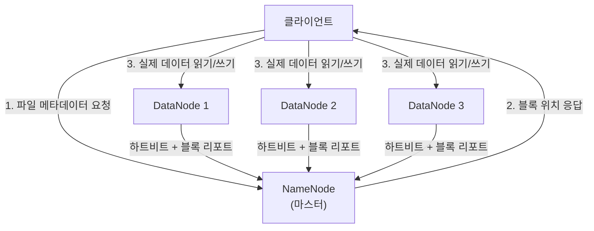
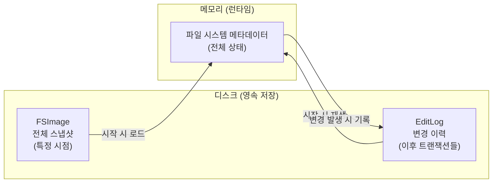
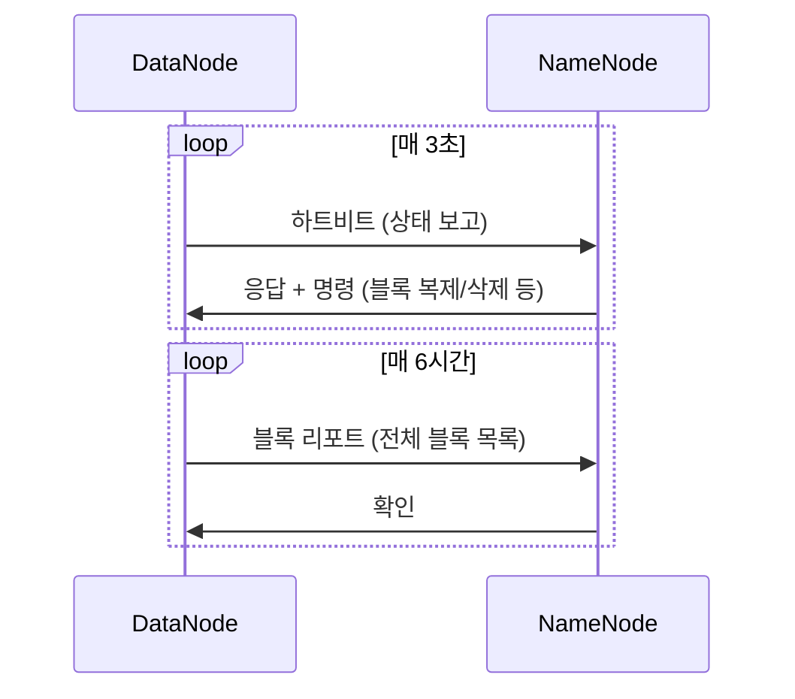
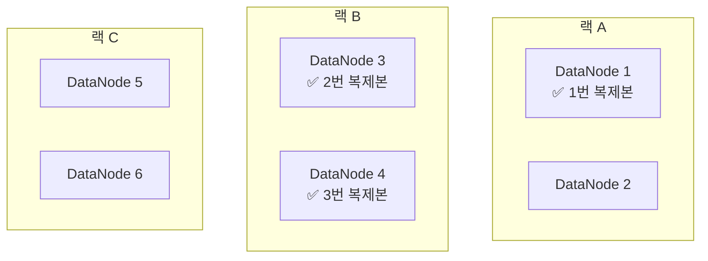
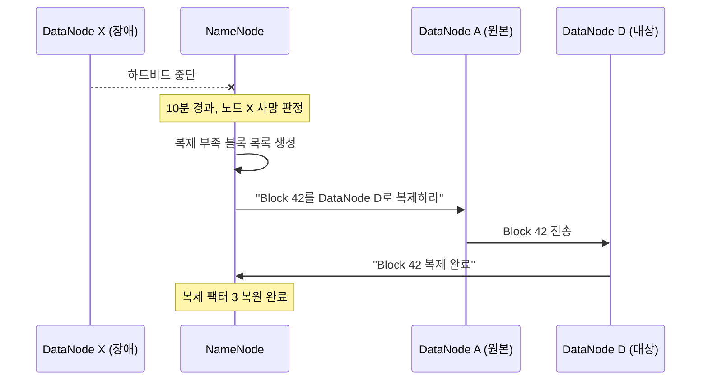
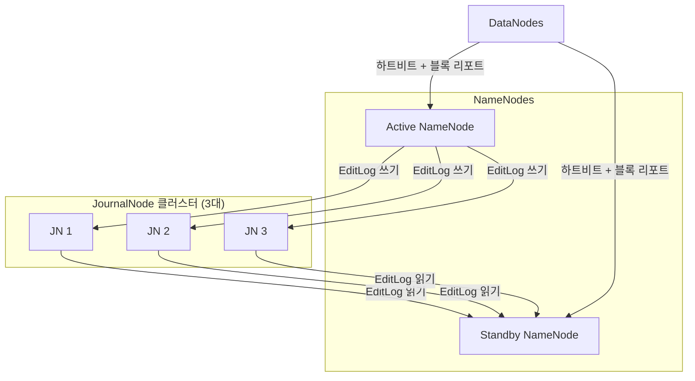
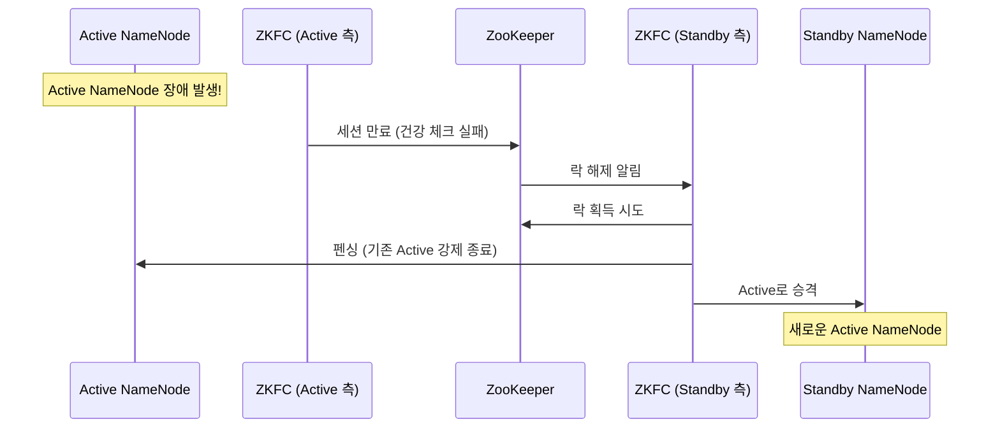
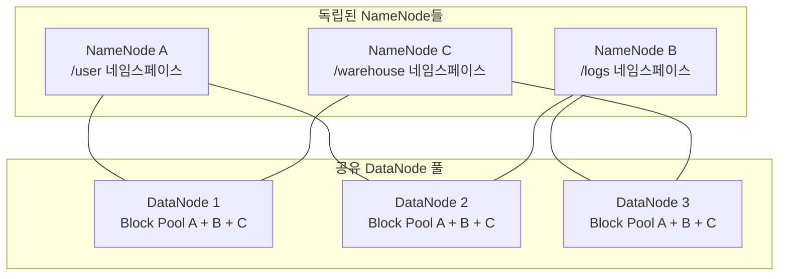
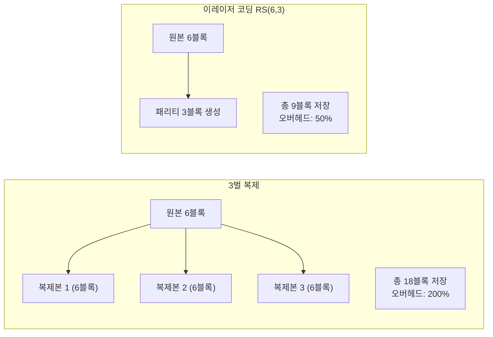

## 들어가며

[1편](/2026/04/22/hadoop-ecosystem-overview.html)에서 Hadoop 생태계의 전체 그림을 그렸습니다. 그중 가장 밑바닥에 깔려 있는 게 HDFS입니다. 다른 모든 컴포넌트 — MapReduce, Spark, Hive, HBase — 가 HDFS 위에서 돌아갑니다. 기초 중의 기초인 셈이죠.

처음에 HDFS를 접했을 때 "그냥 파일 시스템 아닌가?" 싶었습니다. 그런데 파고 들어가 보니 생각보다 설계 결정이 많고, 그 결정마다 이유가 있었습니다. 블록 크기가 왜 128MB인지, 왜 파일을 3벌씩 복제하는지, NameNode가 죽으면 어떻게 되는지. 이런 질문에 답할 수 있어야 HDFS를 "아는 것"이라고 할 수 있습니다.

이번 글에서는 HDFS의 내부 구조를 하나씩 뜯어보겠습니다.

---

## HDFS가 뭔지 한 줄로

*HDFS(Hadoop Distributed File System)*는 대용량 파일을 여러 대의 서버에 분산 저장하는 파일 시스템입니다. 구글의 GFS(Google File System) 논문을 오픈소스로 구현한 것이고, Hadoop 생태계의 저장 계층을 담당합니다.

핵심 설계 철학을 먼저 짚고 가겠습니다:

- **큰 파일에 최적화**: GB~TB 단위의 파일을 다루도록 설계. 수백만 개의 작은 파일에는 오히려 약함
- **한 번 쓰고 여러 번 읽기 (Write-Once, Read-Many)**: 파일을 수정하기보다 통째로 새로 쓰는 패턴에 맞춤
- **하드웨어 장애는 일상**: 서버 수천 대를 쓰면 매일 어딘가는 고장남. 장애를 예외가 아니라 기본 전제로 설계
- **데이터 지역성**: 데이터를 옮기는 것보다 코드를 데이터 가까이 보내는 게 빠름

---

## HDFS 아키텍처 전체 구조

HDFS는 *마스터-슬레이브(Master-Slave)* 구조입니다. NameNode 하나가 전체를 관리하고, 여러 대의 DataNode가 실제 데이터를 저장합니다.



클라이언트가 파일을 읽으려면 먼저 NameNode에게 "이 파일의 블록이 어디에 있어?"라고 물어봅니다. NameNode가 위치를 알려주면, 클라이언트가 해당 DataNode에 직접 연결해서 데이터를 가져옵니다. NameNode를 통해 데이터가 지나가지 않기 때문에 병목이 줄어듭니다.

---

## NameNode — 파일 시스템의 두뇌 (Step by Step)

NameNode는 HDFS 전체의 메타데이터를 관리합니다. "어떤 파일이 어떤 블록으로 나뉘어 있고, 각 블록이 어떤 DataNode에 있는지"를 전부 알고 있습니다. 파일 시스템의 전화번호부이자 지도입니다.

### Step 1: 메타데이터는 전부 메모리에 올린다

NameNode는 모든 메타데이터를 **RAM에** 올려놓습니다. 디스크에서 매번 읽으면 느리니까요. 클라이언트 요청이 올 때마다 메모리에서 바로 응답합니다.

구체적인 수치를 보면:
- 파일/디렉토리/블록 하나당 약 **150바이트**의 메모리를 차지
- 복제본 하나 추가될 때마다 약 **16바이트** 추가
- 결론적으로 **NameNode 힙 메모리 1GB당 약 100만 개의 파일**을 관리할 수 있음

32GB 메모리를 가진 NameNode라면 약 3,800만 개의 파일을 다룰 수 있는 셈입니다. 많아 보이지만, 작은 파일이 수억 개 쌓이면 금방 한계에 부딪힙니다. (이 문제는 뒤에서 다시 다룹니다)

### Step 2: FSImage와 EditLog — 메타데이터의 영속성

메모리에만 있으면 NameNode가 재시작될 때 데이터가 날아갑니다. 그래서 두 가지 파일로 디스크에 백업합니다:

**FSImage**: 특정 시점의 파일 시스템 전체 스냅샷입니다. 모든 파일, 디렉토리, 블록 매핑 정보가 담겨 있습니다.

**EditLog**: FSImage 이후에 발생한 모든 변경 사항을 순서대로 기록한 트랜잭션 로그입니다. 파일 생성, 삭제, 이름 변경 등이 여기에 쌓입니다. PostgreSQL의 WAL(Write-Ahead Log)과 같은 역할입니다.



NameNode가 시작되면: FSImage를 메모리에 로드 → EditLog의 트랜잭션을 순서대로 재생 → 최신 상태 복원. 이 과정이 끝나야 클라이언트 요청을 받을 수 있습니다.

### Step 3: 체크포인팅 — EditLog가 무한히 커지는 것 방지

EditLog에 변경사항이 계속 쌓이면 파일이 거대해지고, 다음 번 NameNode 시작 시 복구 시간이 길어집니다. 그래서 주기적으로 FSImage + EditLog를 합쳐서 새 FSImage를 만듭니다. 이걸 *체크포인팅(Checkpointing)*이라고 합니다.

- **비HA 클러스터**: Secondary NameNode가 체크포인팅을 담당
- **HA 클러스터**: Standby NameNode가 체크포인팅을 겸임

여기서 흔한 오해 하나를 짚겠습니다.

> **Secondary NameNode ≠ NameNode의 백업**

이름 때문에 많이 헷갈리는데, Secondary NameNode는 NameNode가 죽었을 때 대신하는 게 **아닙니다**. 체크포인팅만 하는 별도 프로세스입니다. NameNode의 백업이 필요하면 HA(High Availability) 구성의 Standby NameNode를 써야 합니다.

| | Secondary NameNode | Standby NameNode |
|---|---|---|
| 역할 | 체크포인팅만 수행 | 페일오버 대기 + 체크포인팅 |
| NameNode 대체 가능? | 불가능 | 즉시 대체 가능 |
| 메타데이터 상태 | 마지막 체크포인트 시점만 | 항상 최신 상태 유지 |
| 사용 환경 | 비HA 클러스터 | HA 클러스터 |

---

## DataNode — 실제 데이터를 품는 일꾼

DataNode는 실제 데이터 블록을 로컬 디스크에 저장하는 서버입니다. 겉보기엔 단순하지만, NameNode와 끊임없이 통신하면서 클러스터의 건강 상태를 유지합니다.

### 하트비트 메커니즘

DataNode는 **3초마다** NameNode에게 하트비트를 보냅니다. "나 살아있어요. 스토리지 총 용량은 이만큼이고, 사용 중인 건 이만큼이에요"라는 상태 보고입니다.

NameNode는 하트비트 응답에 명령을 실어 보냅니다. "이 블록을 다른 노드로 복제해", "이 블록을 삭제해", "이 블록을 캐시해" 같은 지시가 하트비트 응답에 묻어갑니다.

만약 **10분간** 하트비트가 없으면, NameNode는 해당 DataNode를 "죽었다"고 판정합니다.

### 블록 리포트

DataNode는 **6시간마다** 자기가 가진 모든 블록 목록을 NameNode에 보고합니다. 블록 ID, 크기, 생성 타임스탬프 등이 포함됩니다. NameNode는 이 보고를 자기가 가진 메타데이터와 대조해서 불일치를 잡아냅니다.



---

## 블록 — HDFS의 기본 단위 (Step by Step)

### Step 1: 파일을 블록으로 쪼개기

HDFS에 파일을 저장하면, 그 파일은 고정 크기의 *블록(Block)*으로 분할됩니다. 기본 블록 크기는 **128MB**입니다.

예시: 500MB 파일을 저장하면
- Block 1: 128MB
- Block 2: 128MB  
- Block 3: 128MB
- Block 4: 116MB (나머지)

마지막 블록이 128MB보다 작으면, 실제 데이터 크기만큼만 디스크를 차지합니다. 128MB를 빈 공간으로 채우지 않습니다.

### Step 2: 왜 블록 크기가 128MB나 되는가

일반 파일 시스템(ext4, NTFS)의 블록 크기가 4KB인 것과 비교하면 HDFS의 128MB는 32,000배나 큽니다. 이유가 있습니다.

**NameNode 메모리 절약**: 블록이 작으면 같은 데이터에 대해 더 많은 블록 메타데이터가 필요합니다.
- 1TB 파일, 128MB 블록: 8,192개 블록 → 메타데이터 약 1.2MB
- 1TB 파일, 4KB 블록: 2.68억 개 블록 → 메타데이터 약 38GB (불가능)

**디스크 탐색 시간 최소화**: 하드디스크의 탐색(seek) 시간은 약 10ms입니다. 디스크 전송 속도가 100MB/s라면, 탐색 시간을 전체의 1% 이하로 유지하려면 블록 하나가 약 100MB 이상이어야 합니다. 블록이 크면 순차 읽기(sequential read) 비율이 높아져서 처리량이 올라갑니다.

**MapReduce 태스크 수 감소**: Map 태스크 하나가 블록 하나를 처리합니다. 블록이 작으면 태스크 수가 폭증하고, 태스크 스케줄링 오버헤드가 커집니다.

### Step 3: 블록 복제 — 랙 인식 배치 전략

기본 복제 팩터는 **3**입니다. 같은 블록을 3곳에 저장하는 건데, 아무 곳에나 저장하는 게 아닙니다. *랙 인식(Rack Awareness)* 알고리즘으로 배치 위치를 결정합니다.

복제 팩터 3일 때의 배치 규칙:

1. **첫 번째 복제본**: 쓰기 요청을 보낸 클라이언트와 같은 노드 (클라이언트가 클러스터 외부라면 랜덤 노드)
2. **두 번째 복제본**: **다른 랙**의 노드
3. **세 번째 복제본**: 두 번째 복제본과 **같은 랙**의 다른 노드



왜 이렇게 배치할까요?

- **1번과 2번이 다른 랙**: 랙 전체가 고장나도(스위치 고장, 전원 차단) 데이터가 살아남음
- **2번과 3번이 같은 랙**: 쓰기 시 랙 간 네트워크 트래픽을 줄임 (3개 랙을 넘나들면 네트워크 비용이 큼)
- 추가 규칙: DataNode 하나에 같은 블록의 복제본 2개 이상 배치하지 않음

### Step 4: DataNode 장애 시 자동 복구

DataNode가 죽으면 다음 과정이 자동으로 진행됩니다:

1. 10분간 하트비트 없음 → NameNode가 해당 노드를 "죽음" 판정
2. 그 노드에 있던 블록들의 복제본 수가 부족해짐 (3→2 또는 3→1)
3. NameNode가 부족한 블록 목록을 만들고, 우선순위를 매김 (복제본 1개 남은 것이 최우선)
4. 살아있는 DataNode에게 "이 블록을 저 노드로 복제하라"고 명령
5. 복제 완료 → 다시 정상 복제 팩터 유지



기본적으로 하트비트 한 번에 DataNode당 **2개의 복제 스트림**만 허용합니다. 재복제 트래픽이 클러스터를 압도하지 않도록 조절하는 것입니다.

---

## 파일 쓰기 과정 (Step by Step)

HDFS에 파일을 쓸 때 내부에서 무슨 일이 벌어지는지 따라가 보겠습니다.

### Step 1: 파일 생성 요청

클라이언트가 NameNode에게 "새 파일을 만들겠다"고 요청합니다. NameNode는 파일이 이미 존재하는지, 클라이언트에게 쓰기 권한이 있는지 확인한 뒤, 파일 엔트리를 네임스페이스에 등록합니다. 그리고 클라이언트에게 *쓰기 임대(Write Lease)*를 부여합니다. 하나의 파일에 동시에 여러 클라이언트가 쓰는 것을 방지하기 위해서입니다.

### Step 2: 데이터 패킷화

클라이언트가 데이터를 쓰기 시작하면, 데이터는 **64KB 크기의 패킷**으로 잘립니다. 패킷들은 내부 *데이터 큐(Data Queue)*에 쌓입니다.

### Step 3: 파이프라인 구성

NameNode에게 "블록을 어디에 저장할지" 물어봅니다. NameNode가 3개의 DataNode 주소를 알려주면(예: DN1, DN2, DN3), 클라이언트는 이 노드들을 직렬로 연결한 *파이프라인*을 구성합니다.

### Step 4: 파이프라인 전송

패킷이 파이프라인을 따라 흐릅니다:


- 클라이언트 → DN1: 패킷 전송
- DN1: 로컬에 저장하면서 **동시에** DN2로 전달
- DN2: 로컬에 저장하면서 **동시에** DN3로 전달
- 확인(ACK)은 역방향: DN3 → DN2 → DN1 → 클라이언트

파이프라인이기 때문에, 이전 패킷의 ACK를 기다리지 않고 다음 패킷을 보낼 수 있습니다. 이 덕분에 쓰기 속도가 빨라집니다.

### Step 5: 블록 완료

블록이 128MB에 도달하거나 파일을 닫으면, 클라이언트가 NameNode에게 블록 완료를 알립니다. NameNode는 최소 복제 수가 확인되면 블록 메타데이터를 확정합니다.

### 파이프라인 장애 처리

중간에 DN2가 죽으면? 파이프라인이 재구성됩니다. DN2를 빼고 DN1 → DN3로 연결하거나, NameNode에게 새 DataNode를 요청합니다. 부족한 복제본은 나중에 NameNode가 별도로 재복제를 지시합니다.

---

## 파일 읽기 과정 (Step by Step)

### Step 1: 블록 위치 조회

클라이언트가 NameNode에게 "이 파일을 읽고 싶다"고 요청합니다. NameNode가 첫 몇 개 블록의 위치(어떤 DataNode에 있는지)를 알려줍니다. 이때 **클라이언트와 가까운 순서로 정렬**해서 알려줍니다.

가까운 순서: 같은 노드(node-local) > 같은 랙(rack-local) > 다른 랙(off-rack)

### Step 2: DataNode에서 직접 읽기

클라이언트는 가장 가까운 DataNode에 직접 연결해서 데이터를 읽습니다. NameNode를 거치지 않기 때문에 NameNode에 병목이 생기지 않습니다.

블록 하나를 다 읽으면 연결을 끊고, 다음 블록의 가장 가까운 DataNode로 연결합니다.

### Step 3: 체크섬 검증

HDFS는 데이터 무결성을 위해 512바이트마다 CRC-32C *체크섬(Checksum)*을 기록해둡니다. 클라이언트가 데이터를 읽을 때마다 체크섬을 검증합니다.

만약 체크섬이 안 맞으면(데이터 손상):
1. 클라이언트가 NameNode에게 손상을 보고
2. NameNode가 손상된 복제본을 표시
3. 클라이언트는 다른 DataNode의 정상 복제본에서 다시 읽음
4. NameNode가 정상 복제본을 기반으로 재복제를 지시

DataNode도 자체적으로 주기적인 *블록 스캐너(Block Scanner)*를 돌려 디스크 위 데이터의 *비트 부식(Bit Rot)*을 사전에 감지합니다.

---

## 고가용성 (HA) 구성 (Step by Step)

운영 환경에서 NameNode가 단일 장애점(SPOF)이면 큰 문제입니다. NameNode 하나가 죽으면 클러스터 전체가 멈추니까요. 이걸 해결하는 게 HA 구성입니다.

### Step 1: Active/Standby 구조

NameNode를 2대 (Hadoop 3.x에서는 2대 이상) 둡니다. 하나는 *Active*(모든 클라이언트 요청 처리), 나머지는 *Standby*(대기 상태)입니다.

DataNode는 Active와 Standby **양쪽 모두에게** 하트비트와 블록 리포트를 보냅니다. Standby는 항상 최신 상태를 유지하고 있어서, Active가 죽으면 빠르게 교체할 수 있습니다.

### Step 2: JournalNode — 공유 EditLog

Active NameNode가 EditLog를 기록할 때, 로컬 디스크가 아니라 **JournalNode 클러스터**에 씁니다. JournalNode는 최소 **3대** (항상 홀수)로 구성하고, 과반수에 쓰기가 성공해야 커밋됩니다.

Standby NameNode는 JournalNode에서 EditLog를 지속적으로 읽어 자기 메타데이터를 갱신합니다.



JournalNode 3대 중 1대가 죽어도 나머지 2대(과반수)가 살아있으면 정상 운영됩니다. 5대면 2대까지 장애 허용.

### Step 3: 자동 페일오버 — ZooKeeper + ZKFC

각 NameNode 서버에는 *ZKFC(ZooKeeper Failover Controller)*가 실행됩니다. ZKFC의 역할은 세 가지입니다:

1. **건강 체크**: 로컬 NameNode가 정상인지 주기적으로 확인
2. **ZooKeeper 세션 관리**: NameNode가 건강하면 ZooKeeper에 임시 노드(ephemeral znode)를 유지
3. **Active 선출**: ZooKeeper의 락을 획득한 쪽이 Active가 됨



*펜싱(Fencing)*은 기존 Active가 완전히 죽었는지 확인하는 과정입니다. 네트워크 문제로 "죽은 척"하는 경우, Active가 2개 생기는 *스플릿 브레인(Split-Brain)* 상황을 막기 위해 기존 Active를 강제 종료합니다. SSH로 접속해서 프로세스를 죽이는 `sshfence` 방식이 가장 흔합니다.

---

## HDFS Federation — 수평 확장

HA가 "장애 대비"라면, Federation은 "확장성"을 위한 기능입니다. NameNode 하나가 처리할 수 있는 파일 수와 요청량에는 한계가 있습니다.

HDFS Federation에서는 **여러 개의 독립된 NameNode**가 각자 별도의 *네임스페이스(Namespace)*를 관리합니다. DataNode는 모든 NameNode에 공통으로 사용됩니다.



각 NameNode는 자기 네임스페이스에 해당하는 *블록 풀(Block Pool)*만 관리합니다. NameNode끼리는 서로 통신하지 않고, 완전히 독립적으로 동작합니다.

HA와 Federation은 조합할 수 있습니다. 각 네임스페이스마다 Active/Standby 쌍을 둘 수 있습니다.

---

## 이레이저 코딩 (Hadoop 3.x)

3벌 복제는 안전하지만, 저장 공간을 3배나 씁니다. 페타바이트 규모에서는 이 비용이 수십억 원 단위입니다. Hadoop 3.x에서 도입된 *이레이저 코딩(Erasure Coding, EC)*은 이 문제를 해결합니다.

### 복제 vs 이레이저 코딩



*리드-솔로몬(Reed-Solomon)* 알고리즘으로 원본 데이터 블록에서 패리티 블록을 수학적으로 계산합니다. 6개의 데이터 블록과 3개의 패리티 블록이 있으면, 이 중 **아무 3개가 손실되어도** 나머지 6개로 원본을 복원할 수 있습니다.

### HDFS 3.x의 EC 정책들

| 정책 | 데이터 블록 | 패리티 블록 | 저장 오버헤드 | 장애 허용 수 |
|------|-----------|-----------|-------------|------------|
| RS-3-2-1024k | 3 | 2 | 66.7% | 2개 |
| **RS-6-3-1024k** (기본) | 6 | 3 | 50% | 3개 |
| RS-10-4-1024k | 10 | 4 | 40% | 4개 |
| XOR-2-1-1024k | 2 | 1 | 50% | 1개 |

기본 정책인 RS(6,3)은 3벌 복제보다 **저장 공간을 75% 절약하면서도, 장애 허용 수는 오히려 더 많습니다** (3개 vs 2개).

### 언제 복제를, 언제 EC를?

| | 3벌 복제 | 이레이저 코딩 |
|---|---------|-------------|
| **적합한 데이터** | 자주 읽히는 핫 데이터 | 거의 안 읽히는 콜드/웜 데이터 |
| **읽기 성능** | 빠름 (로컬 복제본 직접 읽기) | 느림 (손상 시 디코딩 필요) |
| **쓰기 성능** | 빠름 (단순 복사) | 느림 (인코딩 CPU 비용) |
| **저장 효율** | 낮음 (3배) | 높음 (1.5배) |
| **최소 노드 수** | 3대 | 9대 이상 (RS-6-3 기준) |

실무에서는 자주 접근하는 데이터는 복제로, 오래된 로그나 아카이브 데이터는 EC로 설정하는 경우가 많습니다. EC는 디렉토리 단위로 정책을 적용합니다.

---

## 실무에서 마주치는 HDFS 이슈

### 작은 파일 문제 (Small Files Problem)

HDFS에서 가장 흔하게 마주치는 성능 이슈입니다.

1KB짜리 파일이든 128MB짜리 파일이든, NameNode 메모리에서 차지하는 메타데이터 크기는 거의 같습니다(약 150바이트). 1억 개의 작은 파일을 저장하면 메타데이터만 약 **30GB**의 NameNode 메모리를 잡아먹습니다.

게다가 MapReduce는 블록 하나당 Map 태스크 하나를 만드니까, 작은 파일이 수백만 개면 수백만 개의 태스크가 생기고 스케줄링 오버헤드가 폭증합니다.

**해결 방법들:**
- **HAR 파일 (Hadoop Archives)**: 작은 파일들을 하나의 아카이브로 묶기
- **SequenceFile**: 여러 작은 파일을 하나의 키-값 바이너리 파일로 합치기
- **CombineFileInputFormat**: MapReduce에서 여러 작은 파일을 하나의 split으로 합쳐 처리
- **수집 단계에서 합치기**: 애초에 파이프라인에서 작은 파일이 생기지 않도록 설계

### HDFS CLI 기본 명령어

데이터 엔지니어라면 자주 쓰게 될 명령어들입니다:

```bash
# 디렉토리 목록 확인
hdfs dfs -ls /user/data/

# 로컬 파일을 HDFS에 업로드
hdfs dfs -put localfile.csv /user/data/

# HDFS 파일을 로컬로 다운로드
hdfs dfs -get /user/data/result.csv ./

# 파일 내용 확인
hdfs dfs -cat /user/data/sample.txt
hdfs dfs -tail /user/data/sample.txt

# 디렉토리 생성
hdfs dfs -mkdir -p /user/data/input/

# 파일 삭제
hdfs dfs -rm /user/data/old.txt
hdfs dfs -rm -r /user/data/old_dir/

# 디렉토리 용량 확인
hdfs dfs -du -h /user/data/

# 복제 팩터 변경
hdfs dfs -setrep 2 /user/data/cold_data.txt

# 클러스터 상태 확인 (관리자)
hdfs dfsadmin -report

# 파일 시스템 무결성 검사
hdfs fsck /user/data/ -files

# 클러스터 밸런싱
hdfs balancer
```

### HDFS vs 클라우드 오브젝트 스토리지 (S3)

데이터 엔지니어링을 하다 보면 "HDFS를 써야 하나, S3를 써야 하나" 하는 질문에 마주칩니다.

| 관점 | HDFS | S3/GCS/ADLS |
|------|------|-------------|
| 구조 | 계층형 파일 시스템 (진짜 디렉토리) | 플랫 키-값 저장소 (디렉토리는 시뮬레이션) |
| 데이터 지역성 | 컴퓨팅과 스토리지가 같은 노드 | 컴퓨팅과 스토리지 분리 (네트워크 필요) |
| 확장성 | 스토리지 추가 = 컴퓨팅도 추가 (결합) | 스토리지와 컴퓨팅 독립 확장 |
| 비용 모델 | 클러스터 상시 운영 비용 | 사용한 만큼만 과금 |
| 운영 부담 | 직접 관리 (하드웨어, OS, 업그레이드) | 클라우드 제공자가 관리 |
| 읽기 성능 | 데이터 지역성 덕에 노드당 높음 | 노드당 낮지만, 탄력적 확장으로 보완 |
| 수정 가능성 | 파일 내용 수정 가능 (append) | 불변 객체 (수정 = 새 객체 쓰기) |

최근 추세는 신규 프로젝트에서 S3 같은 오브젝트 스토리지를 선택하고, 그 위에 Delta Lake나 Apache Iceberg를 얹어 ACID 트랜잭션과 메타데이터 관리를 추가하는 방향입니다. 하지만 기존 온프레미스 환경이나 데이터 주권 요구가 있는 곳에서는 HDFS가 여전히 현역입니다.

---

## 성능 튜닝 포인트

### 데이터 지역성 레벨

YARN이 태스크를 스케줄링할 때, 데이터가 있는 곳에 최대한 가까이 배치하려 합니다:

1. **노드 로컬 (Node-local)**: 데이터가 있는 바로 그 노드에서 실행. 네트워크 사용 제로
2. **랙 로컬 (Rack-local)**: 같은 랙의 다른 노드에서 실행. 랙 내부 네트워크만 사용
3. **오프랙 (Off-rack)**: 다른 랙에서 실행. 랙 간 스위치를 거침

YARN 스케줄러는 먼저 노드 로컬을 시도하고, 설정된 대기 시간 후에 랙 로컬, 그다음 오프랙으로 폴백합니다.

### 숏서킷 로컬 리드 (Short-Circuit Local Reads)

같은 서버에 있는 데이터를 읽을 때도, 기본적으로는 DataNode 프로세스를 거쳐 TCP 소켓으로 통신합니다. *숏서킷 로컬 리드*를 활성화하면, DataNode를 거치지 않고 클라이언트가 **로컬 디스크에서 직접** 읽습니다.

UNIX 도메인 소켓을 사용해서 파일 디스크립터를 공유하는 방식인데, 성능 향상이 상당합니다. 운영 환경에서는 거의 필수로 켜는 설정입니다.

```bash
# hdfs-site.xml 설정
dfs.client.read.shortcircuit = true
dfs.domain.socket.path = /var/lib/hadoop-hdfs/dn_socket
```

---

## 정리

이번 글에서 다룬 HDFS의 핵심을 압축하면:

- NameNode는 모든 메타데이터를 메모리에 올려 빠른 응답을 제공. FSImage + EditLog로 영속성 확보
- DataNode는 3초마다 하트비트, 6시간마다 블록 리포트를 NameNode에 전송
- 블록 크기 128MB는 NameNode 메모리 절약 + 디스크 탐색 최소화를 위한 설계
- 랙 인식 복제 전략으로 랙 장애에도 데이터 보존
- HA 구성은 JournalNode + ZooKeeper + ZKFC로 자동 페일오버
- Federation은 여러 NameNode로 네임스페이스를 분산해 확장성 확보
- 이레이저 코딩은 저장 오버헤드를 200%에서 50%로 줄이면서 장애 허용은 더 높임
- 작은 파일 문제는 HDFS의 대표적 약점. 파이프라인 설계 단계에서 예방해야 함

---

## 추가로 공부하면 좋을 개념

- **POSIX vs HDFS 파일 시스템 의미론**: HDFS가 왜 POSIX 호환을 포기했는지 이해하면, append-only 설계와 단일 쓰기자 모델의 이유가 명확해집니다
- **리드-솔로몬 부호화 (Reed-Solomon Coding)**: 이레이저 코딩의 수학적 기반. 갈루아 체(Galois Field) 위의 다항식 연산으로 동작합니다. CD/DVD 오류 정정에도 같은 원리가 쓰입니다
- **Apache Ozone**: HDFS의 한계(NameNode 메모리 병목, 작은 파일 문제)를 해결하기 위해 설계된 차세대 분산 저장소. Hadoop 생태계와 호환되면서도 오브젝트 스토리지 방식으로 동작합니다

다음 글에서는 MapReduce와 YARN을 다룹니다. HDFS에 저장된 데이터를 실제로 어떻게 병렬 처리하는지, YARN이 클러스터 자원을 어떻게 배분하는지 파헤쳐 보겠습니다.
