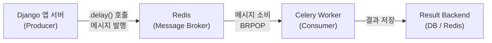
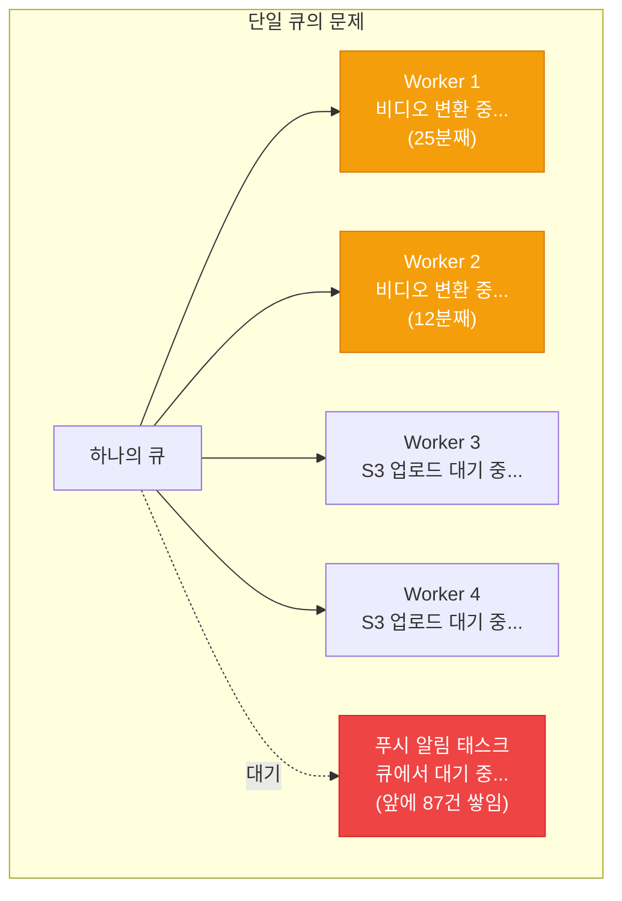
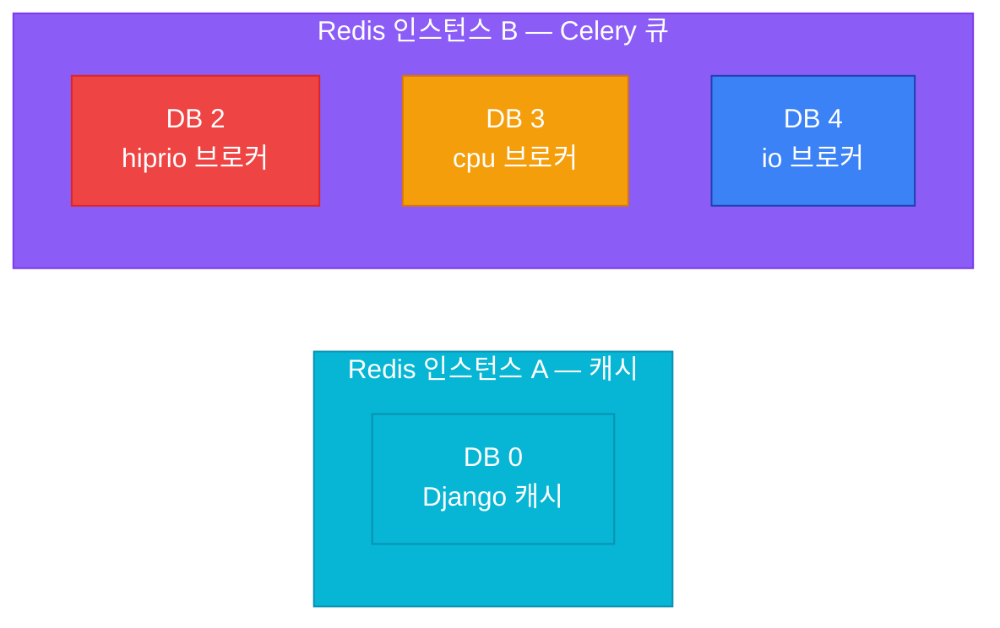
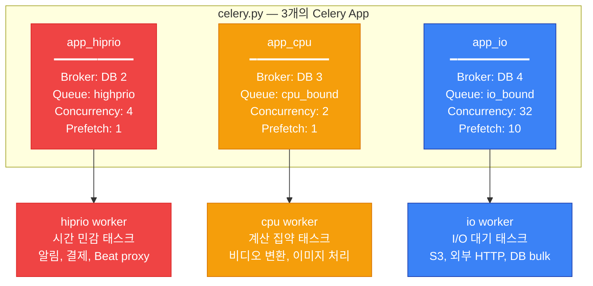
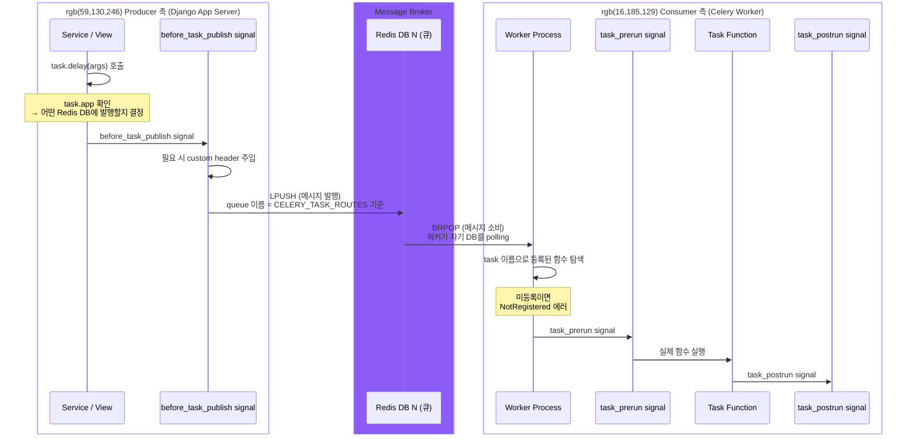
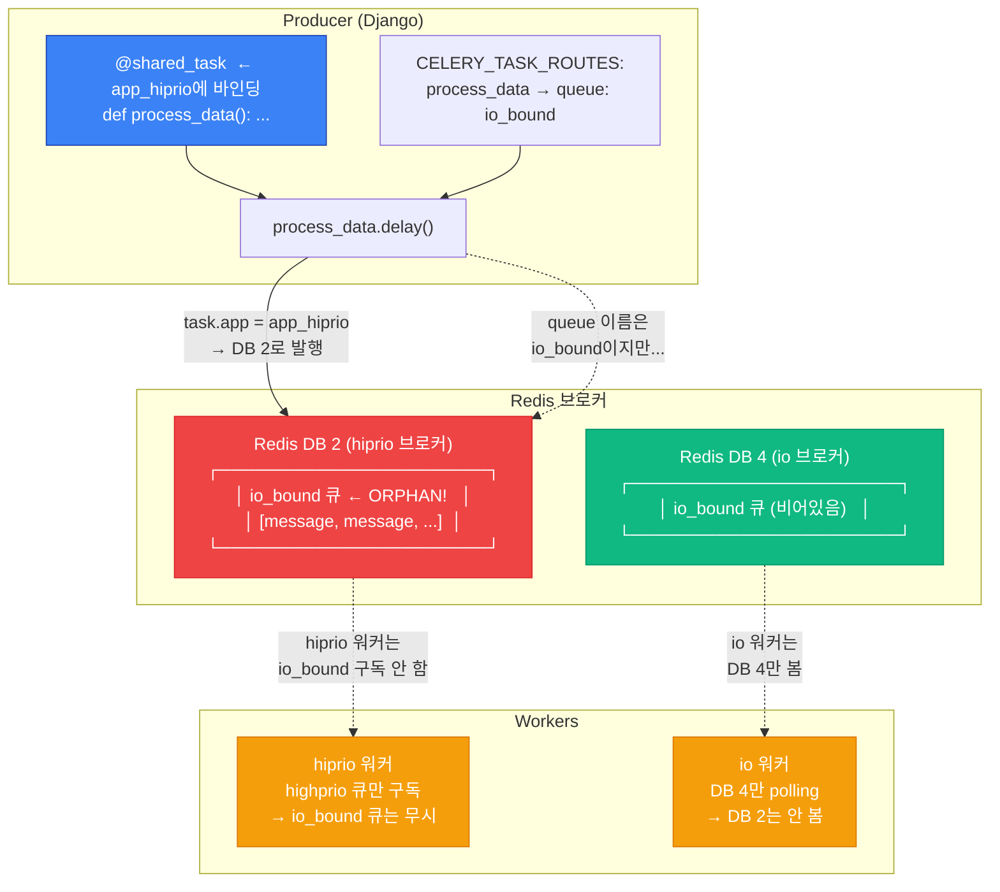
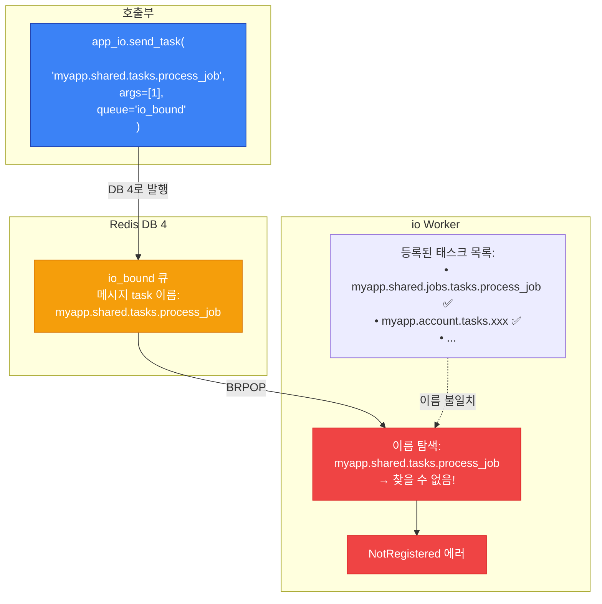
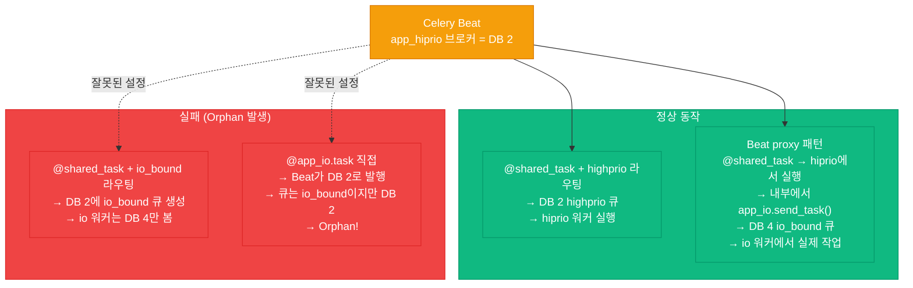
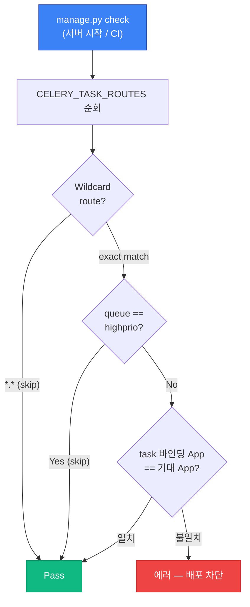
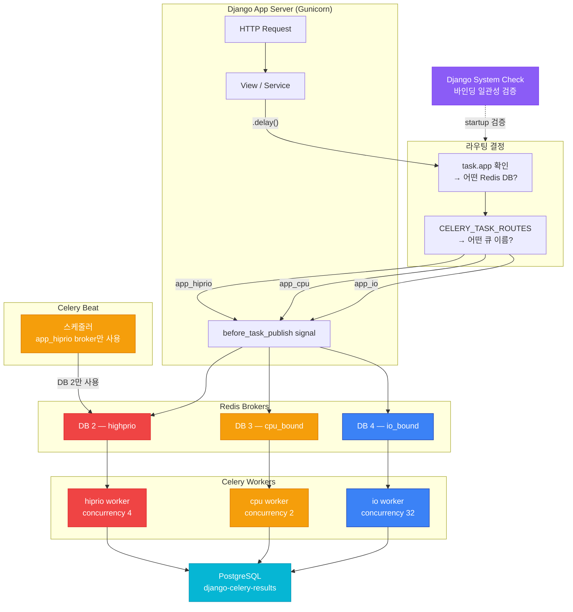

## 들어가며

회사에서 Celery를 운영하다 보면 "분명히 `.delay()`를 호출했는데 태스크가 안 돌아간다"는 상황을 한 번쯤 겪게 됩니다. 저도 그랬습니다. 로그를 아무리 뒤져봐도 에러가 없고, Redis에 메시지가 쌓이는 건 확인되는데, 워커가 아무 반응이 없는 겁니다.

원인은 단순했습니다. Celery App 하나에 Redis 브로커 하나로 쓰는 단일 구조가 아니라, **작업 유형별로 분리된 멀티-브로커 구조**였고, 태스크가 엉뚱한 Redis DB로 발행되고 있었던 거죠.

이번 글에서는 Celery의 기본 동작 원리부터 시작해서, 멀티-브로커 아키텍처를 왜 도입하는지, 그리고 이 구조에서 어떤 함정들이 있는지를 단계별로 파헤쳐 보겠습니다. Celery를 단일 브로커로 쓰고 있더라도 내부 동작을 이해하는 데 도움이 될 겁니다.

---

## Celery와 Redis, 기본 구조부터

본격적으로 멀티-브로커를 다루기 전에, Celery가 어떻게 동작하는지 기본부터 짚고 넘어가겠습니다.

*Celery*는 Python 기반의 *비동기 태스크 큐(Asynchronous Task Queue)* 프레임워크입니다. 쉽게 말하면, "지금 당장 처리할 필요 없는 작업"을 큐에 넣어두고, 별도의 *워커(Worker)* 프로세스가 나중에 꺼내서 실행하는 구조입니다.

*Redis*는 여기서 *메시지 브로커(Message Broker)* 역할을 합니다. Producer(Django 같은 웹 서버)가 태스크 메시지를 Redis에 넣으면, Consumer(Celery Worker)가 Redis에서 메시지를 꺼내 실행합니다.



단일 브로커 구성이면 이게 전부입니다. `@shared_task`로 태스크를 선언하고, `.delay()`로 호출하면 끝이죠.

```python
# tasks.py
from celery import shared_task

@shared_task
def send_welcome_email(user_id):
    # 이메일 발송 로직
    ...
```

```python
# views.py
send_welcome_email.delay(user_id=42)
```

이 구조가 대부분의 프로젝트에서 충분합니다. 그런데 트래픽이 늘고 작업 유형이 다양해지면 한계가 보이기 시작합니다.

---

## 왜 멀티-브로커가 필요한가

단일 브로커의 문제를 구체적인 상황으로 설명해보겠습니다.

이런 세 가지 태스크가 하나의 큐에 섞여 있다고 해봅시다:

1. **실시간 푸시 알림** — 사용자가 결제하면 즉시 발송해야 함. 100ms 이내 처리 목표
2. **비디오 트랜스코딩** — 업로드된 영상을 여러 해상도로 변환. 건당 5~30분 소요
3. **외부 API 호출 + S3 업로드** — 대량 데이터 수집 후 저장. I/O 대기가 대부분

이 셋이 같은 큐에 있으면 어떻게 될까요?



워커 4개가 전부 무거운 작업에 점유당해서, 100ms 안에 처리해야 할 푸시 알림이 큐에서 몇 분씩 대기합니다. *concurrency(동시 처리 수)*를 늘리면? CPU 집약적인 비디오 변환이 더 많은 CPU를 잡아먹어서 전체 서버가 느려집니다.

이건 근본적으로 **작업의 성격이 다른데 같은 자원 풀을 공유하기 때문**에 생기는 문제입니다.

해법은 작업 유형별로 분리하는 것입니다:

| 작업 유형 | 특성 | 최적 설정 |
|-----------|------|-----------|
| 시간 민감 (알림, 결제) | 짧고 빨라야 함 | 낮은 concurrency, prefetch 1 |
| CPU 집약 (비디오 변환) | CPU 포화 방지 필요 | concurrency 2~4, 시간 제한 설정 |
| I/O 대기 (S3, 외부 API) | 대기 시간이 대부분 | 높은 concurrency, prefetch 다수 |

"큐만 나누면 되지 않나?"라고 생각할 수 있습니다. 큐를 나눠도 같은 Redis 안에서 같은 워커 프로세스가 여러 큐를 구독하면, *prefetch multiplier(미리 가져오기 배수)*나 concurrency를 큐별로 다르게 설정할 수 없습니다. 그래서 **Celery App 자체를 분리**합니다.

---

## Redis DB 분리 — 물리적 격리

하나의 Redis 인스턴스 안에서 *DB 번호*로 브로커를 격리합니다. Redis는 기본적으로 0~15번까지 16개의 DB를 제공하는데, DB가 다르면 키 네임스페이스가 완전히 분리됩니다. DB 2의 키와 DB 4의 키는 서로 볼 수 없습니다.



왜 DB 0, 1을 건너뛰고 2부터 쓰느냐면, DB 0은 보통 Django 캐시가 차지하고, DB 1은 세션 저장 등 다른 용도로 예약해두는 경우가 많기 때문입니다. 캐시용 Redis 인스턴스와 Celery용 인스턴스를 아예 분리하는 것도 흔한 패턴입니다.

설정은 이렇게 됩니다:

```python
# settings.py
CACHES = {
    'default':        {'BACKEND': '...', 'LOCATION': 'redis://redis-cache:6379/0'},
    'celery_hiprio':  {'BACKEND': '...', 'LOCATION': 'redis://redis-celery:6379/2'},
    'celery_cpu':     {'BACKEND': '...', 'LOCATION': 'redis://redis-celery:6379/3'},
    'celery_io':      {'BACKEND': '...', 'LOCATION': 'redis://redis-celery:6379/4'},
}

CELERY_BROKER_HIPRIO = CACHES['celery_hiprio']['LOCATION']
CELERY_BROKER_CPU    = CACHES['celery_cpu']['LOCATION']
CELERY_BROKER_IO     = CACHES['celery_io']['LOCATION']
```

URL 끝의 `/2`, `/3`, `/4`가 각각 Redis DB 번호입니다. 이렇게 하면 hiprio 워커가 DB 2만 보고, io 워커는 DB 4만 보게 됩니다. 서로의 메시지를 절대 건드리지 않습니다.

---

## 3개의 Celery App 만들기 (Step by Step)

### Step 1: 공통 설정 정의

모든 App이 공유하는 설정을 먼저 뽑아냅니다.

```python
# celery.py
from celery import Celery
from kombu import Queue
from django.conf import settings

def get_common_config():
    return {
        'accept_content': ['application/json'],
        'task_serializer': 'json',
        'result_backend': 'django-db',
        'timezone': 'Asia/Seoul',
    }
```

`result_backend`은 `django-db`로 설정해서 태스크 실행 결과를 PostgreSQL에 저장합니다. *django-celery-results* 패키지가 필요합니다. 모든 App의 결과가 같은 DB에 저장되므로, 나중에 관리자 페이지에서 전체 태스크 실행 이력을 한 눈에 볼 수 있습니다.

### Step 2: 각 App 인스턴스 생성

```python
# celery.py (계속)
app_hiprio = Celery('myproject_hiprio')
app_hiprio.config_from_object({
    **get_common_config(),
    'broker_url': settings.CELERY_BROKER_HIPRIO,      # DB 2
    'task_queues': [Queue('highprio')],
    'task_default_queue': 'highprio',
    'worker_prefetch_multiplier': 1,
})

app_cpu = Celery('myproject_cpu')
app_cpu.config_from_object({
    **get_common_config(),
    'broker_url': settings.CELERY_BROKER_CPU,          # DB 3
    'task_queues': [Queue('cpu_bound')],
    'task_default_queue': 'cpu_bound',
    'worker_prefetch_multiplier': 1,
    'task_time_limit': 3600,           # 하드 제한: 1시간
    'task_soft_time_limit': 3300,      # 소프트 제한: 55분
})

app_io = Celery('myproject_io')
app_io.config_from_object({
    **get_common_config(),
    'broker_url': settings.CELERY_BROKER_IO,           # DB 4
    'task_queues': [Queue('io_bound')],
    'task_default_queue': 'io_bound',
    'worker_prefetch_multiplier': 10,
})
```

각 설정값의 의미를 뜯어보겠습니다.

**`worker_prefetch_multiplier`**: 워커가 한 번에 미리 가져오는 메시지 수입니다. hiprio와 cpu는 1로 설정합니다. 미리 여러 개를 가져오면 다른 워커가 처리할 메시지를 혼자 쥐고 있게 되니까요. I/O 워커는 10으로 높입니다. I/O 대기 시간이 길어서, 미리 가져다 놓으면 대기 시간에 다음 태스크를 바로 시작할 수 있습니다.

**`task_time_limit`과 `task_soft_time_limit`**: CPU 워커에만 설정합니다. 비디오 변환처럼 오래 걸리는 작업이 무한정 돌지 않도록 제한을 겁니다. soft limit에 도달하면 `SoftTimeLimitExceeded` 예외가 발생하고, hard limit에 도달하면 워커가 프로세스를 강제 종료합니다.

### Step 3: 호환성 별칭과 라우팅 공유

```python
# celery.py (계속)

# 하위 호환성: 기존 코드의 `from myproject.celery import app` 지원
app = app_hiprio

# 모든 App이 동일한 라우팅 설정 공유
for celery_app in [app_hiprio, app_cpu, app_io]:
    celery_app.conf.task_routes = settings.CELERY_TASK_ROUTES

# 태스크 자동 탐색
app_hiprio.autodiscover_tasks()
app_cpu.autodiscover_tasks()
app_io.autodiscover_tasks()
```

`app = app_hiprio`는 기존에 `from myproject.celery import app`으로 참조하는 코드가 깨지지 않도록 하는 별칭입니다. 새 코드에서는 `app_hiprio`, `app_io` 등을 직접 import하는 게 명확합니다.

`autodiscover_tasks()`는 Django의 `INSTALLED_APPS`에 등록된 앱들에서 `tasks.py` 파일을 찾아 태스크를 자동 등록합니다.

### Step 4: 워커 프로세스 시작

```bash
# hiprio 워커 — DB 2의 highprio 큐만 소비
celery -A myproject.celery:app_hiprio worker \
  --queues=highprio --concurrency=4 --prefetch-multiplier=1

# cpu 워커 — DB 3의 cpu_bound 큐만 소비
celery -A myproject.celery:app_cpu worker \
  --queues=cpu_bound --concurrency=2 --prefetch-multiplier=1

# io 워커 — DB 4의 io_bound 큐만 소비
celery -A myproject.celery:app_io worker \
  --queues=io_bound --concurrency=32 --prefetch-multiplier=10
```

`-A myproject.celery:app_hiprio`에서 콜론(`:`) 뒤가 어떤 Celery App 인스턴스를 사용할지 지정합니다. 이게 곧 **어떤 Redis DB에서 메시지를 소비할지**를 결정합니다.

전체 구조를 정리하면 이렇습니다:



| 속성 | `app_hiprio` | `app_cpu` | `app_io` |
|------|-------------|-----------|----------|
| Redis DB | 2 | 3 | 4 |
| Queue 이름 | `highprio` | `cpu_bound` | `io_bound` |
| Concurrency | 4 | 2 | 32 |
| Prefetch multiplier | 1 | 1 | 10 |
| 설계 의도 | 짧고 빠르게 | CPU 포화 방지 | I/O 대기 활용 |

---

## 태스크 등록: `@shared_task` vs `@app_X.task`

이 구분이 멀티-브로커 구조에서 **모든 문제의 시작점**입니다. 제가 겪었던 버그도 여기서 비롯됐습니다.

### `@shared_task` — "기본 App"에 바인딩

```python
from celery import shared_task

@shared_task
def send_notification(user_id):
    ...
```

`shared_task`는 이름과 달리 "공유"되는 게 아닙니다. Celery의 "기본 App"에 바인딩됩니다. 이 구조에서 기본 App은 `app_hiprio`입니다 (`app = app_hiprio` 별칭 때문). 그래서 `send_notification.app == app_hiprio`가 되고, **`.delay()` 호출 시 Redis DB 2로 메시지가 발행**됩니다.

### `@app_X.task` — 명시적 App 바인딩

```python
from myproject.celery import app_io

@app_io.task
def upload_to_s3(file_path):
    ...
```

이렇게 하면 `upload_to_s3.app == app_io`이고, **`.delay()` 호출 시 Redis DB 4로 발행**됩니다. 의도가 코드에 명시적으로 드러나서, 나중에 봤을 때 "이 태스크는 io 워커에서 실행되겠구나"라고 바로 알 수 있습니다.

### 태스크 이름은 어떻게 결정되는가

Celery는 태스크 이름을 **데코레이터가 평가되는 모듈의 `__name__`** 기준으로 자동 생성합니다.

```python
# myapp/tasks.py 에서 선언
@app_hiprio.task
def send_notification():
    ...

# 등록되는 태스크 이름: "myapp.tasks.send_notification"
```

이 규칙을 모르면 뒤에서 다룰 `NotRegistered` 에러에 걸립니다.

---

## `.delay()` 한 줄의 여정 (Step by Step)

`.delay()`를 호출하면 내부적으로 어떤 일이 벌어지는지, 처음부터 끝까지 따라가 보겠습니다.

### Step 1: Producer 측 — App 확인과 메시지 발행

```python
send_notification.delay(user_id=42)
```

이 한 줄이 내부적으로 수행하는 동작입니다:

1. `task.app` 확인 → `app_hiprio` → broker URL = `redis://redis-celery:6379/2`
2. `CELERY_TASK_ROUTES` 조회 → 큐 이름 결정 → `highprio`
3. 태스크 인자(`user_id=42`)를 JSON으로 *직렬화(Serialization)*합니다. 메모리의 Python 객체를 네트워크로 전송 가능한 형태로 변환하는 과정입니다.
4. `before_task_publish` *시그널(Signal)* 발동 — 커스텀 헤더를 주입하거나 로깅할 수 있는 후킹 포인트
5. Redis DB 2에 **`LPUSH` 명령**으로 메시지 발행

### Step 2: 메시지가 Redis에 저장되는 형태

Redis 내부에서 Celery 메시지는 리스트 자료구조에 저장됩니다. `redis-cli`로 직접 확인할 수 있습니다:

```bash
# Redis DB 2에 접속
redis-cli -n 2

# 큐에 쌓인 메시지 수 확인
LLEN highprio

# 큐의 메시지 내용 확인 (맨 뒤부터 peek)
LRANGE highprio -1 -1
```

메시지 본문은 JSON으로, 태스크 이름, 인자, 태스크 ID, 헤더 등이 포함되어 있습니다.

### Step 3: Consumer 측 — 워커의 메시지 소비

hiprio 워커가 실행 중이라면 다음과 같이 동작합니다:

1. 워커 프로세스가 Redis DB 2의 `highprio` 큐를 **`BRPOP`** 명령으로 *폴링(Polling)*합니다. `BRPOP`은 *블로킹 팝(Blocking Pop)*으로, 큐에 메시지가 없으면 메시지가 올 때까지 대기합니다.
2. 메시지에서 태스크 이름(`myapp.tasks.send_notification`) 추출
3. 자기가 등록한 태스크 목록에서 해당 이름을 찾음
4. `task_prerun` 시그널 발동
5. **실제 함수 실행**
6. `task_postrun` 시그널 발동, 결과를 result backend에 저장



여기서 Step 3의 "태스크 이름으로 등록된 함수를 찾는" 과정이 실패하면 `NotRegistered` 에러가 납니다. 이건 뒤에서 자세히 다루겠습니다.

---

## CELERY_TASK_ROUTES — 가장 많이 오해하는 부분

이걸 처음 봤을 때 "라우팅이면 메시지를 어디로 보낼지 결정하는 거 아닌가?"라고 생각했습니다. 맞긴 한데, **절반만 맞습니다**.

`CELERY_TASK_ROUTES`는 메시지의 **큐 이름만** 결정합니다.
**어떤 Redis DB로 가는지는 태스크가 바인딩된 App이 결정**합니다.

이 두 가지가 분리되어 있다는 걸 이해하는 게 핵심입니다.

```python
# settings.py
CELERY_TASK_ROUTES = {
    # 모듈 전체 wildcard
    'myapp.account.tasks.*':      {'queue': 'io_bound'},
    'myapp.processing.tasks.*':   {'queue': 'cpu_bound'},
    'myapp.notification.tasks.*': {'queue': 'highprio'},

    # 개별 태스크 exact match (wildcard보다 우선)
    'myapp.processing.tasks.backfill_batch': {'queue': 'highprio'},
}
```

Wildcard(`*`)와 exact match가 공존하면 exact match가 우선합니다. 위 예시에서 `backfill_batch` 태스크는 `processing` 모듈에 있지만, 개별 라우팅으로 `highprio` 큐에 들어갑니다.

여기서 반드시 지켜야 할 원칙이 있습니다:

> **`CELERY_TASK_ROUTES`의 큐 이름과 태스크의 바인딩 App이 사용하는 큐가 일치해야 합니다.**

| 바인딩 데코레이터 | App의 기본 큐 | 라우팅에 적합한 큐 |
|---|---|---|
| `@app_hiprio.task` 또는 `@shared_task` | `highprio` | `highprio` |
| `@app_cpu.task` | `cpu_bound` | `cpu_bound` |
| `@app_io.task` | `io_bound` | `io_bound` |

**불일치하면 orphan queue가 발생합니다.** 이게 대체 뭔지 바로 살펴보겠습니다.

---

## 실패 패턴 1: Orphan Queue — 태스크가 사라지는 이유

제가 처음에 겪었던 그 문제입니다. `.delay()`를 호출했는데 태스크가 영원히 실행되지 않는 현상.

### 어떻게 발생하는가 (Step by Step)

이런 코드가 있다고 합시다:

```python
# myapp/data_pipeline/tasks.py
from celery import shared_task

@shared_task  # ← app_hiprio에 바인딩됨
def process_data(dataset_id):
    # 대량 데이터 처리 (I/O 집약적)
    ...
```

```python
# settings.py
CELERY_TASK_ROUTES = {
    'myapp.data_pipeline.tasks.*': {'queue': 'io_bound'},  # io 큐로 라우팅
}
```

겉보기에는 문제없어 보입니다. "데이터 처리는 I/O 작업이니까 `io_bound` 큐로 보내자." 합리적이죠. 그런데 실행하면 태스크가 처리되지 않습니다.

### Step 1: 메시지 발행

`process_data.delay(dataset_id=1)` 호출 시:

- `process_data`는 `@shared_task`이므로 `task.app == app_hiprio`
- App의 broker = **Redis DB 2**
- `CELERY_TASK_ROUTES`에 의해 큐 이름 = `io_bound`
- 결과: **Redis DB 2 안에 `io_bound`라는 큐가 생기고, 거기에 메시지가 들어감**

### Step 2: 아무도 안 가져감

- **hiprio 워커**: DB 2를 보고 있지만, `highprio` 큐만 구독함 → `io_bound` 큐 무시
- **io 워커**: `io_bound` 큐를 구독하지만, **DB 4만 polling** → DB 2의 메시지를 절대 못 봄



이게 *Orphan Queue(고아 큐)*입니다. 소비자가 없는 큐에 메시지가 끝없이 쌓입니다. Redis 메모리를 잡아먹고, 태스크는 영원히 실행되지 않습니다.

### 방지법

규칙은 단순합니다:

- `io_bound` 큐로 라우팅할 태스크는 **반드시 `@app_io.task`**로 선언
- `cpu_bound` 큐로 라우팅할 태스크는 **반드시 `@app_cpu.task`**로 선언
- `@shared_task`는 `highprio` 큐에서만 사용

```python
# 올바른 코드
from myproject.celery import app_io

@app_io.task  # ← app_io에 바인딩 → DB 4로 발행
def process_data(dataset_id):
    ...
```

---

## 실패 패턴 2: NotRegistered — 이름이 안 맞는 문제

Orphan Queue와 달리 이건 에러 로그가 나오기 때문에 발견은 더 쉽습니다. 다만 원인을 찾기가 까다롭습니다.

### 증상

큐에 메시지가 정상적으로 들어갔는데, 워커가 이런 에러를 뱉습니다:

```
[ERROR] Received unregistered task of type 'myapp.shared.tasks.process_job'.
The message has been ignored and discarded.
```

### 왜 발생하는가 — Re-export Shim 함정

패키지를 리팩토링하면서 모듈 경로가 바뀌면 자주 발생합니다.

```python
# 리팩토링 전: myapp/shared/tasks.py에 태스크가 있었음
# 리팩토링 후: myapp/shared/jobs/tasks.py로 이동

# --- myapp/shared/jobs/tasks.py (실제 선언 위치) ---
@shared_task
def process_job(job_id):
    ...
# Celery 등록 이름: "myapp.shared.jobs.tasks.process_job"

# --- myapp/shared/tasks.py (하위 호환 re-export) ---
from myapp.shared.jobs.tasks import process_job  # noqa: F401
# ↑ 이 import는 태스크 이름을 바꾸지 않음!

# --- 호출부 ---
app_io.send_task('myapp.shared.tasks.process_job', args=[1])
#                 ↑ 옛날 경로 — 워커가 모르는 이름!
```

`send_task()`에 넘긴 이름은 `myapp.shared.tasks.process_job`인데, 워커에 실제 등록된 이름은 `myapp.shared.jobs.tasks.process_job`입니다. Python의 `import`로 re-export해도 **Celery 태스크 이름은 원래 선언된 모듈 기준**입니다.



### 방지법

- `send_task()`에 넘기는 이름은 **실제 `@shared_task`가 선언된 모듈 경로**와 일치시킬 것
- 리팩토링 후 `CELERY_TASK_ROUTES`의 경로도 함께 업데이트
- 워커에서 등록된 태스크 목록을 확인하는 습관:

```bash
celery -A myproject.celery:app_io inspect registered
```

이 명령으로 워커가 알고 있는 모든 태스크 이름을 출력할 수 있습니다.

---

## Celery Beat의 제약 — 스케줄 태스크 발행

*Celery Beat*는 crontab처럼 주기적으로 태스크를 발행하는 스케줄러입니다. 그런데 멀티-브로커 구조에서 한 가지 제약이 있습니다.

**Beat는 하나의 Celery App에만 연결됩니다.** 이 구조에서는 `app_hiprio` (DB 2)에 연결되어 있으므로, Beat가 발행하는 모든 메시지는 **DB 2로만** 갑니다.

```bash
celery -A myproject.celery:app_hiprio beat
```

그러면 io 워커에서 실행해야 할 주기적 태스크는 어떻게 하나요?

### Beat Proxy 패턴

답은 "경유"입니다. Beat가 hiprio 워커에서 아주 가벼운 proxy 태스크를 실행하고, 그 안에서 실제 작업을 올바른 워커로 위임합니다.

```python
@shared_task  # Beat가 hiprio에서 실행 (수 ms)
def aggregate_hourly_stats():
    """Proxy: hiprio에서 실행 → 실제 작업은 io로 위임."""
    from myproject.celery import app_io

    app_io.send_task(
        'myapp.analytics.tasks._aggregate_stats_impl',
        args=['hourly'],
        queue='io_bound',  # DB 4로 발행
    )


@app_io.task  # io 워커에서 실제 실행
def _aggregate_stats_impl(interval):
    """실제 I/O 작업 수행 (DB 대량 조회 + 집계)."""
    ...
```

흐름을 정리하면:

1. Beat → DB 2 → hiprio 워커가 `aggregate_hourly_stats` 실행 (수 밀리초)
2. 함수 내부에서 `app_io.send_task()` → DB 4에 메시지 발행
3. io 워커가 DB 4에서 `_aggregate_stats_impl` 소비 → 실제 집계 작업 수행



Proxy 패턴이 약간 우회적으로 느껴질 수 있지만, Beat의 단일 브로커 제약 하에서는 가장 안전한 방법입니다.

---

## imports와 autodiscover — 태스크 등록의 두 가지 경로

워커가 태스크를 실행하려면 먼저 그 태스크가 워커에 "등록"되어 있어야 합니다. 등록 방법은 두 가지입니다.

### `autodiscover_tasks()` — 자동 탐색

```python
app_hiprio.autodiscover_tasks()
app_cpu.autodiscover_tasks()
app_io.autodiscover_tasks()
```

Django의 `INSTALLED_APPS`에 등록된 앱들을 순회하면서 각 앱의 `tasks.py`를 찾아 import합니다. `@shared_task`로 선언된 태스크는 모든 App에 등록되고, `@app_io.task`처럼 특정 App에 바인딩된 태스크는 해당 App에만 등록됩니다.

### `imports` 설정 — 명시적 로드

`send_task()`로 이름 기반 호출하는 태스크가 워커에 등록되도록 보장할 때 씁니다:

```python
app_io.config_from_object({
    ...
    'imports': [
        'myapp.account.tasks',
        'myapp.analytics.tasks',
        'myapp.integration.tasks',
    ],
})
```

`tasks.py`가 아닌 다른 파일명에 태스크를 선언했거나, `INSTALLED_APPS`에 등록되지 않은 모듈의 태스크를 로드할 때 필요합니다.

---

## 빌드 타임 안전장치 — Django System Check

사람이 실수를 안 할 수는 없습니다. Orphan Queue 같은 문제를 코드 리뷰에서 잡아야 한다면 분명 놓치는 날이 옵니다. 그래서 *Django System Check* 프레임워크로 자동 검증을 넣을 수 있습니다.

Django System Check는 `manage.py check`나 서버 시작 시 자동으로 실행되는 검증 프레임워크입니다. CI/CD 파이프라인에 넣으면 잘못된 태스크 바인딩이 프로덕션에 배포되기 전에 차단됩니다.



구현 코드입니다:

```python
# checks.py
from django.core.checks import Error, Tags, register
from django.conf import settings

QUEUE_BROKER_MATRIX = {
    'highprio': 'hiprio',
    'cpu_bound': 'cpu',
    'io_bound': 'io',
}

@register(Tags.compatibility)
def check_celery_task_routing(app_configs, **kwargs):
    """Celery task가 올바른 broker app에 바인딩되어 있는지 검증."""
    from myproject.celery import app_cpu, app_hiprio, app_io

    errors = []
    _app_to_name = {app_hiprio: 'hiprio', app_cpu: 'cpu', app_io: 'io'}

    # 각 app에 등록된 태스크의 바인딩 app 수집
    task_to_app = {}
    for app, app_name in [(app_io, 'io'), (app_cpu, 'cpu'), (app_hiprio, 'hiprio')]:
        for task_name, task_obj in app.tasks.items():
            bound_name = _app_to_name.get(getattr(task_obj, 'app', None), app_name)
            task_to_app.setdefault(task_name, bound_name)

    routes = getattr(settings, 'CELERY_TASK_ROUTES', {}) or {}
    for route_key, route_config in routes.items():
        queue = route_config.get('queue', '')
        if not queue or queue == 'highprio' or route_key.endswith('*'):
            continue

        expected = QUEUE_BROKER_MATRIX.get(queue)
        bound = task_to_app.get(route_key)
        if expected and bound and bound != expected:
            errors.append(Error(
                f'Task "{route_key}" routed to "{queue}" but bound to app_{bound}. '
                f'Use @app_{expected}.task instead.',
                id='myproject.E001',
            ))
    return errors
```

이 check가 등록되면 `python manage.py check`나 서버 시작 시 자동으로 바인딩 일관성을 검증합니다. CI에서 `manage.py check --deploy`를 돌리면 Orphan Queue가 프로덕션에 나가기 전에 잡힙니다.

---

## 전체 아키텍처 종합도

지금까지 다룬 모든 구성 요소를 하나의 그림으로 정리합니다.



---

## 디버깅 실전 팁

멀티-브로커 환경에서 문제가 생겼을 때 제가 쓰는 디버깅 순서입니다.

### 1단계: 태스크의 바인딩 App 확인

```python
from myapp.tasks import process_data
print(process_data.app)        # 어떤 Celery App에 바인딩?
print(process_data.app.conf.broker_url)  # 어떤 Redis DB로 발행?
```

### 2단계: Redis에 메시지가 쌓여 있는지 확인

```bash
# 각 DB를 순회하며 큐 상태 확인
for db in 2 3 4; do
  echo "=== DB $db ==="
  redis-cli -n $db -h redis-celery KEYS '*'
  redis-cli -n $db -h redis-celery LLEN highprio 2>/dev/null
  redis-cli -n $db -h redis-celery LLEN cpu_bound 2>/dev/null
  redis-cli -n $db -h redis-celery LLEN io_bound 2>/dev/null
done
```

엉뚱한 DB에 큐가 생겨 있으면 Orphan Queue입니다.

### 3단계: 워커의 등록 태스크 목록 확인

```bash
celery -A myproject.celery:app_io inspect registered
```

여기서 태스크 이름이 보이지 않으면 `NotRegistered`가 날 겁니다.

### 4단계: 메시지 내용 직접 확인

```bash
redis-cli -n 2 LRANGE highprio 0 0
```

메시지 본문의 `task` 필드에 있는 이름이 워커의 등록 목록에 있는지 대조합니다.

---

## 정리

| 개념 | 설명 |
|------|------|
| **App 바인딩** | `@app_io.task` → `.delay()` 시 해당 App의 Redis DB로 메시지 발행 |
| **CELERY_TASK_ROUTES** | 메시지의 **큐 이름만** 결정. 어떤 Redis로 가는지는 App이 결정 |
| **Orphan Queue** | App과 Route가 불일치 → 잘못된 Redis에 엉뚱한 큐 생성 → 소비자 없음 |
| **NotRegistered** | 메시지의 task 이름이 워커의 등록 이름과 다름 → 실행 불가 |
| **Beat 제약** | Beat는 기본 app broker로만 발행 → 다른 큐 작업은 proxy 패턴 필수 |
| **Django System Check** | Orphan을 빌드 타임에 차단하는 자동 검증 |
| **태스크 이름 규칙** | 데코레이터가 평가되는 모듈의 `__name__` 기준으로 자동 생성 |

멀티-브로커 구조는 복잡해 보이지만, 핵심 규칙은 하나입니다: **태스크의 바인딩 App과 라우팅 큐가 같은 Redis DB를 가리켜야 한다.** 이 원칙만 지키면 Orphan Queue는 발생하지 않습니다.

---

## 추가로 공부하면 좋을 개념

- **Celery Canvas (chain, group, chord)**: 여러 태스크를 조합해서 워크플로우를 만드는 방법. 멀티-브로커 환경에서는 canvas 내 태스크들의 App 바인딩에 더 주의가 필요합니다.
- **Celery Priority Queue**: 같은 큐 안에서 우선순위를 나누는 방법. Redis 브로커에서는 제한적으로 지원됩니다.
- **Flower — Celery 모니터링 도구**: 웹 UI로 워커 상태, 태스크 진행 상황, 큐 적체를 실시간 확인. 멀티-브로커면 각 App별로 Flower 인스턴스를 따로 띄워야 합니다.
- **Redis Sentinel / Cluster**: Redis 자체의 고가용성 구성. 브로커가 죽으면 모든 태스크가 멈추므로, 프로덕션에서는 failover 전략이 필수입니다.
- **Kombu**: Celery가 내부적으로 사용하는 메시징 라이브러리. 커스텀 직렬화나 메시지 변환이 필요할 때 Kombu 레벨까지 내려가야 합니다.

---

## 참고 자료

- [Celery 공식 문서 — Routing Tasks](https://docs.celeryq.dev/en/stable/userguide/routing.html)
- [Celery 공식 문서 — Workers Guide](https://docs.celeryq.dev/en/stable/userguide/workers.html)
- [Django Celery Beat](https://github.com/celery/django-celery-beat)
- [Django Celery Results](https://github.com/celery/django-celery-results)
- [Kombu — Messaging library for Python](https://github.com/celery/kombu)
