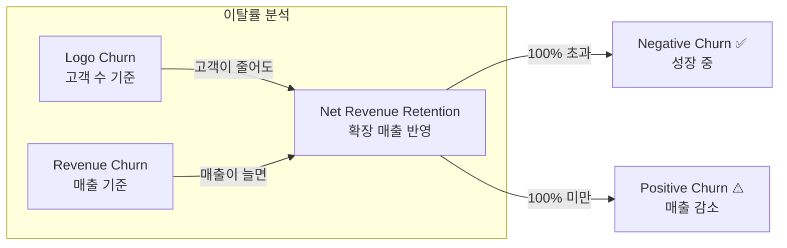
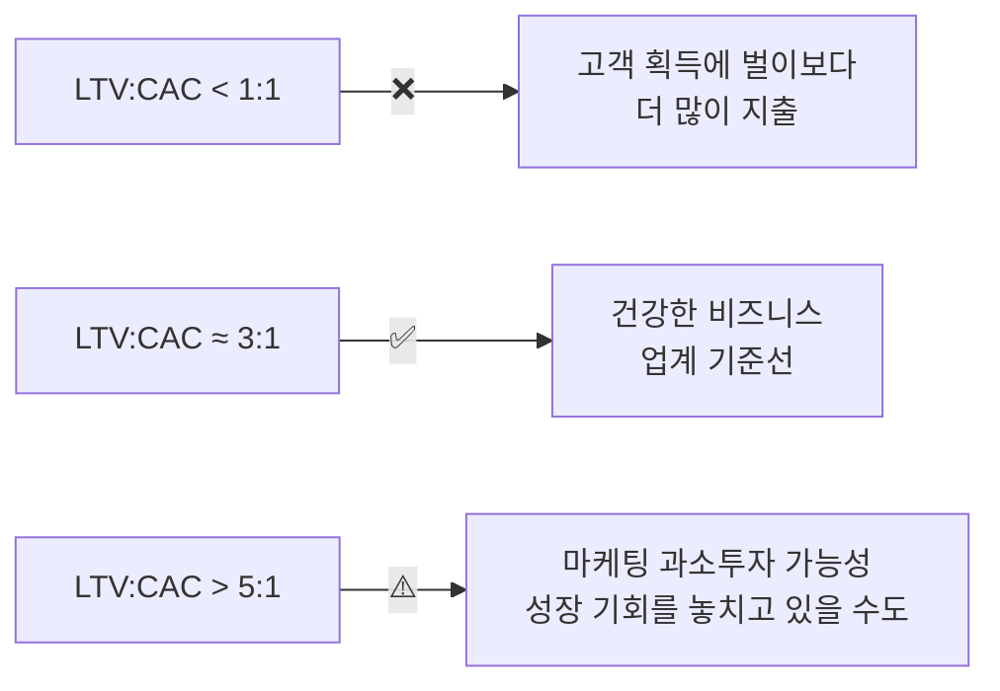
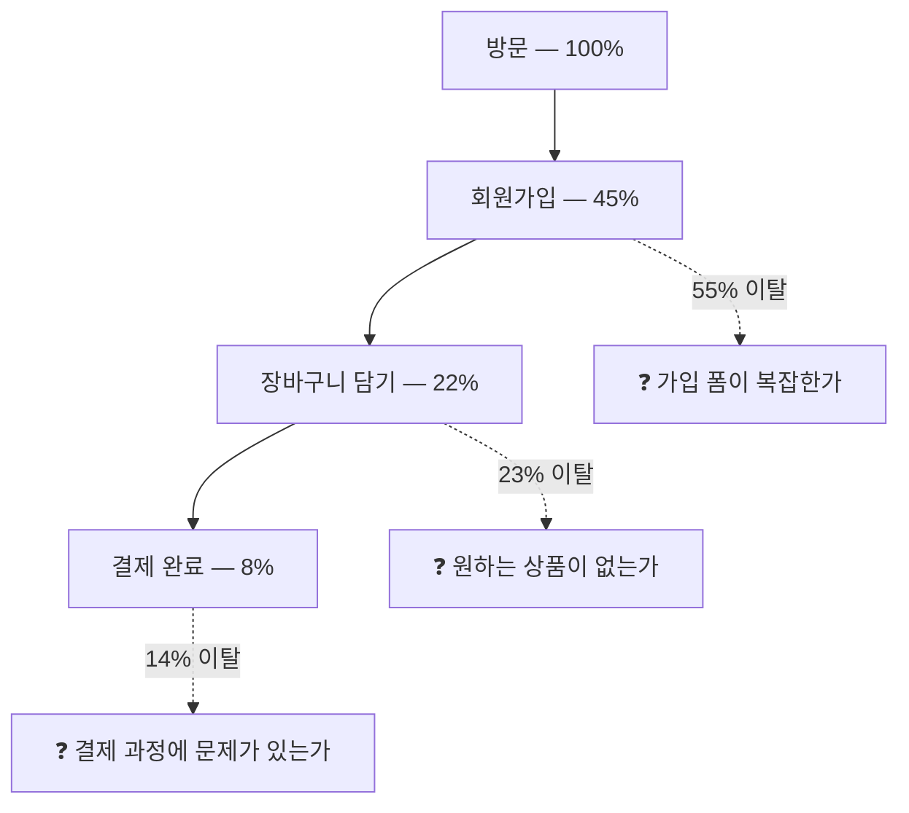
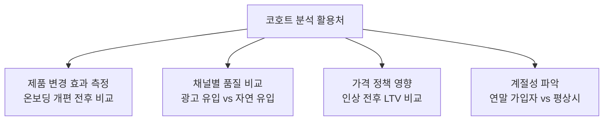
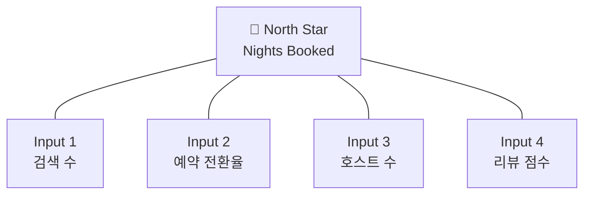
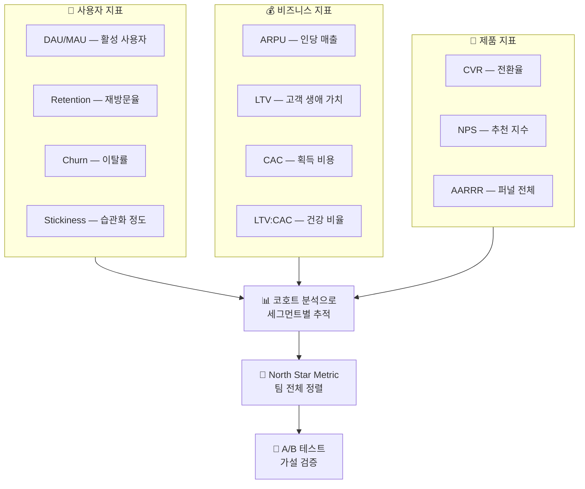

## 들어가며

데이터 엔지니어링을 하다 보면, 파이프라인을 만들고 데이터를 적재하는 것까지는 할 수 있는데 "그래서 이 데이터로 뭘 봐야 하는데?"라는 질문 앞에서 멈칫할 때가 있습니다. 저도 그랬습니다. 로그 데이터를 수십 테라바이트 쌓아놓고도, 정작 비즈니스 미팅에서 "우리 리텐션이 어떻게 되나요?"라는 질문에 바로 답을 못 한 적이 있거든요.

결국 데이터를 "잘 쌓는 것"과 "잘 보는 것"은 별개의 스킬이고, 후자의 핵심이 바로 지표 설계입니다. 이번 글에서는 데이터 분석에서 반드시 알아야 할 핵심 지표들을 정리하고, 각 지표를 실무에서 어떻게 활용하는지까지 파고들어 보겠습니다.

---

## 왜 지표 설계부터 해야 하는가

데이터는 넘쳐나는데 인사이트가 없다면, 문제는 데이터가 아니라 지표 설계가 빠져있을 가능성이 높습니다.

지표 없이 데이터만 쳐다보면 생기는 문제:

- **의사결정이 지연됩니다.** 어디를 고쳐야 할지 감이 잡히지 않아서, 회의만 반복하게 됩니다.
- **팀 간 방향이 어긋납니다.** 마케팅은 가입자 수를, 프로덕트는 사용 시간을, 경영진은 매출을 각자 보고 있으면, 같은 목표를 향해 달릴 수가 없습니다.
- **허수에 속습니다.** "가입자 500만"처럼 숫자만 크고 행동으로 이어지지 않는 *Vanity Metric(허영 지표)*에 빠지게 됩니다.

그래서 지표 설계의 핵심은 "측정 가능하고, 행동을 유도하며, 비교가 가능한" 지표를 고르는 것입니다.

| 구분 | Vanity Metric | Actionable Metric |
|---|---|---|
| 예시 | 총 가입자 수 500만 | 주간 활성 사용자 12만 |
| 문제/효과 | 숫자만 크고 다음 행동이 안 나옴 | 리텐션 전략 수립의 근거가 됨 |

Alistair Croll과 Ben Yoskovitz가 "Lean Analytics"(2013)에서 정리한 좋은 지표의 조건이 딱 이겁니다. **좋은 지표는 숫자가 아니라 행동을 바꿉니다.**

---

## 사용자 지표 — 서비스의 체온 재기

사용자가 얼마나 오고, 얼마나 머무는지. 서비스의 건강 상태를 가장 먼저 알려주는 지표들입니다.

### DAU / MAU — 서비스가 살아있는지 확인하는 첫 번째 신호

*DAU(Daily Active Users)*는 하루 동안 서비스를 사용한 고유 사용자 수, *MAU(Monthly Active Users)*는 한 달 동안의 고유 사용자 수입니다. "활성"의 기준은 서비스마다 다르게 정의해야 합니다. 로그인만 했는지, 핵심 기능을 사용했는지에 따라 수치가 완전히 달라지거든요.

### Stickiness (DAU/MAU) — 습관이 되었는가

```
Stickiness = DAU ÷ MAU × 100
```

월 사용자 중 매일 접속하는 비율입니다. 이 수치가 높을수록 사용자가 습관적으로 서비스를 쓰고 있다는 뜻입니다.

업계 벤치마크를 보면 감이 옵니다:

| 서비스 유형 | DAU/MAU 비율 | 출처 |
|---|---|---|
| Facebook (Meta) | ~66% | Meta 10-K Annual Report (SEC filing) |
| 소셜 미디어 평균 | 30~50% | Mixpanel 2017 Product Benchmarks |
| 일반 SaaS | 13~25% | Mixpanel 2017 Product Benchmarks |
| 캐주얼 게임 | 10~20% | 업계 통계 종합 |

50%를 넘기면 "world-class" 수준이라고 봅니다. 하지만 Andrew Chen(a16z 파트너)은 블로그에서 DAU/MAU 단일 숫자보다 일별 방문 빈도 분포(히스토그램)를 보는 게 더 유용하다고 지적합니다. 이걸 *Power User Curve*라고 부르는데, 한 달에 1~2번 오는 사용자와 매일 오는 사용자의 분포를 동시에 볼 수 있어서 평균의 함정을 피할 수 있습니다.

### 리텐션 (Retention Rate) — 다시 돌아오는가

리텐션은 특정 시점에 유입된 사용자가 이후에도 서비스를 계속 사용하는 비율입니다. 사실상 서비스의 생존을 결정짓는 지표입니다.

리텐션을 측정하는 방법은 하나가 아닙니다:

| 방식 | 설명 | 적합한 서비스 |
|---|---|---|
| Classic (N-day) | 가입 후 정확히 N일째에 돌아온 비율 | 모바일 앱, 게임 |
| Rolling (Unbounded) | 가입 후 N일 이후 아무 때나 돌아온 비율 | 장기 리텐션 평가 |
| Bracket (Range) | 특정 기간 범위 내(예: 7~14일) 돌아온 비율 | SaaS, 비일상적 서비스 |

모바일 앱 리텐션 벤치마크 (Adjust, AppsFlyer 보고서 기반):

| 시점 | 평균 | 상위 앱 |
|---|---|---|
| D1 (Day 1) | 25~30% | 40% 이상 |
| D7 | 10~15% | 20% 이상 |
| D30 | 5~8% | 15% 이상 |

SaaS의 경우 월간 리텐션 95~97%이면 양호하고, 엔터프라이즈 SaaS는 연간 리텐션 85~90%가 기준선입니다.

Brian Balfour(Reforge 창업자)가 정리한 프레임워크에 따르면, 리텐션 커브가 시간이 지나면서 수평으로 안정화(flatten)되면 *Product-Market Fit*의 신호이고, 계속 0을 향해 떨어지면 "leaky bucket" 상태입니다. 이 판단은 리텐션 커브 그래프 하나로 바로 할 수 있습니다.

### 이탈률 (Churn Rate) — 떠나는 속도

리텐션의 반대편입니다.

```
Churn Rate = 해당 기간 이탈 고객 수 ÷ 기간 시작 시 고객 수 × 100
```

여기서 흔히 간과하는 게 월간-연간 변환의 함정입니다:

```
연간 이탈률 = 1 - (1 - 월간 이탈률)^12

예시: 월간 이탈률 5%
연간 이탈률 = 1 - (1 - 0.05)^12 = 1 - 0.54 = 46%
```

월간 5%가 별것 아닌 것 같지만, 연간으로 환산하면 46%입니다. 1년 뒤 고객 절반이 사라진다는 뜻이에요. 이 복리 효과를 모르고 "월간 이탈률 5%면 괜찮지 않나?"라고 판단하면 큰 착각에 빠집니다.

SaaS 이탈률 벤치마크 (Bessemer Venture Partners, Baremetrics 데이터 기반):

| 세그먼트 | 월간 이탈률 | 연간 이탈률 |
|---|---|---|
| 엔터프라이즈 SaaS | 0.4~0.6% | 5~7% |
| Mid-market SaaS | 0.8~1.3% | 10~15% |
| SMB SaaS | 2.5~5% | 30~50% |
| B2C 구독 | 5~10% | 46~72% |

그리고 이탈률을 볼 때 *Logo Churn(고객 수 기준)*과 *Revenue Churn(매출 기준)*을 구분해야 합니다. 고객 수는 줄었는데 기존 고객이 더 많이 쓰고 있다면, 매출은 오히려 늘 수 있거든요. 이걸 *Net Revenue Retention(NRR)*이라 하는데, 100%를 넘으면 *Negative Churn* — 이탈보다 기존 고객의 확장 매출이 더 큰 상태입니다. Twilio, Snowflake 같은 회사는 NRR이 130%를 넘깁니다(S-1 filing 기준).



---

## 비즈니스 지표 — 돈의 흐름 읽기

서비스가 비즈니스로서 건강한지 보여주는 지표입니다. 수익, 비용, 고객 가치의 균형을 확인합니다.

### ARPU — 수익 구조의 기본 단위

*ARPU(Average Revenue Per User)*는 사용자 1인당 평균 매출입니다.

```
ARPU = 총 매출 ÷ 사용자 수
```

단순한 지표지만, 시간대별(월별, 분기별)로 추적하면 과금 모델 변경이나 가격 정책의 효과를 직접 볼 수 있습니다. 유료 사용자만 대상으로 하면 *ARPPU(Average Revenue Per Paying User)*가 되는데, Freemium 모델에서는 이 둘을 구분해서 봐야 합니다.

### LTV — 고객 한 명의 총 가치

*LTV(Lifetime Value)*는 한 고객이 서비스 이용 기간 동안 가져다주는 총 매출입니다.

#### Step 1: 단순 공식

```
LTV = ARPU ÷ Churn Rate

예시: 월 ARPU $50, 월 이탈률 5%
LTV = $50 ÷ 0.05 = $1,000
```

#### Step 2: 마진 반영 공식

실제로는 매출 전부가 이익이 아니므로 *Gross Margin(매출총이익률)*을 반영합니다:

```
LTV = (ARPU × Gross Margin) ÷ Churn Rate
```

#### Step 3: 할인율 반영 (DCF 방식)

미래 매출의 현재 가치를 계산하려면 할인율까지 넣습니다:

```
LTV = (ARPU × Gross Margin) ÷ (Churn Rate + Discount Rate)
```

Bill Gurley(Benchmark Capital)는 "The Dangerous Seduction of the LTV Formula"라는 글에서 LTV를 과신하는 위험성을 경고합니다. LTV 공식은 이탈률이 일정하다고 가정하지만, 현실에서는 경쟁 환경, 가격 변동, 시장 포화 등으로 이탈률이 바뀌기 때문입니다. LTV는 방향성을 잡는 지표로 쓰되, 절대 수치를 맹신하면 안 됩니다.

### CAC — 고객을 데려오는 비용

*CAC(Customer Acquisition Cost)*는 고객 한 명을 획득하는 데 드는 비용입니다.

```
CAC = (마케팅 비용 + 영업 비용) ÷ 신규 획득 고객 수
```

마케팅 인건비, 광고비, 영업 도구 비용 등을 전부 포함해야 정확합니다. 광고비만 넣고 "CAC가 낮다"고 착각하는 경우가 생각보다 많습니다.

### LTV:CAC 비율 — 비즈니스 건강 공식

David Skok(Matrix Partners)이 "SaaS Metrics 2.0"에서 정리한 기준이 업계 표준처럼 쓰입니다:



여기에 하나 더 봐야 할 것이 *CAC Payback Period(회수 기간)*입니다:

```
CAC Payback Period = CAC ÷ (월 ARPU × Gross Margin)
```

Bessemer Venture Partners의 기준: 12개월 이하면 양호, 18개월 이상이면 위험 신호입니다. 회수가 느리면 현금 흐름이 나빠지고, 다음 고객을 획득할 투자 여력이 줄어듭니다.

---

## 제품 지표 — 행동의 신호 읽기

사용자가 제품 안에서 어떻게 행동하는지 추적하면, 어디를 고쳐야 할지가 보입니다.

### 전환율 (Conversion Rate) — 퍼널 어디서 빠지는가

*전환율(Conversion Rate)*은 목표 행동을 완료한 비율입니다.

```
전환율 = 목표 행동 완료 수 ÷ 전체 방문/노출 수 × 100
```

E-commerce 전환율 벤치마크 (Contentsquare "Digital Experience Benchmarks Report" 기준):

| 카테고리 | 평균 전환율 |
|---|---|
| 식음료 | 4~5% |
| 패션/의류 | 1.5~2.5% |
| 전자제품 | 1~2% |
| 럭셔리 | 0.5~1% |
| 전체 평균 | 2~3% |

SaaS의 경우:

| 전환 유형 | 전환율 |
|---|---|
| Free Trial → Paid (Opt-in) | 15~25% |
| Free Trial → Paid (카드 필수) | 50~60% |
| Freemium → Paid | 2~5% |

전환율은 단독으로 보는 것보다 *퍼널(Funnel)*로 단계별 이탈을 추적해야 의미가 있습니다:



가장 큰 드랍이 있는 단계를 먼저 개선하는 것이 ROI가 가장 높습니다. Facebook이 초기에 발견한 유명한 사례가 있는데, "10일 내 7명의 친구를 추가"한 사용자의 리텐션이 극적으로 높았다고 합니다(Chamath Palihapitiya 발표). 이걸 *Aha Moment*라 부르는데, 이 순간까지의 시간을 줄이는 것이 Activation 단계의 핵심입니다.

### AARRR — 해적 지표 프레임워크

Dave McClure(500 Startups)가 2007년에 정리한 *AARRR 프레임워크(Pirate Metrics)*는 스타트업 메트릭의 기본 틀로 자리잡았습니다:


각 단계에서 핵심 지표 하나를 골라서 추적하면, "지금 우리가 어디서 막혀있는지"가 명확해집니다.

### NPS — 추천 의향 점수

*NPS(Net Promoter Score)*는 "이 서비스를 친구에게 추천하겠습니까?"라는 단일 질문으로 고객 충성도를 측정합니다. Fred Reichheld가 2003년에 제안하고 "The Ultimate Question 2.0"(2011)에서 체계화했습니다.

#### Step 1: 점수 수집

0~10점 스케일로 고객에게 추천 의향을 묻습니다.

#### Step 2: 그룹 분류

- **Promoters (추천자)**: 9~10점
- **Passives (중립)**: 7~8점
- **Detractors (비추천자)**: 0~6점

#### Step 3: NPS 계산

```
NPS = Promoters 비율(%) - Detractors 비율(%)
```

결과 범위는 -100에서 +100까지입니다.

**점수 해석** (Bain & Company 기준):

| 점수 범위 | 해석 |
|---|---|
| 0 이상 | 양호 |
| 20 이상 | 좋음 |
| 50 이상 | 매우 좋음 |
| 80 이상 | 세계 최고 수준 |

참고로 Apple은 약 72, Netflix는 약 68, Amazon은 약 62 수준입니다(Retently NPS Benchmarks 기준).

다만 NPS에 대한 비판도 만만치 않습니다. 단일 질문으로 고객 경험 전체를 대표할 수 있느냐는 의문(Jared Spool), 한국과 일본 사용자는 같은 만족도에서도 미국 사용자보다 낮은 점수를 주는 문화적 편향, 추천 의향과 실제 추천 행동의 괴리(Harvard Business Review, 2019) 등이 있습니다.

대안으로 *CES(Customer Effort Score)* — "이 문제를 해결하는 데 얼마나 쉬웠나?" — 가 있는데, Gartner 연구에서 고객 충성도와의 상관관계가 NPS보다 높게 나왔습니다. NPS 하나에 의존하기보다 CES, CSAT 등과 함께 삼각측량하는 게 실무적으로 더 안전합니다.

---

## 코호트 분석 — 집계의 함정을 피하는 법

여기까지 정리한 지표들을 전체 사용자에 대해 평균내면, 중요한 신호를 놓칠 수 있습니다. 이걸 해결하는 방법이 *코호트 분석(Cohort Analysis)*입니다.

### 코호트 분석이란

같은 시점에 특정 행동을 한 사용자 그룹(코호트)을 묶어서, 시간에 따른 행동 변화를 추적하는 분석 방법입니다. 가장 흔한 기준은 "가입 시기"입니다.

### 왜 집계 지표만으로는 부족한가

전체 리텐션이 올라가는 것처럼 보여도, 실제로는 최근 코호트의 리텐션이 떨어지고 있고 초기 충성 사용자들이 수치를 끌어올리고 있을 수 있습니다. 통계학에서 *심슨의 역설(Simpson's Paradox)*이라 부르는 현상입니다. 코호트별로 나눠 보면 이런 착시를 피할 수 있습니다.

### 코호트 테이블 읽는 법

```
         Month 0  Month 1  Month 2  Month 3  Month 4
1월 코호트  100%     40%      30%      25%      22%
2월 코호트  100%     45%      33%      28%       -
3월 코호트  100%     50%      38%       -        -
4월 코호트  100%     52%       -        -        -
```

- **세로로 읽으면**: 한 코호트가 시간이 지나면서 어떻게 변하는지
- **대각선으로 비교하면**: 같은 경과 시점(Month 1)에서 코호트별 차이

위 예시에서 Month 1 리텐션이 40% → 45% → 50% → 52%로 코호트가 갈수록 개선되고 있습니다. 제품 개선이 실제로 효과를 내고 있다는 근거입니다.



Amplitude, Mixpanel, Google Analytics 4 모두 코호트 분석 기능을 기본 제공합니다. SQL로 직접 만들려면 가입일 기준 GROUP BY 후 기간별 활성 여부를 JOIN하면 됩니다.

---

## North Star Metric — 팀 전체를 정렬하는 나침반

지표가 너무 많으면 오히려 방향을 잃습니다. 그래서 나온 개념이 *North Star Metric* — 팀 전체가 집중하는 단 하나의 핵심 지표입니다.

### 기업별 North Star Metric 사례

| 기업 | North Star Metric | 선정 이유 |
|---|---|---|
| Airbnb | Nights Booked (숙박 예약 수) | 호스트와 게스트 양쪽의 가치를 동시에 반영 |
| Spotify | Time Spent Listening (청취 시간) | 사용자 engagement의 직접 지표 |
| Facebook | DAU (일일 활성 사용자) | 광고 모델에서 사용자 수 = 매출 |
| Slack | 2개 이상 채널에서 메시지를 보낸 DAU | 팀 내 실질적 활성 사용의 척도 |
| Uber | Rides per Week (주간 탑승 수) | 양면 마켓플레이스의 거래량 |
| Shopify | GMV (Gross Merchandise Volume) | 상점 성장 = 플랫폼 성장 |

### 좋은 North Star를 고르는 기준

Sean Ellis & Morgan Brown이 "Hacking Growth"(2017)에서, 그리고 Amplitude가 "North Star Playbook"(amplitude.com/north-star)에서 정리한 기준:

1. **고객에게 전달되는 핵심 가치를 반영**해야 합니다. 매출이 아니라 가치입니다.
2. **제품 비전과 전략을 대표**해야 합니다.
3. **선행 지표(leading indicator)**여야 합니다. 매출은 후행 지표입니다.
4. **팀이 직접 영향을 줄 수 있어야** 합니다.
5. **측정 가능**해야 합니다.

매출(Revenue)을 North Star로 잡는 건 흔한 실수입니다. 매출은 여러 요인의 결과이지, 팀이 직접 움직일 수 있는 지표가 아닙니다.

Amplitude의 프레임워크에서는 North Star Metric 1개에 *Input Metrics* 3~5개를 붙입니다. 예를 들어 Airbnb의 경우:



각 팀이 자기 담당 Input Metric을 개선하면, 그 효과가 North Star로 올라가는 구조입니다.

---

## 지표와 실험의 연결 — A/B 테스트

지표를 정했으면, "이 변경이 지표를 실제로 개선하는가?"를 검증해야 합니다. 그게 A/B 테스트입니다.

### 기본 구조


### 통계적 유의성 기초

- **p-value < 0.05**: "이 차이가 우연일 확률이 5% 미만이다"는 뜻으로, 업계 관행상 유의미하다고 봅니다.
- **샘플 사이즈**: 작은 차이를 감지하려면 수천~수만 명 단위의 샘플이 필요합니다.
- **MDE(Minimum Detectable Effect)**: 감지하고자 하는 최소 효과 크기. MDE가 작을수록 더 큰 샘플이 필요합니다.

### 실무에서 자주 하는 실수

실험 설계에서 가장 자주 빠지는 함정들입니다:

1. **조기 종료 (Peeking Problem)**: 며칠 만에 결과를 보고 테스트를 끝내는 것. p-value가 안정되기 전에 판단하면 잘못된 결론을 내릴 확률이 높습니다. Evan Miller의 "How Not To Run an A/B Test"(evanmiller.org)에서 이 문제를 잘 다루고 있습니다.
2. **Novelty Effect**: 변경 직후에는 호기심 때문에 수치가 높게 나오지만, 시간이 지나면 원래 수준으로 돌아갑니다. 최소 2주 이상 돌려야 합니다.
3. **다중 비교 문제**: 여러 메트릭을 동시에 보면 하나쯤은 우연히 유의미하게 나올 수 있습니다.

그리고 중요한 개념이 *Guardrail Metrics(가드레일 지표)*입니다. Primary Metric만 보면 위험할 수 있습니다. 전환율은 올랐는데 이탈률도 같이 올랐다면? Guardrail Metric은 "이 수치가 나빠지면 실험을 중단한다"는 안전장치입니다. Ron Kohavi의 "Trustworthy Online Controlled Experiments"(2020)가 이 분야의 바이블로, Microsoft에서 수천 건의 실험 경험을 기반으로 쓴 책입니다.

---

## 정리

이번 글에서 다룬 핵심 지표를 한 장으로 모으면:



지표는 대시보드에 올려두고 끝나는 게 아닙니다. **가설 → 지표 → 실험 → 판단** 사이클로 돌려야 비로소 가치가 있습니다. 데이터 엔지니어로서 파이프라인을 만들 때도, "이 데이터가 결국 어떤 지표에 쓰일 것인가?"를 먼저 생각하면 설계 자체가 달라집니다.

---

## 추가로 공부하면 좋을 개념

이 주제를 더 깊이 파고들고 싶다면:

- **Product Analytics 도구 실습**: Amplitude, Mixpanel으로 직접 리텐션 커브와 코호트 테이블을 만들어보면 이론이 체감됩니다.
- **SQL로 지표 계산**: 위 지표들을 SQL 쿼리로 직접 뽑아보는 연습. 특히 코호트 리텐션 쿼리는 윈도우 함수(Window Function) 실력도 함께 늘려줍니다.
- **실험 설계 (Experiment Design)**: Ron Kohavi의 책이 부담스러우면 Statsig 블로그(statsig.com)에서 실무 사례 중심으로 가볍게 시작할 수 있습니다.
- **지표 프레임워크 비교**: AARRR 외에도 HEART(Google), PULSE, Lean Analytics Stage 등 다양한 프레임워크가 있습니다.

---

## 레퍼런스

이 글을 작성하면서 참고한 자료를 정리합니다.

**원본 콘텐츠:**
- 현수IT · @hyunsoo.it, "데이터 분석 시 필수 지표 총정리", [LinkedIn 원문](https://www.linkedin.com/posts/hyunsoo-ryan-lee_%EB%8D%B0%EC%9D%B4%ED%84%B0%EB%A5%BC-%EB%B6%84%EC%84%9D%ED%95%98%EB%8A%94%EB%8D%B0-%EC%96%B4%EB%96%A4-%EC%A7%80%ED%91%9C%EB%A5%BC-%EB%B4%90%EC%95%BC-%ED%95%A0%EC%A7%80-%EB%AA%A8%EB%A5%B4%EA%B2%A0%EB%8B%A4%EB%A9%B4-%EB%8D%B0%EC%9D%B4%ED%84%B0-ugcPost-7450479720531517440-sfLy)

**서적:**
- Alistair Croll & Ben Yoskovitz, *Lean Analytics* (2013) — 스타트업 메트릭 전반
- Sean Ellis & Morgan Brown, *Hacking Growth* (2017) — North Star Metric, 실험 문화
- Fred Reichheld, *The Ultimate Question 2.0* (2011) — NPS 원저
- Ron Kohavi et al., *Trustworthy Online Controlled Experiments* (2020) — A/B 테스트의 바이블
- Dan Olsen, *The Lean Product Playbook* — 코호트 분석 챕터

**온라인 자료 & 보고서:**
- David Skok, "SaaS Metrics 2.0" (forEntrepreneurs.com) — SaaS 지표의 정석
- Andrew Chen, "The Power User Curve" (andrewchen.com) — DAU/MAU 대안 분석
- Bill Gurley, "The Dangerous Seduction of the LTV Formula" (abovethecrowd.com) — LTV 과신 경고
- Evan Miller, "How Not To Run an A/B Test" (evanmiller.org) — A/B 테스트 함정
- Jared Spool, "Net Promoter Score Considered Harmful" — NPS 비판
- Dave McClure, "Startup Metrics for Pirates" (2007, SlideShare) — AARRR 프레임워크
- Amplitude, "North Star Playbook" (amplitude.com/north-star)
- Brian Balfour, Reforge "Retention" 시리즈 (brianbalfour.com)
- Lenny Rachitsky Newsletter (lennysnewsletter.com) — 벤치마크 데이터

**벤치마크 데이터:**
- Meta Platforms 10-K Annual Report (SEC filing) — Facebook DAU/MAU
- Mixpanel, "2017 Product Benchmarks Report"
- Amplitude, "2020 Product Report"
- Adjust, "Mobile App Trends" 연간 보고서
- Contentsquare, "Digital Experience Benchmarks Report"
- Bessemer Venture Partners, "Cloud Index"
- Baremetrics, "Open Benchmarks" (baremetrics.com)
- Retently, "NPS Benchmarks" (retently.com)
- Twilio, Snowflake S-1 Filing — NRR 데이터
