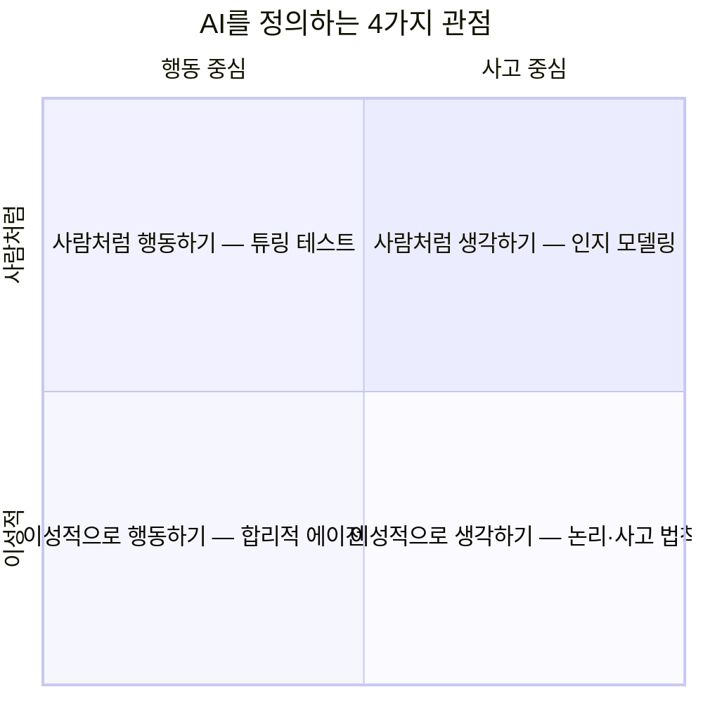
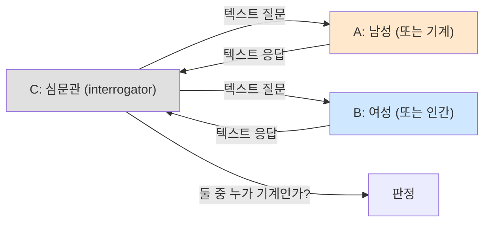
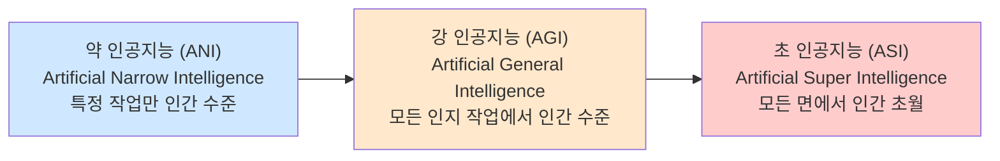
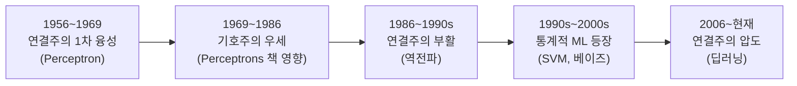
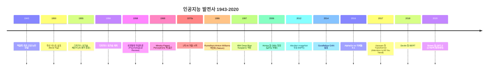
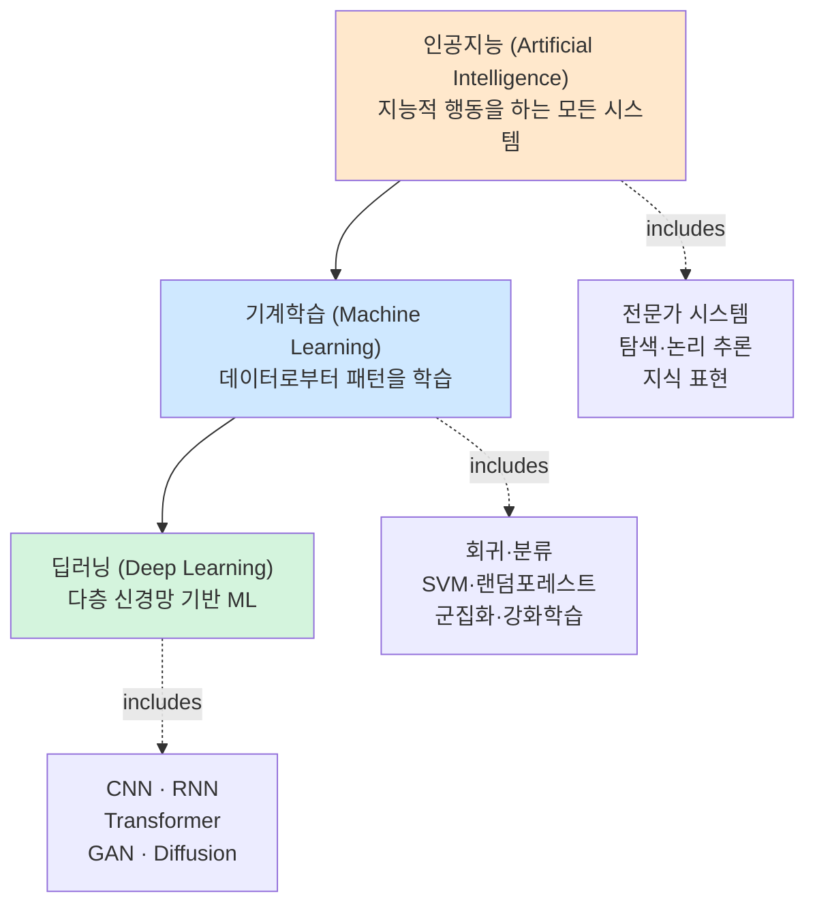
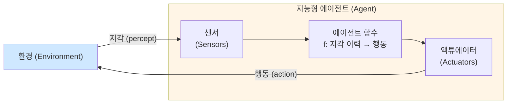
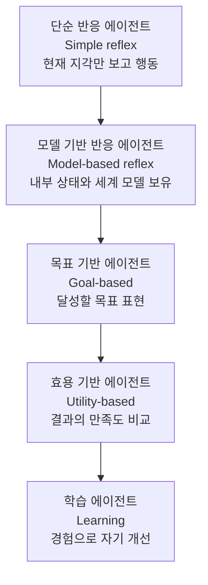

> **이 글의 목적**
>
> 인공지능이라는 용어를 처음 접하는 사람부터 KODIT 필기를 준비하는 사람까지, **한 번에 토대를 잡을 수 있도록** 정리한 글이다.
> 학습노트나 블로그 요약본에 의존하지 않고, **튜링·맥카시·러멜하트·힌튼 등의 원전 논문**과 *Russell & Norvig*의 *Artificial Intelligence: A Modern Approach* (이하 **AIMA**)를 1차 자료로 참고했다.
>
> **읽고 나면 답할 수 있는 질문**:
>
> - 인공지능을 어떻게 정의하는가? (왜 한 가지 정의가 아닌가)
> - 튜링 테스트는 정확히 무엇이고, 한계는 무엇인가
> - "약AI / 강AI"와 "사람처럼 vs 이성적으로"는 다른 분류인가
> - 기호주의·연결주의는 왜 번갈아 흥하고 망했는가
> - 인공지능, 기계학습, 딥러닝의 관계
> - "지능형 에이전트"는 단순히 "AI 모델"과 어떻게 다른가

---

## 1. 인공지능의 정의: 한 가지가 아니다

### 1.1 가장 흔한 정의 — McCarthy(1956)

> *"the science and engineering of making intelligent machines"*
> — John McCarthy, 다트머스 워크숍 제안서[^1]

이 정의가 인공지능 분야의 출발점이다. 그러나 *"intelligent machines"*가 무엇인지는 정의 안에 들어 있지 않다. 그래서 후속 학자들은 *"무엇을 흉내 내야 지능적인가"* 를 두고 갈라진다.

### 1.2 AIMA의 4가지 정의 매트릭스

Stuart Russell과 Peter Norvig은 교과서 *AIMA*에서 AI 정의를 **2축 × 2축 매트릭스**로 정리했다[^2]. KODIT 시험에서 거의 확정 출제되는 분류이므로 외워두는 것이 좋다.

|  | **사고(thinking)에 집중** | **행동(acting)에 집중** |
|---|---|---|
| **사람처럼(human-like)** | 사람처럼 **생각하는** 시스템 — 인지 모델링 | 사람처럼 **행동하는** 시스템 — **튜링 테스트** |
| **이성적으로(rational)** | 이성적으로 **생각하는** 시스템 — 사고 법칙(논리) | 이성적으로 **행동하는** 시스템 — **합리적 에이전트** |

각 칸의 의미:

- **사람처럼 생각하는 시스템**: 인간의 사고 과정을 모델링 (인지과학·뇌과학)
- **사람처럼 행동하는 시스템**: 결과적으로 인간 같은 출력 (튜링 테스트가 대표)
- **이성적으로 생각하는 시스템**: 논리적으로 옳은 추론 (전통 기호주의 AI)
- **이성적으로 행동하는 시스템**: 목표 달성을 위해 최적의 행동을 선택하는 에이전트 — *AIMA* 자체의 입장

> 💡 **AIMA의 입장**: 현대 AI 연구의 주된 방향은 "이성적으로 행동하는 합리적 에이전트(rational agent)" 관점이다. 사람처럼 생각하는 것을 흉내 내려는 시도는 인지과학에 가깝다.

---

## 2. 튜링 테스트(1950): 가장 자주 인용되는, 그러나 자주 오해되는

### 2.1 원전: Turing, "Computing Machinery and Intelligence"

- **출처**: Alan M. Turing, *"Computing Machinery and Intelligence"*, **Mind**, vol. LIX, no. 236, pp. 433–460, **October 1950**[^3]

이 논문은 *"Can machines think?"* 라는 질문으로 시작한다. 튜링은 이 질문이 모호하다며, 대신 **모방 게임(Imitation Game)** 이라는 절차적 테스트로 대체할 것을 제안한다.

### 2.2 원래 모방 게임의 구성

원논문 §1에 따르면, 모방 게임은 사실 **세 명**이 등장하는 게임이다:

- 심문관 C는 A와 B를 보지 못하고, 오직 **텍스트** 로만 대화한다
- C의 목표는 "누가 인간이고 누가 기계인가"를 구별하는 것
- 만약 기계가 **사람만큼 자주 C를 속일 수 있다면**, 그 기계는 사고할 수 있다고 봐야 한다

### 2.3 자주 오해되는 점

| 오해 | 사실 |
|---|---|
| "튜링 테스트는 AI의 명확한 통과 기준이다" | 튜링은 **30%의 심문관을 속이면 통과**라고만 막연히 추정. 절대적 기준이 아님 |
| "튜링은 2000년경 통과 가능을 단언했다" | 원문은 *"about 50 years"* 라는 추측을 제시했을 뿐 |
| "튜링 테스트 = 지능의 정의" | 튜링은 *"think"* 라는 단어 자체의 의미를 정의하려 한 것이 아님. 측정 가능한 대체 질문을 제안 |

### 2.4 비판: 중국어 방 논증(Searle, 1980)

철학자 John Searle은 *"Minds, Brains, and Programs"* (1980)에서 **중국어 방 사고실험** 을 통해 튜링 테스트를 비판했다[^4]. 한 사람이 중국어 매뉴얼만 따라 메시지에 응답해도 외부인은 "이 사람이 중국어를 안다"고 판단할 수 있지만, 정작 그 사람은 중국어를 *이해* 하지 못한다는 논증이다. 즉 튜링 테스트는 **흉내 능력**을 평가할 뿐, **이해 능력**을 평가하지 못한다는 것.

> 🎯 **시험 포인트**: 튜링 테스트는 1950년 *Mind* 저널 발표. 텍스트 채널 대화. 모방 게임이라는 별칭. 약점은 "이해 없는 흉내" 가능성.

---

## 3. AI 능력 분류: 약 / 강 / 초

이 분류는 **"AI가 무엇을 할 수 있는가"** 의 능력 기준이다. §1.2의 4분 매트릭스(접근 방식 기준)와 **혼동하지 말 것**.

| 단계 | 영문 | 정의 | 현재 상태 | 사례 |
|---|---|---|---|---|
| 약 AI | ANI / Weak AI | 좁은 도메인(이미지 인식·번역·바둑 등)에서만 작동 | **현재의 모든 상용 AI**가 여기 해당 | AlphaGo, GPT-4, Siri, 자율주행 |
| 강 AI | AGI / Strong AI | 인간 수준의 일반 지능. 새 도메인에 자율 적응 | **아직 미달성** (학계 합의) | (가상) 영화 *Her*, *2001 스페이스 오디세이*의 HAL 9000 |
| 초 AI | ASI / Super AI | 모든 면에서 인간을 초월 | 가상 개념 | 가상 (*Bostrom, 2014*에서 분석)[^5] |

> ⚠️ **GPT는 강 AI인가?** — **아니다, 약 AI다.**
> 학계에서는 GPT 계열의 LLM이 *일반화 능력의 초기 형태*를 보여줄 수는 있어도 **AGI의 정의(자율적인 새 도메인 적응)** 를 충족하지 않는다고 본다. OpenAI는 자사 모델을 "약 AI에서 AGI로 가는 도중"이라고 표현한다.

---

## 4. 기호주의 vs 연결주의: AI의 두 영혼

### 4.1 두 패러다임 비교

| 구분 | 기호주의 (Symbolism, GOFAI) | 연결주의 (Connectionism) |
|---|---|---|
| **기본 가정** | 지능은 **기호 조작**으로 환원 가능 | 지능은 **단순 단위(뉴런)의 연결망**에서 창발 |
| **표현 방식** | 명시적 규칙, 논리, 지식 베이스 | 가중치 행렬, 활성화 패턴 |
| **추론** | 연역·논리적 추론 | 통계적·분산적 표현 |
| **장점** | 설명 가능, 명확한 추론 경로 | 패턴 인식, 비정형 데이터 |
| **단점** | 실세계 복잡성·예외 처리 한계 | 블랙박스, 해석 어려움 |
| **대표 인물** | McCarthy, Minsky (초기), Newell, Simon | Rosenblatt, Hinton, LeCun, Bengio |
| **대표 응용** | 전문가 시스템, 정리 증명, 체스 | 이미지·음성 인식, LLM |

### 4.2 두 패러다임의 흥망 곡선

> 💡 두 패러다임은 **대립이 아니라 보완** 관계로 가고 있다. 최근 *Neuro-Symbolic AI* 라는 이름으로, 딥러닝의 패턴 인식 + 기호주의의 추론을 결합하려는 연구가 활발하다.

---

## 5. AI 발전사: 검증된 핵심 이정표

학습노트나 블로그에 흔히 도는 연표는 연도 오류가 잦다. 아래 표는 **각 항목의 원전 논문 또는 1차 보도자료를 직접 확인한 결과**다.

### 5.1 발전사 타임라인 (검증본)

### 5.2 핵심 사건 정리 (출처 포함)

| 연도 | 사건 | 인물 / 기관 | 1차 출처 |
|---|---|---|---|
| **1943** | 인공 뉴런(MCP 뉴런) 수학적 모델 | McCulloch & Pitts | *Bull. Math. Biophys.* 5, 115–133 [^6] |
| **1950** | 튜링 테스트 제안 | Alan Turing | *Mind* LIX(236), 433–460 [^3] |
| **1955-08-31** | "AI" 용어 등장 | McCarthy, Minsky, Rochester, Shannon | 다트머스 워크숍 제안서[^1] |
| **1956 (6월~8월)** | 다트머스 워크숍 개최 | 약 20명 (Newell, Simon, Solomonoff 등) | (제안서 §6 참조) |
| **1958** | 퍼셉트론 모델 | Frank Rosenblatt | *Psychological Review* 65(6), 386–408 [^7] |
| **1969** | *Perceptrons* 출간 (단층 퍼셉트론의 한계 증명) | Minsky & Papert | MIT Press [^8] |
| **1986** | 역전파(backpropagation) 알고리즘 | Rumelhart, Hinton, Williams | *Nature* 323, 533–536 [^9] |
| **1997-05-11** | Deep Blue, Kasparov 격파 (3½–2½) | IBM | IBM Research[^10] |
| **2006** | DBN(deep belief net) — 사실상 딥러닝 부활의 신호탄 | Hinton, Osindero, Teh | *Neural Computation* 18(7), 1527–1554 [^11] |
| **2006** | 깊은 오토인코더 (RBM 사전학습) | Hinton & Salakhutdinov | *Science* 313(5786), 504–507 [^12] |
| **2012** | AlexNet, ImageNet 우승 (top-5 오류 15.3%) | Krizhevsky, Sutskever, Hinton | NIPS 2012 [^13] |
| **2014-06-10** | GAN 제안 | Goodfellow et al. | arXiv:1406.2661 [^14] |
| **2016-01-28** | AlphaGo *Nature* 논문 | Silver et al. | *Nature* 529, 484–489 [^15] |
| **2016-03-09~15** | AlphaGo vs 이세돌 (4–1) | DeepMind | DeepMind 공식 발표 |
| **2017-06-12** | Transformer | Vaswani et al. | NIPS 2017 / arXiv:1706.03762 [^16] |
| **2018-10** | BERT | Devlin et al. | NAACL 2019 / arXiv:1810.04805 [^17] |
| **2020-05** | GPT-3 (175B 파라미터) | Brown et al. | NeurIPS 2020 / arXiv:2005.14165 [^18] |

### 5.3 흔한 오류 — 학습노트와 블로그에서 자주 보이는 잘못된 진술

> 본인 학습 자료(학습노트 PDF)에서도 일부 오류가 발견되어 정정한다.

| 흔한 진술 | 실제 사실 |
|---|---|
| "힌튼이 2004년에 DBN으로 딥러닝 부활" | **2006년** *Neural Computation*에 발표 |
| "AlexNet이 GPU를 사용한 최초의 CNN" | 2011년 IDSIA의 Cireşan et al.이 GPU에서 다중 컬럼 CNN을 먼저 발표[^19] |
| "Minsky·Papert가 직접 1차 AI 겨울을 일으켰다" | 신경망 연구 침체와 시기적으로 맞물렸으나, *직접* 인과관계라기보다는 **이미 침체되던 흐름을 굳혔다**는 평가가 정확[^8] |
| "GPT-3 = ChatGPT" | GPT-3 논문은 2020년 5월. ChatGPT 공개 서비스는 2022년 11월 (모델은 GPT-3.5) |

---

## 6. 인공지능 ⊃ 기계학습 ⊃ 딥러닝

용어가 자주 혼용되지만 **포함 관계**다.

### 6.1 Tom Mitchell의 기계학습 정의 (1997, 가장 자주 인용됨)[^20]

> *"A computer program is said to learn from **experience E** with respect to some **task T** and **performance measure P**, if its performance at tasks in T, as measured by P, **improves with experience E**."*

→ 한 줄 요약: **경험 E를 통해 작업 T에 대한 성능 P가 향상되는 시스템**

### 6.2 기계학습 3대 패러다임

| 종류 | 학습 신호 | 데이터 형태 | 대표 알고리즘 | 예시 |
|---|---|---|---|---|
| **지도학습** (Supervised) | 정답 레이블 | (입력, 정답) 쌍 | 선형/로지스틱 회귀, SVM, 신경망, 랜덤포레스트 | 스팸 분류, 가격 예측 |
| **비지도학습** (Unsupervised) | 레이블 없음 | 입력만 | k-means, PCA, GAN, 오토인코더 | 군집화, 차원 축소, 이상 탐지 |
| **강화학습** (Reinforcement) | 보상 신호 | 환경과의 상호작용 | Q-learning, Policy Gradient | AlphaGo, 자율주행, 로봇 제어 |

> 💡 **추가**: 최근에는 **자기지도학습(self-supervised)** 이 별도 범주로 다뤄진다. BERT, GPT 등 LLM이 이 방식으로 학습한다 — 데이터에서 일부를 가리고 그 부분을 맞추도록 하므로 외부 레이블 없이 지도학습 형태가 가능.

---

## 7. 지능형 에이전트 (Intelligent Agent)

AIMA가 강조하는 핵심 추상화. AI를 *"환경과 상호작용하며 합리적으로 행동하는 실체"* 로 보는 관점이다.

### 7.1 에이전트-환경 상호작용

핵심:

- 에이전트 = **(센서 + 에이전트 함수 + 액튜에이터)** 의 결합
- 에이전트 함수 *f*: 지금까지의 **지각 이력(percept sequence)** → **다음 행동**
- 합리적 에이전트는 *"기대되는 성능 측도(performance measure)를 최대화하는 행동을 선택"*[^2]

### 7.2 PEAS 프레임워크: 에이전트 설계의 시작

새 AI 시스템을 설계할 때 가장 먼저 정해야 할 4가지 — *AIMA* §2.3:

| 약자 | 의미 | 자율주행차 예시 |
|---|---|---|
| **P** — Performance measure | 성능 측도 | 안전, 빠른 도착, 승객 편의, 연료 효율 |
| **E** — Environment | 환경 | 도로, 교통, 보행자, 날씨 |
| **A** — Actuators | 액튜에이터 | 가속·제동·조향, 신호, 디스플레이 |
| **S** — Sensors | 센서 | 카메라, LiDAR, GPS, 속도계 |

### 7.3 환경의 6가지 분류 (시험 단골)

| 분류 축 | 옵션 1 | 옵션 2 | 핵심 차이 |
|---|---|---|---|
| **관측 가능성** | 완전 관측 (fully observable) | 부분 관측 (partially observable) | 센서가 환경 전체 상태를 알 수 있는가 |
| **결정성** | 결정론적 (deterministic) | 확률적 (stochastic) | 같은 행동이 같은 결과를 보장하는가 |
| **에피소드성** | 에피소드형 (episodic) | 순차형 (sequential) | 현재 행동이 미래에 영향을 주는가 |
| **시간 변화** | 정적 (static) | 동적 (dynamic) | 에이전트가 행동하는 동안 환경이 변하는가 |
| **상태 공간** | 이산 (discrete) | 연속 (continuous) | 상태/행동이 셀 수 있는가 |
| **에이전트 수** | 단일 (single-agent) | 다중 (multi-agent) | 다른 에이전트와 상호작용하는가 |

> 💡 자율주행은 **부분 관측 · 확률적 · 순차 · 동적 · 연속 · 다중 에이전트** 환경. 가장 어려운 조합.

### 7.4 에이전트 종류 (AIMA §2.4)

순서대로 갈수록 **유연성**과 **자율성**이 증가한다. 최신 AI 시스템은 대부분 **학습 에이전트** 범주에 속한다.

---

## 8. 헷갈리는 것 / 자주 묻는 질문

### Q1. "AGI가 가능한가?" 학계의 입장은?

**답**: 합의된 입장은 없다. 크게 세 진영:

- **낙관**: Hinton, Bengio, Sutskever — *"수년~수십 년 내"*
- **회의**: LeCun, Marcus — *"현재 LLM은 진짜 일반 지능이 아님"*
- **위험 강조**: Bostrom, Russell — *"가능 여부보다 정렬 문제가 우선"*

KODIT 시험에는 *"학계의 단일 합의는 없다"* 가 정답.

### Q2. "튜링 테스트를 통과한 AI가 있는가?"

- **공식적으로는 없다**. 2014년 영국 University of Reading의 *Eugene Goostman* 챗봇이 30% 통과 주장이 있었으나, 학계는 **"제한된 조건 + 어린이를 흉내낸 트릭"** 이라며 통과로 인정하지 않는 분위기다[^21]
- ChatGPT/GPT-4 등은 일대일 비공식 대화에서 자주 통과하지만, 표준화된 튜링 테스트는 진행되지 않았다

### Q3. "기계학습 ≠ 통계학"인가?

- **거의 같은 도구를 다르게 부른다**. 회귀, 베이즈 추정 등은 통계학에서 출발
- 차이는 *목표*: 통계는 **모델 해석과 추론**, 기계학습은 **예측 성능**
- 최근에는 두 분야가 사실상 통합 — 예: *Statistical Learning Theory*[^22]

### Q4. "딥러닝과 신경망은 같은 말인가?"

- 딥러닝 ⊊ 인공신경망
- 단층 신경망(퍼셉트론, 1958)은 신경망이지만 딥러닝이 아님
- *"deep"* 의 임계는 보통 **은닉층 2개 이상**이지만 명확한 학계 합의는 없음

### Q5. "기호주의는 죽은 분야인가?"

- 아니다. 정리 증명, 형식 검증, 데이터베이스 추론, 지식 그래프 등에서 여전히 사용
- 현재는 *Neuro-Symbolic AI* 로 딥러닝과 결합하는 방향으로 부활 중[^23]

---

## 9. 시험 직전 1분 요약

> A4 한 장에 들어가는 압축본. 입실 직전 빠르게 보기 좋다.

### 핵심 5

1. **AI 정의** — 1956 다트머스 워크숍에서 McCarthy가 명명. AIMA의 4분 매트릭스 (사람처럼 vs 이성적으로) × (생각 vs 행동)
2. **튜링 테스트** — 1950, *Mind* 저널. **모방 게임(Imitation Game)** 이라는 텍스트 채널 시뮬레이션
3. **AI 능력 분류** — 약(ANI) / 강(AGI) / 초(ASI). 현재는 **모두 약AI**
4. **AI ⊃ ML ⊃ DL** — 포함 관계. ML 패러다임은 지도/비지도/강화 (+자기지도)
5. **합리적 에이전트** — AIMA의 핵심. 센서 + 에이전트 함수 + 액튜에이터. PEAS로 정의

### 인물·연도·이벤트 12개

| 항목 | 핵심 |
|---|---|
| 1943 McCulloch & Pitts | 인공 뉴런 수학 모델 |
| 1950 Turing | 튜링 테스트 (*Mind*) |
| 1955~56 McCarthy | "AI" 용어 + 다트머스 워크숍 |
| 1958 Rosenblatt | 퍼셉트론 (*Psychological Review*) |
| 1969 Minsky & Papert | *Perceptrons* — 단층 한계 |
| 1986 Rumelhart-Hinton-Williams | 역전파 (*Nature*) |
| 1997 IBM Deep Blue | Kasparov 격파 (3½–2½) |
| 2006 Hinton et al. | DBN, 딥러닝 부활 |
| 2012 Krizhevsky et al. | AlexNet, ImageNet 우승 |
| 2014 Goodfellow | GAN 등장 |
| 2016 DeepMind | AlphaGo vs 이세돌 (4–1) |
| 2017 Vaswani et al. | Transformer (*Attention Is All You Need*) |

### 4분 매트릭스 (가장 자주 출제)

|  | **생각** | **행동** |
|---|---|---|
| **사람처럼** | 인지 모델링 | **튜링 테스트** |
| **이성적으로** | 사고 법칙 (논리) | **합리적 에이전트** |

---

## 10. 다음 학습

이 글은 *"지도(map)"* 다. 다음 포스트에서 각 주제의 깊이로 들어간다:

- 📌 **[AI개론 ②] 탐색 알고리즘**: BFS / DFS / UCS / A* / 미니맥스
- 📌 **[AI개론 ③] 지식 표현과 추론**: 명제·술어 논리 / 시맨틱 네트워크 / 베이즈 네트워크
- 📌 **[AI개론 ④] 현대 AI**: NLP·CV·LLM·생성 모델

---

## 11. 참고 문헌 (References)

[^1]: McCarthy, J., Minsky, M., Rochester, N., & Shannon, C. E. (1955). *A Proposal for the Dartmouth Summer Research Project on Artificial Intelligence*. (Reprinted in *AI Magazine*, 27(4), 12–14, 2006.) [DOI: 10.1609/aimag.v27i4.1904](https://ojs.aaai.org/aimagazine/index.php/aimagazine/article/view/1904)

[^2]: Russell, S. J., & Norvig, P. (2020). *Artificial Intelligence: A Modern Approach* (4th ed.). Pearson. (특히 Ch. 1 "Introduction", Ch. 2 "Intelligent Agents")

[^3]: Turing, A. M. (1950). Computing machinery and intelligence. *Mind*, LIX(236), 433–460. [DOI: 10.1093/mind/LIX.236.433](https://doi.org/10.1093/mind/LIX.236.433)

[^4]: Searle, J. R. (1980). Minds, brains, and programs. *Behavioral and Brain Sciences*, 3(3), 417–424. [DOI: 10.1017/S0140525X00005756](https://doi.org/10.1017/S0140525X00005756)

[^5]: Bostrom, N. (2014). *Superintelligence: Paths, Dangers, Strategies*. Oxford University Press.

[^6]: McCulloch, W. S., & Pitts, W. (1943). A logical calculus of the ideas immanent in nervous activity. *Bulletin of Mathematical Biophysics*, 5, 115–133. [DOI: 10.1007/BF02478259](https://doi.org/10.1007/BF02478259)

[^7]: Rosenblatt, F. (1958). The perceptron: A probabilistic model for information storage and organization in the brain. *Psychological Review*, 65(6), 386–408. [DOI: 10.1037/h0042519](https://doi.org/10.1037/h0042519)

[^8]: Minsky, M., & Papert, S. (1969). *Perceptrons: An Introduction to Computational Geometry*. MIT Press. (확장판: 1988)

[^9]: Rumelhart, D. E., Hinton, G. E., & Williams, R. J. (1986). Learning representations by back-propagating errors. *Nature*, 323(6088), 533–536. [DOI: 10.1038/323533a0](https://doi.org/10.1038/323533a0)

[^10]: IBM Research. *Deep Blue.* [IBM History](https://www.ibm.com/history/deep-blue) (1997 rematch: 3½–2½ for Deep Blue, May 11, 1997)

[^11]: Hinton, G. E., Osindero, S., & Teh, Y. W. (2006). A fast learning algorithm for deep belief nets. *Neural Computation*, 18(7), 1527–1554. [DOI: 10.1162/neco.2006.18.7.1527](https://doi.org/10.1162/neco.2006.18.7.1527)

[^12]: Hinton, G. E., & Salakhutdinov, R. R. (2006). Reducing the dimensionality of data with neural networks. *Science*, 313(5786), 504–507. [DOI: 10.1126/science.1127647](https://doi.org/10.1126/science.1127647)

[^13]: Krizhevsky, A., Sutskever, I., & Hinton, G. E. (2012). ImageNet classification with deep convolutional neural networks. *Advances in Neural Information Processing Systems* 25 (NIPS 2012). [Paper](https://papers.nips.cc/paper/4824-imagenet-classification-with-deep-convolutional-neural-networks)

[^14]: Goodfellow, I., Pouget-Abadie, J., Mirza, M., Xu, B., Warde-Farley, D., Ozair, S., Courville, A., & Bengio, Y. (2014). Generative Adversarial Nets. *NeurIPS 2014*. [arXiv:1406.2661](https://arxiv.org/abs/1406.2661)

[^15]: Silver, D., Huang, A., Maddison, C. J., et al. (2016). Mastering the game of Go with deep neural networks and tree search. *Nature*, 529(7587), 484–489. [DOI: 10.1038/nature16961](https://www.nature.com/articles/nature16961)

[^16]: Vaswani, A., Shazeer, N., Parmar, N., Uszkoreit, J., Jones, L., Gomez, A. N., Kaiser, Ł., & Polosukhin, I. (2017). Attention is all you need. *NeurIPS 2017*. [arXiv:1706.03762](https://arxiv.org/abs/1706.03762)

[^17]: Devlin, J., Chang, M.-W., Lee, K., & Toutanova, K. (2019). BERT: Pre-training of deep bidirectional transformers for language understanding. *NAACL-HLT 2019*. [arXiv:1810.04805](https://arxiv.org/abs/1810.04805)

[^18]: Brown, T. B., Mann, B., Ryder, N., et al. (2020). Language models are few-shot learners. *NeurIPS 2020*. [arXiv:2005.14165](https://arxiv.org/abs/2005.14165)

[^19]: Cireşan, D. C., Meier, U., Masci, J., Gambardella, L. M., & Schmidhuber, J. (2011). Flexible, high performance convolutional neural networks for image classification. *IJCAI 2011*. [Paper](https://www.ijcai.org/Proceedings/11/Papers/210.pdf)

[^20]: Mitchell, T. M. (1997). *Machine Learning*. McGraw-Hill. p. 2.

[^21]: Warwick, K., & Shah, H. (2016). Can machines think? A report on Turing test experiments at the Royal Society. *Journal of Experimental & Theoretical Artificial Intelligence*, 28(6), 989–1007. (Eugene Goostman 사례에 대한 학술적 평가)

[^22]: Vapnik, V. N. (1998). *Statistical Learning Theory*. Wiley.

[^23]: Garcez, A. d., & Lamb, L. C. (2023). Neurosymbolic AI: The 3rd wave. *Artificial Intelligence Review*, 56, 12387–12406.

---

## 부록 A: 이미지 생성 프롬프트

> 📁 이미지 프롬프트는 [`/prompts/2026-04-25-ai-introduction-overview.md`](/prompts/2026-04-25-ai-introduction-overview.md) 에 별도 정리되어 있다 (한글 라벨·파일명·저장 경로 명시).

> ✍️ **다음 학습**: [[AI개론 ②] 탐색 알고리즘 (BFS · DFS · UCS · A* · 미니맥스)](/ai/ai-introduction-search-algorithms/) — 작성 완료.
