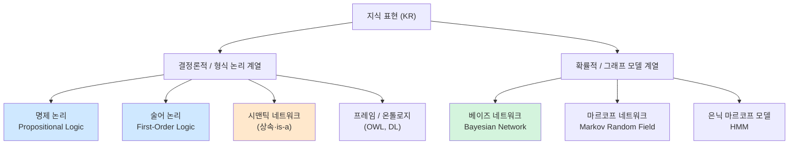
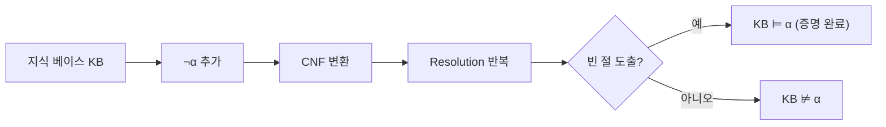
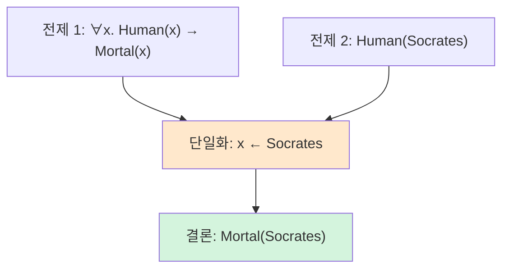
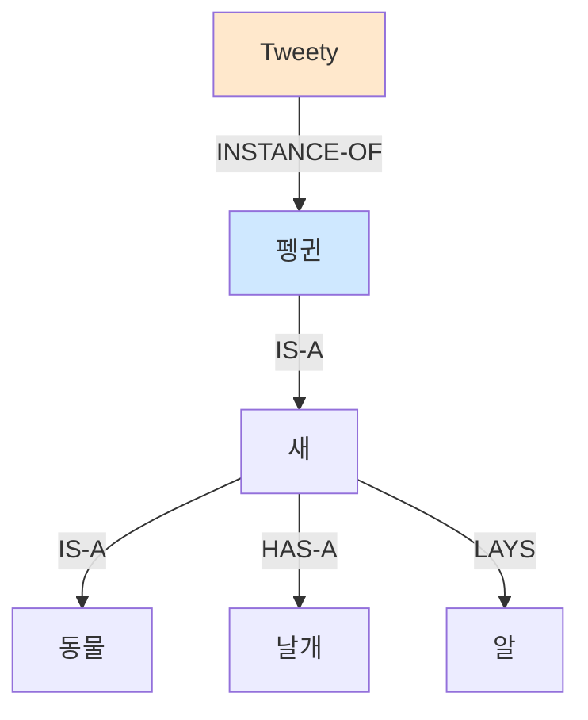
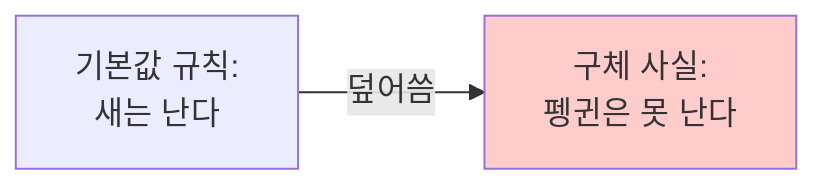
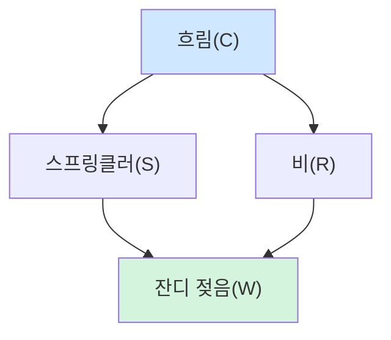
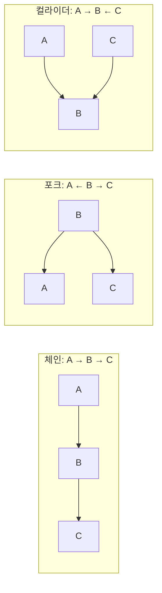
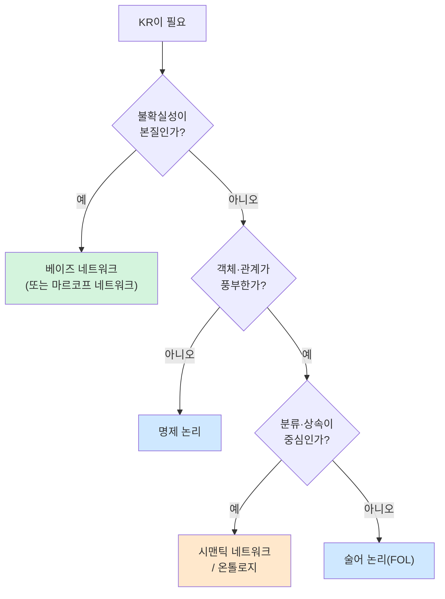

> **이 글의 목적**
>
> [AI개론 ②](/ai/ai-introduction-search-algorithms/)에서 *합리적 에이전트*가 행동을 *어떻게 찾는지*(탐색)를 다뤘다. 그런데 탐색이 의미를 가지려면 그 전에 답해야 할 질문이 하나 있다 — *"세계를 어떻게 표현해야 추론이 가능해지는가?"*
>
> 이번 글은 *지식 표현과 추론(Knowledge Representation and Reasoning, KR&R)* 의 네 가지 큰 줄기를 정리한다: **명제 논리 · 술어 논리 · 시맨틱 네트워크 · 베이즈 네트워크**.
>
> 정리에는 *Russell & Norvig*의 *AIMA*[^1]를 토대로, 각 표현 방식의 **원전 논문**(McCarthy 1958, Quillian 1968, Robinson 1965, Pearl 1988 등)을 직접 확인했다.
>
> **읽고 나면 답할 수 있는 질문**:
>
> - 좋은 지식 표현(KR)이 갖춰야 할 다섯 가지 역할은 무엇인가
> - 명제 논리와 술어 논리의 표현력은 어디서 갈리는가
> - **단일화(unification)** 와 **resolution**은 왜 묶여서 나오는가
> - 시맨틱 네트워크는 왜 한때 뜨거웠다가 형식 논리에 자리를 내줬는가
> - 베이즈 네트워크의 *조건부 독립*은 왜 폭발적인 결합 분포 크기를 줄여 주는가
> - 결정론적 KR(논리)과 확률적 KR(베이즈 네트워크)을 언제 어떻게 골라야 하는가

---

## 1. 지식 표현이란 무엇인가

### 1.1 왜 KR이 필요한가 — 탐색만으로는 부족한 순간

[②번 글](/ai/ai-introduction-search-algorithms/)의 탐색 알고리즘은 *상태 공간*을 가정한다. 상태가 미리 잘 정의되어 있어야 BFS도 A*도 의미가 있다. 그런데 현실은 그렇지 않다.

예를 들어 *"존이 메리의 형이라면, 메리는 존의 동생이다"* 같은 사실을 에이전트에게 가르치고 싶다면? 이 정보는 좌표 공간이 아니라 **명제** 또는 **관계** 로 표현해야 한다. 이걸 다루는 분야가 KR이다.

McCarthy는 1958년 *"Programs with common sense"*[^2]에서 이미 이 아이디어를 제안했다. *"AI가 상식을 가지려면 세계의 사실을 형식 언어로 표현하고, 그 위에서 추론할 수 있어야 한다"* 는 것이다. 60년이 지난 지금도 KR&R의 출발점은 그 자리에 있다.

### 1.2 좋은 KR의 다섯 가지 역할 (Davis, Shrobe & Szolovits 1993)

흔히 *"KR이란 무엇인가?"* 라는 질문에 *"세계를 표현하는 방식"* 정도로 답하기 쉬운데, Davis 등의 1993년 *AI Magazine* 논문[^3]은 이걸 다섯 가지 *역할(role)* 로 분해해 정리했다. 시험에 자주 나오는 분류이기도 하다.

| 역할 | 설명 | 예시 |
|---|---|---|
| **① Surrogate**(대체물) | 외부 세계를 시스템 안으로 들여오는 *대리인*. 어떤 존재론을 가정하는지가 결정됨 | "객체 A"는 실제 책을 시스템 안에서 대신함 |
| **② 존재론적 약속**(Ontological commitment) | 무엇이 존재하고 무엇이 무시되는지에 대한 선택 | 시간을 모델링할지, 인과를 모델링할지 |
| **③ 부분적 지능 이론**(Fragmentary theory of intelligent reasoning) | "추론이란 무엇인가" 에 대한 부분적 답 | 논리적 연역 / 확률적 갱신 |
| **④ 효율적 계산의 매체**(Medium for efficient computation) | 추론을 *기계가 실제로 수행 가능한* 형태로 만들어줘야 함 | resolution이 알고리즘으로 돌아가야 의미 있음 |
| **⑤ 인간 표현의 매체**(Medium of human expression) | 사람이 읽고 쓰기에도 합리적이어야 함 | 술어 논리는 수식이지만 학습 가능한 정도 |

> 💡 이 다섯 역할 중 **하나라도 무시한 KR은 결국 실패한다.** 예를 들어 ④를 무시한 표현은 표현력은 강해도 *추론이 너무 느려서* 못 쓴다. 반대로 ⑤를 무시하면 *사람이 모델을 작성할 수 없어서* 못 쓴다.

### 1.3 KR의 두 큰 갈래



이 글에서는 굵게 강조된 **명제 논리 · 술어 논리 · 시맨틱 네트워크 · 베이즈 네트워크** 를 다룬다. KODIT 시험에 자주 묶여 나오는 조합이기도 하다.

---

## 2. 명제 논리 (Propositional Logic)

### 2.1 구문 (Syntax) — 무엇이 합법적 문장인가

명제 논리의 *알파벳*은 다음과 같다:

- **원자 명제**(atomic proposition): `P`, `Q`, `R` 등 — 참 또는 거짓 값을 갖는 단순 명제
- **논리 연결자**: `¬`(부정), `∧`(논리곱, AND), `∨`(논리합, OR), `→`(함의), `↔`(동치)
- **괄호**: `(`, `)`

예시:

```text
(P ∧ Q) → R
¬(P ∨ Q) ↔ (¬P ∧ ¬Q)   ← De Morgan 법칙
```

위 둘은 모두 **합법적 명제 논리식(well-formed formula, WFF)** 이다.

### 2.2 의미론 (Semantics) — 모델과 진리표

명제 논리의 의미는 **모델(model)** 로 정의된다. *모델이란 각 원자 명제에 참/거짓 값을 할당한 하나의 세계 상태*를 말한다. 원자 명제가 n개라면 가능한 모델은 **2ⁿ** 개.

`P → Q`의 진리표:

| P | Q | P → Q |
|---|---|---|
| T | T | **T** |
| T | F | **F** |
| F | T | **T** |
| F | F | **T** |

> 💡 *함의(→)의 함정*: `P → Q`에서 P가 거짓이면 결과는 무조건 참이다. *"비가 오면 우산을 쓴다"* 라는 명제는, **비가 오지 않은 날에는 자동으로 참**이다. 일상 언어의 직관과 다르다는 점을 처음에는 받아들이기 어렵다.

#### 핵심 의미론적 개념

| 개념 | 의미 |
|---|---|
| **타당식**(valid, *tautology*) | 모든 모델에서 참인 식. 예: `P ∨ ¬P` |
| **충족 가능**(satisfiable) | 식을 참으로 만드는 모델이 적어도 하나 존재 |
| **불충족**(unsatisfiable) | 어떤 모델에서도 참이 되지 않음. 예: `P ∧ ¬P` |
| **함의**(entailment, ⊨) | KB ⊨ α : KB가 참인 *모든* 모델에서 α도 참 |

### 2.3 추론 — 함의를 어떻게 알아내는가

KB에서 α가 함의됨을 보이는 방법은 두 가지로 갈린다:

#### Step 1: 모델 검사 (Model Checking)

가능한 모든 모델을 나열하고, KB가 참인 모델에서 α도 참인지 확인. **건전(sound) + 완전(complete)**.
단점: 원자 명제 n개면 모델이 2ⁿ — *지수 폭발*.

#### Step 2: 추론 규칙 (Inference Rules)

모델 검사 대신 *문법적 규칙*으로 결론을 끌어낸다. 가장 유명한 것은 **Modus Ponens**:

```text
       P → Q,    P
       ───────────────
              Q
```

> *"P이면 Q이다"* 와 *"P가 참이다"* 가 둘 다 알려져 있다면 *"Q가 참이다"* 를 얻는다.

다른 핵심 규칙:

- **And-Elimination**: `P ∧ Q` 로부터 `P` 추출
- **Resolution**(Robinson 1965)[^4]: `(A ∨ B), (¬B ∨ C)` → `(A ∨ C)`

#### Step 3: Resolution — 단일 규칙으로 충분하다

Robinson은 1965년 *JACM* 논문[^4]에서, 명제 논리(및 술어 논리)의 모든 추론을 **resolution 규칙 하나만으로** 수행할 수 있음을 증명했다. 식을 *CNF(Conjunctive Normal Form)* 로 변환한 뒤 resolution을 반복 적용하면, 모순이 도출되거나(귀류법으로 함의 입증) 더 이상 새로운 절(clause)이 생기지 않을 때 멈춘다.



> 🎯 **시험 포인트**: Resolution은 **귀류법(refutation)** 방식이다. *"α가 함의됨을 증명하려면 ¬α를 KB에 추가해 모순을 끌어낸다."*

### 2.4 명제 논리의 한계

명제 논리는 *"존재하는 모든 사실"* 을 명제 단위로만 표현한다. 그런데 *"모든 사람은 죽는다"* 같은 일반화된 진술은 어떻게 쓸까?

- 사람이 100명이라면? `Mortal_Alice ∧ Mortal_Bob ∧ … ∧ Mortal_Z100`
- 새 사람이 들어오면 식 자체를 바꿔야 한다.

명제 논리는 **객체와 관계라는 개념이 없다**. 이걸 해결하는 게 다음 절의 *술어 논리*다.

---

## 3. 술어 논리 (First-Order Logic, FOL)


### 3.1 명제 논리의 한계 → FOL로 가는 동기

| 표현하고 싶은 문장 | 명제 논리 | 술어 논리 |
|---|---|---|
| "소크라테스는 사람이다" | `P_socrates_is_human` (불투명) | `Human(Socrates)` (구조 보존) |
| "모든 사람은 죽는다" | (전부 나열) | `∀x. Human(x) → Mortal(x)` |
| "어떤 학생은 수학을 좋아한다" | (불가능에 가까움) | `∃x. Student(x) ∧ Likes(x, Math)` |

FOL은 명제 논리에 **객체(constant) · 변수(variable) · 함수(function) · 술어(predicate) · 양화사(quantifier)** 를 추가한 확장이다.

### 3.2 구문 — 다섯 가지 새 요소

| 요소 | 기호 | 예시 |
|---|---|---|
| **상수**(constant) | `Socrates`, `1`, `Korea` | 도메인의 특정 객체 |
| **변수**(variable) | `x`, `y`, `z` | 임의 객체 |
| **함수**(function) | `father(x)`, `+(2, 3)` | 객체 → 객체 매핑 |
| **술어**(predicate) | `Human(x)`, `Loves(x, y)` | 객체에 대한 참/거짓 진술 |
| **양화사**(quantifier) | `∀`(전칭), `∃`(존재) | 변수의 범위 지정 |

### 3.3 의미론 — 도메인과 해석

FOL 식은 다음 둘이 정해져야 의미를 가진다:

- **도메인(domain)** : 논의 대상 객체의 집합. 예: 모든 사람들
- **해석(interpretation)** : 상수·함수·술어 기호를 도메인 위 객체·함수·관계에 대응시키는 매핑

`∀x. Human(x) → Mortal(x)` 는 도메인의 *모든 원소* x에 대해 진술이 참이어야 참이다.

### 3.4 단일화(Unification) — FOL 추론의 핵심 기계

명제 논리에서는 `P`와 `P`가 같은지 비교하면 끝이지만, FOL에서는 `Likes(x, Mary)`와 `Likes(John, y)`처럼 **변수가 들어 있는 식들의 매칭**을 다뤄야 한다. 이때 *변수에 어떤 값을 대입해야 두 식이 같아지는가* 를 찾는 것이 **단일화(unification)** 다.

```text
Unify(Likes(x, Mary), Likes(John, y))
       = { x/John, y/Mary }
```

이 치환(substitution)을 두 식에 적용하면 둘 다 `Likes(John, Mary)`가 된다.

#### 일반화된 Modus Ponens

단일화가 있어야 *"모든 사람은 죽는다 + 소크라테스는 사람이다 → 소크라테스는 죽는다"* 같은 추론이 자동화된다.



#### Resolution + 단일화 = FOL의 표준 증명 절차

Robinson의 1965년 알고리즘[^4]은 명제 논리뿐 아니라 FOL 전체를 다룰 수 있게 단일화를 결합한 형태였다. 이게 Prolog 같은 논리 프로그래밍 언어의 이론적 기반이 됐다.

### 3.5 명제 논리 vs 술어 논리 — 한 표 비교

| 항목 | 명제 논리 | 술어 논리 (FOL) |
|---|---|---|
| **단위** | 명제 (참/거짓 덩어리) | 객체 + 술어 + 관계 |
| **양화사** | 없음 | `∀`, `∃` |
| **변수** | 없음 | 있음 |
| **표현력** | 제한적 (도메인 크기에 비례) | 일반화 가능 |
| **결정 가능성**(decidability) | **결정 가능** | **준결정 가능** (반증은 항상 가능, 증명은 무한 루프 가능) |
| **추론 자동화** | 진리표·resolution 모두 가능 | resolution + 단일화 |

> ⚠️ FOL은 **결정 가능하지 않다(undecidable)**. Church (1936)·Turing (1937)이 증명한 결과로, *"임의의 FOL 식이 타당한지를 항상 끝나는 알고리즘으로 판정할 수 없다"*. 이게 시험에서 종종 함정으로 나온다.

---

## 4. 시맨틱 네트워크 (Semantic Network)


### 4.1 원전과 등장 배경

> Quillian, M. R. (1968). *Semantic memory.* In M. Minsky (Ed.), *Semantic Information Processing* (pp. 227–270). MIT Press.[^5]

Quillian은 박사학위 논문에서 *사람의 단어 의미 기억* 을 모델링하기 위해 그래프 구조를 제안했다. 노드는 *개념*, 엣지는 *관계*. 단순한 아이디어지만 이후 *프레임*, *온톨로지*, *지식 그래프* 의 뿌리가 된다.

### 4.2 핵심 관계 — IS-A와 HAS-A



- **IS-A**(상속, *taxonomic*): "X는 Y의 일종이다" — `펭귄 IS-A 새`
- **HAS-A**(부분, *meronymic*): "X는 Y를 가진다" — `새 HAS-A 날개`
- **INSTANCE-OF**: "X는 Y의 구체적 인스턴스" — `Tweety INSTANCE-OF 펭귄`

### 4.3 상속 — 강력함과 그 함정

시맨틱 네트워크의 매력은 *상속 추론* 이다. *"새는 날 수 있다"* 라고 *새* 노드에 한 번만 적어두면, 그 아래의 *Tweety* 도 자동으로 *"날 수 있다"* 가 된다. 표현 효율이 좋다.

문제는 **예외**다. *펭귄*은 *새*지만 *날 수 없다*. 이걸 어떻게 처리할까?

#### 비단조 추론(Non-monotonic Reasoning)의 등장

전통 논리는 *단조적*이다 — 새 사실이 추가되어도 이전 결론은 유지된다. 그런데 상속에서는 *"새는 난다"* 라는 일반 규칙이 *"펭귄은 새지만 못 난다"* 라는 더 구체적 사실에 의해 **무효화**되어야 한다. 이걸 다루는 게 *기본값 논리(default logic)*[^6] 등의 비단조 추론이다.



### 4.4 시맨틱 네트워크의 한계

| 문제 | 내용 |
|---|---|
| **형식 의미론 부재** | 같은 그래프를 사람마다 다르게 해석 가능 — Brachman의 1979년 비판[^7] |
| **부정·양화 표현 어려움** | "어떤 학생도 시험을 좋아하지 않는다" 를 그래프로? |
| **추론의 확장성** | 그래프 크면 IS-A 사슬 추적이 비싸짐 |

> 💡 시맨틱 네트워크의 한계가 드러나면서, **기술 논리(Description Logic, DL)** 와 OWL 같은 *형식적 의미론을 가진 후계자* 가 등장했다. 현대의 *지식 그래프(Knowledge Graph)* 는 시맨틱 네트워크의 직계 후손이다 — 단, 형식 의미론이 추가된.

---

## 5. (보너스) 프레임 (Frames) — Minsky의 1974년 제안

> Minsky, M. (1974). *A Framework for Representing Knowledge.* MIT AI Memo 306.[^8]

Minsky는 *"사람은 새 상황을 마주칠 때 빈 칸이 있는 *틀(frame)* 을 꺼내 채운다"* 는 직관에서 출발했다. 예를 들어 *식당 프레임*은 다음 슬롯을 가질 수 있다:

```text
Frame: Restaurant
  - Customer: ?
  - Waiter: ?
  - Order: ?
  - Bill: (default = "공동 분담")
```

비어 있는 슬롯은 새 상황에서 채워지고, *기본값(default)* 슬롯은 정보가 없을 때 그대로 사용된다. 객체 지향 프로그래밍의 *클래스* 개념과 매우 닮아 있다 — 실제로 OOP의 사상적 뿌리 중 하나가 프레임이다.

> 💡 KODIT 시험에서 *"객체 지향과 비슷한 KR은?"* 이라는 문항이 나오면 답은 **프레임**이다.

---

## 6. 베이즈 네트워크 (Bayesian Network)


### 6.1 왜 확률인가 — 결정론의 한계

지금까지 본 KR은 모두 *결정론적*이었다. *"P이면 Q이다"* 는 P가 참이면 Q를 100% 확신한다. 그런데 의료 진단을 생각해보자:

> *"기침이 있으면 폐렴이다"*

이건 *항상 참* 이 아니다. 기침은 감기·천식·알레르기 등 다양한 원인에서 온다. 의료·자율주행·언어처리 등 **불확실성이 본질** 인 도메인에서는 결정론이 맞지 않다.

여기서 등장하는 게 베이즈 네트워크다.

### 6.2 베이즈 정리 — 30초 복습

> 베이즈 정리: **P(A | B) = P(B | A) · P(A) / P(B)**

용어:

- **P(A)** : 사전 확률(prior) — B를 보기 전 A를 믿는 정도
- **P(B | A)** : 가능도(likelihood) — A가 참일 때 B가 관찰될 확률
- **P(A | B)** : 사후 확률(posterior) — B를 본 뒤 A를 믿는 정도

원전: Bayes의 1763년 *"An essay towards solving a problem in the doctrine of chances"*[^9]. 그가 사망한 뒤 친구 Richard Price가 발표.

### 6.3 베이즈 네트워크 — DAG + CPT

> Pearl, J. (1988). *Probabilistic Reasoning in Intelligent Systems: Networks of Plausible Inference*. Morgan Kaufmann.[^10]

Judea Pearl이 1988년 책에서 제안한 *베이즈 네트워크* 는 두 가지로 정의된다:

1. **DAG(directed acyclic graph)** — 노드는 확률 변수, 엣지는 직접적 인과/의존 관계
2. **각 노드의 CPT(conditional probability table)** — 부모가 주어졌을 때 그 노드의 조건부 확률

#### 고전 예제: 스프링클러-비-젖은 잔디



각 노드는 자기 부모가 주어졌을 때의 조건부 확률표(CPT)를 가진다. 예시 (간단화):

| C | P(S=T \| C) |
|---|---|
| T | 0.1 |
| F | 0.5 |

| C | P(R=T \| C) |
|---|---|
| T | 0.8 |
| F | 0.2 |

| S | R | P(W=T \| S, R) |
|---|---|---|
| T | T | 0.99 |
| T | F | 0.90 |
| F | T | 0.90 |
| F | F | 0.00 |

### 6.4 핵심 통찰 — 결합 분포의 압축

n개의 이진 변수가 있다면 *완전 결합 분포(joint distribution)* 는 **2ⁿ - 1** 개의 파라미터를 요구한다. n=20만 되어도 100만 개. 비현실적.

베이즈 네트워크는 *조건부 독립* 을 활용해 결합 분포를 부분 곱으로 분해한다:

```text
P(C, S, R, W) = P(C) · P(S | C) · P(R | C) · P(W | S, R)
```

원래 16개 파라미터(2⁴) 였던 결합 분포가 **8개 파라미터** 로 줄어든다. 변수가 많아질수록 압축비는 폭발적이다.

> 🎯 **시험 포인트**: 베이즈 네트워크의 본질은 **조건부 독립을 통한 결합 분포의 인수 분해**다. *"각 노드는 자기 부모만 알면 그 외 비후손과 조건부 독립"* 이라는 마르코프 가정이 핵심.

### 6.5 d-분리 (d-separation) — 조건부 독립을 그래프로 읽기

베이즈 네트워크의 강력함은 *그래프 구조만 보고도* 어떤 변수들 사이의 조건부 독립을 판정할 수 있다는 점이다. 이걸 위한 규칙이 **d-분리**다.



| 구조 | B를 *관찰*하면 A와 C는 |
|---|---|
| **체인** A → B → C | **독립** (B가 정보를 차단) |
| **포크** A ← B → C | **독립** (공통 원인 B를 알면 A·C 분리) |
| **컬라이더** A → B ← C | **오히려 의존** (B를 알면 A·C가 *조건부 의존* 됨 — *"explaining away"*) |

> 💡 **컬라이더의 직관**: 잔디가 *젖었다*는 사실을 알 때, *비가 안 왔음을 확인하면* 스프링클러가 켜졌을 확률이 *올라간다*. 두 원인 사이에 인위적 의존이 생기는 현상. Pearl은 이를 *"explaining away"* 라고 불렀다.

### 6.6 추론(Inference) — 정확 추론과 근사 추론

| 종류 | 알고리즘 | 특성 |
|---|---|---|
| **정확 추론**(exact) | Variable Elimination, Junction Tree | 최악의 경우 NP-hard. 작은 네트워크에 적합 |
| **근사 추론**(approximate) | Gibbs sampling, MCMC, Loopy BP | 큰 네트워크에 사실상 표준 |

> ⚠️ **함정**: *"베이즈 네트워크의 추론은 항상 다항 시간"* 이라는 진술은 **거짓**이다. 정확 추론은 일반적으로 NP-hard (Cooper 1990)[^11]. 다항 시간은 *트리 구조* 같은 특수한 경우에만.

### 6.7 학습 — 두 가지 층위

베이즈 네트워크 학습은 두 단계로 갈린다:

1. **파라미터 학습**: 구조가 주어졌을 때 CPT를 데이터로 추정. 최대우도 / 베이즈 추정으로 풀린다.
2. **구조 학습**: 어떤 DAG가 데이터를 가장 잘 설명하는가. 점수 기반(BIC, AIC) 또는 제약 기반 알고리즘 사용.

구조 학습은 어렵다 — 가능한 DAG 수가 노드 수에 슈퍼지수적으로 증가한다.

---

## 7. 비교 정리 — 네 가지 KR을 한 표로

| 표현 방식 | 표현력 | 추론 도구 | 불확실성 | 대표 응용 |
|---|---|---|---|---|
| **명제 논리** | 가장 좁음 | 진리표, resolution | ❌ | 디지털 회로 검증, SAT 솔버 |
| **술어 논리(FOL)** | 풍부 (객체·관계·양화사) | resolution + 단일화 | ❌ | Prolog, 정리 증명, 정형 검증 |
| **시맨틱 네트워크** | 분류·상속 중심 | 상속 추적, 비단조 추론 | △ (기본값) | 지식 그래프, 온톨로지(OWL) |
| **베이즈 네트워크** | 확률적 의존 관계 | Variable Elimination, MCMC | ✅ | 의료 진단, 음성 인식, 인과 추론 |

### 어떻게 고를 것인가 — PAAR 식 의사결정

블로그 시리즈 전반에 적용하는 *PAAR(Problem · Analyze · Action · Result)* 사고로 정리하면:

- **Problem**: 결정론적인가, 본질적으로 불확실한가? 객체·관계가 풍부한가, 단순 명제로 충분한가?
- **Analyze**: 추론 효율 vs 표현력. 결정론 KR은 빠르지만 표현 한계, 베이즈 네트워크는 강력하지만 추론이 비싸다.
- **Action**: 보통의 선택은 *"가능한 한 단순한 KR을 쓰되, 도메인 특성이 요구하면 단계적으로 확장"*. 회로 검증 → 명제 논리, 의료 진단 → 베이즈 네트워크.
- **Result**: 잘못된 KR 선택은 시스템 전체의 발목을 잡는다 — 추론이 느려도, 표현이 부족해도 실패한다.



---

## 8. 헷갈리는 것 / 자주 묻는 질문

### Q1. 명제 논리와 부울 대수는 같은 건가?

**거의 같다**. 부울 대수는 *대수 구조*(집합과 연산), 명제 논리는 *추론 체계*. 같은 진리값과 연결자를 다루지만 목적이 다르다 — 부울 대수는 회로 단순화, 명제 논리는 결론 도출.

### Q2. "FOL이 결정 가능하지 않다"는 정확히 무슨 뜻?

*"임의의 FOL 식이 타당한지를 *항상 종료* 하는 알고리즘으로 판정할 수 없다"* 는 의미다 (Church-Turing). 단, **반증은 항상 가능** — 식이 타당하지 않으면 resolution이 그것을 유한 시간 안에 보여줄 수 있다(준결정 가능, *semi-decidable*).

### Q3. 시맨틱 네트워크와 지식 그래프는 같은가?

*직계 후손* 이지만 같지는 않다. 지식 그래프(예: Google Knowledge Graph, Wikidata)는 시맨틱 네트워크의 그래프 구조에 **형식 의미론** 과 **표준 어휘**(RDF, OWL)를 얹은 것. 1970년대 시맨틱 네트워크의 약점 — 형식 의미 부재 — 이 보강된 형태다.

### Q4. "베이즈 네트워크 = 인과 그래프"인가?

**아니다**. 일반 베이즈 네트워크의 엣지는 *조건부 독립 구조* 만 표현한다. 같은 결합 분포를 표현하는 DAG는 여러 개일 수 있고, 그중 어떤 것이 *인과적* 인지는 추가 가정이 필요하다. Pearl은 후속 연구(2000)[^12]에서 *do-calculus* 를 도입해 인과 추론을 정식화했다.

### Q5. Resolution과 단일화는 어떤 관계?

- **명제 논리에서 Resolution**: 단일화 불필요. 변수 없는 문자열 매칭으로 충분.
- **FOL에서 Resolution**: 단일화 필수. 변수가 들어 있는 절을 합치려면 어떤 치환을 해야 매칭되는지 계산해야 함.

즉 *"단일화는 FOL에서의 Resolution이 작동하기 위한 전제 도구"*.

### Q6. 컬라이더의 "explaining away"가 일상에 어떻게 나타나나?

*"시험을 잘 본 학생이 똑똑한지(원인1) 운이 좋았는지(원인2)를 묻는 상황"* — *시험 점수* 가 컬라이더. 점수가 높음을 *알고* 있을 때, *운이 나빴다* 는 정보가 들어오면 *학생이 똑똑할* 확률이 올라간다. 두 원인이 사후적으로 의존 관계가 된다.

### Q7. 시험에 자주 나오는 함정 진술

| 진술 | 진위 |
|---|---|
| "BFS와 마찬가지로 명제 논리도 NP-complete가 아니다" | **거짓**. 명제 논리 충족성 판정(SAT)은 NP-complete (Cook 1971) |
| "FOL은 명제 논리의 일반화이므로 표현력 외에 모든 면에서 우월하다" | **거짓**. FOL은 결정 가능하지 않음 — 명제 논리의 자동화는 이론적으로 더 강력 |
| "베이즈 네트워크 추론은 다항 시간" | **거짓**. 일반적으로 NP-hard |
| "시맨틱 네트워크는 형식 의미론이 정의되어 있다" | **거짓** (Brachman 1979 비판) |

---

## 9. 시험 직전 1분 요약

> A4 한 장 압축본.

### 핵심 6

1. **KR의 다섯 역할** (Davis, Shrobe, Szolovits 1993) — 대체물 / 존재론적 약속 / 부분적 추론 이론 / 효율적 계산 / 인간 표현
2. **명제 논리** — 원자 명제 + 5연결자, 진리표·resolution, **결정 가능**, SAT는 NP-complete
3. **술어 논리(FOL)** — 객체·변수·함수·술어·양화사, **resolution + 단일화**, **결정 가능하지 않음(준결정)**
4. **시맨틱 네트워크** — Quillian 1968, IS-A·HAS-A, 상속·비단조 추론, 형식 의미론 부재 → 지식 그래프로 진화
5. **프레임** — Minsky 1974, 슬롯 + 기본값, OOP 사상의 뿌리
6. **베이즈 네트워크** — Pearl 1988, **DAG + CPT**, *조건부 독립을 통한 결합 분포 인수 분해*, d-분리, 정확 추론은 NP-hard

### 인물·연도·이벤트 7개

| 항목 | 핵심 |
|---|---|
| 1763 Bayes (Price 발표) | 베이즈 정리 |
| 1958 McCarthy | "Programs with common sense" — KR 출발 |
| 1965 Robinson | Resolution (JACM) |
| 1968 Quillian | 시맨틱 네트워크 (PhD) |
| 1971 Cook | SAT의 NP-completeness |
| 1974 Minsky | Frames (MIT AI Memo 306) |
| 1988 Pearl | 베이즈 네트워크 (Probabilistic Reasoning) |

### 자주 헷갈리는 한 마디

- *"명제 논리는 결정 가능, FOL은 결정 가능하지 않다"* → **참**
- *"Resolution만으로 명제 논리·FOL의 모든 추론 가능"* → **참** (단, FOL에서는 단일화 필요)
- *"베이즈 네트워크는 인과 그래프이다"* → **거짓** (인과 해석엔 추가 가정 필요)
- *"시맨틱 네트워크 = 지식 그래프"* → **거의 같지만 형식 의미론 차이**
- *"d-분리: 컬라이더는 관찰하면 의존, 체인·포크는 관찰하면 독립"* → **참**

---

## 10. 다음 학습

지금까지의 흐름을 정리하면:

- ① 인공지능이란 무엇인가 *(개념 지도)*
- ② 탐색 알고리즘 *(에이전트가 행동을 찾는 법)*
- ③ 지식 표현과 추론 *(에이전트가 세계를 표현하는 법)* ← 지금
- ④ 현대 AI *(딥러닝·LLM·생성 모델로의 도약)*

다음 글은 마지막 ④편이다.

- 📌 **[AI개론 ④] 현대 AI**: NLP · CV · LLM · 생성 모델

---

## 11. 참고 문헌 (References)

[^1]: Russell, S. J., & Norvig, P. (2020). *Artificial Intelligence: A Modern Approach* (4th ed.). Pearson. (특히 Ch. 7 "Logical Agents", Ch. 8 "First-Order Logic", Ch. 12 "Quantifying Uncertainty", Ch. 13 "Probabilistic Reasoning")

[^2]: McCarthy, J. (1959). Programs with common sense. *Proceedings of the Teddington Conference on the Mechanization of Thought Processes*, 75–91. ([Stanford archive](http://www-formal.stanford.edu/jmc/mcc59.html))

[^3]: Davis, R., Shrobe, H., & Szolovits, P. (1993). What is a knowledge representation? *AI Magazine*, 14(1), 17–33. [DOI: 10.1609/aimag.v14i1.1029](https://doi.org/10.1609/aimag.v14i1.1029)

[^4]: Robinson, J. A. (1965). A machine-oriented logic based on the resolution principle. *Journal of the ACM*, 12(1), 23–41. [DOI: 10.1145/321250.321253](https://doi.org/10.1145/321250.321253)

[^5]: Quillian, M. R. (1968). Semantic memory. In M. Minsky (Ed.), *Semantic Information Processing* (pp. 227–270). MIT Press.

[^6]: Reiter, R. (1980). A logic for default reasoning. *Artificial Intelligence*, 13(1–2), 81–132. [DOI: 10.1016/0004-3702(80)90014-4](https://doi.org/10.1016/0004-3702(80)90014-4)

[^7]: Brachman, R. J. (1979). On the epistemological status of semantic networks. In N. V. Findler (Ed.), *Associative Networks: Representation and Use of Knowledge by Computers* (pp. 3–50). Academic Press.

[^8]: Minsky, M. (1974). *A Framework for Representing Knowledge*. MIT AI Laboratory Memo 306. ([MIT DSpace](http://hdl.handle.net/1721.1/6089))

[^9]: Bayes, T. (1763). An essay towards solving a problem in the doctrine of chances. *Philosophical Transactions of the Royal Society of London*, 53, 370–418. (Communicated by R. Price.)

[^10]: Pearl, J. (1988). *Probabilistic Reasoning in Intelligent Systems: Networks of Plausible Inference*. Morgan Kaufmann.

[^11]: Cooper, G. F. (1990). The computational complexity of probabilistic inference using Bayesian belief networks. *Artificial Intelligence*, 42(2–3), 393–405. [DOI: 10.1016/0004-3702(90)90060-D](https://doi.org/10.1016/0004-3702(90)90060-D)

[^12]: Pearl, J. (2000). *Causality: Models, Reasoning, and Inference*. Cambridge University Press.

### 보조 자료 (교차검증용)

- Stanford Encyclopedia of Philosophy — *Logic and Artificial Intelligence*. <https://plato.stanford.edu/entries/logic-ai/>
- Berkeley CS188 — *Bayes Nets*. <https://inst.eecs.berkeley.edu/~cs188/textbook/>
- Wikipedia — Resolution (logic), Bayesian network, Semantic network. <https://en.wikipedia.org/>

---

## 부록 A: 이미지 생성 프롬프트

> 📁 이미지 프롬프트는 [`/prompts/2026-04-27-ai-introduction-knowledge-representation.md`](/prompts/2026-04-27-ai-introduction-knowledge-representation.md) 에 별도 정리되어 있다 (한글 라벨·파일명·저장 경로 명시).

> ✍️ **다음 학습**: [[AI개론 ④] 현대 AI (NLP · CV · LLM · 생성 모델)](/ai/ai-introduction-modern-ai/) — 작성 완료.
