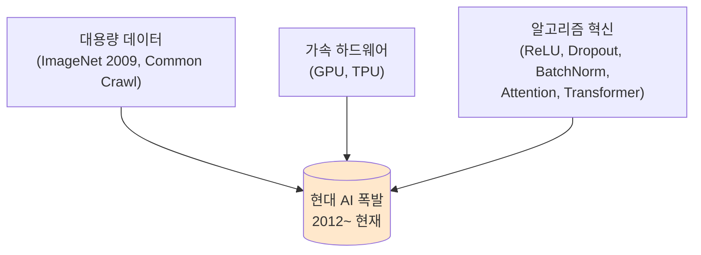
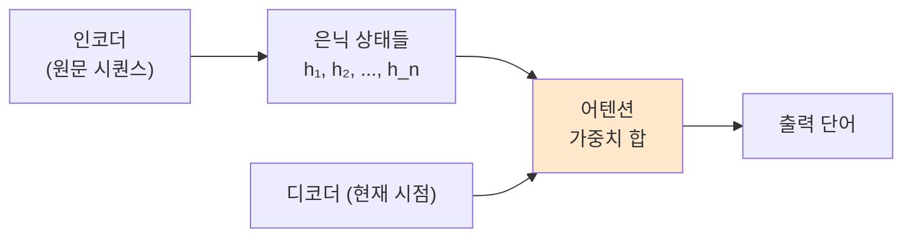
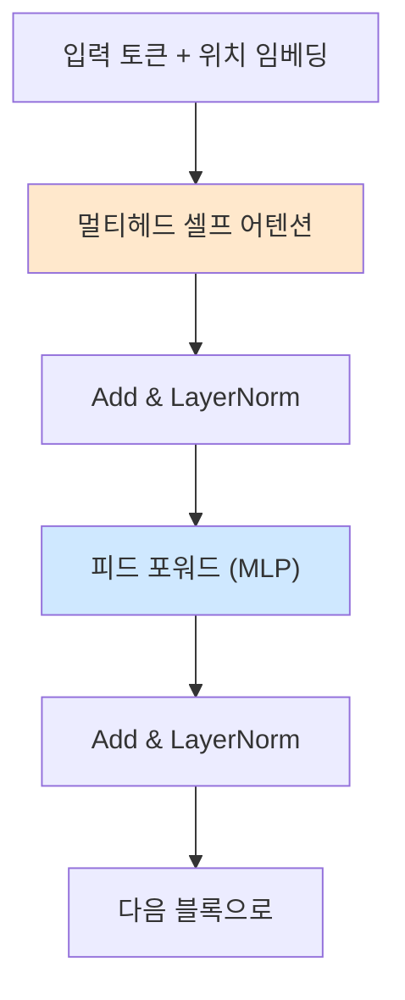
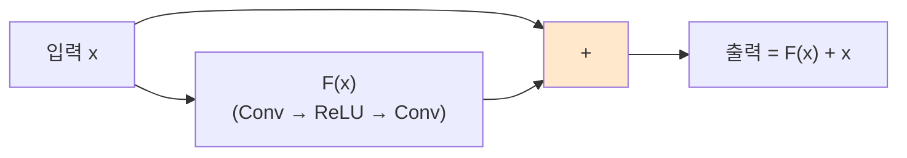
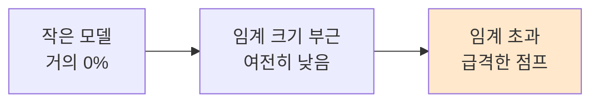
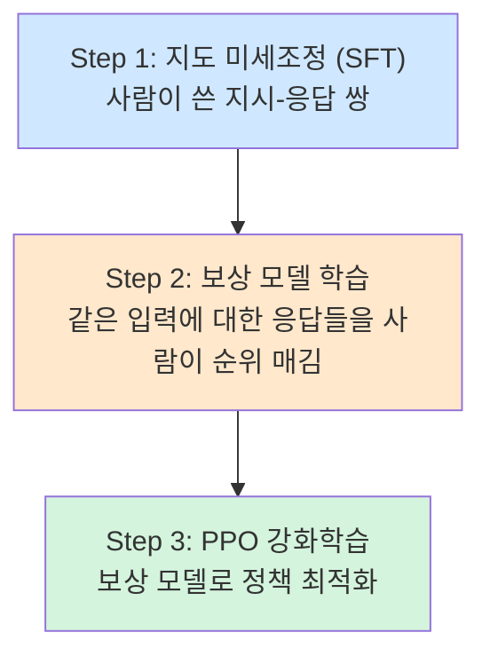
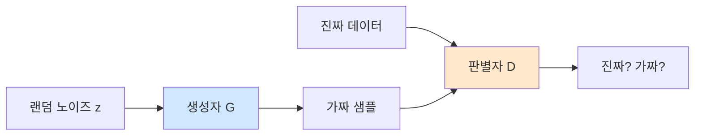
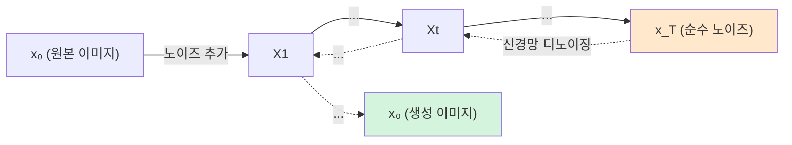
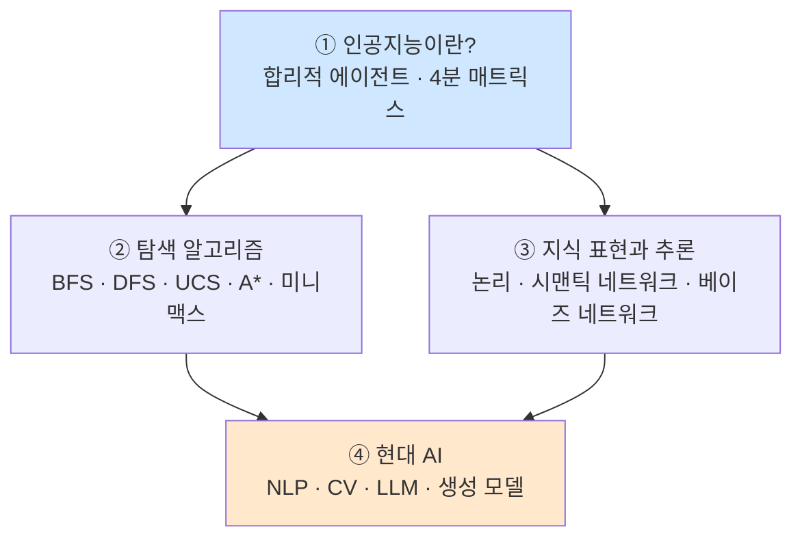

> **이 글의 목적**
>
> [AI개론 ①](/ai/ai-introduction-overview/)에서 *"AI란 무엇인가"*, [②](/ai/ai-introduction-search-algorithms/)에서 *"행동을 어떻게 찾는가"*, [③](/ai/ai-introduction-knowledge-representation/)에서 *"세계를 어떻게 표현하는가"* 를 정리했다. 이번 글은 이 흐름이 **2010년대 이후 어떻게 폭발적으로 바뀌었는지** 를 본다.
>
> 다루는 네 줄기는 **NLP · CV · LLM · 생성 모델**. 모두 *딥러닝 + 대용량 데이터 + 가속기* 라는 공통 토대 위에서 자라났다.
>
> 정리에는 *Russell & Norvig*의 *AIMA*[^1]와 *Goodfellow, Bengio & Courville*의 *Deep Learning*[^2]을 토대로, 각 기법의 **원전 논문** (Vaswani 2017, Goodfellow 2014, Ho 2020 등)을 직접 확인했다.
>
> **읽고 나면 답할 수 있는 질문**:
>
> - 2012년 AlexNet과 2017년 Transformer가 왜 *분기점* 인가
> - **Word2Vec → Seq2Seq → Attention → Transformer**의 흐름은 어떤 문제를 단계적으로 푼 것인가
> - LLM의 *스케일링 법칙* 과 *창발 능력(emergent abilities)* 은 무엇이며 어디까지 검증됐는가
> - **GAN · VAE · Diffusion** 은 같은 *생성 모델* 이지만 어떻게 다른가
> - *RLHF*(InstructGPT)는 왜 ChatGPT가 갑자기 *말이 통하게* 만든 결정타였나
> - 현대 AI의 한계 — **환각, 정렬, 평가** — 는 무엇이며 학계는 뭐라고 답하는가

---

## 1. 현대 AI를 만든 세 가지 토대

### 1.1 왜 2012년부터 갑자기 가속됐는가

①번 글의 발전사 표에서 봤듯, 신경망 자체는 *오래된* 아이디어다 (퍼셉트론 1958, 역전파 1986). 그런데 *현대 AI* 라고 부르는 흐름은 2012년부터 시작됐다. 이유는 한 가지가 아니라 세 가지가 동시에 충족됐기 때문이다.



세 축이 따로따로 발전하다 2012년경 임계점에서 만났다. AlexNet[^3]은 그 첫 증명이었다 — *"같은 CNN이라도 GPU 두 장 + ImageNet + ReLU·Dropout이면 ImageNet 오류율을 26%에서 15.3%로 떨어뜨린다"*.

> 💡 **PAAR 식 정리** — Problem(이미지 분류 정체) · Analyze(데이터·연산·알고리즘 중 어디가 병목인가) · Action(GPU + ReLU·Dropout 결합) · Result(top-5 오류 26% → 15.3%, ILSVRC 우승). 현대 AI의 거의 모든 도약은 이 패턴의 반복이다.

### 1.2 딥러닝의 핵심 빌딩 블록

이 글에서 반복적으로 등장할 핵심 모듈을 짧게 정리해 둔다.

| 빌딩 블록 | 용도 | 도입 논문 |
|---|---|---|
| **CNN**(합성곱 신경망) | 공간적 패턴 (이미지·음성) | LeCun 1998[^4] |
| **RNN / LSTM** | 시퀀스 (텍스트·음성) | Hochreiter & Schmidhuber 1997[^5] |
| **Attention** | "어디에 집중할지" 가중치 학습 | Bahdanau et al. 2015[^6] |
| **Transformer** | 어텐션만으로 시퀀스 처리 | Vaswani et al. 2017[^7] |
| **ResNet의 잔차 연결** | 깊은 네트워크 학습 가능 | He et al. 2016[^8] |
| **BatchNorm·LayerNorm** | 학습 안정화 | Ioffe & Szegedy 2015 / Ba et al. 2016 |

이 빌딩 블록들이 NLP·CV·생성 모델 전반에서 어떻게 조합되는지가 이 글의 본 줄거리다.

---

## 2. NLP (자연어 처리)

### 2.1 통계적 NLP → 신경망으로 가는 길

2000년대 NLP는 *n-gram 언어 모델*, *Hidden Markov Model*, *Conditional Random Field* 같은 확률적 그래픽 모델 위에 서 있었다. 단어를 *원-핫 벡터*로 다뤘기 때문에 *"king" 과 "queen"* 이 *"king" 과 "banana"* 만큼이나 멀리 떨어져 있었다. 의미적 유사도가 표현되지 않았다.

이 한계를 단번에 깬 게 다음 절의 *Word2Vec* 이다.

### 2.2 Word2Vec — 단어를 벡터로 (Mikolov 2013)

> Mikolov, T., et al. (2013). *Efficient Estimation of Word Representations in Vector Space*.[^9]

핵심 아이디어: *"문맥이 비슷한 단어는 의미도 비슷하다"* 는 *분포 가설(distributional hypothesis)* 을 신경망으로 구현. 두 변형:

- **CBOW**(Continuous Bag of Words): 주변 단어로 가운데 단어 예측
- **Skip-gram**: 가운데 단어로 주변 단어 예측

학습 후 단어 벡터는 *유추(analogy)* 같은 산술적 의미 관계를 보여줬다:

```text
vec("king") - vec("man") + vec("woman") ≈ vec("queen")
```

> 🎯 **시험 포인트**: Word2Vec은 *의미 정보를 가진 분산 표현(distributed representation)* 의 시대를 열었다. *원-핫* 과 *분산 표현* 의 차이가 자주 출제된다.

### 2.3 Seq2Seq + Attention — 가변 길이 문제 해결

2014년 Sutskever et al.[^10]은 *RNN 인코더·디코더* 구조로 기계 번역을 풀었다 (Seq2Seq). 그러나 긴 문장에서는 인코더의 *마지막 은닉 상태 하나에 모든 의미를 압축해야* 했고, 정보 병목이 생겼다.

Bahdanau et al. 2015[^6]는 디코더의 매 시점에서 *인코더의 모든 시점에 어텐션 가중치* 를 계산하도록 했다. *"번역할 때 원문 어디를 보고 있는가"* 가 학습된다.



### 2.4 Transformer — 어텐션만으로 충분하다 (Vaswani 2017)


> Vaswani, A., et al. (2017). *Attention Is All You Need.* NeurIPS 2017.[^7]

Vaswani 등은 RNN을 완전히 빼고 **셀프 어텐션(self-attention)** 만으로 시퀀스를 처리했다. 핵심 효과:

| 측면 | RNN | Transformer |
|---|---|---|
| **병렬화** | 시점이 순차 → 어려움 | 시퀀스 전체 동시 계산 |
| **장거리 의존성** | 멀어질수록 약화 | 어떤 두 위치든 직접 연결 |
| **학습 시간** | GPU 활용 제한 | GPU 친화적 |

Transformer 구조의 핵심 블록:



이 블록을 N번 쌓는 게 표준 구성이다. 이후 등장한 거의 모든 LLM·ViT·Stable Diffusion이 이 구조 위에서 변형됐다.

> 💡 **셀프 어텐션의 직관**: 각 토큰이 *"내가 다른 모든 토큰과 얼마나 관련 있는가"* 를 계산해서, 그 가중치로 정보를 끌어모은다. *Q(질의)·K(키)·V(값)* 세 행렬을 학습하고 `softmax(QKᵀ/√d) · V` 가 핵심 식.

### 2.5 BERT vs GPT — 같은 Transformer, 다른 학습 목표

| 모델 | 구조 | 사전학습 목표 | 강점 | 원전 |
|---|---|---|---|---|
| **BERT** | Transformer **인코더** | Masked LM (가린 단어 맞추기) | *이해* (분류·QA) | Devlin et al. 2019[^11] |
| **GPT** | Transformer **디코더** | 다음 단어 예측 (Autoregressive) | *생성* | Radford et al. 2018 (GPT-1) |

> 🎯 **시험 포인트**: BERT = *양방향 인코더, MLM*. GPT = *단방향 디코더, 다음 단어 예측*. 이 한 줄로 정리 가능.

---

## 3. CV (컴퓨터 비전)

### 3.1 CNN의 시대 — LeNet에서 ResNet까지

CNN 자체는 LeCun이 1998년 *Gradient-based learning applied to document recognition* 에서 LeNet으로 우편번호 인식에 적용한 게 출발이다[^4]. 이후 주요 이정표:

| 모델 | 연도 | 핵심 기여 | 출처 |
|---|---|---|---|
| **LeNet-5** | 1998 | CNN 표준 구조 (Conv-Pool-FC) | LeCun et al. |
| **AlexNet** | 2012 | GPU + ReLU + Dropout, ImageNet 우승 | Krizhevsky et al.[^3] |
| **VGG** | 2014 | 작은 3×3 필터의 깊은 누적 | Simonyan & Zisserman |
| **GoogLeNet/Inception** | 2014 | 다중 스케일 모듈 | Szegedy et al. |
| **ResNet** | 2016 | **잔차 연결** — 152층까지 학습 가능 | He et al.[^8] |

### 3.2 ResNet의 통찰 — 깊이의 저주를 깬 잔차 연결



핵심: 신경망이 학습해야 할 것을 *함수 H(x) 자체* 가 아니라 *H(x) - x = F(x)* 라는 *잔차(residual)* 로 바꾼 것. 학습이 어려우면 *F(x) ≈ 0* 으로 보내 *항등 매핑* 이 되도록 자연스러운 기본값을 갖는다. 이게 100층 넘는 네트워크의 *그래디언트 소실* 을 풀었다.

### 3.3 객체 검출과 분할 — 분류를 넘어서

분류(classification)는 *"이 이미지에 무엇이 있는가"*. 검출(detection)은 *"무엇이 어디에 있는가"*, 분할(segmentation)은 *"각 픽셀이 무엇인가"*.

| 분야 | 대표 모델 | 핵심 |
|---|---|---|
| **객체 검출** | R-CNN, Faster R-CNN, **YOLO** | 박스 + 클래스 동시 예측 |
| **시맨틱 분할** | FCN, U-Net | 픽셀 단위 분류 |
| **인스턴스 분할** | Mask R-CNN | 픽셀 단위 + 객체 ID |

> 💡 *YOLO(You Only Look Once)* 시리즈는 *"한 번의 forward로 검출 끝"* 이라는 단순함과 속도로 산업에 가장 많이 쓰인다. 자율주행·CCTV·드론 비전이 대부분 YOLO 변형이다.

### 3.4 Vision Transformer (ViT) — CNN 없이 이미지를 푼다

> Dosovitskiy, A., et al. (2021). *An Image Is Worth 16×16 Words: Transformers for Image Recognition at Scale.* ICLR 2021.[^12]

이미지를 16×16 패치로 잘라 *각 패치를 토큰처럼* 다루고 표준 Transformer 인코더에 그대로 넣었다. 결과는 *대규모 데이터에서* CNN을 능가했다.

이게 의미하는 것: *Transformer는 시퀀스만이 아니라 일반적 표현 학습 구조* 라는 점. 이후 CV·오디오·멀티모달 전반이 Transformer로 통합되는 흐름이 가속된다.

---

## 4. LLM (대규모 언어 모델)

### 4.1 GPT-1 → GPT-3 → GPT-4 — 스케일이 만든 도약

| 모델 | 연도 | 파라미터 | 핵심 |
|---|---|---|---|
| **GPT-1** | 2018 | 0.117B | Transformer 디코더 + 사전학습/미세조정 |
| **GPT-2** | 2019 | 1.5B | *제로샷 작업 수행* 가능성 |
| **GPT-3** | 2020 | **175B** | *Few-shot in-context learning*[^13] |
| **GPT-4** | 2023 | 비공개 | 멀티모달, 추론 능력 도약 |

스케일이 커질수록 *별도 학습 없이 예시 몇 개만 보여줘도* 작업을 수행하는 능력(few-shot)이 나타났다. 이게 LLM 시대의 출발 신호였다.

### 4.2 스케일링 법칙 (Kaplan 2020 / Hoffmann 2022)

> Kaplan, J., et al. (2020). *Scaling Laws for Neural Language Models.*[^14]
> Hoffmann, J., et al. (2022). *Training Compute-Optimal Large Language Models* (Chinchilla).[^15]

Kaplan 등은 *모델 크기·데이터·연산* 이 늘 때 손실(loss)이 *멱법칙(power law)* 을 따르며 예측 가능한 형태로 떨어짐을 보였다. 이후 Hoffmann 등(Chinchilla)은 *"파라미터 수와 학습 토큰 수가 균형 잡혀야 효율적"* 이라는 보강 결론을 냈다 — 같은 연산 예산이면 *더 작은 모델 + 더 많은 데이터* 가 낫다.

> ⚠️ **흔한 오해**: *"GPT-3가 큰 게 무조건 우월하다"* — Chinchilla 이후 학계는 *훈련 데이터 대비 과대 파라미터 모델은 비효율적* 이라고 본다.

### 4.3 창발 능력 (Emergent Abilities) — 그러나 논쟁적

> Wei, J., et al. (2022). *Emergent Abilities of Large Language Models.* TMLR.[^16]

특정 능력(산술 추론, 다단계 reasoning 등)이 *작은 모델에서는 거의 0* 이다가 *임계 크기를 넘으면 갑자기 점프* 한다는 주장. *창발(emergence)* 이라는 표현이 붙었다.



> ⚠️ **반박 연구**: Schaeffer et al. 2023[^17]은 *"창발은 평가 지표(metric)의 비선형성 때문이며, 매끄러운 지표를 쓰면 점진적 향상"* 이라고 주장. 학계 합의는 아직 진행형이다. *"창발은 실제 현상이라기보다 측정의 산물일 수 있다"* 는 입장도 시험에 종종 등장.

### 4.4 RLHF — ChatGPT가 *말이 통하는* 결정타

> Ouyang, L., et al. (2022). *Training language models to follow instructions with human feedback* (InstructGPT).[^18]

GPT-3까지는 *"다음 단어 예측"* 에만 학습됐다. 그래서 *질문에 직접 답하기보다 비슷한 문서 패턴을 흉내* 내는 경향이 있었다.

OpenAI는 *Reinforcement Learning from Human Feedback(RLHF)* 라는 3단계 파이프라인으로 이를 *지시 따르는 모델* 로 바꿨다.



ChatGPT(2022.11)의 사실상 정체는 *RLHF로 정렬된 GPT-3.5*. 이게 LLM이 *연구실 데모* 에서 *대중 제품* 으로 넘어간 분기점이었다.

### 4.5 후속 흐름 — RAG, Agent, 추론 모델

| 흐름 | 핵심 | 대표 |
|---|---|---|
| **RAG**(Retrieval-Augmented Generation) | 외부 문서를 검색해 컨텍스트로 주입 | Lewis et al. 2020[^19] |
| **Tool/Agent** | LLM이 도구·API를 호출해 행동 | ReAct (Yao 2023)[^20] |
| **Reasoning 모델** | *Chain-of-Thought* + 강화학습 | OpenAI o1 (2024), DeepSeek R1 (2025) |

> 💡 ①번 글의 *지능형 에이전트* 추상화가 LLM 시대에 *"LLM을 두뇌로 쓰는 에이전트"* 형태로 부활한 셈. AIMA의 PEAS 프레임워크가 다시 의미를 가진다.

---

## 5. 생성 모델


### 5.1 생성 모델이란

분류 모델은 *P(y | x)* — *"x가 주어졌을 때 y를 예측"*. 생성 모델은 *P(x)* — *"x 자체를 만드는 분포를 학습"*. 학습 후 새 샘플을 *x ~ P(x)* 로 뽑을 수 있다.

세 가지 큰 갈래: **VAE · GAN · Diffusion**.

### 5.2 VAE (Kingma & Welling 2014)

> Kingma, D. P., & Welling, M. (2014). *Auto-Encoding Variational Bayes.*[^21]

오토인코더에 *확률적 잠재 변수* 를 도입했다. 인코더는 입력을 잠재 분포 *q(z|x)* 로 보내고, 디코더는 *p(x|z)* 로 복원. 학습은 *증거 하한(ELBO)* 최대화.

장점: 안정적 학습, 잠재 공간 보간 가능.
단점: 결과가 *흐릿* 한 경향.

### 5.3 GAN (Goodfellow 2014)

> Goodfellow, I., et al. (2014). *Generative Adversarial Nets.*[^22]

두 신경망이 서로 경쟁한다 — *생성자(G)* 가 가짜를 만들고 *판별자(D)* 가 진짜인지 가짜인지 맞춘다.



장점: 선명하고 사실적 샘플.
단점: 학습 불안정, *모드 붕괴(mode collapse)*. StyleGAN(2019) 등이 이를 일부 해결했다.

### 5.4 Diffusion (Ho 2020 — DDPM)

> Ho, J., Jain, A., & Abbeel, P. (2020). *Denoising Diffusion Probabilistic Models.* NeurIPS.[^23]

지금 이미지·영상 생성의 사실상 표준이 된 방식이다. 두 단계로 구성된다:

1. **순방향(forward)**: 데이터에 점진적으로 가우시안 노이즈를 더해 *완전한 노이즈* 로 만듦
2. **역방향(reverse)**: 노이즈에서 시작해 *조금씩 디노이징* 해 데이터 분포로 되돌리는 신경망 학습



장점: GAN보다 안정적이면서 품질도 우월. 영상·3D로 일반화 쉬움.
단점: *수십~수천 step의 디노이징* 이 필요해 추론이 느림 (이를 줄이는 *DDIM*, *consistency model* 등이 후속 연구).

### 5.5 텍스트-이미지 — CLIP + Latent Diffusion

> Radford, A., et al. (2021). *Learning Transferable Visual Models From Natural Language Supervision* (CLIP).[^24]
> Rombach, R., et al. (2022). *High-Resolution Image Synthesis with Latent Diffusion Models* (Stable Diffusion).[^25]

- **CLIP**: 4억 쌍의 *이미지-텍스트 짝* 으로 학습된 *공통 임베딩 공간*. 이미지와 캡션을 같은 벡터 공간에 임베딩.
- **Latent Diffusion (Stable Diffusion)**: 픽셀 공간 대신 *VAE로 압축된 잠재 공간* 에서 디퓨전을 수행 → 연산량 대폭 감소.

이 둘의 결합으로 *"고양이가 모자를 쓰고 있는 그림을 그려줘"* 같은 텍스트 → 고품질 이미지가 가능해졌다 (DALL·E 2, Stable Diffusion, Imagen 등).

### 5.6 세 갈래 비교 — 한 표로

| 측면 | VAE | GAN | Diffusion |
|---|---|---|---|
| **원리** | 잠재 변수 + ELBO | 적대적 게임 | 점진적 디노이징 |
| **학습 안정성** | 높음 | 낮음 (mode collapse) | 높음 |
| **샘플 품질** | 흐릿함 | 선명·사실적 | 매우 높음 |
| **추론 속도** | 1 forward | 1 forward | 다단계 (수십 step) |
| **현재 위상** | 잠재 공간 사전학습 보조 | 점차 축소 | **사실상 표준** |

---

## 6. 멀티모달과 Foundation Model

### 6.1 Foundation Model 개념 (Bommasani 2021)

> Bommasani, R., et al. (2021). *On the Opportunities and Risks of Foundation Models.*[^26]

스탠퍼드 HAI가 정의한 용어. *"광범위한 데이터로 사전학습되어 다양한 다운스트림 작업에 적응 가능한 모델"*. GPT, BERT, CLIP, DALL·E 등이 모두 이 범주.

핵심 변화 — *과제별 모델 → 범용 모델 + 적응*. 한 번 비싸게 학습하고 여러 곳에 *프롬프트·미세조정·LoRA* 로 적용한다.

### 6.2 멀티모달의 일반화

현대 LLM은 *텍스트 + 이미지 + 오디오 + 영상* 을 같은 토큰 공간에서 다루는 방향으로 일반화되고 있다. GPT-4o, Gemini, Claude 3 등이 그 예. 사실상 *Transformer + 다양한 토크나이저* 라는 단일 아키텍처로 모든 모달리티가 통합되는 흐름이다.

---

## 7. 한계와 위험

### 7.1 환각 (Hallucination)

LLM이 *그럴듯하지만 사실이 아닌* 출력을 만드는 현상. 학습 목표가 *다음 토큰 확률 최대화* 이지 *진리 검증* 이 아니기 때문에 본질적으로 발생한다.

대응: RAG, 검증 단계 분리, *self-consistency*, 도구 호출. 그러나 *완전 제거는 어려움* 이 현재 학계의 입장.

### 7.2 정렬 (Alignment)

*"모델이 사용자 의도와 사회적 규범에 맞게 행동하게 하는 문제"*. RLHF·헌법 AI(Anthropic)·DPO 등이 시도되고 있지만, *모델이 똑똑해질수록* 정렬은 더 어려워진다는 우려가 있다(Russell 2019)[^27].

### 7.3 평가의 어려움

LLM이 강력해질수록 *"이게 정말 이해한 건가, 아니면 패턴 매칭인가"* 의 평가가 어렵다. 데이터 누출, 벤치마크 포화, 평가 지표의 비선형성(§4.3 Schaeffer 비판) 등이 겹친다. 새 벤치마크 — MMLU, BIG-bench, ARC, GPQA — 가 계속 등장하지만 합의된 *지능 평가 표준* 은 없다.

### 7.4 비용 — 데이터·연산·에너지

GPT-3급 모델 학습은 단일 학습에 수백만 달러, 수십 GWh 규모. 환경적·경제적 부담이 *접근 불평등(access inequality)* 을 만든다. *오픈소스 LLM*(Llama, Mistral, Qwen)은 이 격차를 일부 메우는 흐름.

---

## 8. 시리즈 종합 — ① ~ ④의 연결




연결 흐름 정리:

- ①은 *지도(map)* — 합리적 에이전트라는 추상화를 깔았다.
- ②는 그 에이전트가 *행동을 어떻게 찾는가*. ④의 LLM-Agent도 결국 이 위에서 *도구를 골라 행동* 한다.
- ③은 *세계를 어떻게 표현하는가*. ④의 베이즈 네트워크 후예인 *확률적 그래픽 모델*, 그리고 LLM의 *확률적 언어 모델* 이 그 직계 후손이다.
- ④는 ②·③이 *데이터·연산·Transformer* 라는 새 토대 위에서 어떻게 폭발했는지를 본다.

> 💡 *"AI는 새로운 분야가 아니라, 같은 질문을 다른 도구로 다시 묻는 분야"* 라는 게 시리즈를 관통하는 한 문장이다.

---

## 9. 헷갈리는 것 / 자주 묻는 질문

### Q1. *"Transformer는 RNN의 일종"* 인가?

**아니다**. Transformer는 RNN 없이 어텐션만으로 시퀀스를 처리한다. 시점이 순차적으로 처리되지 않고 *전체가 동시에* 계산된다. 이게 GPU 친화성의 근원.

### Q2. *"LLM이 강 인공지능(AGI)인가"* — ①번 글에 나온 약/강 분류 기준으로

①번에서 정리했듯 학계 다수 입장은 *"LLM은 약 AI"*. 자율적 새 도메인 적응, 지속 학습, 진정한 이해의 측면에서 AGI 정의 미달이라고 본다 (LeCun, Marcus 등). 단, *AGI로 가는 디딤돌* 인지 여부는 논쟁적.

### Q3. *Few-shot, Zero-shot, In-context learning* 의 차이?

| 용어 | 의미 |
|---|---|
| **Zero-shot** | 작업 설명만 주고 예시 0개 |
| **Few-shot** | 예시 *몇 개* 를 프롬프트에 포함 |
| **In-context learning** | 예시들을 보고 *가중치 업데이트 없이* 작업을 수행하는 능력 — GPT-3에서 본격 부각 |

### Q4. RLHF와 *지도 미세조정(SFT)* 의 차이?

- **SFT**: 사람이 쓴 *지시-응답 쌍* 으로 지도 학습. 단순.
- **RLHF**: SFT 위에 *보상 모델 + PPO* 를 얹어 *선호도(preference)* 를 학습. 어떤 응답이 더 나은지를 *상대적으로* 가르칠 수 있는 게 차이.

### Q5. *Diffusion이 GAN을 완전히 대체했나?*

**거의 그렇다, 이미지 생성에서는**. 다만 GAN은 추론이 1 step이라 *실시간 응용*(스타일 변환, 게임 그래픽)에서는 여전히 쓰인다. *consistency model* 같은 *1-step diffusion* 연구가 이 격차를 좁히는 중.

### Q6. *Foundation Model* 과 *LLM* 은 같은가?

LLM ⊊ Foundation Model. Foundation Model에는 비전(CLIP, DINOv2)·오디오(Whisper)·과학(AlphaFold) 모델도 포함된다. LLM은 그중 *언어* 에 특화된 부분 집합.

### Q7. *AI 겨울이 다시 올까?*

학계의 일부 우려가 있다 — *"스케일링 법칙은 무한히 외삽되지 않는다"*, *"데이터 고갈"*, *"평가 신뢰도 문제"* 등. 그러나 *멀티모달 + 도구 사용 + 추론 모델* 같은 새 축이 열리고 있어 *겨울 도래는 임박하지 않았다* 가 현재 다수 견해. 다만 시리즈 전체 메시지는 *"확신은 금물"*.

---

## 10. 시험 직전 1분 요약

> A4 한 장 압축본.

### 핵심 7

1. **현대 AI = 데이터 + 가속기 + 알고리즘 혁신** (2012 AlexNet이 첫 증명)
2. **Word2Vec → Seq2Seq → Attention → Transformer** — NLP의 단계적 도약
3. **Transformer (Vaswani 2017)** — 셀프 어텐션만으로 시퀀스, NLP·CV·생성 모두로 일반화
4. **BERT vs GPT** — 인코더(MLM, 이해) vs 디코더(다음 토큰, 생성)
5. **GPT-3의 In-context learning + RLHF (InstructGPT 2022)** — ChatGPT의 결정타
6. **생성 모델 3대장**: **VAE · GAN · Diffusion** — Diffusion이 현재 표준
7. **현대 AI의 한계**: 환각 · 정렬 · 평가 · 비용 — 학계 미해결 과제

### 인물·연도·이벤트 12개

| 항목 | 핵심 |
|---|---|
| 1998 LeCun | LeNet-5, CNN 표준화 |
| 2012 Krizhevsky et al. | AlexNet, ImageNet |
| 2013 Mikolov | Word2Vec |
| 2014 Goodfellow | GAN |
| 2014 Kingma & Welling | VAE |
| 2014 Sutskever | Seq2Seq |
| 2015 Bahdanau | Attention (NMT) |
| 2016 He et al. | ResNet |
| 2017 Vaswani et al. | Transformer |
| 2018 Devlin | BERT |
| 2020 Brown et al. | GPT-3 (175B) |
| 2020 Ho et al. | DDPM (Diffusion) |
| 2021 Radford | CLIP |
| 2022 Ouyang | InstructGPT (RLHF) → ChatGPT 토대 |
| 2022 Rombach | Stable Diffusion |

### 자주 헷갈리는 한 마디

- *"Transformer는 RNN의 일종"* → **거짓**. 어텐션만 쓴다
- *"BERT는 양방향, GPT는 단방향"* → **참**
- *"GPT-3가 클수록 무조건 우월"* → Chinchilla 이후 **반박됨** (데이터/파라미터 균형)
- *"창발 능력은 검증된 사실"* → **논쟁 중** (Schaeffer 2023의 측정 비판)
- *"Diffusion이 모든 생성 과제에서 최강"* → 이미지·영상에서 표준, 텍스트는 여전히 자기회귀 LLM

---

## 11. 시리즈 마무리 — 그리고 다음 학습

이걸로 *AI개론 4부작* 이 모두 마무리됐다.

- ✅ [① 인공지능이란 무엇인가](/ai/ai-introduction-overview/)
- ✅ [② 탐색 알고리즘](/ai/ai-introduction-search-algorithms/)
- ✅ [③ 지식 표현과 추론](/ai/ai-introduction-knowledge-representation/)
- ✅ ④ 현대 AI *(이 글)*

다음 시리즈 후보:

- 📌 **딥러닝 심화**: 역전파 수식 유도 / 옵티마이저(SGD·Adam·AdamW) / 정규화(BN·LN·Dropout)
- 📌 **Transformer 심층 해부**: Q·K·V 수식 / 위치 임베딩 / 멀티헤드 / 효율 변형(FlashAttention, MoE)
- 📌 **LLM 응용**: RAG · LangChain · 에이전트 패턴 · 평가 기법
- 📌 **MLOps**: 학습 파이프라인 / 모델 서빙 / 모니터링

---

## 12. 참고 문헌 (References)

[^1]: Russell, S. J., & Norvig, P. (2020). *Artificial Intelligence: A Modern Approach* (4th ed.). Pearson. (특히 Ch. 21~28의 Learning, Deep Learning, NLP, Vision)

[^2]: Goodfellow, I., Bengio, Y., & Courville, A. (2016). *Deep Learning*. MIT Press.

[^3]: Krizhevsky, A., Sutskever, I., & Hinton, G. E. (2012). ImageNet classification with deep convolutional neural networks. *NeurIPS 2012*. [Paper](https://papers.nips.cc/paper/4824-imagenet-classification-with-deep-convolutional-neural-networks)

[^4]: LeCun, Y., Bottou, L., Bengio, Y., & Haffner, P. (1998). Gradient-based learning applied to document recognition. *Proceedings of the IEEE*, 86(11), 2278–2324.

[^5]: Hochreiter, S., & Schmidhuber, J. (1997). Long short-term memory. *Neural Computation*, 9(8), 1735–1780. [DOI: 10.1162/neco.1997.9.8.1735](https://doi.org/10.1162/neco.1997.9.8.1735)

[^6]: Bahdanau, D., Cho, K., & Bengio, Y. (2015). Neural machine translation by jointly learning to align and translate. *ICLR 2015*. [arXiv:1409.0473](https://arxiv.org/abs/1409.0473)

[^7]: Vaswani, A., et al. (2017). Attention is all you need. *NeurIPS 2017*. [arXiv:1706.03762](https://arxiv.org/abs/1706.03762)

[^8]: He, K., Zhang, X., Ren, S., & Sun, J. (2016). Deep residual learning for image recognition. *CVPR 2016*. [arXiv:1512.03385](https://arxiv.org/abs/1512.03385)

[^9]: Mikolov, T., Chen, K., Corrado, G., & Dean, J. (2013). Efficient estimation of word representations in vector space. [arXiv:1301.3781](https://arxiv.org/abs/1301.3781)

[^10]: Sutskever, I., Vinyals, O., & Le, Q. V. (2014). Sequence to sequence learning with neural networks. *NeurIPS 2014*. [arXiv:1409.3215](https://arxiv.org/abs/1409.3215)

[^11]: Devlin, J., Chang, M.-W., Lee, K., & Toutanova, K. (2019). BERT: Pre-training of deep bidirectional transformers for language understanding. *NAACL-HLT 2019*. [arXiv:1810.04805](https://arxiv.org/abs/1810.04805)

[^12]: Dosovitskiy, A., et al. (2021). An image is worth 16×16 words: Transformers for image recognition at scale. *ICLR 2021*. [arXiv:2010.11929](https://arxiv.org/abs/2010.11929)

[^13]: Brown, T. B., et al. (2020). Language models are few-shot learners. *NeurIPS 2020*. [arXiv:2005.14165](https://arxiv.org/abs/2005.14165)

[^14]: Kaplan, J., et al. (2020). Scaling laws for neural language models. [arXiv:2001.08361](https://arxiv.org/abs/2001.08361)

[^15]: Hoffmann, J., et al. (2022). Training compute-optimal large language models (Chinchilla). [arXiv:2203.15556](https://arxiv.org/abs/2203.15556)

[^16]: Wei, J., et al. (2022). Emergent abilities of large language models. *Transactions on Machine Learning Research*. [arXiv:2206.07682](https://arxiv.org/abs/2206.07682)

[^17]: Schaeffer, R., Miranda, B., & Koyejo, S. (2023). Are emergent abilities of large language models a mirage? *NeurIPS 2023*. [arXiv:2304.15004](https://arxiv.org/abs/2304.15004)

[^18]: Ouyang, L., et al. (2022). Training language models to follow instructions with human feedback. *NeurIPS 2022*. [arXiv:2203.02155](https://arxiv.org/abs/2203.02155)

[^19]: Lewis, P., et al. (2020). Retrieval-augmented generation for knowledge-intensive NLP tasks. *NeurIPS 2020*. [arXiv:2005.11401](https://arxiv.org/abs/2005.11401)

[^20]: Yao, S., et al. (2023). ReAct: Synergizing reasoning and acting in language models. *ICLR 2023*. [arXiv:2210.03629](https://arxiv.org/abs/2210.03629)

[^21]: Kingma, D. P., & Welling, M. (2014). Auto-encoding variational Bayes. *ICLR 2014*. [arXiv:1312.6114](https://arxiv.org/abs/1312.6114)

[^22]: Goodfellow, I., et al. (2014). Generative adversarial nets. *NeurIPS 2014*. [arXiv:1406.2661](https://arxiv.org/abs/1406.2661)

[^23]: Ho, J., Jain, A., & Abbeel, P. (2020). Denoising diffusion probabilistic models. *NeurIPS 2020*. [arXiv:2006.11239](https://arxiv.org/abs/2006.11239)

[^24]: Radford, A., et al. (2021). Learning transferable visual models from natural language supervision (CLIP). *ICML 2021*. [arXiv:2103.00020](https://arxiv.org/abs/2103.00020)

[^25]: Rombach, R., Blattmann, A., Lorenz, D., Esser, P., & Ommer, B. (2022). High-resolution image synthesis with latent diffusion models. *CVPR 2022*. [arXiv:2112.10752](https://arxiv.org/abs/2112.10752)

[^26]: Bommasani, R., et al. (2021). On the opportunities and risks of foundation models. Stanford CRFM. [arXiv:2108.07258](https://arxiv.org/abs/2108.07258)

[^27]: Russell, S. (2019). *Human Compatible: Artificial Intelligence and the Problem of Control*. Viking.

### 보조 자료 (교차검증용)

- Stanford CS224N (NLP), CS231N (CV), CS336 (LLMs).
- *The Illustrated Transformer* — Jay Alammar. <https://jalammar.github.io/illustrated-transformer/>
- *Lil'Log* — Lilian Weng. <https://lilianweng.github.io/>

---

## 부록 A: 이미지 생성 프롬프트

> 본문은 Mermaid로 거의 모든 시각화를 처리했다. 추가 이미지가 필요할 때만 사용.

### A1. Hero 이미지 (포스트 상단용 — `modern_ai_hero.png`)

> 📁 저장 경로: `/assets/images/ai-introduction/modern_ai_hero.png`

```
Minimalist isometric illustration of modern AI:
on the left a glowing neural network, in the middle a Transformer block
shown as stacked layers with arrows representing self-attention, on the
right a generated landscape image emerging from noise (representing
diffusion). A faint timeline at the bottom marks key years.
Soft pastel palette (sky blue, warm beige, charcoal accents). Clean white
background. Vector flat design. 16:9.

CRITICAL: 이미지 내 모든 문자/라벨은 반드시 한글로 표시. 영문 텍스트 금지
(단, 표준 기술명 Transformer, 연도 숫자 2012/2017/2022는 그대로 유지 가능).
라벨: 왼쪽 영역 "신경망", 가운데 영역 "Transformer", 오른쪽 영역 "디퓨전 생성",
타임라인 위 "2012 (AlexNet)", "2017 (Transformer)", "2022 (ChatGPT)".
```

### A2. Transformer 블록 시각화 (`transformer_block.png`)

> 📁 저장 경로: `/assets/images/ai-introduction/transformer_block.png`

```
Clean technical illustration of a single Transformer encoder block:
input tokens with positional embeddings flowing into a multi-head
self-attention module, then add-norm, then feed-forward, then another
add-norm. Each component drawn as a distinct labeled box. Arrows show
data flow. Subtle matrices floating beside the attention block.
Modern infographic style, two accent colors. White background. 16:9.

CRITICAL: 이미지 내 모든 문자/라벨은 반드시 한글로 표시. 영문 텍스트 금지
(단, 수학 기호 Q, K, V, softmax(QKᵀ/√d)V는 그대로 유지).
라벨 (위에서 아래로):
- "입력 토큰 + 위치 임베딩"
- "멀티헤드 셀프 어텐션"
- "Add & LayerNorm" (또는 한글로 "잔차 + 정규화")
- "피드 포워드 (MLP)"
- "Add & LayerNorm"
- "다음 블록으로"
- 어텐션 옆 행렬 라벨: "Q (질의)", "K (키)", "V (값)"
```

### A3. 생성 모델 3대장 비교 (`generative_models.png`)

> 📁 저장 경로: `/assets/images/ai-introduction/generative_models.png`

```
Three-panel comparison illustration. Left panel: an encoder-decoder shape
with a probability distribution in the latent space. Middle panel: two
stylized neural networks facing each other with a tug-of-war rope. Right
panel: a sequence of images going from pure noise to a clear picture
across multiple steps. Clean infographic style, consistent color palette. 16:9.

CRITICAL: 이미지 내 모든 문자/라벨은 반드시 한글로 표시. 영문 텍스트 금지
(단, 모델명 약어 VAE, GAN, Diffusion은 영문 그대로 유지 가능).
라벨:
- 왼쪽 패널 제목: "VAE (변분 오토인코더)"
- 왼쪽 패널 내부: "인코더", "잠재 공간", "디코더"
- 가운데 패널 제목: "GAN (적대적 생성 신경망)"
- 가운데 패널 내부: "생성자 (G)", "판별자 (D)"
- 오른쪽 패널 제목: "Diffusion (디퓨전)"
- 오른쪽 패널 양 끝: "노이즈" → "생성 이미지"
```

### A4. AI 시리즈 4부작 매핑 (`series_quadrant.png`)

> 📁 저장 경로: `/assets/images/ai-introduction/series_quadrant.png`

```
A four-quadrant diagram representing the four-part AI introduction series.
Top-left: an icon of a brain in a frame. Top-right: a tree/graph being
explored. Bottom-left: logical formulas and a Bayes net side by side.
Bottom-right: a stylized Transformer + diffusion noise sequence. Subtle
connecting arrows between quadrants showing the conceptual flow. Clean
educational poster style. 1:1 square aspect.

CRITICAL: 이미지 내 모든 문자/라벨은 반드시 한글로 표시. 영문 텍스트 금지.
라벨:
- 좌상단: "① AI 정의"
- 우상단: "② 탐색"
- 좌하단: "③ 지식·추론"
- 우하단: "④ 현대 AI"
- 가운데 시리즈 제목: "AI개론 4부작"
```

> 💡 위 프롬프트는 모두 본문 텍스트에 의존하지 않는 자기 완결형 이미지를 만들도록 작성됐다.

---

> ✍️ **시리즈 종료**: AI개론 ① ~ ④ 모두 마무리. 다음은 *딥러닝 심화* 또는 *Transformer 심층 해부* 로 이어갈 예정.
