> **이 글의 목적**
>
> [AI개론 ①](/ai/ai-introduction-overview/)에서 *합리적 에이전트*가 AI의 핵심 추상화임을 다뤘다. 그 에이전트가 가장 먼저 배워야 할 것이 **"어떻게 목표 상태에 도달할 행동 순서를 찾을 것인가"** — 즉 **탐색(search)** 이다.
>
> 이 글은 KODIT 필기를 포함한 시험 출제 빈도가 압도적으로 높은 다섯 가지 탐색 알고리즘을 **원전 논문과 Russell & Norvig의 *Artificial Intelligence: A Modern Approach*** (이하 **AIMA** [^1]) 기준으로 정리한다.
>
> **읽고 나면 답할 수 있는 질문**:
>
> - 탐색 문제는 어떤 5가지로 정의되는가
> - BFS / DFS / UCS / A* / 미니맥스의 **완전성·최적성·시간·공간 복잡도**
> - **Dijkstra · UCS · A***는 어떻게 일직선으로 이어지는가
> - **허용성(admissibility)** 과 **일관성(consistency)** 의 차이
> - 알파-베타 가지치기는 왜 **O(b^m) → O(b^(m/2))** 가 되는가
> - 시험에서 자주 나오는 함정들

---

## 1. 탐색 문제란 무엇인가

### 1.1 탐색 문제의 5요소 (AIMA §3.1)

탐색은 다음 5가지로 **형식화(formalize)** 한다:

| 요소 | 의미 | 8-퍼즐 예시 |
|---|---|---|
| **초기 상태** (initial state) | 에이전트가 출발하는 상태 | 섞인 퍼즐 배치 |
| **행동 집합** (actions) | 각 상태에서 가능한 행동 | Up · Down · Left · Right (빈 칸 이동) |
| **전이 모델** (transition model) | `RESULT(s, a)` — 어떤 상태가 되는가 | 빈 칸과 인접 타일 교환 |
| **목표 검사** (goal test) | 현재 상태가 목표인가? | 1·2·…·8 정렬 배치 |
| **경로 비용** (path cost) | 행동 순서에 드는 비용 | 이동 횟수 (각 1) |

이 5가지가 정해지면 문제는 **상태 공간 그래프**로 추상화된다.

### 1.2 상태 공간 vs 탐색 트리

용어 혼동이 잦은 부분이라 처음에 짚고 간다.

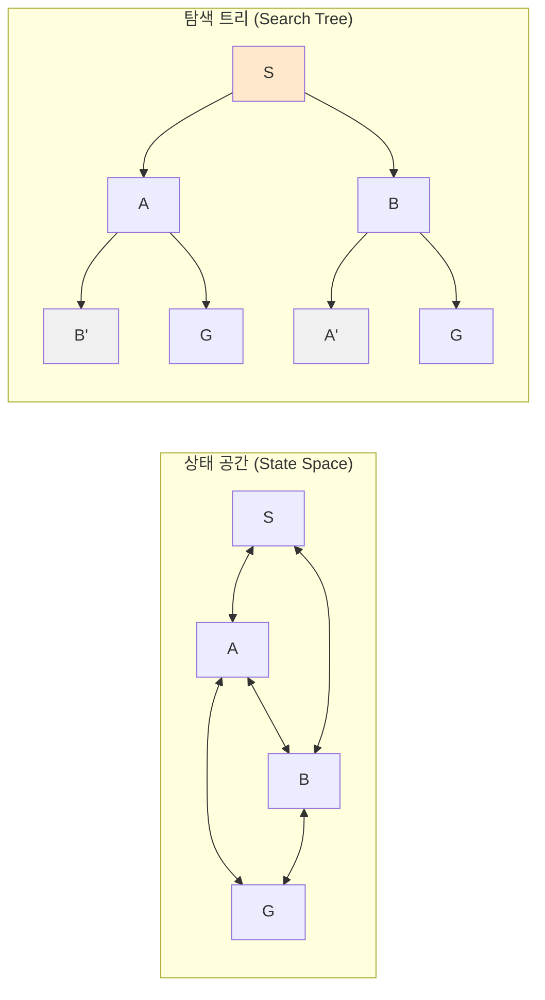

- **상태 공간 그래프**: 같은 상태는 노드 하나. 환경 자체의 표현.
- **탐색 트리**: 같은 상태가 다른 경로로 도달되면 **다른 노드**. 알고리즘이 만들어내는 구조.

탐색 트리에는 같은 상태가 반복 등장할 수 있다(위 그림의 `B'`, `A'`). 이 중복을 막는 장치가 **닫힌 집합(closed set, explored set)** 이다.

### 1.3 알고리즘 평가의 4지표

모든 탐색 알고리즘은 다음 4가지로 비교된다 (AIMA §3.3.2):

| 지표 | 질문 |
|---|---|
| **완전성 (Completeness)** | 해가 존재하면 반드시 찾는가? |
| **최적성 (Optimality)** | 찾은 해가 최저 비용 해인가? |
| **시간 복잡도 (Time)** | 시간이 얼마나 걸리는가? |
| **공간 복잡도 (Space)** | 메모리가 얼마나 필요한가? |

복잡도 표기에서 자주 등장하는 기호:

- **b** : 분기율 (branching factor) — 한 노드의 평균 자식 수
- **d** : 가장 얕은 해의 깊이 (depth of shallowest solution)
- **m** : 탐색 트리의 최대 깊이 (∞일 수 있음)

### 1.4 탐색 알고리즘 분류

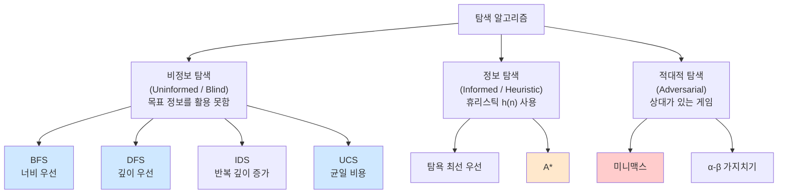

이 글은 위 트리에서 굵게 강조된 **BFS · DFS · UCS · A* · 미니맥스** (+ 알파-베타)를 다룬다.

---

## 2. 비정보 탐색 (Uninformed Search)


### 2.1 너비 우선 탐색 (BFS, Breadth-First Search)

**전략**: 현재 깊이의 모든 노드를 먼저 확장한 뒤, 다음 깊이로 내려간다. 자료구조는 **FIFO 큐**.

#### 진행 예시

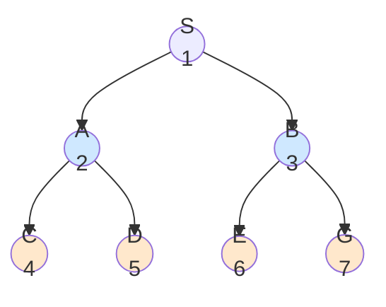

번호는 **확장 순서**다. 같은 깊이를 모두 끝내고 다음 깊이로 가는 패턴이 보인다.

#### 의사코드

```text
function BFS(problem):
    node ← Node(problem.initial_state)
    if problem.goal_test(node.state): return node
    frontier ← FIFO Queue([node])
    explored ← {}
    while frontier is not empty:
        node ← frontier.pop()
        explored.add(node.state)
        for action in problem.actions(node.state):
            child ← child_node(problem, node, action)
            if child.state not in explored ∪ frontier:
                if problem.goal_test(child.state): return child
                frontier.push(child)
    return failure
```

#### 성질 (AIMA §3.4.1)

| 지표 | 결과 |
|---|---|
| 완전성 | **완전** (b가 유한하면) |
| 최적성 | **모든 단계 비용이 같을 때만** 최적 |
| 시간 복잡도 | O(b^d) |
| 공간 복잡도 | O(b^d) — **모든 프론티어를 메모리에 유지** |

> ⚠️ **함정**: BFS가 "최단 경로를 보장한다"는 흔한 진술은 **단계 비용이 모두 동일할 때만 참**이다. 가중 그래프에서는 거짓.

> 💡 **BFS 의 진짜 약점은 메모리**. 분기율 10, 깊이 10인 트리에서 약 100억 개 노드. 시간이 견딜 만해도 메모리가 먼저 죽는다.

---

### 2.2 깊이 우선 탐색 (DFS, Depth-First Search)

**전략**: 가장 깊은 노드를 먼저 확장. 막다른 곳에 도달하면 백트래킹. 자료구조는 **LIFO 스택**(또는 재귀).

#### 진행 예시

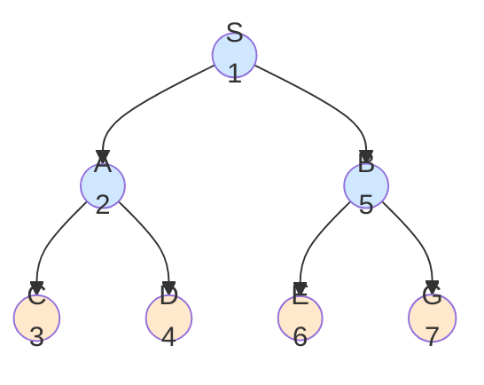

S → A → C → D → (백트랙) → B → E → G. **한 가지로 끝까지 파고든 뒤 돌아온다**.

#### 성질

| 지표 | 결과 |
|---|---|
| 완전성 | **상태 공간이 유한**할 때만 완전. 무한 깊이 그래프에서는 부분 완전 |
| 최적성 | **비최적** (얕은 해를 지나칠 수 있음) |
| 시간 복잡도 | O(b^m) — **m은 최대 깊이** |
| 공간 복잡도 | **O(bm)** — 선형! |

#### 왜 메모리가 선형인가

DFS는 항상 **루트에서 현재 노드까지의 단일 경로**와 그 경로 위 각 노드의 **확장되지 않은 형제들**만 기억하면 된다. 한 경로의 길이는 m 이하, 각 깊이마다 b개의 형제 → **O(bm)**.

이 점이 DFS의 실제 가치다. AIMA는 *"DFS는 거의 항상 BFS보다 메모리에서 우월하지만, 시간과 최적성에서는 위험"* 으로 표현한다.

> 💡 **시험 자주 등장**: BFS는 시간 효율은 같지만 **공간이 O(b^d)**, DFS는 시간이 O(b^m)이지만 **공간이 O(bm)** 이라는 트레이드오프.

---

### 2.3 (보너스) 반복 깊이 증가 탐색 (IDS)

BFS의 최적성과 DFS의 메모리 효율을 합치고 싶다면? Korf의 1985 *Artificial Intelligence* 논문[^2]에서 제안된 **반복 깊이 증가 탐색(Iterative Deepening Search, IDS)** 이 답이다.

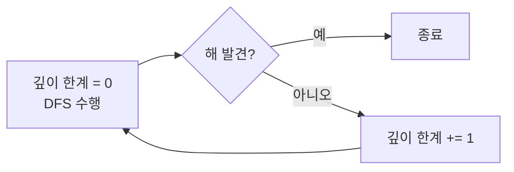

**핵심**: 깊이 제한이 있는 DFS를 **0, 1, 2, …** 점차 늘리며 반복.

| 지표 | 결과 |
|---|---|
| 완전성 | 완전 |
| 최적성 | **단계 비용이 모두 같을 때** 최적 (BFS와 동일 조건) |
| 시간 | **O(b^d)** — 같은 깊이를 여러 번 재방문하지만 점근적으로 BFS와 같음 |
| 공간 | **O(bd)** — DFS 수준 |

> 🎯 **AIMA 권장**: 비정보 탐색에서 해의 깊이 d를 모를 때 **IDS가 사실상 표준**이다. KODIT 시험에는 잘 나오지 않지만, *AIMA 권장 방법*이라는 점은 종종 출제된다.

---

### 2.4 균일 비용 탐색 (UCS, Uniform Cost Search)

**전략**: 단계 비용이 다를 때 BFS의 일반화. 지금까지 누적 비용 **g(n)** 이 가장 작은 노드를 먼저 확장한다. 자료구조는 **우선순위 큐**(키: g(n)).

#### Dijkstra와의 관계

> 💡 **UCS는 단일 출발점·양수 비용 Dijkstra의 AI 버전**이다. Dijkstra(1959)[^3]는 그래프 전체의 최단 경로 트리를 구한다면, UCS는 **목표 노드를 발견하면 즉시 종료**한다는 차이가 있다. 알고리즘 골격은 동일.

#### 진행 예시

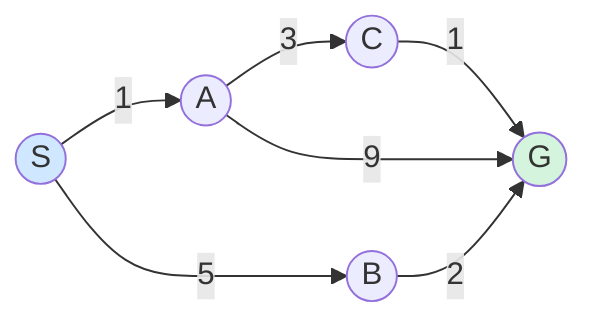

큐의 변화 (우선순위 큐 = `[(누적비용, 노드)]`):

| 단계 | 확장 노드 | 누적 g | 큐 상태 (확장 후) |
|---|---|---|---|
| 1 | S | 0 | [(1, A), (5, B)] |
| 2 | **A** (g=1) | 1 | [(4, C), (5, B), (10, G via A)] |
| 3 | **C** (g=4) | 4 | [(5, B), (5, G via C), (10, G via A)] |
| 4 | **B** (g=5) | 5 | [(5, G via C), (7, G via B), (10, G via A)] |
| 5 | **G** (g=5) | 5 | 목표 발견! 경로: S→A→C→G, 비용 5 |

#### 성질

| 지표 | 결과 |
|---|---|
| 완전성 | 단계 비용 ≥ ε > 0이면 완전 |
| 최적성 | **항상 최적** |
| 시간 복잡도 | O(b^(1 + ⌊C* / ε⌋)) — C* = 최적 비용, ε = 최소 단계 비용 |
| 공간 복잡도 | O(b^(1 + ⌊C* / ε⌋)) |

> ⚠️ **음의 비용은 다룰 수 없다**. 음수 가중치가 있으면 Bellman-Ford 같은 알고리즘이 필요하다. UCS의 최적성 증명은 *"새 노드 추가가 경로를 짧게 만들 수 없다"* 라는 단조성에 의존한다.

---

## 3. 정보 탐색 (Informed Search)


### 3.1 휴리스틱이란

**휴리스틱 함수 h(n)** 은 *"노드 n에서 목표까지의 (추정) 비용"* 이다. UCS가 *"여기까지 얼마나 왔는가"* 만 봤다면, 정보 탐색은 *"여기서 얼마나 더 가야 하는가"* 의 추정도 함께 본다.

8-퍼즐의 두 가지 고전 휴리스틱:

| 이름 | 정의 | 예시 (3개 잘못된 경우) |
|---|---|---|
| **h₁** — 잘못 놓인 타일 수 | 목표 위치가 아닌 타일 개수 | h₁ = 3 |
| **h₂** — 맨해튼 거리 합 | 각 타일이 목표까지 가야 할 행+열 거리의 합 | h₂ = 예: 2 + 1 + 3 = 6 |

> 💡 일반적으로 **h₂ ≥ h₁**. 더 큰 추정치를 주면서도 결코 과대 추정하지 않는 휴리스틱은 더 적은 노드를 확장한다 (h₂가 h₁을 *지배*한다).

### 3.2 탐욕 최선 우선 탐색 (Greedy Best-First Search)

f(n) = h(n). **목표에 가까워 보이는 노드만** 보고 확장.

- **빠르다**. 종종 BFS보다 압도적으로.
- **비최적·비완전**. 잘못된 방향으로 끌려갈 수 있다.

이 약점을 해결하는 게 다음 절의 **A***.

### 3.3 A* 알고리즘 (1968)

#### 원전

> Hart, P. E., Nilsson, N. J., & Raphael, B. (1968). *A formal basis for the heuristic determination of minimum cost paths*. **IEEE Transactions on Systems Science and Cybernetics**, 4(2), 100–107. [^4]

스탠퍼드 연구소(SRI)에서 로봇 *Shakey*의 경로 계획용으로 개발됐다. 이름 *"A*"* 는 알고리즘 *"A"* 의 **최적 버전**이라는 의미. 별표(*)는 "최적성"을 뜻한다.

#### 핵심 아이디어

A*는 **두 가지를 합쳐** 평가한다:

> **f(n) = g(n) + h(n)**

- **g(n)** : 시작에서 n까지의 실제 누적 비용 (UCS가 보던 것)
- **h(n)** : n에서 목표까지의 추정 비용 (휴리스틱)
- **f(n)** : 시작 → 목표까지 *n을 거치는* 경로의 추정 총 비용

그리고 **f(n)이 최소인 노드를 먼저 확장**한다.

#### 두 가지 핵심 조건: 허용성과 일관성

A*가 최적 해를 보장하려면 휴리스틱 h가 만족해야 할 조건이 있다.

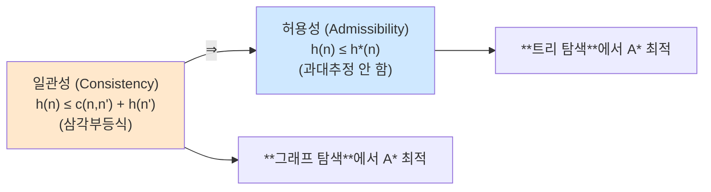

| 조건 | 정의 | 의미 |
|---|---|---|
| **허용성** | 모든 n에 대해 **h(n) ≤ h*(n)** (실제 최적 비용을 절대 과대 추정하지 않음) | **트리 탐색** A*가 최적 해를 찾기에 충분 |
| **일관성** (단조성) | 모든 인접 노드 n, n'에 대해 **h(n) ≤ c(n, n') + h(n')** | **그래프 탐색** A*가 최적 해를 찾기에 충분 |

**일관성 ⇒ 허용성** (역은 성립하지 않음).

> 🎯 **시험 포인트**:
> - 허용성: *"휴리스틱이 너무 욕심부리지 않는다"*
> - 일관성: *"한 칸 갈 때 g가 늘어난 만큼 h가 더 줄어들지 않는다"* (삼각부등식)
> - 8-퍼즐의 h₁(잘못 놓인 타일), h₂(맨해튼 거리)는 **둘 다 허용적이고 일관성 있다**

#### 성질

| 지표 | 결과 |
|---|---|
| 완전성 | 단계 비용 ≥ ε > 0, h가 허용적이면 완전 |
| 최적성 | h 허용적 → 트리 탐색 최적 / h 일관적 → 그래프 탐색 최적 |
| 시간 복잡도 | 최악 O(b^d) — 휴리스틱이 좋을수록 줄어듦 |
| 공간 복잡도 | O(b^d) — **A*의 가장 큰 약점** |
| 최적 효율성 | **같은 휴리스틱을 쓰는 어떤 최적 알고리즘도 A*보다 적은 노드를 확장하지 못한다**[^4] |

#### 의사코드

```text
function A_STAR(problem, h):
    node ← Node(problem.initial_state, g=0)
    frontier ← Priority Queue keyed by f = g + h, with [node]
    explored ← {}
    while frontier is not empty:
        node ← frontier.pop()  # f가 최소인 노드
        if problem.goal_test(node.state): return node
        explored.add(node.state)
        for action in problem.actions(node.state):
            child ← child_node(problem, node, action)
            if child.state not in explored ∪ frontier:
                frontier.push(child)
            elif child.state in frontier with higher path cost:
                replace it
    return failure
```

#### 작은 예시

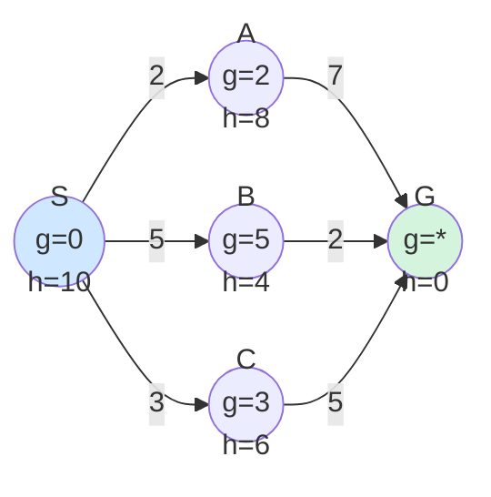

f 값:
- **f(A) = 2 + 8 = 10**
- **f(B) = 5 + 4 = 9** ← 최소
- **f(C) = 3 + 6 = 9** ← 동일

B를 먼저 확장 → G에 도달, 비용 7. C 경로(8), A 경로(9)와 비교해 **B 경로가 최적**.

---

## 4. 적대적 탐색 (Adversarial Search)

지금까지는 *"환경은 가만히 있고 나만 행동"* 인 단일 에이전트 문제였다. 게임은 다르다 — **상대 에이전트가 내 손해를 최대화하려 한다**. 여기서 등장하는 게 미니맥스다.

### 4.1 미니맥스 (Minimax)

#### 원전과 직관

> John von Neumann (1928). *Zur Theorie der Gesellschaftsspiele*. **Mathematische Annalen**, 100(1), 295–320. [^5]

폰 노이만의 1928년 게임 이론 논문에서 출발. *"내 차례에는 점수를 최대화, 상대 차례에는 (상대가) 점수를 최소화"* 한다고 가정하고 게임 트리를 평가한다.

#### 게임 트리

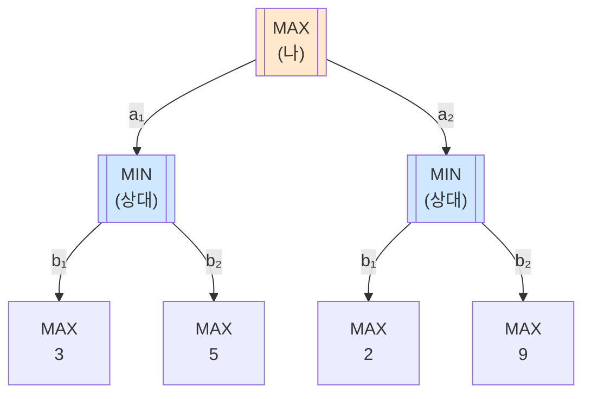

평가 (말단부터 거슬러 올라옴):

1. 말단 효용: 3, 5, 2, 9
2. **MIN 노드**: min(3, 5) = **3**, min(2, 9) = **2**
3. **MAX 노드** (루트): max(3, 2) = **3**

따라서 MAX는 **a₁** 을 선택한다 (보장 점수 3).

#### 의사코드

```text
function MINIMAX(state):
    if terminal(state): return UTILITY(state)
    if MAX's turn:
        return max over a in actions(state) of MINIMAX(RESULT(state, a))
    else:  # MIN's turn
        return min over a in actions(state) of MINIMAX(RESULT(state, a))
```

#### 성질

| 지표 | 결과 |
|---|---|
| 완전성 | 트리가 유한하면 완전 |
| 최적성 | **상대도 최적이라 가정**하면 최적 |
| 시간 복잡도 | **O(b^m)** — 분기율 b, 트리 깊이 m |
| 공간 복잡도 | O(bm) — DFS 구조 |

체스의 b ≈ 35, m ≈ 80에서 b^m ≈ 10^123. 우주의 원자 수보다 많다. **그대로 쓸 수 없다**. 두 가지 해결책:

1. **알파-베타 가지치기** — 결과는 같게, 탐색량을 줄임
2. **깊이 제한 + 평가 함수** — 끝까지 안 가고 중간에 자름 (체스 엔진의 표준)

### 4.2 알파-베타 가지치기 (Alpha-Beta Pruning)


#### 원전

> Knuth, D. E., & Moore, R. W. (1975). *An analysis of alpha-beta pruning*. **Artificial Intelligence**, 6(4), 293–326. [^6]

(McCarthy가 1950년대 후반에 비공식적으로 제안한 것을 Knuth & Moore가 형식 분석.)

#### 핵심 아이디어

미니맥스를 그대로 수행하되, **이미 더 좋은 선택지가 있다면 나머지 가지를 탐색하지 않는다**.

- **α (alpha)**: MAX가 지금까지 보장받은 **최선 점수의 하한**
- **β (beta)**: MIN이 지금까지 보장받은 **최악 점수의 상한**

탐색 중 어느 노드의 값이 **α ≥ β** 가 되면 부모 입장에서 그 가지는 **선택될 수 없으므로** 더 이상 탐색하지 않는다.

#### 가지치기 예시

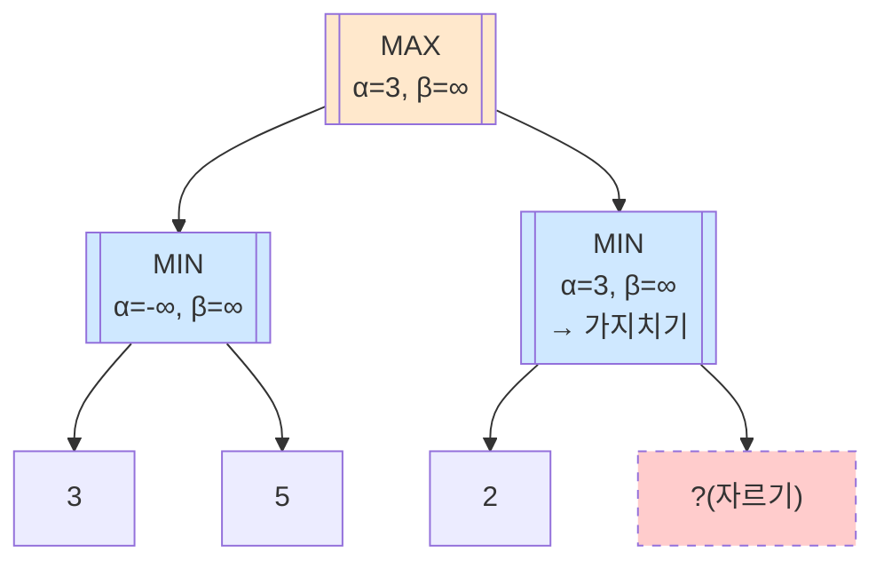

진행:

1. 왼쪽 MIN 노드: 자식 3, 5 → min = **3**. MAX의 α = 3.
2. 오른쪽 MIN 노드 첫 자식: **2**. MIN은 ≤ 2를 보장. 그런데 MAX는 이미 α = 3이라 *MIN 노드 값이 2 이하면 어차피 안 고름*.
3. → **나머지 자식(?) 탐색 불필요**. **β-cut**.

#### 성질

| 지표 | 결과 |
|---|---|
| 결과 정확성 | **미니맥스와 항상 동일** |
| 최악 시간 (정렬 안 됐을 때) | O(b^m) |
| **최선 시간 (완벽 정렬)** | **O(b^(m/2))** = **O(√(b^m))** |
| 효과 | 같은 시간에 **두 배 깊이까지** 탐색 가능 |

> 🎯 **시험 직출**: 알파-베타의 best case = **O(b^(m/2))**. 즉 *"같은 시간에 미니맥스의 두 배 깊이까지 갈 수 있다"*. 이 한 줄이 거의 매년 나온다.

> 💡 **노드 정렬이 중요한 이유**: 좋은 수를 먼저 탐색해야 가지치기 효과가 극대화된다. 체스 엔진은 *킬러 휴리스틱*, *반복 깊이 증가*를 통해 이전 반복의 최선 수를 다음 반복의 첫 후보로 쓴다.

---

## 5. 알고리즘 비교 종합

### 5.1 5대 알고리즘 한 표 비교

| 알고리즘 | 자료구조 | 완전성 | 최적성 | 시간 | 공간 |
|---|---|---|---|---|---|
| **BFS** | FIFO Queue | ✅ | ✅ (단계 비용 동일 시) | O(b^d) | O(b^d) |
| **DFS** | LIFO Stack | ⚠️ 유한 공간만 | ❌ | O(b^m) | **O(bm)** |
| **IDS** | LIFO + 깊이 제한 | ✅ | ✅ (단계 비용 동일 시) | O(b^d) | O(bd) |
| **UCS** | Priority Queue (g) | ✅ | ✅ | O(b^(1+⌊C*/ε⌋)) | O(b^(1+⌊C*/ε⌋)) |
| **A*** | Priority Queue (g+h) | ✅ | ✅ (h 허용/일관) | ≤ O(b^d) | O(b^d) |
| **미니맥스** | Recursion (DFS) | ✅ (유한 트리) | ✅ (vs 최적 상대) | O(b^m) | O(bm) |
| **α-β 가지치기** | Recursion + α/β | ✅ | ✅ | best **O(b^(m/2))** | O(bm) |

### 5.2 의사결정 가이드

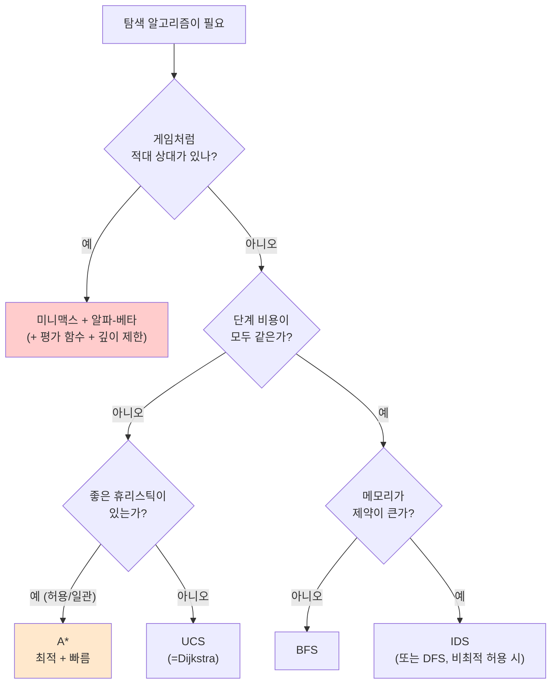

---

## 6. 헷갈리는 것 / 자주 묻는 질문

### Q1. "BFS는 항상 최단 경로를 찾는다"는 맞나?

**아니다.** *"단계 비용이 모두 같을 때만"* 이다. 단계 비용이 다르면 UCS나 A*가 필요하다. KODIT 같은 시험에서 자주 함정으로 나오는 진술.

### Q2. UCS와 Dijkstra는 같은 알고리즘인가?

**거의 같다**. UCS는 *목표 도달 즉시 종료*, Dijkstra는 *모든 노드의 최단 경로*를 계산한다는 차이만 있다. 핵심 자료구조(우선순위 큐)와 갱신 규칙은 동일.

### Q3. h(n) = 0 이면?

A*는 **UCS가 된다**. f(n) = g(n) + 0 = g(n)이므로. 즉 UCS는 A*의 *휴리스틱이 없는 특수 케이스*.

### Q4. 일관성이 있는데 허용성이 없는 휴리스틱이 존재할 수 있나?

**불가능**. 일관성 → 허용성은 증명된 함의 관계다 (귀납으로 증명). 단, **허용적인데 일관성이 없는** 휴리스틱은 존재한다.

### Q5. A*가 최적 효율적이라는 말은 정확히 무슨 뜻?

**같은 휴리스틱 h를 쓰는 어떤 최적 탐색 알고리즘도, A*가 확장한 노드 집합의 (엄밀한) 부분집합만 확장할 수는 없다.** 즉 *"같은 정보로 더 빨리 풀 수 없다"* 는 의미. (이 명제는 *strict pessimist tie-breaking* 가정 하에서 성립한다 — 자세히는 AIMA §3.5.2.)

### Q6. 미니맥스의 가정 — *상대도 최적*은 현실적인가?

이론적으로는 보장이 강하지만, 현실 게임에서는 **상대가 실수**할 수 있다. *Expectiminimax* 등은 상대 행동에 확률 분포를 도입한다. KODIT은 보통 표준 미니맥스의 가정만 출제.

### Q7. 알파-베타의 노드 정렬 — 실제로 어떻게 하나?

체스 엔진에서 통용되는 휴리스틱:

- **PV-move (Principal Variation)**: 이전 반복의 최선 수를 가장 먼저
- **킬러 휴리스틱**: 같은 깊이에서 다른 형제 노드를 자른 수를 우선
- **MVV-LVA**: 가장 가치 있는 말을 가장 적은 가치 말로 잡는 수

### Q8. A*의 메모리 한계를 극복하는 방법은?

- **IDA*** (Iterative Deepening A*) — A*에 IDS 아이디어 적용. 메모리 O(bd), 시간은 약간 증가
- **SMA*** (Simplified Memory-bounded A*) — 사용 가능한 메모리만 쓰고 가장 안 좋은 노드부터 버림
- **RBFS** (Recursive Best-First Search) — 재귀 기반, 메모리 O(bd)

이 셋은 KODIT 출제 빈도가 낮지만 AIMA 5장에 정리되어 있다.

---

## 7. 시험 직전 1분 요약

> A4 한 장에 들어가는 압축본.

### 핵심 7

1. **탐색 문제 5요소** — 초기 상태 / 행동 / 전이 모델 / 목표 검사 / 경로 비용
2. **평가 4지표** — 완전성 / 최적성 / 시간 / 공간 (b, d, m 표기)
3. **BFS** — FIFO, **단계 비용 동일 시 최적**, 시간·공간 모두 O(b^d)
4. **DFS** — LIFO, 비최적, 시간 O(b^m), **공간 O(bm) 선형**
5. **UCS** — 우선순위 큐 (g), Dijkstra의 AI 버전, **항상 최적**
6. **A*** — f = g + h, **허용성 → 트리 최적, 일관성 → 그래프 최적**, 최적 효율적
7. **미니맥스** — O(b^m), **알파-베타 best case O(b^(m/2))** ← 두 배 깊이

### 한 줄 비교 표

| 알고리즘 | 시간 | 공간 | 최적? |
|---|---|---|---|
| BFS | O(b^d) | O(b^d) | △ (균일 비용) |
| DFS | O(b^m) | **O(bm)** | ✗ |
| UCS | O(b^{1+C*/ε}) | O(b^{1+C*/ε}) | ✓ |
| A* | ≤ O(b^d) | O(b^d) | ✓ (h 허용/일관) |
| Minimax | O(b^m) | O(bm) | ✓ (vs 최적 상대) |
| α-β | best **O(b^(m/2))** | O(bm) | ✓ |

### 자주 헷갈리는 한 마디

- *"BFS는 무조건 최단 경로"* → **거짓**, 단계 비용 동일할 때만
- *"Dijkstra ≡ UCS"* → 거의 참 (목표 발견 시 종료만 다름)
- *"h(n) = 0 → A* = UCS"* → **참**
- *"일관성 ⇒ 허용성"* → **참**, 역은 거짓
- *"알파-베타는 결과를 바꾼다"* → **거짓**, 결과 동일·시간만 단축

---

## 8. 다음 학습

이 글로 *"단일 에이전트가 어떻게 행동을 계획하는가"* 의 토대가 잡혔다. 다음 시리즈에서는 그 위에 **"세계를 어떻게 표현하고 추론할 것인가"** 가 올라간다.

- 📌 **[AI개론 ③] 지식 표현과 추론**: 명제·술어 논리 / 시맨틱 네트워크 / 베이즈 네트워크
- 📌 **[AI개론 ④] 현대 AI**: NLP · CV · LLM · 생성 모델

---

## 9. 참고 문헌 (References)

[^1]: Russell, S. J., & Norvig, P. (2020). *Artificial Intelligence: A Modern Approach* (4th ed.). Pearson. (특히 Ch. 3 "Solving Problems by Searching", Ch. 5 "Adversarial Search and Games")

[^2]: Korf, R. E. (1985). Depth-first iterative-deepening: An optimal admissible tree search. *Artificial Intelligence*, 27(1), 97–109. [DOI: 10.1016/0004-3702(85)90084-0](https://doi.org/10.1016/0004-3702(85)90084-0)

[^3]: Dijkstra, E. W. (1959). A note on two problems in connexion with graphs. *Numerische Mathematik*, 1, 269–271. [DOI: 10.1007/BF01386390](https://doi.org/10.1007/BF01386390)

[^4]: Hart, P. E., Nilsson, N. J., & Raphael, B. (1968). A formal basis for the heuristic determination of minimum cost paths. *IEEE Transactions on Systems Science and Cybernetics*, 4(2), 100–107. [DOI: 10.1109/TSSC.1968.300136](https://doi.org/10.1109/TSSC.1968.300136)

[^5]: von Neumann, J. (1928). Zur Theorie der Gesellschaftsspiele. *Mathematische Annalen*, 100(1), 295–320. [DOI: 10.1007/BF01448847](https://doi.org/10.1007/BF01448847)

[^6]: Knuth, D. E., & Moore, R. W. (1975). An analysis of alpha-beta pruning. *Artificial Intelligence*, 6(4), 293–326. [DOI: 10.1016/0004-3702(75)90019-3](https://doi.org/10.1016/0004-3702(75)90019-3)

### 보조 자료 (교차검증용)

- Berkeley CS188 — *Introduction to Artificial Intelligence*. <https://inst.eecs.berkeley.edu/~cs188/textbook/search/uninformed.html>
- Stanford CS221 — *Search: A* Slides*. <https://stanford-cs221.github.io/>
- Wikipedia — A* search algorithm, Alpha-beta pruning. <https://en.wikipedia.org/wiki/A*_search_algorithm>

---

## 부록 A: 이미지 생성 프롬프트 (다이어그램으로 표현 어려운 경우 참고)

> 본문은 Mermaid로 거의 모든 시각화를 처리했다. 추가 이미지가 필요할 때만 사용.

### A1. Hero 이미지 (포스트 상단용 — `search_hero.png`)

> 📁 저장 경로: `/assets/images/ai-introduction/search_hero.png`

```
Minimalist isometric illustration of search algorithms in AI:
a stylized graph/tree on the left half with nodes connected by edges in
varying weights, and a robotic agent on the right exploring the graph with
glowing path traces in different colors. Two figures facing each other in
a small inset representing minimax. Soft pastel palette (sky blue, warm beige,
charcoal accents). Clean white background. Vector flat design. 16:9.

CRITICAL: 이미지 내 모든 문자/라벨은 반드시 한글로 표시. 영문 텍스트 금지
(단, 알고리즘 약어 BFS, DFS, A*는 영문 그대로 유지 가능).
라벨: 색깔별 경로에 "BFS (파랑)", "DFS (초록)", "A* (빨강)",
미니맥스 인셋 두 인물에 "MAX (나)"와 "MIN (상대)".
```

### A2. BFS vs DFS 시각 비교 (`bfs_vs_dfs.png`)

> 📁 저장 경로: `/assets/images/ai-introduction/bfs_vs_dfs.png`

```
Side-by-side educational illustration. Left panel shows a tree being explored
level by level with concentric ripples expanding from the root. Right panel
shows the same tree with a single deep arrow piercing down one branch then
backtracking. Below each, a small box indicates memory complexity. Clean
infographic style, two accent colors (blue, orange). 16:9.

CRITICAL: 이미지 내 모든 문자/라벨은 반드시 한글로 표시. 영문 텍스트 금지
(단, BFS, DFS 약어와 수학 표기 O(b^d), O(bm)는 그대로 유지).
라벨:
- 왼쪽 패널 제목: "너비 우선 탐색 (BFS)"
- 오른쪽 패널 제목: "깊이 우선 탐색 (DFS)"
- 메모리 박스: "메모리: O(b^d)" / "메모리: O(bm)"
```

### A3. A* 휴리스틱 직관 (`astar_heuristic.png`)

> 📁 저장 경로: `/assets/images/ai-introduction/astar_heuristic.png`

```
Diagram-style illustration of A* heuristic search on a 2D grid map.
A start node on the left, a goal on the right. Concentric contour lines
emanating from the goal represent decreasing h(n) values. A glowing path
is drawn from start to goal, hugging the contour gradient — suggesting the
algorithm feels its way toward the goal. Obstacles drawn as gray blocks.
Clean technical illustration, one accent color, white background. 16:9.

CRITICAL: 이미지 내 모든 문자/라벨은 반드시 한글로 표시. 영문 텍스트 금지
(단, 알고리즘명 A*와 수식 h(n)은 그대로 유지).
라벨: 시작점 "출발 (S)", 도착점 "목표 (G)", 장애물 영역 "장애물",
등고선 옆 "휴리스틱 h(n)", 경로 위 "탐색 경로".
```

### A4. 알파-베타 가지치기 (`alpha_beta_pruning.png`)

> 📁 저장 경로: `/assets/images/ai-introduction/alpha_beta_pruning.png`

```
Stylized minimax game tree with three levels. Some leaves and their parent
edges shown bright with values; others are crossed out with a red tag and
a dashed border, indicating branches not explored. Triangular icons
distinguish two types of nodes (▲ and ▼). Clean infographic style, 16:9,
white background.

CRITICAL: 이미지 내 모든 문자/라벨은 반드시 한글로 표시. 영문 텍스트 금지
(단, 그리스 문자 α, β와 노드 유형 약어 MAX, MIN은 그대로 유지 가능).
라벨: 노드 라벨 "MAX (▲)", "MIN (▼)", 잘려나간 가지에 "가지치기" 태그,
α/β 값 표기 옆에 한글 설명 "α (최선 하한)", "β (최악 상한)".
```

> 💡 위 프롬프트는 모두 본문 텍스트에 의존하지 않는 자기-완결형 이미지를 만들도록 작성됐다.

---

> ✍️ **다음 학습**: [[AI개론 ③] 지식 표현과 추론 (명제·술어 논리 · 시맨틱 네트워크 · 베이즈 네트워크)](/ai/ai-introduction-knowledge-representation/) — 작성 완료.
