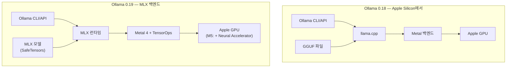
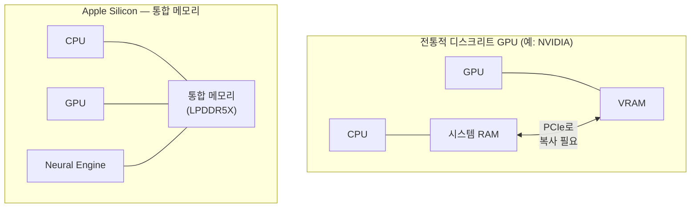
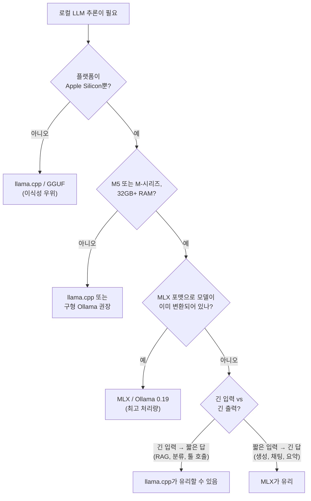

## 들어가며 (TL;DR)

2026년 3월 31일, Ollama가 0.19 프리뷰를 공개하면서 Apple Silicon에서의 추론 백엔드를 **llama.cpp의 Metal 백엔드에서 Apple의 MLX로 교체**했습니다. 같은 모델, 같은 Mac에서 prefill은 약 1.6배, decode는 약 2배 빨라졌습니다. M5의 새로운 GPU "Neural Accelerator"를 본격적으로 쓰기 시작한 게 핵심이고요.

이 글은 한 번에 정리합니다.

- **무엇이 바뀌었나** — Ollama 0.18 → 0.19, 백엔드 스택 비교
- **MLX란 무엇인가** — 통합 메모리 위에서 동작하는 배열 프레임워크
- **왜 빨라졌나** — M5 Neural Accelerator + prefill/decode 병목 구조
- **NVFP4가 뭔데 첫 모델이 NVIDIA 포맷?** — 양자화 포맷 비교
- **그럼 llama.cpp/GGUF는 끝났나?** — 언제 무엇을 써야 하나
- **실전 사용법, 한계, FAQ**

> ⚠️ **주의**: Ollama 0.19는 **프리뷰**입니다. 32GB 이상 통합 메모리를 가진 Apple Silicon Mac이 필요하고, 초기에는 단 하나의 모델만 지원합니다. 일상 도구로 쓰기엔 아직 거칩니다.

---

## 1. 무엇이 바뀌었나: Ollama 0.18 vs 0.19

### 같은 모델, 다른 엔진

Ollama는 그동안 Apple Silicon에서 [llama.cpp](https://github.com/ggml-org/llama.cpp)의 Metal 백엔드 위에서 돌았습니다. 0.19부터는 그 자리를 **Apple의 [MLX](https://github.com/ml-explore/mlx)** 가 대신합니다. 모델 파일 포맷도 GGUF에서 SafeTensors 기반의 MLX 포맷으로 바뀝니다.



### 공식 벤치마크 (Ollama 블로그, M-시리즈, Qwen3.5-35B-A3B 코딩 모델)

| 단계 | 0.18 (llama.cpp Metal) | 0.19 (MLX) | 향상 |
|---|---|---|---|
| **Prefill** (입력 처리) | 1,154 tok/s | **1,810 tok/s** | **약 1.57×** |
| **Decode** (토큰 생성) | 58 tok/s | **112 tok/s** | **약 1.93×** |

> 출처: [Ollama Blog — *Ollama is now powered by MLX on Apple Silicon in preview*](https://ollama.com/blog/mlx).

여기서 두 단계의 의미가 헷갈릴 수 있는데, 잠깐 짚고 갑니다.


- **Prefill**은 행렬 곱이 압도적으로 큰 **연산 집약(compute-bound)** 단계입니다. 첫 토큰이 나오기까지 걸리는 시간(TTFT)을 결정합니다.
- **Decode**는 매 스텝마다 모델 가중치를 메모리에서 한 번씩 읽어야 하므로 **메모리 대역폭 집약(memory-bandwidth-bound)** 단계입니다. 응답이 나오는 속도, 즉 사용자가 체감하는 "타이핑 속도"를 결정합니다.

이 두 단계가 **다른 자원에 묶여 있다**는 점이 다음 절의 M5 이야기와 직결됩니다.

---

## 2. MLX란 무엇인가

[MLX](https://github.com/ml-explore/mlx)는 Apple이 2023년 12월 오픈소스로 공개한 **Apple Silicon용 배열 프레임워크**입니다. NumPy/PyTorch/JAX의 디자인을 합쳐놓은 모양새인데, 다음 네 가지가 핵심입니다.

1. **NumPy/PyTorch와 비슷한 API** — Python·Swift·C++·C에서 모두 사용 가능
2. **Lazy 평가** — 연산은 그래프로 빌드되고, `eval()`이 호출될 때 비로소 실행됩니다. 커널 퓨전·런치 오버헤드 감소·다중 연산 최적화에 유리합니다.
3. **함수 변환(Function Transformations)** — `grad`, `vmap` 같은 JAX 스타일 변환을 지원합니다.
4. **통합 메모리(Unified Memory) 모델** — 가장 중요한 차별점입니다.

### MLX의 통합 메모리 모델

전통적인 GPU 컴퓨팅에서는 호스트(CPU) 메모리와 디바이스(GPU) 메모리가 분리되어 있어, 데이터를 GPU로 "복사"해야 했습니다. PyTorch의 `.cuda()`나 `.to(device)`가 그 역할이죠. Apple Silicon은 CPU·GPU·Neural Engine이 **같은 물리 메모리 풀(LPDDR5X)** 을 공유합니다.



MLX는 이 구조를 **API 차원에서** 그대로 노출합니다. 배열은 디바이스에 묶이지 않고, **연산이 디바이스를 선택**합니다.

```python
import mlx.core as mx

a = mx.random.normal((100,))
b = mx.random.normal((100,))

# 같은 배열에 CPU·GPU 연산을 자유롭게 섞어 쓸 수 있다 (복사 없음)
c = mx.add(a, b, stream=mx.cpu)
d = mx.add(a, c, stream=mx.gpu)  # 의존성은 스케줄러가 알아서 처리
```

LLM 추론에서는 이 점이 특히 중요합니다. **KV 캐시가 통합 메모리 안에 그대로 살아있을 수 있다**는 뜻이거든요. llama.cpp의 Metal 백엔드도 통합 메모리를 활용하긴 하지만, 내부 추상화는 여전히 "범용 GPU"를 가정합니다. MLX는 처음부터 이 구조에 맞춰 설계됐습니다.

> 📚 출처: [MLX 공식 문서 — Unified Memory](https://ml-explore.github.io/mlx/build/html/usage/unified_memory.html), [GitHub: ml-explore/mlx](https://github.com/ml-explore/mlx).

---

## 3. M5 Neural Accelerator: prefill이 왜 그렇게 빨라졌나

Apple은 2025년 10월 M5를 발표하면서 **GPU 코어 안에 "Neural Accelerator"라는 전용 행렬 곱 유닛**을 새로 넣었습니다. NVIDIA의 Tensor Core, 구글 TPU의 MXU와 같은 계보의 하드웨어입니다.

이걸 소프트웨어에서 쓰려면 **Metal 4의 TensorOps와 Performance Primitives**를 통해야 하고, MLX는 이미 여기에 맞춰져 있습니다. llama.cpp의 일반 Metal 셰이더 경로보다 훨씬 직접적으로 하드웨어를 두드릴 수 있는 구조입니다.

### Apple Machine Learning Research 자체 벤치마크 (M5 vs M4)

Apple이 공식 블로그에 공개한 수치는 두 단계의 차이를 깔끔하게 보여줍니다.

| 모델 | Time-to-First-Token (prefill) | Token Generation (decode) |
|---|---|---|
| Qwen 1.7B | **3.57×** | 1.19~1.27× |
| Qwen 8B (BF16) | **3.62×** | 1.19~1.27× |
| Qwen 14B (4-bit) | **4.06×** | 1.19~1.27× |
| Qwen 30B MoE | **3.52×** | 1.19~1.27× |

> 출처: [Apple Machine Learning Research — *Exploring LLMs with MLX and the Neural Accelerators in the M5 GPU*](https://machinelearning.apple.com/research/exploring-llms-mlx-m5).

왜 prefill만 4배 가까이 뛰고, decode는 1.2배 정도밖에 안 오를까요? 1절에서 본 두 단계의 병목 구조 때문입니다.

- **Prefill (compute-bound)** — 새로운 행렬 곱 가속기를 정통으로 활용 → **대폭 향상**
- **Decode (memory-bandwidth-bound)** — 메모리 대역폭이 정직하게 결정 → **메모리 대역폭이 늘어난 만큼만 향상**

M5는 LPDDR5X 9600 MT/s를 써서 메모리 대역폭이 **120 GB/s(M4) → 153.6 GB/s(M5)** 로 약 **28% 증가**했습니다. decode 향상폭(약 19~27%)이 이 숫자와 거의 일치하죠. 우연이 아닙니다.

### M5 라인업 메모리 대역폭

| 칩 | 최대 통합 메모리 | 메모리 대역폭 |
|---|---|---|
| M5 | 32 GB | 153.6 GB/s |
| M5 Pro | 64 GB | 307 GB/s |
| M5 Max (32-core GPU) | 128 GB | 460 GB/s |
| M5 Max (40-core GPU) | 128 GB | **614 GB/s** |

> 출처: [Apple Newsroom — *Apple debuts M5 Pro and M5 Max…*](https://www.apple.com/newsroom/2026/03/apple-debuts-m5-pro-and-m5-max-to-supercharge-the-most-demanding-pro-workflows/), [MacBook Pro tech specs](https://support.apple.com/en-us/126318).

큰 모델일수록 decode 속도가 곧 **메모리 대역폭**이라는 직관이 여기서도 그대로 통합니다. 35B MoE 모델을 쾌적하게 돌리고 싶으면 Max를 노려야 합니다.

---

## 4. NVFP4: 왜 Apple 시연에 NVIDIA 양자화 포맷이?

Ollama 0.19의 첫 공식 모델은 `qwen3.5:35b-a3b-coding-nvfp4` (약 22GB)입니다. 이름 뒤에 붙은 **NVFP4**가 어색하게 느껴질 수 있습니다. NVIDIA의 포맷이 왜 Apple Silicon 시연에 등장하죠?

### NVFP4란

NVFP4는 NVIDIA가 Blackwell GPU와 함께 발표한 **4-bit 부동소수점 양자화 포맷**입니다. 핵심 스펙은:

- **데이터 비트**: 4-bit, **E2M1** (1 sign + 2 exponent + 1 mantissa)
- **블록 크기**: **16개** 값마다 공유 스케일
- **2단계 스케일링**:
  - 블록 스케일: **FP8 (E4M3)** — 8-bit, 정수 거듭제곱이 아닌 1.5×, 2.5× 같은 분수 스케일 가능
  - 텐서 스케일: **FP32**

이 설계 덕분에 정확도 손실이 매우 작으면서(주요 LLM 태스크에서 FP8 대비 1% 이내) 메모리는 ~3× 줄어듭니다.

### NVFP4 vs MXFP4

NVFP4는 **OCP Microscaling**(MXFP4)의 후속/개선판으로 보면 됩니다.

| 항목 | MXFP4 | NVFP4 |
|---|---|---|
| 비트 폭 | 4-bit (E2M1) | 4-bit (E2M1) |
| 블록 크기 | 32 | **16** (절반 — 더 세밀한 스케일) |
| 블록 스케일 포맷 | UE8M0 (8-bit, 2의 거듭제곱) | **E4M3 (8-bit FP8, 분수 스케일)** |
| 텐서 스케일 | 없음 | FP32 (2단계 스케일링) |
| 정확도 (대 FP8) | 손실 큼 | **약 1% 이내** |

> 출처: [NVIDIA Technical Blog — *Introducing NVFP4*](https://developer.nvidia.com/blog/introducing-nvfp4-for-efficient-and-accurate-low-precision-inference/).

### 그래서 왜 Ollama 시연에 NVFP4?

흥미로운 부분입니다. NVFP4는 NVIDIA Blackwell의 5세대 텐서 코어가 **하드웨어 네이티브로** 처리하도록 설계됐지만, 포맷 자체는 공개 사양이라 누구나 구현할 수 있습니다. Apple은 같은 블로그에서 자체 모델은 **MXFP4**도 함께 시연했고, 이번 Ollama 시연에서는 NVFP4 가중치를 MLX 런타임이 디퀀타이즈해서 처리하는 식이라는 의미입니다.

요점만 요약하면:

- 4-bit 클래스 양자화는 35B-A3B 같은 모델을 **22GB 메모리에 욱여넣기 위해** 필수
- NVFP4는 4-bit 중에서도 정확도 보존이 좋은 편이라 코딩 모델 같은 정밀한 태스크에 무난
- "NVIDIA 포맷"이라는 이름과 별개로, Apple/MLX 진영에서도 채택할 가치가 있어서 채택

> ⚠️ Ollama 측은 "다음에는 int4 변형도 1,851 tok/s prefill, 134 tok/s decode를 낼 것으로 보인다"고 밝혀, 양자화 포맷별 변형은 계속 늘어날 전망입니다.

---

## 5. 그럼 llama.cpp/GGUF는 끝났나? — 언제 무엇을 쓸지

결론부터 말하면 **아니요**. Ollama가 MLX로 갈아탄 건 "Apple Silicon에서의 최적 백엔드"를 바꾼 거지, 생태계 전체의 패권 이동은 아닙니다.

### 두 진영의 강점

| 항목 | MLX | llama.cpp / GGUF |
|---|---|---|
| 플랫폼 | **Apple Silicon 전용** | Mac/Linux/Windows/Android — 거의 모든 곳 |
| 메모리 모델 | 통합 메모리 1급 시민 | Apple Silicon에서도 통합 메모리 활용하지만 추상화는 범용 |
| 모델 포맷 | SafeTensors + JSON 디렉터리 | **GGUF 단일 파일 (자체 완결, 메타·토크나이저 포함)** |
| 모델 가용성 | 점점 늘고 있으나 GGUF에 비해 부족 | **사실상 모든 오픈 모델이 출시 직후 제공됨** |
| 양자화 종류 | MXFP4·NVFP4·int4 등 도입 중 | Q2~Q8, K-quants, IQ 등 매우 다양 |
| 긴 입력 prefill | 짧은 입력엔 빠르나, 매우 긴 컨텍스트에선 FlashAttention 적용된 llama.cpp가 우위라는 보고 존재 | FlashAttention 활성화 시 강함 |
| 사용자층 | Python·Swift 개발자, M-시리즈 우선 | 임베디드·서버·이식성 중시 |

> 참고: [Ante Kapetanovic — Ollama vs. llama.cpp vs. MLX with Qwen3.5 35B on Apple Silicon](https://antekapetanovic.com/blog/qwen3.5-apple-silicon-benchmark/), [famstack.dev — MLX vs llama.cpp on Apple Silicon](https://famstack.dev/guides/mlx-vs-gguf-apple-silicon/), [Contra Collective — llama.cpp vs MLX vs Ollama vs vLLM](https://contracollective.com/blog/llama-cpp-vs-mlx-ollama-vllm-apple-silicon-2026).

### 실전 의사결정 흐름



요약하면, Ollama 0.19는 "Apple Silicon에서 코드/생성 위주의 로컬 LLM을 가장 빠르게 돌리는 방법"이지, "모든 워크로드의 정답"이 아닙니다.

---

## 6. 실전 사용법

### 사전 요건

- macOS, **Apple Silicon** (M1 이상, 권장: M5 라인업)
- **통합 메모리 32GB 이상** (Ollama 공식 요구 사항)
- Ollama **0.19 이상**

### 설치 / 업데이트

```bash
# 신규 설치
brew install ollama
# 이미 깔려 있으면 업데이트
brew upgrade ollama
```

또는 [ollama.com/download](https://ollama.com/download)에서 직접 받을 수 있습니다. 버전 확인:

```bash
ollama --version
# 0.19.x 이상이어야 합니다
```

### 모델 받기 / 실행

현재 0.19 프리뷰에서 공식 검증된 MLX 모델은 한 종류입니다.

```bash
ollama run qwen3.5:35b-a3b-coding-nvfp4
```

처음 실행 시 약 22GB의 가중치를 다운로드합니다. 다운로드가 끝나면 그대로 채팅 프롬프트로 이어집니다.

### Claude Code 등 외부 도구와 연동

Ollama는 OpenAI 호환 API를 그대로 제공합니다. Claude Code 같은 도구에서 로컬 모델을 사용하려면 환경 변수를 잡아주면 됩니다.

```bash
# 예: OpenAI 호환 엔드포인트 사용
export OPENAI_BASE_URL="http://localhost:11434/v1"
export OPENAI_API_KEY="ollama"  # Ollama는 키를 검사하지 않지만 비워두면 SDK가 거부
```

> 도구마다 환경 변수 이름은 다릅니다. 각 도구의 문서를 따라가세요. Claude Code의 경우 사용자 정의 라우터(예: Frouter류)를 함께 쓰는 패턴이 일반적입니다.

### 베이스라인 측정해보기

직접 비교하고 싶다면 0.18로 다운그레이드 후 같은 프롬프트를 돌려 prefill·decode 토큰 속도를 기록합니다. Ollama의 `--verbose` 모드(또는 `/set verbose`)에서 토큰 속도를 출력합니다.

```bash
ollama run qwen3.5:35b-a3b-coding-nvfp4 --verbose
```

---

## 7. 한계와 주의점

이 글을 쓰는 시점(2026년 4월)에서의 솔직한 평가입니다.

1. **프리뷰** — 0.19는 안정 릴리스가 아닙니다. 모델 호환성·메모리 누수·드물게 충돌하는 경우가 보고됩니다.
2. **모델 한 개** — `qwen3.5:35b-a3b-coding-nvfp4` 한 종류만 공식 지원. 다른 모델은 GGUF로만 돌고, 이 경우 자동으로 기존 백엔드가 사용됩니다.
3. **32GB+ 요구 사항** — 16GB MacBook Air에서는 동작하지 않습니다. 라인업 자체의 진입 장벽이 있습니다.
4. **prefill이 긴 컨텍스트에서 느려질 수 있음** — 8K 이상 입력에서는 llama.cpp + FlashAttention 조합이 유리하다는 벤치마크가 다수 있습니다. 이 부분은 MLX 측의 추가 최적화가 필요합니다.
5. **모델 변환 체인이 아직 GGUF만큼 매끄럽지 않음** — Hugging Face → MLX 변환은 가능하지만, 양자화 옵션·도구 성숙도는 GGUF 생태계에 못 미칩니다.

---

## 8. 헷갈리는 것 / FAQ

**Q1. M1·M2·M3·M4에서도 빨라지나요?**
일부 빨라지긴 합니다. MLX 백엔드 자체의 효율 개선(통합 메모리·KV 캐시 처리·커널 퓨전 등)은 모든 Apple Silicon에서 적용되거든요. 다만 Ollama가 공식 발표한 "prefill 1.6×, decode 2×"는 자사 테스트 환경(M5 추정) 기준이고, **Neural Accelerator를 통한 4× prefill 부스트는 명백히 M5 한정**입니다. 구형 칩에서의 정확한 향상폭은 직접 벤치마크하는 게 가장 정확합니다.

**Q2. Ollama 0.19를 쓰면 기존 GGUF 모델은 못 쓰나요?**
쓸 수 있습니다. MLX 포맷으로 제공되는 모델은 MLX 백엔드가, 기존 GGUF 모델은 llama.cpp 백엔드가 처리하는 **하이브리드** 구조입니다.

**Q3. NVFP4가 Apple GPU의 하드웨어 가속을 받나요?**
아닙니다. NVFP4의 **하드웨어 네이티브 가속**은 NVIDIA Blackwell 텐서 코어 한정입니다. Apple Silicon에서는 MLX 런타임이 NVFP4 가중치를 디코드하여 Metal/TensorOps 위에서 행렬 곱을 수행합니다. 그럼에도 채택한 이유는 **메모리 절감 + 정확도 보존** 때문입니다.

**Q4. MLX는 학습도 되나요?**
됩니다. MLX는 LLM 추론기가 아니라 **NumPy/JAX급 범용 배열 프레임워크**입니다. `grad`, `vmap` 같은 함수 변환을 지원하기 때문에 파인튜닝·연구용 학습 코드도 작성할 수 있습니다. 다만 대규모 분산 학습 생태계(DeepSpeed/FSDP 등)는 PyTorch 진영이 압도적입니다.

**Q5. Ollama가 MLX로 갈아탄 건 llama.cpp 팀과 사이가 틀어진 건가요?**
아닙니다. Ollama는 블로그에서 "thriving local framework and community를 만들어 준 GGML & llama.cpp 팀에 감사한다"고 명시했습니다. Apple Silicon에서의 최적 경로가 바뀐 것일 뿐입니다.

**Q6. AMD/NVIDIA GPU 가진 사람은 MLX 못 써요?**
못 씁니다. MLX는 Metal 위에서만 동작하는 **Apple Silicon 전용** 프레임워크입니다.

---

## 9. 정리

- **Ollama 0.19**는 Apple Silicon 백엔드를 **llama.cpp Metal에서 MLX**로 교체했습니다.
- 같은 35B-A3B 모델 기준 **prefill ~1.6×, decode ~2×** 향상.
- M5의 **GPU Neural Accelerator**가 prefill을 **3.5~4×** 가속하는 게 핵심 동력입니다. decode 향상은 메모리 대역폭(120 → 153.6 GB/s, 약 +28%) 증가폭에 거의 일치합니다.
- 첫 모델은 NVIDIA의 **NVFP4** 4-bit 포맷으로 22GB에 압축됐습니다. 정확도 손실 ~1% 수준.
- **GGUF/llama.cpp는 여전히 유효**합니다. 이식성·모델 가용성·매우 긴 컨텍스트에서는 우위.
- **32GB+ Apple Silicon Mac**이 진입 조건. 일상 도구로 쓰려면 안정 릴리스를 기다리는 게 안전합니다.

Apple이 LLM 추론에 본격적으로 자기 색깔을 내기 시작한 첫 신호로 읽힙니다. M5 라인업을 쓰는 분이라면 0.19 프리뷰를 한 번쯤 깔아보고 직접 벤치마크를 찍어보는 게 가장 확실한 검증일 겁니다.

---

## 시각 자료 생성용 프롬프트

본 글은 Mermaid 다이어그램과 표로 거의 모든 시각화를 처리했습니다. 추가로 표지/헤더 이미지가 필요하다면 아래 프롬프트를 사용할 수 있습니다.

<!-- prompt: cover image
"A minimal isometric technical illustration of a MacBook Pro with a translucent overlay revealing a chip composed of glowing CPU, GPU, and Neural Accelerator units sharing a single unified memory pool. Streams of tokens flow from the chip into a chat-style speech bubble. Color palette: deep navy, soft silver, mint accent. Flat vector style, clean, no text, ratio 16:9." -->

<!-- prompt: section image — Unified Memory concept (only if a polished diagram is preferred over Mermaid)
"Side-by-side comparison illustration: on the left, a discrete GPU setup with 'CPU + RAM' and 'GPU + VRAM' boxes connected by a thick PCIe arrow labeled COPY; on the right, an Apple Silicon SoC with CPU, GPU, and Neural Engine pointing to a single shared memory pool labeled 'Unified Memory'. Minimal flat-line style, monochrome with one accent color, suitable for a technical blog header." -->

<!-- prompt: section image — Prefill vs Decode bottleneck
"Two-panel infographic. Panel 1 'PREFILL' shows large matrix-multiply blocks lighting up the GPU compute units, labeled 'compute-bound'. Panel 2 'DECODE' shows tokens streaming one-by-one across a memory bus, labeled 'memory-bandwidth-bound'. Clean technical diagram, soft gradients, no clutter." -->

---

## 참고 문헌 (References)

**일차 출처 (공식 문서·기관 발표)**

1. Ollama. *Ollama is now powered by MLX on Apple Silicon in preview*. Ollama Blog, 2026-03-31. <https://ollama.com/blog/mlx>
2. Apple Machine Learning Research. *Exploring LLMs with MLX and the Neural Accelerators in the M5 GPU*. 2026. <https://machinelearning.apple.com/research/exploring-llms-mlx-m5>
3. Apple. *Apple unleashes M5, the next big leap in AI performance for Apple silicon*. Apple Newsroom, 2025-10-15. <https://www.apple.com/newsroom/2025/10/apple-unleashes-m5-the-next-big-leap-in-ai-performance-for-apple-silicon/>
4. Apple. *Apple debuts M5 Pro and M5 Max to supercharge the most demanding pro workflows*. Apple Newsroom, 2026-03. <https://www.apple.com/newsroom/2026/03/apple-debuts-m5-pro-and-m5-max-to-supercharge-the-most-demanding-pro-workflows/>
5. Apple. *MacBook Pro (14-inch, M5 Pro or M5 Max, 2026) — Tech Specs*. <https://support.apple.com/en-us/126318>
6. Apple / ml-explore. *MLX: An array framework for Apple silicon* (GitHub). <https://github.com/ml-explore/mlx>
7. MLX Documentation. *Unified Memory*. <https://ml-explore.github.io/mlx/build/html/usage/unified_memory.html>
8. NVIDIA. *Introducing NVFP4 for Efficient and Accurate Low-Precision Inference*. NVIDIA Technical Blog. <https://developer.nvidia.com/blog/introducing-nvfp4-for-efficient-and-accurate-low-precision-inference/>

**커뮤니티 벤치마크 / 분석 (보조)**

9. Kapetanovic, A. *Ollama vs. llama.cpp vs. MLX with Qwen3.5 35B on Apple Silicon*. <https://antekapetanovic.com/blog/qwen3.5-apple-silicon-benchmark/>
10. famstack.dev. *MLX vs llama.cpp on Apple Silicon*. <https://famstack.dev/guides/mlx-vs-gguf-apple-silicon/>
11. Contra Collective. *llama.cpp vs MLX vs Ollama vs vLLM: Local AI Inference for Apple Silicon in 2026*. <https://contracollective.com/blog/llama-cpp-vs-mlx-ollama-vllm-apple-silicon-2026>
12. Marie, B. *NVFP4: Same Accuracy with 2.3× Higher Throughput for 4-Bit LLMs*. Data Science Collective (Medium). <https://medium.com/data-science-collective/nvfp4-same-accuracy-with-2-3x-higher-throughput-for-4-bit-llms-03518ecba108>

**관련 문헌**

13. ggml-org / llama.cpp. *Performance of llama.cpp on Apple Silicon M-series* (Discussion #4167). <https://github.com/ggml-org/llama.cpp/discussions/4167>
14. ggml-org / llama.cpp. *Apple MLX framework released* (Discussion #4345). <https://github.com/ggml-org/llama.cpp/discussions/4345>

> ※ 출처 미확인/추가 검증 필요: Apple Machine Learning Research 페이지의 BF16/4-bit/MXFP4 세부 벤치마크 표는 공식 발표 페이지 캐시에서 추출했습니다. 정확한 행렬은 원문을 직접 확인하길 권장합니다.

### 다음 학습

- **MLX Examples** — Apple 공식 예제 저장소. 직접 모델을 양자화·실행해보기 좋습니다.
- **MXFP4 vs NVFP4 심층 비교** — OCP Microscaling 사양과 NVIDIA Blackwell 텐서 코어 동작 메커니즘.
- **FlashAttention on Metal** — llama.cpp가 긴 컨텍스트에서 MLX보다 빠를 수 있는 이유.
- **Apple Foundation Models 프레임워크** — iOS/macOS 26에서 도입된 OS 차원의 LLM 추론 API.
