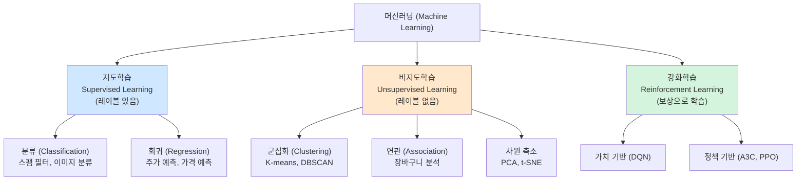
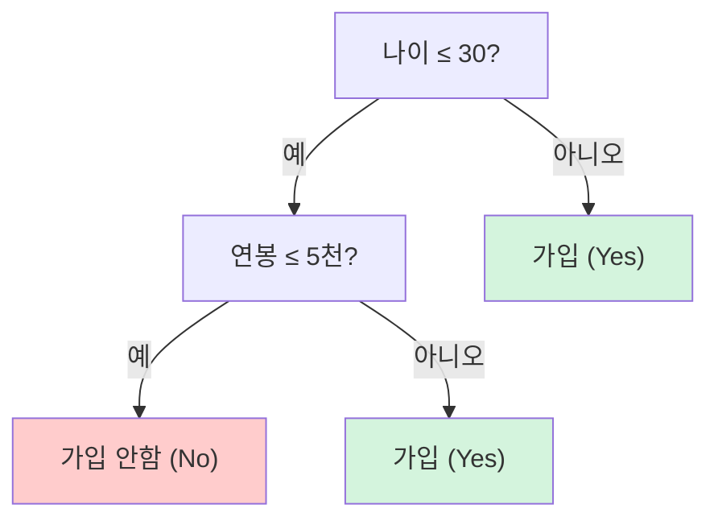
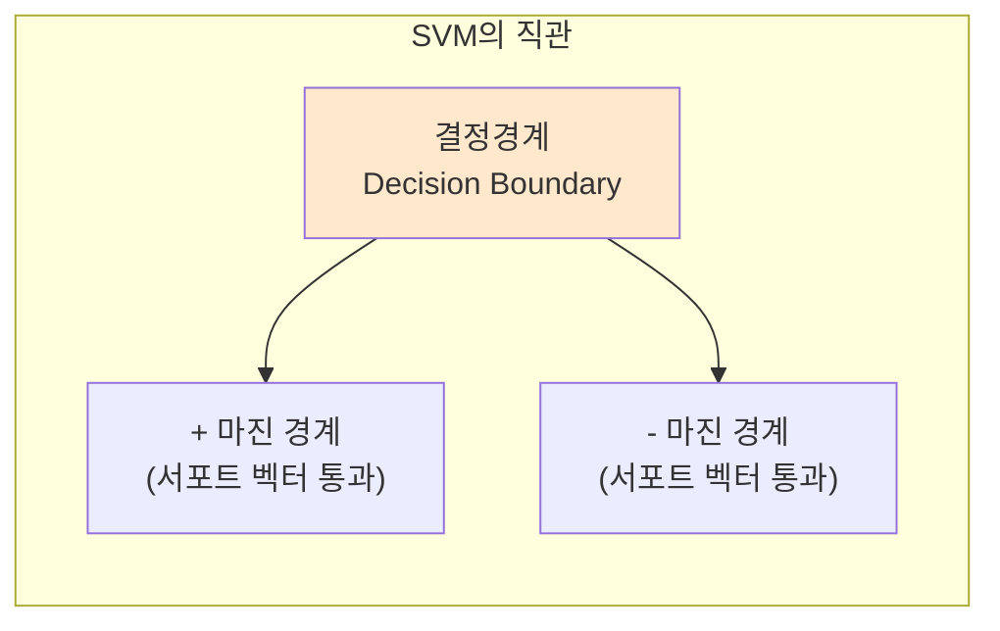
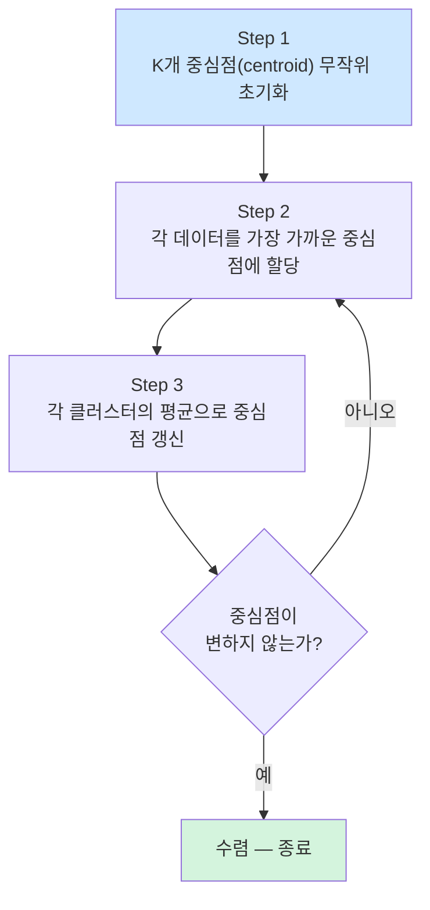
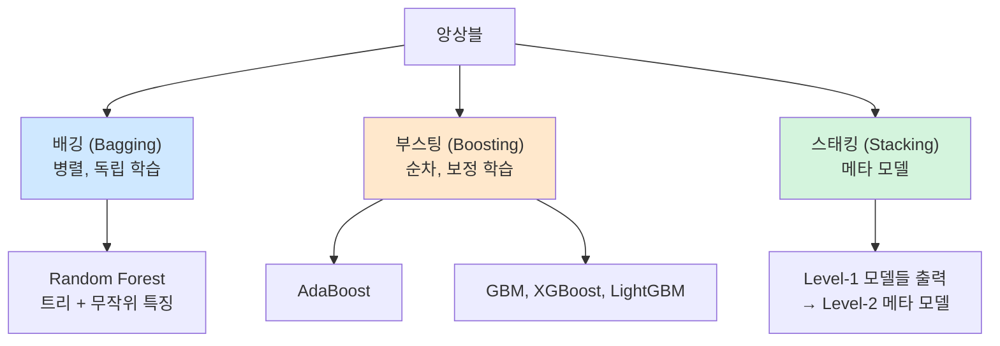
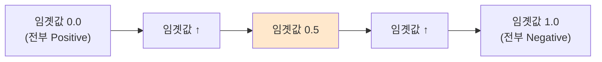
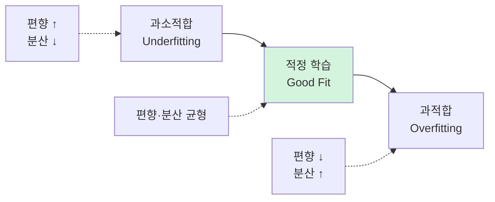
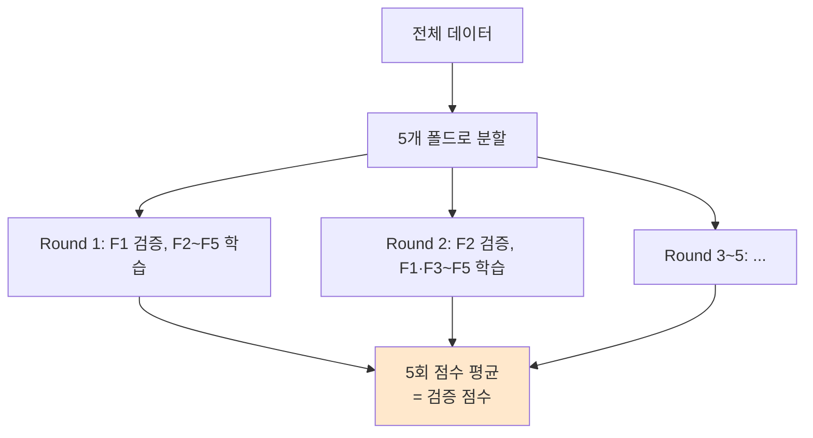
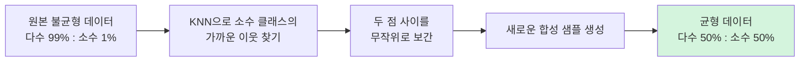
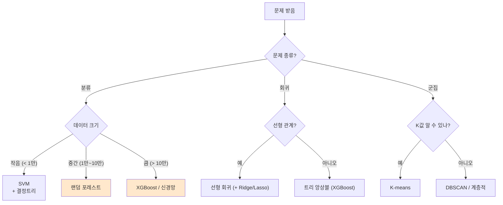

> **이 글의 목적**
>
> [AI개론 ④](/ai/ai-introduction-modern-ai/)에서 *현대 AI* 의 큰 그림을 봤다면, 이번 *심화 시리즈* 는 한 단계 더 들어가서 **시험에 직접 나오는 알고리즘들** 을 수식과 그림 수준으로 풀어본다.
>
> 첫 편은 **머신러닝 알고리즘**. 7급 데이터직 인공지능 시험 50문항 중 ④클러스터(머신러닝 기초)가 *9문항/2년 — 가장 큰 비중*이고, KODIT 인공지능개론 W6~W7과 기계학습 과목에도 중복으로 다룬다. 한 글로 양쪽 시험을 동시에 대비할 수 있도록 정리한다.
>
> 정리에는 *Russell & Norvig*의 *AIMA*[^1]와 *오렐리앙 제롱*의 *핸즈온 머신러닝*[^2]을 토대로, 각 알고리즘의 **원전 논문** (Cortes & Vapnik 1995, Breiman 2001 등)을 직접 확인했다.
>
> **읽고 나면 답할 수 있는 질문**:
>
> - **지도/비지도/강화** 학습은 어떤 기준으로 갈리는가
> - **K-means**의 4단계 알고리즘은 무엇이고 왜 K값이 민감한가
> - **결정트리**의 *지니지수*와 *엔트로피지수*는 식이 어떻게 다르고 결과는 어떻게 같은가
> - **SVM**의 *마진(margin)* 은 정확히 무엇이며, *하드마진*과 *소프트마진* 의 트레이드오프
> - **배깅 vs 부스팅 vs 스태킹** — 한 줄로 차이를 말할 수 있는가
> - **혼동행렬**에서 *정밀도(Precision)·재현율(Recall)·F1·특이도(Specificity)* 의 정의와 어느 상황에 어느 지표를 보는가
> - **K-Fold 교차검증**과 **편향-분산 트레이드오프**의 관계
> - **SMOTE**, **원-핫 인코딩**, **정규화 vs 표준화** — 데이터 전처리의 표준 도구

---

## 1. 머신러닝 학습 패러다임 — 세 갈래

### 1.1 무엇이 갈리는가

머신러닝은 *학습 데이터의 형태* 에 따라 세 갈래로 나뉜다.



### 1.2 한 표 정리

| 패러다임 | 입력 | 출력 | 학습 방식 | 대표 알고리즘 |
|---|---|---|---|---|
| **지도학습** | (특징, 레이블) 쌍 | 새 입력의 레이블 예측 | 정답을 알려주고 오차 줄이기 | KNN, 결정트리, SVM, 신경망 |
| **비지도학습** | 특징만 | 데이터 구조 발견 | 정답 없이 패턴/유사도 학습 | K-means, PCA, 오토인코더 |
| **강화학습** | 환경·상태 | 행동 정책 | 보상으로 시행착오 | Q-learning, DQN, A3C |

> 💡 **시험 단골**: *"이 문제는 지도학습/비지도학습 중 어느 쪽인가"* — 핵심은 **정답(label)이 있는가**. 회귀도 *연속값 정답*이 있으면 지도학습.

---

## 2. 분류 알고리즘 5종

### 2.1 K-Nearest Neighbors (KNN) — *게으른 학습자*

#### 핵심 아이디어

> *"가까이 있는 K개 이웃이 다수결로 결정한다."*

학습이라기보다 **저장**에 가깝다. 새 데이터가 들어오면 그때서야 모든 학습 데이터와 거리 계산. *Lazy Learning* 이라고 불린다.

#### 동작 원리 (Step by Step)

##### Step 1: K값 선택
보통 홀수(다수결 동률 방지). K가 작으면 노이즈에 민감, K가 크면 결정 경계가 흐려짐.

##### Step 2: 거리 계산
모든 학습 데이터까지 *거리(distance)* 계산. 가장 흔히 쓰는 세 가지:

- **유클리드 거리(Euclidean)**: `√Σ(xᵢ - yᵢ)²` — 직선 거리
- **맨해튼 거리(Manhattan)**: `Σ|xᵢ - yᵢ|` — 격자 거리
- **민코프스키 거리(Minkowski)**: `(Σ|xᵢ - yᵢ|^p)^(1/p)` — 위 둘의 일반형 (p=2면 유클리드, p=1이면 맨해튼)

##### Step 3: 가까운 K개 선택 → 다수결
분류면 다수결, 회귀면 평균.

#### 성질

| 지표 | 결과 |
|---|---|
| 학습 시간 | **0** (저장만) |
| 예측 시간 | O(N·d) — 매우 느림 |
| 특징 정규화 필요? | **반드시** (스케일이 다른 특징은 거리 왜곡) |
| 차원 저주 | 심각 (고차원에서 모든 점이 비슷한 거리) |

> ⚠️ **함정**: *"K값이 클수록 좋다"* 는 거짓. 너무 크면 *전역 평균* 에 수렴해 결정 경계가 사라짐. 보통 **√N 부근**에서 시작해 교차검증으로 조정.

---

### 2.2 나이브 베이즈 — *베이즈 정리 + 독립 가정*

#### 핵심 식

> **P(y | X) ∝ P(y) · ∏ P(xᵢ | y)**

베이즈 정리에 *조건부 독립* 가정을 추가한 분류기. 이름의 *나이브(naive)* 는 *순진한 가정* 이라는 뜻 — 특징들이 서로 독립이라고 *순진하게* 본다는 의미.

#### 동작 원리

1. **사전확률(prior)** P(y) 계산: 학습 데이터에서 각 클래스 비율
2. **가능도(likelihood)** P(xᵢ | y) 계산: 각 특징이 클래스별로 얼마나 자주 나타났는가
3. 새 데이터 X가 들어오면 클래스마다 위 식으로 점수 계산 → 최대값 클래스 선택

> 💡 **현실에서는** 가정이 깨져도 잘 작동. 특히 **스팸 필터**, **문서 분류** 에서 강력하다. 빠르고 단순하다는 게 장점.

---

### 2.3 결정 트리 (Decision Tree) — *질문으로 데이터 나누기*

#### 핵심 아이디어

> *"가장 잘 나누는 질문을 반복해 가지를 친다."*

루트에서 시작해 *불순도(impurity)* 가 가장 크게 줄어드는 질문을 찾고, 데이터를 둘로 분할. 이 과정을 재귀적으로 반복.



#### 불순도(Impurity) 두 가지

##### 지니지수 (Gini Index)
> **Gini = 1 - Σpᵢ²**

- 한 노드에서 임의로 둘을 골랐을 때 *서로 다른 클래스일 확률*
- 0이면 순수(한 클래스만), 0.5에 가까우면 무질서(이진 분류 기준)

##### 엔트로피 (Entropy)
> **Entropy = -Σpᵢ · log₂(pᵢ)**

- *정보이론* 에서 차용 — 불확실성의 양
- 0이면 순수, 1에 가까우면 무질서(이진 분류 기준)

#### 정보이득 (Information Gain)

> **IG = (부모 불순도) - Σ(자식 노드 비율 × 자식 불순도)**

각 분할 후보 중 *정보이득이 가장 큰* 것을 선택.

> 🎯 **시험 직출**: 지니/엔트로피의 *식*과 *계산 예제*. 보통 작은 표에서 직접 계산하라고 한다.

#### 한계

- **과적합** 매우 잘 됨 — 가지치기(pruning), 최대 깊이 제한 필요
- 데이터 작은 변화에도 트리가 크게 바뀜 — *불안정*
- → 이 한계가 **앙상블(랜덤 포레스트)** 등장의 동기

#### 결정트리 알고리즘 종류 (시험 단골)

같은 결정트리 컨셉이지만 *분할 기준* 과 *처리 가능 데이터 형태* 가 다른 변형들이 있다:

| 알고리즘 | 분할 기준 | 데이터 |
|---|---|---|
| **ID3** (Iterative Dichotomiser 3) | 정보 이득(엔트로피) | 범주형만 |
| **C4.5** | **정보 이득비**(Gain Ratio) | 범주형 + 연속형 |
| **C5.0** | C4.5 개선판 | 범주형 + 연속형 |
| **CART** (Classification And Regression Tree) | 지니지수 (분류) / MSE (회귀) | 범주형 + 연속형, 분류 + 회귀 |
| **CHAID** | 카이제곱 검정 | 범주형 |

> 🎯 **시험 직출 (2025-16)**: *"ID3는 범주형 속성값을 갖는 학습 데이터로부터 엔트로피 개념을 사용하여 결정 트리를 만든다"* → **참**.

#### 정보 이득비 (Information Gain Ratio) — C4.5의 보정

> **Gain Ratio = 정보 이득 / 분할 정보(Split Information)**

순수 *정보 이득* 만 쓰면 *값이 많은 속성* (예: 학생 ID)에 편향된다. C4.5는 이걸 분할 정보로 나눠 *정규화* 한다.

> ⚠️ **시험 함정 (2024-21 ④)**: *"정보 이득비는 속성의 엔트로피를 정보 이득으로 나눈 값이다"* → **거짓**. *정보 이득* 을 *분할 정보(엔트로피)* 로 나눈 값. 분자/분모 거꾸로.

---

### 2.4 SVM (Support Vector Machine) — *마진을 최대화하라*


> Cortes, C., & Vapnik, V. (1995). *Support-vector networks*. Machine Learning, 20(3), 273–297.[^3]

#### 핵심 아이디어



> *"두 클래스를 가장 두껍게 가르는 직선(또는 평면)을 찾는다."*

- **결정경계(decision boundary)**: 두 클래스를 나누는 선
- **마진(margin)**: 결정경계와 가장 가까운 데이터 사이의 거리
- **서포트 벡터(support vector)**: 마진 경계 위에 있는 데이터 — *경계를 결정하는 핵심 데이터*

#### 마진 식

> **margin = 2 / ||w||**

여기서 w는 결정경계 식 `w·x + b = 0` 의 가중치 벡터. SVM의 목표는 **||w||를 최소화** (= 마진 최대화).

#### 하드마진 vs 소프트마진

| 측면 | **하드마진(Hard Margin)** | **소프트마진(Soft Margin)** |
|---|---|---|
| 가정 | 데이터가 *완벽히 선형 분리* 가능 | 일부 오분류 허용 |
| 슬랙 변수(ξ) | 없음 | 있음 — 경계 침범 정도 |
| 파라미터 | — | C — *오분류 페널티* (크면 하드마진에 가까움) |
| 현실 적합도 | 낮음 (노이즈 있으면 풀 수 없음) | **높음** — 실무 표준 |

#### 커널 트릭 (Kernel Trick)

선형 분리 불가능한 데이터를 *고차원 공간에 매핑* 해 선형 분리하게 만드는 기법.

| 커널 | 식 | 용도 |
|---|---|---|
| 선형(Linear) | `K(x, y) = x·y` | 텍스트 분류, 고차원 희소 데이터 |
| 다항식(Polynomial) | `K(x, y) = (x·y + c)^d` | 곡선 경계 |
| **RBF (Gaussian)** | `K(x, y) = exp(-γ||x-y||²)` | **가장 흔히 사용**, 비선형 문제 |
| 시그모이드 | `K(x, y) = tanh(α·x·y + c)` | 신경망과 유사 |

> 💡 **SVM의 매력**: 작은 데이터에서도 잘 작동, 결정경계가 *마진* 으로 명확히 정의되어 *해석 가능*. 단점은 큰 데이터에서 느리다는 점(O(N²) ~ O(N³)).

---

### 2.5 로지스틱 회귀 (Logistic Regression)

#### 이름의 함정

*회귀(regression)* 라는 이름이 붙어 있지만 **분류 알고리즘**이다. 시험 단골 함정.

#### 핵심 식

> **P(y=1 | X) = σ(w·x + b) = 1 / (1 + e^(-(w·x + b)))**

`σ`는 *시그모이드 함수* — 어떤 실수를 (0, 1) 사이 확률로 변환.

#### 손실 함수 — *Cross-Entropy*

> **L = -Σ [y·log(ŷ) + (1-y)·log(1-ŷ)]**

이걸 *경사하강법* 으로 최소화. 다중 분류는 **소프트맥스 + 카테고리 크로스 엔트로피** 로 일반화.

> 🎯 **시험 포인트**: *"로지스틱 회귀는 분류인가 회귀인가"* → **분류**. *"손실함수는 무엇인가"* → **크로스 엔트로피**.

#### 로짓(logit) 변환 — 이름이 *회귀* 인 이유

확률 *p* 를 *로짓* 으로 바꾸면 (0,1) 구간이 (-∞, +∞) 로 풀려나가, 다시 선형 회귀를 적용할 수 있다.

> **logit(p) = ln(p / (1-p))**

식을 뒤집으면 시그모이드. 즉 *로지스틱 회귀 = 종속변수에 로짓 변환을 적용한 선형 회귀*. 그래서 *회귀* 라는 이름이 붙었다.

> ⚠️ **시험 함정 (2025-21 ㄹ)**: *"최적해를 구하기 위해서 최소제곱법을 사용한다"* → **거짓**. 로지스틱 회귀는 *최대우도법(MLE)* 또는 *경사하강법으로 크로스 엔트로피 최소화*. 최소제곱법은 선형 회귀.

---

## 3. 비지도 학습 — K-means 군집화

### 3.1 K-means 알고리즘 — 4단계

> 시험 단골 — *"K-means의 실행 순서를 배열하시오"* 형태로 자주 출제.



| Step | 내용 | 한 줄 설명 |
|---|---|---|
| 1 | **초기화** | K개 중심점을 무작위로 배치 (또는 K-means++로 똑똑하게) |
| 2 | **할당(Assignment)** | 각 점을 가장 가까운 중심점에 배정 |
| 3 | **갱신(Update)** | 각 클러스터의 *평균값* 으로 중심점 이동 |
| 4 | **반복** | 변화 없을 때까지 2-3 반복 |

### 3.2 K값을 어떻게 정하나 — *엘보우 방법*

K를 1, 2, 3, ... 늘려가며 *클러스터 내 분산(WCSS)* 을 그래프로 그린다. 줄어드는 폭이 *팔꿈치(elbow)* 처럼 꺾이는 지점이 적정 K.

### 3.3 K-means의 한계

- 초기 중심점에 따라 결과가 달라짐 → **K-means++** 로 보강
- 구형(spherical) 클러스터 가정 → 길쭉한 모양엔 약함
- 이상치(outlier)에 민감 → **K-medoids**, **DBSCAN** 등 대안

> 💡 **시험 함정**: *"K-means는 지도학습이다"* → **거짓**. 정답 레이블 없이 *유사도만* 으로 군집을 만든다.

---

## 4. 앙상블 학습 — *여러 모델을 합쳐 더 똑똑하게*


### 4.1 왜 앙상블인가

> Breiman, L. (2001). *Random Forests*. Machine Learning, 45(1), 5–32.[^4]

단일 결정트리는 불안정하지만, *수백 그루를 평균* 내면 강력하다. *분산을 줄이거나, 편향을 줄이거나, 둘 다* 를 노리는 게 앙상블.

### 4.2 세 가지 큰 갈래



### 4.3 한 표 비교

| 측면 | **배깅 (Bagging)** | **부스팅 (Boosting)** | **스태킹 (Stacking)** |
|---|---|---|---|
| 학습 방식 | 병렬, 독립 | 순차, 이전 모델의 오차 보정 | 모델들의 예측을 *메타 모델* 의 입력으로 |
| 데이터 샘플링 | 부트스트랩(중복 허용 샘플링) | 가중치 변경 | 원본 |
| 목적 | **분산 감소** | **편향 감소** | 모델 다양성 활용 |
| 과적합 위험 | 낮음 | 높음 (조심해야 함) | 중간 |
| 대표 | Random Forest | AdaBoost, XGBoost, GBM | (Kaggle 우승작 단골) |

### 4.4 보팅 (Voting) — 최종 결정 방식

| 보팅 종류 | 설명 |
|---|---|
| **하드 보팅(Hard Voting)** | 각 모델의 예측 *클래스 라벨* 을 다수결 |
| **소프트 보팅(Soft Voting)** | 각 모델의 예측 *확률* 을 평균 → 최댓값 클래스 선택 |

> 💡 **소프트 보팅이 보통 더 강력** — 각 모델의 *확신도(confidence)* 까지 반영하기 때문. 단, 모든 모델이 *확률 출력* 이 가능해야 함.

### 4.5 부스팅 — AdaBoost vs Gradient Boosting

| 부스팅 종류 | 핵심 |
|---|---|
| **AdaBoost** | 이전 모델이 틀린 샘플에 *가중치* 부여 → 다음 모델은 그걸 더 신경 |
| **Gradient Boosting (GBM)** | 이전 모델의 *잔차(residual)* 를 다음 모델이 예측 — 함수 공간에서 경사하강 |
| **XGBoost / LightGBM / CatBoost** | GBM의 효율적 구현 — 정규화·병렬화·결측치 처리 |

> 🎯 **시험 포인트**: *배깅은 분산 감소, 부스팅은 편향 감소* 라는 한 줄. 그리고 *Random Forest는 배깅의 변형* (트리만 쓰고 + 특징도 무작위 샘플링).

---

## 5. 모델 평가 — *정답률만으론 부족하다*


### 5.1 혼동행렬 (Confusion Matrix)

이진 분류 결과를 4칸으로 정리한 표.

|  | 예측: Positive | 예측: Negative |
|---|---|---|
| **실제: Positive** | TP (True Positive) | FN (False Negative) |
| **실제: Negative** | FP (False Positive) | TN (True Negative) |

### 5.2 평가 지표 — 식과 의미

| 지표 | 식 | 의미 | 언제 보나 |
|---|---|---|---|
| **정확도(Accuracy)** | (TP + TN) / 전체 | 맞춘 비율 | 클래스 균형일 때 |
| **정밀도(Precision)** | TP / (TP + FP) | *Positive 예측 중 진짜 비율* | 오탐(FP) 비용이 클 때 (스팸 필터) |
| **재현율(Recall) = 민감도(Sensitivity)** | TP / (TP + FN) | *진짜 Positive 중 잡은 비율* | 누락(FN) 비용이 클 때 (암 진단) |
| **특이도(Specificity)** | TN / (TN + FP) | *진짜 Negative 중 정확히 분류한 비율* | 의료 검사의 *정상*  판정 정확도 |
| **F1 Score** | 2·P·R / (P + R) | 정밀도와 재현율의 *조화평균* | 두 지표 균형이 필요할 때 |

> ⚠️ **함정**: *"정확도만 보면 충분하다"* — **거짓**. *불균형 데이터*(예: 암 환자 1%)에서는 *전부 정상* 이라 답해도 99% 정확도. **재현율을 봐야 한다**.

#### 위양성율(FPR) 정의 추가

| 지표 | 식 | 의미 |
|---|---|---|
| **위양성율(FPR)** | FP / (FP + TN) = 1 - 특이도 | *실제 음성 중 양성이라고 잘못 판정한 비율* |
| 진양성율(TPR) | TP / (TP + FN) = 재현율 | 실제 양성 중 양성이라고 옳게 판정한 비율 |

> 🎯 **시험 포인트 (2025-2)**: *"실제 음성인 것들 중에서 분류기가 음성으로 판정한 것의 비율을 특이도라고 한다"* → **참**. *"분류기는 민감도가 작을수록 좋고 위양성율이 클수록 좋다"* → **거짓** (반대).

#### 수치 계산 예제 — F1 스코어

스팸 메일 분류 결과:

| | 실제: 스팸 | 실제: 정상 |
|---|---|---|
| **예측: 스팸** | 90 (TP) | 30 (FP) |
| **예측: 정상** | 10 (FN) | 870 (TN) |

- **정밀도** = 90 / (90 + 30) = **0.75**
- **재현율** = 90 / (90 + 10) = **0.90**
- **F1** = 2 × 0.75 × 0.90 / (0.75 + 0.90) = **1.35 / 1.65 ≈ 0.82**

> 🎯 **시험 직출 (2024-7)**: 위 표가 그대로 출제. F1 ≈ **0.82** 정답.

#### 곱셈형 계산 변형 (2025-10)

| | 양성 | 음성 |
|---|---|---|
| 실제 양성 | 40 (TP) | 10 (FN) |
| 실제 음성 | 15 (FP) | 35 (TN) |

- 민감도 = 40/50 = 4/5
- 정확도 = (40+35)/100 = 3/4
- 위양성율 = 15/50 = 3/10
- **곱셈** = (4/5) × (3/4) × (3/10) = **9/50**

> 시험에선 분수 형태로 답이 주어진다. 약분 정확히.

### 5.3 ROC 곡선과 AUC

- **ROC 곡선**: 임곗값을 0~1로 바꾸며 *(FPR, TPR)* 을 그린 곡선
  - **TPR (True Positive Rate)** = 재현율 = TP / (TP + FN)
  - **FPR (False Positive Rate)** = FP / (FP + TN) = 1 - 특이도
- **AUC (Area Under Curve)**: ROC 곡선 아래 면적. 1에 가까울수록 좋고, 0.5면 무작위.



각 임곗값에서 (FPR, TPR)을 찍어 곡선을 그린다. **곡선이 좌상단에 가까울수록 좋은 모델**.

---

## 6. 검증과 정규화 — 과적합과 싸우기

### 6.1 과적합 vs 과소적합



- **과적합(Overfitting)**: 학습데이터에 너무 맞춰져 새 데이터엔 못함. *분산(variance) ↑*
- **과소적합(Underfitting)**: 모델이 너무 단순. *편향(bias) ↑*
- **편향-분산 트레이드오프**: 둘을 동시에 줄일 수 없음 — 균형이 핵심

### 6.2 K-Fold 교차검증

데이터를 K개 *폴드(fold)* 로 나눠 K번 학습/검증. 각 폴드를 한 번씩 *검증 세트* 로 사용.



장점: 모든 데이터가 검증에 한 번씩 쓰임 → 평가 안정성 ↑
단점: K배 느림

#### 변형들

- **LOOCV (Leave-One-Out)**: K = N. 매우 느리지만 가장 보수적
- **Stratified K-Fold**: 클래스 비율 유지 → *불균형 데이터* 에 필수

### 6.2.1 다중 선형 회귀 예측 계산 — 시험 직출 패턴

집의 면적과 방의 개수로 가격을 예측하는 다중 회귀:

| 면적(m²) | 방 개수 | 가격(만원) |
|---|---|---|
| 55 | 1 | 1,475 |
| 70 | 2 | 1,600 |
| 80 | 4 | 1,750 |

#### 풀이 (2024-20)

가설: *가격 = a · 면적 + b · 방개수 + c*

세 데이터로 연립방정식을 세워 a, b, c를 구한다. 또는 *각 변수의 변화 → 가격 변화 비율* 로 추정:

- (55, 1) → (70, 2): 면적 +15, 방 +1, 가격 +125
- (70, 2) → (80, 4): 면적 +10, 방 +2, 가격 +150

→ *a ≈ 5, b ≈ 50, c ≈ 1,150* 정도로 풀린다.

새 데이터 (면적 88, 방 5):
> 가격 ≈ 5 × 88 + 50 × 5 + 1,150 = 440 + 250 + 1,150 = **1,840** (만원)

> 🎯 **시험 직출 (2024-20)** 정답 ②. 다중 변수가 선형 결합되는 경우 *기울기·절편을 데이터 패턴에서 추정* 하는 게 빠른 풀이.

### 6.3 정규화(Regularization)

손실 함수에 *가중치 페널티* 를 더해 모델 복잡도를 억제.

| 기법 | 페널티 | 효과 |
|---|---|---|
| **L1 (Lasso)** | `λΣ|wᵢ|` | 일부 가중치를 정확히 0 → **희소(sparsity), 특징 선택** |
| **L2 (Ridge)** | `λΣwᵢ²` | 가중치 크기 *축소* (0은 안 됨) |
| **Elastic Net** | L1 + L2 | 둘의 장점 결합 |
| **Dropout** | 학습 시 일부 뉴런 무작위 비활성화 | 신경망 전용, 앙상블 효과 |
| **Early Stopping** | 검증 손실 증가 시 학습 중단 | 모든 모델 |

> 💡 **L1 vs L2 직관**: L1은 *"불필요한 특징은 아예 빼버려"* (0으로), L2는 *"모든 특징을 조금씩 줄여"*. 그래서 L1을 *특징 선택* 도구로 자주 쓴다.

---

## 7. 데이터 전처리 — 모델 전에 데이터부터

### 7.1 정규화 vs 표준화

| 기법 | 식 | 결과 범위 | 언제 |
|---|---|---|---|
| **정규화 (Min-Max Scaling)** | `(x - min) / (max - min)` | [0, 1] | 신경망, 거리 기반(KNN, SVM) |
| **표준화 (Standardization, Z-score)** | `(x - μ) / σ` | 평균 0, 분산 1 | 가우시안 가정 (로지스틱 회귀, PCA) |

> 🎯 **시험 직출**: *"이 데이터를 표준화하시오"* — 학습노트의 표준화 계산 문제. `z = (x - 평균) / 표준편차` 만 외우면 OK.

### 7.2 원-핫 인코딩 (One-Hot Encoding)

범주형 변수(예: "빨강", "파랑", "초록")를 *이진 벡터* 로 변환.

```text
빨강 → [1, 0, 0]
파랑 → [0, 1, 0]
초록 → [0, 0, 1]
```

> ⚠️ **함정**: 라벨 인코딩(빨강=0, 파랑=1, 초록=2)을 그대로 쓰면 모델이 *"파랑이 빨강보다 큼"* 이라는 잘못된 순서를 학습할 수 있다. 범주형엔 **원-핫**.

### 7.3 SMOTE — 불균형 데이터 처리

> Chawla, N. V., et al. (2002). *SMOTE: Synthetic Minority Over-sampling Technique*. JAIR, 16, 321–357.[^5]

**Synthetic Minority Over-sampling Technique** — 소수 클래스의 *가까운 이웃 사이를 보간* 해 *합성 샘플* 을 생성하는 오버샘플링 기법.



> 💡 **단순 복제** 와 비교: 단순 오버샘플링은 같은 점을 여러 번 복사 → 과적합. SMOTE는 *새로운 점* 을 만들어내므로 더 일반화 잘 됨.

---

## 8. 알고리즘 비교 종합

### 8.1 분류 알고리즘 한 표

| 알고리즘 | 핵심 | 강점 | 약점 |
|---|---|---|---|
| **KNN** | K개 이웃 다수결 | 단순, 학습 0초 | 예측 느림, 차원 저주 |
| **나이브 베이즈** | 베이즈 + 독립 가정 | 빠름, 텍스트에 강 | 독립 가정 비현실적 |
| **결정 트리** | 불순도 최소화로 분할 | 해석 쉬움, 비선형 | 과적합·불안정 |
| **SVM** | 마진 최대화 | 작은 데이터에 강, 커널로 비선형 | 큰 데이터 느림 |
| **로지스틱 회귀** | 시그모이드 + 크로스 엔트로피 | 확률 출력, 해석 쉬움 | 선형 경계만 |
| **랜덤 포레스트** | 트리 앙상블 (배깅) | 강력, 과적합 ↓ | 해석 어려움 |
| **XGBoost / LightGBM** | 트리 부스팅 | *Kaggle의 기본기* | 튜닝 까다로움 |

### 8.2 의사결정 가이드 — *어떤 알고리즘을 골라야 하나*



> 💡 **PAAR 식 정리**:
> - **Problem**: 분류인가 회귀인가, 데이터 크기, 해석 필요한가
> - **Analyze**: 데이터 형태(텍스트·이미지·표) + 클래스 균형 + 가용 시간
> - **Action**: 베이스라인(로지스틱·결정트리) → 강력 모델(XGBoost·딥러닝) 순으로
> - **Result**: 단일 지표(정확도)가 아니라 *문제에 맞는 지표*(F1·AUC) 로 평가

---

## 9. 헷갈리는 것 / 자주 묻는 질문

### Q1. *"로지스틱 회귀는 회귀인가 분류인가"*

**분류**. 이름은 *회귀* 로 시작했지만, 시그모이드로 (0,1) 확률을 내고 임곗값으로 클래스를 결정하기 때문에 분류 알고리즘이다. 시험 단골 함정.

### Q2. *"K-means의 K값과 KNN의 K값은 같은가"*

**다르다**.
- **K-means의 K**: *클러스터 개수*
- **KNN의 K**: *참조할 이웃의 개수*

이름이 비슷할 뿐 의미가 다름.

### Q3. *지니지수와 엔트로피지수, 어느 쪽이 더 좋은가*

**거의 같음.** 결과가 큰 차이 없음. 지니가 계산이 약간 빠름(로그 없음). scikit-learn의 기본은 지니.

### Q4. *SVM에서 서포트 벡터가 아닌 데이터를 모두 지우면 결과가 달라지나*

**아니다**. 서포트 벡터만 결정경계를 결정한다. 이게 SVM의 *희소 표현(sparse representation)* 의 핵심.

### Q5. *배깅과 부스팅 중 어느 쪽이 더 정확한가*

**일반적으로 부스팅(XGBoost·LightGBM)** 이 우위. 단, *과적합 위험* 도 더 크고 *튜닝 부담* 도 크다. 빠른 실험엔 *Random Forest* 가 좋다.

### Q6. *F1 점수는 왜 평균이 아니라 조화평균(harmonic mean)인가*

산술평균은 *둘 중 하나가 매우 낮아도* 평균이 그럭저럭 나올 수 있다. 조화평균은 **둘 다 높아야** 점수가 높다 — *균형* 을 강제한다.

### Q7. *교차검증의 K값이 클수록 좋은가*

**아니다**. K가 클수록 *분산* 은 줄지만 *계산 시간*이 K배 증가. 보통 **K=5 또는 K=10** 이 표준. LOOCV(K=N)는 매우 느려서 작은 데이터에만.

### Q8. *SMOTE는 항상 좋은가*

**아니다**. 합성 샘플이 *노이즈* 에 가깝게 만들어질 수 있다. 클래스 경계가 명확하지 않을 때 **위험**. 대안:
- **언더샘플링**: 다수 클래스를 줄임
- **클래스 가중치 조정**: 손실 함수에서 소수 클래스에 더 큰 가중치
- **앙상블 + 임곗값 조정**

---

## 10. 시험 직전 1분 요약

> A4 한 장 압축본.

### 핵심 8개

1. **학습 패러다임**: 지도(레이블 있음) / 비지도(레이블 없음) / 강화(보상)
2. **K-means 4단계**: 초기화 → 할당 → 갱신 → 반복 (수렴까지)
3. **결정트리 불순도**: **지니 = 1 - Σp²** / **엔트로피 = -Σp·log₂p**
4. **SVM**: *마진 최대화*. **마진 = 2/||w||**. 하드/소프트마진, 커널(RBF 가장 흔함)
5. **앙상블 3종**: **배깅(병렬, 분산↓)** / **부스팅(순차, 편향↓)** / **스태킹(메타 모델)**. 보팅 *하드(다수결)/소프트(확률 평균)*
6. **혼동행렬 4지표**:
   - **정밀도** = TP/(TP+FP) — 예측 양성 중 진짜
   - **재현율** = TP/(TP+FN) — 실제 양성 중 잡은
   - **특이도** = TN/(TN+FP) — 실제 음성 중 정확
   - **F1** = 2·P·R/(P+R) — 조화평균
7. **정규화 vs 표준화**:
   - 정규화 = (x-min)/(max-min) → [0, 1]
   - 표준화 = (x-μ)/σ → 평균 0 분산 1
8. **불균형 데이터**: SMOTE(합성 오버샘플링), Stratified K-Fold

### 자주 헷갈리는 한 마디

- *"로지스틱 회귀는 회귀이다"* → **거짓 (분류)**
- *"K-means의 K = KNN의 K"* → **거짓 (의미 다름)**
- *"불균형 데이터에 정확도(Accuracy)만 보면 된다"* → **거짓 (재현율·F1·AUC 봐야)**
- *"배깅은 편향, 부스팅은 분산을 줄인다"* → **거짓 (반대 — 배깅이 분산↓, 부스팅이 편향↓)**
- *"SVM의 결정경계는 모든 데이터로 정해진다"* → **거짓 (서포트 벡터만)**
- *"L1은 가중치 축소, L2는 0으로 만든다"* → **거짓 (반대)**

### 7급 데이터직 ④클러스터 빈출 패턴

| 빈출 유형 | 핵심 |
|---|---|
| K-means 실행 순서 배열 | 초기화 → 할당 → 갱신 → 반복 |
| 혼동행렬 4지표 계산 | 표 주고 정밀도·재현율·F1 계산 |
| 표준화 계산 | (x - 평균) / 표준편차 |
| 결정트리 정보이득 | 부모 - Σ(가중) 자식 불순도 |
| 데이터 전처리 도구 식별 | SMOTE·원-핫·교차검증 |
| 회귀 차수 ↔ 과적합/과소적합 | 차수 ↑ → 과적합, 차수 ↓ → 과소적합 |

---

## 11. 다음 학습

이번 글에서 *전통 머신러닝* 알고리즘을 정리했다. 다음 편에서는 *신경망의 수식* 으로 한 단계 더 들어간다.

- 📌 **[AI 심화 ②] 신경망 핵심 수식** — 경사하강법·활성화함수·역전파·드롭아웃
- 📌 **[AI 심화 ③] CNN 심층 분석** — 합성곱·풀링·ResNet·객체탐지
- 📌 **[AI 심화 ④] RNN·LSTM·GRU + 강화학습**
- 📌 **[AI 심화 ⑤] 고전 AI 보충** — 전문가시스템·5기준·퍼지·DIKW

추가로 깊이 들어가고 싶다면:

- **scikit-learn 공식 문서**: 각 알고리즘의 구현·파라미터 ([scikit-learn.org](https://scikit-learn.org/))
- **Andrew Ng CS229** 강의 노트: 수학적 유도 ([cs229.stanford.edu](https://cs229.stanford.edu/))
- **핸즈온 머신러닝** (오렐리앙 제롱) — 코드 + 이론 균형

---

## 12. 참고 문헌 (References)

[^1]: Russell, S. J., & Norvig, P. (2020). *Artificial Intelligence: A Modern Approach* (4th ed.). Pearson. (특히 Ch. 19~20 기계학습)

[^2]: Géron, A. (2022). *Hands-On Machine Learning with Scikit-Learn, Keras, and TensorFlow* (3rd ed.). O'Reilly.

[^3]: Cortes, C., & Vapnik, V. (1995). Support-vector networks. *Machine Learning*, 20(3), 273–297. [DOI: 10.1007/BF00994018](https://doi.org/10.1007/BF00994018)

[^4]: Breiman, L. (2001). Random forests. *Machine Learning*, 45(1), 5–32. [DOI: 10.1023/A:1010933404324](https://doi.org/10.1023/A:1010933404324)

[^5]: Chawla, N. V., Bowyer, K. W., Hall, L. O., & Kegelmeyer, W. P. (2002). SMOTE: Synthetic Minority Over-sampling Technique. *Journal of Artificial Intelligence Research*, 16, 321–357. [DOI: 10.1613/jair.953](https://doi.org/10.1613/jair.953)

### 보조 자료 (교차검증용)

- scikit-learn 사용자 가이드 — *Supervised Learning*, *Model Selection*. <https://scikit-learn.org/stable/user_guide.html>
- Stanford CS229 — *Machine Learning Course Notes*. <https://cs229.stanford.edu/>
- KODIT 인공지능개론 학습노트 W6~W7 (퍼지·확률·패턴인식)

---

## 부록 A: 이미지 생성 프롬프트

> 📁 이미지 프롬프트는 [`/prompts/2026-04-29-ai-advanced-ml-algorithms.md`](/prompts/2026-04-29-ai-advanced-ml-algorithms.md) 에 별도 정리되어 있다 (한글 라벨·파일명·저장 경로 명시).

> ✍️ **다음 학습**: [AI 심화 ②] 신경망 핵심 수식 — 작성 예정.
