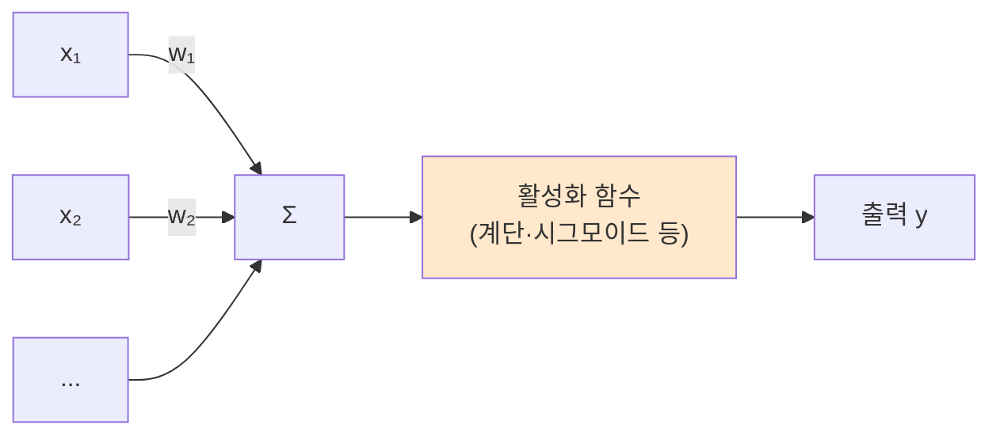
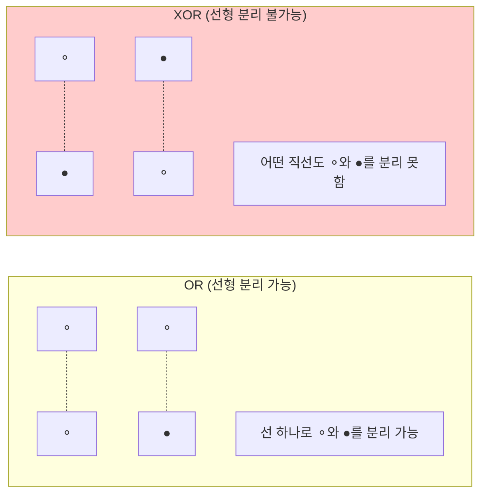
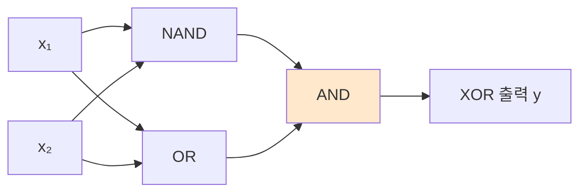
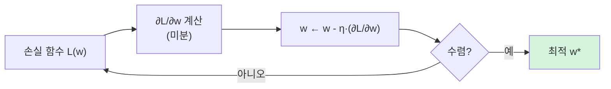
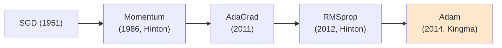
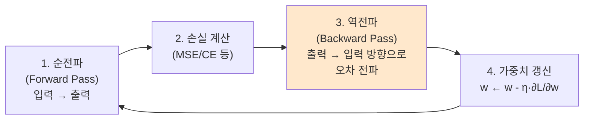
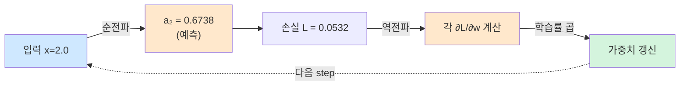
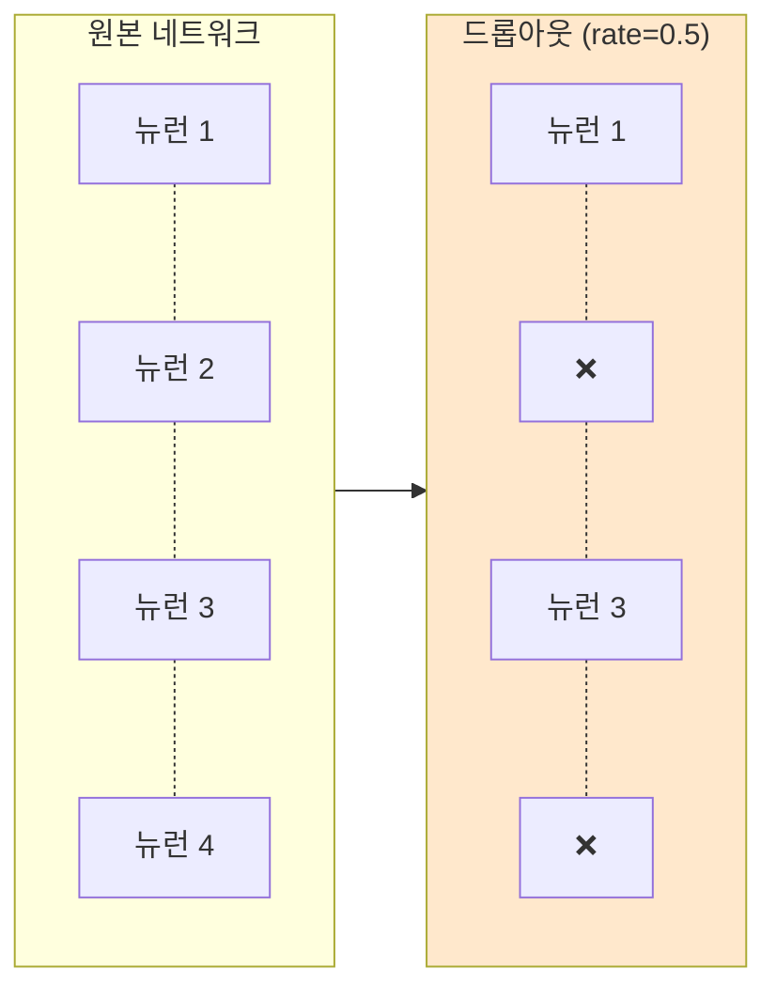

> **이 글의 목적**
>
> [AI 심화 ①](/ai/ai-advanced-ml-algorithms/)이 *전통 머신러닝* 알고리즘이었다면, 이번 편은 *현대 AI의 토대* 인 **신경망의 수식** 을 한 단계 깊이 들어간다.
>
> 7급 데이터직 인공지능 75문항(2023~2025) 분석 결과, **신경망 기초가 9문항/12% — 단일 영역 최대 비중**이다. 그것도 *수식 정확성·미분값 계산·소프트맥스 + 교차 엔트로피·신경망 트레이싱* 같은 **계산 직출 문제**가 매년 나온다.
>
> 정리에는 *Russell & Norvig*의 *AIMA* Ch.21[^1]과 *Goodfellow, Bengio & Courville*의 *Deep Learning* Ch.6~8[^2]을 토대로, 각 기법의 **원전 논문** (Rosenblatt 1958, Rumelhart 1986, Srivastava 2014 등)을 직접 확인했다.
>
> **읽고 나면 답할 수 있는 질문**:
>
> - **퍼셉트론**으로 AND·OR·NAND는 풀리는데 **XOR**은 왜 안 풀리는가
> - 활성화 함수 4종(시그모이드·Tanh·ReLU·소프트맥스)의 **정확한 수식**과 출력 범위
> - **경사하강법** 미분값 계산 — `(x-3)² + 15` 에서 x=7일 때 미분값은?
> - **역전파**는 어떻게 *연쇄법칙* 으로 가중치를 갱신하는가
> - **기울기 소멸** 문제는 왜 시그모이드에서 심각하고 ReLU로 어떻게 해결하나
> - **소프트맥스 + 교차 엔트로피**의 계산 흐름 (자연로그 표 활용)
> - **드롭아웃 / 배치 정규화 / 규제화 / 데이터 증강** — 과적합 완화 4대 기법
> - 활성화 함수 *함정 식* 을 가려낼 수 있는가 (시험 단골)

---

## 1. 퍼셉트론 — 신경망의 시조

### 1.1 단층 퍼셉트론 (Single-layer Perceptron)

> Rosenblatt, F. (1958). *The perceptron: a probabilistic model for information storage and organization in the brain*.[^3]

뉴런 하나를 수학적으로 모방한 모델. 입력에 가중치를 곱하고 합한 뒤 *임곗값*을 넘기면 1, 못 넘기면 0을 출력한다.

#### 식

> **y = 0  if  Σ wᵢxᵢ ≤ θ**
> **y = 1  if  Σ wᵢxᵢ > θ**

여기서 *wᵢ* 는 가중치, *θ* 는 임곗값(threshold). 편향 *b = -θ* 로 옮기면 표준 형태가 된다.

> **y = step(w·x + b)**



### 1.2 단층 퍼셉트론으로 AND·OR·NAND 구현

| 게이트 | (w₁, w₂, θ) 예 | 의미 |
|---|---|---|
| **AND** | (0.5, 0.5, 0.7) | 둘 다 1일 때만 출력 1 |
| **OR** | (0.5, 0.5, 0.2) | 하나라도 1이면 출력 1 |
| **NAND** | (-0.5, -0.5, -0.7) | AND의 부정 |

같은 *구조* 에 *가중치만 바꿔* 다른 게이트를 구현. 핵심: **선형 분리 가능한 문제**.

### 1.3 XOR 문제 — *선형 분리 불가능*



*Minsky & Papert (1969)*[^4] 가 이 한계를 *Perceptrons* 책에서 증명. → **1차 AI 겨울**의 직접적 원인.

### 1.4 다층 퍼셉트론 (MLP, Multi-Layer Perceptron) — XOR 해결

XOR을 NAND·OR·AND의 조합으로 푼다:

> **XOR(x₁, x₂) = AND(NAND(x₁, x₂), OR(x₁, x₂))**



*은닉층(hidden layer)* 을 한 층 추가한 결과. 이게 **다층 퍼셉트론(MLP)** 의 출발이다.

> 💡 **시험 포인트**: *"단층 퍼셉트론은 XOR을 풀 수 없다"* → **참**. *"다층 퍼셉트론은 XOR을 풀 수 있다"* → **참**.

---

## 2. 활성화 함수 — 정확한 수식이 시험에 나온다


### 2.1 4대 활성화 함수


| 함수 | 수식 | 출력 범위 | 특징 |
|---|---|---|---|
| **계단(Step)** | `1 if z > 0 else 0` | {0, 1} | 미분 불가 → 학습 어려움 |
| **시그모이드(Sigmoid)** | **`σ(z) = 1 / (1 + e^(-z))`** | (0, 1) | 매끄러움, **기울기 소멸** |
| **Tanh (하이퍼볼릭 탄젠트)** | **`(eᶻ - e^(-z)) / (eᶻ + e^(-z))`** | (-1, 1) | 0 중심, 시그모이드 보다 우월 |
| **ReLU** | **`max(0, z)`** | [0, ∞) | 양수 영역 기울기 1, 죽은 뉴런 |
| **Leaky ReLU** | **`max(αz, z)`** (α는 양의 작은 상수) | (-∞, ∞) | ReLU의 죽은 뉴런 해결 |
| **Softmax** | **`e^(zᵢ) / Σ e^(zⱼ)`** | (0, 1), 합 = 1 | 다중 분류 출력층 |
| **Softplus** | **`ln(1 + eᶻ)`** | (0, ∞) | ReLU의 매끄러운 근사 |

### 2.2 시그모이드 출력값 계산 — 시험 단골

신경망 그림에서 *(가)* 위치에 시그모이드 활성화 함수가 들어 있고, 가중합이 0일 때 출력은?

> **σ(0) = 1 / (1 + e⁰) = 1 / (1 + 1) = 0.5**

```text
입력 (0.5, 0.3, 0.2, 1.0), 가중치 (0.6, -2.0, 1.5, 0.0)
가중합 = 0.5×0.6 + 0.3×(-2.0) + 0.2×1.5 + 1.0×0.0
       = 0.3 - 0.6 + 0.3 + 0
       = 0.0
σ(0) = 0.5
```

> 🎯 **시험 직출 (2023-10)** — 정답 ②. 시그모이드 그래프 표를 함께 주는 경우, *그래프에서 z=0의 값을 읽어내면 0.5* 라고 즉시 알 수 있다.

### 2.3 ReLU 신경망 트레이싱 — 직접 계산

ReLU는 *양수면 그대로, 음수면 0*. 신경망 트레이싱 문제에서 핵심.

```text
입력 (0.7, 0.8)
은닉층 A: 0.7×2.0 + 0.8×(-1.0) = 1.4 - 0.8 = 0.6 → ReLU(0.6) = 0.6
은닉층 B: 0.7×0.8 + 0.8×0.5 = 0.56 + 0.4 = 0.96 → ReLU(0.96) = 0.96
출력 C: A×0.5 + B×(-3.0) = 0.6×0.5 + 0.96×(-3.0) = 0.3 - 2.88 = -2.58 → ReLU(-2.58) = 0
```

> 🎯 **시험 직출 (2024-23)**: 신경망 트레이싱 — 가중치를 따라가면서 각 층마다 ReLU 통과 시켜 최종 출력 계산.

### 2.4 활성화 함수 함정 식 가려내기 (2024-10) ★★★

다음 중 *옳지 않은* 수식은?

| 후보 | 식 | 실제 |
|---|---|---|
| ① softmax(x) = 2/(1+e^(-2x)) - 1 | ❌ **거짓** | 이건 *Tanh* 의 한 형태 (Tanh(x) = 2σ(2x)-1) |
| ② softplus(x) = ln(1 + eˣ) | ✅ 참 | 정의 그대로 |
| ③ sigmoid(x) = 1/(1 + e^(-x)) | ✅ 참 | 표준 정의 |
| ④ Leaky ReLU(x) = max(αx, x) | ✅ 참 | α는 작은 양의 상수 |

> ⚠️ **함정**: softmax는 *벡터 → 확률 분포* 함수로, 단일 변수 식이 아니다. **e^(zᵢ) / Σe^(zⱼ)** 가 표준. 단일 변수 형태로 적힌 건 거의 *Tanh의 변형* 에 해당.

---

## 3. 손실함수 (Loss Function)

### 3.1 회귀: 평균제곱오차 (MSE, Mean Squared Error)

> **MSE = (1/n) Σ (yᵢ - ŷᵢ)²**

미분이 매끄럽고 *큰 오차에 큰 페널티* 를 주는 게 특징. 선형 회귀의 최적해는 MSE 최소화로 풀린다.

> 🎯 **시험 (2025-4)**: *"평균제곱오차를 최소화하는 계수를 찾는 방법은?"* → **최소제곱법(Least Squares Method)**.

### 3.2 이진 분류: Binary Cross-Entropy

> **BCE = -[y·log(ŷ) + (1-y)·log(1-ŷ)]**

### 3.3 다중 분류: Categorical Cross-Entropy

> **CCE = -Σᵢ yᵢ · log(ŷᵢ)**

여기서 yᵢ는 *원-핫 인코딩* 된 정답, ŷᵢ는 소프트맥스 출력.

#### 소프트맥스 + 교차 엔트로피 계산 예제 (2023-19) ★★★

```text
샘플 #1: 실제 출력 (0.7, 0.2, 0.1), 목표 (1, 0, 0)
   → CE = -log(0.7) ≈ -(-0.36) = 0.36

샘플 #2: 실제 출력 (0.2, 0.5, 0.3), 목표 (0, 1, 0)
   → CE = -log(0.5) ≈ -(-0.69) = 0.69

샘플 #3: 실제 출력 (0.6, 0.1, 0.3), 목표 (0, 0, 1)
   → CE = -log(0.3) ≈ -(-1.20) = 1.20

평균 CE = (0.36 + 0.69 + 1.20) / 3 = 2.25 / 3 = 0.75
```

> 🎯 **시험 직출 (2023-19)** — 정답 ③ (0.75). *원-핫* 일 때 CE는 *정답 위치 확률에만* 로그 적용. 자연로그 표를 직접 활용.

### 3.4 소프트맥스 출력 계산 (2025-18)

세 출력 노드 A=3.0, B=2.0, C=1.0, e=3.0 가정.

> **softmax(B) = e² / (e³ + e² + e¹) = 9 / (27 + 9 + 3) = 9 / 39 ≈ 0.23**

> 🎯 정답 ①. *e^x* 를 자연 상수의 거듭제곱으로 직접 계산.

---

## 4. 경사하강법 (Gradient Descent)

### 4.1 핵심 갱신식

> **w_new = w_old - η · ∂L/∂w**

여기서 *η* (eta)는 **학습률(learning rate)**. 손실 함수의 *기울기 반대 방향* 으로 가중치를 조금씩 옮긴다.



### 4.2 미분값 계산 — 시험 단골 (2024-17)

손실 함수가 **f(x) = (x - 3)² + 15** 일 때 *x = 7* 에서의 기울기는?

```text
f'(x) = 2(x - 3) · 1 = 2(x - 3)
f'(7) = 2 × (7 - 3) = 2 × 4 = 8
```

> 🎯 정답 ① (8). 합성함수 미분 — *연쇄법칙* 의 가장 단순한 형태.

### 4.3 선형 회귀에서의 경사하강법 (2023-9)

손실 함수 **Loss(W, b) = (1/n) Σ ((Wxᵢ + b) - yᵢ)²** 에 대해:

```text
∂L/∂W = (2/n) Σ ((Wxᵢ + b) - yᵢ) · xᵢ    ← xᵢ를 곱해야 함
∂L/∂b = (2/n) Σ ((Wxᵢ + b) - yᵢ)

학습률 η = 0.05일 때 갱신:
W_new = W - 0.05 · ∂L/∂W
b_new = b - 0.05 · ∂L/∂b
```

> ⚠️ **2023-9 함정 ④**: *b 갱신 식에서 학습률을 0.1로* 적었거나 *xᵢ를 빠뜨렸으면* 거짓. *분자에 1/n 빠지거나 2 누락* 도 흔한 함정.

### 4.4 경사하강법 종류

| 종류 | 한 번에 사용하는 데이터 | 특징 |
|---|---|---|
| **배치 GD (Batch)** | 전체 데이터 | 안정·느림 |
| **미니배치 GD** | 일부(보통 32~256) | **실무 표준** — 균형 |
| **SGD (Stochastic)** | 1개씩 | 빠름·노이즈 |

### 4.5 옵티마이저의 진화



- **Momentum**: 이전 갱신의 *관성* 추가 (지역 최솟값 탈출)
- **AdaGrad**: 학습률을 *변수별로 다르게* 조정
- **RMSprop**: AdaGrad의 *학습률 감소 폭주* 문제 해결
- **Adam** (Adaptive Moment Estimation)[^5]: Momentum + RMSprop 결합. 사실상 표준

---

## 5. 역전파 (Backpropagation)


### 5.1 연쇄법칙(Chain Rule) 기반 미분

> Rumelhart, D. E., Hinton, G. E., & Williams, R. J. (1986). *Learning representations by back-propagating errors*. Nature, 323(6088), 533–536.[^6]

깊은 신경망의 가중치를 *효율적으로* 학습할 수 있게 만든 결정적 알고리즘. **미니스키-패퍼트 1차 AI 겨울을 끝낸 1986년의 사건**.

#### 핵심 식 (2-2-1 신경망 출력층 직전 가중치)

```text
∂L/∂w = (∂L/∂a) · (∂a/∂z) · (∂z/∂w)
       │           │           │
       └ 손실에서  └ 활성화에서 └ 가중합에서
```

세 미분의 곱. *연쇄법칙* 그 자체.

### 5.2 동작 흐름



> 💡 **직관**: 출력층의 오차가 *얼마나* 각 가중치 때문이었는지를 *역추적* 해서, 그만큼 보정.

### 5.3 통합 트레이스 — 1-1-1 신경망 한 step (★ 시험 직전 단권화용)

가장 단순한 *1-1-1 신경망* (입력 1개, 은닉 1개, 출력 1개) 으로 *순전파 → 손실 → 역전파 → 가중치 갱신* 을 한 번에 본다.

#### 셋업

```text
입력:    x = 2.0, 정답 y = 1.0
가중치:  w₁ = 0.5 (입력→은닉), w₂ = 0.7 (은닉→출력)
편향:    b₁ = 0.1, b₂ = 0.2
활성화:  은닉·출력 모두 시그모이드 σ
손실:    L = (1/2)(y - a₂)²  (MSE 형태)
학습률:  η = 0.1
```

#### Step 1: 순전파 (Forward Pass)

```text
은닉층:
  z₁ = w₁·x + b₁ = 0.5 × 2.0 + 0.1 = 1.1
  a₁ = σ(1.1) ≈ 0.7503

출력층:
  z₂ = w₂·a₁ + b₂ = 0.7 × 0.7503 + 0.2 = 0.7252
  a₂ = σ(0.7252) ≈ 0.6738
```

#### Step 2: 손실 계산

```text
L = (1/2)(1.0 − 0.6738)² = 0.5 × 0.1064 ≈ 0.0532
```

#### Step 3: 역전파 — 출력층 가중치 w₂

```text
∂L/∂a₂ = a₂ − y = 0.6738 − 1 = −0.3262        (MSE 미분)
∂a₂/∂z₂ = a₂(1 − a₂) = 0.6738 × 0.3262 ≈ 0.2198    (시그모이드 미분 σ(1-σ))
∂z₂/∂w₂ = a₁ = 0.7503

∂L/∂w₂ = (−0.3262) × (0.2198) × (0.7503) ≈ −0.0538

w₂_new = w₂ − η · ∂L/∂w₂ = 0.7 − 0.1 × (−0.0538) ≈ 0.7054
```

> 💡 손실이 *양의 방향* 으로 줄어든다는 신호 (∂L/∂w₂ < 0). 따라서 w₂를 *증가* 시키는 게 옳다 → **0.7054**.

#### Step 4: 역전파 — 출력층 편향 b₂

```text
∂L/∂b₂ = (∂L/∂a₂) × (∂a₂/∂z₂) × 1 = (−0.3262)(0.2198) ≈ −0.0717

b₂_new = 0.2 − 0.1 × (−0.0717) ≈ 0.2072
```

#### Step 5: 역전파 — 은닉층 가중치 w₁ (체인 더 깊게)

```text
∂L/∂a₁ = (∂L/∂z₂) × (∂z₂/∂a₁) = (−0.0717) × w₂ = (−0.0717)(0.7) ≈ −0.0502
∂a₁/∂z₁ = a₁(1 − a₁) = 0.7503 × 0.2497 ≈ 0.1873
∂z₁/∂w₁ = x = 2.0

∂L/∂w₁ = (−0.0502) × (0.1873) × (2.0) ≈ −0.0188

w₁_new = 0.5 − 0.1 × (−0.0188) ≈ 0.5019
```

#### 한 step 갱신 결과 정리

| 파라미터 | 학습 전 | 학습 후 | 변화 |
|---|---|---|---|
| w₁ | 0.5 | 0.5019 | ↑ |
| b₁ | 0.1 | 0.1009 | ↑ (계산 생략, 같은 방식) |
| w₂ | 0.7 | 0.7054 | ↑ |
| b₂ | 0.2 | 0.2072 | ↑ |

#### 이 trace가 보여주는 것



> 🎯 **시험 직전 점검**: 위 5단계를 *3분 안에 손으로* 풀 수 있으면 신경망 학습 수식은 *완전히 이해한 것*. 시그모이드 미분 σ(1-σ), 체인룰 곱셈 순서, *η × 그래디언트 부호* 만 정확하면 끝.

---

## 6. 기울기 소멸 (Vanishing Gradient)

### 6.1 왜 발생하나

시그모이드의 미분 최댓값은 **0.25** (z=0에서). 깊은 네트워크에서 이걸 여러 번 곱하면 *0에 수렴* → 입력층 근처 가중치가 거의 갱신 안 됨.


### 6.2 해결책 4가지

1. **ReLU 활성화 함수** — 양수 영역 기울기 1, 곱해도 안 줄어듦
2. **잔차 연결 (ResNet)** — 출력에 입력을 직접 더해 그래디언트 우회로 제공
3. **배치 정규화 (BatchNorm)** — 층마다 입력 분포 정규화
4. **가중치 초기화 — He·Xavier** 초기화로 분산 보존

> 🎯 **시험 (2023-20)**: *"그래디언트 소멸 해결을 위해 DNN에서는 활성화 함수로 ReLU를 사용한다"* → **참**.
> ⚠️ **시험 (2024-24 ①) 함정**: *"순환 신경망은 기울기 소멸 문제가 심각하게 발생하지 않는다"* → **거짓**. RNN은 기울기 소멸이 *심각함*. LSTM/GRU가 해결.

---

## 7. 과적합 완화 4대 기법


### 7.1 한눈에 보기

| 기법 | 핵심 |
|---|---|
| **드롭아웃 (Dropout)** | 학습 시 *일부 뉴런을 무작위 비활성화* (보통 rate=0.5) |
| **배치 정규화 (BatchNorm)** | 미니배치 단위로 평균 0, 분산 1 정규화 |
| **데이터 증강 (Data Augmentation)** | 학습 데이터 변형(회전·반전·노이즈)으로 *데이터 양 ↑* |
| **규제화 (Regularization)** | 손실 함수에 가중치 페널티(L1·L2) 추가 |

### 7.2 시험 함정 (2024-11)

> *"배치 정규화는 은닉층의 가중치를 정규화하고 노드값의 표준편차를 증대시켜 과적합을 완화한다"* → **거짓**.

배치 정규화는 *노드값* (활성화 출력)을 정규화한다. 가중치를 직접 정규화하지 않고, **표준편차를 증대가 아니라 일정하게 (=1)** 만든다.

### 7.3 드롭아웃 — Srivastava et al. 2014[^7]



각 뉴런이 *학습 중* 0.5 확률로 *제거됨* — 매 mini-batch마다 다른 *서브 네트워크* 가 만들어진다. **앙상블 효과** + 과적합 방지.

> 💡 **추론 시(test)** 에는 모든 뉴런 사용. 가중치에 (1 - rate)를 곱해 보정.

### 7.4 배치 정규화 — Ioffe & Szegedy 2015[^8]

각 미니배치 입력 X에 대해:

```text
X_norm = (X - μ_batch) / √(σ²_batch + ε)
X_out  = γ · X_norm + β   ← γ, β는 학습 가능 파라미터
```

장점:
- 학습 속도 ↑
- 학습률 크게 잡아도 안정
- *내부 공변량 변화 (Internal Covariate Shift)* 완화

---

## 8. 원-핫 인코딩 + Softmax 출력 (2024-12)

다중 분류에서 *예측값을 클래스로 변환* 하는 방법:

```text
y₁ = [0, 0, 0.05, 0, 0, 0, 0.9, 0, 0.05, 0]
   → argmax = 6 (인덱스 6, 즉 6 - 0 = 숫자 6)

y₂ = [0, 0.1, 0, 0.7, 0, 0.15, 0, 0, 0, 0.05]
   → argmax = 3

y₃ = [0.05, 0, 0, 0.4, 0, 0.2, 0.15, 0.05, 0.15, 0]
   → argmax = 3
```

> 🎯 **시험 (2024-12)** — 정답 ③ (6, 3, 3). *손글씨 0~9 분류* 에서 0번 인덱스가 숫자 0, 6번 인덱스가 숫자 6.

---

## 9. 헷갈리는 것 / 자주 묻는 질문

### Q1. *"퍼셉트론과 뉴런은 같은 것인가"*

비슷하지만 **다르다**. 퍼셉트론은 *생물학적 뉴런을 단순화한 수학적 모델*. 활성화 함수는 *계단 함수* (0/1)가 표준이고, 학습은 *퍼셉트론 학습 규칙* 으로 한다. 신경망의 *뉴런(노드)* 는 더 일반적으로 *시그모이드·ReLU·Tanh* 등 다양한 활성화 함수를 사용.

### Q2. *"ReLU는 기울기 소멸을 완전히 해결하나"*

**부분적**. 양수 영역에선 미분이 1로 일정해 좋지만, *음수 영역에선 0* 이라 *죽은 뉴런(dead neuron)* 문제 발생. **Leaky ReLU** (음수에 작은 기울기) 또는 **ELU** 가 보완.

### Q3. *"드롭아웃은 추론 시에도 적용하나"*

**아니다**. 학습 시에만 무작위 제거. 추론 시는 모든 뉴런 사용 + 가중치에 (1-rate) 곱해 보정.

### Q4. *"배치 정규화는 모든 층에 적용하면 좋은가"*

대체로 **그렇지만** 활성화 함수와의 순서가 중요. 보통 `Linear → BatchNorm → 활성화` 순서. 일부 모델(특히 RNN)에선 **Layer Normalization** 이 더 적합.

### Q5. *"학습률은 어떻게 정하나"*

대표적 시작값: **0.001** (Adam), **0.01** (SGD). 너무 크면 발산, 너무 작으면 수렴 느림. **학습률 스케줄링** (Cosine·Step Decay) 또는 **Warmup** 으로 점진적 조정.

### Q6. *"순전파만 하면 안 되나"*

가중치를 학습할 수 없다. *순전파* 는 *예측* 만 하고, *역전파* 가 *학습* 을 담당. 학습된 모델은 추론 시 순전파만 사용.

---

## 10. 시험 직전 1분 요약

> A4 한 장 압축본.

### 핵심 8개

1. **퍼셉트론**: 단층은 AND/OR/NAND 풀고 **XOR은 못 풀음**. 다층 퍼셉트론(MLP)이 해결
2. **활성화 함수 4종**:
   - 시그모이드: `σ(z) = 1/(1+e^-z)`, (0,1)
   - Tanh: `(eᶻ-e^-ᶻ)/(eᶻ+e^-ᶻ)`, (-1,1)
   - ReLU: `max(0, z)`, [0,∞)
   - 소프트맥스: `e^zᵢ / Σe^zⱼ`, 합=1
3. **손실함수**:
   - 회귀: MSE = (1/n)Σ(y-ŷ)²
   - 분류: Cross-Entropy = -Σy·log ŷ
4. **경사하강법**: `w ← w - η·∂L/∂w`. 학습률 η는 0.001~0.01 표준
5. **역전파**: 연쇄법칙 기반. *순전파 → 손실 → 역전파 → 가중치 갱신* 반복
6. **기울기 소멸**: 시그모이드/Tanh 깊은 층에서 발생 → **ReLU·잔차 연결·BatchNorm·He 초기화** 로 해결
7. **과적합 4완화**: **드롭아웃** (학습 시만, rate=0.5) / **배치 정규화** (노드값 정규화) / **데이터 증강** / **규제화 (L1·L2)**
8. **원-핫 + Softmax → argmax**: 가장 큰 확률의 인덱스가 예측 클래스

### 자주 헷갈리는 한 마디

- *"단층 퍼셉트론은 XOR 풀 수 있다"* → **거짓**
- *"시그모이드 미분 최댓값은 1이다"* → **거짓 (0.25)**
- *"ReLU는 음수에서 작은 기울기를 가진다"* → **거짓 (0)**. Leaky ReLU가 그렇다
- *"배치 정규화는 가중치를 정규화한다"* → **거짓 (활성화 출력값을 정규화)**
- *"RNN은 기울기 소멸이 심각하지 않다"* → **거짓 (심각함, LSTM이 해결)**
- *"드롭아웃은 추론 시에도 적용한다"* → **거짓 (학습 시만)**
- *"softmax = 2/(1+e^-2x) - 1"* → **거짓 (이건 Tanh 변형)**

### 7급 데이터직 ⑤클러스터(신경망 기초) 빈출 패턴

| 빈출 유형 | 풀이 키 |
|---|---|
| 시그모이드 출력값 | 가중합 계산 → σ(z) 그래프에서 읽기 |
| 미분값 계산 | 연쇄법칙 또는 직접 미분 |
| 소프트맥스 + CE 평균 | 정답 위치만 -log(확률) → 평균 |
| 신경망 ReLU 트레이싱 | 층마다 가중합 → ReLU(z) 적용 |
| 활성화 함수 식 함정 | softmax/softplus/sigmoid/Leaky ReLU 정확한 식 |
| 과적합 완화 함정 | 배치 정규화는 *노드값*, 표준편차 *유지* |
| 그래디언트 소멸 | ReLU + 잔차 연결 + BatchNorm |

---

## 11. 다음 학습

다음 편에서 **CNN의 깊이**(합성곱 출력 크기·풀링·ResNet·객체탐지)로 들어간다.

- 📌 **[AI 심화 ③] CNN 심층 분석** — 합성곱 (H-F+2P)/S+1·풀링·ResNet·YOLO/R-CNN
- 📌 **[AI 심화 ④] RNN·LSTM·GRU + 강화학습**
- 📌 **[AI 심화 ⑤] 고전 AI 보충** — 전문가시스템·5기준·퍼지·DIKW
- 📌 **[AI 심화 ⑥] 데이터마이닝·차원 축소·진화 알고리즘**

추가 학습 자료:

- **CS231n** (Stanford) — 신경망과 CNN. <http://cs231n.stanford.edu/>
- **Deep Learning Book** (Goodfellow) Ch.6~8. <https://www.deeplearningbook.org/>
- **Andrew Ng Deep Learning Specialization** (Coursera) — 수식 유도 친절

---

## 12. 참고 문헌 (References)

[^1]: Russell, S. J., & Norvig, P. (2020). *Artificial Intelligence: A Modern Approach* (4th ed.). Pearson. (Ch. 21 신경망과 학습)

[^2]: Goodfellow, I., Bengio, Y., & Courville, A. (2016). *Deep Learning*. MIT Press. (Ch. 6~8 신경망 수식 유도)

[^3]: Rosenblatt, F. (1958). The perceptron: a probabilistic model for information storage and organization in the brain. *Psychological Review*, 65(6), 386–408.

[^4]: Minsky, M., & Papert, S. (1969). *Perceptrons: An Introduction to Computational Geometry*. MIT Press.

[^5]: Kingma, D. P., & Ba, J. (2014). Adam: A method for stochastic optimization. [arXiv:1412.6980](https://arxiv.org/abs/1412.6980)

[^6]: Rumelhart, D. E., Hinton, G. E., & Williams, R. J. (1986). Learning representations by back-propagating errors. *Nature*, 323(6088), 533–536. [DOI: 10.1038/323533a0](https://doi.org/10.1038/323533a0)

[^7]: Srivastava, N., Hinton, G., Krizhevsky, A., Sutskever, I., & Salakhutdinov, R. (2014). Dropout: A simple way to prevent neural networks from overfitting. *Journal of Machine Learning Research*, 15(1), 1929–1958.

[^8]: Ioffe, S., & Szegedy, C. (2015). Batch Normalization: Accelerating deep network training by reducing internal covariate shift. *ICML 2015*. [arXiv:1502.03167](https://arxiv.org/abs/1502.03167)

### 보조 자료 (교차검증용)

- 7급 데이터직 인공지능 기출 (2023~2025) — 신경망 기초 9문항 모두 분석
- KODIT 학습노트 W10 (딥러닝 + 활성화 함수)

---

## 부록 A: 이미지 생성 프롬프트

> 📁 이미지 프롬프트는 [`/prompts/2026-04-30-ai-advanced-neural-networks.md`](/prompts/2026-04-30-ai-advanced-neural-networks.md) 에 별도 정리되어 있다 (한글 라벨·파일명·저장 경로 명시).

> ✍️ **다음 학습**: [AI 심화 ③] CNN 심층 분석 — 작성 예정.
