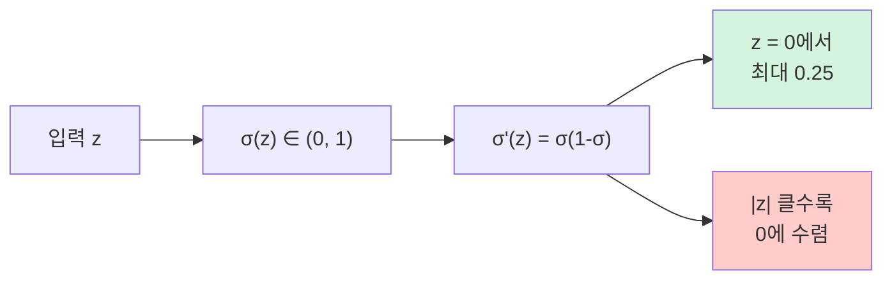
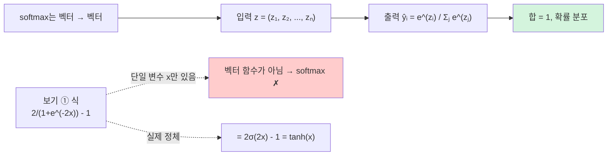
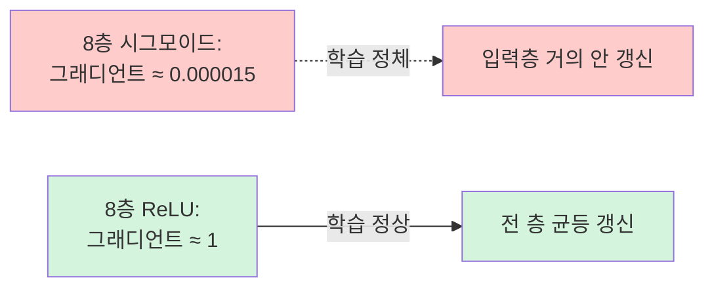
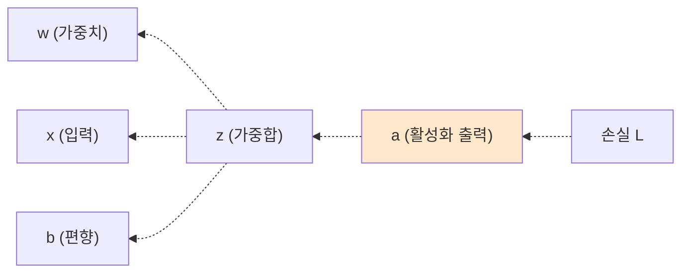

> **이 글의 목적**
>
> [AI 심화 ②](/ai/ai-advanced-neural-networks/)에서 *활성화 함수의 정의* 까지 정리했지만, **미분 자체를 깊이 다루진 않았다**. 그런데 시험에서는 *시그모이드 미분 최댓값은?*, *시그모이드 5층 후 그래디언트는?* 같은 *미분 직출 문제* 가 매년 나온다.
>
> 이 글은 활성화 함수 6종(시그모이드·Tanh·ReLU·Leaky ReLU·Softmax·Softplus)의 **미분 식을 직접 유도** 하고, *역전파 연쇄법칙의 어디에 어떤 미분이 들어가는지*, 그리고 *Softmax + Cross-Entropy의 결합 미분이 왜 ŷ−y로 깔끔하게 나오는지* 까지 정리한다.
>
> 정리는 *Goodfellow, Bengio & Courville*의 *Deep Learning*[^1] Ch.6을 토대로, **Rumelhart, Hinton & Williams 1986**[^2] (역전파 원전), **Glorot & Bengio 2010**[^3] (활성화 함수 분석), **Nair & Hinton 2010**[^4] (ReLU)의 원전 논문을 직접 확인했다.
>
> **읽고 나면 답할 수 있는 질문**:
>
> - **시그모이드 미분 최댓값이 왜 0.25인가** — 식 유도부터
> - **σ'(z) = σ(z)·(1-σ(z))** 라는 *깔끔한 관계* 가 어떻게 나오나
> - **Tanh 미분 = 1 − tanh²(z)** — 최댓값 1
> - **ReLU 미분** 은 z=0에서 미분 불가인데 실무에선 어떻게 처리하나
> - **Softmax 미분** 은 *Jacobian 행렬* 형태가 되는 이유
> - **Softplus 미분 = 시그모이드** — 우연이 아닌 이유
> - **Softmax + Cross-Entropy 결합 미분 = (ŷ − y)** 가 *왜 그렇게 깔끔한가*
> - **기울기 소멸 직관** — 시그모이드 0.25^n 이 깊은 층에서 어떻게 0으로 수렴하는가
> - **역전파의 어느 위치** 에 활성화 함수 미분이 들어가는가

---

## 1. 왜 활성화 함수 미분이 중요한가

### 1.1 역전파 연쇄법칙에 *반드시* 등장

역전파에서 가중치 *w* 의 그래디언트 식은:

> **∂L/∂w = (∂L/∂a) × (∂a/∂z) × (∂z/∂w)**


가운데 **∂a/∂z = σ'(z)** 가 *활성화 함수의 미분*. 이 항이 *어떤 값을 갖느냐* 가 학습 속도·기울기 소멸·죽은 뉴런 모두를 결정한다.

### 1.2 시험 직출 패턴

| 빈출 유형 | 핵심 |
|---|---|
| *시그모이드의 미분 최댓값은?* | **0.25** (z=0에서) |
| *Tanh의 미분 최댓값은?* | **1** (z=0에서) |
| *ReLU의 미분은?* | 양수 → 1, 음수 → 0 |
| *기울기 소멸이 시그모이드에서 왜 심각한가?* | 미분 < 0.25 → 깊은 층에서 0 수렴 |
| *Softmax + CE의 결합 미분은?* | **ŷ − y** (깔끔) |

---

## 2. 시그모이드 미분 — *0.25의 비밀*

### 2.1 식

> **σ(z) = 1 / (1 + e^(-z))**

### 2.2 미분 유도 (Step by Step)

**Step 1.** *u = 1 + e^(-z)* 라 두면 *σ = 1/u*.

```text
dσ/du = -1/u²
du/dz = -e^(-z)
```

**Step 2.** 연쇄법칙으로 합치기:

```text
dσ/dz = (dσ/du) × (du/dz)
      = (-1/u²) × (-e^(-z))
      = e^(-z) / (1 + e^(-z))²
```

**Step 3.** *깔끔한 형태* 로 변환 — 분자/분모 정리.

```text
e^(-z) / (1 + e^(-z))²
= [1/(1+e^(-z))] × [e^(-z)/(1+e^(-z))]
= σ(z) × [e^(-z)/(1+e^(-z))]
```

여기서 *e^(-z)/(1+e^(-z))* 는?

```text
e^(-z)/(1+e^(-z)) = (1+e^(-z) - 1)/(1+e^(-z))
                  = 1 - 1/(1+e^(-z))
                  = 1 - σ(z)
```

**Step 4.** 결과:

> **σ'(z) = σ(z) · (1 − σ(z))**

이 식이 *왜 우아한가*: 미분을 *σ 자체로만* 표현 가능 → 순전파에서 이미 계산한 σ(z) 값을 *재활용* 가능 → **계산 효율** ↑.

### 2.3 최댓값이 0.25인 이유

*σ'(z) = σ · (1−σ)* 는 *σ의 이차함수* 형태. *σ ∈ (0, 1)* 이므로:

```text
f(σ) = σ(1-σ) = σ - σ²
f'(σ) = 1 - 2σ = 0  →  σ = 0.5
f(0.5) = 0.5 × 0.5 = 0.25
```

> **σ'_max = 0.25**, 발생 위치는 **σ(z) = 0.5 ⟺ z = 0**.

### 2.4 시각적 직관



> ⚠️ *|z| > 6* 이면 σ'(z) < 0.0024 — *거의 0*. **포화(saturation) 영역** 이라 부르고, 이 영역에서 학습은 사실상 멈춘다.

---

## 3. Tanh 미분 — 최댓값 1, 그래도 소멸한다

### 3.1 식

> **tanh(z) = (e^z − e^(-z)) / (e^z + e^(-z))**

또는 시그모이드와의 관계로:

> **tanh(z) = 2σ(2z) − 1**

### 3.2 미분 유도 (간단형)

분수 미분 공식 적용 또는 시그모이드 관계로 풀기:

```text
d/dz tanh(z) = 1 - tanh²(z)
```

#### 유도 (간단 버전)

*tanh = (e^z - e^(-z))/(e^z + e^(-z))* 에 분수 미분 공식.

분자 미분: e^z + e^(-z), 분모 미분: e^z − e^(-z).

```text
d/dz tanh(z) = [(e^z + e^(-z))² − (e^z − e^(-z))²] / (e^z + e^(-z))²
            = 1 − [(e^z − e^(-z))² / (e^z + e^(-z))²]
            = 1 − tanh²(z)
```

### 3.3 최댓값과 시그모이드 비교

```text
tanh(0) = 0  →  tanh'(0) = 1 - 0² = 1
```

> **tanh'_max = 1** (z=0에서)

| 활성화 | 미분 최댓값 |
|---|---|
| Tanh | **1** |
| Sigmoid | 0.25 |

> 💡 *tanh가 시그모이드보다 4배 큰 미분 최댓값* 을 가진다. 그래서 *RNN의 기본 활성화* 가 tanh인 것. 그래도 *|z| 큰 영역에선 여전히 포화* 라 깊은 네트워크에선 기울기 소멸 발생.

---

## 4. ReLU 미분 — 0 또는 1, 그러나 *죽은 뉴런*

### 4.1 식

> **ReLU(z) = max(0, z)**

### 4.2 미분

```text
d/dz ReLU(z) = {
    1   if z > 0
    0   if z < 0
    undefined at z = 0
}
```

### 4.3 z = 0에서의 *미분 불가능* 처리

수학적으로 *z = 0* 에서 *좌·우 미분이 다르므로* 미분 불가. 그런데 실무에선:

| 관행 | 설명 |
|---|---|
| **z = 0에서 0으로 정의** | PyTorch, TensorFlow 기본 |
| **z = 0에서 1로 정의** | 일부 구현 |
| **subgradient** | 수학적 정확 — [0, 1] 구간 어떤 값이든 OK |

> 💡 부동소수점에서 *정확히 0이 될 확률* 은 거의 없으므로 실용적으로 무관.

### 4.4 ReLU가 *기울기 소멸을 푸는* 이유

```mermaid
flowchart LR
    A["시그모이드"] -->|"미분 ≤ 0.25"| A1["깊은 층에서<br/>0.25^n → 0"]
    B["ReLU"] -->|"양수 영역 미분 = 1"] -->|"무한 곱해도 1"| B1["그래디언트<br/>그대로 전달"]

    style A1 fill:#ffcccc
    style B1 fill:#d4f4dd
```

양수 영역에서 *미분이 일정하게 1* 이라 *깊은 층까지 그래디언트가 그대로* 전달.

### 4.5 죽은 뉴런 (Dead Neuron) 문제

음수 영역에서 *미분이 0* 이라 *그래디언트가 안 흐름* → *학습 멈춤*. 한 번 음수로 빠진 뉴런은 *영영 회복 못함*.

> 💡 **해결**: Leaky ReLU, ELU, Swish 등이 *음수 영역에 작은 기울기* 부여.

---

## 5. Leaky ReLU 미분

### 5.1 식

> **LeakyReLU(z) = max(αz, z)**, 보통 α = 0.01

### 5.2 미분

```text
d/dz LeakyReLU(z) = {
    1   if z > 0
    α   if z ≤ 0
}
```

> α가 *작은 양수* 라서 음수 영역에서도 *미세한 그래디언트* 가 흐름 → 죽은 뉴런 해결.

### 5.3 변형들

| 함수 | 음수 영역 |
|---|---|
| **Leaky ReLU** | αz (α 고정) |
| **Parametric ReLU (PReLU)** | αz (α 학습) |
| **ELU** | α(e^z − 1) — 부드러움 |
| **Swish/SiLU** | z·σ(z) — 부드럽고 음수 일부 살림 |
| **GELU** | z·Φ(z) — Transformer 표준 |

---

## 6. Softmax 미분 — *Jacobian 행렬* 이 되는 이유

### 6.1 식

다중 분류 출력층의 *벡터 → 확률 분포* 함수.

> **softmax_i(z) = e^(z_i) / Σ_j e^(z_j)**

### 6.2 미분이 *행렬* 인 이유

다른 활성화 함수들은 *스칼라 → 스칼라* 라 미분이 *스칼라 한 개*. Softmax는 *벡터 → 벡터* 이므로 미분이 **Jacobian 행렬** *∂softmax_i/∂z_j* (i, j 모두 변함).

### 6.3 두 경우 분리

#### 대각선 (i = j)

```text
∂softmax_i / ∂z_i = softmax_i × (1 − softmax_i)
```

(시그모이드 미분 식과 *모양이 똑같다*. 이유는 둘 다 *지수형 정규화* 이기 때문.)

#### 비대각선 (i ≠ j)

```text
∂softmax_i / ∂z_j = -softmax_i × softmax_j
```

### 6.4 Jacobian 한 줄 정리

> **∂softmax_i/∂z_j = softmax_i · (δ_ij − softmax_j)**

여기서 *δ_ij* 는 크로네커 델타 (i=j면 1, 아니면 0).

### 6.5 직접 미분이 복잡한 이유 → *Cross-Entropy와 결합* 하면 깔끔

이 미분을 *그대로 사용* 하면 역전파가 복잡. 그래서 보통 **Softmax + Cross-Entropy를 결합** 해 미분 — 깔끔하게 *(ŷ − y)* 로 떨어진다 (§9 참조).

---

## 7. Softplus 미분 — *시그모이드와 동일* 한 우연의 일치

### 7.1 식

> **softplus(z) = ln(1 + e^z)**

### 7.2 미분

```text
d/dz softplus(z) = e^z / (1 + e^z)
                = 1 / (1 + e^(-z))
                = σ(z)
```

> **softplus'(z) = σ(z)** ★

### 7.3 의미

Softplus는 *ReLU의 매끄러운 근사*. 그 미분이 *시그모이드* 라는 점은:

- *부드럽게 켜지는* 활성화 함수 (softplus)는
- *부드럽게 켜지는* 게이트 (시그모이드)와 *수학적으로 짝* 이라는 의미.

이 관계는 *변분 추론(VI)·정보이론·확률적 모델* 곳곳에 등장.

---

## 8. 활성화 함수 미분 — *시험 직전 1표 정리* ★★★

| 활성화 | 식 | **미분** | 미분 최댓값 | 출제 자주? |
|---|---|---|---|---|
| **시그모이드** | `1/(1+e^(-z))` | **σ(1−σ)** | **0.25** | ★★★ |
| **Tanh** | `(e^z−e^(-z))/(e^z+e^(-z))` | **1 − tanh²** | **1** | ★★ |
| **ReLU** | `max(0, z)` | **z>0이면 1, z≤0이면 0** | 1 | ★★★ |
| **Leaky ReLU** | `max(αz, z)` | z>0이면 1, z≤0이면 α | 1 | ★ |
| **Softplus** | `ln(1+e^z)` | **σ(z)** | 1 (z→∞) | ★ |
| **Softmax** | `e^(z_i)/Σe^(z_j)` | Jacobian (대각: σ_i(1−σ_i), 비대각: −σ_i·σ_j) | — | ★★ (CE와 결합형으로) |

> 🎯 **시험 단골**: *"시그모이드 미분의 최댓값은 0.25"* / *"Tanh 미분의 최댓값은 1"*. **시그모이드와 Tanh의 미분 최댓값을 묻는 함정** 이 자주 나온다.

---

## 8.5. 활성화 함수 *식 정확성* 함정 — 2024-10번 직출 ★★★

> **2024년 7급 데이터직 인공지능 10번**
>
> *"활성화 함수 수식으로 옳지 않은 것은?"*

| 보기 | 식 | 판정 |
|---|---|---|
| ① softmax(x) = **2 / (1 + e^(-2x)) − 1** | ❌ **거짓** ← 정답 | 이건 *Tanh의 한 형태*. Tanh(x) = 2σ(2x) − 1 이고, 2/(1+e^(-2x)) - 1 = 2σ(2x) - 1 = tanh(x) |
| ② softplus(x) = **ln(1 + eˣ)** | ✅ 참 | 정의 그대로. 미분이 σ(x) (§7) |
| ③ sigmoid(x) = **1 / (1 + e^(-x))** (단극성) | ✅ 참 | 표준 정의 |
| ④ Leaky ReLU(x) = **max(αx, x)** (α는 양의 상수) | ✅ 참 | α는 보통 0.01 같은 작은 양수 |

→ **정답 ①**

### 함정의 핵심 — *softmax는 단변수 식이 아니다*



#### 왜 *2/(1+e^(-2x)) − 1 = tanh(x)* 인가

**Step 1.** 시그모이드 정의로 변환:
```text
2 / (1 + e^(-2x)) - 1 = 2σ(2x) - 1
```

**Step 2.** Tanh의 시그모이드 표현:
```text
tanh(x) = (e^x - e^(-x)) / (e^x + e^(-x))
       = (e^(2x) - 1) / (e^(2x) + 1)         (양변 e^x로 나눔의 역)
       = 1 - 2/(e^(2x) + 1)
       = 1 - 2/(1 + e^(2x))
```

**Step 3.** 우리 식 *2σ(2x) − 1* 을 풀면:
```text
2σ(2x) - 1 = 2/(1+e^(-2x)) - 1
```

분자/분모에 *e^(2x)* 를 곱하면:
```text
= 2·e^(2x) / (e^(2x) + 1) - 1
= [2·e^(2x) - (e^(2x) + 1)] / (e^(2x) + 1)
= (e^(2x) - 1) / (e^(2x) + 1)
= tanh(x)   ★
```

> 💡 **결론**: 보기 ①의 식은 *softmax* 가 아니라 **tanh**. 그래서 *softmax 수식으로 옳지 않다* 가 정답.

### 시험에서 식 함정을 가려내는 *세 가지 체크*

1. **softmax는 벡터 함수** — 단일 변수 식이면 *softmax 아님* (거의 100% tanh의 변형)
2. **sigmoid는 (0, 1)만** — 양/음 둘 다 출력하면 *sigmoid 아님*
3. **Leaky ReLU의 α는 양수** — α<0이면 함정

---

## 9. Softmax + Cross-Entropy 결합 미분 — *(ŷ − y)* 의 비밀

### 9.1 셋업

다중 분류에서:
- **ŷ = softmax(z)** — 예측 확률 분포
- **y** — 원-핫 정답 벡터
- **L = −Σ_i y_i · log(ŷ_i)** — Cross-Entropy 손실

### 9.2 결합 미분 결과

> **∂L / ∂z_i = ŷ_i − y_i**

*예측 − 정답*. 매우 깔끔.

### 9.3 유도

복잡해 보이지만 *연쇄법칙과 Softmax Jacobian* 만 쓰면 풀린다.

```text
∂L/∂z_i = Σ_k (∂L/∂ŷ_k) × (∂ŷ_k/∂z_i)
        = Σ_k (-y_k/ŷ_k) × ŷ_k(δ_ki − ŷ_i)
        = -Σ_k y_k(δ_ki − ŷ_i)
        = -y_i + ŷ_i × Σ_k y_k
        = ŷ_i - y_i           (∵ Σ_k y_k = 1)
```

### 9.4 시그모이드 + Binary Cross-Entropy 도 같은 형태

이진 분류:
- **ŷ = σ(z)**
- **L = −[y log(ŷ) + (1−y) log(1−ŷ)]**

결합 미분도 똑같이:

> **∂L / ∂z = ŷ − y**

### 9.5 *왜 이 조합이 표준인가*

**미분이 깔끔** → *역전파 구현 단순* → *학습 안정*. 이 *우연이 아닌 수학적 짝* 이 **다중 분류 = Softmax + CE / 이진 분류 = Sigmoid + BCE** 가 표준이 된 이유.

---

## 10. 기울기 소멸 — *0.25^n* 의 직관

### 10.1 깊은 시그모이드 네트워크

각 층마다 시그모이드가 들어 있으면, 역전파 시 *각 층마다 σ'(z)가 곱해진다*. 최댓값이 *0.25* 이므로:

| 층 수 | 최선의 경우 그래디언트 크기 |
|---|---|
| 1층 | 0.25 |
| 2층 | 0.0625 |
| 4층 | 0.0039 |
| **8층** | **0.000015** |
| 16층 | ≈ 2.3 × 10⁻¹⁰ |

> ⚠️ 8층만 되어도 *그래디언트가 사실상 0*. 입력층 근처 가중치는 거의 갱신 안 됨 → **기울기 소멸(Vanishing Gradient)**.

### 10.2 ReLU의 우월

ReLU는 양수 영역에서 *미분 = 1 일정* → 곱해도 줄지 않음.



### 10.3 보완 기법

- **잔차 연결 (ResNet)**: 그래디언트 *우회로* 제공 — 곱이 아니라 *덧셈*
- **배치 정규화 (BatchNorm)**: 활성화 입력 *분포 정규화* → 포화 영역 회피
- **He·Xavier 초기화**: 가중치 *분산을 적절히 설정* → 초기엔 포화 안 들어감

---

## 11. 역전파에서의 미분 — 어디에 무엇이 들어가는가

### 11.1 한 층에서의 그래디언트 계산



#### 미분 4단계

```text
1. ∂L/∂a  = (출력층 또는 다음 층에서 받음)
2. ∂a/∂z  = σ'(z)             ← 활성화 함수 미분 ★
3. ∂z/∂w  = x                  (z = w·x + b 미분)
4. ∂z/∂b  = 1
5. ∂z/∂x  = w  (이전 층으로 전달)
```

#### 가중치 갱신

```text
∂L/∂w = (∂L/∂a) × σ'(z) × x
```

가중치 학습 식:

```text
w_new = w - η × (∂L/∂a) × σ'(z) × x
```

### 11.2 활성화 함수 미분이 *학습률에 곱해지는* 효과

활성화 미분이 작으면 *유효 학습률* 도 작아진다. 시그모이드에서 *|z|가 큰 포화 영역* 에 빠지면, 학습률이 아무리 커도 *학습이 거의 안 됨*. ReLU·BatchNorm·잔차 연결 등은 결국 *유효 학습률을 충분히 유지하는* 방향의 보완책.

---

## 12. 헷갈리는 것 / 자주 묻는 질문

### Q1. *시그모이드 미분이 σ(1-σ)인 이유를 1분 안에 설명?*

σ = 1/(1+e^(-z)) 미분하면 *e^(-z)/(1+e^(-z))²* 가 나오고, 이걸 *σ × (1-σ)* 로 정리. 핵심 트릭은 *e^(-z)/(1+e^(-z)) = 1 - σ* 라는 항등식.

### Q2. *Tanh 미분 최댓값 1이면 기울기 소멸이 안 발생하나?*

**여전히 발생함**. *|z| 크면* tanh(z)도 ±1로 포화 → tanh²(z) → 1 → *미분 → 0*. 시그모이드보단 낫지만 본질적 해결은 ReLU.

### Q3. *Softmax 미분이 왜 행렬이 되는가?*

Softmax는 *벡터 → 벡터*. 한 출력 ŷ_i가 *모든 입력 z_j* 에 의존하므로, *모든 (i, j) 쌍* 에 대해 미분이 정의됨 → Jacobian 행렬.

### Q4. *Softmax + CE 결합 미분이 (ŷ−y)인 이유는 우연인가?*

**아니다**. *Softmax가 지수형 정규화 + CE가 로그* 라 두 함수가 서로 *역함수처럼 상쇄*. 이런 *짝*은 *Generalized Linear Model* 이론에서 일반화됨 (canonical link function).

### Q5. *ReLU의 z=0에서 미분이 정의 안 되면 학습이 안 되나?*

**된다**. 부동소수점에서 *정확히 0이 될 확률* 은 거의 0. 실무 라이브러리는 *0으로 처리* (PyTorch 기본).

### Q6. *기울기 소멸 vs 기울기 폭발 — 둘 다 시그모이드 문제?*

- **기울기 소멸**: 시그모이드/Tanh의 *작은 미분*을 곱한 결과
- **기울기 폭발**: *큰 가중치*를 곱한 결과 — RNN에서 자주

해결책도 다름:
- 소멸: ReLU·잔차 연결·BatchNorm
- 폭발: **Gradient Clipping** (절댓값 일정 이하로 자름)

### Q7. *Softplus = ln(1+e^z)의 미분이 시그모이드라는 게 우연?*

**우연 아닌 구조적 결과**. *Softplus는 ReLU의 매끄러운 근사*, *시그모이드는 계단 함수의 매끄러운 근사*. 두 *부드러운 짝* 의 미분 관계는 *지수족 분포의 일반 성질*.

---

## 13. 시험 직전 1분 요약

> A4 한 장 압축본.

### 핵심 6개

1. **시그모이드 미분**: **σ'(z) = σ(z)·(1−σ(z))**, 최댓값 **0.25** (z=0)
2. **Tanh 미분**: **1 − tanh²(z)**, 최댓값 **1** (z=0)
3. **ReLU 미분**: 양수 → 1, 음수 → 0 (기울기 소멸 해결)
4. **Softplus 미분 = 시그모이드** (우연 아님)
5. **Softmax + CE 결합 미분**: **ŷ − y** (sigmoid + BCE도 같음)
6. **기울기 소멸 직관**: 시그모이드 8층 → 그래디언트 0.25⁸ ≈ 0.000015 → 학습 정체

### 자주 헷갈리는 한 마디

- *"시그모이드 미분 최댓값은 1"* → **거짓 (0.25)**
- *"Tanh 미분 최댓값은 0.25"* → **거짓 (1)**
- *"ReLU의 미분은 z=0에서 정의된다"* → **수학적 거짓** (실무 0으로)
- *"Softmax 미분은 스칼라"* → **거짓 (Jacobian 행렬)**
- *"Softplus 미분은 ReLU"* → **거짓 (시그모이드)**
- *"기울기 소멸은 ReLU에서도 발생"* → **거의 거짓** (양수 영역에선 1)
- *"Softmax + MSE도 (ŷ-y)로 깔끔"* → **거짓** (CE와 결합해야 깔끔)

### 시험 빈출 패턴

| 빈출 유형 | 풀이 키 |
|---|---|
| 시그모이드 미분값 | σ(1-σ) — σ값 알면 즉시 |
| Tanh 미분 식 | 1 − tanh²(z) |
| ReLU 미분 | z>0이면 1, z<0이면 0 |
| 기울기 소멸 추정 | 시그모이드: 0.25^n |
| Softmax + CE 미분 | (ŷ - y) 이걸로 끝 |
| 활성화 함수 식 함정 | softmax는 단변수 식 ✗ (벡터 함수) |

---

## 14. 다음 학습

활성화 함수 미분까지 정리됐으니, 신경망 학습의 *전체 메커니즘* 이 이제 완전히 손에 잡힌다.

- 📌 **[알고리즘 ②] 그래프 알고리즘** — BFS·DFS·다익스트라·MST·위상정렬
- 📌 **[알고리즘 ③] 동적 계획법·분할정복·그리디**
- 📌 **[AI시스템 ①~②] MLOps + AI 윤리**

추가 학습 자료:

- *Deep Learning* (Goodfellow 외 2016) Ch.6 — 활성화 함수 분석
- *cs231n* (Stanford) — Lecture 6: Backpropagation 손유도
- *Backpropagation Calculus* (3Blue1Brown) — 시각적 직관

---

## 15. 참고 문헌 (References)

[^1]: Goodfellow, I., Bengio, Y., & Courville, A. (2016). *Deep Learning*. MIT Press. (Ch. 6 신경망 + 활성화 함수)

[^2]: Rumelhart, D. E., Hinton, G. E., & Williams, R. J. (1986). Learning representations by back-propagating errors. *Nature*, 323(6088), 533–536.

[^3]: Glorot, X., & Bengio, Y. (2010). Understanding the difficulty of training deep feedforward neural networks. *AISTATS 2010*. (Xavier 초기화 + 활성화 함수 분석)

[^4]: Nair, V., & Hinton, G. E. (2010). Rectified linear units improve restricted boltzmann machines. *ICML 2010*. (ReLU 원전)

[^5]: He, K., Zhang, X., Ren, S., & Sun, J. (2015). Delving deep into rectifiers: Surpassing human-level performance on ImageNet classification. *ICCV 2015*. (PReLU + He 초기화)

[^6]: Hendrycks, D., & Gimpel, K. (2016). Gaussian Error Linear Units (GELUs). *arXiv:1606.08415*. (GELU)

### 보조 자료

- 7급 데이터직 인공지능 기출 (2023~2025) — 활성화 함수 관련 문항: 2023-10·19·20, 2024-10·17·23, 2025-18·20
- KODIT 학습노트 W10 (딥러닝)

---

## 부록 A: 이미지 생성 프롬프트

> 📁 이미지 프롬프트는 [`/prompts/2026-05-01-ai-advanced-activation-derivatives.md`](/prompts/2026-05-01-ai-advanced-activation-derivatives.md) 에 별도 정리되어 있다 (한글 라벨·파일명·저장 경로 명시).

> ✍️ **다음 학습**: [알고리즘 ②] 그래프 알고리즘 — BFS·DFS·다익스트라·MST·위상정렬. 작성 예정.
