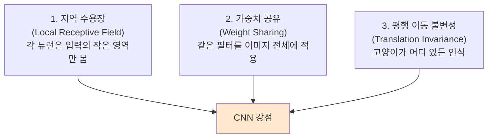
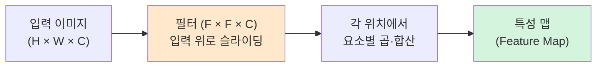
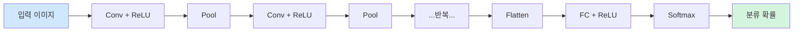
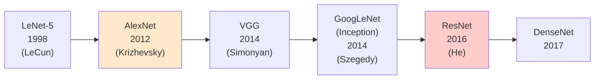
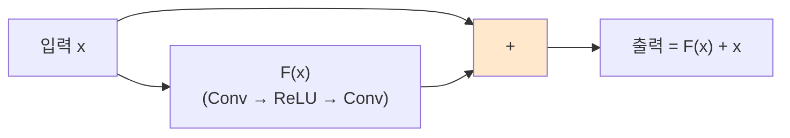
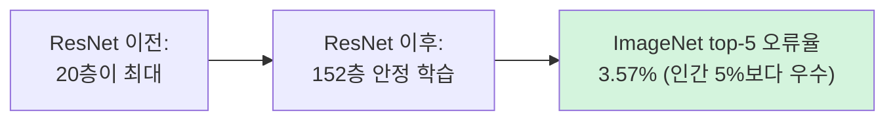
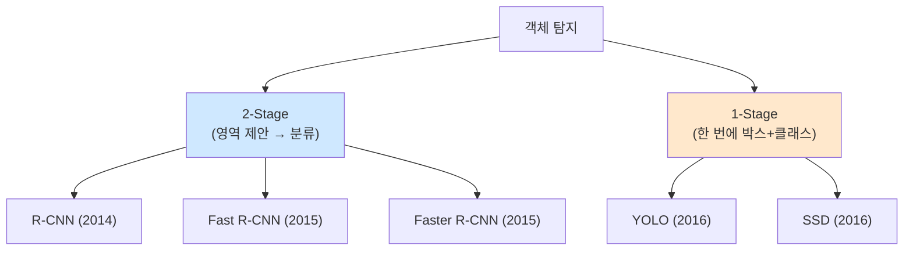
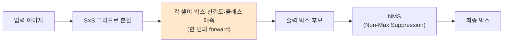
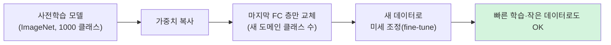

> **이 글의 목적**
>
> [AI 심화 ②](/ai/ai-advanced-neural-networks/)에서 일반 신경망의 수식과 학습을 정리했다면, 이번 편은 *이미지에 특화된 신경망* — **CNN(합성곱 신경망)** 을 깊게 본다.
>
> 7급 데이터직 인공지능 75문항 분석 결과, **CNN이 7문항/9% — 두 번째로 큰 비중**이다. 매년 *합성곱 출력 크기 계산·합성곱 직접 계산·최대 풀링 트레이싱·객체 탐지 모델 비교* 같은 **수치 직출 + 모델 식별** 문제가 나온다.
>
> 정리에는 *Russell & Norvig*의 *AIMA* Ch.21[^1]과 *Goodfellow, Bengio & Courville*의 *Deep Learning* Ch.9[^2]을 토대로, 각 모델의 **원전 논문** (LeCun 1998, Krizhevsky 2012, He 2016, Redmon 2016 등)을 직접 확인했다.
>
> **읽고 나면 답할 수 있는 질문**:
>
> - **CNN이 일반 MLP보다 이미지에 강한 이유** — 가중치 공유, 지역 수용장, 평행 이동 불변성
> - **합성곱 출력 크기 공식**: `(H - F + 2P) / S + 1` 의 모든 변수 의미
> - 입력이 31×21, 필터 3×3, 패딩 1, 스트라이드 2면 출력은? (시험 직출)
> - **Max Pooling vs Average Pooling** — 언제 어느 쪽
> - **AlexNet → VGG → GoogLeNet → ResNet** — 무엇이 문제였고 무엇이 해결됐는가
> - **잔차 연결(Residual Connection)** 은 왜 152층까지 학습 가능하게 만드는가
> - **R-CNN 계열 (R-CNN → Fast → Faster) vs YOLO vs SSD** — 정확도와 속도의 트레이드오프
> - **전이 학습(Transfer Learning)** — 사전학습된 모델을 어떻게 재활용하는가

---

## 1. CNN이 왜 이미지에 강한가

### 1.1 일반 MLP의 한계

256×256 컬러 이미지를 MLP에 넣으려면 입력층에 **256×256×3 = 196,608개** 노드가 필요하다. 첫 은닉층 뉴런이 1,000개라면 가중치만 *약 2억 개*. 학습 데이터·연산·메모리 모두 폭발한다.

게다가 *공간적 구조* 가 사라진다. 픽셀의 인접 관계는 이미지의 가장 중요한 정보인데, 1D 벡터로 펴버리면 그 정보가 날아간다.

### 1.2 CNN의 세 가지 핵심 아이디어



이 세 가지가 결합돼 **파라미터 수 ↓·일반화 ↑·계산 효율 ↑** 가 된다.

> 💡 **시험 (2024-24 ③)**: *"합성곱 신경망은 특징 추출을 담당하는 합성곱층과 분류를 담당하는 전결합층을 포함하는 다층 퍼셉트론 모델의 한 종류이다"* → **참**.

---

## 2. 합성곱 연산 (Convolution)


### 2.1 직관 — 필터를 이미지 위로 *슬라이딩*



- **필터(filter, kernel)**: 작은 가중치 행렬 (보통 3×3, 5×5)
- 입력 이미지의 모든 위치에 같은 필터를 *슬라이딩* 하며 적용
- 각 위치에서 요소별 곱셈 → 합산 → 특성 맵의 한 픽셀

### 2.2 출력 크기 공식 — *시험 직출*

> **H' = (H - F + 2P) / S + 1**

| 변수 | 의미 |
|---|---|
| **H, W** | 입력 높이·너비 |
| **F** | 필터 크기 |
| **P** | 패딩(padding) — 입력 가장자리에 0을 둘러 크기 보존 |
| **S** | 스트라이드(stride) — 필터 이동 간격 |

#### 시험 직출 — 2023-23 ★★★

> 입력 31×21, 필터 3×3, 패딩 1, 스트라이드 2일 때 출력 크기는?

```text
H' = (31 - 3 + 2×1) / 2 + 1 = (28 + 2) / 2 + 1 = 30/2 + 1 = 16
W' = (21 - 3 + 2×1) / 2 + 1 = (18 + 2) / 2 + 1 = 20/2 + 1 = 11
```

→ **16 × 11** (정답 ②)

> 🎯 **암기 팁**: *입력에서 필터를 빼고 양쪽에 패딩을 더한 뒤 스트라이드로 나누고 1을 더한다*. 한 줄로 외우면 시험장에서도 바로 풀린다.

### 2.3 합성곱 직접 계산 — 2023-16 ★★★

입력 데이터 (4×4):

```text
1 2 3 0
0 1 2 3
3 0 1 2
2 3 0 1
```

필터 (3×3):

```text
2 0 1
0 1 2
1 0 2
```

스트라이드 1, 패딩 0 → 출력 크기 (4-3)/1 + 1 = **2 × 2**

#### 출력 (1, 0) 위치 — 입력의 (1~3행, 0~2열)과 필터 합성곱:

```text
입력 부분:        필터:
0 1 2            2 0 1
3 0 1            0 1 2
2 3 0            1 0 2

요소별 곱:
0×2  1×0  2×1     0  0  2
3×0  0×1  1×2  =  0  0  2
2×1  3×0  0×2     2  0  0

합 = 0 + 0 + 2 + 0 + 0 + 2 + 2 + 0 + 0 = 6
```

→ (1, 0) 위치 출력 = **6** (2023-16 정답 ②)

> 💡 **계산 팁**: 9개 곱셈 결과를 표로 정리한 뒤 합산하면 실수 줄어듦. 0이 곱해지는 칸은 빠르게 건너뛸 것.

### 2.4 패딩과 스트라이드의 효과

| 옵션 | 효과 |
|---|---|
| **패딩 추가** | 출력 크기 보존, 가장자리 픽셀 정보 보호 |
| **스트라이드 ↑** | 출력 크기 ↓, 다운샘플링 효과, 계산량 ↓ |
| **다중 채널 (C > 1)** | 입력·필터 모두 C개 채널, 합성곱 결과는 채널 합산해 1개 |

---

## 3. 풀링 (Pooling)

### 3.1 두 종류

| 풀링 | 동작 |
|---|---|
| **Max Pooling** | 영역 내 *최댓값* 만 선택 — 강한 활성화 보존 |
| **Average Pooling** | 영역 내 *평균값* — 부드러운 다운샘플링 |

> 일반적으로 **Max Pooling이 표준**. 강한 특징을 살리는 게 분류 성능에 유리.

### 3.2 핵심 특성

- **학습 파라미터 없음** — 단순 연산
- **다운샘플링** — 출력 크기 줄임
- **위치 불변성(translation invariance)** — 영역 내 작은 이동에 강건

### 3.3 Max Pooling 트레이싱 — 2024-9

5×5 입력에 2×2 필터, 스트라이드 1, 패딩 없음 → 출력 4×4.

```text
입력:
2 3 8 1 4
9 4 4 5 1
5 4 6 7 3
4 3 4 4 8
5 7 0 6 2
```

각 출력 위치는 *2×2 영역의 최댓값*. 예시:

- (0, 0): max(2, 3, 9, 4) = **9**
- (0, 1): max(3, 8, 4, 4) = **8**
- (1, 1): max(4, 4, 4, 6) = **6**
- (2, 1): max(4, 6, 3, 4) = **6**
- (1, 2): max(4, 5, 6, 7) = **7**

> 🎯 **시험 (2024-9)**: 4×4 출력에서 (가) 위치를 정확히 읽고, 해당 2×2 영역의 최댓값을 구하면 됨. 답은 보기 ① 4 / ② 5 / ③ 6 / ④ 7 중 하나.

---

## 4. CNN 표준 구조

### 4.1 한눈에 보기



- **Conv 층**: 특징 추출 (가중치 공유)
- **Pool 층**: 다운샘플링
- **반복**: 깊은 층일수록 *고차원 특징* (가장자리 → 모서리 → 부분 → 객체)
- **Flatten + FC**: 분류기 역할
- **Softmax**: 확률 출력

### 4.2 시험 함정 (2023-11 ③)

> *"CNN에서는 완전 연결(fully connected)층이 사용되지 않는다"* → **거짓**.

CNN의 분류 단계에서는 거의 항상 **FC 층 + Softmax** 가 마지막에 붙는다. 최근 *글로벌 평균 풀링(GAP)* 으로 FC를 대체하는 모델도 있지만, *FC가 안 쓰인다는 진술은 거짓*.

### 4.3 시험 함정 (2025-20 ③)

> *"CNN에서 활성화 함수로 시그모이드를 사용하면 ReLU 함수에 비해 계산시간이 줄어든다"* → **거짓**.

ReLU = `max(0, z)` 는 한 번의 비교만, **시그모이드**는 *지수 함수 e^(-z) 계산* 이 필요해 더 비싸다. 게다가 시그모이드는 *기울기 소멸* 까지 발생.

---

## 5. 유명 CNN 모델 — *시험 단골*

### 5.1 진화 타임라인



### 5.2 한 표 비교

| 모델 | 연도 | 핵심 기여 | 깊이 |
|---|---|---|---|
| **LeNet-5** | 1998 | CNN 표준 구조 (Conv-Pool-FC), 우편번호 인식[^3] | 7층 |
| **AlexNet** | 2012 | **GPU 학습**, ReLU, Dropout, ImageNet 우승[^4] | 8층 |
| **VGG** | 2014 | 작은 3×3 필터의 깊은 누적 | 16/19층 |
| **GoogLeNet (Inception)** | 2014 | **Inception 모듈** (다중 스케일 병렬) | 22층 |
| **ResNet** | 2016 | **잔차 연결** — 152층까지 학습 가능[^5] | 152층 |
| **DenseNet** | 2017 | 모든 층을 직접 연결 | 다양 |
| **EfficientNet** | 2019 | 너비·깊이·해상도 균형 스케일링 | 다양 |

> 🎯 **시험 (2024-19)**: *"ResNet, Inception, VGG 모두 영상 분석에 활용 가능"* → **참**. 셋 다 컴퓨터 비전 표준 모델.

### 5.3 AlexNet의 혁신

> Krizhevsky, A., Sutskever, I., & Hinton, G. E. (2012). *ImageNet Classification with Deep Convolutional Neural Networks*.[^4]

ImageNet 2012 대회에서 top-5 오류율을 **26%에서 15.3%로** 떨어뜨림. 이걸로 *현대 딥러닝 시대* 가 열림.

핵심 요인:
1. **GPU 두 장 병렬 학습**
2. **ReLU** — 시그모이드 대비 학습 6배 빠름
3. **Dropout** — 과적합 완화
4. **데이터 증강** — 좌우 반전, 색상 변화

---

## 6. ResNet — 잔차 연결의 마법


### 6.1 깊이의 저주

층을 깊게 쌓을수록 성능이 *오히려 나빠지는* 현상이 관찰됐다 (degradation problem). 이는 *과적합* 이 아니라 *학습 자체가 안 됨* — 기울기 소멸의 후예.

### 6.2 잔차 학습 (Residual Learning)

> He, K., Zhang, X., Ren, S., & Sun, J. (2016). *Deep Residual Learning for Image Recognition*.[^5]



핵심 식: **H(x) = F(x) + x**

- 학습할 함수를 *H(x)* 자체가 아니라 *F(x) = H(x) - x* (잔차) 로 변환
- F(x)가 0에 가까우면 *항등 매핑* 이 자연스럽게 됨 → 학습이 쉬워짐
- 그래디언트가 *우회로(skip connection)* 로 직접 전달 → 기울기 소멸 해결

### 6.3 효과



---

## 7. 객체 탐지 (Object Detection)


### 7.1 분류 vs 탐지 vs 분할

| 작업 | 출력 |
|---|---|
| **분류 (Classification)** | "이 이미지에 *무엇* 이 있나" — 단일 라벨 |
| **객체 탐지 (Detection)** | "*무엇* 이 *어디* 에 있나" — 박스 + 라벨 |
| **시맨틱 분할 (Semantic Segmentation)** | 각 픽셀이 어느 클래스인가 |
| **인스턴스 분할 (Instance Segmentation)** | 각 픽셀 + 객체 식별 (같은 클래스라도 구분) |

### 7.2 객체 탐지 모델 — 두 갈래



### 7.3 R-CNN 계열 — 정확도 우선

| 모델 | 핵심 기여 | 속도 |
|---|---|---|
| **R-CNN** (2014) | 선택적 탐색(Selective Search) → 박스마다 CNN 적용 | 매우 느림 (이미지당 47초) |
| **Fast R-CNN** (2015) | RoI Pooling으로 CNN 한 번만 | 약 2초 |
| **Faster R-CNN** (2015) | RPN (Region Proposal Network) — 박스 제안도 학습 | 약 0.2초 |
| **Mask R-CNN** (2017) | 인스턴스 분할 추가 | 비슷 |

> 🎯 **시험 (2024-14 ③)**: *"Fast R-CNN 모델에서는 입력 영상에서 객체를 탐지하기 위해 선택적 탐색 알고리즘을 사용한다"* → **참**. (Faster R-CNN부터는 RPN으로 대체)

### 7.4 YOLO — 속도 우선

> Redmon, J., Divvala, S., Girshick, R., & Farhadi, A. (2016). *You Only Look Once: Unified, Real-Time Object Detection*.[^6]

> *"한 번 보기만 하면 된다"* — 이미지를 그리드로 나누고, 각 셀이 박스 + 클래스를 *동시에* 예측. **45 FPS** 까지 가능.



### 7.5 SSD (Single Shot Detector)

> Liu, W., et al. (2016). *SSD: Single Shot MultiBox Detector*.

YOLO와 비슷한 1-stage 방식이지만, **다중 스케일 특성 맵** 에서 박스 예측. 작은 객체 탐지 향상.

### 7.6 한 표 비교

| 모델 | 방식 | 속도 | 정확도 |
|---|---|---|---|
| **R-CNN** | 2-stage | ❌ 매우 느림 | 중간 |
| **Fast R-CNN** | 2-stage | ⚠️ 느림 | 좋음 |
| **Faster R-CNN** | 2-stage | ✅ 보통 | **매우 좋음** |
| **YOLO** | 1-stage | ✅✅ **매우 빠름** | 좋음 |
| **SSD** | 1-stage | ✅ 빠름 | 좋음 (작은 객체 ↑) |

> ⚠️ **시험 함정 (2024-14 ②)**: *"R-CNN 모델에서는 객체 탐지와 분류를 동시에 수행하므로 효율성이 높다"* → **거짓**. R-CNN은 *2-stage* (영역 제안 → 분류 별도). 효율성 낮음.
>
> ⚠️ **시험 함정 (2024-14 ④)**: *"SSD가 YOLO에 비해 객체 탐지 및 분류의 정확도와 처리 속도가 개선된 모델이다"* → **거짓**. SSD는 정확도는 비슷하거나 약간 좋을 수 있지만 *속도는 YOLO가 우월*.

---

## 8. 전이 학습 (Transfer Learning)

### 8.1 핵심 아이디어

> *"한 도메인에서 학습한 지식을 다른 도메인에 재활용한다."*

ImageNet으로 학습한 모델(ResNet 등)의 가중치를 가져와, *마지막 분류층만 새 데이터로 미세 조정(fine-tuning)*. 학습 시간 ↓, 데이터 적어도 잘 됨.



### 8.2 시험 정의 (2024-18)

> *"어떤 한 분야에서 특정 과업을 수행하도록 학습한 후 유사한 분야 또는 다른 분야의 과업을 수행할 때 이전 학습 경험을 적용한다"* → **참** (정답).

함정 보기들:
- ① 입력=출력 → *오토인코더* (전이학습 아님)
- ② 환경 전이·보상 → *강화학습 모델*
- ③ 서열 데이터·은닉층 활용 → *RNN*

---

## 9. CNN과 다른 모델의 비교

### 9.1 CNN vs MLP vs RNN

| 측면 | MLP | CNN | RNN |
|---|---|---|---|
| 입력 형태 | 평탄 벡터 | 2D/3D 격자 | 시퀀스 |
| 가중치 공유 | ❌ | ✅ (필터) | ✅ (시간축) |
| 공간 구조 | 무시 | **보존** | 시간 구조 보존 |
| 병렬화 | 쉬움 | 쉬움 | 어려움 |
| 대표 응용 | 표 데이터 | 이미지·비디오 | 텍스트·음성·시계열 |

### 9.2 시험 함정 (2024-24 ①)

> *"순환 신경망은 기울기 소멸(vanishing gradient) 문제가 심각하게 발생하지 않는 장점이 있다"* → **거짓**.

RNN은 *오히려* 기울기 소멸이 심각함. 시간축으로 같은 가중치가 반복 곱해지기 때문. **LSTM·GRU** 가 게이트 구조로 이걸 해결.

---

## 10. 헷갈리는 것 / 자주 묻는 질문

### Q1. *"CNN의 합성곱은 수학의 합성곱과 같은가"*

**거의 같지만 부호가 다름**. 수학의 합성곱은 필터를 뒤집어서 적용 (`*` 연산), CNN은 뒤집지 않고 적용 (정확히는 *cross-correlation*). 학습되는 가중치라 부호는 무관 → 실용적으로 동일.

### Q2. *"왜 3×3 필터가 표준인가"*

VGG가 증명: *3×3 두 번 = 5×5 한 번* 의 수용장이지만 파라미터는 더 적음 (3×3×2 = 18 vs 5×5 = 25). 게다가 *비선형 활성화* 가 한 번 더 들어감 → 표현력 ↑.

### Q3. *"풀링은 학습 파라미터가 있나"*

**없다**. 단순 max나 average 연산. 그래서 풀링층은 *역전파에서 그래디언트만 통과시킨다*.

### Q4. *"CNN은 회전·크기 변화에도 강건한가"*

**평행 이동에만 강건**. 회전·크기 변화는 *데이터 증강* 이나 *Spatial Transformer Network*, 최근의 *ViT* 등 별도 메커니즘 필요.

### Q5. *"YOLO와 R-CNN 중 항상 YOLO가 좋은가"*

**아니다**. 정확도가 *가장 중요* 하다면 Faster R-CNN 계열. 실시간성이 필요하면 YOLO. 자율주행·CCTV는 YOLO, 의료 영상 분석은 Faster R-CNN.

### Q6. *"전이 학습에서 모든 가중치를 다 학습해야 하나"*

**아니다**. 보통 *초반 층은 동결(freeze)*, *후반 층 + FC 층만 미세조정*. 데이터가 매우 적으면 동결 비율을 더 늘림.

---

## 11. 시험 직전 1분 요약

> A4 한 장 압축본.

### 핵심 8개

1. **CNN의 강점**: 지역 수용장 + 가중치 공유 + 평행 이동 불변성
2. **합성곱 출력 크기**: `H' = (H - F + 2P) / S + 1` ★ 매년 출제
3. **합성곱 직접 계산**: 9칸 곱셈 → 합산
4. **Max Pooling**: 영역 최댓값, 학습 파라미터 0, 다운샘플링 + 위치 불변성
5. **CNN 표준 구조**: Conv → ReLU → Pool → ... → Flatten → FC → Softmax
6. **유명 모델**: LeNet(1998) → AlexNet(2012) → VGG(2014) → Inception(2014) → ResNet(2016, 152층, 잔차 연결)
7. **객체 탐지**:
   - **2-stage**: R-CNN → Fast R-CNN → Faster R-CNN (정확도 ↑)
   - **1-stage**: YOLO, SSD (속도 ↑)
8. **전이 학습**: 사전학습 모델 가중치 가져와 마지막 층만 미세조정

### 자주 헷갈리는 한 마디

- *"CNN은 FC 층을 사용하지 않는다"* → **거짓**
- *"시그모이드가 ReLU보다 계산 빠름"* → **거짓 (반대)**
- *"R-CNN은 객체 탐지와 분류를 동시에 수행"* → **거짓 (2-stage)**
- *"SSD가 YOLO보다 속도와 정확도 모두 우월"* → **거짓 (속도는 YOLO ↑)**
- *"Fast R-CNN은 선택적 탐색 사용"* → **참** (Faster부터 RPN)
- *"풀링은 학습 파라미터가 있다"* → **거짓**
- *"RNN은 기울기 소멸이 심각하지 않다"* → **거짓**
- *"CNN은 다층 퍼셉트론의 한 종류"* → **참**

### 7급 데이터직 ⑥클러스터(CNN) 빈출 패턴

| 빈출 유형 | 풀이 키 |
|---|---|
| 합성곱 출력 크기 | `(H - F + 2P) / S + 1` 공식 직접 |
| 합성곱 직접 계산 | 9칸 요소별 곱 → 합 |
| Max Pooling 트레이싱 | 2×2 영역 → 최댓값 |
| CNN 모델 식별 | LeNet/AlexNet/VGG/Inception/ResNet 연도와 기여 |
| 객체 탐지 비교 | 2-stage(정확도) vs 1-stage(속도) |
| ResNet 잔차 연결 | F(x) + x로 항등 매핑이 자연스러워짐 |
| 함정 진술 가려내기 | "FC 안 씀", "시그모이드 빠름", "R-CNN 동시" |

---

## 12. 다음 학습

다음 편에서 *시퀀스 데이터* 를 처리하는 **RNN·LSTM·GRU + 강화학습** 으로 들어간다.

- 📌 **[AI 심화 ④] RNN·LSTM·GRU + 강화학습**
- 📌 **[AI 심화 ⑤] 고전 AI 보충** — 전문가시스템·5기준·퍼지·DIKW
- 📌 **[AI 심화 ⑥] 데이터마이닝·차원 축소·진화 알고리즘**

추가 학습 자료:

- **CS231n** (Stanford) — *Convolutional Neural Networks for Visual Recognition*. <http://cs231n.stanford.edu/>
- **YOLOv8 공식 문서** — Ultralytics. <https://docs.ultralytics.com/>
- **PyTorch 공식 튜토리얼** — *Transfer Learning*. <https://pytorch.org/tutorials/beginner/transfer_learning_tutorial.html>

---

## 13. 참고 문헌 (References)

[^1]: Russell, S. J., & Norvig, P. (2020). *Artificial Intelligence: A Modern Approach* (4th ed.). Pearson. (Ch. 21 신경망과 컴퓨터 비전)

[^2]: Goodfellow, I., Bengio, Y., & Courville, A. (2016). *Deep Learning*. MIT Press. (Ch. 9 합성곱 신경망)

[^3]: LeCun, Y., Bottou, L., Bengio, Y., & Haffner, P. (1998). Gradient-based learning applied to document recognition. *Proceedings of the IEEE*, 86(11), 2278–2324.

[^4]: Krizhevsky, A., Sutskever, I., & Hinton, G. E. (2012). ImageNet classification with deep convolutional neural networks. *NeurIPS 2012*. [Paper](https://papers.nips.cc/paper/4824)

[^5]: He, K., Zhang, X., Ren, S., & Sun, J. (2016). Deep residual learning for image recognition. *CVPR 2016*. [arXiv:1512.03385](https://arxiv.org/abs/1512.03385)

[^6]: Redmon, J., Divvala, S., Girshick, R., & Farhadi, A. (2016). You Only Look Once: Unified, Real-Time Object Detection. *CVPR 2016*. [arXiv:1506.02640](https://arxiv.org/abs/1506.02640)

### 보조 자료 (교차검증용)

- 7급 데이터직 인공지능 기출 (2023~2025) — CNN 영역 7문항 전수 분석
- KODIT 학습노트 W11 (컴퓨터 비전)

---

## 부록 A: 이미지 생성 프롬프트

> 📁 이미지 프롬프트는 [`/prompts/2026-05-01-ai-advanced-cnn.md`](/prompts/2026-05-01-ai-advanced-cnn.md) 에 별도 정리되어 있다 (한글 라벨·파일명·저장 경로 명시).

> ✍️ **다음 학습**: [AI 심화 ④] RNN·LSTM·GRU + 강화학습 — 작성 예정.
