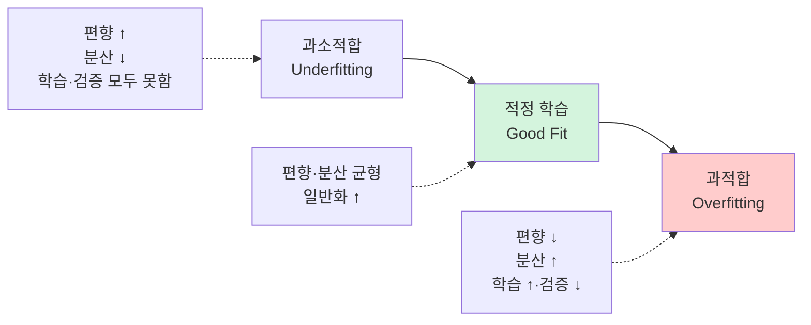
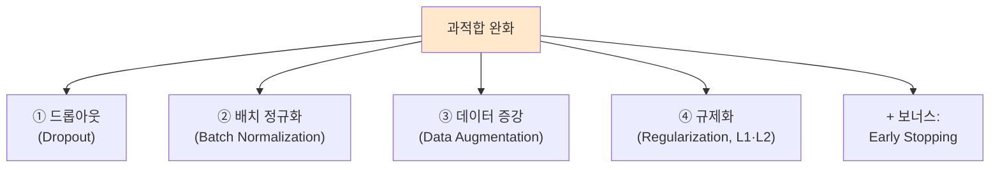
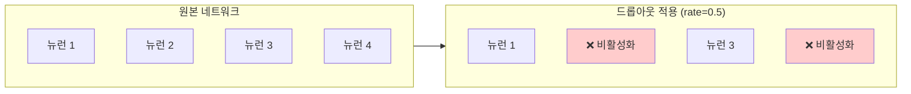
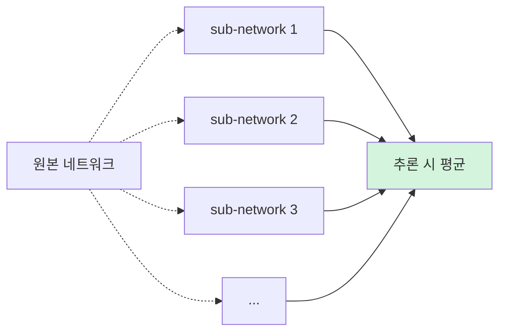
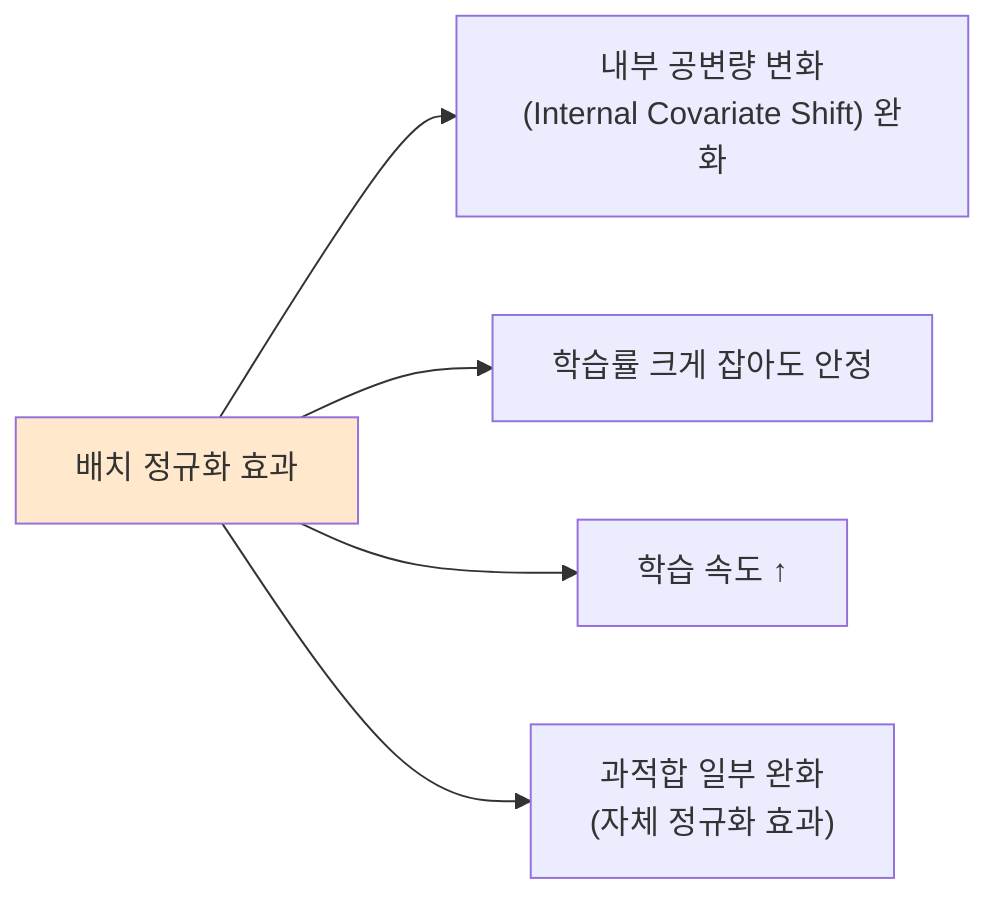
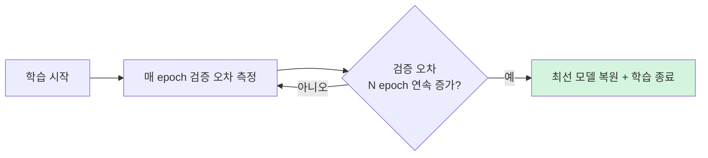

> **이 글의 목적**
>
> [AI 심화 ②](/ai/ai-advanced-neural-networks/) §7에서 과적합 완화 4대 기법을 *짧게* 다뤘다면, 이번 편은 *시험 직출 함정* 인 **2024년 7급 데이터직 인공지능 11번 문제** 를 토대로 4대 기법 모두 *식·동작 원리·시험 함정* 까지 깊이 정리한다.
>
> 24-11번 함정 (배치 정규화의 *표준편차 증대* 거짓)을 *왜 거짓인지 수식으로* 알면, 다른 함정도 같은 결로 가려낼 수 있다.
>
> 정리는 **Srivastava et al. 2014**[^1] (Dropout 원전), **Ioffe & Szegedy 2015**[^2] (BatchNorm 원전), **Tibshirani 1996**[^3] (Lasso L1), **Krogh & Hertz 1992**[^4] (Weight Decay L2) 등의 원전 논문과 *Goodfellow et al. Deep Learning*[^5] Ch.7을 토대로 했다.
>
> **읽고 나면 답할 수 있는 질문**:
>
> - **24-11번 ②번 함정** — 배치 정규화의 *표준편차 증대* 가 왜 거짓인가
> - **과적합 vs 과소적합** — 편향-분산 트레이드오프
> - **드롭아웃** 의 *학습 시 vs 추론 시* 동작 차이
> - **추론 시 (1−rate) 가중치 보정** 또는 *inverted dropout* 이 필요한 이유
> - **배치 정규화 식** — 정규화 + 스케일·시프트 (γ, β) 학습 가능
> - **러닝 평균(running mean/variance)** 으로 추론 시 처리
> - **LayerNorm vs BatchNorm** — Transformer가 LayerNorm 쓰는 이유
> - **L1 vs L2 정규화** — 희소성 유도 (L1) vs 가중치 축소 (L2)
> - **데이터 증강** 최신 기법 — Mixup, CutMix, RandAugment
> - **Early Stopping** — 단순하지만 강력한 보완

---

## 1. 시험 문제 — 24-11번 직출

> **2024년 국가직 7급 공채 인공지능 11번**
>
> *"기계학습에서 발생할 수 있는 과적합(overfitting)을 완화하기 위한 방법으로 옳지 않은 것은?"*

| 보기 | 진술 | 판정 |
|---|---|---|
| ① 드롭아웃 | 학습 시 노드를 정해진 비율로 랜덤 비활성화 | ✅ 참 |
| ② 배치 정규화 | *은닉층의 가중치를 정규화하고 노드값의 표준편차를 증대* | ❌ **거짓** ← 정답 |
| ③ 데이터 증강 | 기존 데이터에 변형을 가해 새 학습 데이터 추가 | ✅ 참 |
| ④ 규제화 | 오차함수 = 오차항 + 모델 복잡도 항, 가중치 절댓값 제한 | ✅ 참 |

→ **정답 ②**

### ②번 함정의 *두 가지* 거짓

1. *"가중치를 정규화"* — **거짓**. 배치 정규화는 *활성화 출력값(노드값)* 을 정규화한다 (가중치 ✗)
2. *"표준편차를 증대"* — **거짓**. 정규화 = *표준편차를 1로 일정* 하게 만드는 것 (증대 ✗)

본문에서 *왜 그런지* 수식으로 풀어본다 → §3에서.

---

## 2. 과적합이란 — 정의와 직관

### 2.1 정의

> **과적합(Overfitting)**: 모델이 *학습 데이터에 너무 맞춰져* 새 데이터에 대해선 오히려 못하게 되는 현상.



### 2.2 학습 곡선으로 보는 과적합

```text
오차
 │
 │     검증 오차
 │   ╲      ╱
 │    ╲    ╱   ← 과적합 지점 (검증 오차 다시 상승)
 │     ╲  ╱
 │      ╲╱
 │     ╱
 │    ╱
 │   ╱  학습 오차 (계속 감소)
 │  ╱
 └─────────────── epoch
```

학습 오차는 *계속 줄어드는* 데도 검증 오차는 *어느 시점부터 다시 증가* 한다. 이 시점 이후가 과적합.

### 2.3 편향-분산 트레이드오프

> **MSE = 편향² + 분산 + 노이즈**

| 측면 | 의미 |
|---|---|
| **편향(Bias)** | 모델이 *너무 단순* 해서 데이터를 못 잡음 → *과소적합* |
| **분산(Variance)** | 모델이 *학습 데이터의 노이즈까지* 학습 → *과적합* |
| **노이즈** | 데이터 자체의 *불가해 분산* |

> 💡 *둘을 동시에 줄일 순 없다*. 균형이 핵심. 과적합 완화 4대 기법은 모두 *분산을 줄이는* 방향으로 작동.

### 2.4 4대 완화 기법 한눈에



---

## 3. ① 드롭아웃 (Dropout) — Srivastava 2014

> Srivastava, N., Hinton, G., Krizhevsky, A., Sutskever, I., & Salakhutdinov, R. (2014). *Dropout: A simple way to prevent neural networks from overfitting*. JMLR.[^1]

### 3.1 핵심 아이디어

> *"학습 시 매 step마다 일부 뉴런을 무작위로 비활성화한다."*



### 3.2 동작 원리

#### Step 1: 학습 시

각 뉴런이 *확률 p (보통 0.5)로 살아남고, (1-p)로 죽는다*. 매 mini-batch마다 *다른 마스크* 가 적용 → *서로 다른 sub-network* 가 학습.

```text
원본: y = Σ(wᵢ · xᵢ)
드롭아웃: y = Σ(wᵢ · mᵢ · xᵢ),  mᵢ ∈ {0, 1}
```

#### Step 2: 추론 시 — *모든 뉴런 사용 + 가중치 보정*

학습 때 50%만 살아있었으니, 추론 시 *모든 뉴런이 살아 있으면* 출력이 *2배* 가 된다. 이를 보정해야 함.

| 방법 | 동작 |
|---|---|
| **표준 (vanilla)** | 추론 시 가중치에 *(1−rate) 곱* — 출력 스케일 맞춤 |
| **Inverted Dropout** | 학습 시 *1/(1−rate) 로 미리 스케일* — 추론 코드는 그대로 |

> 💡 PyTorch·TensorFlow 모두 **Inverted Dropout** 표준. 모델 추론 코드를 *바꿀 필요 없게* 만든다.

### 3.3 왜 효과적인가 — *앙상블 효과*

매 step마다 *다른 sub-network* 가 학습 → 원본 네트워크는 결국 *2^N 개의 sub-network 평균* 학습. **앙상블** 과 같은 효과.



### 3.4 시험 함정 (24-11 ①)

> *"드롭아웃은 학습 과정에서 노드를 미리 정해진 비율만큼 랜덤으로 비활성화하여 과적합을 완화한다"* → **참** ✓

자주 헷갈리는 함정 후보:
- *"드롭아웃은 추론 시에도 적용한다"* → **거짓** (학습 시만)
- *"rate=0이면 효과 없다"* → 참 (모든 뉴런 살아 있음)
- *"rate=1이면 학습이 잘 된다"* → **거짓** (모든 뉴런 죽어서 학습 ✗)

---

## 4. ② 배치 정규화 (Batch Normalization) — 24-11번 *직접* 함정

> Ioffe, S., & Szegedy, C. (2015). *Batch Normalization: Accelerating deep network training by reducing internal covariate shift*. ICML.[^2]

### 4.1 핵심 아이디어

> *"각 미니배치 단위로 활성화 출력값(노드값)을 평균 0, 분산 1로 정규화한다."*

### 4.2 식 — 4단계

```text
학습 시 (Training):

Step 1. 미니배치 평균:        μ_B = (1/m) Σ xᵢ
Step 2. 미니배치 분산:        σ²_B = (1/m) Σ (xᵢ - μ_B)²
Step 3. 정규화:               x̂ᵢ = (xᵢ - μ_B) / √(σ²_B + ε)
Step 4. 스케일·시프트:        yᵢ = γ · x̂ᵢ + β
                                    ↑학습 가능 파라미터
```

여기서:
- **γ (감마)·β (베타)**: *학습 가능* 한 스케일·시프트 파라미터
- **ε (입실론)**: 분모가 0이 되는 걸 막는 작은 수 (10⁻⁵)

### 4.3 *24-11번 ②번 함정* 정확히 분석 ★★★

> ②번: *"배치 정규화는 은닉층의 **가중치를 정규화** 하고 **노드값의 표준편차를 증대** 시켜 과적합을 완화한다"* → **거짓**

#### 두 가지 거짓 포인트

**거짓 1: "가중치를 정규화"**

| 무엇을 정규화하는가? | 진실 |
|---|---|
| 가중치(w) | ❌ 거짓. 배치 정규화는 가중치를 직접 건드리지 않는다 |
| **노드값(활성화 출력 x)** | ✅ **진실**. 활성화 함수 입력/출력 분포를 정규화 |

**거짓 2: "표준편차를 증대"**

```text
정규화 결과: x̂ᵢ = (xᵢ - μ_B) / √(σ²_B + ε)

이걸 분석하면:
- 평균: E[x̂] = 0
- 분산: Var[x̂] = 1
- 표준편차: √Var[x̂] = 1
```

**정규화 후 표준편차는 정확히 *1로 일정* 해진다 (γ=1, β=0일 때)**. 증대가 아니라 *정상화·균일화*. 

→ ②번 보기는 *완전히 반대* 로 진술되어 있어 **거짓**.

### 4.4 학습 시 vs 추론 시 — *Running Statistics*

학습 시엔 *미니배치별 통계* 를 쓰지만, 추론 시엔 *학습 중 누적된 평균·분산* 을 쓴다.

```text
학습 중 매 step:
  running_mean = momentum × running_mean + (1-momentum) × μ_B
  running_var  = momentum × running_var  + (1-momentum) × σ²_B

추론 시:
  x̂ = (x - running_mean) / √(running_var + ε)
  y = γ · x̂ + β
```

> 💡 *추론 시는 미니배치가 없거나 1개* 라 통계가 정확하지 않음. 그래서 *학습 시 누적해둔 running stats* 를 사용.

### 4.5 효과



### 4.6 LayerNorm — BatchNorm의 짝꿍

| 측면 | **BatchNorm** | **LayerNorm** |
|---|---|---|
| 정규화 단위 | *미니배치 차원* (각 특성별) | *각 샘플 내* (각 특성별) |
| 미니배치 의존 | ✅ (작은 배치에 약함) | ❌ |
| 적합 도메인 | **CNN, MLP** | **RNN, Transformer** |
| 추론 시 | running stats 필요 | 통계 별도 저장 ✗ |

> 💡 **Transformer가 LayerNorm을 쓰는 이유**: 시퀀스마다 길이가 달라 BatchNorm이 *불안정* 하고, *시퀀스 내부 정규화* 가 자연스러움.

---

## 5. ③ 데이터 증강 (Data Augmentation)

### 5.1 핵심 아이디어

> *"기존 학습 데이터에 변형을 가해 *새로운 학습 데이터* 처럼 보이게 만든다."*

데이터가 *많아질수록* 모델이 *특정 패턴에 과적합* 하기 어려워짐. **공짜 데이터** 라 가성비 최고.

### 5.2 이미지 도메인

| 변형 | 예 |
|---|---|
| **회전(Rotation)** | -15° ~ +15° |
| **수평 반전(Horizontal Flip)** | 거의 모든 이미지에 적용 가능 |
| **수직 반전** | 위아래 뒤집기 (가능한 도메인만) |
| **자르기(Crop)** | 무작위 위치 자르기 |
| **색상 변환(Color Jittering)** | 밝기·대비·채도 |
| **노이즈 추가** | 가우시안 노이즈 |
| **스케일 변환** | 확대/축소 |

### 5.3 텍스트 도메인

| 변형 | 예 |
|---|---|
| **Back-translation** | 영→일→영 (의미 비슷·표현 다름) |
| **EDA** | 동의어 치환·삽입·삭제·순서 바꾸기 |
| **Token Mask** | BERT처럼 무작위 토큰 마스킹 |

### 5.4 최신 고급 기법

#### Mixup (Zhang et al., 2018)

> 두 이미지를 *선형 결합* 하고, 라벨도 같은 비율로 결합.

```text
x̃ = λ·xᵢ + (1-λ)·xⱼ
ỹ = λ·yᵢ + (1-λ)·yⱼ
```

#### CutMix (Yun et al., 2019)

> 한 이미지의 *일부 영역* 을 다른 이미지로 *교체*.

#### RandAugment (Cubuk et al., 2019)

> 14가지 변형 중 *N개를 무작위* 로 *강도 M* 으로 적용 — 자동 증강.

### 5.5 시험 함정 (24-11 ③)

> *"데이터 증강은 기존 학습 데이터에 약간의 변형을 가한 새로운 학습 데이터를 추가하여 과적합을 완화한다"* → **참** ✓

이 보기는 *정확한 정의*. 함정 없음.

---

## 6. ④ 규제화 (Regularization) — L1 vs L2

### 6.1 핵심 아이디어

> *"손실 함수에 *모델 복잡도 페널티 항* 을 더해, 가중치가 너무 커지지 않게 막는다."*

```text
원래:    L_total = L_data
규제화:  L_total = L_data + λ · L_reg
                          ↑    ↑
                  하이퍼파라미터 가중치 크기 페널티
```

### 6.2 L1 (Lasso) — 절댓값 합

> Tibshirani, R. (1996). *Regression Shrinkage and Selection via the Lasso*.[^3]

```text
L_reg = Σ |wᵢ|
```

**효과**: 일부 가중치를 *정확히 0* 으로 만듦 → **희소성(sparsity)** 유도. 결과적으로 *특징 선택* 효과.

### 6.3 L2 (Ridge / Weight Decay) — 제곱 합

> Krogh, A., & Hertz, J. A. (1992). *A simple weight decay can improve generalization*. NIPS.[^4]

```text
L_reg = Σ wᵢ²
```

**효과**: 가중치 크기 *균등하게 축소*. 0으로 정확히 가지는 않지만 *작은 값으로 수렴*.

### 6.4 직관 — *왜 가중치 크기를 제한하면 과적합이 줄까?*

큰 가중치는 *입력의 작은 변화에 큰 출력 변화* 를 만든다 (= 분산 ↑). 가중치를 *작게* 유지하면 모델이 *부드러워져* 노이즈에 덜 민감 → 과적합 ↓.

### 6.5 L1 vs L2 비교

| 측면 | **L1 (Lasso)** | **L2 (Ridge)** |
|---|---|---|
| 페널티 | Σ|wᵢ| | Σwᵢ² |
| 효과 | *일부 가중치 = 0* (희소) | *모든 가중치 축소* |
| 특징 선택 | ✅ (자동으로 됨) | ❌ |
| 미분 가능 | wᵢ=0에서 ✗ (subgradient) | ✅ |
| 다중공선성 | 한 변수만 선택 | 여러 변수 가중치 분산 |
| 계산 | 약간 어려움 | 빠름 |

> 💡 **언제 어느 쪽?**:
> - 특징이 *너무 많고 일부가 무관* 하면 **L1** (불필요한 특징 0으로)
> - 모든 특징이 *어느 정도 의미* 가 있으면 **L2**
> - **Elastic Net** = L1 + L2 (둘의 장점)

### 6.6 시험 함정 (24-11 ④)

> *"규제화는 오차 함수를 오차 항과 모델 복잡도 항의 합으로 정의하여 가중치의 절댓값을 제한함으로써 과적합을 완화한다"* → **참** ✓

이 보기는 *정확한 정의*. *절댓값 제한* 표현이 좀 두루뭉술하지만, L1·L2 모두 *가중치 크기 제한* 이라는 점에서 맞다.

---

## 7. 보너스: Early Stopping — 가장 단순한 과적합 완화

### 7.1 핵심

> *"검증 오차가 다시 증가하기 시작하면 학습을 멈춘다."*



### 7.2 효과

- **단순함**: 코드 몇 줄
- **계산 비용 감소**: 불필요한 epoch 안 돌림
- **암묵적 정규화**: 결국 *가중치가 너무 커지기 전* 에 멈추게 됨

### 7.3 단점

- *Patience* 하이퍼파라미터 (몇 epoch 기다릴지) 튜닝 필요
- 학습 곡선이 *진동* 하는 경우 조기 멈춤 위험

---

## 8. 4대 기법 + Early Stopping — 한 표 정리 ★★★

| 기법 | 핵심 | 학습 시 | 추론 시 |
|---|---|---|---|
| **드롭아웃** | 일부 뉴런 무작위 끔 (보통 0.5) | 마스크 적용 | 모든 뉴런 + 가중치 보정 (또는 inverted) |
| **배치 정규화** | *노드값* 평균 0, 분산 1 → γX̂+β | 미니배치 통계 | running_mean/var |
| **데이터 증강** | 변형으로 *데이터 양 ↑* | 매 epoch 다른 변형 | 적용 안 함 |
| **L1 규제화** | 손실 + λΣ|w| | 페널티로 학습 | 추가 처리 ✗ |
| **L2 규제화** | 손실 + λΣw² | 페널티로 학습 | 추가 처리 ✗ |
| **Early Stopping** | 검증 오차 증가 시 중단 | 매 epoch 검증 | — |

### 한 줄 암기

- **드롭아웃**: 학습 시만, *추론 시엔 모두 켬*
- **배치 정규화**: *노드값* 정규화, *표준편차 = 1* 로 (증대 ✗)
- **데이터 증강**: *데이터 양* 늘리는 무료 점심
- **L1**: 희소성 유도 (특징 선택), **L2**: 가중치 크기 축소
- **Early Stopping**: *검증 오차* 가 증가하면 멈춤

---

## 9. 24-11번 다시 보기 — 종합 분석

| 보기 | 진술 | 판정 + 이유 |
|---|---|---|
| ① 드롭아웃 | "학습 과정에서 노드를 미리 정해진 비율만큼 랜덤으로 비활성화" | ✅ **참** — 정확한 정의 |
| ② **배치 정규화** | "은닉층의 **가중치를 정규화** 하고 노드값의 **표준편차를 증대**" | ❌ **거짓** — *노드값* 정규화 (가중치 ✗), *표준편차 = 1로 일정* (증대 ✗) |
| ③ 데이터 증강 | "기존 학습 데이터에 약간의 변형을 가한 새로운 학습 데이터를 추가" | ✅ **참** — 정확한 정의 |
| ④ 규제화 | "오차 함수를 오차 항과 모델 복잡도 항의 합으로 정의하여 가중치의 절댓값을 제한" | ✅ **참** — L1·L2 모두 가중치 크기 제한 |

→ **정답 ②**

### 함정의 본질

②번은 *두 가지 사실을 모두 거꾸로* 진술해 *완전히 반대 진술* 을 만든 함정. **수식**으로 보면 명확:

```text
배치 정규화 후:
  - 정규화하는 대상: 노드값 x (가중치 w가 아님)
  - 평균 → 0
  - 표준편차 → 1 (일정, 증대가 아님)
```

> 💡 시험에서 *배치 정규화 관련 함정* 은 거의 *"무엇을 정규화하는가"* 와 *"표준편차가 어떻게 되는가"* 에 집중. 이 두 가지만 정확히 외워도 함정에서 안 걸린다.

---

## 10. 헷갈리는 것 / 자주 묻는 질문

### Q1. *드롭아웃 rate를 0.9로 하면 더 강력한 정규화 아닌가?*

**아니다**. rate가 너무 높으면 *대부분 뉴런이 죽어서* 학습 자체가 안 된다. 보통 0.2~0.5가 표준.

### Q2. *드롭아웃과 BatchNorm 둘 다 쓰면 더 좋은가?*

**조심해야 함**. 두 기법이 *서로 간섭* 한다는 보고가 있어 (Li et al., 2018), 보통 *Dropout 비활성 + BatchNorm 사용* 또는 *BatchNorm 없이 Dropout 사용* 중 하나만 쓴다. 트랜스포머는 *LayerNorm + Dropout* 조합.

### Q3. *L1과 L2 중 항상 어느 게 좋은가?*

**도메인에 따라 다름**. 특징이 *수만 개에 일부만 의미 있을 때* 는 L1 (희소성). 모두 비슷한 의미를 가질 땐 L2. 보통 *Elastic Net* (둘 다)이 안전.

### Q4. *데이터 증강은 왜 학습 시에만 적용하나?*

추론 시는 *원본 입력의 정확한 결과* 를 원한다. 변형된 입력은 *부정확한 답* 이 나올 수 있어. 단, **TTA(Test-Time Augmentation)** 라고 추론 시도 여러 변형을 적용해 평균 내는 기법은 있다.

### Q5. *배치 정규화의 γ, β는 왜 학습 가능한가?*

*완전히 정규화* (평균 0, 분산 1) 하면 *표현력이 제한* 된다. γ·β로 *원하는 분포* 로 다시 *조정* 할 수 있게 학습 가능. 만약 정규화가 *해롭다* 고 모델이 판단하면 *γ를 표준편차로, β를 평균으로* 학습해 *원래 분포 복원* 도 가능.

### Q6. *Early Stopping이 다른 정규화와 충돌?*

**아니다**. 오히려 *대부분 함께 사용*. Dropout + BatchNorm + Early Stopping 조합이 일반적.

### Q7. *Mixup과 데이터 증강의 차이?*

전통 데이터 증강은 *한 이미지를 변형*. Mixup은 *두 이미지를 결합* + *라벨도 결합*. 더 강력한 정규화 효과 + 더 부드러운 결정 경계.

---

## 11. 시험 직전 1분 요약

> A4 한 장 압축본.

### 핵심 5개

1. **드롭아웃**: 학습 시 노드 무작위 비활성화 (rate=0.5 표준), *추론 시엔 모든 뉴런*
2. **배치 정규화**: *노드값* (활성화 출력)을 평균 0, 분산 1로 정규화 + γ·β 학습. 추론 시 running stats
3. **데이터 증강**: 변형으로 데이터 양 ↑ (회전·반전·Mixup·CutMix)
4. **규제화**: L1 (희소성) vs L2 (가중치 축소) vs Elastic Net (둘 다)
5. **Early Stopping**: 검증 오차 증가하면 학습 중단

### 24-11번 함정 외울 것 ★

> *"배치 정규화는 가중치를 정규화하고 표준편차를 증대시킨다"* → **거짓**
> 진실: ① **노드값 정규화** (가중치 ✗) ② **표준편차 = 1** (증대 ✗)

### 자주 헷갈리는 한 마디

- *"드롭아웃은 추론 시에도 적용"* → **거짓 (학습 시만)**
- *"배치 정규화는 가중치를 정규화"* → **거짓 (노드값)**
- *"배치 정규화 후 표준편차가 증대"* → **거짓 (=1로 일정)**
- *"L1은 가중치 크기 균등 축소"* → **거짓 (L2의 특성)**
- *"L2는 일부 가중치를 0으로"* → **거짓 (L1의 특성)**
- *"Early Stopping은 학습률 조정"* → **거짓 (학습 종료)**
- *"BatchNorm은 RNN에 적합"* → **거짓 (LayerNorm이 적합)**

### 시험 빈출 패턴

| 빈출 유형 | 풀이 키 |
|---|---|
| 24-11 같은 4기법 함정 | 배치 정규화 *대상* + *표준편차* 정확히 |
| 드롭아웃 추론 처리 | (1−rate) 가중치 보정 또는 inverted |
| L1 vs L2 효과 차이 | L1 희소, L2 축소 |
| BatchNorm vs LayerNorm | CNN vs RNN/Transformer |
| 데이터 증강 효과 | 데이터 양 ↑, 분산 ↓ |

---

## 12. 다음 학습

신경망 보강 시리즈가 *활성화 함수 미분 + 과적합 완화* 두 편으로 마무리된다. 이제 *알고리즘분석* 으로 넘어간다.

- 📌 **[알고리즘 ②] 그래프 알고리즘** — BFS·DFS·다익스트라·MST·위상정렬
- 📌 **[알고리즘 ③] DP·분할정복·그리디**
- 📌 **[AI시스템 ①~②] MLOps + AI 윤리**

추가 학습:

- *Deep Learning* (Goodfellow 외 2016) Ch.7 — 정규화 (Regularization for Deep Learning)
- *Stanford CS231n* — Lecture 7: Training Neural Networks I
- **PyTorch BatchNorm 문서** — 학습 시 vs 추론 시 동작

---

## 13. 참고 문헌 (References)

[^1]: Srivastava, N., Hinton, G., Krizhevsky, A., Sutskever, I., & Salakhutdinov, R. (2014). Dropout: A simple way to prevent neural networks from overfitting. *Journal of Machine Learning Research*, 15(1), 1929–1958.

[^2]: Ioffe, S., & Szegedy, C. (2015). Batch Normalization: Accelerating deep network training by reducing internal covariate shift. *ICML 2015*. [arXiv:1502.03167](https://arxiv.org/abs/1502.03167)

[^3]: Tibshirani, R. (1996). Regression shrinkage and selection via the lasso. *Journal of the Royal Statistical Society: Series B*, 58(1), 267–288.

[^4]: Krogh, A., & Hertz, J. A. (1992). A simple weight decay can improve generalization. *NIPS 1992*.

[^5]: Goodfellow, I., Bengio, Y., & Courville, A. (2016). *Deep Learning*. MIT Press. (Ch. 7 정규화)

[^6]: Ba, J. L., Kiros, J. R., & Hinton, G. E. (2016). Layer normalization. *arXiv:1607.06450*. (LayerNorm)

[^7]: Zhang, H., Cisse, M., Dauphin, Y. N., & Lopez-Paz, D. (2018). mixup: Beyond Empirical Risk Minimization. *ICLR 2018*. (Mixup)

[^8]: Yun, S., Han, D., Oh, S. J., Chun, S., Choe, J., & Yoo, Y. (2019). CutMix: Regularization strategy to train strong classifiers with localizable features. *ICCV 2019*.

[^9]: Cubuk, E. D., Zoph, B., Shlens, J., & Le, Q. V. (2019). RandAugment: Practical automated data augmentation. *NeurIPS 2020*.

### 보조 자료

- 7급 데이터직 인공지능 기출 — **2024-11번 직출** (이 글의 토대), 2023-11번 (CNN 드롭아웃)
- KODIT 학습노트 W10 (딥러닝 + 과적합)

---

## 부록 A: 이미지 생성 프롬프트

> 📁 이미지 프롬프트는 [`/prompts/2026-05-01-ai-advanced-overfitting-prevention.md`](/prompts/2026-05-01-ai-advanced-overfitting-prevention.md) 에 별도 정리되어 있다 (한글 라벨·파일명·저장 경로 명시).

> ✍️ **다음 학습**: [알고리즘 ②] 그래프 알고리즘 — BFS·DFS·다익스트라·MST·위상정렬. 작성 예정.
