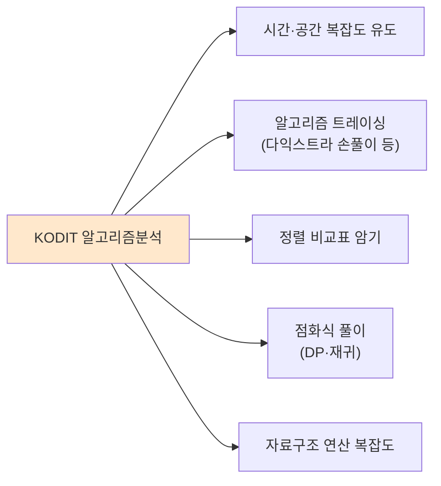
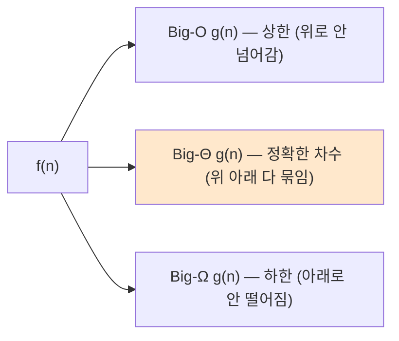
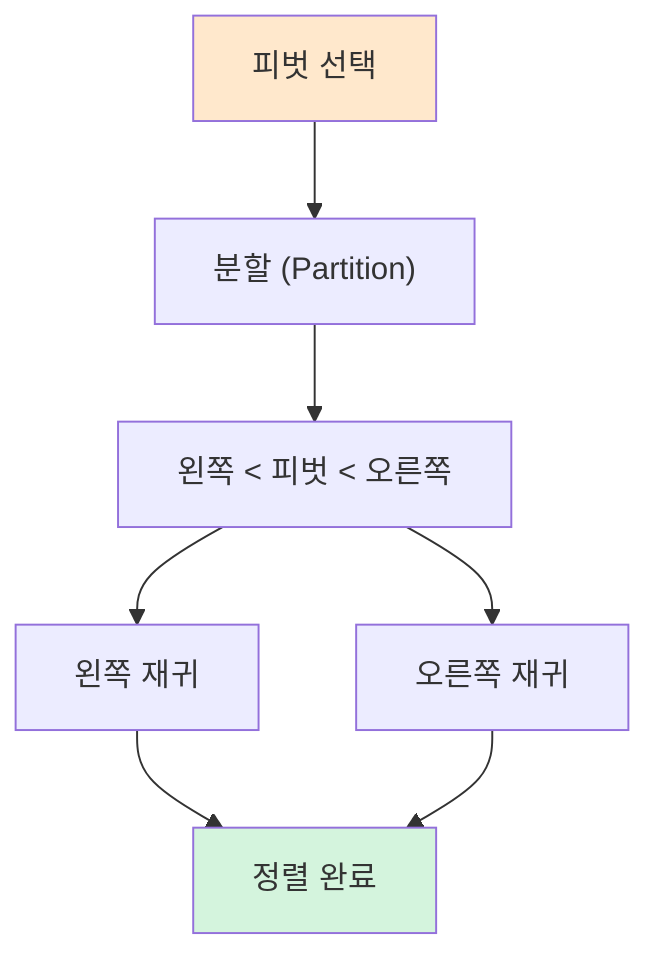
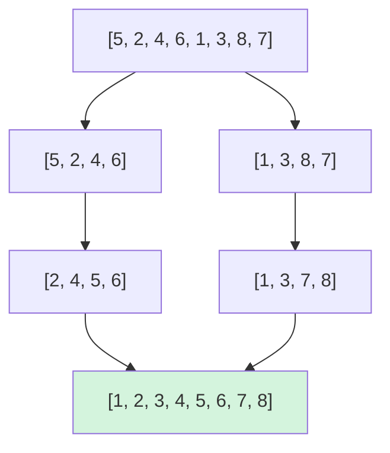
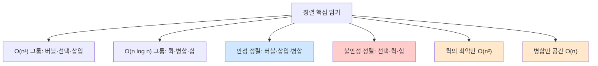

> **이 글의 목적**
>
> KODIT 알고리즘분석 과목의 *시험 직전* 정리. 알고리즘분석은 *코딩 테스트* 가 아니라 **이론 객관식** — 시간복잡도 유도, 정렬 트레이싱, 점화식 풀이가 핵심이다.
>
> 7급 데이터직 알고리즘 과목, KODIT 알고리즘분석 양쪽에 *그대로 매핑* 되는 첫 편. 정렬 6종 비교표는 거의 매년 직출 패턴.
>
> 정리는 *Cormen, Leiserson, Rivest & Stein*의 *Introduction to Algorithms*[^1] (이하 **CLRS**)와 *Sedgewick & Wayne*의 *Algorithms*[^2]을 토대로 했다.
>
> **읽고 나면 답할 수 있는 질문**:
>
> - **Big-O · Big-Θ · Big-Ω** 의 정확한 정의와 차이
> - 시간복잡도 *순서* 외우기 — O(1) < O(log n) < O(n) < O(n log n) < O(n²) < O(2ⁿ) < O(n!)
> - **마스터 정리** 의 세 경우와 *이진탐색·병합정렬* 적용
> - 자료구조 *기본 연산 시간복잡도* (배열·연결리스트·스택·큐·힙·해시·BST·AVL)
> - **정렬 6종** (버블·선택·삽입·퀵·병합·힙) 의 *최선/평균/최악·공간·안정성*
> - **안정성(stable)** 과 **제자리(in-place)** 의 정확한 정의
> - *왜 병합정렬은 안정한가, 퀵정렬은 왜 불안정한가*
> - **이진탐색** 의 시간복잡도와 마스터 정리 풀이

---

## 1. 알고리즘분석 과목의 정체 — 코딩이 아니라 *이론*

### 1.1 무엇을 묻는가



> ⚠️ 코드를 *짜는 게 아니라* 알고리즘의 *행동을 이해하고 비교* 하는 능력이 평가된다. 시간복잡도가 *왜* O(n log n)인지 설명할 수 있어야 한다.

### 1.2 출제 분포 (전형적)

| 영역 | 비중 | 형태 |
|---|---|---|
| **점근 표기법·마스터 정리** | 15% | 식 변형, 차수 비교 |
| **자료구조 시간복잡도** | 20% | 표 암기 직출 |
| **정렬 알고리즘** | 25% | 비교표·트레이싱 |
| **그래프 알고리즘** | 20% | BFS/DFS/다익스트라/MST |
| **DP·분할정복·그리디** | 20% | 점화식·트레이싱 |

이번 글은 *앞 60%* (점근·자료구조·정렬)를 다루고, 다음 편들에서 그래프·DP를 다룬다.

---

## 2. 점근 표기법 (Asymptotic Notation)

### 2.1 세 가지 핵심 기호

| 기호 | 이름 | 의미 |
|---|---|---|
| **O(g(n))** | Big-O | *상한*. f(n) ≤ c·g(n) for n ≥ n₀ |
| **Θ(g(n))** | Big-Theta | *정확한 차수*. f(n)이 *결국* c₁·g(n) ≤ f(n) ≤ c₂·g(n) |
| **Ω(g(n))** | Big-Omega | *하한*. f(n) ≥ c·g(n) for n ≥ n₀ |



> 💡 **시험에서 가장 자주 묻는 것**: *"f(n) = 3n² + 2n + 1의 시간복잡도는?"* → **Θ(n²)** 또는 **O(n²)**.

### 2.2 시간복잡도 순서 (외워야 함)

```text
O(1) < O(log n) < O(√n) < O(n) < O(n log n) < O(n²) < O(n³) < O(2ⁿ) < O(n!) < O(nⁿ)
```

n이 충분히 클 때의 *증가 속도*. 시험에선 *어느 게 더 큰가* 같은 질문이 자주 출제.

| 복잡도 | 예시 알고리즘 |
|---|---|
| O(1) | 배열 인덱스 접근, 해시 평균 |
| O(log n) | 이진탐색, 균형 BST 탐색 |
| O(n) | 선형 탐색, 단순 순회 |
| O(n log n) | **병합정렬·힙정렬**, 빠른 정렬 평균 |
| O(n²) | **버블·선택·삽입정렬**, 단순 행렬 곱 |
| O(n³) | 일반 행렬 곱 (3중 for) |
| O(2ⁿ) | 부분집합 모두 (멱집합), 단순 피보나치 |
| O(n!) | 순열 모두, 외판원 brute force |

### 2.3 자주 나오는 함정

- **상수와 저차항 무시**: 3n² + 100n + 50 = O(n²) (3, 100, 50 모두 무시)
- **로그의 밑수 무시**: log₂n과 log₁₀n은 *상수배 차이* — 모두 O(log n)
- **차수가 같으면 차수 표시**: O(n + n log n) = O(n log n)

---

## 3. 마스터 정리 (Master Theorem)

### 3.1 적용 형태

분할정복 점화식이 **T(n) = a·T(n/b) + f(n)** 형태일 때, *세 경우* 로 답을 바로 구할 수 있다.

| a | b | 의미 |
|---|---|---|
| **a** | | 부분 문제 *개수* |
| **b** | | 부분 문제 *크기 비율* |
| **f(n)** | | 분할/결합에 드는 비용 |

### 3.2 세 가지 경우

> *n^(log_b a)* 와 *f(n)* 을 비교한다.

| Case | 조건 | 결과 |
|---|---|---|
| **Case 1** | f(n) = O(n^(log_b a − ε)) | T(n) = **Θ(n^(log_b a))** |
| **Case 2** | f(n) = Θ(n^(log_b a)) | T(n) = **Θ(n^(log_b a) · log n)** |
| **Case 3** | f(n) = Ω(n^(log_b a + ε)) | T(n) = **Θ(f(n))** |

### 3.3 시험 직출 예제

#### ① 이진탐색

> T(n) = T(n/2) + Θ(1)

a=1, b=2, f(n)=Θ(1). n^(log₂1) = n⁰ = 1. f(n) = Θ(1) = Θ(n^(log_b a)) → **Case 2**.

→ T(n) = **Θ(log n)**

#### ② 병합정렬

> T(n) = 2·T(n/2) + Θ(n)

a=2, b=2, f(n)=Θ(n). n^(log₂2) = n¹ = n. f(n) = Θ(n) → **Case 2**.

→ T(n) = **Θ(n log n)**

#### ③ 슈트라센 행렬 곱셈

> T(n) = 7·T(n/2) + Θ(n²)

a=7, b=2. n^(log₂7) ≈ n^2.807. f(n) = Θ(n²) < n^2.807 → **Case 1**.

→ T(n) = **Θ(n^2.807)**

> 🎯 **시험 포인트**: *n^(log_b a)* 와 *f(n)* 의 차수만 비교하면 답이 나온다.

---

## 4. 자료구조 기본 연산 시간복잡도 — *직출 표*

### 4.1 선형 자료구조

| 자료구조 | 접근 | 검색 | 삽입 | 삭제 |
|---|---|---|---|---|
| **배열 (Array)** | O(1) | O(n) | O(n) | O(n) |
| **연결리스트 (Linked List)** | O(n) | O(n) | **O(1)** (위치 알면) | **O(1)** (위치 알면) |
| **스택 (Stack)** | — | — | O(1) push | O(1) pop |
| **큐 (Queue)** | — | — | O(1) enqueue | O(1) dequeue |

### 4.2 트리 자료구조

| 자료구조 | 검색 | 삽입 | 삭제 |
|---|---|---|---|
| **이진탐색트리 (BST)** | O(log n) 평균, **O(n) 최악** | O(log n) 평균 | O(log n) 평균 |
| **AVL 트리** | **O(log n)** 보장 | O(log n) | O(log n) |
| **레드-블랙 트리** | O(log n) 보장 | O(log n) | O(log n) |
| **힙 (Heap)** | **O(1)** (root만) | O(log n) | O(log n) |

> ⚠️ **BST의 최악 O(n)** 이유: 정렬된 데이터를 삽입하면 *연결리스트 모양* 으로 *편향(skew)* 됨. AVL/레드-블랙 같은 *균형 트리* 가 이를 해결.

### 4.3 해시테이블

| 연산 | 평균 | 최악 |
|---|---|---|
| 검색 | **O(1)** | O(n) |
| 삽입 | **O(1)** | O(n) |
| 삭제 | **O(1)** | O(n) |

> 💡 해시테이블의 *최악 O(n)* 은 *모든 키가 같은 버킷에 충돌* 할 때. 좋은 해시 함수 + 적정 적재율(load factor)이면 O(1)에 가깝게 동작.

### 4.4 그래프

| 표현 | 공간 | 인접 확인 | 모든 인접 순회 |
|---|---|---|---|
| **인접행렬** | O(V²) | **O(1)** | O(V) |
| **인접리스트** | **O(V+E)** | O(degree) | O(degree) |

| 표현 | 적합한 경우 |
|---|---|
| 인접행렬 | *밀집(dense) 그래프* |
| 인접리스트 | *희소(sparse) 그래프* (실무 표준) |

---

## 5. 정렬 알고리즘 6종 ★★★

### 5.1 버블 정렬 (Bubble Sort)

#### 알고리즘

> 인접한 두 원소를 비교해 *크기 순서가 어긋나면 교환*. n-1번 패스.

```python
for i in range(n-1):
    for j in range(n-1-i):
        if arr[j] > arr[j+1]:
            arr[j], arr[j+1] = arr[j+1], arr[j]
```

#### 분석

| 측면 | 결과 |
|---|---|
| 최선 | **O(n)** (이미 정렬된 경우, 조기 종료) |
| 평균 | O(n²) |
| 최악 | O(n²) |
| 공간 | **O(1)** (in-place) |
| **안정성** | **안정 (Stable)** ✓ |

### 5.2 선택 정렬 (Selection Sort)

#### 알고리즘

> *전체에서 최솟값을 찾아 맨 앞으로*. 그 다음 *나머지에서 최솟값을 찾아 두 번째로*. 반복.

#### 분석

| 측면 | 결과 |
|---|---|
| 최선 | **O(n²)** ← 항상 같음 (조기 종료 ✗) |
| 평균 | O(n²) |
| 최악 | O(n²) |
| 공간 | O(1) |
| **안정성** | **불안정 (Unstable)** ✗ |

> 💡 선택 정렬이 *불안정한 이유*: 최솟값을 찾아 *멀리 있는 원소와 swap* 하므로 *같은 값의 상대 순서* 가 깨질 수 있다.

### 5.3 삽입 정렬 (Insertion Sort)

#### 알고리즘

> 카드를 한 장씩 뽑아 *이미 정렬된 부분의 적절한 위치에 끼워 넣는* 방식.

#### 분석

| 측면 | 결과 |
|---|---|
| 최선 | **O(n)** (이미 정렬된 경우) |
| 평균 | O(n²) |
| 최악 | O(n²) (역순 정렬된 경우) |
| 공간 | O(1) |
| **안정성** | **안정** ✓ |

> 💡 *작은 데이터(n < 10~20)* 에선 **삽입정렬이 가장 빠르다**. 그래서 *Timsort, Introsort* 같은 실무 알고리즘이 *작은 부분에선 삽입정렬* 을 사용.

### 5.4 퀵 정렬 (Quick Sort)

#### 알고리즘

> *피벗(pivot)* 을 하나 골라, 그보다 *작은 건 왼쪽, 큰 건 오른쪽* 으로 분할 → 양쪽을 재귀 호출.



#### 분석

| 측면 | 결과 |
|---|---|
| 최선 | O(n log n) (피벗이 항상 중간값) |
| **평균** | **O(n log n)** |
| **최악** | **O(n²)** (이미 정렬되어 있고 *피벗이 항상 끝값* 일 때) |
| 공간 | **O(log n)** (재귀 스택) |
| **안정성** | **불안정** ✗ |

> 💡 **퀵의 함정**: 평균은 빠르지만 *최악이 O(n²)* 이라 시간 제한이 엄격한 환경에선 위험. *Introsort* 가 깊이 한도 넘으면 힙정렬로 전환해 보완.

> ⚠️ 퀵정렬이 *불안정한 이유*: 피벗 분할 과정에서 *같은 값의 상대 순서* 가 swap으로 깨진다.

### 5.5 병합 정렬 (Merge Sort)

#### 알고리즘

> *반으로 쪼개고, 각각을 재귀로 정렬한 뒤, 병합(merge)* 하는 분할정복.



#### 분석

| 측면 | 결과 |
|---|---|
| 최선 | O(n log n) |
| 평균 | O(n log n) |
| **최악** | **O(n log n)** ← 가장 안정적 |
| **공간** | **O(n)** ← 임시 배열 필요 |
| **안정성** | **안정** ✓ |

> 💡 **병합정렬의 강점**: *최악도 O(n log n)* 보장. 단, *공간 O(n)* 이 필요해 메모리 제약 환경엔 불리.

> 💡 *왜 안정한가*: 병합 과정에서 *같은 값일 때 왼쪽 배열의 원소를 먼저* 넣도록 구현하면 *원래 순서가 보존* 된다.

### 5.6 힙 정렬 (Heap Sort)

#### 알고리즘

> *최대 힙(max-heap)* 으로 만든 뒤, *루트(최댓값)* 를 빼서 맨 뒤로 옮기는 과정 반복.


#### 분석

| 측면 | 결과 |
|---|---|
| 최선 | O(n log n) |
| 평균 | O(n log n) |
| 최악 | **O(n log n)** ← 보장 |
| **공간** | **O(1)** ← in-place |
| **안정성** | **불안정** ✗ |

> 💡 **힙정렬의 매력**: *공간 O(1) + 최악 O(n log n)* 동시 만족. 단점은 *캐시 친화성이 낮음* (실제 속도는 퀵보다 느린 경우 多).

---

## 6. 정렬 6종 비교표 — *시험 직출* ★★★

### 6.1 한 표로 정리

| 알고리즘 | 최선 | 평균 | 최악 | 공간 | 안정성 |
|---|---|---|---|---|---|
| **버블** | O(n) | O(n²) | O(n²) | O(1) | **안정** |
| **선택** | O(n²) | O(n²) | O(n²) | O(1) | 불안정 |
| **삽입** | O(n) | O(n²) | O(n²) | O(1) | **안정** |
| **퀵** | O(n log n) | O(n log n) | **O(n²)** | O(log n) | 불안정 |
| **병합** | O(n log n) | O(n log n) | O(n log n) | **O(n)** | **안정** |
| **힙** | O(n log n) | O(n log n) | O(n log n) | O(1) | 불안정 |

### 6.2 핵심 암기 포인트



### 6.3 한 줄 암기

- **O(n²) 정렬은 모두 안정인가?** ✗ — *선택은 불안정*
- **O(n log n) 정렬은 모두 안정인가?** ✗ — *퀵·힙은 불안정, 병합만 안정*
- **공간 O(n)이 필요한 정렬은?** **병합** 만
- **이미 정렬된 데이터에 가장 빠른 정렬은?** *버블·삽입* (둘 다 O(n))
- **퀵의 최악은 어떤 경우?** *피벗이 항상 끝값* 이고 *데이터가 정렬되어 있을 때*

---

## 7. 안정성과 In-place — 정확한 정의

### 7.1 안정 정렬 (Stable Sort)

> *"같은 키 값을 가진 원소들의 *원래 상대 순서* 가 정렬 후에도 유지되는가?"*

#### 예제

```text
입력: (2, A), (1, B), (2, C)   ← 같은 키 2인 A, C가 있음

안정 정렬 결과:   (1, B), (2, A), (2, C)   ← A가 C보다 먼저 (원래 순서 유지)
불안정 정렬 결과: (1, B), (2, C), (2, A)   ← C가 A보다 먼저 (순서 뒤집힘)
```

> 💡 *데이터베이스 다중 키 정렬* 에서 중요. *먼저 이름순으로 정렬, 그 다음 부서순으로 정렬* — 이때 *안정 정렬* 이어야 첫 정렬이 보존된다.

### 7.2 In-place 정렬

> *"입력 배열 외에 추가 메모리가 *상수 크기 O(1)* 만 필요한가?"*

| 구분 | 정렬 |
|---|---|
| **In-place** (O(1)) | 버블·선택·삽입·힙 |
| **Not in-place** (O(log n) 이상) | 퀵 (재귀 스택), **병합 (O(n) 보조 배열)** |

> ⚠️ *퀵정렬의 공간 O(log n)* 은 *재귀 호출 스택* 때문. 엄격히 in-place는 아니지만 *상수 ε 추가* 정도라 보통 in-place로 분류.

---

## 8. 이진탐색 (Binary Search)

정렬된 배열에서 값을 찾을 때 *중간을 보고 절반을 버리는* 방법.

### 8.1 알고리즘

```python
def binary_search(arr, target):
    low, high = 0, len(arr) - 1
    while low <= high:
        mid = (low + high) // 2
        if arr[mid] == target:
            return mid
        elif arr[mid] < target:
            low = mid + 1
        else:
            high = mid - 1
    return -1
```

### 8.2 분석

| 측면 | 결과 |
|---|---|
| 시간복잡도 | **O(log n)** |
| 공간복잡도 | O(1) (반복) / O(log n) (재귀) |
| **전제 조건** | **정렬된 배열** (필수) |

### 8.3 마스터 정리로 풀기

> T(n) = T(n/2) + Θ(1) → **Θ(log n)**

a=1, b=2, f(n)=Θ(1). n^(log₂1) = 1 = f(n) → Case 2 → log 곱.

---

## 9. 헷갈리는 것 / 자주 묻는 질문

### Q1. *Big-O와 Big-Θ의 차이가 자꾸 헷갈린다*

- **Big-O**: *최대 이만큼* (상한)
- **Big-Θ**: *정확히 이만큼* (양쪽 묶임)
- **Big-Ω**: *최소 이만큼* (하한)

n²은 *O(n²)도 맞고, O(n³)도 맞다*. *Θ(n²)만 정확*. 시험에선 보통 *가장 타이트한 Θ* 를 묻는다.

### Q2. *상수와 저차항을 무시한다는 게 무슨 뜻?*

f(n) = 5n² + 100n + 50일 때, n이 커지면 *5n²이 지배적*. 100n과 50은 무시. 그리고 *5도 상수배라 무시* → **O(n²)**.

### Q3. *퀵정렬은 왜 평균은 빠른데 최악이 느린가?*

*피벗이 항상 *데이터의 중간값* 이면 균형 분할* 이 되어 O(n log n). 하지만 *피벗이 항상 *최댓값/최솟값** 으로 잡히면 *한 쪽이 비고 다른 쪽에 n-1개* — *재귀 깊이 n* 이 되어 O(n²).

> 💡 *해결*: 피벗을 *무작위* 또는 *세 값의 중앙값(median-of-three)* 으로 선택하면 최악을 거의 피할 수 있다.

### Q4. *왜 병합정렬은 공간이 O(n)인가?*

*병합 단계에서 두 정렬된 배열을 합칠 때 임시 배열* 이 필요하다. 입력 크기와 같은 크기의 보조 공간이 필요해 O(n).

> 단, *연결리스트로 구현* 하면 in-place 병합정렬도 가능 (포인터만 바꾸면 됨).

### Q5. *해시테이블의 시간복잡도가 평균 O(1)인 이유는?*

*좋은 해시 함수* 가 키들을 *균등하게 분산* 시키고, *적재율(load factor)* 이 0.7 이하로 유지되면 *충돌 거의 없음* → 평균 상수 시간.

### Q6. *AVL 트리와 레드-블랙 트리 중 뭘 써야?*

| 측면 | AVL | 레드-블랙 |
|---|---|---|
| **검색** | 더 빠름 (더 균형) | 약간 느림 |
| **삽입/삭제** | 더 느림 (재균형 多) | **더 빠름** |
| **실무** | 검색 위주 (DB 인덱스) | **삽입/삭제 多** (C++ map, Java TreeMap) |

### Q7. *Stable Sort가 실무에서 왜 중요한가?*

*다중 키 정렬* 시 결정적. 예: *학생을 학번순 정렬한 뒤 학년순으로 정렬* — 안정 정렬이면 *같은 학년 내에서 학번 순서가 유지*.

---

## 10. 시험 직전 1분 요약

> A4 한 장 압축본.

### 핵심 7개

1. **점근 표기**: **O(상한) / Θ(정확) / Ω(하한)**. 보통 Θ가 가장 타이트
2. **시간복잡도 순서**: O(1) < O(log n) < O(n) < O(n log n) < O(n²) < O(2ⁿ) < O(n!)
3. **마스터 정리**: T(n) = a·T(n/b) + f(n). *n^(log_b a)* vs *f(n)* 비교
4. **자료구조 핵심**:
   - 배열·힙: 접근/루트 O(1)
   - BST: 평균 O(log n), 최악 O(n) — AVL이 보장
   - 해시: 평균 O(1), 최악 O(n)
5. **정렬 6종 비교표** ↓
6. **안정 정렬**: 버블·삽입·병합. **불안정**: 선택·퀵·힙
7. **공간**: 모두 O(1)인데 **병합만 O(n)**, *퀵은 O(log n)*

### 정렬 비교표 (외울 것)

| 알고리즘 | 최선 | 평균 | 최악 | 공간 | 안정성 |
|---|---|---|---|---|---|
| 버블 | O(n) | O(n²) | O(n²) | O(1) | 안정 |
| 선택 | O(n²) | O(n²) | O(n²) | O(1) | 불안정 |
| 삽입 | O(n) | O(n²) | O(n²) | O(1) | 안정 |
| 퀵 | O(n log n) | O(n log n) | **O(n²)** | O(log n) | 불안정 |
| 병합 | O(n log n) | O(n log n) | O(n log n) | **O(n)** | 안정 |
| 힙 | O(n log n) | O(n log n) | O(n log n) | O(1) | 불안정 |

### 자주 헷갈리는 한 마디

- *"퀵의 평균과 최악은 같다"* → **거짓 (평균 n log n, 최악 n²)**
- *"병합정렬은 in-place"* → **거짓 (O(n) 보조 배열)**
- *"선택정렬은 안정"* → **거짓 (불안정)**
- *"O(n) 정렬이 가능"* → **참** (계수정렬·기수정렬·버킷정렬 — 비교 기반 ✗)
- *"BST의 최악은 O(log n)"* → **거짓 (O(n) — 편향 시)**
- *"이진탐색은 정렬 안 된 배열도 OK"* → **거짓 (정렬 필수)**
- *"버블정렬의 최선은 O(n²)"* → **거짓 (O(n) — 조기 종료)**

### 빈출 패턴

| 빈출 유형 | 풀이 키 |
|---|---|
| 시간복잡도 차수 비교 | 가장 큰 차수 항만 보기 |
| 마스터 정리 적용 | *n^(log_b a)* 와 *f(n)* 비교 |
| 정렬 알고리즘 식별 | *최선/공간/안정성* 으로 6종 구분 |
| 자료구조 평균 vs 최악 | 해시·BST는 평균≠최악 |
| 안정성 사례 | 같은 키 입력의 *원래 순서 유지* 여부 |

---

## 11. 다음 학습

다음 편에서 *그래프 알고리즘* 으로 넘어간다.

- 📌 **[알고리즘 ②] 그래프 알고리즘** — BFS·DFS·다익스트라·벨만-포드·MST(프림/크루스칼)·위상정렬
- 📌 **[알고리즘 ③] 동적 계획법·분할정복·그리디** — DP 점화식, 0/1 배낭, LCS, 그리디 조건

추가 학습 자료:

- **CLRS** *Introduction to Algorithms* (4th ed., 2022) — 알고리즘의 바이블
- **Sedgewick & Wayne** *Algorithms* (4th ed.) — 코드 + 시각화
- **Skiena** *The Algorithm Design Manual* — 실무 관점

---

## 12. 참고 문헌 (References)

[^1]: Cormen, T. H., Leiserson, C. E., Rivest, R. L., & Stein, C. (2022). *Introduction to Algorithms* (4th ed.). MIT Press.

[^2]: Sedgewick, R., & Wayne, K. (2011). *Algorithms* (4th ed.). Addison-Wesley.

[^3]: Knuth, D. E. (1998). *The Art of Computer Programming*, Vol. 3: *Sorting and Searching* (2nd ed.). Addison-Wesley.

[^4]: Hoare, C. A. R. (1961). Algorithm 64: Quicksort. *Communications of the ACM*, 4(7), 321. (퀵정렬 원전)

[^5]: Williams, J. W. J. (1964). Algorithm 232: Heapsort. *Communications of the ACM*, 7(6), 347–348. (힙정렬 원전)

### 보조 자료

- 7급 데이터직 알고리즘 과목 + KODIT 알고리즘분석 출제 영역 (2023~2025)
- KODIT prepare_till_NCS_test.plan.md §6 (알고리즘분석)

---

## 부록 A: 이미지 생성 프롬프트

> 📁 이미지 프롬프트는 [`/prompts/2026-05-01-algorithm-01-bigo-sorting.md`](/prompts/2026-05-01-algorithm-01-bigo-sorting.md) 에 별도 정리되어 있다 (한글 라벨·파일명·저장 경로 명시).

> ✍️ **다음 학습**: [알고리즘 ②] 그래프 알고리즘 — BFS·DFS·다익스트라·MST·위상정렬. 작성 예정.
