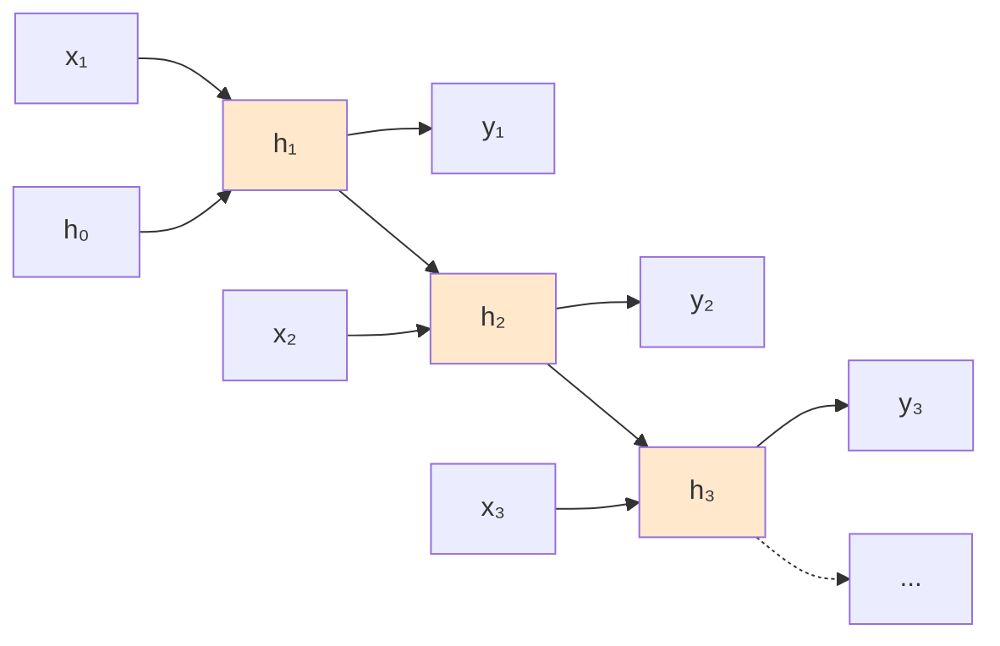
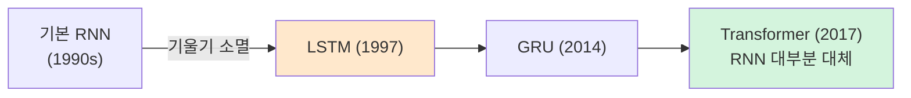
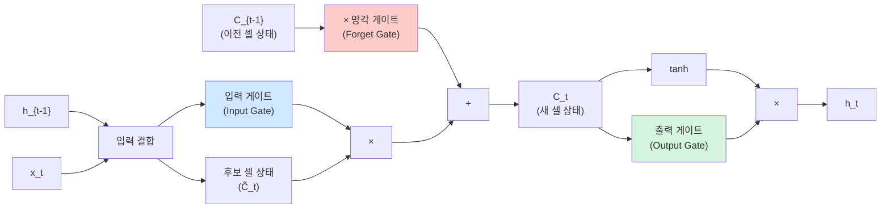
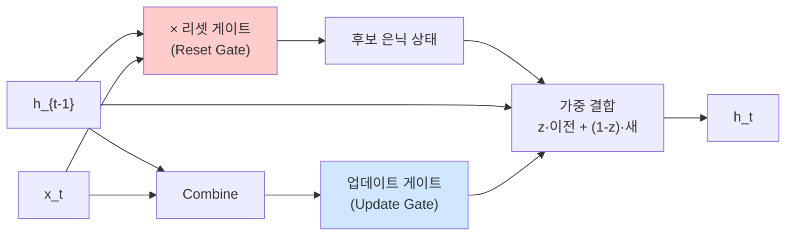
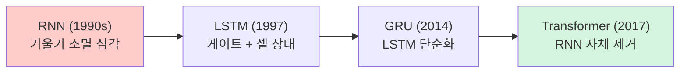
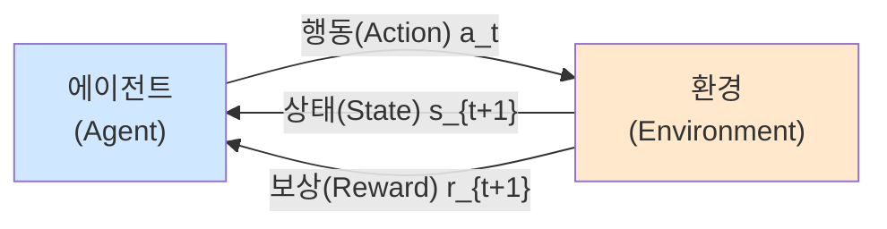
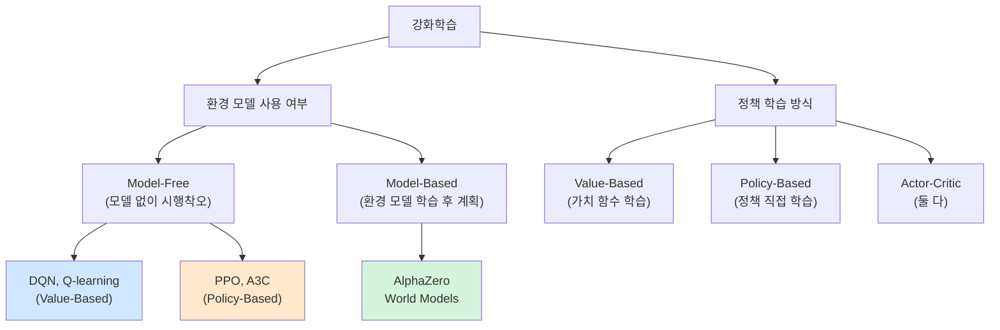
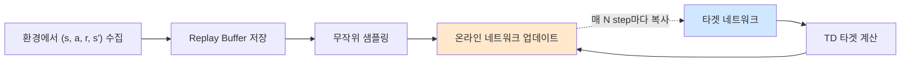
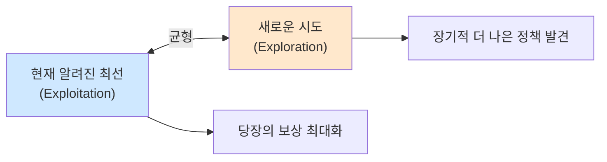

> **이 글의 목적**
>
> [AI 심화 ③](/ai/ai-advanced-cnn/)이 *공간 데이터(이미지)* 였다면, 이번 편은 *시간 데이터(텍스트·음성·시계열)* 와 *행동 학습(강화학습)* 을 다룬다.
>
> 7급 데이터직 인공지능 75문항 분석 결과, **RNN 3문항 + 강화학습/유전 4문항 = 7문항/9%**. 매년 *시간성 데이터의 처리·LSTM/GRU 구조·RNN의 기울기 소멸·강화학습 정의·강화학습 모델 식별* 패턴이 반복된다.
>
> 정리에는 *Russell & Norvig*의 *AIMA* Ch.22[^1]와 *Sutton & Barto*의 *Reinforcement Learning: An Introduction*[^2]을 토대로, **Hochreiter 1997, Cho 2014, Mnih 2015, Silver 2016** 등의 원전 논문을 직접 확인했다.
>
> **읽고 나면 답할 수 있는 질문**:
>
> - **RNN이 시계열 데이터에 적합한 이유** — 은닉 상태와 시간축 가중치 공유
> - **RNN의 기울기 소멸은 왜 *심각한가*** (시험 단골 함정)
> - **LSTM의 3게이트** (Forget·Input·Output)와 **GRU의 2게이트** (Reset·Update) 차이
> - **순환 드롭아웃 (Recurrent Dropout)** 의 역할
> - **강화학습의 5요소** — 에이전트·환경·상태·행동·보상
> - **Model-Free vs Model-Based**, **Value-Based vs Policy-Based** 분류
> - **DQN의 두 가지 트릭** — Target Network + Experience Replay
> - **알파고 vs 알파고 제로** — 사람 기보 vs 독학(self-play)
> - **이용(Exploitation) vs 탐험(Exploration)** 의 균형이 왜 핵심인가
> - 강화학습 모델 *식별 함정* — Gym/AlphaGo/AlphaStar는 ✓, **Deep Dream은 ✗**

---

## 1. RNN — 시계열 데이터를 위한 신경망

### 1.1 등장 배경

[AI 심화 ②](/ai/ai-advanced-neural-networks/)의 일반 MLP나 [AI 심화 ③](/ai/ai-advanced-cnn/)의 CNN은 입력 길이가 *고정* 이다. 그런데 텍스트·음성·시계열은 **길이가 가변** 이고, 각 시점이 *이전 시점에 의존* 한다.

> *"오늘 비가 와서 우산을 ___"* — 빈칸 단어를 예측하려면 *앞 문맥* 을 봐야 한다.

### 1.2 RNN 구조 — 은닉 상태가 시간을 기억



#### 핵심 식

> **h_t = tanh(W·x_t + U·h_{t-1} + b)**
> **y_t = V·h_t + c**

| 변수 | 의미 |
|---|---|
| **x_t** | 시점 t의 입력 |
| **h_t** | 시점 t의 *은닉 상태* (시간 정보 저장) |
| **W, U, V** | 가중치 (시간축에서 *공유*) |
| **tanh** | 활성화 함수 (RNN 표준) |

> 🎯 **시험 (2024-24 ②)**: *"RNN은 일반적으로 하이퍼볼릭 탄젠트(tanh) 함수를 활성화 함수로 사용한다"* → **참**.

### 1.3 시간축 가중치 공유

CNN의 *공간 가중치 공유* (필터)와 같은 아이디어를 *시간축* 에 적용. 시점 t1, t2, t3이 모두 *같은 W·U·V* 를 사용한다. → 길이가 가변이어도 학습 가능.

### 1.4 시험 출제 패턴 (2025-5)

> *"시간성을 갖는 데이터에 유용하고 문맥 의존성을 효율적으로 처리할 수 있는 신경망은?"* → **RNN** (정답 ④).

함정 보기들:
- CNN: 공간 데이터
- KNN: 거리 기반 분류, 신경망 아님
- MLP: 시간 정보 처리 못함

### 1.5 *RNN에서 왜 tanh를 쓰는가* — 깊이

[AI 심화 ②](/ai/ai-advanced-neural-networks/)에서 활성화 함수 4종을 비교했지만, **RNN의 표준이 *tanh* 인 이유** 는 별도로 짚어둘 가치가 있다. (2024-24 ②번 직출 포인트)

#### 이유 ① — *0 중심 출력* (시그모이드의 결정적 단점 보완)

| 측면 | 시그모이드 (0, 1) | **Tanh (−1, 1)** |
|---|---|---|
| 평균 출력 | 항상 양수 (≈ 0.5) | **0 중심** |
| 다음 층 입력 분포 | 평균 0이 아님 → *바이어스 누적* | 평균 ≈ 0 → 학습 안정 |
| 양/음 정보 표현 | 음의 활성화 표현 ✗ | **양·음 모두 자연스럽게** |

> 💡 RNN의 *은닉 상태 h_t* 는 시간축으로 *반복 입력* 된다. 시그모이드를 쓰면 *항상 양수* 값이 *누적* 되어 가중합 분포가 한쪽으로 쏠림. tanh는 *양·음 균형* 으로 누적이 상쇄.

#### 이유 ② — *큰 그래디언트* (시그모이드보다 4배)

```text
시그모이드 미분 최댓값 = 0.25  (z=0에서)
Tanh 미분 최댓값       = 1     (z=0에서)
→ Tanh가 4배 큰 그래디언트
```

[활성화 함수 미분 완전 정리](/ai/ai-advanced-activation-derivatives/) §3에서 본 결과. RNN의 시간축 BPTT에서 *같은 가중치가 여러 번 곱해지는* 구조라, *조금이라도 큰 미분* 이 결정적.

#### 이유 ③ — *그래도 한계가 있어 LSTM 등장*

tanh가 시그모이드보다 4배 큰 미분을 가져도, **|z|가 크면 여전히 미분이 0으로 포화**.

```text
tanh(2) ≈ 0.964  →  tanh'(2) = 1 - 0.964² ≈ 0.071
tanh(3) ≈ 0.995  →  tanh'(3) = 1 - 0.995² ≈ 0.010
tanh(5) ≈ 1.000  →  tanh'(5) ≈ 0
```

→ 시퀀스가 길어지면 *결국 기울기 소멸* 발생. **LSTM·GRU** 가 *셀 상태* 와 *게이트 구조* 로 이 한계를 푼다 (§3, §4).

#### 한 줄 정리

> **RNN이 tanh를 쓰는 이유**: ① 0 중심 출력 (학습 안정) + ② 시그모이드보다 4배 큰 그래디언트. *그래도 부족해서* LSTM이 등장.

---

## 2. RNN의 한계 — 기울기 소멸 / 폭발

### 2.1 시간축 역전파 (BPTT, Backpropagation Through Time)

RNN을 *시간축으로 펼친* 그래프에 일반 역전파 적용. 그런데 *같은 가중치 U가 시간 길이만큼 곱해지므로*:

```text
∂L/∂U ∝ U^T · U^T · U^T · ... (T번)
```

- **|U| < 1** → 0에 수렴 (**기울기 소멸**)
- **|U| > 1** → 발산 (**기울기 폭발**)

### 2.2 시험 함정 (2024-24 ①) ★★★

> *"순환 신경망은 기울기 소멸 문제가 심각하게 발생하지 않는 장점이 있다"* → **거짓**.

**RNN은 오히려 기울기 소멸이 매우 심각**. 그래서 LSTM·GRU가 등장.

> ⚠️ 시험에서 자주 *반대* 로 적힌 진술이 나온다. RNN의 기울기 소멸은 **심각하다**.

### 2.3 해결책 진화



---

## 3. LSTM (Long Short-Term Memory)


> Hochreiter, S., & Schmidhuber, J. (1997). *Long Short-Term Memory*. Neural Computation, 9(8), 1735–1780.[^3]

### 3.1 핵심 아이디어 — 셀 상태 + 3개 게이트

LSTM은 *셀 상태(cell state) C_t* 를 별도로 두고, 3개 게이트로 정보를 *제어* 한다.



### 3.2 3개 게이트의 역할

| 게이트 | 식 | 역할 |
|---|---|---|
| **망각 게이트(Forget)** | f_t = σ(W_f·[h_{t-1}, x_t] + b_f) | *과거 정보 중 무엇을 버릴지* (0~1) |
| **입력 게이트(Input)** | i_t = σ(W_i·[h_{t-1}, x_t] + b_i) | *새 정보를 얼마나 반영할지* |
| **출력 게이트(Output)** | o_t = σ(W_o·[h_{t-1}, x_t] + b_o) | *셀 상태 중 무엇을 다음으로 보낼지* |

#### 셀 상태 갱신

> **C_t = f_t × C_{t-1} + i_t × C̃_t**

망각으로 과거를 *지우고*, 입력으로 새 정보를 *더한다*.

### 3.3 왜 기울기 소멸을 푸는가

셀 상태 *C_t* 가 시간축으로 *직접* 흐르고, 활성화 함수의 곱셈을 거치지 않는다 → 그래디언트가 *우회로* 로 전달.

> 💡 ResNet의 *잔차 연결* 이 *공간축* 에서 그래디언트 우회로를 만든 것과 같은 원리. LSTM은 *시간축* 에서.

---

## 4. GRU (Gated Recurrent Unit)

> Cho, K., et al. (2014). *Learning Phrase Representations using RNN Encoder-Decoder for Statistical Machine Translation*.[^4]

### 4.1 LSTM의 단순화

LSTM은 강력하지만 게이트 3개 + 셀 상태 → 파라미터·계산량이 많다. **GRU는 게이트 2개 + 셀 상태 없음** 으로 단순화.



### 4.2 2개 게이트

| 게이트 | 역할 |
|---|---|
| **리셋 게이트(Reset)** | *과거 정보를 얼마나 잊을지* |
| **업데이트 게이트(Update)** | *새 정보와 과거 정보를 어떤 비율로 섞을지* |

### 4.3 LSTM vs GRU

| 측면 | LSTM | GRU |
|---|---|---|
| 게이트 수 | 3 | 2 |
| 셀 상태 | 있음 (C_t) | 없음 (h_t에 통합) |
| 파라미터 | 많음 | 적음 (~25%↓) |
| 성능 | 비슷 | 비슷 — 작은 데이터에 약간 유리 |

> 🎯 **시험 (2023-18 ④)**: *"GRU는 LSTM과 유사한 원리로 동작하지만, 게이트 수를 줄여 더 간결한 구조를 갖는다"* → **참**.

---

## 5. 순환 드롭아웃 (Recurrent Dropout)

일반 신경망의 드롭아웃을 *RNN의 시간축* 에 적용. 단순히 매 시점마다 무작위로 뉴런을 끄면 *시간 정보가 손상* 되므로, **같은 마스크를 시점 전체에 일관 적용** 하는 게 표준 (Gal & Ghahramani 2016).

> 🎯 **시험 (2023-18 ③)**: *"RNN에서 순환 드롭아웃은 과적합을 방지하기 위해 사용된다"* → **참**.

### LSTM 출력의 함정 (2023-18 ②)

> *"LSTM의 출력은 이전 시점의 입력값과 은닉층의 값뿐만 아니라 이후 시점의 입력값과 은닉층의 값에도 영향을 받는다"* → **거짓**.

LSTM은 *과거(이전 시점)* 만 본다. *미래* 까지 보려면 **양방향 LSTM(Bi-LSTM)** 이 필요. 시험 함정.

---

## 6. RNN vs CNN vs Transformer

### 6.1 한 표 비교

| 측면 | CNN | RNN | Transformer |
|---|---|---|---|
| 입력 | 2D/3D 격자 | 시퀀스 | 시퀀스 |
| 가중치 공유 | 공간축(필터) | 시간축 | — (어텐션) |
| **장거리 의존성** | 풀링으로 한정 | 약함 (소멸) | **강함** (직접 연결) |
| **병렬화** | 쉬움 | 어려움 (순차) | **쉬움** |
| 학습 속도 | 빠름 | 느림 | 빠름 (GPU 활용) |
| 대표 응용 | 이미지·비디오 | 음성·시계열 | NLP·CV·다 |

### 6.2 Transformer의 우위

> Vaswani et al. (2017). *Attention Is All You Need*. (이미 [AI개론 ④](/ai/ai-introduction-modern-ai/)에서 깊이 다룸)

병렬화 가능성과 어텐션이 RNN을 대체. 2017년 이후 NLP는 거의 Transformer 기반.

> 💡 **단** RNN/LSTM이 사라진 건 아님. *작은 시계열 모델*, *임베디드 환경*, *음성 ASR* 일부에선 여전히 사용.

### 6.3 2024-24번 — *CNN과 RNN 비교* 4보기 통합 분석 ★★★

> **2024년 7급 데이터직 인공지능 24번**
>
> *"합성곱 신경망과 순환 신경망(RNN)에 대한 설명으로 옳지 않은 것은?"*

| 보기 | 진술 | 판정 + 이유 |
|---|---|---|
| ① | "순환 신경망은 기울기 소멸 문제가 *심각하게 발생하지 않는 장점* 이 있다" | ❌ **거짓** ← 정답. RNN은 *기울기 소멸이 가장 심각한* 모델 (§2) |
| ② | "RNN은 일반적으로 하이퍼볼릭 탄젠트(tanh) 함수를 활성화 함수로 사용한다" | ✅ 참 (§1.5) |
| ③ | "합성곱 신경망은 특징 추출을 담당하는 합성곱층과 분류를 담당하는 전결합층을 포함하는 *다층 퍼셉트론 모델의 한 종류* 이다" | ✅ 참 ([AI 심화 ③](/ai/ai-advanced-cnn/) §1.2) |
| ④ | "합성곱 신경망은 필터로 특징을 추출하고 풀링을 이용하여 입력의 변화에 *강건한(robust)* 방식으로 사물을 분류한다" | ✅ 참 ([AI 심화 ③](/ai/ai-advanced-cnn/) §3) |

→ **정답 ①**

#### ①이 *왜 결정적으로 거짓* 인가

```text
RNN 구조:  x₁ → h₁ → h₂ → h₃ → ... → h₁₀
                                       ↓
                                 출력층 오차가
                                 h₁까지 전달돼야 하는데...
```

역전파 시 *같은 가중치 행렬이 시간 길이만큼 반복 곱셈*. 작은 값(예: 0.5)을 *10번 곱하면 0.001 수준* 으로 작아져 그래디언트가 *거의 0*.

→ **장기 의존성(long-term dependency) 학습 불가**. *옛날 입력의 영향이 사라짐*.

#### 이를 푼 게 LSTM/GRU/Transformer



현대 NLP의 주류가 RNN → Transformer로 넘어간 *결정적 이유 중 하나*.

#### 보기 ②와의 연결 — *왜 RNN은 tanh를 쓰나*

§1.5에서 깊이 다뤘듯, RNN이 *시그모이드 대신 tanh* 를 쓰는 이유:

1. **0 중심 출력** — 양/음 정보 모두 표현, 누적 바이어스 ✗
2. **시그모이드보다 4배 큰 그래디언트** (미분 최댓값 1 vs 0.25)

그래도 *|z|가 크면 포화* 되어 기울기 소멸 발생 → LSTM 등장.

#### 보기 ③·④와의 연결 — CNN의 본질

| 측면 | CNN의 정체 |
|---|---|
| ③ "다층 퍼셉트론의 한 종류" | ✅ 참. 합성곱은 *희소 연결 + 가중치 공유* 한 MLP의 특수 형태 |
| ④ "풀링으로 변화에 강건" | ✅ 참. 풀링은 *지역 변동* 을 흡수해 *평행 이동 불변성* 부여 |

#### 시험 직전 한 마디

> **2024-24번** 의 정답은 **①**. 함정의 본질은 *"RNN의 기울기 소멸이 심각하지 않다"* 는 *완전한 거짓*. 이 진술이 *반대로 적힌* 형태로 자주 출제된다.

---

## 7. 강화학습 (Reinforcement Learning) — 보상으로 배우는 학습


### 7.1 정의 (2025-1) ★★★

> *"어떤 환경 안에서 정의된 에이전트가 현재의 상태를 인식하여, 선택 가능한 행동들 중 보상을 최대화하는 행동 혹은 행동 순서를 선택하는 방법"* → **강화학습** (정답 ①).

### 7.2 5요소



| 요소 | 의미 |
|---|---|
| **Agent (에이전트)** | 학습 주체 (게임 AI, 로봇) |
| **Environment (환경)** | 에이전트가 상호작용하는 세계 |
| **State (상태)** | 현재 상황 (체스판, 화면) |
| **Action (행동)** | 에이전트의 선택 (말 이동, 키 입력) |
| **Reward (보상)** | 행동의 결과로 받는 신호 (+1, -1, 0) |

### 7.3 학습 목표

> **누적 보상의 기댓값 (return) 을 최대화하는 정책 π* 를 찾는다.**

```text
G_t = r_{t+1} + γ·r_{t+2} + γ²·r_{t+3} + ...
```

여기서 **γ (감마)** 는 *할인율(discount factor)* — 먼 미래의 보상은 덜 중요하게.

---

## 8. 강화학습 분류


### 8.1 두 축 분류



### 8.2 Model-Free vs Model-Based

| 측면 | Model-Free | Model-Based |
|---|---|---|
| 환경 모델 | 없음 | 있음 (또는 학습) |
| 학습 | 시행착오로 직접 | *시뮬레이션 + 계획* |
| 데이터 효율 | 낮음 | 높음 |
| 대표 | DQN, A3C, PPO | AlphaZero, World Models |

### 8.3 Value-Based vs Policy-Based

| 측면 | Value-Based | Policy-Based |
|---|---|---|
| 학습 대상 | 가치 함수 Q(s, a) | 정책 π(a|s) |
| 행동 선택 | argmax_a Q(s, a) | π에서 직접 샘플링 |
| 안정성 | 일반적으로 안정 | 분산 큼, 안정화 기법 필요 |
| 연속 행동 | 어려움 | 자연스러움 |
| 대표 | **DQN**, Q-learning | REINFORCE, **PPO**, **A3C** |

### 8.4 On-Policy vs Off-Policy

- **On-Policy**: 현재 정책으로 모은 데이터로만 학습 (PPO, A3C)
- **Off-Policy**: 과거 정책의 데이터도 재사용 가능 (DQN, Q-learning) — *Experience Replay* 가능

---

## 9. DQN (Deep Q-Network) — 강화학습 + 딥러닝

> Mnih, V., et al. (2015). *Human-level control through deep reinforcement learning*. Nature, 518(7540), 529–533.[^5]

### 9.1 핵심 아이디어

> *"Q-함수를 신경망으로 근사하라."*

전통 Q-learning은 상태가 작을 때만 가능. 하지만 *Atari 게임 화면(픽셀)* 같은 거대한 상태 공간에선 불가능 → 신경망으로 *Q(s, a)* 를 근사.

### 9.2 두 가지 트릭 — *시험 단골*

#### Trick 1: Experience Replay (경험 재현)

매 행동의 *(s, a, r, s')* 튜플을 **버퍼** 에 저장 → 학습 시 *무작위 샘플링*. 데이터 재사용 + 시간 상관성 제거.

#### Trick 2: Target Network (타겟 네트워크 분리)

Q-네트워크를 둘로 분리:
- **온라인 네트워크**: 매 step 갱신
- **타겟 네트워크**: 일정 주기로 온라인을 *복사*

타겟이 *고정* 되면 학습이 안정.



> 🎯 **시험 (강의계획서 최신)**: *"DQN의 네트워크 분리"* — 타겟 네트워크와 온라인 네트워크 분리로 학습 안정화.

### 9.3 DQN의 성과

Atari 49개 게임에서 *인간 수준 또는 그 이상* 의 점수 (Mnih 2015 Nature). 강화학습 + 딥러닝 융합의 결정적 성공.

---

## 10. AlphaGo / 알파고 제로 — 강화학습의 결정타

### 10.1 알파고 (2016)

> Silver, D., et al. (2016). *Mastering the game of Go with deep neural networks and tree search*. Nature, 529(7587), 484–489.[^6]

- **사람 기보 + 강화학습** 으로 학습
- *몬테카를로 트리 탐색(MCTS)* + *정책망* + *가치망* 결합
- 이세돌 9단을 4:1로 격파

### 10.2 알파고 제로 (2017)

> Silver, D., et al. (2017). *Mastering the game of Go without human knowledge*. Nature, 550(7676), 354–359.

- **사람 기보 없이 self-play** 만으로 학습
- 알파고 마스터를 100전 89승 11패로 격파
- *순수 강화학습* 의 가능성 증명

### 10.3 알파제로 (2018) → MuZero (2019)

- **AlphaZero**: 바둑·체스·쇼기 모두 지배 (도메인 지식 없이)
- **MuZero**: *환경 모델까지 학습* (Atari 포함 다양한 도메인)

---

## 11. 이용 vs 탐험 (Exploitation vs Exploration)

### 11.1 강화학습의 핵심 균형



너무 *이용* 만 하면 지역 최적에 갇힘. 너무 *탐험* 만 하면 학습이 늦음.

### 11.2 ε-greedy 정책

> 확률 (1-ε)로 *최선의 행동*, 확률 ε로 *무작위 행동* 선택.

학습 초기엔 ε를 크게 (탐험 많이), 학습 후반엔 ε를 0에 가깝게 줄임.

---

## 12. 강화학습 도구 식별 — *시험 함정* (2024-16) ★★★

다음 중 강화학습 *모델과 관련성이 가장 적은 것* 은?

| 보기 | 강화학습 관련 |
|---|---|
| ① **Gym** | ✅ 강화학습 환경 라이브러리 (OpenAI) |
| ② **AlphaGo** | ✅ 바둑 RL |
| ③ **AlphaStar** | ✅ 스타크래프트 II RL (DeepMind) |
| ④ **Deep Dream** | ❌ **CNN 시각화 기법** (강화학습 아님) |

> 🎯 **정답 ④**. *Deep Dream* 은 Google이 2015년에 발표한 *CNN 활성화 시각화* 기법. 학습된 CNN의 특정 뉴런이 *어떤 패턴에 반응* 하는지를 보여주려고 입력 이미지를 *그래디언트 상승* 으로 변형. 강화학습과 무관.

---

## 13. 헷갈리는 것 / 자주 묻는 질문

### Q1. *"RNN과 1D CNN은 시계열 처리에서 어느 쪽이 좋은가"*

**도메인 따라 다름**.
- 짧은 시계열·국소 패턴: **1D CNN** 이 빠르고 강함
- 긴 의존성·언어: **RNN/Transformer**
- 실무에선 *둘을 결합* (TCN, Conv-LSTM)

### Q2. *"LSTM의 셀 상태와 은닉 상태는 다른가"*

**다르다**.
- **셀 상태 C_t**: *장기 기억* (게이트로 천천히 변화)
- **은닉 상태 h_t**: *단기 출력* (출력 게이트로 셀 상태에서 추출)

### Q3. *"강화학습은 지도학습의 일종인가"*

**아니다**. 정답 레이블 없이 *보상* 으로 학습. 다만 *보상도 일종의 신호* 라는 점에서 지도학습과 비슷한 면 있음.

### Q4. *"Q-learning과 SARSA의 차이"*

- **Q-learning** (Off-Policy): max_a Q(s', a) — *최선의 가상 행동* 으로 갱신
- **SARSA** (On-Policy): Q(s', a') — *실제 다음 행동* 으로 갱신

### Q5. *"강화학습은 항상 시뮬레이터가 필요한가"*

**거의 그렇다**. 실세계에서 시행착오는 비용이 크다. 그래서 *시뮬레이터* (Atari 환경, MuJoCo, Gym) 또는 *오프라인 RL* 로 데이터 재활용.

### Q6. *"AlphaZero가 사람 데이터 없이 학습한다는 게 정말 가능한가"*

**가능했다**. *self-play*: 자기 자신과 두는 게임의 결과를 보상으로 학습. 단, 게임의 *완전한 규칙과 보상* 이 알려진 환경에서만 가능. 현실 도메인엔 직접 적용 어려움.

---

## 14. 시험 직전 1분 요약

> A4 한 장 압축본.

### 핵심 8개

1. **RNN**: h_t = tanh(W·x_t + U·h_{t-1} + b). 시간축 가중치 공유. **활성화는 tanh**
2. **RNN의 한계**: **기울기 소멸 심각**. LSTM/GRU/Transformer 가 해결
3. **LSTM 3게이트**: **Forget·Input·Output**. 셀 상태 C_t로 장기 기억
4. **GRU 2게이트**: **Reset·Update**. LSTM보다 가볍고 비슷한 성능
5. **강화학습 5요소**: 에이전트·환경·상태·행동·보상
6. **분류 두 축**:
   - **Model-Free vs Model-Based** (환경 모델 사용 여부)
   - **Value-Based (DQN) vs Policy-Based (A3C, PPO)**
7. **DQN의 두 트릭**: **Experience Replay + Target Network 분리**
8. **이용 vs 탐험**: ε-greedy, 학습 초반 탐험 ↑ 후반 이용 ↑

### 자주 헷갈리는 한 마디

- *"RNN은 기울기 소멸이 심각하지 않다"* → **거짓 (심각함)**
- *"LSTM은 미래 정보도 본다"* → **거짓 (과거만, Bi-LSTM이 양방향)**
- *"GRU는 LSTM보다 게이트가 더 많다"* → **거짓 (적다, 2개 vs 3개)**
- *"Deep Dream은 강화학습 모델"* → **거짓 (CNN 시각화)**
- *"Q-learning은 on-policy"* → **거짓 (off-policy)**
- *"DQN은 모델 기반(Model-Based)"* → **거짓 (Model-Free)**
- *"강화학습은 정답 레이블이 필요"* → **거짓 (보상으로 학습)**

### 7급 데이터직 ⑦클러스터(RNN) + 강화학습 빈출 패턴

| 빈출 유형 | 풀이 키 |
|---|---|
| RNN/시계열 신경망 식별 | "시간성·문맥 의존성" → RNN |
| LSTM 게이트 | Forget·Input·Output (3개) |
| GRU 단순화 | Reset·Update (2개) |
| RNN 기울기 소멸 함정 | "심각하지 않다" 는 거짓 |
| 강화학습 정의 | 환경·에이전트·보상·행동 |
| 강화학습 모델 식별 | Gym/AlphaGo/AlphaStar는 ✓, Deep Dream은 ✗ |
| DQN 안정화 | Experience Replay + Target Network |

---

## 15. 다음 학습

다음 편에서 *고전 AI* 의 핵심 토픽 — **전문가시스템·5기준 의사결정·퍼지·DIKW** 를 압축 정리한다.

- 📌 **[AI 심화 ⑤] 고전 AI 보충** (전문가시스템·5기준·퍼지·DIKW·빅데이터)
- 📌 **[AI 심화 ⑥] 데이터마이닝·차원 축소·진화 알고리즘** (Apriori·PCA·계층적 군집·유전 알고리즘·추천 시스템·품사 태깅)

추가 학습 자료:

- **Sutton & Barto** *Reinforcement Learning: An Introduction* (2nd ed.) — 강화학습의 바이블
- **OpenAI Spinning Up** — 강화학습 입문. <https://spinningup.openai.com/>
- **DeepMind RL Lectures** (David Silver) — 강화학습 강의 시리즈

---

## 16. 참고 문헌 (References)

[^1]: Russell, S. J., & Norvig, P. (2020). *Artificial Intelligence: A Modern Approach* (4th ed.). Pearson. (Ch. 22 강화학습)

[^2]: Sutton, R. S., & Barto, A. G. (2018). *Reinforcement Learning: An Introduction* (2nd ed.). MIT Press.

[^3]: Hochreiter, S., & Schmidhuber, J. (1997). Long short-term memory. *Neural Computation*, 9(8), 1735–1780. [DOI: 10.1162/neco.1997.9.8.1735](https://doi.org/10.1162/neco.1997.9.8.1735)

[^4]: Cho, K., et al. (2014). Learning phrase representations using RNN encoder-decoder for statistical machine translation. *EMNLP 2014*. [arXiv:1406.1078](https://arxiv.org/abs/1406.1078)

[^5]: Mnih, V., et al. (2015). Human-level control through deep reinforcement learning. *Nature*, 518(7540), 529–533. [DOI: 10.1038/nature14236](https://doi.org/10.1038/nature14236)

[^6]: Silver, D., et al. (2016). Mastering the game of Go with deep neural networks and tree search. *Nature*, 529(7587), 484–489. [DOI: 10.1038/nature16961](https://doi.org/10.1038/nature16961)

### 보조 자료 (교차검증용)

- 7급 데이터직 인공지능 기출 (2023~2025) — RNN 3문항 + 강화학습 4문항 전수 분석
- KODIT 학습노트 W9 (강화학습) + W10 (RNN/LSTM)

---

## 부록 A: 이미지 생성 프롬프트

> 📁 이미지 프롬프트는 [`/prompts/2026-05-02-ai-advanced-rnn-rl.md`](/prompts/2026-05-02-ai-advanced-rnn-rl.md) 에 별도 정리되어 있다 (한글 라벨·파일명·저장 경로 명시).

> ✍️ **다음 학습**: [AI 심화 ⑤] 고전 AI 보충 — 작성 예정.
