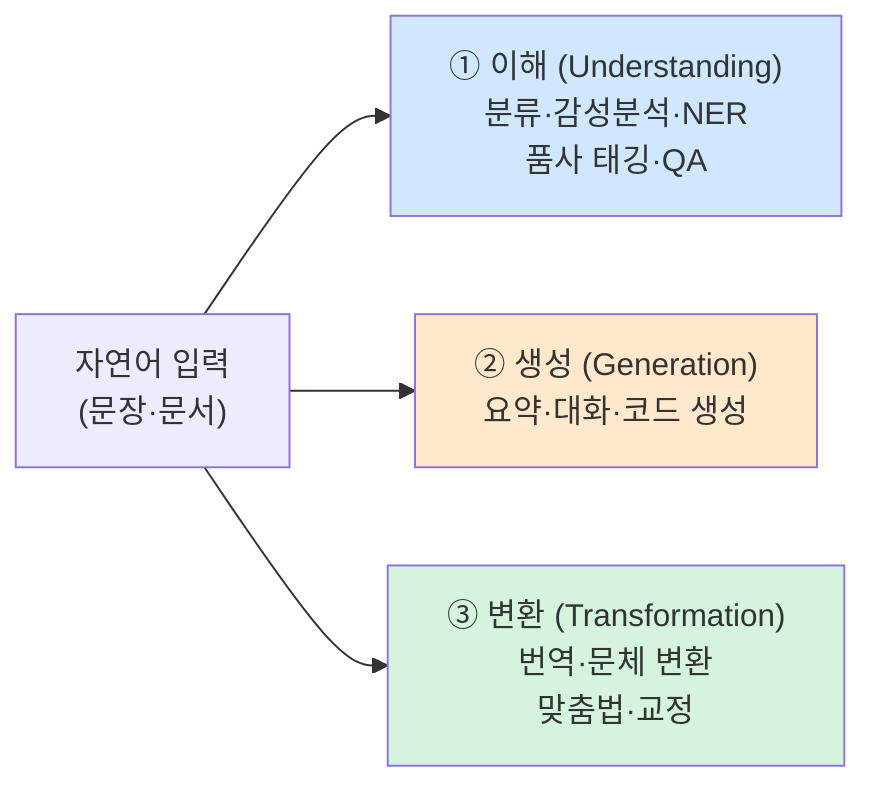
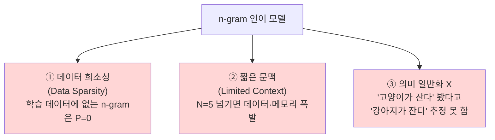
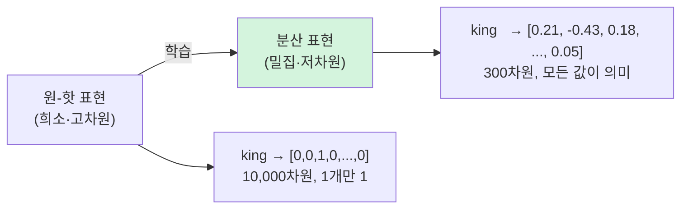
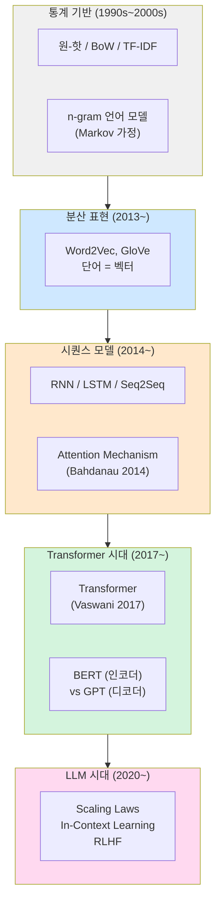

> **이 글의 목적**
>
> NLP(자연어 처리)를 *Word2Vec → Attention → Transformer → BERT/GPT → LLM* 까지 6편으로 끝까지 따라가는 시리즈의 1편이다.
>
> [AI개론 ④](/ai/ai-introduction-modern-ai/)에서 *현대 AI*의 줄기 중 하나로 NLP를 짧게 훑었다면, 이 시리즈는 그 안을 본격적으로 파고든다. 1편은 **모든 NLP 모델의 출발점인 "단어를 어떻게 숫자로 바꿀 것인가"** 라는 질문을 다룬다.
>
> 정리는 *Jurafsky & Martin*의 *Speech and Language Processing*(이하 **SLP**) 3rd Edition[^1]을 토대로, *Salton & Buckley(1988)*[^2], *Shannon(1948)*[^3] 등 원전을 직접 확인했다.
>
> **읽고 나면 답할 수 있는 질문**:
>
> - NLP가 푸는 일은 결국 무엇인가 (이해 / 생성 / 변환)
> - 단어를 컴퓨터에 표현하는 가장 단순한 방법(One-hot)의 *치명적 한계* 는 무엇인가
> - **BoW**와 **TF-IDF**의 차이 — 왜 *역문서빈도(IDF)* 가 필요한가
> - **n-gram 언어 모델**은 어떤 가정을 하고, 왜 무너지는가
> - "king − man + woman ≈ queen" 같은 *의미 연산* 이 가능하려면 무엇이 바뀌어야 하는가
> - **분산 표현(distributed representation)** 이 통계 기반 방법과 결정적으로 다른 점

---

## 1. NLP가 풀려는 일은 결국 세 가지

자연어 처리(Natural Language Processing)는 컴퓨터가 사람의 언어를 *읽고·쓰고·옮기는* 일을 다룬다. 세부 과제는 수십 가지로 나뉘지만, 큰 줄기는 셋이다.



이 셋 모두 *공통 전제* 가 있다. **단어와 문장을 컴퓨터가 다룰 수 있는 숫자로 바꿔야 한다**는 것. 이 단계를 *표현(representation)* 이라 부르고, 표현이 좋아질수록 그 위의 모든 과제가 좋아진다.

> 💡 NLP의 역사를 한 줄로 압축하면 *"단어를 더 좋은 숫자로 바꾸는 60년의 시도"* 라고 해도 크게 틀리지 않다.

---

## 2. 가장 단순한 출발 — One-hot encoding

### 2.1 어휘를 통째로 차원으로 펼치기

어휘(vocabulary) 크기 *V* 가 10,000이면, 각 단어를 *길이 10,000짜리 벡터* 로 표현한다. 자기 자리만 1, 나머지는 0이다.

```
king   → [0, 0, 1, 0, 0, ..., 0]   (3번째 자리만 1)
queen  → [0, 0, 0, 0, 1, ..., 0]   (5번째 자리만 1)
banana → [0, 1, 0, 0, 0, ..., 0]   (2번째 자리만 1)
```

이게 *원-핫 인코딩(one-hot encoding)* 이다. 컴퓨터에 단어를 넣을 때 가장 먼저 떠오르는 방식이고, 실제로 1990년대까지 NLP 시스템 대부분이 이 형태를 입력으로 받았다.

### 2.2 치명적 한계 — 의미가 사라진다

원-핫 벡터끼리 코사인 유사도를 계산해보면 *모든 쌍이 0* 이다. 같은 자리에 1이 겹치는 경우가 없으니까.

```
cos(king, queen)  = 0
cos(king, banana) = 0
```

직관적으로 *king* 과 *queen* 은 *king* 과 *banana* 보다 훨씬 가까워야 한다. 그런데 원-핫 표현에서는 둘이 똑같이 멀다. **의미적 유사도** 가 표현 자체에 들어 있지 않다.

### 2.3 또 다른 한계 — 차원의 저주

어휘가 늘어나면 벡터 길이가 그대로 늘어난다. 한국어 위키백과 본문 어휘만 해도 수십만 단어. 단어 하나당 30만 차원짜리 희소(sparse) 벡터를 들고 다녀야 한다는 뜻이다. 메모리·연산 모두 부담이고, 학습 데이터가 *희소성(sparsity)* 에 잡아먹힌다.

> 🎯 **시험 포인트**: 원-핫 표현은 (1) 단어 간 *의미 유사도* 를 표현하지 못하고 (2) 차원이 어휘 크기와 같아 *희소* 하다. 이 두 한계가 분산 표현(Word2Vec 등)을 등장시킨 근본 원인이다.

---

## 3. 문서를 표현해야 할 때 — Bag of Words

단어 하나가 아니라 *문서 전체* 를 표현해야 하는 과제(스팸 필터, 문서 분류 등)에서는 원-핫을 *그대로 쓰기보다 합쳐서 쓴다*. 가장 단순한 방식이 **BoW(Bag of Words)** 다.

### 3.1 정의

문서를 단어들의 *집합* 으로 보고, 각 단어가 몇 번 나왔는지를 센다. 어순(word order)은 버린다.

> *"I love NLP. NLP loves me."* → `{I: 1, love: 1, NLP: 2, loves: 1, me: 1}`

벡터로 표현하면:

```
어휘: [I, love, NLP, loves, me, banana, ...]
문서:  [1,    1,   2,     1,  1,      0, ...]
```

### 3.2 한계 — *어순* 과 *흔한 단어 가중치*

BoW는 두 가지 면에서 약하다.

| 한계 | 예 |
|---|---|
| 어순 무시 | "사람이 개를 물었다" 와 "개가 사람을 물었다" 가 같은 벡터 |
| 흔한 단어 과대 평가 | *"the", "이", "가", "을"* 같은 단어가 빈도 높아 점수 지배 |

첫 번째 한계는 *n-gram* (3.4절)으로 일부 보완하고, 두 번째 한계는 **TF-IDF** 로 해결한다.

---

## 4. TF-IDF — 흔한 단어를 깎고, 특이한 단어를 살린다

### 4.1 직관

문서 *d* 안에서 단어 *t* 가 얼마나 중요한가? 두 신호를 곱한다.

- **TF (Term Frequency)**: 문서 *d* 안에서 단어 *t* 가 얼마나 자주 나오는가 → 자주 나오면 중요
- **IDF (Inverse Document Frequency)**: 전체 문서 집합에서 단어 *t* 가 얼마나 *드문가* → 드물면 중요

이 둘을 곱한 값이 단어 *t* 가 문서 *d* 에서 갖는 *진짜 중요도* 다. **흔하고 의미 없는 단어**(the, 의, 가)는 IDF가 작아서 점수가 깎이고, **드물지만 주제어인 단어**(transformer, 양자컴퓨터)는 IDF가 커서 점수가 산다.

### 4.2 식

> *Salton & Buckley(1988)*[^2]가 정리한 표준형:
>
> **tf-idf(t, d) = tf(t, d) × log(N / df(t))**

| 기호 | 의미 |
|---|---|
| *tf(t, d)* | 문서 *d* 안에서 단어 *t* 의 빈도 |
| *N* | 전체 문서 수 |
| *df(t)* | 단어 *t* 가 등장한 문서 수 |
| *log(N / df(t))* | IDF — 흔한 단어일수록 작아짐 |

### 4.3 작은 예제

문서가 3개, 어휘는 *{고양이, 좋다, transformer}* 라고 하자.

| 문서 | 고양이 | 좋다 | transformer |
|---|---|---|---|
| d1 | 2 | 1 | 0 |
| d2 | 0 | 1 | 0 |
| d3 | 0 | 1 | 1 |

- *df(고양이)=1*, *df(좋다)=3*, *df(transformer)=1*

IDF (자연로그 사용):

- *idf(고양이) = ln(3/1) ≈ 1.10*
- *idf(좋다)   = ln(3/3) = 0*  ← 모든 문서에 나오니 정보가 없다
- *idf(transformer) = ln(3/1) ≈ 1.10*

문서 d1의 TF-IDF 벡터:

- *고양이*: 2 × 1.10 = 2.20
- *좋다*:   1 × 0    = 0
- *transformer*: 0

문서 d3의 TF-IDF 벡터:

- *고양이*: 0
- *좋다*: 0
- *transformer*: 1 × 1.10 = 1.10

*"좋다"* 처럼 모든 문서에 나오는 단어는 점수가 0이 된다. 이게 IDF의 효과다.

> 🎯 **시험 포인트**: TF-IDF 계산 자체보다 **IDF의 의미** 가 자주 나온다. *"모든 문서에 등장하는 단어는 IDF가 0이 되어 가중치가 사라진다"* 는 한 문장이 핵심.

### 4.4 TF-IDF의 한계

문서 단위에서는 굉장히 잘 작동하지만, **단어 사이의 의미 관계** 를 표현하지 못한다는 점은 BoW와 똑같다. *king* 과 *queen* 의 TF-IDF 벡터는 서로 다른 차원에 1을 가진 두 벡터이므로 여전히 *코사인 유사도가 0* 이다.

---

## 5. 문장 안의 흐름 — n-gram 언어 모델

### 5.1 언어 모델이란

> *언어 모델(Language Model)*: 단어 시퀀스에 *확률* 을 매기는 모델. *P(w₁, w₂, ..., wₙ)* 를 추정한다.

이 능력이 있으면 *"나는 학교에 ___"* 의 빈칸에 *간다* 가 *바나나* 보다 자연스럽다는 걸 수치로 표현할 수 있다. 자동 완성·기계 번역·음성 인식 모두 언어 모델이 토대다.

### 5.2 *Markov 가정* 으로 단순화

문장 전체 결합확률은 너무 복잡하다.

> *P(w₁, ..., wₙ) = P(w₁) · P(w₂\|w₁) · P(w₃\|w₁,w₂) · ... · P(wₙ\|w₁,...,wₙ₋₁)*

이걸 직접 추정하려면 *모든 가능한 앞 문맥* 의 통계가 필요하다. 데이터가 아무리 많아도 모자란다. 그래서 **마르코프 가정(Markov assumption)** 을 쓴다 — *바로 직전 N-1개 단어만 본다*.

| 모델 | 가정 | 예 (다음 단어 = *간다*) |
|---|---|---|
| **Unigram** (1-gram) | 다음 단어는 독립 | *P(간다)* |
| **Bigram** (2-gram) | 직전 1개 단어만 | *P(간다 \| 학교에)* |
| **Trigram** (3-gram) | 직전 2개 단어 | *P(간다 \| 나는, 학교에)* |

### 5.3 어떻게 추정하는가 — 단순 카운팅

> *P(간다 \| 학교에) = count(학교에, 간다) / count(학교에)*

이걸 *최대우도추정(MLE)* 이라 부른다. 코퍼스(corpus)가 클수록 정확해진다.

### 5.4 한계 — 데이터 희소성과 *문맥 길이*

n-gram에는 두 가지 큰 약점이 있다.



- **희소성**: 학습 코퍼스에 못 본 5-gram은 확률 0이 된다. *Laplace smoothing*, *Kneser-Ney smoothing* 같은 보완책이 있지만 근본 해결은 아니다.
- **짧은 문맥**: *"내가 어릴 적 살던 동네에서 자주 가던 그 빵집은 ..."* 같은 긴 의존성을 잡지 못한다.
- **의미 일반화 부재**: *고양이* 와 *강아지* 가 비슷한 분포의 문맥에 등장한다는 사실을 모델이 *명시적으로* 모른다.

이 셋 중 ③번이 결정적이다. 같은 문맥에 등장하는 단어들이 *유사한 의미* 라는 직관을 모델 안에 넣으려면 표현 자체가 바뀌어야 한다.

> 📚 **참고**: Shannon(1948)[^3]이 *정보 이론* 에서 영어 글자 단위 n-gram의 엔트로피를 계산하면서 언어 모델의 토대를 놓았다. n-gram은 60년 넘게 NLP의 주류였다.

---

## 6. 분산 표현으로 가는 길 — *분포 가설*

### 6.1 *Distributional Hypothesis*

영국 언어학자 J. R. Firth가 1957년에 남긴 한 줄이 NLP의 방향을 바꿨다.

> *"You shall know a word by the company it keeps."*[^4]
>
> — 단어의 의미는 그 단어가 *어떤 단어들 옆에 등장하는지* 로 알 수 있다.

이게 **분포 가설(Distributional Hypothesis)** 이다. *고양이* 와 *강아지* 는 *밥 먹는다, 잔다, 산책* 같은 비슷한 단어들 곁에 등장한다. 그러므로 두 단어의 *문맥 분포* 가 비슷하면 의미도 비슷하다.

### 6.2 분산 표현(Distributed Representation)

이 가설을 표현 방식에 녹여낸 게 **분산 표현** 이다. 핵심 아이디어:



| 측면 | 원-핫 | 분산 표현 |
|---|---|---|
| 차원 수 | 어휘 크기 (수만~수십만) | 보통 100~1024 |
| 값의 형태 | 0과 1 (희소) | 실수 (밀집) |
| 의미 유사도 | 표현 안 됨 | **벡터 거리로 표현** |
| 학습 방식 | 사전 정의 | **데이터로 학습** |

### 6.3 의미가 *벡터 연산* 이 되는 순간

분산 표현이 충분히 잘 학습되면 *의미가 산술 연산* 이 된다는 충격적 사실이 *Mikolov et al. (2013)*[^5]의 실험에서 드러났다.

```
vec(king) - vec(man) + vec(woman) ≈ vec(queen)
vec(Paris) - vec(France) + vec(Italy) ≈ vec(Rome)
```

원-핫 표현으로는 절대 불가능한 일이다. 이 결과가 NLP 전체 흐름을 바꿨고, 다음 편 [NLP ②] Word2Vec의 출발점이 된다.

---

## 7. NLP 발전사 한눈에 보기 — 시리즈 로드맵



이 시리즈는 위 흐름을 한 단계씩 따라간다.

| 편 | 주제 | 다루는 핵심 |
|---|---|---|
| **① (이 글)** | 단어 표현의 역사 | One-hot · BoW · TF-IDF · n-gram |
| ② | Word2Vec | CBOW / Skip-gram, 의미 벡터의 시대 |
| ③ | Seq2Seq + Attention | 기계 번역의 한계와 Bahdanau Attention |
| ④ | Transformer | Self-attention, Multi-head, Positional Encoding |
| ⑤ | BERT vs GPT | Encoder vs Decoder, 사전학습 패러다임 |
| ⑥ | LLM 시대 | Scaling Laws, ICL, RLHF, ChatGPT 이후 |

---

## 8. 정리

이 글에서 다룬 내용을 한 줄로 압축하면:

- **NLP의 모든 모델은 "단어를 어떤 숫자로 바꿀 것인가" 라는 질문에서 출발한다**
- **One-hot**: 단순하지만 *의미 유사도 표현 불가* + *희소·고차원*
- **BoW / TF-IDF**: 문서 단위에서 강력. *흔한 단어 가중치* 문제는 IDF로 해결
- **n-gram 언어 모델**: 문장 내 흐름을 *Markov 가정* 으로 근사. *희소성·짧은 문맥·의미 일반화 부재* 가 한계
- **분포 가설**: *"같은 문맥에 등장하는 단어는 의미가 비슷하다"* — 분산 표현의 철학적 토대
- **분산 표현**: 밀집 저차원 벡터로 *의미가 산술 연산* 이 되게 한 전환점

다음 편에서는 분산 표현을 처음으로 *실용적인 수준* 으로 끌어올린 **Word2Vec** (Mikolov et al., 2013)을 깊게 본다. CBOW와 Skip-gram의 차이, *Negative Sampling* 같은 학습 트릭, 그리고 왜 이 한 편의 논문이 NLP 전체를 흔들었는지까지.

---

## 9. 추가로 공부하면 좋을 개념

- **Zipf의 법칙(Zipf's Law)**: 자연어에서 *k번째로 흔한 단어의 빈도는 1/k에 비례* 한다는 경험 법칙. TF-IDF가 왜 잘 작동하는지에 대한 통계적 배경
- **Smoothing 기법**: n-gram의 데이터 희소성 문제를 완화하는 *Laplace · Good-Turing · Kneser-Ney* 등. 현대 LLM에는 사라졌지만 통계적 NLP의 핵심
- **Pointwise Mutual Information (PMI)**: 분포 가설을 확률적으로 다듬은 지표. Word2Vec과 *수학적으로 연결* 된다 (Levy & Goldberg, 2014)
- **GloVe (Pennington et al., 2014)**: Word2Vec과 동시대에 등장한 또 다른 분산 표현. 전역 동시 등장 행렬을 직접 분해
- **품사 태깅(POS Tagging)**: Hidden Markov Model 시대의 대표 NLP 과제. KODIT 7급 데이터직 2025년 출제 (시리즈와 별개로 정리 가치 있음)

> ✍️ **다음 학습**: [NLP ②] Word2Vec 깊게 파보기 — 작성 예정.

---

## 참고 문헌 (References)

[^1]: Jurafsky, D., & Martin, J. H. (2024). *Speech and Language Processing* (3rd ed. draft). Stanford. <https://web.stanford.edu/~jurafsky/slp3/>
[^2]: Salton, G., & Buckley, C. (1988). "Term-weighting approaches in automatic text retrieval." *Information Processing & Management*, 24(5), 513–523.
[^3]: Shannon, C. E. (1948). "A Mathematical Theory of Communication." *Bell System Technical Journal*, 27(3), 379–423.
[^4]: Firth, J. R. (1957). "A synopsis of linguistic theory, 1930–1955." In *Studies in Linguistic Analysis* (pp. 1–32). Oxford: Philological Society.
[^5]: Mikolov, T., Chen, K., Corrado, G., & Dean, J. (2013). "Efficient Estimation of Word Representations in Vector Space." *arXiv:1301.3781*.

---

## 부록 A. 이미지 생성 프롬프트

> 본 글은 Mermaid 차트 위주라 별도 이미지가 필수는 아니지만, 시리즈 도입부 히어로 이미지 한 장은 두면 좋다.

### A1. 시리즈 히어로 (`nlp_series_hero.png`)

> 📁 저장 경로: `/assets/images/nlp/nlp_series_hero.png`

```
Wide horizontal infographic illustrating the evolution of NLP word
representation. Left side: scattered isolated dots labeled as one-hot
vectors, showing sparse high-dimensional space. Middle: dense clusters
forming, with arrows pointing to "king", "queen", "man", "woman" at
positions that geometrically encode the analogy. Right side: a
modern transformer block silhouette emerging from the dense vector
space, suggesting future progression. Soft gradient background, blue
to teal color palette, modern educational illustration style. 16:9.

CRITICAL: 이미지 내 모든 문자/라벨은 반드시 한글로 표시. 영문 텍스트 금지
(단, 단어 예시 king, queen, man, woman과 수학 기호 vec()는 그대로 유지).
라벨:
- 왼쪽 영역: "원-핫 표현 (희소)"
- 가운데 영역: "분산 표현 (밀집)"
- 오른쪽 영역: "Transformer로"
- 하단 가운데: "NLP 60년 — 단어를 더 좋은 숫자로"
```

> 💡 위 프롬프트는 본문 텍스트에 의존하지 않는 자기 완결형 이미지를 만들도록 작성됐다.
