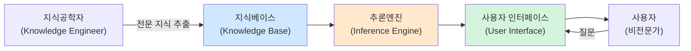
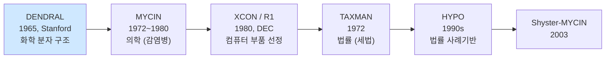
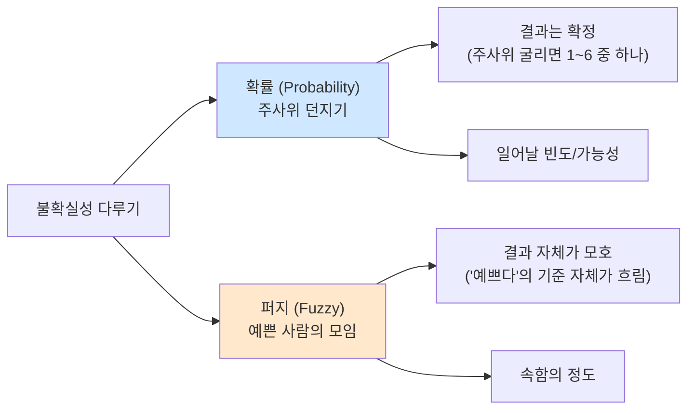
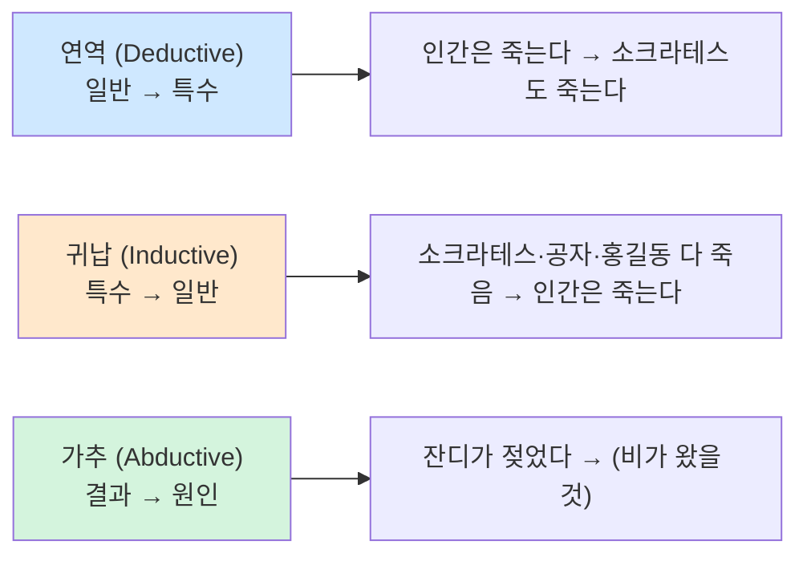
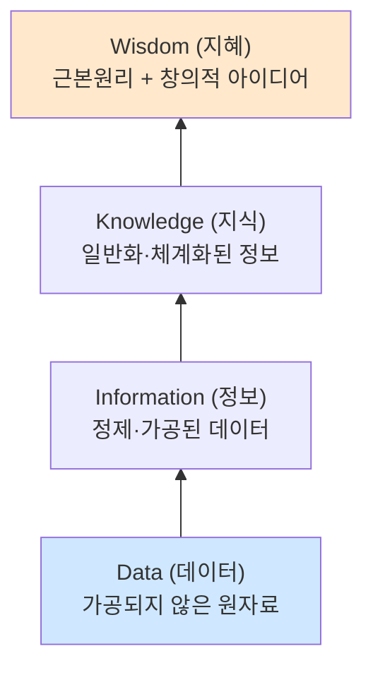
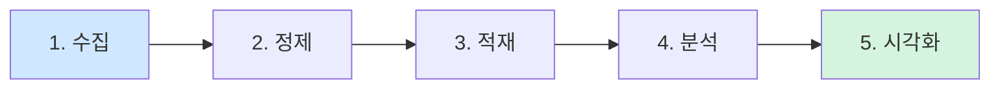
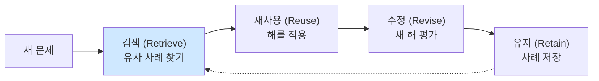

> **이 글의 목적**
>
> [AI 심화 ①~④](/ai/ai-advanced-ml-algorithms/)가 *현대 머신러닝/딥러닝* 이었다면, 이번 편은 *고전 AI* — 1950~80년대에 자리잡은 **전문가 시스템·불확실성 의사결정·퍼지·베이즈·DIKW** 를 한 글로 압축한다.
>
> 이 영역은 7급 데이터직보다는 **KODIT 인공지능개론(W5·W6·W3-3)** 에 비중이 크다. 특히 *불확실성 5기준* 은 매년 *수치 계산 문제* 로 거의 확정 출제. 시험 직전에 카드처럼 봐도 점수가 나오는 구조라 *압축형* 으로 정리.
>
> 정리는 KODIT 학습노트 W5·W6·W3과 *AIMA*[^1] Ch.13 (불확실성), Ch.7 (논리), *Russell & Norvig*의 의사결정 이론을 토대로, **Zadeh 1965**[^2], **Bayes 1763**[^3] 등의 원전을 직접 확인했다.
>
> **읽고 나면 답할 수 있는 질문**:
>
> - **전문가 시스템 4구성요소** — 그리고 *자연어처리 라이브러리는 왜 답이 아닌가*
> - **불확실성 5기준** (Laplace · Maximax · Maximin · Hurwitz · Savage) 의 정확한 정의와 표 계산
> - **퍼지 vs 확률** — 같은 *불확실* 이지만 본질이 어떻게 다른가
> - **퍼지 합집합·교집합·여집합** 의 식 (max, min, 1−x)
> - **추론 6종** — 연역/귀납/가추 + 전향/후향/결합형
> - **베이즈 정리** + 조건부 확률 + 결합 확률 표 계산
> - **DIKW 계층** + 관련 시스템 (DB → OLAP → KMS → BI)
> - **빅데이터 5V** + 처리 5단계
> - **지식 표현 5종** — 논리·의미·규칙·프레임·사례

---

## 1. 전문가 시스템 (Expert System)

### 1.1 정의

> *"특정 영역의 전문가 지식을 IF-THEN 규칙으로 표현하고, 추론엔진으로 실행하여 비전문가에게 전문가 수준의 결정을 제공하는 시스템."*

### 1.2 4가지 핵심 구성요소



| 구성요소 | 역할 |
|---|---|
| **지식베이스(KB)** | 규칙·사실 저장 (IF-THEN) |
| **추론엔진(IE)** | 규칙을 적용해 결론 도출 |
| **사용자 인터페이스** | 사용자와 대화 |
| **지식공학자** | 전문가에게 지식 추출해 KB 구축 |

### 1.3 시험 함정 — 자연어처리 라이브러리는 ✗ (2023-4)

> *"규칙 기반 전문가 시스템을 구성하는 요소가 아닌 것은?"*
>
> ① 규칙 집합으로 표현된 지식베이스 ✓
> ② 사용자와의 상호 작용을 지원하는 사용자 인터페이스 ✓
> ③ 규칙과 사실을 연결하는 추론 엔진 ✓
> ④ **규칙 생성을 위한 자연어 처리 라이브러리 ✗** ← 정답

자연어처리 라이브러리는 *전문가 시스템의 필수 구성요소가 아니다*. 함정.

### 1.4 역사



- **DENDRAL** (1965): *최초의 전문가 시스템*. 질량 스펙트럼으로 분자 구조 추정
- **MYCIN**: 항생제 처방 자문. *지금까지도 표준* 으로 인용
- **XCON / R1**: DEC가 컴퓨터 부품 선정에 사용해 *연간 수백만 달러 절감*

### 1.5 생성시스템 (Production System) = IF-THEN

> **IF (조건) THEN (결론)** 형태의 규칙 집합으로 지식 표현

예:
```text
IF (봄이다) AND (하늘이 흐리다) AND (비내릴 확률 30%)
THEN (우산을 가지고 외출한다)
```

### 1.6 기존 시스템 vs 전문가 시스템

| 측면 | 기존 시스템 | 전문가 시스템 |
|---|---|---|
| 정보 처리 | 알고리즘 | **체험적·로직** |
| 운영 | 완전한 정보 필요 | **불완전·불확실 정보로도 OK** |
| 데이터 | 데이터 표현·사용 | **지식 표현·사용** |
| 목적 | 효율성(efficiency) | **유효성(effectiveness)** |
| 설명 기능 | 일부분 | **전문가 시스템의 한 부분** |

### 1.7 순방향 연결 — 사실 추가 개수 계산 (2023-21)

데이터베이스 사실: **A, B, C, D**
규칙:
1. IF Y AND D AND E, THEN Z
2. IF X AND B, THEN Y
3. IF A, THEN X
4. IF B, THEN W

**순방향 추론 (Forward Chaining)**: 사실 → 규칙 적용 → 새 사실 추가 반복

```text
초기 사실: {A, B, C, D}

규칙 3 (A → X): X 추가 → {A, B, C, D, X}
규칙 4 (B → W): W 추가 → {A, B, C, D, X, W}
규칙 2 (X AND B → Y): X와 B 모두 있으니 Y 추가 → {A, B, C, D, X, W, Y}
규칙 1 (Y AND D AND E → Z): E가 없으므로 Z는 추가 못함

새로 추가된 사실: X, W, Y → 3개
```

> 🎯 **정답 ③** (3개). 함정: *Z는 E 없어서 추가 안 됨*.

---

## 2. 불확실성과 의사결정 5기준 ★★★ (계산 거의 확정 출제)

### 2.1 표 형식 의사결정 문제

수요가 *상·중·하* 로 불확실할 때 공장 규모(*소·중·대·초대*) 결정:

| 수요 \ 대안 | 소규모 | 중규모 | 대규모 | 초대규모 |
|---|---|---|---|---|
| **상** | 10 | 50 | 120 | **200** |
| **중** | 40 | 80 | 0 | -50 |
| **하** | 70 | -70 | -140 | -200 |

### 2.2 5가지 기준 계산

#### ① 라플라스 기준(Laplace) — 평균 → 최대

각 대안의 *모든 시나리오 평균*. 확률 정보가 없을 때 *균등 확률* 가정.

| 대안 | 평균 |
|---|---|
| 소규모 | (10+40+70)/3 = **40** ← 최대 |
| 중규모 | (50+80-70)/3 = 20 |
| 대규모 | (120+0-140)/3 = -6.67 |
| 초대규모 | (200-50-200)/3 = -16.67 |

→ **소규모 선택 (40)**

#### ② 낙관적 기준(Maximax) — 행 최댓값 → 최대

*"최선의 시나리오만 발생한다"* 고 가정.

| 대안 | 행 최댓값 |
|---|---|
| 소규모 | 70 |
| 중규모 | 80 |
| 대규모 | 120 |
| 초대규모 | **200** ← 최대 |

→ **초대규모 선택 (200)**

> 비용 문제(이익이 아님)에선 **Minimin** (행 최솟값 → 최소).

#### ③ 비관적 기준(Maximin) — 행 최솟값 → 최대 (안전제일)

*"최악의 시나리오만 발생한다"* 고 가정. 그래도 최악 중 가장 나은 것.

| 대안 | 행 최솟값 |
|---|---|
| 소규모 | **10** ← 최대 |
| 중규모 | -70 |
| 대규모 | -140 |
| 초대규모 | -200 |

→ **소규모 선택 (10, 안전제일)**

#### ④ 호르비츠 기준(Hurwitz) — α·max + (1-α)·min

낙관계수 α (0~1) 도입. *낙관/비관 가중평균*. α=0.5라면:

| 대안 | 0.5·max + 0.5·min |
|---|---|
| 소규모 | 0.5·70 + 0.5·10 = **40** ← 최대 |
| 중규모 | 0.5·80 + 0.5·(-70) = 5 |
| 대규모 | 0.5·120 + 0.5·(-140) = -10 |
| 초대규모 | 0.5·200 + 0.5·(-200) = 0 |

→ **소규모 선택 (40)**

#### ⑤ 새비지 기준(Savage = Minimax Regret) — 후회 최소화

*"잘못 선택한 대가(후회)를 최소화"*. 절차:

**Step 1.** 각 시나리오의 *최댓값* 찾기
- 수요 상: 200 / 중: 80 / 하: 70

**Step 2.** *기회손실표(Regret Table)* 작성 — 각 칸 = (시나리오 최댓값 − 현재 칸)

| 수요 | 소규모 | 중규모 | 대규모 | 초대규모 |
|---|---|---|---|---|
| 상 | 200-10=190 | 200-50=150 | 200-120=80 | 200-200=0 |
| 중 | 80-40=40 | 80-80=0 | 80-0=80 | 80-(-50)=130 |
| 하 | 70-70=0 | 70-(-70)=140 | 70-(-140)=210 | 70-(-200)=270 |

**Step 3.** 각 대안의 *최대 후회값* (행 최댓값)

| 대안 | 최대 후회값 |
|---|---|
| 소규모 | 190 |
| 중규모 | **150** ← 최소 |
| 대규모 | 210 |
| 초대규모 | 270 |

→ **중규모 선택 (150)**

### 2.3 5기준 한 표 정리 ★★★

| 기준 | 영문 | 계산법 | 의미 |
|---|---|---|---|
| 라플라스 | Laplace | 평균 → 최대 | 확률 정보 없음, 균등 가정 |
| 낙관적 | Maximax / Minimin | 행 최댓값 → 최대 | "최선 시나리오만" |
| 비관적 | Maximin / Minimax | 행 최솟값 → 최대 | 안전제일, "최악 가정" |
| 호르비츠 | Hurwitz | α·max+(1-α)·min | 낙관/비관 가중평균 |
| 새비지 | Savage = Minimax Regret | 기회손실표 → 행 최댓값 → **최소** | 후회 최소화 |

> 🎯 **시험 직전 1분 암기**:
> *라플라스(평균)·맥시맥스(최댓값 중 최대)·맥시민(최솟값 중 최대)·호르비츠(가중)·새비지(후회 최소)*

---

## 3. 퍼지 이론 (Fuzzy Theory)

### 3.1 등장 배경

> Zadeh, L. A. (1965). *Fuzzy Sets*. Information and Control, 8(3), 338–353.[^2]

미국 버클리 대학 자데(Lotfi A. Zadeh) 교수가 *고전 집합의 한계* 를 보완하기 위해 제안.

> *"잘 생겼다, 예쁘다, 어리다"* 같은 *애매모호한 대상* 을 *0/1 이진 논리* 로는 표현 불가능. → *부분적으로 속함* 의 개념이 필요.

### 3.2 소속함수 (Membership Function)

> **μ_A(x): X → [0, 1]**

원소 x가 집합 A에 *얼마나 속하는가* 를 0~1 실수로 표현.

| μ 값 | 의미 |
|---|---|
| 1 | 완전히 속함 |
| 0 | 전혀 안 속함 |
| 0.7 | "많이 속하지만 완전하진 않음" |

#### 예: "젊은이의 집합"

40세 이하: 완전 속함 (μ=1)
40~60세: 선형 감소 (μ = 1 - (x-40)/20)
60세 이상: 안 속함 (μ=0)

### 3.3 퍼지 vs 확률 — *결정적 차이*



| 측면 | 확률 | 퍼지 |
|---|---|---|
| 다루는 대상 | *결정적이지만 모르는* 것 | *대상 자체가 모호* |
| 합 | 모든 사건 합 = 1 | 모든 원소 μ 합 ≠ 1 (제약 없음) |
| 예 | "비올 확률 30%" | "키가 큼의 정도 0.7" |

> 🎯 **시험 (2024-22)** 함정: 두 개념의 차이를 묻는 문제.

### 3.4 퍼지 집합 연산 (시험 직출 ★★★)

| 연산 | 식 | 의미 |
|---|---|---|
| **퍼지 합집합 (∪)** | μ_{A∪B}(x) = **max(μ_A, μ_B)** | "둘 중 하나라도 속함의 더 큰 정도" |
| **퍼지 교집합 (∩)** | μ_{A∩B}(x) = **min(μ_A, μ_B)** | "둘 다 속함의 더 작은 정도" |
| **퍼지 여집합** | μ_{Aᶜ}(x) = **1 − μ_A(x)** | "안 속함의 정도" |

#### 예제

> *"그녀는 아름답다"* μ = 0.7, *"그녀는 목소리도 예쁘다"* μ = 0.8

- 합집합 (또는): max(0.7, 0.8) = **0.8**
- 교집합 (그리고): min(0.7, 0.8) = **0.7**
- 여집합 (아님): 1 - 0.7 = **0.3** (아름답지 않음)

> 🎯 **시험 (2025-22)** 직출: *"퍼지 집합 연산 중 합집합으로 옳은 것은?"* → **max(μ_A, μ_B)**.

### 3.5 퍼지 명제 + 비퍼지화

- **퍼지 명제(Fuzzy Proposition)**: IF-THEN 형태의 *퍼지 규칙* 으로 지식 표현
- **비퍼지화(Defuzzification)**: 퍼지 추론 결과를 *하나의 실수값* 으로 변환 (centroid·max·height 방법)

> 🎯 **시험 (2024-22)** 모든 보기 ✓ — 소속 정도 0~1, IF-THEN 퍼지 규칙, 정성적 대상 표현, 비퍼지화로 실수 변환.

---

## 4. 추론 종류 (6종)

### 4.1 결과 vs 원인 방향 — 3종



| 추론 | 방향 | 특징 |
|---|---|---|
| **연역(Deductive)** | 일반 → 특수 | *절대적 필연성*, 전제가 참이면 결론도 참 |
| **귀납(Inductive)** | 특수 → 일반 | *경험과학*, 가능성에 기반 |
| **가추(Abductive)** | 결과 → 원인 | *최선의 설명* 추론, 의료 진단 |

### 4.2 추론 엔진 방향 — 3종

| 추론 | 방향 | 예시 |
|---|---|---|
| **전방향 (Forward Chaining)** | 데이터 → 규칙 → 결론 (상향식) | 증상 → 병명 |
| **후방향 (Backward Chaining)** | 가설 → 규칙 → 데이터 (하향식) | 병명 → 증상 |
| **결합형 (Hybrid)** | 양방향 결합 | 의료 진단 종합 |

### 4.3 시험 (2025-8) 핵심 개념

- **경합 해소(Conflict Resolution)**: 여러 규칙이 동시에 만족할 때 *어떤 규칙을 먼저 실행할지* 선택
- **추론 엔진 사이클**: 경합 해소 → **패턴 매칭** → 규칙 실행 → 반복

> 🎯 **시험 (2025-8) 정답 ④** 함정: *"경합 해소 → 패턴 매칭 → 규칙 실행"* 순서가 거꾸로. 표준은 *패턴 매칭 → 경합 해소 → 규칙 실행* (규칙 후보를 먼저 매칭하고, 그중에서 경합 해소).

---

## 5. 확률 기초 + 베이즈 정리

### 5.1 기본 식

> **조건부 확률**: P(Y|X) = P(X∩Y) / P(X)
> **곱셈정리**: P(X∩Y) = P(X)·P(Y|X) = P(Y)·P(X|Y)
> **베이즈정리**: **P(A|B) = P(B|A)·P(A) / P(B)**

| 용어 | 영문 | 의미 |
|---|---|---|
| 사전확률 | Prior | 증거 보기 전 확률 P(A) |
| 가능도 | Likelihood | A 참일 때 B 관찰될 확률 P(B|A) |
| 사후확률 | Posterior | 증거 본 후 확률 P(A|B) |
| 우도 | (Likelihood, 같은 말) | 역조건부확률 |

### 5.2 결합 확률 P(A∩B) 계산 (2025-13) ★★

| | 비흡연 | 흡연 | 합계 |
|---|---|---|---|
| 정상인 | 35 | 15 | 50 |
| 암환자 | 7 | 3 | 10 |
| **합계** | 42 | 18 | **60** |

A = 흡연, B = 암환자

> **P(A∩B) = (흡연 AND 암환자 수) / 전체 = 3 / 60 = 0.05**

→ **정답 ① (0.05)**

### 5.3 조건부 확률 P(A|¬B) 계산 (2024-15) ★★

| | 비음주자 | 음주자 | 합계 |
|---|---|---|---|
| 정상인 | 37 | 15 | 52 |
| 고혈압 환자 | 6 | 7 | 13 |
| **합계** | 43 | 22 | **65** |

A = 고혈압 환자, B = 음주자, ¬B = 비음주자

> **P(A|¬B) = P(A∩¬B) / P(¬B) = 6 / 43 ≈ 0.14**

> **P(B|¬A) = P(B∩¬A) / P(¬A) = 15 / 52 ≈ 0.29**

→ **정답 ① (0.14, 0.29)**

> 💡 *조건부 확률은 "조건이 된 부분"을 분모로*. ¬B 조건이면 분모는 *비음주자 합계 43*.

---

## 6. DIKW 계층구조

### 6.1 4단계



### 6.2 단계별 관련 시스템

| 단계 | 의미 | 관련 시스템 |
|---|---|---|
| **Data** | 관찰·측정으로 수집된 사실 | DB, OLTP, ETL, **Data Lake** |
| **Information** | 사용자 필요에 의한 정제·가공 | DW (Data Warehouse), OLAP |
| **Knowledge** | 일반화·체계화 → 즉시 적용 가능 | **KMS, EKP** (전사적 지식포털) |
| **Wisdom** | 근본 이해로 도출되는 창의적 아이디어 | BI (Business Intelligence) |

#### 주요 시스템 정의

- **OLTP** (On-Line Transaction Processing): 실시간 거래 처리 (은행 ATM)
- **ETL** (Extract, Transform, Load): 추출·변환·적재 파이프라인
- **DW** (Data Warehouse): 분산 DB 통합 관리
- **OLAP** (On-Line Analytical Processing): 다차원 분석·의사결정 지원
- **KMS** (Knowledge Management System): 조직 내 지식 관리 분산 하이퍼미디어
- **EKP** (Enterprise Knowledge Portal): 전사적 지식포털, 단일 창구
- **BI** (Business Intelligence): 비즈니스 의사결정 지원

### 6.3 시험 (2025-14) 함정

> *"빅데이터 분석에서 정제된 데이터를 정제(cleaning), 통합(integration)하여 잡음과 불일치를 제거하고 데이터 웨어하우스에 저장한다"* → **참**.
>
> *"트랜잭션에서 항목 간의 불순도를 표현하기 위해 최소지지도와 최소신뢰도를 사용한다"* → **거짓** (지지도/신뢰도는 *연관성 측정* 이지 *불순도* 가 아님).

---

## 7. 빅데이터 5V + 처리 5단계

### 7.1 빅데이터 5V (필수)

| V | 의미 |
|---|---|
| **Volume (규모)** | 매일 테라바이트 단위 생성 |
| **Velocity (속도)** | 실시간 처리 필요 |
| **Variety (다양성)** | 정형·반정형·비정형 |
| **Veracity (정확성)** | 데이터 신뢰성 — 분석 가치 검증 |
| **Value (가치)** | 의미 있는 결과물 도출 |

#### 부가 V

- **Variability (가변성)**: 맥락에 따라 의미 달라짐
- **Visualization (시각화)**: 정보의 가공·표현

### 7.2 처리 5단계



| 단계 | 내용 |
|---|---|
| 1. 수집 | 정형·반정형·비정형 데이터 수집 |
| 2. 정제 | 오류·중복 제거 |
| 3. 적재 | RDB / NoSQL / Redshift / Druid 등 |
| 4. 분석 | 의미 있는 지표 추출 |
| 5. 시각화 | 차트·도표로 표현 |

---

## 8. 지식 표현 5종 (보강)

| 방식 | 특징 | 예 |
|---|---|---|
| **논리기반** (명제·술어) | 정형식, 추론 가능 | ∀x. Human(x) → Mortal(x) |
| **의미기반** (시맨틱넷) | 노드·링크 그래프 | 고양이 ─is-a→ 포유류 |
| **규칙기반** (IF-THEN) | 생성시스템, 전문가 시스템 | IF 빨강 THEN 정지 |
| **프레임기반** (Minsky 1974) | 슬롯·필러, OOP의 뿌리 | Frame: 식당 / Slots: 손님·메뉴 |
| **사례기반** (CBR) | 과거 사례 회상·변형 | 과거 진료 기록 → 현재 환자 |

#### CBR 사이클 (Retrieve · Reuse · Revise · Retain)



---

## 9. 헷갈리는 것 / 자주 묻는 질문

### Q1. *5기준 중 안전제일은 어느 것?*

**Maximin (비관적)**. *최악 시나리오 가정* 하고 그래도 가장 나은 대안 선택.

### Q2. *Maximax와 Minimin 차이?*

같은 *낙관적 기준* 의 두 변형:
- **Maximax**: *이익* 표 (행 최댓값 중 최대)
- **Minimin**: *비용/손실* 표 (행 최솟값 중 최소)

### Q3. *Savage 기준이 다른 4기준과 결정적으로 다른 점?*

다른 4개는 *원래 표* 로 계산. **Savage만 *기회손실표*** 를 별도로 작성.

### Q4. *퍼지 합집합 = max인 이유?*

*"A 또는 B 에 속함"* 은 둘 중 *더 강한 소속도* 를 따름. 0.7과 0.3이라면 합집합은 0.7.

### Q5. *연역과 가추의 차이?*

- **연역**: 전제 → 결론 (확실)
- **가추**: 결과 → 가장 가능성 높은 원인 (불확실)

### Q6. *조건부 확률 P(A|B)에서 분모는?*

분모는 **P(B)** 또는 **B 조건의 합계** — 표 문제에선 *조건이 된 부분의 합*.

### Q7. *DIKW에서 가장 가치 있는 단계는?*

**Wisdom**. 근본원리 이해로 *맥락에 맞는 규칙 적용* 가능.

---

## 10. 시험 직전 1분 요약

### 핵심 7개

1. **전문가 시스템 4구성**: 지식베이스·추론엔진·사용자 인터페이스·지식공학자 (자연어처리 라이브러리 ✗)
2. **5기준 의사결정**:
   - 라플라스(평균) → 최대
   - 맥시맥스(낙관, 행 최댓값 → 최대)
   - 맥시민(비관/안전제일, 행 최솟값 → 최대)
   - 호르비츠(α·max + (1-α)·min)
   - 새비지(기회손실표 → 행 최댓값 → **최소**)
3. **퍼지 연산**: 합 = max / 교 = min / 여 = 1−x
4. **확률 vs 퍼지**: 결과 확정 vs 결과 자체 모호
5. **추론 6종**:
   - 방향: 연역(↓)·귀납(↑)·가추(?↩)
   - 엔진: 전향·후향·결합형
6. **베이즈 정리**: P(A|B) = P(B|A)·P(A)/P(B). 조건부확률 P(Y|X) = P(X∩Y)/P(X)
7. **DIKW**: Data→Info→Knowledge→Wisdom (DB→DW→KMS→BI)

### 자주 헷갈리는 한 마디

- *"새비지는 행 최댓값 중 최대 선택"* → **거짓 (행 최댓값 중 최소)**
- *"맥시민은 낙관적 기준"* → **거짓 (비관적, 안전제일)**
- *"퍼지 합집합 = μ_A + μ_B"* → **거짓 (max)**
- *"퍼지와 확률은 같다"* → **거짓 (대상이 다름)**
- *"전문가 시스템에 자연어처리 라이브러리 필수"* → **거짓**
- *"전향 추론은 가설 기반"* → **거짓 (데이터 기반)**

### 7급 데이터직 + KODIT 빈출 패턴

| 출제 영역 | 풀이 키 |
|---|---|
| 5기준 표 계산 | 표 5분 안에 5개 답 다 구하기 |
| 퍼지 연산 식 | 합 max·교 min·여 1-x |
| 조건부 확률 | 표에서 조건된 부분 분모로 |
| 결합 확률 | 교집합 칸 / 전체 |
| 전문가 시스템 4구성 | 지식베이스·추론엔진·UI·지식공학자 |
| 순방향 연결 사실 추가 | 규칙 차례로 적용, 전제 다 만족할 때만 |
| DIKW 단계 식별 | Data·Info·Knowledge·Wisdom |
| 빅데이터 5V | Volume·Velocity·Variety·Veracity·Value |

---

## 11. 다음 학습

다음 편에서 *데이터마이닝·차원 축소·진화 알고리즘* 으로 넘어간다.

- 📌 **[AI 심화 ⑥] 데이터마이닝·차원 축소·진화 알고리즘** — 마르코프·Apriori·PCA·계층적 군집·밀도추정·유전 알고리즘·메타학습·하이퍼파라미터·추천 시스템·품사 태깅
- 📌 [알고리즘 ①~③] Big-O·정렬·그래프·DP
- 📌 [AI시스템 ①~②] MLOps + AI 윤리·EU AI Act

---

## 12. 참고 문헌 (References)

[^1]: Russell, S. J., & Norvig, P. (2020). *Artificial Intelligence: A Modern Approach* (4th ed.). Pearson. (Ch. 7 논리, Ch. 13 불확실성, Ch. 16 의사결정 이론)

[^2]: Zadeh, L. A. (1965). Fuzzy sets. *Information and Control*, 8(3), 338–353. [DOI: 10.1016/S0019-9958(65)90241-X](https://doi.org/10.1016/S0019-9958(65)90241-X)

[^3]: Bayes, T. (1763). An essay towards solving a problem in the doctrine of chances. *Philosophical Transactions of the Royal Society of London*, 53, 370–418.

[^4]: Buchanan, B. G., & Shortliffe, E. H. (1984). *Rule-Based Expert Systems: The MYCIN Experiments of the Stanford Heuristic Programming Project*. Addison-Wesley.

[^5]: Newell, A., & Simon, H. A. (1972). *Human Problem Solving*. Prentice-Hall. (생성시스템·IF-THEN 규칙)

[^6]: Minsky, M. (1974). *A Framework for Representing Knowledge*. MIT AI Memo 306. (프레임 기반 지식 표현)

### 보조 자료

- KODIT 학습노트 W5 (전문가시스템 + 불확실성), W6 (퍼지·확률), W3 (DIKW·빅데이터)
- 7급 데이터직 인공지능 기출 (2023~2025) 관련 문항 — 4번·8번·15번·21번 (2023), 15번·22번 (2024), 8번·13번·14번·22번 (2025)

---

## 부록 A: 이미지 생성 프롬프트

> 📁 이미지 프롬프트는 [`/prompts/2026-05-03-ai-advanced-classical-ai.md`](/prompts/2026-05-03-ai-advanced-classical-ai.md) 에 별도 정리되어 있다 (한글 라벨·파일명·저장 경로 명시).

> ✍️ **다음 학습**: [AI 심화 ⑥] 데이터마이닝·차원 축소·진화 알고리즘 — 작성 예정.
