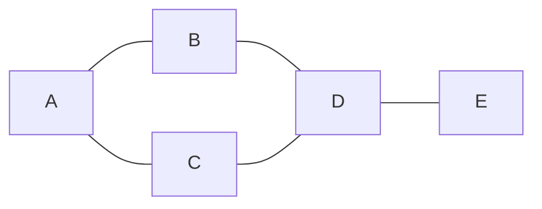
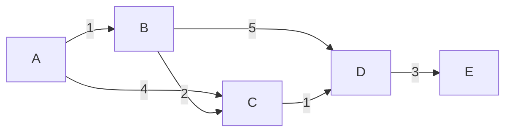
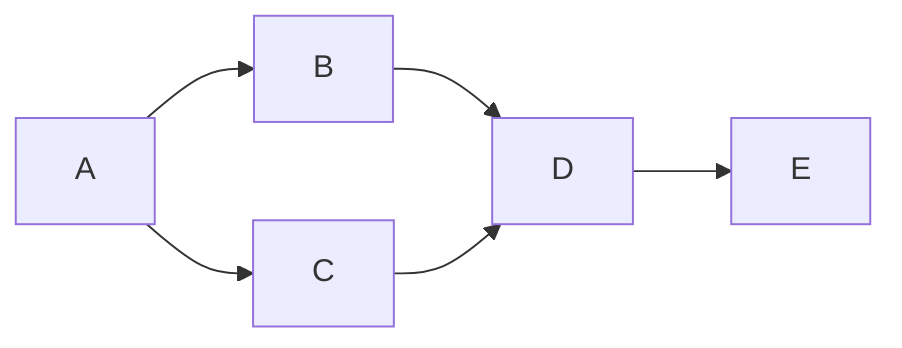

> **이 글의 목적**
>
> [알고리즘 ①] 에서 *점근 표기·정렬·자료구조* 를 다뤘으니, 이번엔 그래프 알고리즘 차례. 시험 비중은 ① 과 비슷한 *20%* 안팎인데, *손으로 트레이싱하는 문제* 가 자주 나와서 *알고리즘별로 어디까지 그릴 수 있는지* 가 핵심이다.
>
> 정리는 *CLRS*[^1]의 그래프 챕터(22~25)와 *Sedgewick & Wayne*[^2] 4부, 그리고 *Skiena*[^3]를 토대로 했다. 시험 직전이면 *5번(MST), 6번(위상정렬), 9번(트레이싱 정리)* 만 빠르게 훑어도 된다.
>
> **읽고 나면 답할 수 있는 질문**:
>
> - 그래프를 *인접행렬* 로 표현할지 *인접리스트* 로 표현할지, *언제 어떤 게 유리한가*
> - **BFS 와 DFS** 의 자료구조 차이(큐 vs 스택)와 *방문 순서*
> - **다익스트라** 의 시간복잡도가 왜 *O((V+E) log V)* 인지, *음의 가중치에서 왜 깨지는지*
> - **벨만-포드** 가 다익스트라보다 *느린 대신 무엇을 더 할 수 있는지*
> - **MST** 알고리즘 *프림 vs 크루스칼* 의 자료구조 차이와 시간복잡도
> - **유니온-파인드(Union-Find)** 가 왜 크루스칼에서 핵심인가
> - **위상정렬** 두 가지 방법(Kahn vs DFS) 과 *DAG 조건*
> - 같은 그래프 위에서 BFS·DFS·다익스트라가 *어떻게 다른 답* 을 내는가

---

## 1. 그래프 기본 개념

### 1.1 그래프란

*그래프(Graph)* 는 *정점(Vertex, V)* 과 *간선(Edge, E)* 의 쌍 G = (V, E)이다. *지하철 노선도, SNS 친구 관계, 작업 의존성, 도로망* 같은 것들을 표현할 때 쓴다.



### 1.2 분류 — 시험 직출 용어

| 분류 축 | 용어 | 의미 |
|---|---|---|
| 방향 | **무방향(Undirected)** | A-B 와 B-A 가 같음 |
| 방향 | **유방향(Directed, Digraph)** | A→B 만 있을 수 있음 |
| 가중치 | **비가중(Unweighted)** | 모든 간선 비용 동일 |
| 가중치 | **가중(Weighted)** | 간선마다 비용 |
| 사이클 | **DAG (Directed Acyclic Graph)** | 방향 그래프 + 사이클 없음. *위상정렬 가능* |
| 연결성 | **연결(Connected)** | 모든 정점이 도달 가능 |
| 연결성 | **강한 연결(Strongly Connected)** | 유방향에서 양쪽 도달 |

### 1.3 차수 (Degree)

- **무방향**: degree(v) = v에 연결된 간선 수
- **유방향**: 진입차수(in-degree) + 진출차수(out-degree)

> 💡 *모든 정점의 차수 합 = 2|E|* (악수 정리). 시험에 직출되는 사실.

---

## 2. 그래프 표현 — 인접행렬 vs 인접리스트

### 2.1 인접행렬 (Adjacency Matrix)

V × V 크기의 2차원 배열. `M[i][j] = 1` (또는 가중치) 이면 i→j 간선 존재.

```text
   A B C D E
A  0 1 1 0 0
B  1 0 0 1 0
C  1 0 0 1 0
D  0 1 1 0 1
E  0 0 0 1 0
```

### 2.2 인접리스트 (Adjacency List)

각 정점마다 *연결된 정점 목록* 을 저장.

```text
A: [B, C]
B: [A, D]
C: [A, D]
D: [B, C, E]
E: [D]
```

### 2.3 비교표 ★

| 측면 | 인접행렬 | 인접리스트 |
|---|---|---|
| **공간** | **O(V²)** | **O(V + E)** |
| **인접 확인** `(u,v) ∈ E?` | **O(1)** | O(degree(u)) |
| **모든 인접 순회** | O(V) | **O(degree(u))** |
| **간선 추가/삭제** | O(1) | O(degree) |
| **적합한 그래프** | *밀집(dense)* — E ≈ V² | *희소(sparse)* — E ≈ V (실무 대부분) |

> 💡 시험에 *"V=1000, E=3000일 때 어떤 표현이 유리한가?"* 같은 질문이 나오면 — *희소 그래프* 라 **인접리스트** 가 답.

---

## 3. 그래프 순회 — BFS와 DFS ★★★

### 3.1 BFS (Breadth-First Search, 너비 우선 탐색)

> *시작 정점에서 가까운 순서대로 방문*. *큐(Queue)* 사용.

#### 알고리즘

```python
from collections import deque

def bfs(graph, start):
    visited = {start}
    queue = deque([start])
    order = []
    while queue:
        u = queue.popleft()
        order.append(u)
        for v in graph[u]:
            if v not in visited:
                visited.add(v)
                queue.append(v)
    return order
```

#### Step by Step 트레이싱

다음 그래프(인접리스트 기준 알파벳 순)에서 A로부터 BFS:


| 단계 | 큐 | 방문 처리 | 출력 |
|---|---|---|---|
| 0 | [A] | {A} | — |
| 1 | [B, C] | {A, B, C} | A |
| 2 | [C, D] | {A, B, C, D} | A, B |
| 3 | [D] | {A, B, C, D} | A, B, C |
| 4 | [E] | {A, B, C, D, E} | A, B, C, D |
| 5 | [] | — | A, B, C, D, **E** |

**방문 순서: A → B → C → D → E**

#### 분석

| 측면 | 결과 |
|---|---|
| 시간 (인접리스트) | **O(V + E)** |
| 시간 (인접행렬) | O(V²) |
| 공간 | O(V) (큐 + 방문 표시) |
| **응용** | *최단 경로(비가중)*, *레벨 순회*, 연결 컴포넌트 |

> 🎯 **BFS 의 가장 중요한 성질**: *비가중 그래프에서 시작점으로부터의 최단 거리(간선 수)* 를 구한다. 다익스트라와의 차이가 여기서 시작.

### 3.2 DFS (Depth-First Search, 깊이 우선 탐색)

> *한 방향으로 끝까지 들어갔다가 막히면 되돌아옴(backtrack)*. *스택(Stack)* — 재귀 호출 스택이거나 명시적 스택.

#### 알고리즘 (재귀)

```python
def dfs(graph, u, visited=None, order=None):
    if visited is None:
        visited, order = set(), []
    visited.add(u)
    order.append(u)
    for v in graph[u]:
        if v not in visited:
            dfs(graph, v, visited, order)
    return order
```

#### Step by Step 트레이싱

같은 그래프, A에서 DFS (인접리스트 알파벳 순):

| 호출 깊이 | 현재 | 다음 후보 | 방문 |
|---|---|---|---|
| 0 | A | B (아직 미방문) | A |
| 1 | B | A(✗), D | A, B |
| 2 | D | B(✗), C, E | A, B, D |
| 3 | C | A(✗), D(✗) — 모두 방문 | A, B, D, C |
| 3 | (백트랙) | | |
| 2 | D → E | | A, B, D, C, E |

**방문 순서: A → B → D → C → E** (BFS와 다름!)

#### 분석

| 측면 | 결과 |
|---|---|
| 시간 (인접리스트) | **O(V + E)** |
| 공간 | O(V) (재귀 깊이 최악) |
| **응용** | *위상정렬*, 사이클 검출, *강한 연결 요소(SCC)*, 백트래킹 |

### 3.3 BFS vs DFS — 시험 직출 비교 ★


| 측면 | BFS | DFS |
|---|---|---|
| **자료구조** | **큐(Queue, FIFO)** | **스택(Stack, LIFO)** / 재귀 |
| **방문 순서** | 가까운 순 (레벨 순) | 깊이 우선 (한 방향) |
| **최단 경로 (비가중)** | **✓** 보장 | ✗ |
| **메모리** | 폭이 넓으면 ↑ | 깊이가 깊으면 ↑ |
| **응용** | 최단 거리, 친구 관계 | 위상정렬, 사이클 검출, 백트래킹 |

> 💡 *"BFS는 큐, DFS는 스택"* 이 가장 자주 나오는 한 줄 함정.

---

## 4. 최단 경로 알고리즘

### 4.1 다익스트라 (Dijkstra) ★★★

> *한 시작점* 에서 *모든 정점까지의 최단 거리*. **음의 가중치 ✗**.

#### 핵심 아이디어

매 단계마다 *아직 확정 안 된 정점 중 거리가 최소인 것* 을 골라 *확정* — 이를 *Greedy* 라고 부른다. *우선순위 큐(min-heap)* 가 핵심.

#### 알고리즘

```python
import heapq

def dijkstra(graph, start):
    dist = {v: float('inf') for v in graph}
    dist[start] = 0
    pq = [(0, start)]  # (거리, 정점)
    while pq:
        d, u = heapq.heappop(pq)
        if d > dist[u]:        # 이미 더 짧은 거리로 확정됨
            continue
        for v, w in graph[u]:
            nd = d + w
            if nd < dist[v]:
                dist[v] = nd
                heapq.heappush(pq, (nd, v))
    return dist
```

#### Step by Step 트레이싱




A에서 출발. 각 단계마다 *방금 확정된 정점* 과 *거리 표 갱신* 만 보여준다.

| 단계 | 확정 | A | B | C | D | E |
|---|---|---|---|---|---|---|
| 0 (초기) | — | **0** | ∞ | ∞ | ∞ | ∞ |
| 1 | **A (0)** | 0 | 1 | 4 | ∞ | ∞ |
| 2 | **B (1)** | 0 | 1 | min(4, 1+2)=**3** | min(∞, 1+5)=**6** | ∞ |
| 3 | **C (3)** | 0 | 1 | 3 | min(6, 3+1)=**4** | ∞ |
| 4 | **D (4)** | 0 | 1 | 3 | 4 | min(∞, 4+3)=**7** |
| 5 | **E (7)** | 0 | 1 | 3 | 4 | 7 |

**최단 거리: A→B=1, A→C=3, A→D=4, A→E=7**

> 🎯 **시험 직출 포인트**: *C 까지의 거리가 4 (직접) 가 아니라 3 (A→B→C) 으로 갱신* 되는 부분. *간선 완화(relaxation)* 라고 부른다.

#### 분석

| 구현 | 시간복잡도 |
|---|---|
| 단순 배열 | O(V²) — *밀집 그래프* 유리 |
| **이진 힙(우선순위 큐)** | **O((V + E) log V)** — *희소 그래프* 표준 |
| 피보나치 힙 | O(E + V log V) — 이론치, 실무 ✗ |

| 측면 | 결과 |
|---|---|
| **음의 가중치** | ✗ (Greedy가 깨짐) |
| **음수 사이클** | ✗ |
| **시작점이 1개** | 단일 출발점(Single-Source) |

> 💡 *왜 음의 가중치에서 깨지나?* 다익스트라는 *한 번 확정된 정점은 다시 안 본다*. 음의 간선이 있으면 *나중에 더 짧아지는 경로* 를 놓칠 수 있다. *벨만-포드는 V-1번 반복하므로 이를 보완*.

### 4.2 벨만-포드 (Bellman-Ford)

> *음의 가중치 허용*. *음수 사이클 검출* 가능. 다익스트라보다 *느림*.

#### 알고리즘

```python
def bellman_ford(edges, V, start):
    dist = [float('inf')] * V
    dist[start] = 0
    for _ in range(V - 1):              # V-1번 반복
        for u, v, w in edges:
            if dist[u] + w < dist[v]:
                dist[v] = dist[u] + w
    # V번째 반복에서 갱신되면 음수 사이클
    for u, v, w in edges:
        if dist[u] + w < dist[v]:
            return None  # 음수 사이클 존재
    return dist
```

#### 핵심

- *모든 간선* 을 *V-1번* 완화 → 최단 거리 확정
- *V번째* 에서도 갱신되면 → **음수 사이클**
- 시간복잡도 **O(VE)**

| 측면 | 결과 |
|---|---|
| 시간 | **O(VE)** |
| **음의 가중치** | **✓** |
| **음수 사이클 검출** | **✓** |
| 공간 | O(V) |

### 4.3 플로이드-워샬 (Floyd-Warshall)

> *모든 쌍 최단 경로(All-Pairs Shortest Paths)*. DP 기반.

#### 점화식

> dist[i][j] = min(dist[i][j], dist[i][k] + dist[k][j])

```python
def floyd_warshall(W, V):
    dist = [row[:] for row in W]
    for k in range(V):       # 경유지
        for i in range(V):
            for j in range(V):
                if dist[i][k] + dist[k][j] < dist[i][j]:
                    dist[i][j] = dist[i][k] + dist[k][j]
    return dist
```

| 측면 | 결과 |
|---|---|
| 시간 | **O(V³)** |
| 공간 | O(V²) |
| **음의 가중치** | ✓ (음수 사이클은 ✗) |
| **시작점** | *모든 쌍* (다대다) |

### 4.4 최단경로 비교표 ★


| 알고리즘 | 시간 | 음의 가중치 | 시작점 | 자료구조 |
|---|---|---|---|---|
| **BFS** | O(V+E) | — (비가중) | 단일 | 큐 |
| **다익스트라** | O((V+E) log V) | ✗ | 단일 | min-heap |
| **벨만-포드** | O(VE) | **✓** | 단일 | 배열 |
| **플로이드-워샬** | **O(V³)** | ✓ | **모든 쌍** | 2D 배열 |

> 🎯 *"V=100, 모든 쌍 최단 거리, 음의 가중치 가능"* → **플로이드-워샬**. 의사결정 패턴.

---

## 5. 최소 신장 트리 (MST) ★★


### 5.1 정의

*신장 트리(Spanning Tree)* = 모든 정점을 포함하는 *사이클 없는* 부분 그래프 (V-1개 간선).
*최소 신장 트리(MST)* = *간선 가중치 합이 최소* 인 신장 트리.

응용: *통신망 구축, 도로 연결, 회로 설계* — *모든 노드를 잇되 비용 최소*.

### 5.2 프림 알고리즘 (Prim)

> *시작 정점에서 출발해, 트리에 인접한 간선 중 최소를 하나씩 추가*. **다익스트라와 거의 같은 구조**.

#### 알고리즘

```python
import heapq

def prim(graph, start):
    visited = {start}
    pq = [(w, start, v) for v, w in graph[start]]
    heapq.heapify(pq)
    mst = []
    total = 0
    while pq and len(visited) < len(graph):
        w, u, v = heapq.heappop(pq)
        if v in visited:
            continue
        visited.add(v)
        mst.append((u, v, w))
        total += w
        for nv, nw in graph[v]:
            if nv not in visited:
                heapq.heappush(pq, (nw, v, nv))
    return mst, total
```

| 측면 | 결과 |
|---|---|
| 시간 | **O(E log V)** — 이진 힙 |
| 자료구조 | *우선순위 큐* |
| 적합 | *밀집 그래프* (E 큼) |

### 5.3 크루스칼 알고리즘 (Kruskal)

> *모든 간선을 가중치 오름차순 정렬* 한 뒤, *사이클을 만들지 않으면 추가*. **유니온-파인드(Union-Find)** 가 핵심.

#### 알고리즘

```python
class UnionFind:
    def __init__(self, n):
        self.parent = list(range(n))
        self.rank = [0] * n
    def find(self, x):
        if self.parent[x] != x:
            self.parent[x] = self.find(self.parent[x])  # 경로 압축
        return self.parent[x]
    def union(self, x, y):
        px, py = self.find(x), self.find(y)
        if px == py: return False
        if self.rank[px] < self.rank[py]: px, py = py, px
        self.parent[py] = px
        if self.rank[px] == self.rank[py]: self.rank[px] += 1
        return True

def kruskal(edges, V):
    edges.sort(key=lambda e: e[2])  # 가중치 오름차순
    uf = UnionFind(V)
    mst, total = [], 0
    for u, v, w in edges:
        if uf.union(u, v):
            mst.append((u, v, w))
            total += w
    return mst, total
```

| 측면 | 결과 |
|---|---|
| 시간 | **O(E log E) ≈ O(E log V)** (정렬 지배) |
| 자료구조 | *유니온-파인드 (Disjoint Set)* |
| 적합 | *희소 그래프* (E 작음) |

### 5.4 Step by Step 트레이싱 (크루스칼)


간선 정렬: **(A,B,1), (C,D,1), (B,C,2), (D,E,3), (A,C,4), (B,D,5)**

| 단계 | 간선 | union 결과 | MST에 추가? | 누적 |
|---|---|---|---|---|
| 1 | A-B (1) | {A,B} | ✓ | 1 |
| 2 | C-D (1) | {A,B}, {C,D} | ✓ | 2 |
| 3 | B-C (2) | {A,B,C,D} | ✓ | 4 |
| 4 | D-E (3) | {A,B,C,D,E} | ✓ | **7** |
| 5 | A-C (4) | 같은 집합 — 사이클 | ✗ | — |
| 6 | B-D (5) | 같은 집합 — 사이클 | ✗ | — |

**MST: A-B(1), C-D(1), B-C(2), D-E(3) — 총합 7**

> 🎯 시험 직출 패턴: *"이 그래프의 MST 가중치 합은?"* — **간선 정렬 → 사이클 안 만드는 것 V-1개 추가** 만 외우면 풀린다.

### 5.5 프림 vs 크루스칼 비교 ★

| 측면 | 프림 | 크루스칼 |
|---|---|---|
| **자료구조** | 우선순위 큐 (min-heap) | 유니온-파인드 + 정렬 |
| **시간** | O(E log V) | O(E log E) |
| **출발 방식** | *정점 중심* — 한 점에서 확장 | *간선 중심* — 가중치 작은 것부터 |
| **적합** | 밀집 그래프 | 희소 그래프 |
| **결과** | *같은 MST* (또는 같은 가중치 합) |

---

## 6. 위상정렬 (Topological Sort) ★


### 6.1 정의

*DAG(방향 비순환 그래프)* 의 정점들을 *진입차수 순서대로 나열* — *u → v 간선이 있으면 u 가 v 앞* 에 오도록.

응용: *작업 스케줄링, 빌드 시스템(make), 강의 선이수, 컴파일러 의존성*.

### 6.2 두 가지 방법

#### 방법 ① — Kahn의 알고리즘 (BFS 기반)

```python
from collections import deque

def topo_kahn(graph, V):
    in_deg = [0] * V
    for u in range(V):
        for v in graph[u]:
            in_deg[v] += 1
    queue = deque([v for v in range(V) if in_deg[v] == 0])
    order = []
    while queue:
        u = queue.popleft()
        order.append(u)
        for v in graph[u]:
            in_deg[v] -= 1
            if in_deg[v] == 0:
                queue.append(v)
    return order if len(order) == V else None  # None = 사이클 존재
```

> *진입차수 0인 정점부터 큐에 넣고, 빼면서 인접 정점의 진입차수 감소*. 마지막에 *order 길이 < V 이면 사이클* 이 있다는 뜻.

#### 방법 ② — DFS 기반

```python
def topo_dfs(graph, V):
    visited = [False] * V
    stack = []
    def dfs(u):
        visited[u] = True
        for v in graph[u]:
            if not visited[v]:
                dfs(v)
        stack.append(u)   # 후위(postorder) 시점에 추가
    for u in range(V):
        if not visited[u]:
            dfs(u)
    return stack[::-1]    # 역순
```

> *DFS 후위 순회* 의 *역순* 이 위상정렬 결과.

### 6.3 분석

| 측면 | 결과 |
|---|---|
| 시간 | **O(V + E)** (둘 다 동일) |
| 전제 | **DAG** — 사이클 있으면 ✗ |
| 결과 | *유일하지 않을 수 있음* (여러 위상순서 존재) |

### 6.4 Step by Step 트레이싱



진입차수: A=0, B=1, C=1, D=2, E=1

| 단계 | 큐 | 출력 | 진입차수 변화 |
|---|---|---|---|
| 0 | [A] | — | A=0 |
| 1 | [B, C] | A | B: 1→0, C: 1→0 |
| 2 | [C, D-1] | A, B | D: 2→1 |
| 3 | [D] | A, B, C | D: 1→0 |
| 4 | [E] | A, B, C, D | E: 1→0 |
| 5 | [] | A, B, C, D, E | — |

**위상정렬 결과: A → B → C → D → E**

(A → C → B → D → E 도 가능 — 답이 *유일하지 않음*)

---

## 7. Union-Find (Disjoint Set) — 보조 자료구조

크루스칼의 핵심이라 한 절 따로.

### 7.1 두 연산

- **find(x)**: x가 속한 *집합 대표(루트)* 반환
- **union(x, y)**: x와 y의 집합을 *합침*

### 7.2 두 가지 최적화

| 최적화 | 설명 | 효과 |
|---|---|---|
| **경로 압축(Path Compression)** | find 시 *루트에 직접 연결* | 트리가 거의 평평해짐 |
| **랭크/크기 기반 union** | *작은 트리를 큰 트리 밑에* | 균형 유지 |

### 7.3 시간복잡도

| 연산 | 단순 | 두 최적화 모두 |
|---|---|---|
| find | O(n) | **O(α(n))** ≈ O(1) |
| union | O(n) | **O(α(n))** ≈ O(1) |

> 💡 *α(n)* 은 *역 아커만 함수* — 우주의 원자 수보다 큰 n 에 대해서도 4 이하. *사실상 상수* 로 취급.

---

## 8. 강한 연결 요소 (SCC) — 보너스 ★

> 유방향 그래프에서 *서로 도달 가능한 정점들의 최대 집합*. 시험에 자주 안 나오지만 알고리즘분석 고급 영역.

| 알고리즘 | 시간 | 핵심 |
|---|---|---|
| **Tarjan** | O(V+E) | 1회 DFS + low-link |
| **Kosaraju** | O(V+E) | 2회 DFS (원본 + 역방향) |

응용: *2-SAT, 컴파일러 의존성 분석, 추천 시스템 클러스터*.

---

## 9. 헷갈리는 것 / 자주 묻는 질문

### Q1. *BFS와 DFS 중 어느 게 더 빠른가?*

*같다*. 둘 다 *O(V+E)*. 어느 게 빠르냐가 아니라 *무엇을 푸는가* 가 다르다 — *최단 경로면 BFS, 위상정렬·사이클 검출이면 DFS*.

### Q2. *다익스트라가 음의 가중치에서 왜 깨지나?*

다익스트라는 *한 번 확정된 정점의 거리는 다시 갱신 안 함* (Greedy). 음의 간선이 있으면 *이미 확정된 거리보다 짧은 경로* 를 놓칠 수 있다. 예:

```text
A --(2)--> B
A --(5)--> C
B --(-4)-> C
```

다익스트라는 A→B(2) 확정 후 *A→C* 를 5로 잡아버리는데, 실제론 A→B→C = 2+(-4) = **-2** 가 맞다.

### Q3. *벨만-포드는 왜 V-1번 반복하나?*

*최단 경로의 간선 수는 최대 V-1* 이다 (사이클이 없으면). 매 반복마다 *최소 한 정점의 거리가 확정* 되므로 *V-1번이면 모두 확정*. V번째 반복에서 또 갱신되면 *음수 사이클*.

### Q4. *프림과 크루스칼은 항상 같은 MST를 만드나?*

*같은 가중치 합* 의 MST를 만든다. 단, *간선이 같지는 않을 수 있음* — 가중치가 같은 간선이 여러 개면 *어느 것을 선택했느냐* 에 따라 다른 MST가 나올 수 있다 (모두 정답).

### Q5. *유니온-파인드의 union(x, y) 순서가 결과에 영향을 주나?*

*경로 압축 + 랭크/크기 기반 union* 을 모두 적용하면 *순서에 무관하게 거의 상수 시간*. 한쪽만 적용하면 트리가 편향될 수 있다.

### Q6. *위상정렬 결과가 유일한가?*

*아니다*. *여러 답이 가능*. 예: *A→B, A→C* 만 있으면 *A,B,C* 와 *A,C,B* 둘 다 정답.

### Q7. *DAG 에서 다익스트라는 왜 잘 동작하는가?*

DAG에는 사이클이 없으니 *위상정렬 후 한 번 순회* 만으로도 *O(V+E)* 에 최단경로 가능. *음의 가중치도 OK* — 다익스트라보다 빠르고 강력. 시험엔 잘 안 나오지만 실무엔 자주.

### Q8. *플로이드-워샬에서 k 가 가장 바깥 루프인 이유는?*

점화식이 *"k까지의 정점만 경유지로 허용했을 때의 최단거리"* 라서. *k가 안쪽이면 갱신 순서가 꼬여서 정답이 안 나옴*.

---

## 10. 시험 직전 1분 요약

### 핵심 8개

1. **그래프 표현**: *밀집은 인접행렬, 희소는 인접리스트*. 공간 O(V²) vs O(V+E)
2. **순회**: *BFS=큐, DFS=스택*. 둘 다 O(V+E). 비가중 최단거리는 BFS
3. **다익스트라**: O((V+E) log V), *음의 가중치 ✗*, Greedy + 우선순위 큐
4. **벨만-포드**: O(VE), *음의 가중치 ✓*, *음수 사이클 검출 ✓*
5. **플로이드-워샬**: O(V³), *모든 쌍*, 3중 for, *k가 가장 바깥*
6. **MST 프림**: O(E log V), *우선순위 큐*, 정점 확장
7. **MST 크루스칼**: O(E log E), *유니온-파인드 + 정렬*, 간선 가중치 오름차순
8. **위상정렬**: O(V+E), *DAG 전제*. Kahn(진입차수=0 큐) 또는 DFS(후위 역순)

### 알고리즘 비교표 (외울 것) ★★★

| 알고리즘 | 시간 | 자료구조 | 음의 가중치 | 비고 |
|---|---|---|---|---|
| BFS | O(V+E) | 큐 | (비가중) | 비가중 최단거리 |
| DFS | O(V+E) | 스택/재귀 | — | 위상정렬·사이클 |
| 다익스트라 | O((V+E) log V) | min-heap | ✗ | 단일 출발점 |
| 벨만-포드 | O(VE) | 배열 | **✓** | 음수 사이클 검출 |
| 플로이드-워샬 | O(V³) | 2D 배열 | ✓ | 모든 쌍 |
| 프림 | O(E log V) | min-heap | — | 정점 중심 MST |
| 크루스칼 | O(E log E) | Union-Find | — | 간선 중심 MST |
| 위상정렬 | O(V+E) | 큐(Kahn)/스택(DFS) | — | DAG 전제 |

### 자주 헷갈리는 한 마디

- *"BFS는 스택, DFS는 큐"* → **거짓** (반대)
- *"다익스트라는 음의 가중치도 OK"* → **거짓** (Greedy가 깨짐)
- *"벨만-포드는 다익스트라보다 빠르다"* → **거짓** (느림. 대신 음수 가능)
- *"MST는 항상 유일하다"* → **거짓** (가중치 같은 간선이 있으면 여러 개)
- *"위상정렬 결과는 유일하다"* → **거짓**
- *"DAG 가 아니어도 위상정렬 가능"* → **거짓** (사이클 있으면 ✗)
- *"크루스칼의 핵심은 우선순위 큐"* → **거짓** (*유니온-파인드 + 정렬*)

### 빈출 패턴

| 빈출 유형 | 풀이 키 |
|---|---|
| BFS/DFS 트레이싱 | 자료구조(큐/스택) 흐름 직접 그리기 |
| 다익스트라 손풀이 | *확정된 정점* 과 *거리 표 갱신* 만 추적 |
| MST 가중치 합 | 크루스칼이 빠름 — *간선 정렬 후 사이클 안 만드는 것 V-1개* |
| 위상정렬 | *진입차수 0* 인 정점부터 |
| 알고리즘 선택 | *음의 가중치/모든 쌍/MST 종류* 로 분기 |

---

## 11. 다음 학습

다음 편에서 *동적 계획법(DP) 과 분할정복·그리디* 로 넘어간다.

- 📌 **[알고리즘 ③] DP·분할정복·그리디** — 점화식 설계, 0/1 배낭, LCS, DAG 최단경로(DP), 그리디 조건
- 📌 그래프 심화: *2-SAT, 네트워크 플로우(Ford-Fulkerson, Edmonds-Karp)* — 시험 비중 낮음

추가 학습 자료:

- **CLRS** *Introduction to Algorithms* Ch.22~25 — 그래프 챕터의 표준
- **Sedgewick & Wayne** *Algorithms* 4부 — 시각적 설명
- **Skiena** *Algorithm Design Manual* Ch.5~6 — 실무 관점

---

## 12. 참고 문헌 (References)

[^1]: Cormen, T. H., Leiserson, C. E., Rivest, R. L., & Stein, C. (2022). *Introduction to Algorithms* (4th ed.). MIT Press. (그래프 챕터 22~25)

[^2]: Sedgewick, R., & Wayne, K. (2011). *Algorithms* (4th ed.). Addison-Wesley.

[^3]: Skiena, S. S. (2020). *The Algorithm Design Manual* (3rd ed.). Springer.

[^4]: Dijkstra, E. W. (1959). A note on two problems in connexion with graphs. *Numerische Mathematik*, 1, 269–271. (다익스트라 원전)

[^5]: Bellman, R. (1958). On a routing problem. *Quarterly of Applied Mathematics*, 16(1), 87–90.

[^6]: Floyd, R. W. (1962). Algorithm 97: Shortest path. *Communications of the ACM*, 5(6), 345.

[^7]: Kruskal, J. B. (1956). On the shortest spanning subtree of a graph and the traveling salesman problem. *Proceedings of the AMS*, 7(1), 48–50.

[^8]: Prim, R. C. (1957). Shortest connection networks and some generalizations. *Bell System Technical Journal*, 36(6), 1389–1401.

[^9]: Kahn, A. B. (1962). Topological sorting of large networks. *Communications of the ACM*, 5(11), 558–562.

### 보조 자료

- 7급 데이터직 알고리즘 과목 + KODIT 알고리즘분석 출제 영역 (2023~2025)
- [알고리즘 ①] Big-O와 정렬 알고리즘 6종 비교 (직전 편)

---

## 부록 A: 이미지 생성 프롬프트

> 📁 이미지 프롬프트는 [`/prompts/2026-05-03-algorithm-02-graph.md`](/prompts/2026-05-03-algorithm-02-graph.md) 에 별도 정리되어 있다 (한글 라벨·파일명·저장 경로 명시).

> ✍️ **다음 학습**: [알고리즘 ③] DP·분할정복·그리디 — 점화식, 0/1 배낭, LCS, 그리디 조건. 작성 예정.
