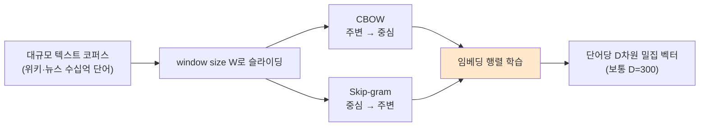
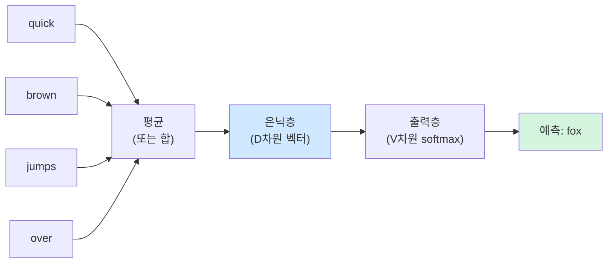
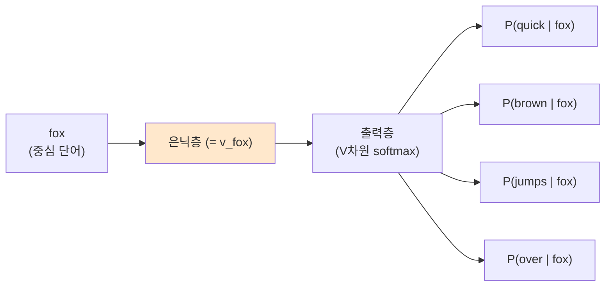
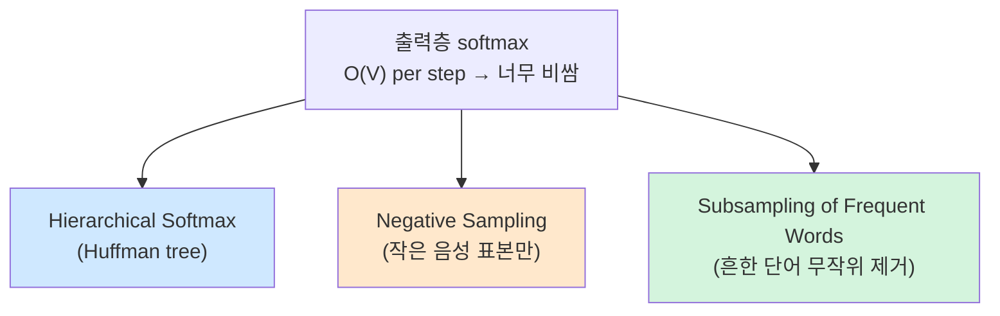
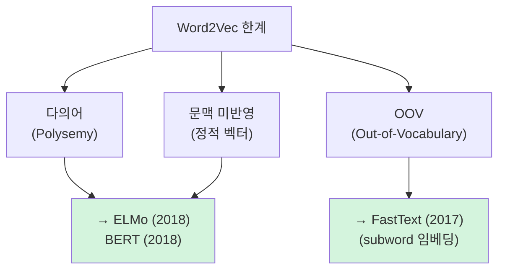

> **이 글의 목적**
>
> [NLP ①](/ai/nlp-01-word-representations/)에서 *통계 기반 표현* 의 한계와 *분포 가설* 까지 정리했다. 이번 편은 그 가설을 처음으로 *실용적 수준* 으로 끌어올린 **Word2Vec** (Mikolov et al., 2013)을 깊게 파본다.
>
> Word2Vec 한 편의 논문이 NLP 전체 흐름을 바꿨다. *king − man + woman ≈ queen* 같은 *의미 산술 연산* 이 가능해졌고, 이후 모든 임베딩·언어모델의 출발점이 됐다.
>
> 정리는 *Mikolov et al. (2013ab)*[^1][^2]의 두 원전 논문과 *Levy & Goldberg (2014)*[^3]의 PMI 연결 분석을 토대로, *Jurafsky & Martin*의 *SLP* Ch.6[^4]를 참조했다.
>
> **읽고 나면 답할 수 있는 질문**:
>
> - **CBOW**와 **Skip-gram** 의 *학습 방향* 이 어떻게 정반대인가
> - 왜 보통 **Skip-gram이 더 좋은 임베딩** 을 만든다고 보는가
> - 어휘가 수십만이면 매 step마다 *V차원 softmax* 는 너무 비싼데, 어떻게 학습이 가능했나
> - **Negative Sampling**의 핵심 식과 직관
> - **Hierarchical Softmax**가 *허프만 트리* 를 쓰는 이유
> - *king − man + woman ≈ queen* 은 *왜* 가능한가
> - Word2Vec의 *치명적 한계 3가지* — 다의어·문맥·OOV
> - 후속 기법(**GloVe·FastText·ELMo**)이 무엇을 보완했나

---

## 1. Word2Vec — *분포 가설* 을 학습 가능한 식으로

### 1.1 출발점

> Mikolov, T., Chen, K., Corrado, G., & Dean, J. (2013). *Efficient Estimation of Word Representations in Vector Space*.[^1]

[NLP ①](/ai/nlp-01-word-representations/) §6에서 본 *분포 가설* — *"같은 문맥에 등장하는 단어는 의미도 비슷하다"* — 을 어떻게 *컴퓨터가 자동으로 학습하게* 만들 수 있을까. Mikolov 등은 단순한 신경망 두 가지를 제안했다.



### 1.2 핵심 직관

> *"이 단어로 주변 단어를 예측할 수 있게 만들면, 단어 벡터에 의미가 자연스레 자리 잡는다."*

손실 함수가 *예측을 잘 못 하면* 단어 벡터를 조금씩 수정한다. 충분히 많은 문맥을 학습하면, *의미가 비슷한 단어들의 벡터가 서로 가까워진다*. 분포 가설이 *학습 알고리즘 안에* 구현된 것이다.

---

## 2. CBOW — *주변* 으로 *중심* 단어 예측하기

### 2.1 학습 셋업

문장: *"The quick brown fox jumps over the lazy dog"*. window size W=2 라면, 중심 단어 *fox* 의 학습 예시는:

> 입력 (주변): *quick · brown · jumps · over*
> 정답 (중심): *fox*



### 2.2 식

주변 단어들의 임베딩을 *평균* 내서 은닉 벡터를 만들고, 출력층에서 어휘 전체에 대해 softmax:

> **h = (1/2W) · Σ v_{wₖ}**   (주변 단어 임베딩 평균)
> **P(w_t | context) = exp(u_{w_t}ᵀ h) / Σ_v exp(u_vᵀ h)**

여기서 **v** 는 *입력 임베딩*, **u** 는 *출력 임베딩*. 두 임베딩 행렬을 동시에 학습한다.

### 2.3 특성

| 측면 | 설명 |
|---|---|
| **학습 속도** | 한 step에 *주변 단어 평균 → 1개 예측* — 빠름 |
| **빈도 단어 유리** | 평균이 *흔한 단어* 의 신호를 강화 |
| **drop-in** | 작은 코퍼스에서 안정 |

> 💡 직관: CBOW는 *문맥의 평균* 으로 중심을 맞춘다. 평균이 들어가니 *부드러운(smooth)* 표현. 흔한 단어에 강함.

---

## 3. Skip-gram — *중심* 으로 *주변* 단어 예측하기

### 3.1 방향이 정반대

CBOW의 *주변 → 중심* 을 뒤집어, **중심 → 주변** 을 예측한다.

> 입력 (중심): *fox*
> 정답 (주변 각각): *quick · brown · jumps · over*



### 3.2 식

중심 단어의 입력 임베딩을 그대로 은닉으로 쓰고, 윈도우 안의 각 주변 단어를 *독립적으로* 예측:

> **L = - Σ log P(w_{t+j} | w_t)** (j ≠ 0, |j| ≤ W)
> **P(w_o | w_t) = exp(u_{w_o}ᵀ v_{w_t}) / Σ_v exp(u_vᵀ v_{w_t})**

### 3.3 특성

| 측면 | 설명 |
|---|---|
| **학습 속도** | 한 중심에 대해 *2W번 예측* — CBOW보다 느림 |
| **희소 단어 유리** | 흔하지 않은 단어도 *중심* 으로서 학습 기회 균등 |
| **결과 품질** | 일반적으로 **임베딩 품질이 더 좋음** |

> 🎯 **시험·실무 포인트**: *"Skip-gram이 CBOW보다 더 좋은 임베딩을 만든다"* — 큰 코퍼스에서 일반적으로 참. 단, 학습 시간은 더 든다.

---

## 4. CBOW vs Skip-gram 한눈에

| 측면 | **CBOW** | **Skip-gram** |
|---|---|---|
| 방향 | 주변 → 중심 | 중심 → 주변 |
| 입력 | 여러 단어 평균 | 단일 단어 |
| 출력 | 1개 단어 | 2W개 단어 |
| 학습 속도 | 빠름 | 느림 |
| 작은 코퍼스 | 안정적 | 약함 |
| 큰 코퍼스 | OK | **더 우수** |
| 빈도 단어 | 유리 | 균등 |
| 희소 단어 | 약함 | **유리** |

> 🎯 **2023 7급 데이터직 25번** 함정: 문제 설명이 *"주변 단어로 중심 단어를 추론"* → **CBOW**. *"중심 단어로 주변 단어 추론"* → **Skip-gram**. 방향 헷갈리면 함정에 걸린다.

---

## 5. 핵심 학습 트릭 — *어떻게 V차원 softmax를 감당했나*

### 5.1 문제 — *Naïve softmax는 너무 비싸다*

어휘 V = 100,000 이라면 매 step마다 *V × D* 행렬 곱이 들어간다. 학습 데이터가 수십억 단어라면 사실상 학습 불가.

Mikolov 등이 두 가지 트릭으로 풀었다:



### 5.2 Hierarchical Softmax — 이진 트리로 V를 log V 로

어휘를 *허프만 트리(Huffman tree)* 로 만든 뒤, 단어 예측을 *루트에서 잎까지 이진 분기 결정* 으로 바꾼다. *흔한 단어일수록 트리 위쪽* 에 배치되므로 *log V* 번의 결정으로 끝난다.

> V = 100,000 → log₂(V) ≈ 17. *5,882배 빠름*.

### 5.3 Negative Sampling — *진짜 정답 + 무작위 가짜 K개* 만 비교

> Mikolov, T., et al. (2013). *Distributed Representations of Words and Phrases and their Compositionality*.[^2]

훨씬 단순하고 강력한 방법. 매 step에서:

1. **진짜 (positive) 쌍**: *(중심, 진짜 주변)*
2. **가짜 (negative) 쌍**: *(중심, 무작위로 뽑은 단어)* K개

이 *K+1개 쌍에 대해서만* 시그모이드 분류 학습. 보통 K=5~20.

#### 손실 함수

> **L = -log σ(u_oᵀ v_c) - Σᵏᵢ₌₁ log σ(-u_{nᵢ}ᵀ v_c)**

| 항 | 의미 |
|---|---|
| `-log σ(u_oᵀ v_c)` | 진짜 주변 단어와 *내적이 크게* (양수 시그모이드) |
| `-log σ(-u_{nᵢ}ᵀ v_c)` | 가짜 단어와 *내적이 작게* (음수 시그모이드) |

> 💡 *"진짜 주변과는 가깝게, 무작위 단어와는 멀어지게"* 가 한 줄 요약.

#### 음성 단어 샘플링 분포

균등 분포가 아니라 *unigram 분포의 3/4 제곱* 을 쓴다:

> **P(w) ∝ count(w)^(3/4)**

흔한 단어를 *살짝* 줄이고 희소 단어를 *살짝* 살리는 트릭. 경험적으로 가장 잘 작동.

### 5.4 Subsampling of Frequent Words

*the · is · in* 같은 *너무 흔한 단어* 는 매번 학습에 등장해서 시간만 잡아먹는다. 학습 시 다음 확률로 *제거*:

> **P(discard | w) = 1 − √(t / f(w))**, t는 임곗값(보통 1e-5), f(w)는 단어 빈도

흔한 단어일수록 자주 버려져 *희소 단어에 더 많은 학습 기회* 를 준다.

---

## 6. 의미가 *벡터 산술* 이 되는 순간


### 6.1 가장 유명한 실험

> **vec(king) - vec(man) + vec(woman) ≈ vec(queen)**

Mikolov 등이 *Skip-gram + Negative Sampling* 으로 학습한 임베딩에서 발견한 결과. 다음 단어가 *벡터 공간상 가장 가까운 점* 이 *queen* 이었다.

### 6.2 더 많은 예시

| 산술 | 결과 |
|---|---|
| Paris − France + Italy | **Rome** |
| Tokyo − Japan + Russia | **Moscow** |
| big − bigger + smaller | **small** |
| swim − swimming + flying | **fly** |
| Microsoft − Windows + iOS | **Apple** |

### 6.3 왜 가능한가

분포 가설을 학습 신호로 쓰면, *유사한 문맥에 등장하는 단어들* 이 *비슷한 벡터* 가 되는 건 자연스럽다. 그런데 *더 강한 결과* — *관계까지 평행 이동으로 표현* 된다는 점 — 은 별도의 발견이다.

직관:
- *king* 과 *man* 의 차이 = *왕족성(royalty)* 방향
- *woman* 에 그 방향을 더하면 *queen*

#### Levy & Goldberg(2014)의 분석

> Levy, O., & Goldberg, Y. (2014). *Neural Word Embedding as Implicit Matrix Factorization*.[^3]

Skip-gram + Negative Sampling은 *암묵적으로 PMI(Pointwise Mutual Information) 행렬을 분해* 한 것과 *수학적으로 동치* 임을 증명. 의미 연산이 가능한 이유가 *PMI의 평행 이동 구조* 에서 나옴을 밝혔다.

> 🎯 학술적으로는 이 논문이 *왜 vec(king) - vec(man) + vec(woman) ≈ vec(queen)* 이 가능한지에 대한 *수학적 답* 을 제시한 결정적 결과.

---

## 7. Word2Vec의 한계 — *정적 벡터* 의 천장

### 7.1 다의어(Polysemy) 문제

```text
은행에 갔다 (bank, 금융기관)
강 은행을 따라 걸었다 (bank, 강가)
```

두 *bank* 는 의미가 다른데 Word2Vec은 *하나의 벡터* 만 부여한다. 결과적으로 *애매한 평균* 벡터가 만들어짐.

### 7.2 문맥 미반영

같은 단어는 *어느 문장에서 등장하든* 항상 같은 벡터. 문맥에 따른 *동적 의미 변화* 표현 불가.

> 💡 이 한계를 푼 것이 *ELMo (2018)*, *BERT (2018)*, *GPT (2018)* 등 **문맥 임베딩(Contextual Embedding)**. 시리즈 ⑤편에서 다룸.

### 7.3 OOV (Out-of-Vocabulary)

학습 중에 못 본 단어는 벡터가 *없다*. 신조어·고유명사·오타에 취약.

> 💡 이 한계를 푼 것이 *FastText (2017)*. 단어를 *subword(글자 n-gram)* 로 쪼개 임베딩 → OOV 단어도 subword 조합으로 표현 가능.

### 7.4 한계 정리



---

## 8. 후속 기법들 — *Word2Vec 직후 5년*

### 8.1 GloVe (2014)

> Pennington, J., Socher, R., & Manning, C. D. (2014). *GloVe: Global Vectors for Word Representation*.[^5]

Word2Vec이 *지역 윈도우* 의 통계를 학습한다면, GloVe는 *전역 동시 등장 행렬(global co-occurrence matrix)* 을 직접 분해한다.

| 측면 | Word2Vec | GloVe |
|---|---|---|
| 학습 신호 | 지역 윈도우 | 전역 동시 등장 행렬 |
| 손실 함수 | 음의 로그 우도 | 가중 최소제곱 |
| 결과 품질 | 비슷 | 비슷 (벤치마크에 따라 갈림) |

성능은 거의 비슷하나, 둘 다 *분포 가설 → 분산 표현* 의 같은 사상을 다른 수학으로 구현한 것.

### 8.2 FastText (2017)

> Bojanowski, P., Grave, E., Joulin, A., & Mikolov, T. (2017). *Enriching Word Vectors with Subword Information*.[^6]

단어를 *글자 n-gram* (subword) 의 합으로 표현.

> *"playing"* → *"<pl", "pla", "lay", "ayi", "yin", "ing", "ng>"*

장점:
- **OOV 해결** — 못 본 단어도 subword 조합으로 표현
- **형태소 풍부 언어** (한국어·터키어·핀란드어)에 강함

### 8.3 ELMo (2018) — *문맥 임베딩의 등장*

> Peters, M. E., et al. (2018). *Deep Contextualized Word Representations*.

Bi-LSTM으로 *문장을 통째로 보고* 단어 벡터를 만듦. 같은 단어라도 *문맥에 따라 다른 벡터* — 다의어 문제 해결.

> 💡 ELMo가 BERT·GPT 시대의 다리 역할. 시리즈 ⑤편에서 본격 다룸.

---

## 9. 정리

이 글에서 다룬 내용을 한 줄로 압축하면:

- **Word2Vec**은 *분포 가설* 을 *학습 가능한 신경망* 으로 구현한 첫 실용적 시도
- **CBOW**(주변 → 중심) vs **Skip-gram**(중심 → 주변) — Skip-gram이 일반적으로 더 좋은 임베딩
- **Negative Sampling** + **Hierarchical Softmax** + **Subsampling** 으로 V차원 softmax의 비용을 감당
- *vec(king) − vec(man) + vec(woman) ≈ vec(queen)* — 의미가 *벡터 산술* 이 되는 결과는 PMI 행렬 분해와 *수학적으로 동치* (Levy & Goldberg 2014)
- 한계 3가지 — **다의어·문맥 미반영·OOV** → ELMo·BERT·FastText로 보완
- 다음 편 [NLP ③] 에서는 *기계 번역의 한계* 를 푸는 **Seq2Seq + Attention** 으로 넘어간다

---

## 10. 추가로 공부하면 좋을 개념

- **Pointwise Mutual Information (PMI)**: *PMI(w, c) = log [P(w,c) / (P(w)·P(c))]*. Word2Vec과 *수학적으로 연결* 되는 정보 이론적 지표
- **Negative Sampling의 K 선택**: 작은 데이터엔 K=5~20, 큰 데이터엔 K=2~5 정도가 경험적 표준 (Mikolov 2013b)
- **GloVe vs Word2Vec 차이의 본질**: 손실 함수만 다를 뿐, *결국 동시 등장 행렬을 분해* 하는 같은 사상 (Levy & Goldberg 2014)
- **Skip-gram with Negative Sampling이 SVD와 같다는 결과** — 위 Levy & Goldberg 논문의 핵심
- **doc2vec / sent2vec**: 문장·문서 단위 임베딩. Word2Vec의 직접 확장 (Le & Mikolov 2014)
- **다국어 임베딩 (Multilingual Word Embeddings)**: 언어 간 정렬된 벡터 공간 — 기계 번역의 토대 (Conneau 2017)

> ✍️ **다음 학습**: [NLP ③] Seq2Seq + Attention — 기계 번역의 한계와 Bahdanau Attention. 작성 예정.

---

## 참고 문헌 (References)

[^1]: Mikolov, T., Chen, K., Corrado, G., & Dean, J. (2013). "Efficient Estimation of Word Representations in Vector Space." *arXiv:1301.3781*.

[^2]: Mikolov, T., Sutskever, I., Chen, K., Corrado, G. S., & Dean, J. (2013). "Distributed Representations of Words and Phrases and their Compositionality." *NeurIPS 2013*. *arXiv:1310.4546*.

[^3]: Levy, O., & Goldberg, Y. (2014). "Neural Word Embedding as Implicit Matrix Factorization." *NeurIPS 2014*.

[^4]: Jurafsky, D., & Martin, J. H. (2024). *Speech and Language Processing* (3rd ed. draft), Ch. 6 (Vector Semantics). <https://web.stanford.edu/~jurafsky/slp3/>

[^5]: Pennington, J., Socher, R., & Manning, C. D. (2014). "GloVe: Global Vectors for Word Representation." *EMNLP 2014*.

[^6]: Bojanowski, P., Grave, E., Joulin, A., & Mikolov, T. (2017). "Enriching Word Vectors with Subword Information." *TACL*, 5, 135–146.

---

## 부록 A. 이미지 생성 프롬프트

> 본 글은 Mermaid 차트 위주라 별도 이미지가 필수는 아니지만, 시리즈 통일성을 위한 두 장은 두면 좋다.

### A1. CBOW vs Skip-gram 구조 비교 (`word2vec_cbow_skipgram.png`)

> 📁 저장 경로: `/assets/images/nlp/word2vec_cbow_skipgram.png`

```
Two-panel side-by-side comparison illustration of Word2Vec architectures.
Left panel "CBOW": four small input word boxes around a central position
all pointing inward with arrows, merging into a single hidden vector,
which then projects to a single output predicting the center word.
Right panel "Skip-gram": a single center word at the input, projecting
to a hidden vector, which then fans out to predict four surrounding
context words. Both panels share consistent style with input/hidden/
output layer labels. Modern educational illustration, soft pastel
palette (sky blue, warm beige, charcoal accents). Clean white background.
Vector flat design. 16:9.

CRITICAL: 이미지 내 모든 문자/라벨은 반드시 한글로 표시. 영문 텍스트 금지
(단, 모델명 CBOW, Skip-gram과 예시 단어 fox, quick, brown, jumps, over는 영문 그대로 유지).
라벨:
- 좌측 패널 제목: "CBOW — 주변 → 중심"
- 좌측 패널 입력 영역: "주변 단어 (window size W)"
- 좌측 패널 가운데: "은닉 벡터 (평균)"
- 좌측 패널 출력: "중심 단어 예측"
- 우측 패널 제목: "Skip-gram — 중심 → 주변"
- 우측 패널 입력: "중심 단어"
- 우측 패널 가운데: "은닉 벡터 (= v_center)"
- 우측 패널 출력 영역: "주변 단어들 (각각 독립 예측)"
- 하단 가운데: "Word2Vec 두 가지 학습 방식"
```

### A2. 의미 산술 연산 시각화 (`word2vec_analogy.png`)

> 📁 저장 경로: `/assets/images/nlp/word2vec_analogy.png`

```
3D scatter plot illustration of word embedding space showing semantic
arithmetic. Four labeled vectors (king, queen, man, woman) plotted as
points in a 3D coordinate system, with parallel arrows demonstrating:
arrow from "man" to "king" (gender → royalty direction) and a parallel
arrow from "woman" to "queen". A dashed line shows the vector arithmetic
king − man + woman ≈ queen. Additional analogy pairs (Paris-France,
Rome-Italy) shown as fainter parallel arrows in the background.
Clean 3D infographic style, soft gradient background (light blue to
white), modern educational illustration. 16:9.

CRITICAL: 이미지 내 모든 문자/라벨은 반드시 한글로 표시. 영문 텍스트 금지
(단, 단어 예시 king, queen, man, woman, Paris, France, Rome, Italy와
수학 기호 vec(), +, −, ≈는 그대로 유지).
라벨:
- 가운데 큰 화살표 식: "vec(king) − vec(man) + vec(woman) ≈ vec(queen)"
- 평행 화살표 라벨: "성별 → 왕족성 방향"
- 배경 흐릿한 화살표: "수도 ↔ 국가 관계"
- 하단 가운데: "의미가 벡터 산술이 되는 순간 (Mikolov 2013)"
- 좌측 상단 부제: "분산 표현 임베딩 공간"
```

> 💡 위 프롬프트는 모두 본문 텍스트에 의존하지 않는 자기 완결형 이미지를 만들도록 작성됐다.
