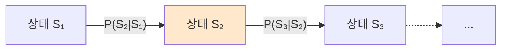
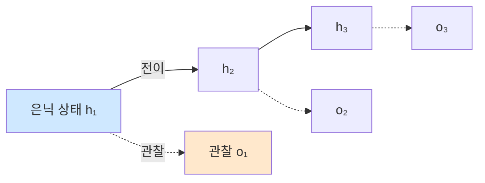
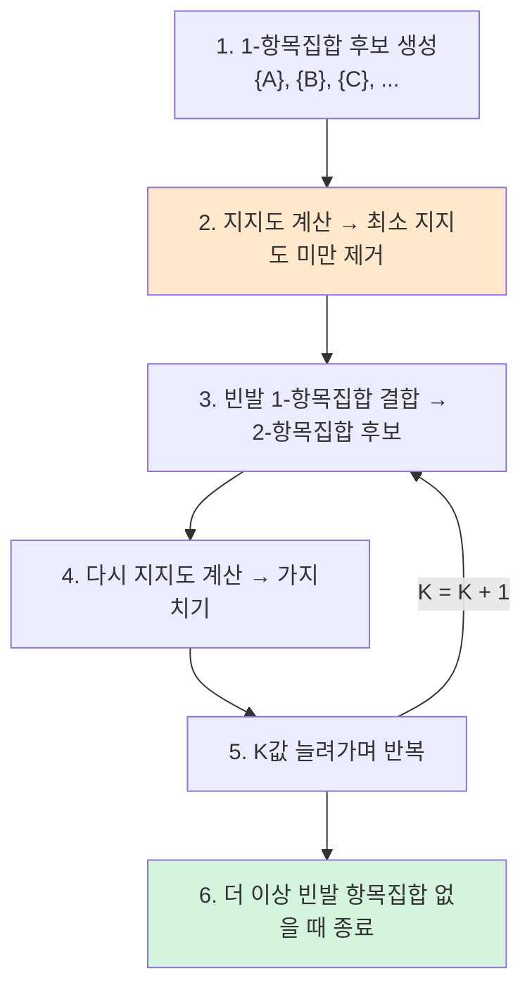
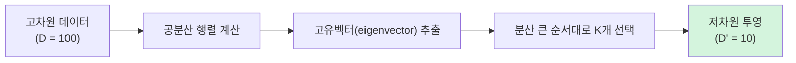
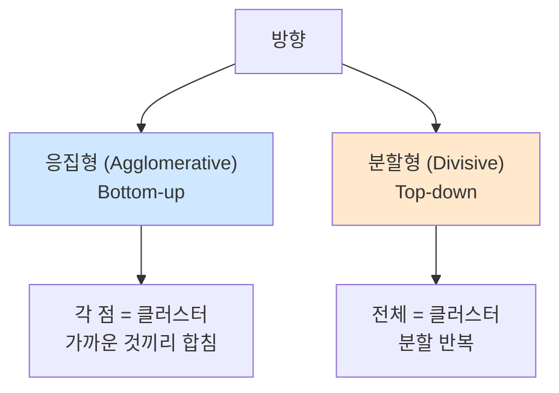
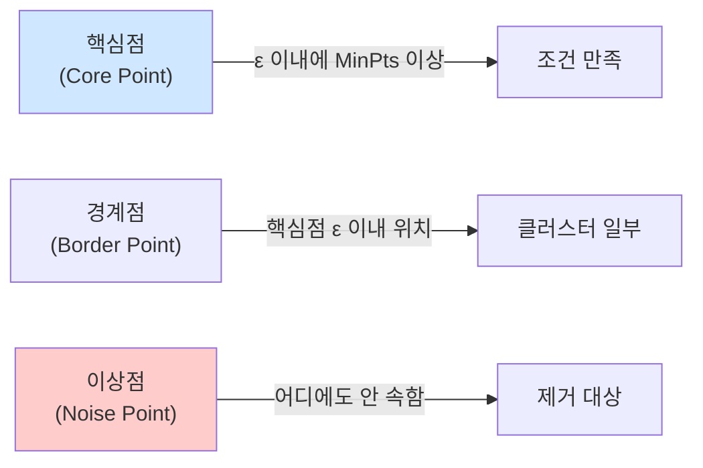
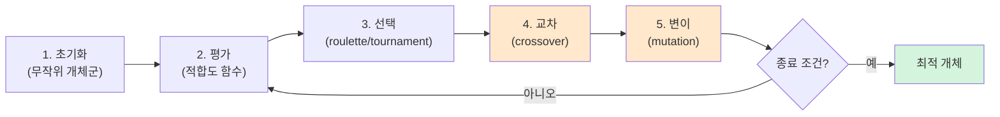
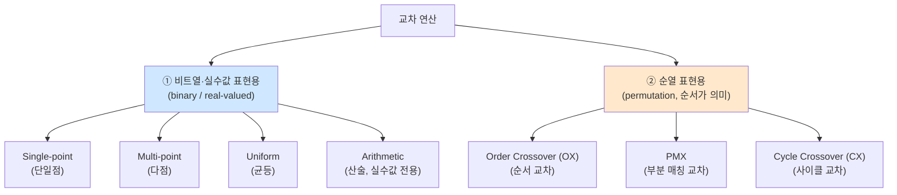
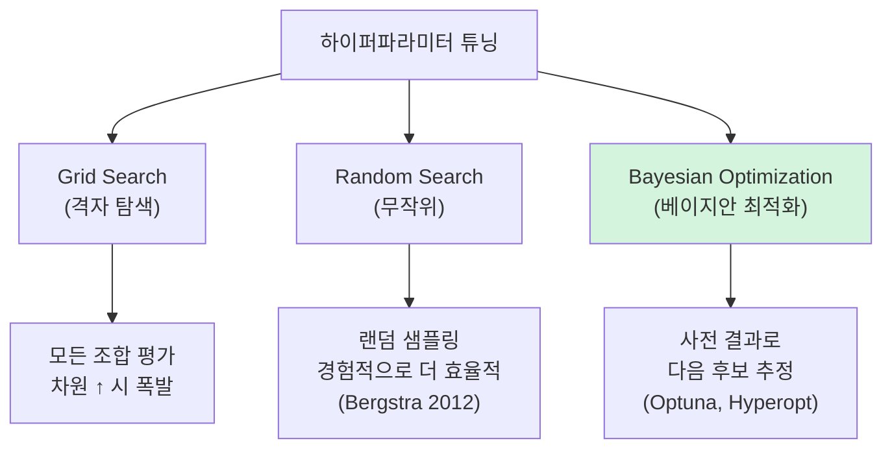
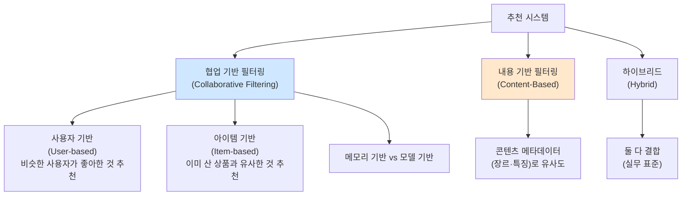

> **이 글의 목적**
>
> [AI 심화 ①~⑤](/ai/ai-advanced-ml-algorithms/) 가 *분류·신경망·CNN·RNN·고전 AI* 였다면, 이번 편은 *7급 데이터직 인공지능 교재의 통째 누락 영역* — **마르코프·Apriori·PCA·계층적 군집·유전 알고리즘·추천 시스템·메타학습·품사 태깅** — 을 한 글로 압축한다.
>
> 이 영역은 **2025년 7급 시험에서 갑자기 4문항(16%) 출제** 된 *최신 출제 경향*. 2023년엔 1문항, 2024년엔 0문항이었다가 폭발적으로 증가했다. 7급 데이터직 인공지능 교재의 *Ch 9·12·13·20* 에 정확히 매핑되고, 그동안 우리 시리즈에서 *부분적으로만* 다뤄졌던 영역을 모두 끌어모은 *압축편*.
>
> 정리는 **Agrawal & Srikant 1994**[^1] (Apriori), **Pearson 1901**[^2] (PCA), **Ester et al. 1996**[^3] (DBSCAN), **Holland 1975**[^4] (유전 알고리즘) 등 원전과 *AIMA*[^5] Ch.20·22를 토대로 했다.
>
> **읽고 나면 답할 수 있는 질문**:
>
> - **마르코프 체인 전이 확률** 표 계산 (2023-8 직출 예제)
> - **연관 규칙** 의 *지지도 / 신뢰도 / 향상도* — 정확한 식과 *2025-25 함정*
> - **Apriori 알고리즘** 의 *반단조성* 핵심과 단계별 흐름
> - **PCA 주성분 분석** — 분산이 큰 방향, 고유벡터 — 와 t-SNE / LDA 비교
> - **계층적 군집화** vs K-means — *K값 지정 불필요* 와 덴드로그램
> - **DBSCAN + 밀도추정** — 이상치 탐지가 자연스러운 이유
> - **유전 알고리즘** 5단계와 *2024-25 단순 교차* 비트 풀이
> - **메타 학습** vs 강화학습 vs 표현학습 — 정확한 정의 차이 (2025-15)
> - **하이퍼파라미터 vs 파라미터** + 튜닝 방법 (Grid·Random·Bayesian)
> - **협업 기반 vs 내용 기반 추천** — 콜드 스타트는 *어느 쪽* 의 문제인가 (2025-7 함정)
> - **품사 태깅(POS tagging)** — HMM 응용 (2025-24)

---

## 1. 마르코프 체인 + HMM + 품사 태깅

### 1.1 마르코프 가정

> *"미래 상태는 현재 상태에만 의존한다 (과거는 잊어도 됨)."*



수식으로:
> **P(Sₜ₊₁ | S₁, S₂, ..., Sₜ) = P(Sₜ₊₁ | Sₜ)**

### 1.2 전이 확률 행렬

각 상태에서 *다른 상태로 넘어갈 확률* 을 표로 정리한 것.

#### 시험 직출 (2023-8) ★★★

날씨 전이 확률 행렬:

| 오늘 \ 내일 | 맑음 | 흐림 |
|---|---|---|
| **맑음** | 0.8 | 0.2 |
| **흐림** | 0.3 | 0.7 |

> 오늘 맑음일 때, *내일 흐리고 모레도 흐릴 확률* 은?

**Step 1.** 내일 흐릴 확률 = P(흐림 | 맑음) = **0.2**
**Step 2.** 모레 흐릴 확률 = P(흐림 | 흐림) = **0.7**
**Step 3.** 결합 확률 = 0.2 × 0.7 = **0.14**

→ **정답 ② (0.14)**

> 💡 마르코프 체인 *문제 풀이의 핵심* 은 *각 단계 확률을 곱하는 것*.

### 1.3 HMM (Hidden Markov Model)

마르코프 체인 + *관찰 가능한 출력*. 상태는 *숨어 있고* 출력만 관찰됨.



응용:
- **음성 인식**: 음소(은닉) → 음성 신호(관찰)
- **품사 태깅**: 품사(은닉) → 단어(관찰)

### 1.4 품사 태깅 (POS Tagging) — 2025-24 출제 ★

> *"문장의 각 단어에 품사의 범주 및 문법적 기능에 대한 태그를 붙이는 작업."*

```text
"나는 학교에 간다"
  ↓ 품사 태깅
"나/대명사 는/조사 학교/명사 에/조사 간다/동사"
```

#### 핵심 개념

- **말뭉치(Corpus)**: 컴퓨터가 읽을 수 있는 형태로 모은 텍스트 데이터
- **규칙 기반 태깅**: 언어학적 규칙으로 수작업 (정확도 ↓)
- **통계 기반 태깅**: HMM·CRF (사전 학습된 코퍼스 기반)
- **딥러닝 기반 태깅**: BERT 같은 사전학습 모델 (현재 표준)

> ⚠️ **시험 함정 (2025-24 ①)**: *"구문에 따라 주어진 문장에서 단어들의 역할을 파악하여 계층적인 트리 구조로 변환한다"* → **거짓**. 그건 *구문 분석(syntactic parsing)*. POS 태깅은 *각 단어에 품사 태그* 만 부착.

---

## 2. 연관 규칙 분석 + Apriori 알고리즘

### 2.1 등장 배경

> *"맥주를 산 사람이 기저귀도 산다"* — 1990년대 월마트 전설.

대규모 거래 데이터에서 *항목 간 함께 등장하는 패턴* 을 찾는 분야가 **연관 규칙 마이닝(Association Rule Mining)**.

### 2.2 3대 핵심 지표 — *시험 단골*

| 지표 | 식 | 의미 |
|---|---|---|
| **지지도(Support)** | P(X ∩ Y) = (X와 Y 함께 나타난 거래 수) / 전체 거래 수 | *전체 중 빈도* |
| **신뢰도(Confidence)** | P(Y | X) = (X와 Y 함께 거래) / (X 거래 수) | *X를 산 사람 중 Y도 산 비율* |
| **향상도(Lift)** | P(Y|X) / P(Y) = 신뢰도 / P(Y) | *우연 대비 얼마나 강한 연관* |

#### 향상도 해석

| Lift 값 | 의미 |
|---|---|
| **= 1** | X와 Y는 *독립* (우연한 등장과 같음) |
| **> 1** | *양의 연관* (함께 등장 경향) |
| **< 1** | *음의 연관* (서로 배제 경향) |

### 2.3 시험 함정 — 정의 정확히 (2025-25) ★★★

> ㄱ. *"향상도가 1.0보다 크면, 항목집합 사이의 연관성 정도와 유용성이 높다는 것을 의미한다"* → **참** ✓
> ㄴ. *"신뢰도는 전체 거래 건수 대비 항목집합 X와 Y를 모두 포함하는 거래 건수의 비율이다"* → **거짓** ✗ (이건 *지지도*. 신뢰도는 *X 거래 중 Y 비율*)
> ㄷ. *"지지도는 항목집합 X를 포함하는 거래 중에서 Y도 포함하는 거래 건수의 비율이다"* → **거짓** ✗ (이건 *신뢰도*. 지지도는 *전체 중 X∩Y 비율*)
> ㄹ. *"트랜잭션에서 어프라이어리(Apriori) 알고리즘으로 빈발 항목집합들을 찾은 다음, 이들로부터 연관 규칙을 만든다"* → **참** ✓

→ **정답 ② (ㄱ, ㄹ)**

> 💡 *지지도와 신뢰도 식이 거꾸로* 적힌 함정. **분모가 무엇인지** 확인:
> - 지지도: 분모 = **전체 거래 수**
> - 신뢰도: 분모 = **X 거래 수**

### 2.4 Apriori 알고리즘 — 빈발 항목집합 찾기

> Agrawal, R., & Srikant, R. (1994). *Fast Algorithms for Mining Association Rules*.[^1]

#### 핵심 원리 — *반단조성(downward closure)*

> *"빈발 항목집합의 모든 부분집합도 빈발이다."*

역으로, *어떤 부분집합이 빈발하지 않으면* 그것을 포함하는 *상위 집합도 빈발하지 않다* → 가지치기 가능.

#### 단계별 흐름



#### 한계와 대안

- **단점**: 후보 항목집합이 *지수적* 으로 증가 → 메모리·연산 폭발
- **대안**: **FP-Growth** (Frequent Pattern Growth) — 트리 자료구조로 효율 ↑

---

## 3. 차원 축소 — PCA (Principal Component Analysis)

### 3.1 핵심 직관

> *"분산이 가장 큰 방향(주성분)을 찾아 데이터를 그 방향으로 투영하여 차원을 줄인다."*

> Pearson, K. (1901). *On lines and planes of closest fit to systems of points in space*. Philosophical Magazine.[^2]



### 3.2 차원의 저주(Curse of Dimensionality)

차원이 늘수록 *모든 점이 비슷한 거리* 가 되고, 학습에 필요한 데이터가 *지수적* 으로 증가. PCA가 이를 해결.

### 3.3 PCA 알고리즘 단계

1. **데이터 중심화**: 각 특성에서 평균을 뺌
2. **공분산 행렬 계산**: Σ = (1/n) XᵀX
3. **고유분해**: Σv = λv → 고유값 λ, 고유벡터 v
4. **K개 주성분 선택**: λ가 큰 순서대로 K개
5. **투영**: 원 데이터 × 주성분 행렬

### 3.4 PCA vs 다른 차원 축소

| 방법 | 핵심 | 특성 |
|---|---|---|
| **PCA** | 공분산 행렬 분해 (선형) | *분산 보존*, 빠름 |
| **t-SNE** | 확률적 이웃 임베딩 (비선형) | *시각화 특화*, 느림 |
| **LDA** | 클래스 분리 (선형, 지도학습) | 분류에 유리 |
| **UMAP** | 위상 보존 (비선형) | *t-SNE 대안*, 더 빠름 |
| **오토인코더** | 신경망 인코더-디코더 | 비선형, 데이터 많을 때 |

> 🎯 **시험 포인트 (강의계획서 최신 키워드)**: *"PCA = 분산이 큰 방향 = 공분산 행렬 고유벡터"*. t-SNE와 PCA의 *주된 차이는 선형/비선형 + 분산보존/이웃보존*.

---

## 4. 군집화 — 계층적 + DBSCAN + 밀도추정

### 4.1 K-means 한계

[AI 심화 ①](/ai/ai-advanced-ml-algorithms/) §3에서 본 K-means는:
- K값을 *사전에 정해야* 함
- 구형 클러스터만 잘 잡음
- 이상치에 민감

→ 다른 군집화 알고리즘이 필요한 이유.

### 4.2 계층적 군집화 (Hierarchical Clustering)

> *"K값 사전 지정 불필요. 군집을 *계층적* 으로 형성."*

#### 두 방향



#### 연결 방법(Linkage Methods)

| 방법 | 클러스터 거리 정의 |
|---|---|
| **Single (단일)** | 두 클러스터 *가장 가까운 두 점의 거리* |
| **Complete (완전)** | 두 클러스터 *가장 먼 두 점의 거리* |
| **Average (평균)** | 모든 쌍의 거리 평균 |
| **Centroid (중심)** | 두 클러스터 *중심점 사이 거리* |
| **Ward** | 합병 시 *분산 증가가 최소* 인 쌍 |

#### 덴드로그램 (Dendrogram)

군집 형성 과정을 *계층 트리* 로 시각화. *수직축 = 거리*, *수평선 자르는 위치* 에 따라 *원하는 K값* 으로 군집 결정.

```text
        ┌──────────┐         <- 자르는 위치 1 (K=2)
        │          │
     ┌──┴──┐    ┌──┴──┐      <- 자르는 위치 2 (K=4)
     │     │    │     │
     A     B    C     D
```

> 🎯 **계층적 vs K-means 차이 한 줄**: *K값 지정 여부 + 결과 시각화 방법(덴드로그램)*.

### 4.3 DBSCAN — 밀도 기반 군집

> Ester, M., Kriegel, H.-P., Sander, J., & Xu, X. (1996). *A density-based algorithm for discovering clusters in large spatial databases with noise*. KDD.[^3]

#### 핵심 아이디어

> *"밀도가 높은 영역을 클러스터, 밀도 낮은 점은 이상치(noise)로 본다."*

#### 두 파라미터

| 파라미터 | 의미 |
|---|---|
| **ε (epsilon)** | 이웃 판정 *반경* |
| **MinPts** | *핵심점* 으로 판정할 최소 이웃 수 |

#### 점의 3가지 분류



#### 장점

- **K값 지정 불필요**
- **임의 모양 클러스터 감지** (구형 외)
- **이상치 탐지가 자연스럽게**

### 4.4 밀도추정 (Density Estimation) — 2025-11

#### 두 큰 갈래

| 방법 | 핵심 |
|---|---|
| **KDE (Kernel Density Estimation)** | 각 데이터점 주위에 *커널* 을 놓고 합산 |
| **GMM (Gaussian Mixture Model)** | *여러 개의 가우시안 혼합* 으로 모델링 |

> 🎯 **시험 (2025-11 ①)**: *"군집화와 밀도추정 문제는 일반적으로 비지도 학습 방식을 사용한다"* → **참**.

---

## 5. 유전 알고리즘 (Genetic Algorithm)

### 5.1 자연 진화에서 영감

> Holland, J. H. (1975). *Adaptation in Natural and Artificial Systems*. MIT Press.[^4]

> *"적합한 개체가 살아남고, 교차·변이를 통해 다음 세대로 진화한다."*

### 5.2 5단계 절차 (시험 단골)



| 단계 | 역할 |
|---|---|
| **초기화** | 무작위 개체군 생성 |
| **평가** | 적합도 함수(fitness)로 각 개체 점수 |
| **선택** | 적합도 높은 개체를 *부모* 로 선택 |
| **교차(Crossover)** | 두 부모의 유전자 결합 |
| **변이(Mutation)** | 일부 유전자 무작위 변경 |

### 5.3 유전 알고리즘 = ? (2023-24)

> *"유전 알고리즘에서 수행되는 과정만을 모두 고르면?"*
>
> ㄱ. 가지치기(pruning) ✗ (결정트리)
> ㄴ. 교차(crossover) ✓
> ㄷ. 군집화(clustering) ✗ (비지도 학습)
> ㄹ. 변이(mutation) ✓
> ㅁ. 적합도 평가(evaluation) ✓

→ **정답 ③ (ㄴ, ㄹ, ㅁ)**

### 5.4 단순 교차 (Single-point Crossover) — 2024-25 직출 ★★★

부모 두 개체에서 *교차점(crossover point)* 정한 뒤 좌측은 부모1, 우측은 부모2(또는 반대).

```text
부모 1: 1 0 1 | 0 0 1 1 0
부모 2: 1 1 0 | 1 0 0 1 1
       ↑ 교차점 (3번째 다음)

자식 1 = 부모1 좌측 + 부모2 우측 = 1 0 1 1 0 0 1 1
자식 2 = 부모2 좌측 + 부모1 우측 = 1 1 0 0 0 1 1 0
```

> 🎯 **시험 (2024-25)** 함정: 교차점 위치를 정확히 보고, 좌우 부모를 *맞바꿔* 자식을 만들었는지 확인.

### 5.5 교차 연산의 종류 — 표현 방식에 따른 분류

단순 교차(Single-point)는 *비트열* 의 가장 단순한 변형. 실제로는 *유전자 표현 방식* 에 따라 적용 가능한 교차 연산이 다르다.



#### 비트열·실수값 교차 4종

##### ① 단일점 교차 (Single-point) — 위 §5.4 참조

> 교차점 *한 개* 정해 좌우 교환.

##### ② 다점 교차 (Multi-point)

> 교차점 *여러 개* 정해 *번갈아* 두 부모 유전자 사용.

```text
부모 1: 1 0 | 1 0 0 | 1 1 0
부모 2: 1 1 | 0 1 0 | 0 1 1
       ↑     ↑     ↑  교차점 2개

자식 1: 1 0 | 0 1 0 | 1 1 0   (부모1·부모2·부모1)
자식 2: 1 1 | 1 0 0 | 0 1 1
```

> 💡 단일점보다 *다양성* ↑. 일반적으로 **2점 교차** 가 자주 쓰임.

##### ③ 균등 교차 (Uniform)

> 각 위치마다 *50% 확률* 로 부모 1 또는 부모 2 유전자 선택.

```text
부모 1: 1 0 1 0 0 1 1 0
부모 2: 1 1 0 1 0 0 1 1
마스크: 0 1 0 0 1 1 0 1   (랜덤 마스크)

자식 1: 1 1 1 0 0 0 1 1   (마스크=0이면 부모1, 1이면 부모2)
자식 2: 1 0 0 1 0 1 1 0
```

> 💡 가장 *섞임이 강한* 교차. 다양성 ↑↑ 그러나 좋은 building block 파괴 위험.

##### ④ 산술 교차 (Arithmetic) — *실수값 전용*

> 두 부모의 *가중평균* 으로 자식 생성.

```text
부모 1 = (3.2, 5.1, 1.8)
부모 2 = (4.0, 2.3, 6.1)
α = 0.6 (가중치)

자식 1 = α·부모1 + (1-α)·부모2 = (3.52, 3.98, 3.52)
자식 2 = (1-α)·부모1 + α·부모2 = (3.68, 3.42, 4.38)
```

> 💡 *실수 최적화* (함수 최소화 등)에 자연스러움. 비트열엔 적용 불가.

#### 순열 교차 3종 — *순서가 의미 있는 문제* 용

> 외판원 문제(TSP), 시간표 문제, 작업 스케줄링처럼 *순열* (각 원소가 한 번씩만 등장)이 의미 있는 경우, 위 4종은 *중복·결손* 을 만들어 부적합. 순열 전용 교차가 필요.

##### ⑤ 순서 교차 (Order Crossover, OX)

> 부모 1의 *부분구간* 을 그대로 가져오고, *나머지 위치* 는 부모 2에서 *없는 원소를 차례로* 채움.

```text
부모 1: 1 2 3 | 4 5 6 7 | 8 9
부모 2: 5 7 4 | 9 1 3 6 | 2 8
              ↑──────↑   유지 구간

자식 1 부분 유지:  _ _ _ | 4 5 6 7 | _ _

부모 2의 순서대로 4,5,6,7을 제외한 나머지: 9, 1, 3, 2, 8
자식 1 완성:  9 1 3 | 4 5 6 7 | 2 8
```

##### ⑥ 부분 매칭 교차 (Partially Matched Crossover, PMX)

> 부모 1·부모 2의 *같은 부분구간* 을 *매칭 매핑* 으로 교환.

```text
부모 1: 1 2 3 | 4 5 6 7 | 8 9
부모 2: 5 7 4 | 9 1 3 6 | 2 8

부분 구간에서 매칭: 4↔9, 5↔1, 6↔3, 7↔6 → 정리하면 4↔9, 5↔1, 6↔3↔7

자식 1 (부모2 구간을 부모1 위치에): 1→5, 2→2... 매핑 적용
```

> 💡 OX가 *순서 보존*, PMX가 *위치 보존* 에 강함.

##### ⑦ 사이클 교차 (Cycle Crossover, CX)

> 부모 1·부모 2 간 *위치 사이클* 을 따라가며 부모 1의 일부와 부모 2의 일부를 합침.

```text
부모 1: 1 2 3 4 5 6 7 8 9
부모 2: 4 1 2 8 7 6 9 3 5

사이클: 위치 1의 1 → 부모2의 4 → 부모1의 4(위치 4) → 부모2의 8(위치 4) → 부모1의 8(위치 8) → 부모2의 3(위치 8) → 부모1의 3(위치 3) → 부모2의 2(위치 3) → 부모1의 2(위치 2) → 부모2의 1(위치 2) → 사이클 종료

자식 1 = 사이클 위치는 부모1, 나머지는 부모2:
        1 2 3 4 _ 6 _ 8 _   →   1 2 3 4 7 6 9 8 5
```

> 💡 *위치 정보를 가장 강하게 보존* 하는 교차. 자식이 *부모 둘 중 하나의 정확한 위치값* 만 가짐.

### 5.6 교차 연산 7종 한 표 ★★★

| 종류 | 표현 | 핵심 |
|---|---|---|
| **Single-point** | 비트·실수 | 한 점 기준 좌우 교환 |
| **Multi-point** | 비트·실수 | 여러 점 기준 번갈아 |
| **Uniform** | 비트·실수 | 위치별 50% 확률 |
| **Arithmetic** | **실수 전용** | 가중평균 |
| **OX (Order)** | 순열 | 부분구간 유지 + 나머지는 다른 부모 순서 |
| **PMX (Partially Matched)** | 순열 | 부분 매칭 교환 |
| **CX (Cycle)** | 순열 | 위치 사이클 따라 합침 |

> 🎯 **시험 포인트**: *"산술 교차는 비트열에 적용 가능"* → **거짓** (실수 전용). *"OX·PMX·CX는 모두 순열용"* → **참**.

### 5.7 응용

- **자율주행 경로 최적화**
- **시간표·스케줄 작성**
- **신경망 구조 탐색(NAS)**
- **공학 설계 최적화**

---

## 6. 메타 학습 + 하이퍼파라미터 튜닝

### 6.1 메타 학습 (Meta-Learning)

> *"학습하는 방법을 학습한다(Learning to Learn)."* — 2025-15 출제

다양한 작업에 대한 *공통 학습 전략* 을 추출 → 새 작업에 *적은 데이터로* 빠르게 적응.

#### 응용 분야

- **Few-shot Learning**: 몇 개 예시만으로 새 클래스 학습
- **MAML** (Model-Agnostic Meta-Learning, Finn 2017): 모델 종류 무관 메타학습 알고리즘

#### 시험 함정 (2025-15) — *유사 보기 비교*

| 보기 | 의미 |
|---|---|
| ① 연합 학습(Federated) | *분산 데이터* 로 협력 학습 |
| ② **메타 학습** | *학습 방법 학습* ← 정답 |
| ③ 강화 학습 | 보상으로 학습 |
| ④ 표현 학습 | 데이터의 *유용한 표현* 학습 |

### 6.2 하이퍼파라미터 vs 파라미터

| 측면 | 파라미터(Parameter) | 하이퍼파라미터(Hyperparameter) |
|---|---|---|
| 결정 방식 | **학습으로** 자동 결정 | **사람이** 사전에 정함 |
| 예 | 가중치 W, 편향 b | 학습률 η, K값, 트리 깊이, dropout rate |
| 변경 시점 | 매 학습 step | 학습 전 |

### 6.3 하이퍼파라미터 튜닝 방법



> 💡 **Bergstra & Bengio (2012)**[^6] 가 보인 결과: *Random Search가 Grid Search보다 일반적으로 더 효율적*. 차원이 높을수록 차이가 큼.

---

## 7. 추천 시스템 — 2025년 신규 출제 영역 ★★★

### 7.1 등장 배경

> Goldberg, D., Nichols, D., Oki, B. M., & Terry, D. (1992). *Using collaborative filtering to weave an information tapestry*. CACM, 35(12), 61–70.

전자상거래·OTT의 핵심 기술. *Netflix, Amazon, YouTube* 의 비즈니스 모델 자체를 떠받침.

### 7.2 두 큰 갈래



### 7.3 콜드 스타트 문제 (Cold Start) — *시험 핵심*

> *"신규 사용자나 신규 아이템에 대한 데이터가 없어 추천이 어려운 문제."*

| 콜드 스타트 유형 | 영향 |
|---|---|
| **신규 사용자** | 행동 데이터 없음 → 협업 필터링 ✗ |
| **신규 아이템** | 평점 없음 → 협업 필터링 ✗ |

> ⚠️ **시험 함정 (2025-7 ①)**: *"내용 기반 추천은 메모리 기반 방법과 모델 기반 방법이 있고 콜드 스타트 문제가 발생한다"* → **거짓**.
>
> *콜드 스타트는 협업 기반 필터링의 문제*. 내용 기반은 *콘텐츠 자체* 의 메타데이터로 추천하므로 신규 아이템도 *특징* 만 있으면 추천 가능.

### 7.4 평가 지표

| 지표 | 의미 |
|---|---|
| **Precision@K** | 추천 K개 중 실제 관심 비율 |
| **Recall@K** | 실제 관심 항목 중 추천된 비율 |
| **NDCG** | 추천 순서까지 고려한 품질 |
| **MAP** | 평균 정밀도 |

---

## 8. 데이터 불균형 추가 — Near-miss + Tomek Links

[AI 심화 ①](/ai/ai-advanced-ml-algorithms/) §7.3에서 본 *SMOTE(오버샘플링)* 의 **짝꿍** 인 *언더샘플링* 도 알아둘 것.

### 8.1 Near-miss 언더샘플링

> *"소수 클래스에 가까운 다수 샘플만 남긴다."*

3가지 변형:
- **NM-1**: *가장 가까운 K개* 소수 점과의 거리 최소
- **NM-2**: *가장 먼 K개* 소수 점과의 거리 최소
- **NM-3**: 각 소수 점의 가장 가까운 다수 K개 선택

### 8.2 Tomek Links

*두 클래스 사이* 가장 가까운 쌍을 *제거* → 결정 경계 정제.

### 8.3 SMOTE vs Near-miss 한 줄

| 기법 | 방향 |
|---|---|
| **SMOTE** | 소수 클래스 *합성* (오버샘플링) |
| **Near-miss** | 다수 클래스 *제거* (언더샘플링) |

---

## 9. 빅데이터 마이닝 정의 (보강) — 2025-14

### 9.1 정의

> *"정제되지 않은 대용량 데이터로부터 *암묵적·이전에 알려지지 않은·잠재적으로 유용한* 정보나 지식을 추출하는 체계적 과정."*

### 9.2 처리 흐름


### 9.3 시험 함정 (2025-14 ②)

> *"트랜잭션에서 항목 간의 불순도를 표현하기 위해 최소지지도와 최소신뢰도를 사용한다"* → **거짓**.

지지도/신뢰도는 *연관성* 측정이지 *불순도* 가 아니다. *불순도* 는 결정트리의 지니/엔트로피.

---

## 10. 헷갈리는 것 / 자주 묻는 질문

### Q1. *지지도와 신뢰도 차이가 자꾸 헷갈린다*

**분모로 외운다**:
- 지지도: 분모 = **전체 거래 수**
- 신뢰도: 분모 = **X 거래 수**
- 향상도: = 신뢰도 / P(Y) (1보다 크면 양의 연관)

### Q2. *PCA와 t-SNE 중 뭘 써야?*

- **차원을 많이 줄여 학습 입력으로**: PCA (선형, 빠름, 분산 보존)
- **2D/3D 시각화**: t-SNE 또는 UMAP (비선형, 이웃 보존)

### Q3. *계층적 군집화는 K-means보다 항상 좋은가*

**아니다**. 계층적은:
- 장점: K값 불필요, 결과 시각화 쉬움(덴드로그램)
- 단점: O(n³) — 큰 데이터에서 느림. K-means는 O(n)

### Q4. *DBSCAN의 ε 파라미터를 어떻게 정하나*

**k-distance plot** — 각 점의 K번째 이웃까지 거리를 정렬해 그래프로 그리고, *팔꿈치* 위치를 ε로.

### Q5. *유전 알고리즘의 변이율을 너무 높이면?*

*무작위 탐색* 에 가까워져 **수렴 안 됨**. 보통 0.001~0.05 정도.

### Q6. *콜드 스타트는 어느 추천 방식의 문제?*

**협업 기반**. 내용 기반은 콘텐츠 메타데이터만 있으면 OK.

### Q7. *메타 학습과 전이 학습의 차이?*

- **전이 학습(Transfer Learning)**: 사전학습 모델을 *새 도메인* 에 적용
- **메타 학습(Meta-Learning)**: *학습 방법 자체* 를 학습 → 새 작업에 빠른 적응

### Q8. *하이퍼파라미터 튜닝, Random Search가 Grid보다 좋은 이유?*

차원이 높을 때 *Grid는 모든 조합을 탐색* 하는데, 사실 *몇 개 차원만 중요* 한 경우가 많다. Random은 *각 차원에서 다양한 값* 을 시도하므로 *중요 차원의 좋은 값을 더 빨리 찾는다* (Bergstra 2012).

---

## 11. 시험 직전 1분 요약

> A4 한 장 압축본.

### 핵심 8개

1. **마르코프 체인** = 미래는 현재에만 의존. 전이 확률 *곱셈* 으로 계산
2. **연관 규칙 3지표**:
   - 지지도 = P(X∩Y), 분모 *전체 거래*
   - 신뢰도 = P(Y|X), 분모 *X 거래*
   - 향상도 = 신뢰도 / P(Y), >1이면 양의 연관
3. **Apriori** = 반단조성("빈발 항목집합의 부분집합도 빈발")으로 가지치기
4. **PCA** = 분산 큰 방향 = 공분산 행렬 *고유벡터*
5. **계층적 군집화** = K값 불필요, *덴드로그램* 으로 시각화. *DBSCAN* = 밀도 기반 + 이상치 탐지
6. **유전 알고리즘 5단계**: 초기화 → 평가(적합도) → 선택 → 교차 → 변이
7. **추천 시스템**: 협업 기반(사용자/아이템) vs 내용 기반. *콜드 스타트는 협업 기반 문제*
8. **메타 학습** = 학습 방법 학습 (≠ 전이 학습). **하이퍼파라미터** = 사람이 정함, **파라미터** = 학습으로 결정

### 자주 헷갈리는 한 마디

- *"지지도는 X 거래 중 Y 비율"* → **거짓 (그건 신뢰도)**
- *"향상도 = 1이면 강한 연관"* → **거짓 (>1이어야 양의 연관)**
- *"콜드 스타트는 내용 기반의 문제"* → **거짓 (협업 기반)**
- *"PCA는 비선형 차원 축소"* → **거짓 (선형, 비선형은 t-SNE/UMAP)**
- *"메타 학습 = 전이 학습"* → **거짓 (학습 방법 학습 ≠ 모델 재활용)**
- *"K-means와 계층적 군집은 모두 K 지정 필요"* → **거짓 (계층적은 불필요)**
- *"하이퍼파라미터는 학습으로 결정"* → **거짓 (사람이 정함)**

### 7급 데이터직 빈출 패턴 (이번 글 영역만)

| 빈출 유형 | 핵심 |
|---|---|
| 마르코프 전이 확률 | 단계별 확률 *곱셈* |
| 연관 규칙 정의 식 | 지지도 ↔ 신뢰도 ↔ 향상도 분모 정확 |
| Apriori 단계 식별 | 후보 → 지지도 → 가지치기 → 반복 |
| 유전 알고리즘 과정 | 교차·변이·적합도 (가지치기·군집화 ✗) |
| 단순 교차 비트 풀이 | 교차점 기준 좌우 부모 교환 |
| PCA 의미 | 분산 보존 + 차원 축소 |
| 추천 시스템 분류 | 협업 vs 내용. 콜드 스타트 = 협업 문제 |
| 메타 학습 정의 | 학습 방법 학습 |
| 품사 태깅 | 단어에 품사 태그 (구문 분석 ✗) |

---

## 12. 다음 학습

이로써 **AI 심화 시리즈 6편 완결**. KODIT 시험 직전엔 ⑤편 + ⑥편이 *마지막 점검* 자료.

- 📌 [알고리즘 ①~③] Big-O · 정렬 · 그래프 · DP — *알고리즘분석* 과목
- 📌 [AI시스템 ①~②] MLOps · AI 윤리 · EU AI Act
- 📌 [논술] KODIT 사업 키워드 정리

---

## 13. 참고 문헌 (References)

[^1]: Agrawal, R., & Srikant, R. (1994). Fast algorithms for mining association rules in large databases. *Proceedings of VLDB*, 487–499.

[^2]: Pearson, K. (1901). On lines and planes of closest fit to systems of points in space. *Philosophical Magazine*, 2(11), 559–572.

[^3]: Ester, M., Kriegel, H.-P., Sander, J., & Xu, X. (1996). A density-based algorithm for discovering clusters in large spatial databases with noise. *KDD*, 226–231.

[^4]: Holland, J. H. (1975). *Adaptation in Natural and Artificial Systems*. University of Michigan Press. (재출간: MIT Press 1992)

[^5]: Russell, S. J., & Norvig, P. (2020). *Artificial Intelligence: A Modern Approach* (4th ed.). Pearson. (Ch. 20 학습 모델, Ch. 22 강화학습 + 진화 알고리즘)

[^6]: Bergstra, J., & Bengio, Y. (2012). Random search for hyper-parameter optimization. *JMLR*, 13(1), 281–305.

### 보조 자료

- 7급 데이터직 인공지능 기출 (2023~2025) — 8번·24번(2023), 25번(2024), 7번·11번·14번·15번·24번·25번(2025)
- 7급 데이터직 인공지능 교재 (김강현 2026 지안에듀) Ch 9·12·13·20

---

## 부록 A: 이미지 생성 프롬프트

> 📁 이미지 프롬프트는 [`/prompts/2026-05-04-ai-advanced-data-mining.md`](/prompts/2026-05-04-ai-advanced-data-mining.md) 에 별도 정리되어 있다 (한글 라벨·파일명·저장 경로 명시).

> ✍️ **다음 학습**: KODIT 시험 대비 — 알고리즘분석 / 인공지능시스템 시리즈 작성 예정.
