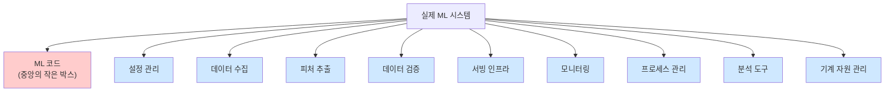
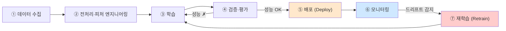
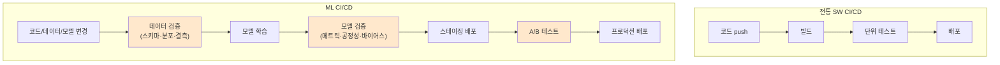
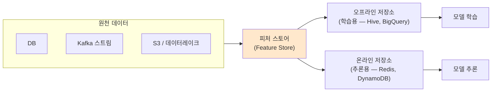
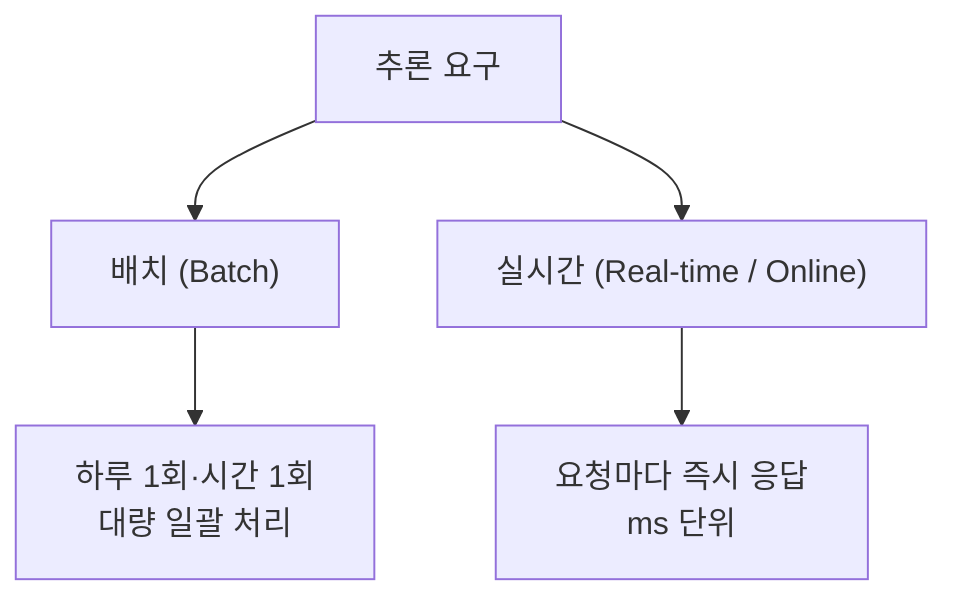
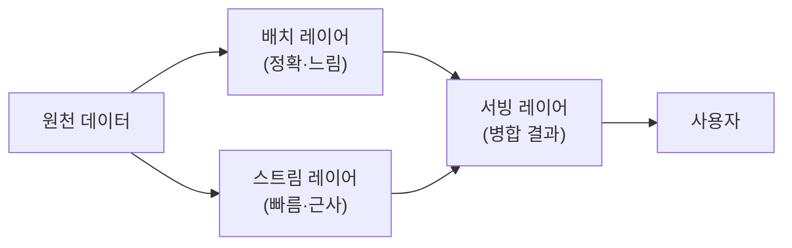
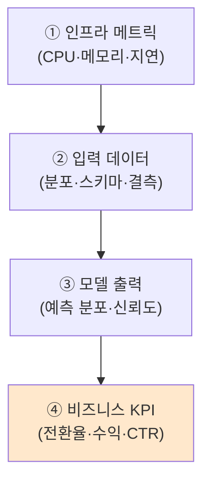
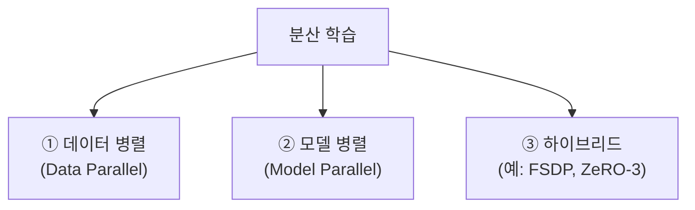
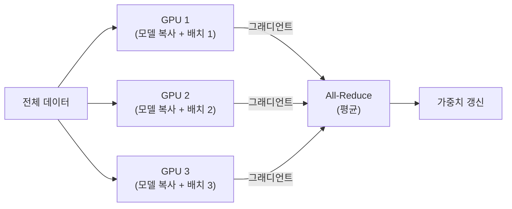
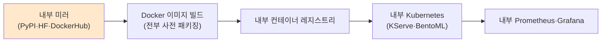

> **이 글의 목적**
>
> KODIT 인공지능시스템 과목 대비. *모델을 잘 만드는 것* 과 *모델을 운영 환경에서 *계속 잘 돌게 하는 것* 은 완전히 다른 문제다. 학습 시점의 정확도 95%가 *6개월 뒤에도 95%* 이려면 데이터 드리프트 감시·재학습 자동화·롤백·A/B 테스트가 모두 필요하다. 그게 *MLOps* 다.
>
> 이 글은 *Sculley et al. 2015 NeurIPS — Hidden Technical Debt in ML Systems*[^1], Google *Rules of ML*[^2], *Designing ML Systems* (Chip Huyen, 2022)[^3] 같은 표준 자료를 토대로 정리했다. 시험 비중은 ★ 한 개라 *30~40분 압축형* 이지만, 실무 측면에선 가장 가치 있는 영역.
>
> **읽고 나면 답할 수 있는 질문**:
>
> - **MLOps 가 DevOps 와 결정적으로 다른** 이유 — *3축 버전 관리(코드·데이터·모델)*
> - ML 라이프사이클의 *7단계* 와 각 단계에서 *무엇이 자동화* 되어야 하는가
> - **피처 스토어(Feature Store)** 가 왜 *학습-추론 일관성* 을 보장하는가
> - **배치 추론 vs 실시간 추론** 의 트레이드오프 — 언제 어느 쪽을 쓰는가
> - *모델 성능이 *시간이 지나면 떨어지는* 이유* — **데이터 드리프트** 와 **개념 드리프트**
> - **데이터 병렬 vs 모델 병렬** 분산 학습의 차이 (Ray, Horovod, FSDP)
> - 폐쇄망(On-premise) 환경에서의 ML 운영 — *클라우드와 무엇이 다른가*

---

## 1. ML 시스템은 일반 SW 시스템과 *다르다*

### 1.1 Hidden Technical Debt — Sculley 2015


Google 의 D. Sculley 등이 *NeurIPS 2015* 에서 발표한 [^1] *"Hidden Technical Debt in Machine Learning Systems"* 는 MLOps의 출발점이다. 핵심 주장 한 줄:

> *"실제 ML 시스템에서 ML 코드는 전체 시스템 코드의 *작은 부분(small fraction)* 이다. 나머지가 진짜 문제다."*



> 💡 모델 학습 코드는 100줄인데, *그 모델을 운영 환경에서 안정적으로 돌리는 인프라* 는 만 줄이 넘는다. 이걸 외면하면 *기술 부채(technical debt)* 가 쌓인다.

### 1.2 DevOps 와 다른 점 — *3축 버전 관리*

전통적 SW 는 *코드 한 축* 만 관리한다. ML은 **세 축** 이다.

| 축 | 무엇을 버전 관리하나 | 도구 |
|---|---|---|
| **코드(Code)** | 학습 스크립트, 전처리 로직 | Git |
| **데이터(Data)** | 학습 데이터셋, 피처 정의 | DVC, LakeFS, Pachyderm |
| **모델(Model)** | 학습된 가중치, 하이퍼파라미터 | MLflow, Weights & Biases |

> 🎯 시험 단골 차이: *"DevOps 의 핵심은 코드 버전 관리, MLOps는 코드+데이터+모델 3축"* — 한 줄.

### 1.3 왜 어려운가 — *재현성(Reproducibility)*

같은 코드 + 같은 데이터로 학습해도 *다른 결과* 가 나오는 일이 ML에선 흔하다. 이유:

| 비결정 요소 | 해결 |
|---|---|
| 무작위 시드 | `seed=42` 고정 |
| GPU 비결정 연산 | `torch.backends.cudnn.deterministic = True` |
| 데이터 순서 | DataLoader shuffle seed 고정 |
| 라이브러리 버전 | `requirements.txt` + Docker 컨테이너 |

> 💡 *재현 불가능한 모델은 디버깅도, 감사(audit)도 안 된다*. 이게 폐쇄망/금융권에서 MLOps가 *법적 요구사항* 이 되는 이유.

---

## 2. ML 라이프사이클 — 7단계


### 2.1 전체 흐름



### 2.2 단계별 자동화 포인트

| 단계 | 핵심 활동 | 자동화 |
|---|---|---|
| ① 수집 | 원천 데이터 적재, 라벨링 | Airflow DAG, Kafka |
| ② 전처리 | 결측치, 인코딩, 정규화, 피처 생성 | 피처 스토어 |
| ③ 학습 | 모델 fit, 하이퍼파라미터 튜닝 | Optuna, Ray Tune |
| ④ 검증 | 교차검증, 보류 셋(holdout) | MLflow 실험 추적 |
| ⑤ 배포 | 모델 패키징, 추론 서버 띄우기 | KServe, BentoML, Seldon |
| ⑥ 모니터링 | 입력 분포, 출력 품질, 응답 시간 | Prometheus + Grafana, Evidently |
| ⑦ 재학습 | 트리거 조건 충족 시 자동 재학습 | 스케줄(주간) 또는 드리프트 임계 |

### 2.3 *Continuous X* — 4가지 연속

전통 DevOps의 *CI/CD* (Continuous Integration / Delivery) 는 코드만 다룬다. MLOps에선 4 가지로 확장된다.

| 약어 | 의미 | ML에서의 역할 |
|---|---|---|
| **CI** | Continuous Integration | 코드 + *데이터 검증* + *피처 검증* 통합 |
| **CD** | Continuous Delivery | 모델 패키지 → 추론 서버 자동 배포 |
| **CT** | **Continuous Training** | 데이터 드리프트 감지 시 *자동 재학습* |
| **CM** | **Continuous Monitoring** | 운영 중 모델 성능 *상시 감시* |

> 🎯 **시험 직출**: *"MLOps 만의 고유 단계 두 가지"* → **CT(재학습)** + **CM(모니터링)**.

---

## 3. CI/CD for ML — 코드 빌드 그 이상

### 3.1 일반 CI/CD vs ML CI/CD



ML CI/CD에는 *데이터 검증* 과 *모델 검증* 단계가 추가된다. 이걸 빠뜨리면 *나쁜 데이터* 가 *나쁜 모델* 로, 그게 *프로덕션 사고* 로 직행.

### 3.2 데이터 검증 — TFDV 패턴

> Google *TensorFlow Data Validation (TFDV)* 의 핵심 아이디어. 학습 시 데이터의 *스키마와 분포 통계* 를 저장하고, *추론 시 입력이 그 스키마/분포에서 벗어나면 경고*.

```python
# 의사 코드
schema = generate_schema(train_data)
stats_train = compute_stats(train_data)

# 추론 시
stats_serve = compute_stats(serving_data)
anomalies = compare(stats_train, stats_serve)
if anomalies:
    alert("데이터 분포가 학습 시점과 다릅니다")
```

### 3.3 모델 검증 — 다단계

| 검증 종류 | 무엇을 보나 |
|---|---|
| **성능 (Performance)** | 정확도·F1·AUC가 *기준선 이상* 인가 |
| **편향(Bias)·공정성(Fairness)** | 집단별 성능 차이가 허용 범위인가 |
| **추론 지연(Latency)** | p50, p95, p99 응답 시간 |
| **메모리·자원** | OOM 없이 운영 가능한가 |
| **회귀(Regression)** | 이전 버전보다 *나빠지지 않았는가* |

---

## 4. 피처 스토어 (Feature Store) ★


### 4.1 왜 필요한가 — *학습-추론 일관성*

ML 시스템의 *가장 치명적 버그* 중 하나가 **학습-추론 스큐(Training-Serving Skew)** 다. 학습 시 사용한 피처 계산식과 추론 시 계산식이 *조금만 달라도* 모델이 망가진다.

> 예: 학습에선 *"최근 30일 평균 결제액"* 을 *오프라인 배치* 로 계산했는데, 추론에선 *실시간* 으로 계산하면서 *경계 조건이 달라* 값이 살짝 어긋남 → 정확도 폭락.

### 4.2 피처 스토어 구조



### 4.3 핵심 보장

| 보장 | 의미 |
|---|---|
| **일관성(Consistency)** | 학습 피처 = 추론 피처 (*같은 정의식*) |
| **재사용성(Reusability)** | 한 번 만든 피처를 여러 모델이 공유 |
| **시간 여행(Time Travel)** | *과거 시점의 피처 값* 을 정확히 재현 |
| **저지연(Low Latency)** | 온라인 추론 ms 단위 응답 |

### 4.4 도구

| 도구 | 특징 |
|---|---|
| **Feast** | 오픈소스, 가장 널리 쓰임 |
| **Tecton** | Feast 창시자가 만든 매니지드 |
| **AWS SageMaker Feature Store** | 클라우드 매니지드 |
| **Hopsworks** | 온프레미스 강점 |

---

## 5. 추론 패턴 — 배치 vs 실시간


### 5.1 두 갈래



### 5.2 비교표 ★

| 측면 | 배치 추론 | 실시간 추론 |
|---|---|---|
| **응답 시간** | 시간·일 단위 | **ms ~ 초 단위** |
| **처리량** | 매우 높음 (대량) | 요청당 |
| **인프라** | Spark, Airflow | KServe, FastAPI, Triton |
| **실패 비용** | 다음 배치에서 재시도 | 즉시 사용자 영향 |
| **예시** | 추천 사전 계산, 신용평가 야간 재계산 | 챗봇, 사기 탐지, 자율주행 |

### 5.3 하이브리드 — *Lambda Architecture*

> 배치로 *정확한 정기 결과* 를 만들고, 실시간 스트림으로 *최근 변화* 만 보정하는 패턴. 추천 시스템과 사기 탐지에 자주 쓰인다.



---

## 6. 모델 모니터링 — *시간이 지나면 떨어진다*


### 6.1 왜 모델은 *시간이 지나면* 성능이 떨어지나

두 가지 *드리프트(drift)* 가 원인이다.

| 드리프트 종류 | 정의 | 예시 |
|---|---|---|
| **데이터 드리프트 (Data Drift)** | *입력 분포 P(X)* 가 변함 | 사용자 연령대 변화, 신규 상품 도입 |
| **개념 드리프트 (Concept Drift)** | *입력 → 출력 관계 P(Y\|X)* 가 변함 | 코로나 이후 *"여행 = 고위험"* 정의가 바뀜 |
| **레이블 드리프트 (Label Drift)** | *출력 분포 P(Y)* 가 변함 | 이상 거래 비율이 1% → 5% 로 |

### 6.2 모니터링 4 계층



> 💡 *L4(비즈니스 KPI) 가 진짜 중요* 한데 *측정이 가장 어렵다*. 광고 클릭이 모델 때문인지 시즌 때문인지 분리가 까다로움 — 그래서 *A/B 테스트* 가 필수.

### 6.3 드리프트 감지 통계 기법

| 기법 | 무엇을 비교하나 |
|---|---|
| **PSI (Population Stability Index)** | 두 분포의 *상대 엔트로피* — 신용평가 표준 |
| **KS Test (Kolmogorov-Smirnov)** | 두 분포의 *최대 누적 분포 차이* |
| **Wasserstein Distance** | 두 분포 간 *이동 비용* |
| **Chi-Square Test** | 범주형 변수 분포 차이 |

> 🎯 **PSI 임계** (금융권 표준): < 0.1 안정 / 0.1~0.25 약한 변화 / > 0.25 *재학습 필요*.

### 6.4 A/B 테스트 vs 섀도우 배포


| 패턴 | 설명 | 위험 |
|---|---|---|
| **A/B 테스트** | 트래픽 일부(10%)를 새 모델로, 나머지는 기존 — 통계 유의성 확인 후 확대 | 사용자 일부에 영향 |
| **섀도우 배포(Shadow)** | 새 모델이 *모든 요청을 받지만 응답은 기존 모델* — 결과 비교만 | 영향 0, *서버 자원 2배* |
| **카나리 배포(Canary)** | 1% → 5% → 25% → 100% 점진 확대 | 안전, 시간 소요 |

---

## 7. 분산 학습 — *모델·데이터가 한 GPU에 안 들어갈 때* ★


### 7.1 두 갈래 + 하나



### 7.2 데이터 병렬 (Data Parallel) — 표준

> 같은 모델을 *모든 GPU 에 복사*. 각 GPU가 *서로 다른 미니배치* 로 학습하고, 그래디언트를 *all-reduce* 로 평균.



| 측면 | 결과 |
|---|---|
| 장점 | 구현 단순, *대부분의 경우 유효* |
| 단점 | 모델이 *한 GPU에 들어가야* 함 |
| 도구 | PyTorch DDP, Horovod (Uber 2018), Ray Train |

### 7.3 모델 병렬 (Model Parallel) — *모델이 너무 클 때*

> *모델 자체* 를 GPU 여럿에 *나눠서 배치*. LLM 학습에 필수.

| 종류 | 분할 방식 |
|---|---|
| **텐서 병렬(Tensor Parallel)** | 한 layer 내부의 *텐서* 를 분할 — Megatron-LM |
| **파이프라인 병렬(Pipeline Parallel)** | *층 단위* 로 분할, 마이크로배치로 흘림 — GPipe |
| **FSDP / ZeRO** | *옵티마이저 상태·그래디언트·파라미터* 까지 분할 |

### 7.4 도구 비교

| 도구 | 특징 | 적합 |
|---|---|---|
| **PyTorch DDP** | 표준 데이터 병렬 | 대부분의 경우 |
| **Horovod** | 프레임워크 비종속, *Ring AllReduce* | TF·PyTorch 혼재 |
| **Ray Train** | 분산 *학습 + 튜닝 + 서빙* 통합 | 멀티노드 클러스터 |
| **DeepSpeed (ZeRO)** | LLM 학습 최적화 | 70B+ 모델 |
| **FSDP** | PyTorch 네이티브, ZeRO 영감 | LLM 학습 (PyTorch only) |

> 💡 *Ray vs Horovod*: Ray는 *학습 + 튜닝 + 서빙 + RL* 까지 한 프레임워크. Horovod는 *학습 한 가지에 특화*. 멀티노드 자원 관리·잡 스케줄링까지 통합해야 한다면 Ray, 학습 코드만 분산하고 싶다면 Horovod가 단순.

---

## 8. 폐쇄망 (On-Premise) 환경에서의 ML 운영 — *클라우드와 무엇이 다른가*

> KODIT, 금융권, 공공기관은 *외부 인터넷 접속이 차단된* 폐쇄망 환경에서 운영해야 한다. 클라우드와는 결이 다른 문제들이 생긴다.

### 8.1 결정적 차이점

| 측면 | 클라우드 | 폐쇄망 |
|---|---|---|
| **모델 다운로드** | HuggingFace에서 즉시 | 내부 미러 서버 필요 |
| **라이브러리** | `pip install` | 사전 빌드된 wheel 묶음 |
| **GPU 자원** | 탄력적(스팟) | 고정 자원, 큐잉 시스템 |
| **모니터링** | DataDog, NewRelic | 자체 Prometheus·Grafana |
| **데이터 전송** | S3 → SageMaker | 내부 NFS·HDFS |
| **보안 감사** | 클라우드 로그 | *자체 감사 로그 보존* |

### 8.2 폐쇄망 운영의 핵심 패턴



> 💡 *폐쇄망 1번 규칙*: *"인터넷이 필요한 순간 = 시스템이 멈추는 순간"*. 모든 의존성을 *컨테이너 안에 다 넣어 사전 검증* 후 반입.

### 8.3 폐쇄망에서의 의사결정 패턴 (PAAR)

- **Problem**: 외부 인터넷 차단 + 모델 가중치는 *물리 매체로만* 반입 가능한 환경에서 ML 추론 시스템을 *지속 가능* 하게 운영해야 함.
- **Analyze**: 클라우드 매니지드 서비스(SageMaker·Vertex)는 외부 의존성 때문에 사용 ✗. 후보는 *오픈소스 + Docker + 내부 미러* 자체 구축. 분산 처리 프레임워크는 *Ray vs Spark vs Slurm* 가 후보 — *학습/추론/튜닝 통합 운영* 이 필요하면 Ray, *대용량 데이터 ETL 위주* 면 Spark, *순수 GPU 잡 스케줄링* 만 필요하면 Slurm.
- **Action**: 모든 의존성을 사전 빌드한 Docker 이미지로 패키징, 내부 PyPI/HF/컨테이너 레지스트리 미러 구성, K8s 위에 KServe 로 추론 서버 운영.
- **Result**: 신규 모델 배포 시간 *수 시간 → 수십 분* 단축, 드리프트 자동 감지 + 재학습 트리거 자동화로 *수동 개입 최소화*.

> 💡 핵심 트레이드오프는 *"매니지드 편의 ↔ 통제·감사 가능성"*. 폐쇄망은 후자가 *법적 요구사항* 이라 자체 구축이 사실상 강제된다.

---

## 9. 헷갈리는 것 / 자주 묻는 질문

### Q1. *MLOps 와 DevOps 의 결정적 차이는?*

DevOps는 *코드 한 축*, MLOps는 *코드 + 데이터 + 모델 3축*. 그리고 *CT(Continuous Training)* + *CM(Continuous Monitoring)* 두 단계가 추가된다.

### Q2. *피처 스토어가 정말 필요한가?*

모델이 *1개* 면 과잉. *여러 모델이 같은 피처* 를 쓰거나, *학습-추론 환경이 다르면* 필요. 금융권은 *재현성·감사 요건* 때문에 거의 필수.

### Q3. *데이터 드리프트와 개념 드리프트 차이?*

- 데이터 드리프트: *입력 분포 P(X)* 가 변함. 모델은 그대로 정확할 수 있음.
- 개념 드리프트: *입력→출력 관계 P(Y\|X)* 가 변함. *모델이 직접 망가짐*.

> 데이터 드리프트는 *경고 신호*, 개념 드리프트는 *재학습 필수*.

### Q4. *모델 재학습은 얼마나 자주 해야 하나?*

| 트리거 종류 | 예시 |
|---|---|
| 시간 기반 | 주간·월간 정기 |
| 드리프트 임계 | PSI > 0.25 |
| 성능 저하 | 정확도 < 기준선 - 5% |
| 데이터 누적 | 신규 데이터 N건 이상 |

대부분 시스템은 *드리프트 + 성능 저하* 둘 다 관찰하다 한쪽이 임계 넘으면 트리거.

### Q5. *배치 추론과 실시간 추론, 어느 쪽이 더 어려운가?*

운영 측면에선 *실시간이 압도적으로 어렵다*. 응답 시간 보장, 부하 분산, 자동 스케일링, 폴백, 회로 차단 — 전통 백엔드 SRE 역량이 모두 필요.

### Q6. *데이터 병렬 vs 모델 병렬, 언제 무엇을?*

- 모델이 *한 GPU 에 들어감* → **데이터 병렬** (대부분)
- 모델이 *너무 큼* (LLM, 대형 비전) → **모델 병렬** 또는 *FSDP/ZeRO*
- *둘 다 필요* → **하이브리드 (Megatron-DeepSpeed 류)**

### Q7. *섀도우 배포와 카나리 배포 중 뭘 써야?*

새 모델이 *기존과 결과가 크게 다를 가능성* 이 있으면 → 섀도우(영향 0).
*점진 도입이 안전한 일반 업데이트* → 카나리.

### Q8. *폐쇄망에서 LLM 을 쓰려면?*

- 모델 가중치를 *물리 매체* 로 반입 (HF에서 다운 → USB → 내부 mirror)
- *오픈소스 LLM* (LLaMA·Qwen·Mistral) + Ollama·vLLM·TGI 자체 호스팅
- *외부 API 호출 ✗* — RAG 도 *내부 벡터 DB* (Qdrant·Weaviate) 자체 운영
- 폐쇄망 친화 로컬 추론 스택은 별도 글 [ollama + MLX Apple Silicon](_posts/2026-04-27-ollama-mlx-apple-silicon.md) 에서 정리했다.

---

## 10. 시험 직전 1분 요약

### 핵심 8개

1. **MLOps vs DevOps**: 코드 한 축 vs *코드+데이터+모델 3축*. *CT + CM* 추가
2. **ML 라이프사이클 7단계**: 수집 → 전처리 → 학습 → 검증 → 배포 → 모니터링 → 재학습
3. **CI/CD/CT/CM**: *CT(자동 재학습)* + *CM(상시 모니터링)* 가 ML 고유
4. **피처 스토어**: *학습-추론 일관성* 보장. 오프라인(학습)·온라인(추론) 두 저장소
5. **배치 vs 실시간 추론**: *시간·일* vs *ms·초*. Lambda 아키텍처는 둘 결합
6. **드리프트 3종**: 데이터(P(X)), 개념(P(Y|X)), 레이블(P(Y))
7. **분산 학습**: *데이터 병렬*(모델 복사) vs *모델 병렬*(모델 분할). LLM은 FSDP/ZeRO
8. **폐쇄망 운영**: *모든 의존성 컨테이너 사전 패키징*. 내부 미러 + 자체 모니터링

### 도구 매트릭스 (외울 것)

| 영역 | 대표 도구 |
|---|---|
| 코드 버전 | Git |
| 데이터 버전 | DVC, LakeFS |
| 실험 추적 | MLflow, W&B |
| 워크플로 | Airflow, Kubeflow, Argo |
| 피처 스토어 | Feast, Tecton |
| 분산 학습 | Ray, Horovod, DeepSpeed, FSDP |
| 추론 서빙 | KServe, BentoML, Triton, vLLM |
| 모니터링 | Prometheus + Grafana, Evidently |

### 자주 헷갈리는 한 마디

- *"MLOps는 DevOps의 한 갈래"* → **반쯤 참** (CT·CM이 추가되어 더 복잡)
- *"피처 스토어는 학습 데이터를 저장하는 곳"* → **거짓** (학습+추론 *일관성* 이 핵심)
- *"실시간 추론이 항상 좋다"* → **거짓** (배치가 더 정확하고 싸다)
- *"데이터 드리프트가 있으면 모델이 망가진다"* → **거짓** (개념 드리프트가 직접 망가뜨림)
- *"분산 학습 = 모델 병렬"* → **거짓** (대부분은 데이터 병렬)
- *"섀도우 배포는 사용자에게 영향이 있다"* → **거짓** (응답은 기존 모델만 반환)

### 빈출 패턴

| 빈출 유형 | 풀이 키 |
|---|---|
| MLOps 단계 식별 | 7단계 흐름도 + CT/CM |
| 도구 분류 | 영역별 대표 도구 1개씩 |
| 드리프트 종류 | P(X) / P(Y\|X) / P(Y) |
| 배포 패턴 | A/B vs 섀도우 vs 카나리 |
| 분산 학습 선택 | 모델 크기 → 데이터 vs 모델 병렬 |

---

## 11. 추가로 공부하면 좋을 개념

- **Kubeflow**: Kubernetes 기반 ML 워크플로 표준
- **MLflow**: 실험 추적·모델 레지스트리·배포 통합 (Databricks)
- **Ray Serve**: Ray 기반 추론 서빙. RAG·LLM 배포에 강점
- **vLLM·TGI**: LLM 추론 최적화 — *PagedAttention·Continuous Batching*
- **Triton Inference Server**: NVIDIA 의 *멀티 모델 멀티 프레임워크* 서빙 표준
- **Evidently / WhyLabs**: 드리프트 모니터링 오픈소스
- **Argo Workflows**: K8s 네이티브 ML 파이프라인
- **데이터 메시(Data Mesh)** vs *데이터 레이크하우스(Lakehouse)*: 조직 단위 데이터 관리 패러다임

---

## 12. 참고 문헌 (References)

[^1]: Sculley, D., Holt, G., Golovin, D., Davydov, E., Phillips, T., Ebner, D., ... & Dennison, D. (2015). *Hidden Technical Debt in Machine Learning Systems*. NeurIPS 2015.

[^2]: Zinkevich, M. (2017). *Rules of Machine Learning: Best Practices for ML Engineering*. Google Developers. <https://developers.google.com/machine-learning/guides/rules-of-ml>

[^3]: Huyen, C. (2022). *Designing Machine Learning Systems*. O'Reilly Media.

[^4]: Treveil, M., et al. (2020). *Introducing MLOps: How to Scale Machine Learning in the Enterprise*. O'Reilly Media.

[^5]: Kreps, J. (2014). *Questioning the Lambda Architecture*. O'Reilly Radar.

[^6]: Sergeev, A., & Del Balso, M. (2018). *Horovod: fast and easy distributed deep learning in TensorFlow*. arXiv:1802.05799.

[^7]: Rajbhandari, S., Rasley, J., Ruwase, O., & He, Y. (2020). *ZeRO: Memory optimizations toward training trillion parameter models*. SC '20.

[^8]: Moritz, P., et al. (2018). *Ray: A distributed framework for emerging AI applications*. OSDI '18.

### 보조 자료

- KODIT 인공지능시스템 출제 영역 (예시문항·기출 미공개, 학습 가이드 기준)
- 관련 글: [ollama + MLX Apple Silicon 가이드](_posts/2026-04-27-ollama-mlx-apple-silicon.md)

---

## 13. 다음 학습

- 📌 **[AI시스템 ②] AI 윤리·EU AI Act·XAI** — 4등급 위험 분류, LIME/SHAP/Grad-CAM, 데이터 3법
- 📌 **[논술] KODIT 사업 키워드** — 신용보증·P-CBO·BASA·녹색공정전환·AI 신용평가
- 📌 시험 후: **Obsidian + Claude Code + Hermes Agent** — 본인 도구 스택 정리

---

## 부록 A: 이미지 생성 프롬프트

> 📁 이미지 프롬프트는 [`/prompts/2026-05-04-ai-system-01-mlops.md`](/prompts/2026-05-04-ai-system-01-mlops.md) 에 별도 정리되어 있다 (한글 라벨·파일명·저장 경로 명시).

> ✍️ **다음 학습**: [AI시스템 ②] AI 윤리·EU AI Act·XAI. 작성 예정.
