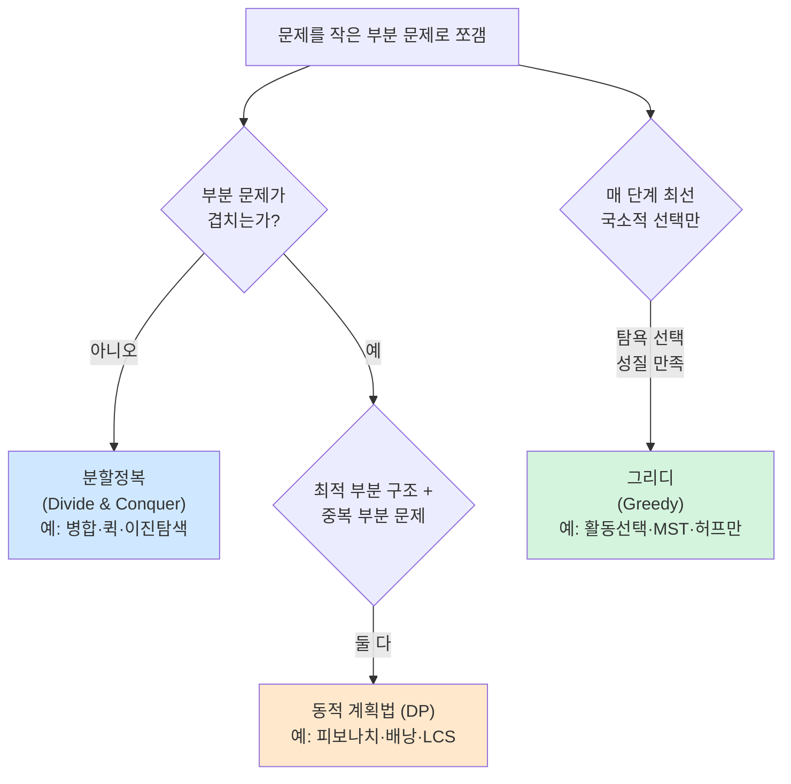
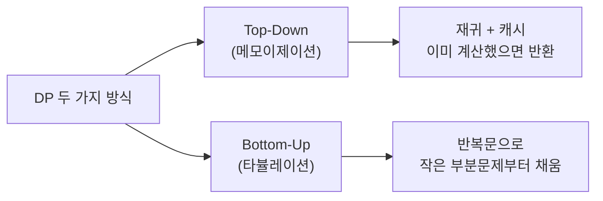
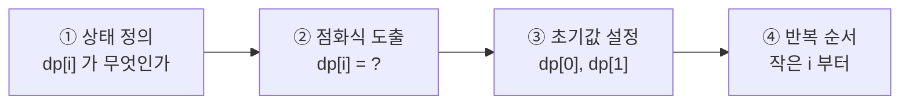
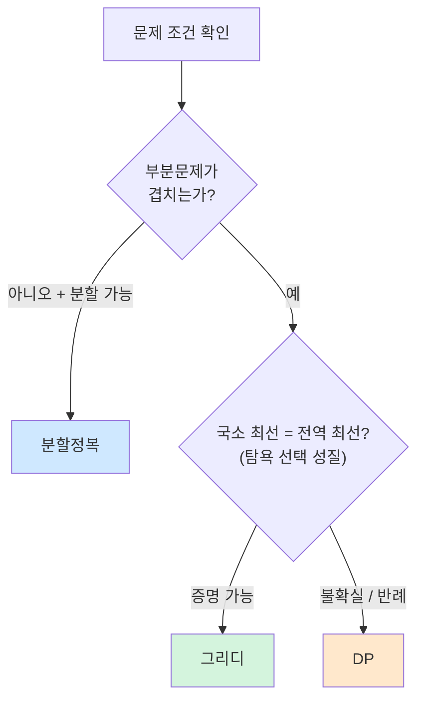

> **이 글의 목적**
>
> [알고리즘 ①] 정렬·자료구조, [알고리즘 ②] 그래프 까지 왔으니, 이번이 알고리즘 시리즈 마지막. KODIT 알고리즘분석과 7급 데이터직 알고리즘에서 *점화식 풀이·DP 트레이싱·분할정복 비교·그리디 조건* 이 매년 꾸준히 출제된다. 코드를 짜는 게 아니라 *왜 이렇게 푸는가* 를 설명할 수 있어야 한다.
>
> 정리는 *CLRS*[^1] 4부(15~16장), *Sedgewick & Wayne*[^2], *Skiena*[^3] 8장을 토대로 했다. 시험 직전이면 *3번(고전 DP 점화식), 6번(그리디 조건), 7번(1분 요약)* 만 빠르게 훑어도 된다.
>
> **읽고 나면 답할 수 있는 질문**:
>
> - **DP** 와 *분할정복* 의 차이는 *무엇이 같은 일을 반복하는가* 의 관점에서 어떻게 다른가
> - **메모이제이션(top-down)** 과 **타뷸레이션(bottom-up)** 의 실무적 차이
> - **0/1 배낭** 과 **분수 배낭** 은 같은 문제처럼 보이지만 *왜 다른 알고리즘* 으로 풀어야 하는가
> - **LCS(최장 공통 부분수열)** 의 점화식은 *왜 이전 두 칸* 만 보면 되는가
> - **그리디** 가 최적해를 보장하는 조건 — *탐욕 선택 성질* 과 *최적 부분 구조*
> - 같은 *최단경로* 도 다익스트라(그리디) vs 벨만-포드(DP) 인데 *어느 게 어느 쪽* 인가
> - **마스터 정리** 로 분할정복 점화식 *3가지 case* 를 빠르게 푸는 법 (복습)

---

## 1. 세 패러다임의 자리 잡기

### 1.1 한눈에 비교



### 1.2 세 패러다임의 핵심 차이

| 패러다임 | 부분문제 처리 | 최적성 보장 | 시간 |
|---|---|---|---|
| **분할정복** | *독립적* 부분문제 → 따로 풀고 합침 | 항상 (정확한 알고리즘이면) | 마스터 정리로 분석 |
| **DP** | *겹치는* 부분문제 → 한 번 풀고 *저장* | 항상 (모든 후보 검사) | 보통 *상태 공간 × 전이 비용* |
| **그리디** | *국소 최선* 만 선택 — 되돌아가지 ✗ | **조건 만족 시에만** | 보통 정렬 후 한 번 순회 → O(n log n) |

### 1.3 같은 문제, 다른 패러다임

| 문제 | 분할정복 | DP | 그리디 |
|---|---|---|---|
| **최단경로 (단일 출발)** | — | 벨만-포드 (O(VE)) | **다익스트라** (음수 ✗) |
| **MST** | — | — | **프림·크루스칼** |
| **정렬** | **병합·퀵** | — | (선택정렬은 그리디지만 비효율) |
| **이진탐색** | **이진탐색** | — | — |
| **0/1 배낭** | — | **DP** | ✗ (그리디는 *분수 배낭만*) |

> 💡 **시험 함정**: *"0/1 배낭은 그리디로 풀 수 있다"* → **거짓**. 0/1 은 DP, *분수 배낭* 만 그리디.

---

## 2. 분할정복 (Divide & Conquer) — 복습

[알고리즘 ①] 에서 *마스터 정리* 로 다뤘으니, 이번 글에선 *DP 와 무엇이 다른가* 만 짧게 짚는다.

### 2.1 3단계

| 단계 | 설명 |
|---|---|
| **분할(Divide)** | 문제를 *작은 동일 형태* 로 나눔 |
| **정복(Conquer)** | 부분문제를 *재귀적으로* 해결 |
| **결합(Combine)** | 부분 해를 *원 문제 해* 로 합침 |

### 2.2 대표 예시

| 알고리즘 | 점화식 | 시간 |
|---|---|---|
| **병합정렬** | T(n) = 2T(n/2) + Θ(n) | O(n log n) |
| **퀵정렬** | T(n) = 2T(n/2) + Θ(n) (평균) | O(n log n) 평균 |
| **이진탐색** | T(n) = T(n/2) + Θ(1) | O(log n) |
| **슈트라센 행렬곱** | T(n) = 7T(n/2) + Θ(n²) | O(n^2.807) |

### 2.3 DP 와 결정적 차이

> 분할정복은 *부분문제가 서로 겹치지 않는다*. 같은 부분문제를 두 번 풀 일이 없다. DP는 *겹친다* — 그래서 *결과를 저장* 해 두 번 안 풀어야 효율이 나온다.

피보나치를 예로 들면:

```text
F(5) = F(4) + F(3)
       = (F(3) + F(2)) + (F(2) + F(1))
       = ...
```

*F(2), F(3) 을 여러 번* 다시 계산한다. 단순 재귀는 O(2^n). 한 번씩만 계산하고 저장 → DP, O(n).

---

## 3. 동적 계획법 (DP) ★★★

### 3.1 적용 조건 — *둘 다* 성립해야 함

| 조건 | 의미 |
|---|---|
| **최적 부분 구조 (Optimal Substructure)** | *원 문제의 최적해* 가 *부분문제의 최적해* 로 구성됨 |
| **중복 부분 문제 (Overlapping Subproblems)** | 같은 부분문제가 *여러 번 등장* 함 |

> 💡 분할정복은 *최적 부분 구조* 만 만족, *중복은 안 함*. DP는 *둘 다* 만족.

### 3.2 두 가지 구현 방식



| 방식 | 장점 | 단점 |
|---|---|---|
| **메모이제이션 (Top-Down)** | *직관적*, 필요한 부분만 계산 | 재귀 호출 오버헤드, 스택 오버플로 위험 |
| **타뷸레이션 (Bottom-Up)** | *빠름*, 스택 안전, 공간 최적화 가능 | 모든 부분문제 계산 (불필요한 것도) |

### 3.3 피보나치로 보는 차이

```python
# ① 단순 재귀 — O(2^n) 함정
def fib_naive(n):
    if n < 2: return n
    return fib_naive(n-1) + fib_naive(n-2)

# ② 메모이제이션 (Top-Down DP) — O(n)
def fib_memo(n, cache={0:0, 1:1}):
    if n in cache: return cache[n]
    cache[n] = fib_memo(n-1) + fib_memo(n-2)
    return cache[n]

# ③ 타뷸레이션 (Bottom-Up DP) — O(n) 시간, O(1) 공간
def fib_tab(n):
    if n < 2: return n
    a, b = 0, 1
    for _ in range(n-1):
        a, b = b, a+b
    return b
```

> 🎯 **시험 직출**: 같은 *피보나치* 라도 *시간복잡도가 단순 재귀 O(2^n) → DP O(n)* 으로 *지수 → 선형* 이라는 점이 핵심.

### 3.4 DP 설계 4단계


> *"DP를 어떻게 풀 것인가"* 는 4단계로 분해된다. 시험에 *점화식 적기* 형태로 자주 나온다.



| 단계 | 피보나치 예 |
|---|---|
| ① 상태 | dp[i] = i번째 피보나치 수 |
| ② 점화식 | dp[i] = dp[i-1] + dp[i-2] |
| ③ 초기값 | dp[0]=0, dp[1]=1 |
| ④ 반복 | i = 2 → n |

---

## 4. 고전 DP 문제 — 시험 직출 ★★★

### 4.1 0/1 배낭 (0/1 Knapsack)


> *N개의 물건* (무게 w, 가치 v) 과 *배낭 용량 W* 가 주어진다. 각 물건은 *넣거나(1) 안 넣거나(0)*. **가치 합 최대화**.

#### 점화식

> **dp[i][w] = max(dp[i-1][w], dp[i-1][w - wᵢ] + vᵢ)**

| 항 | 의미 |
|---|---|
| `dp[i-1][w]` | i번째 물건을 *안 넣었을 때* 최댓값 |
| `dp[i-1][w-wᵢ] + vᵢ` | i번째 물건을 *넣었을 때* — 남은 무게로 i-1까지 최선 + vᵢ |

#### Step by Step 트레이싱

> 물건 3개 (w, v) = (2, 3), (3, 4), (4, 5). 배낭 용량 W = 5.

| i \\ w | 0 | 1 | 2 | 3 | 4 | 5 |
|---|---|---|---|---|---|---|
| 0 (없음) | 0 | 0 | 0 | 0 | 0 | 0 |
| 1 (2,3) | 0 | 0 | 3 | 3 | 3 | 3 |
| 2 (3,4) | 0 | 0 | 3 | 4 | 4 | **7** |
| 3 (4,5) | 0 | 0 | 3 | 4 | 5 | **7** |

> 🎯 **답: 7** (물건 1+2 선택, w=5, v=3+4=7).

| 측면 | 결과 |
|---|---|
| 시간 | **O(N · W)** — *유사 다항* (W가 입력 길이의 *값* 이라 NP) |
| 공간 | O(N · W), 최적화 시 O(W) |
| **그리디로 풀 수 있나?** | **✗** (0/1은 DP만) |

> 💡 *분수 배낭(Fractional Knapsack)* 은 *물건을 쪼갤 수 있어서* **단위 가치(v/w) 큰 순서로 그리디** 가 최적. 이름이 비슷해도 *전혀 다른 알고리즘*.

### 4.2 LCS (Longest Common Subsequence, 최장 공통 부분수열)


> 두 문자열 X, Y 의 *공통 부분수열 중 가장 긴 것* 의 길이.

#### 점화식

> **dp[i][j] = `dp[i-1][j-1] + 1` (X[i] = Y[j])**
>
> **dp[i][j] = `max(dp[i-1][j], dp[i][j-1])` (다르면)**

#### Step by Step 트레이싱

> X = "ABCBDAB", Y = "BDCAB". LCS = "BCAB" 또는 "BDAB" — 길이 4.

|   |   | B | D | C | A | B |
|---|---|---|---|---|---|---|
|   | 0 | 0 | 0 | 0 | 0 | 0 |
| A | 0 | 0 | 0 | 0 | 1 | 1 |
| B | 0 | 1 | 1 | 1 | 1 | 2 |
| C | 0 | 1 | 1 | 2 | 2 | 2 |
| B | 0 | 1 | 1 | 2 | 2 | 3 |
| D | 0 | 1 | 2 | 2 | 2 | 3 |
| A | 0 | 1 | 2 | 2 | 3 | 3 |
| B | 0 | 1 | 2 | 2 | 3 | **4** |

> 🎯 **답: 4**

| 측면 | 결과 |
|---|---|
| 시간 | **O(M · N)** |
| 공간 | O(M · N), 최적화 시 O(min(M, N)) |
| 응용 | DNA 정렬, *git diff*, 맞춤법 검사 |

> 💡 **편집 거리(Edit Distance, Levenshtein)** 도 *같은 패턴* — 삽입·삭제·치환 비용을 점화식에 넣으면 됨.

### 4.3 행렬 연쇄 곱셈 (Matrix Chain Multiplication)

> 행렬 곱셈은 *결합 순서* 에 따라 연산 횟수가 다르다. *최소 곱셈 횟수* 를 찾는 문제.

#### 점화식

> **dp[i][j] = min(dp[i][k] + dp[k+1][j] + pᵢ₋₁ · pₖ · pⱼ)** for i ≤ k < j

| 측면 | 결과 |
|---|---|
| 시간 | **O(N³)** |
| 응용 | 컴파일러 최적화, 그래픽스 |

### 4.4 동전 교환 (Coin Change)

> 금액 N 을 *동전 종류* coins[] 로 만들 때 *최소 동전 개수*.

#### 점화식

> **dp[n] = min(dp[n - cᵢ]) + 1** for all coins cᵢ ≤ n

| 측면 | 결과 |
|---|---|
| 시간 | **O(N · |coins|)** |
| 응용 | 잔돈 계산, 자원 분할 |

> ⚠️ **함정**: 동전 [1, 4, 5] 로 7원을 만들 때 *그리디* 는 5+1+1 = 3개 답을 내지만, *DP 는 4+1+1+1 또는 4+(2 안 됨)* → 실제 최적 *5+1+1 = 3개* 와 같다. 그러나 *동전 [1, 3, 4]* 로 6원을 만들 때 *그리디* 는 4+1+1=3개, *DP는 3+3=2개* → DP가 더 좋다. **동전 교환의 일반 해는 DP**.

---

## 5. 그리디 알고리즘 (Greedy) ★

### 5.1 그리디가 최적해를 주는 조건

> *모든 단계에서 **국소 최선** 을 선택하는데, 그 결과가 **전역 최선** 이 되는가?*

| 조건 | 설명 |
|---|---|
| **탐욕 선택 성질 (Greedy Choice Property)** | *국소 최선이 전역 최선* 의 일부가 됨 |
| **최적 부분 구조 (Optimal Substructure)** | *부분 문제의 최적* 이 원 문제 최적 구성 |

> 💡 *최적 부분 구조* 는 DP와 공통. 차이는 *그리디는 한 번 선택하면 되돌아보지 않는다* 는 점.

### 5.2 대표 그리디 문제

#### ① 활동 선택 (Activity Selection)

> 시간이 겹치지 않는 활동을 *최대한 많이* 선택. **종료 시간 빠른 순서로 정렬 후 선택**.

```python
def activity_selection(activities):  # [(start, end), ...]
    activities.sort(key=lambda a: a[1])  # 종료 시간 순
    selected = []
    last_end = -1
    for s, e in activities:
        if s >= last_end:
            selected.append((s, e))
            last_end = e
    return selected
```

| 측면 | 결과 |
|---|---|
| 시간 | **O(n log n)** (정렬 지배) |
| 최적성 | ✓ (탐욕 선택 성질 만족) |

#### ② 분수 배낭 (Fractional Knapsack)


> 물건을 *쪼갤 수 있을 때* — *단위 가치(v/w) 큰 순서로 욕심껏* 담기.

| 측면 | 결과 |
|---|---|
| 시간 | O(n log n) |
| 최적성 | ✓ |
| **0/1 배낭과 차이** | 0/1은 *쪼갤 수 없어 그리디 ✗* — DP 필요 |

#### ③ 허프만 코딩 (Huffman Coding)

> 문자 빈도 기반 *가변 길이 부호화*. **빈도 가장 작은 두 노드를 합쳐** 트리를 거꾸로 쌓아 올림.

| 측면 | 결과 |
|---|---|
| 시간 | O(n log n) (우선순위 큐) |
| 응용 | gzip, JPEG, MP3 |

#### ④ MST — 프림·크루스칼

> [알고리즘 ②] 에서 다룬 두 알고리즘은 *그리디의 모범 답안*. 매 단계 *최소 가중치 간선* 을 선택해도 전역 MST가 나온다.

#### ⑤ 다익스트라 — *그리디 + DP의 경계*

> 매 단계 *거리 최소 정점* 을 확정 (그리디). 단, *부분 최적이 전역 최적* 인 건 *음의 가중치가 없을 때만*. 음의 가중치는 그리디가 깨져 *DP의 벨만-포드* 로 가야 함.

### 5.3 그리디 vs DP — 한 줄 정리

| 측면 | 그리디 | DP |
|---|---|---|
| **선택** | 국소 최선 → 확정, 되돌아보기 ✗ | 모든 후보 검토 후 최선 |
| **속도** | 보통 *빠름* (정렬 후 한 번 순회) | 느림 (상태 × 전이) |
| **최적성** | *조건 만족 시에만* | 항상 (조건 만족하면) |
| **예시** | 활동선택·MST·허프만·분수배낭 | 0/1 배낭·LCS·동전교환 |

---

## 6. 실전 식별법 — *어떤 패러다임을 쓸까* ★


### 6.1 의사결정 트리



### 6.2 시험 단골 식별 패턴

| 문제 키워드 | 패러다임 | 이유 |
|---|---|---|
| "정렬된 배열에서 검색" | 분할정복 | 이진탐색 |
| "최대 가치를 갖는 부분집합" (정수) | DP | 0/1 배낭 |
| "최대 가치를 갖는 부분집합" (분수 가능) | 그리디 | 분수 배낭 |
| "최소 동전 개수" | DP | 동전 교환 |
| "최장 공통 부분수열" | DP | LCS |
| "겹치지 않는 활동 최대" | 그리디 | 활동 선택 |
| "최소 신장 트리" | 그리디 | 프림·크루스칼 |
| "최단경로 (가중치 ≥ 0)" | 그리디 | 다익스트라 |
| "최단경로 (음의 가중치)" | DP | 벨만-포드 |
| "행렬 곱 최적 순서" | DP | 행렬 연쇄 곱셈 |

---

## 7. 헷갈리는 것 / 자주 묻는 질문

### Q1. *DP와 분할정복의 결정적 차이는 무엇인가?*

*부분문제의 중복* 여부. 분할정복은 *겹치지 않는* 부분문제, DP는 *겹치는* 부분문제 — 그래서 *결과 저장* 이 효율의 핵심.

### Q2. *0/1 배낭은 왜 그리디로 못 푸는가?*

*탐욕 선택 성질* 이 깨진다. 단위 가치 (v/w) 가 가장 높은 물건을 먼저 넣어도, *남은 공간* 에 *다른 조합* 이 더 나을 수 있다. 예: w = (10, 6, 5), v = (10, 9, 8), 용량 11 → 그리디(첫째)는 10, DP는 (둘째 + 셋째) = 17.

### Q3. *메모이제이션과 타뷸레이션 중 어느 쪽이 좋은가?*

| 상황 | 추천 |
|---|---|
| *재귀가 자연스러운 문제* (트리, 게임) | 메모이제이션 |
| *모든 부분문제가 필요함* | 타뷸레이션 (스택 안전) |
| *공간 최적화 (롤링 배열)* | 타뷸레이션 |

### Q4. *LCS의 점화식은 왜 max인가?*

X[i] ≠ Y[j] 일 때는 *둘 중 하나를 빼는 게 낫다*. *X[i] 빼고 (i-1, j) 와 비교* / *Y[j] 빼고 (i, j-1) 과 비교* 둘 중 *큰 쪽* 이 답.

### Q5. *분할정복에 마스터 정리를 어떻게 쓰는가?*

T(n) = a·T(n/b) + f(n) 이면 *n^(log_b a)* 와 *f(n)* 비교. [알고리즘 ①] §3 참조. Case 1·2·3 으로 결정.

### Q6. *그리디가 최적해를 주는지 어떻게 *증명* 하나?*

두 가지 표준 증명법:
- **교환 논법(Exchange Argument)**: *그리디 해와 최적 해를 비교* 해, 한 쌍을 *교환* 해도 최적성이 깨지지 않음을 보임.
- **귀납법**: *k 단계에서 그리디가 최적의 일부* 임을 보이고 k+1 로 확장.

### Q7. *최단경로에서 다익스트라(그리디) vs 벨만-포드(DP) 의 본질적 차이?*

다익스트라는 *한 번 확정한 정점은 다시 안 본다* — 그리디. 음의 가중치에서 깨짐. 벨만-포드는 *모든 간선을 V-1번 완화* — DP. 매 반복이 *현재까지의 최선* 을 갱신.

### Q8. *그리디와 DP의 시간복잡도 차이는?*

대체로 그리디는 *O(n log n)* (정렬 지배), DP는 *상태 수 × 전이 비용*. 0/1 배낭은 O(N·W), LCS는 O(M·N) — 보통 *다항* 이지만 그리디보다 느림.

---

## 8. 시험 직전 1분 요약

### 핵심 8개

1. **분할정복 vs DP**: *부분문제 중복* 유무. DP는 *저장(memoization/tabulation)*
2. **DP 4단계**: 상태 정의 → 점화식 → 초기값 → 반복 순서
3. **메모이제이션 vs 타뷸레이션**: top-down 재귀+캐시 vs bottom-up 반복문
4. **0/1 배낭**: dp[i][w] = max(dp[i-1][w], dp[i-1][w-wᵢ] + vᵢ). 시간 O(N·W)
5. **LCS**: 같으면 dp[i-1][j-1] + 1, 다르면 max(dp[i-1][j], dp[i][j-1]). O(M·N)
6. **그리디 조건**: *탐욕 선택 성질* + *최적 부분 구조*. 둘 다 만족해야 최적
7. **그리디 모범 5종**: 활동선택·분수배낭·허프만·MST(프림/크루스칼)·다익스트라
8. **분수 배낭은 그리디, 0/1 배낭은 DP** — 함정

### 패러다임 비교표 (외울 것)

| 패러다임 | 부분문제 | 시간 | 대표 알고리즘 |
|---|---|---|---|
| 분할정복 | *독립* | 마스터 정리 | 병합·퀵·이진탐색 |
| DP | *겹침* | 상태×전이 | 배낭·LCS·동전교환·벨만-포드 |
| 그리디 | 국소 최선 | 보통 O(n log n) | 활동선택·분수배낭·MST·다익스트라·허프만 |

### 자주 헷갈리는 한 마디

- *"DP와 분할정복은 같다"* → **거짓** (부분문제 중복 유무가 다름)
- *"0/1 배낭은 그리디로 풀린다"* → **거짓** (DP 전용)
- *"분수 배낭은 DP가 필요하다"* → **거짓** (그리디로 충분)
- *"다익스트라는 DP다"* → **거짓** (그리디. 음의 가중치 ✗)
- *"벨만-포드는 그리디다"* → **거짓** (DP. 음의 가중치 ✓)
- *"그리디는 항상 최적이다"* → **거짓** (조건 만족 시에만)
- *"메모이제이션은 bottom-up이다"* → **거짓** (top-down)

### 빈출 패턴

| 빈출 유형 | 풀이 키 |
|---|---|
| 점화식 도출 | dp[i] 의 의미 → 부분문제 분해 |
| 0/1 배낭 표 채우기 | dp[i-1][w] vs dp[i-1][w-wᵢ]+vᵢ |
| LCS 표 채우기 | 같으면 대각선+1, 다르면 위·왼쪽 max |
| 그리디 vs DP 식별 | *탐욕 선택 성질* 증명 가능한지 |
| 시간복잡도 비교 | 단순 재귀 O(2^n) vs DP O(n) |

---

## 9. 다음 학습

알고리즘 시리즈가 여기서 마무리. 시험 후엔 다음 주제들로 확장 가능:

- **NP 완전성 (NP-Completeness)**: P vs NP, 환원, SAT, 외판원, 그래프 색칠
- **고급 DP**: 비트마스크 DP, 트리 DP, 자릿수 DP
- **고급 그래프**: 네트워크 플로우 (Ford-Fulkerson, Edmonds-Karp), 2-SAT, SCC
- **랜덤화 알고리즘**: Las Vegas vs Monte Carlo, 무작위 퀵정렬
- **근사 알고리즘**: NP-hard 문제의 *근사 비율* 보장

추가 학습 자료:

- **CLRS** *Introduction to Algorithms* Ch.15 (DP), Ch.16 (Greedy)
- **Sedgewick & Wayne** *Algorithms* — DP 시각화
- **Skiena** *Algorithm Design Manual* Ch.8 — 실전 패러다임 식별

---

## 10. 참고 문헌 (References)

[^1]: Cormen, T. H., Leiserson, C. E., Rivest, R. L., & Stein, C. (2022). *Introduction to Algorithms* (4th ed.). MIT Press. (Ch.15 DP, Ch.16 Greedy)

[^2]: Sedgewick, R., & Wayne, K. (2011). *Algorithms* (4th ed.). Addison-Wesley.

[^3]: Skiena, S. S. (2020). *The Algorithm Design Manual* (3rd ed.). Springer. (Ch.8 패러다임 식별)

[^4]: Bellman, R. (1957). *Dynamic Programming*. Princeton University Press. (DP 원전)

[^5]: Huffman, D. A. (1952). A method for the construction of minimum-redundancy codes. *Proceedings of the IRE*, 40(9), 1098–1101.

[^6]: Knapsack 문제의 NP-완전성 — Karp, R. M. (1972). Reducibility among combinatorial problems. In *Complexity of Computer Computations* (pp. 85–103). Springer.

### 보조 자료

- 7급 데이터직 알고리즘 과목 + KODIT 알고리즘분석 출제 영역 (2023~2025)
- [알고리즘 ①] Big-O와 정렬 — 마스터 정리 (분할정복 분석)
- [알고리즘 ②] 그래프 알고리즘 — MST·다익스트라 (그리디 응용)

---

## 부록 A: 이미지 생성 프롬프트

> 📁 이미지 프롬프트는 [`/prompts/2026-05-04-algorithm-03-dp-greedy.md`](/prompts/2026-05-04-algorithm-03-dp-greedy.md) 에 별도 정리되어 있다 (한글 라벨·파일명·저장 경로 명시).

> ✍️ **알고리즘 시리즈 종료**. 다음은 [AI시스템 ①] MLOps 파이프라인 또는 [논술] KODIT 사업 키워드 정리 예정.
