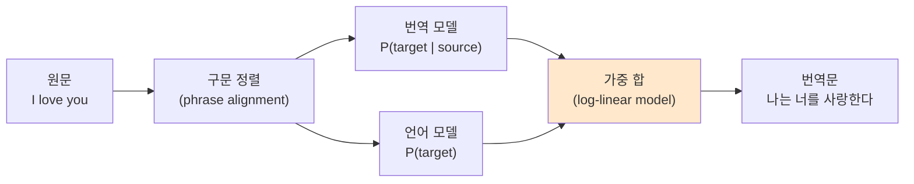
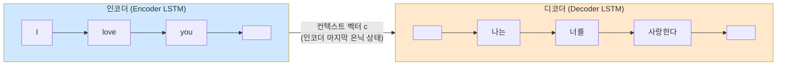
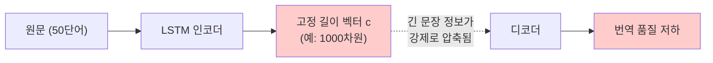
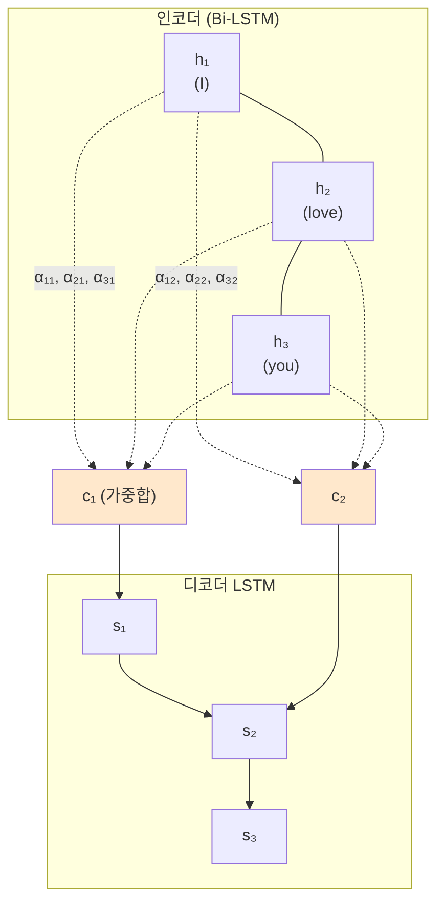
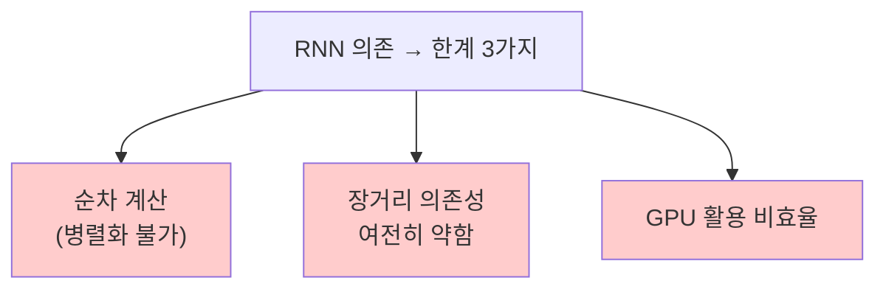

> **이 글의 목적**
>
> [NLP ②](/ai/nlp-02-word2vec/)에서 *단어를 벡터로 잘 표현하는 법* 까지 정리했다. 그러면 이제 *문장 → 문장* 으로 변환하는 일 — **기계 번역(Machine Translation)** — 에 도전할 수 있다.
>
> 2014년 두 편의 논문이 NLP의 흐름을 다시 한 번 흔들었다. *Sutskever et al.* 의 **Seq2Seq** 가 *RNN으로 가변 길이 시퀀스 변환* 을 풀었고, 같은 해 *Bahdanau et al.* 의 **Attention** 이 그 한계 — *정보 병목(bottleneck)* — 을 깨면서 BLEU 점수를 끌어올렸다.
>
> 이 두 논문이 없었다면 *Transformer (Vaswani 2017)* 도 *BERT/GPT* 도 없었다. 그 정도로 결정적인 다리.
>
> 정리는 *Sutskever et al. (2014)*[^1], *Bahdanau et al. (2015)*[^2], *Cho et al. (2014)*[^3], *Luong et al. (2015)*[^4]의 원전 논문과 *Jurafsky & Martin*의 *SLP* Ch.10[^5]을 토대로 했다.
>
> **읽고 나면 답할 수 있는 질문**:
>
> - 통계 기반 기계 번역(**SMT**)의 한계는 무엇이었고, **Seq2Seq** 가 어떻게 풀었나
> - **인코더-디코더** 구조의 본질은 무엇이고, *고정 길이 컨텍스트 벡터* 가 왜 *병목* 이 되는가
> - **Bahdanau Attention** 의 한 줄 직관 — *"매 단어를 만들 때마다 원문 어디를 볼지 다시 정한다"*
> - Attention의 핵심 식 *3단계* — alignment score → softmax → weighted sum
> - **Bahdanau vs Luong** Attention의 차이 (concat / dot / general)
> - Seq2Seq + Attention이 BLEU 점수를 *얼마나* 끌어올렸나
> - 그래도 **남는 한계** — *RNN 의존, 병렬화 불가, 장거리 의존성* — 이 어떻게 *Transformer*를 부르게 되는가

---

## 1. 통계 기반 기계 번역의 한계

### 1.1 SMT (Statistical Machine Translation) 시대 — 1990s ~ 2014

2014년 이전 *기계 번역의 표준* 은 **SMT**, 그중에서도 *구문 기반(Phrase-Based) SMT* (Koehn et al., 2003)였다. 큰 흐름:



핵심 한계:

| 문제 | 설명 |
|---|---|
| **구문 단위 처리** | "the cat sat" 같은 구문을 *조각* 으로 번역 → 어색한 결합 |
| **장거리 의존성 ✗** | 영어 *서술-목적어*, 한국어 *목적어-서술* 같은 어순 차이 처리 약함 |
| **수동 피처 엔지니어링** | 정렬·언어모델 점수 등 *손으로 만든 점수* 의 가중합 |
| **벤치마크 정체** | 2010~2014년 BLEU 점수 *수년간 거의 정체* |

### 1.2 *신경망* 으로 통째로 풀어보자 — Seq2Seq 등장

이 흐름을 한 번에 깬 것이 2014년 9월 Sutskever 등의 NeurIPS 논문이었다.

> Sutskever, I., Vinyals, O., & Le, Q. V. (2014). *Sequence to Sequence Learning with Neural Networks*.[^1]

> *"문장을 통째로 LSTM에 넣고, 다른 LSTM이 통째로 번역문을 뽑게 하면 되지 않을까?"*

---

## 2. Seq2Seq — 인코더 + 디코더, 두 개의 RNN

### 2.1 구조



| 부품 | 역할 |
|---|---|
| **인코더(Encoder) LSTM** | 원문 시퀀스를 *고정 길이 벡터 c* 로 압축 |
| **컨텍스트 벡터 c** | 인코더의 *마지막 은닉 상태* (또는 셀 상태) |
| **디코더(Decoder) LSTM** | c를 초기 상태로 받아 번역문을 한 단어씩 생성 |
| `<BOS>` / `<EOS>` | *시작/끝* 특수 토큰 |

### 2.2 학습 식

> **P(y₁, ..., yₘ | x₁, ..., xₙ) = ∏ₜ P(yₜ | y₁, ..., yₜ₋₁, c)**

각 시점에서 *이전까지 생성한 번역* 과 *컨텍스트 c* 를 조건으로 *다음 단어* 를 예측. 손실은 *전체 토큰 cross-entropy의 합*.

### 2.3 학습 트릭들

- **Teacher Forcing**: 학습 시 *정답 이전 단어* 를 입력으로 사용 (예측이 틀려도 다음 step 입력은 정답)
- **원문 역순 입력**: Sutskever 논문은 *원문을 거꾸로* 인코더에 넣었을 때 BLEU가 더 높았다고 보고. 이유는 *처음 단어 간 거리가 짧아져* 학습이 쉬워짐
- **Beam Search**: 추론 시 *상위 k개 후보* 를 동시에 추적

### 2.4 결과

영어 → 프랑스어 WMT'14에서 *BLEU 34.81* 을 달성. 당시 SMT 베이스라인을 넘어선 *최초의 신경망 기반 결과* 중 하나.

---

## 3. Seq2Seq의 한계 — 정보 병목(Bottleneck) 문제

### 3.1 고정 길이 벡터에 *모든 정보* 를?

원문이 *3단어* 든 *50단어* 든, 디코더에 전달되는 건 *고정 길이 벡터 c* 하나다. 짧은 문장은 괜찮지만, *긴 문장* 은 정보를 다 담을 수 없다.



실험적으로 확인된 결과:

> *Cho et al. (2014b)*[^6]: 입력 문장이 길어질수록 Seq2Seq의 BLEU가 *급격히* 떨어짐. 30~40단어 이상부터 무너지기 시작.

### 3.2 직관 — *마지막 은닉 상태만* 디코더가 본다

LSTM의 마지막 은닉 상태 c는 *원문 전체의 요약* 이지만, 어쩔 수 없이 *손실 압축* 이다. 디코더가 *"the"* 를 번역할 때도, *"banana"* 를 번역할 때도, *같은 c* 만 본다. 정보가 *균등하게* 다 담길 수 없다.

이 한계를 푼 것이 **Attention**.

---

## 4. Attention — Bahdanau의 결정타 (2014)

### 4.1 핵심 아이디어

> Bahdanau, D., Cho, K., & Bengio, Y. (2015). *Neural Machine Translation by Jointly Learning to Align and Translate*.[^2]

> *"매 출력 시점마다, 디코더가 인코더의 모든 시점을 다시 본다 — 어느 단어가 지금 중요한지 가중치로 결정한다."*

이 한 줄이 NLP를 바꿨다. 더는 *고정 길이 c* 하나에 모든 걸 압축하지 않는다. 각 출력 토큰을 만들 때마다 *원문 전체* 를 *동적으로* 다시 본다.

### 4.2 새 구조



매 출력 시점 t마다 *새로운 컨텍스트 벡터 cₜ* 가 만들어진다. 가중치 *αᵢₜ* 가 *어느 인코더 위치를 얼마나 볼지* 를 정함.

### 4.3 핵심 식 3단계

#### Step 1: Alignment Score 계산

> *eᵢₜ = a(sₜ₋₁, hᵢ)*

디코더의 *이전 은닉 상태* sₜ₋₁ 과 인코더의 *각 시점 은닉 상태* hᵢ 의 *호환도(alignment)*. Bahdanau는 *작은 신경망(MLP)* 으로 계산:

> **eᵢₜ = vᵀ tanh(W₁·sₜ₋₁ + W₂·hᵢ)**

#### Step 2: Softmax로 *가중치* 화

> **αᵢₜ = exp(eᵢₜ) / Σⱼ exp(eⱼₜ)**

각 인코더 위치에 대해 *합이 1인 확률 분포*. *디코더가 지금 어느 단어를 보고 있는가* 의 표현.

#### Step 3: Weighted Sum으로 *컨텍스트 벡터*

> **cₜ = Σᵢ αᵢₜ · hᵢ**

가중치를 곱한 *모든 인코더 은닉 상태의 합*. 이게 디코더가 시점 t에서 사용할 *동적 컨텍스트*.

### 4.4 한 줄 요약

> *컨텍스트 벡터 = 인코더 은닉 상태들의 가중평균, 가중치는 디코더 상태와의 호환도*

---

## 5. Attention 메커니즘 — Step by Step 따라가기

영어 *"I love you"* → 한국어 *"나는 너를 사랑한다"* 번역의 한 시점.

### Step 1: 인코더가 원문을 처리

Bi-LSTM이 각 단어의 *순방향·역방향* 은닉 상태를 만들고 결합:

```text
h₁ = [→h(I);    ←h(I)]
h₂ = [→h(love); ←h(love)]
h₃ = [→h(you);  ←h(you)]
```

### Step 2: 디코더가 *"사랑한다"* 를 만들 차례

이전 은닉 상태 *s₂* (이미 *"나는 너를"* 까지 만든 상태)를 가지고:

```text
e₁ = score(s₂, h₁) = 0.3   (love가 아닌 'I'에 약하게 attention)
e₂ = score(s₂, h₂) = 2.7   (love에 강하게 attention!)
e₃ = score(s₂, h₃) = 0.5   (you에 약하게)
```

### Step 3: Softmax → 가중치

```text
α₁ = exp(0.3) / Σ ≈ 0.07
α₂ = exp(2.7) / Σ ≈ 0.85   ← love가 85% 차지
α₃ = exp(0.5) / Σ ≈ 0.08
```

### Step 4: Weighted Sum → 컨텍스트

```text
c₃ = 0.07·h₁ + 0.85·h₂ + 0.08·h₃
   ≈ h₂ (love 정보 위주)
```

### Step 5: 디코더가 다음 단어 생성

```text
s₃ = LSTM(s₂, [y₂, c₃])    (이전 출력 y₂ + 컨텍스트 c₃)
P(y₃) = softmax(W·s₃)       → "사랑한다"
```

> 💡 *"사랑한다"* 를 번역할 때 *love* 에 집중한 게 가중치 α₂ ≈ 0.85 로 드러난다. 이 *attention 가중치* 를 시각화하면 *번역 정렬(alignment)* 이 그대로 보인다.

---

## 6. Attention 시각화 — *학습된 정렬*


Bahdanau 논문의 가장 인상적인 결과 하나. *학습된 attention 가중치 αᵢₜ* 를 행렬로 그리면:

```text
영어 →  The   agreement  on   the    European   Economic   Area   was   signed
프랑스
L'                ▓
accord                  ▓     ▓
sur                              ▓
la                ▓                    ▓
zone                                              ▓
économique                                                  ▓
européenne                                                           ▓
a                                                                            ▓
été                                                                             ▓
signé                                                                              ▓
```

별도 정렬 학습 없이, *번역만 학습했는데* 인간 번역가가 만들 만한 *단어 대응* 이 자동으로 나타난다. *attention이 정렬(alignment)을 자체 학습한* 결과.

> 🎯 이 결과가 *Attention의 위력* 을 시각적으로 입증. 논문 제목의 *"Jointly Learning to Align and Translate"* 가 그 의미.

---

## 7. Bahdanau vs Luong — Attention의 두 변형

### 7.1 Luong Attention

> Luong, M.-T., Pham, H., & Manning, C. D. (2015). *Effective Approaches to Attention-based Neural Machine Translation*.[^4]

Bahdanau 직후, Luong이 *세 가지 score 함수* 를 비교했다:

| 종류 | 식 | 특성 |
|---|---|---|
| **Dot** | `score(s, h) = sᵀ · h` | 가장 단순, 같은 차원 필요 |
| **General** | `score(s, h) = sᵀ · W · h` | 학습 가능한 W로 차원 매개 |
| **Concat (Bahdanau)** | `score(s, h) = vᵀ · tanh(W·[s; h])` | 가장 표현력 높음, 비쌈 |

### 7.2 Bahdanau vs Luong 차이

| 측면 | **Bahdanau (2015)** | **Luong (2015)** |
|---|---|---|
| Score 함수 | concat (additive) | dot, general, concat 비교 |
| 디코더 상태 사용 | sₜ₋₁ (이전) | sₜ (현재) — 갱신 후 |
| 인코더 | Bi-LSTM | LSTM 가능 (단방향도 OK) |
| 정렬 시점 | 입력 처리 *전* | 입력 처리 *후* |
| 결과 품질 | 비슷 | 비슷 |

> 💡 *Transformer의 dot-product attention* 은 Luong의 **dot** 변형에서 출발. *Scaled Dot-Product Attention* 은 dot에 *√dₖ로 나누는* 보정 추가.

---

## 8. Seq2Seq + Attention의 효과

### 8.1 BLEU 점수 도약

영어 → 프랑스어 WMT'14 기준:

| 시스템 | BLEU |
|---|---|
| 구문 기반 SMT (Moses, 2003 표준) | 33.3 |
| Seq2Seq (Sutskever 2014) | 34.81 |
| **Seq2Seq + Attention (Bahdanau 2015)** | **36.15** |
| Google NMT (Wu et al., 2016, 깊은 LSTM + Attention) | 38.95 |

특히 *긴 문장* 에서 Attention의 효과가 크다 — Cho 2014b에서 보였던 *문장 길이별 성능 저하* 가 사실상 사라짐.

### 8.2 정렬 학습 + 해석 가능성

Attention 가중치는 *모델이 어디를 봤는지* 를 그대로 보여준다 → *모델 디버깅·신뢰도 평가* 에 활용 가능. *블랙박스 신경망* 에 *해석성* 을 일부 부여한 첫 결과 중 하나.

### 8.3 다른 도메인으로의 확장

Attention 아이디어는 NMT를 넘어 *모든 시퀀스 변환 문제* 에 퍼졌다:
- **이미지 캡셔닝** (Show, Attend and Tell — Xu et al., 2015) — 이미지 영역에 attention
- **음성 인식** (Listen, Attend and Spell — Chan et al., 2016) — 음성 프레임에 attention
- **요약·QA** — 입력 문서의 중요 부분에 attention

---

## 9. 그래도 남는 한계 — *Transformer를 부르는 이유*

### 9.1 RNN 의존성

Attention은 *컨텍스트 벡터* 문제를 풀었지만, **인코더와 디코더가 여전히 RNN/LSTM**. 이 때문에:



| 한계 | 설명 |
|---|---|
| **순차 계산** | t시점 계산이 t-1을 기다려야 함 → GPU 병렬화 어려움 |
| **장거리 의존성** | 문장 안 멀리 떨어진 단어 간 의존성은 여전히 *RNN을 통과* 해야 함 |
| **학습 시간** | 큰 모델·긴 문장에서 학습이 매우 느림 |

### 9.2 *RNN을 빼면 되지 않을까?* — Transformer의 도착

> Vaswani, A., et al. (2017). *Attention Is All You Need*.

> *"인코더와 디코더에서 RNN을 완전히 빼고, attention만으로 시퀀스를 처리하면 안 될까?"*

이 도발적 질문이 2017년 NeurIPS의 가장 유명한 논문을 만들었다. **Self-Attention** + **Multi-Head Attention** + **Positional Encoding** 으로 RNN 없이도 시퀀스를 다룰 수 있게 됐고, *병렬화* 가 가능해져 학습 속도가 폭발적으로 빨라졌다.

다음 편에서 Transformer를 본격적으로 다룬다.

---

## 10. 정리

이 글에서 다룬 내용을 한 줄로 압축하면:

- **SMT** 의 한계 — 구문 단위·장거리 의존성·정체된 BLEU
- **Seq2Seq** (Sutskever 2014) — 인코더-디코더 LSTM 두 개로 *시퀀스 → 시퀀스* 를 통째로 학습
- **고정 길이 컨텍스트 벡터의 정보 병목** — 긴 문장에서 무너짐
- **Attention** (Bahdanau 2015) — *매 시점마다 인코더 전체를 다시 본다*. 한 줄 핵심: *"가중평균, 가중치는 호환도"*
- **3단계 식**: alignment score → softmax → weighted sum
- **Bahdanau vs Luong** — concat / dot / general — 핵심은 같음
- **Attention 가중치 시각화** = *번역 정렬* 이 자동으로 학습된 결과
- **여전한 한계** — RNN 의존, 병렬화 ✗, 장거리 의존성 약함 → 다음 편 *Transformer*

---

## 11. 추가로 공부하면 좋을 개념

- **Beam Search**: Seq2Seq 추론 시 *그리디* 가 아니라 *상위 k개 후보* 를 추적하는 디코딩 알고리즘. 번역 품질에 큰 영향
- **BLEU Score**: 기계 번역 평가 지표. *n-gram precision + brevity penalty* (Papineni 2002). 그 한계와 대안(METEOR, BERTScore)
- **Coverage Penalty**: Seq2Seq+Attention이 *같은 단어를 반복 번역* 하는 *over-translation* 문제 — Tu et al. 2016이 *coverage vector* 로 해결
- **Pointer Networks** (Vinyals 2015): Attention 가중치를 *복사 메커니즘* 으로 사용 — 요약·OOV 처리에 유용
- **Self-Attention의 등장**: Transformer의 핵심. Attention의 *Q·K·V 추상화* 가 어떻게 self로 일반화되는지 (다음 편)

> ✍️ **다음 학습**: [NLP ④] Transformer — Self-Attention, Multi-Head, Positional Encoding. 작성 예정.

---

## 참고 문헌 (References)

[^1]: Sutskever, I., Vinyals, O., & Le, Q. V. (2014). "Sequence to Sequence Learning with Neural Networks." *NeurIPS 2014*. *arXiv:1409.3215*.

[^2]: Bahdanau, D., Cho, K., & Bengio, Y. (2015). "Neural Machine Translation by Jointly Learning to Align and Translate." *ICLR 2015*. *arXiv:1409.0473*.

[^3]: Cho, K., et al. (2014). "Learning Phrase Representations using RNN Encoder-Decoder for Statistical Machine Translation." *EMNLP 2014*. *arXiv:1406.1078*.

[^4]: Luong, M.-T., Pham, H., & Manning, C. D. (2015). "Effective Approaches to Attention-based Neural Machine Translation." *EMNLP 2015*. *arXiv:1508.04025*.

[^5]: Jurafsky, D., & Martin, J. H. (2024). *Speech and Language Processing* (3rd ed. draft), Ch. 10 (Encoder-Decoder Models, Attention). <https://web.stanford.edu/~jurafsky/slp3/>

[^6]: Cho, K., van Merriënboer, B., Bahdanau, D., & Bengio, Y. (2014). "On the Properties of Neural Machine Translation: Encoder-Decoder Approaches." *SSST-8*. *arXiv:1409.1259*.

---

## 부록 A. 이미지 생성 프롬프트

> 본 글은 Mermaid 차트 위주라 별도 이미지가 필수는 아니지만, 시리즈 통일성을 위한 두 장은 두면 좋다.

### A1. Seq2Seq + Attention 구조 (`seq2seq_attention.png`)

> 📁 저장 경로: `/assets/images/nlp/seq2seq_attention.png`

```
Wide horizontal infographic showing Seq2Seq with Attention architecture.
Bottom row: encoder Bi-LSTM unrolled across input tokens (e.g., "I",
"love", "you", "<EOS>") with bidirectional arrows producing hidden
states h₁, h₂, h₃, h₄. Top row: decoder LSTM unrolled across output
tokens generating "나는", "너를", "사랑한다". Between encoder and
decoder, multiple curved attention arrows from each encoder hidden
state to each decoder step, with the attention weights αᵢₜ shown as
varying line thicknesses (thicker = higher weight). One particular
decoder step is highlighted to show how its context vector cₜ is
computed as a weighted sum. Modern infographic style, soft pastel
palette (sky blue for encoder, warm beige for decoder, charcoal for
attention). Clean white background. 16:9.

CRITICAL: 이미지 내 모든 문자/라벨은 반드시 한글로 표시. 영문 텍스트 금지
(단, 변수 h, s, c, α, t, EOS, BOS와 예시 단어 I, love, you는 영문 그대로 유지).
라벨:
- 하단 영역: "인코더 Bi-LSTM"
- 상단 영역: "디코더 LSTM"
- 가운데 화살표 영역: "Attention 가중치 αᵢₜ"
- 강조된 디코더 step 옆: "컨텍스트 벡터 cₜ = Σ αᵢₜ · hᵢ"
- 하단 입력 라벨: "원문 (영어)"
- 상단 출력 라벨: "번역문 (한국어)"
- 하단 가운데: "Bahdanau Attention (2015) — Jointly Learning to Align and Translate"
```

### A2. Attention 정렬 히트맵 (`attention_alignment_heatmap.png`)

> 📁 저장 경로: `/assets/images/nlp/attention_alignment_heatmap.png`

```
Heatmap visualization of learned attention weights between an English
source sentence and a French target sentence. The X-axis lists English
words from left to right (e.g., "The agreement on the European
Economic Area was signed"), Y-axis lists French words top to bottom
(e.g., "L'accord sur la zone économique européenne a été signé").
Each cell is colored from light (low attention) to dark (high attention)
showing the alignment matrix. The diagonal pattern is mostly visible
but with notable swaps for adjective-noun ordering between English and
French. Clean grid heatmap style with a viridis-like colormap, axis
labels and a color legend. 16:9.

CRITICAL: 이미지 내 모든 문자/라벨은 반드시 한글로 표시. 영문 텍스트 금지
(단, 예시 영어 단어 "The agreement on the European Economic Area was
signed"와 프랑스어 단어 "L'accord sur la zone économique européenne
a été signé"는 그대로 유지).
라벨:
- X축 제목: "원문 단어 (영어)"
- Y축 제목: "번역문 단어 (프랑스어)"
- 색상 범례 제목: "Attention 가중치 αᵢₜ"
- 색상 범례 양 끝: "낮음", "높음"
- 하단 가운데: "학습된 Attention = 자동으로 등장한 번역 정렬 (Bahdanau 2015)"
- 상단 부제: "Attention 정렬 히트맵 — 모델이 어디를 봤는가"
```

> 💡 위 프롬프트는 모두 본문 텍스트에 의존하지 않는 자기 완결형 이미지를 만들도록 작성됐다.
