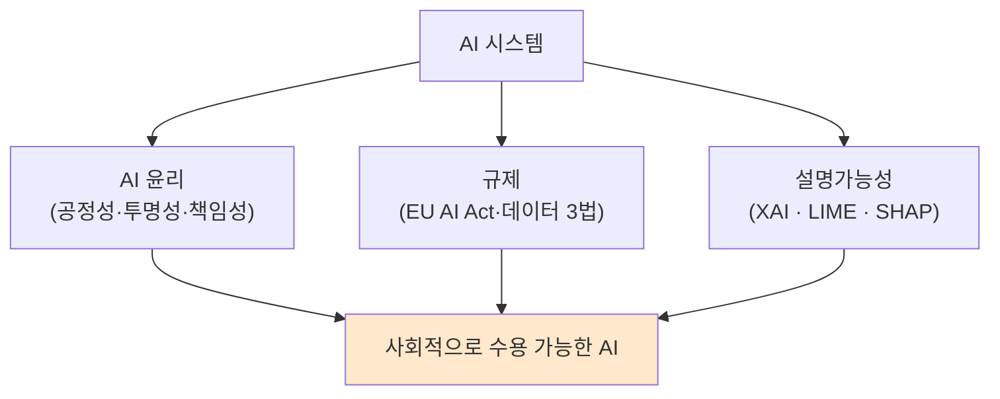
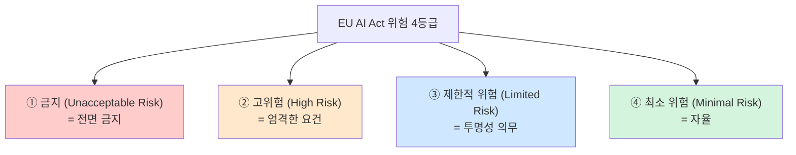
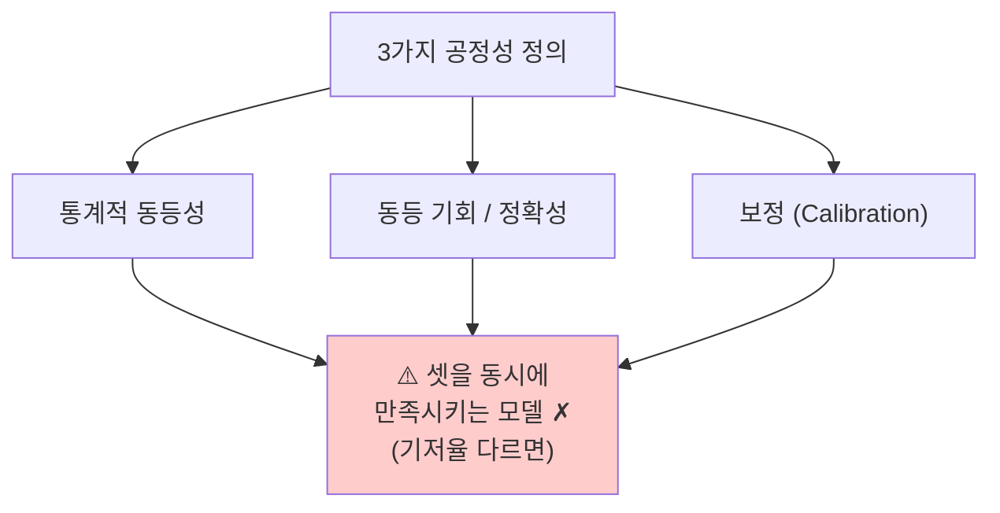
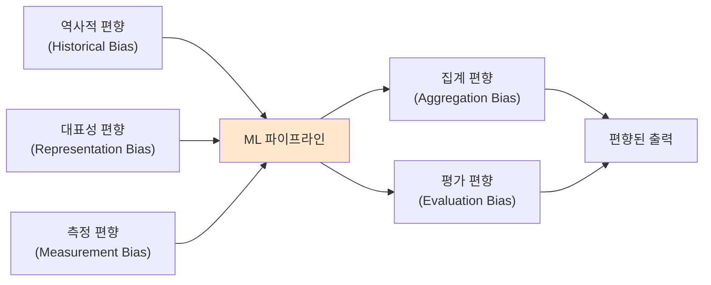
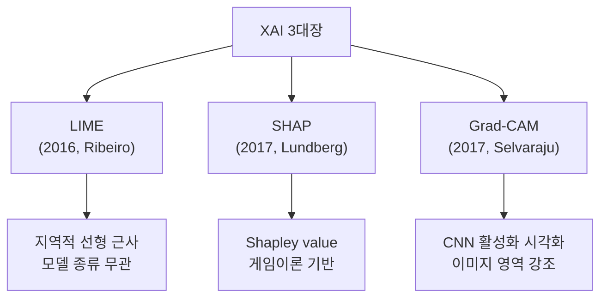
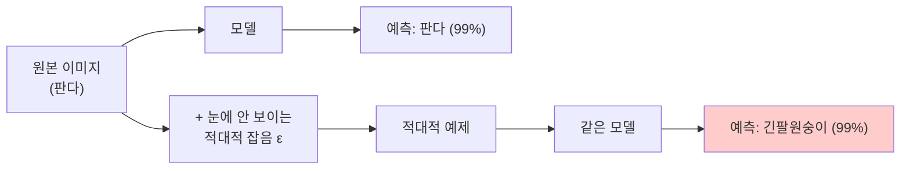

> **이 글의 목적**
>
> KODIT 인공지능시스템 과목에서 *AI 윤리·규제·설명가능성* 영역은 출제 비중 ★ 한 개지만, **금융 도메인 (신용평가·대출 의사결정)** 은 EU AI Act 의 *고위험(High-Risk) 시스템* 으로 분류되기 때문에 *실무에선 가장 무거운 영역* 이다. 모델 한 줄을 바꿀 때마다 *왜 그렇게 결정했는지 설명 가능* 해야 하고, *편향이 없음* 을 증명해야 한다.
>
> 정리는 *EU AI Act 본문(Regulation 2024/1689)*[^1], *Ribeiro et al. 2016 LIME*[^2], *Lundberg & Lee 2017 SHAP*[^3], *Selvaraju et al. 2017 Grad-CAM*[^4], *Goodfellow et al. 2014 FGSM*[^5] + 과기정통부·금융위 공식 가이드라인을 토대로 했다. 시험 직전이면 *2번(EU 4등급), 4번(XAI 3대장), 7번(1분 요약)* 만 빠르게 훑어도 된다.
>
> **읽고 나면 답할 수 있는 질문**:
>
> - **EU AI Act 4단계 위험 등급** — 어느 시스템이 어디에 속하나, *KODIT 신용평가* 는 어디에 속하나
> - **공정성(Fairness)** 의 세 가지 정의 — *통계적 동등성·동등 기회·동등 정확성* 이 *서로 양립 불가* 한 이유
> - **편향(Bias)** 5종 — 어디서 들어와서 어떻게 누적되는가
> - **XAI 3대장 LIME · SHAP · Grad-CAM** 의 *작동 원리 차이*
> - **화이트박스 vs 블랙박스** 모델의 정의와 *해석 가능성-성능 트레이드오프*
> - **적대적 공격(Adversarial Attack)** — FGSM·PGD 가 어떻게 동작하나, 방어법은
> - **데이터 3법·금융분야 AI 가이드라인** — 국내 규제의 핵심 조항

---

## 1. AI 윤리가 *기술 문제* 가 된 이유

### 1.1 사회적 사고 사례 — 모델은 *코드가 아니라 결정* 을 만든다

| 사례 | 문제 |
|---|---|
| **COMPAS (2016)** | 미국 재범 예측 알고리즘. 흑인 피고에게 *2배 높은 위양성률* 발견 (ProPublica 폭로) |
| **Amazon 채용 AI (2018)** | 10년치 이력서 학습 → *여성 지원자 점수 자동 감점* (남성 위주 데이터 편향) |
| **Apple Card (2019)** | 같은 가구·재정 상태에서 *남성에 여성보다 10배 높은 한도* 부여 의혹 |
| **Microsoft Tay (2016)** | 트위터 챗봇 출시 16시간 만에 *혐오 발언 학습* → 서비스 중단 |
| **딥페이크 정치 영상** | 2024 美 대선·한국 총선에서 *조작 영상* 으로 여론 영향 시도 |

> 💡 사고들의 공통점: *기술적으로는 정확한 모델* 이지만, *사회적·법적으로는 차별이거나 위해* 였다는 점. *정확도 = 윤리* 가 아니라는 게 핵심.

### 1.2 윤리·규제·설명가능성의 관계



> 윤리는 *지향*, 규제는 *강제*, XAI는 *수단*. 셋이 같이 가야 *진짜로 작동하는 AI 거버넌스* 가 된다.

---

## 2. EU AI Act — 위험 4등급 ★★★


### 2.1 배경

> *EU Regulation 2024/1689* 로 통과된 세계 최초의 포괄적 AI 법. 2024년 8월 1일 발효, 단계적 적용 (대부분 조항은 2026년 8월 적용). 위반 시 **최대 전 세계 매출의 7%** 또는 *3,500만 유로* 중 큰 금액의 과징금.

### 2.2 4등급 분류



### 2.3 등급별 정의 + 사례

| 등급 | 핵심 기준 | 사례 | 의무 |
|---|---|---|---|
| **① 금지** | 인권 침해·민주주의 위협 | *사회적 점수(social scoring)*, *잠재의식 조작*, 공공장소 *실시간 생체인식* (예외 있음) | *전면 금지* |
| **② 고위험** | 안전·기본권에 중대 영향 | **신용평가**, 채용, 의료기기, 법 집행, 교육 평가, 핵심 인프라, 사법 의사결정 | 위험관리·데이터 거버넌스·투명성·인간 감독·정확성·로깅·문서화 *모두 의무* |
| **③ 제한적** | 사용자 인지 필요 | *챗봇*, *딥페이크*, *감정인식 AI* | *AI 사용임을 사용자에게 고지* |
| **④ 최소** | 기본권 영향 적음 | *스팸 필터*, *게임 AI*, 추천 시스템 | 자율 (행동강령 권장) |

### 2.4 KODIT 사업 = *고위험* — *왜 중요한가* ★

> **신용평가·대출 심사·보증 의사결정** 은 *Annex III* 명시 — *고위험* 시스템. KODIT 같은 신용보증기금이 AI를 도입하면 *EU AI Act + 국내 금융 가이드라인* 을 *둘 다* 준수해야 한다.

고위험 시스템 8대 의무:

| 의무 | 의미 |
|---|---|
| **위험 관리 시스템** | 전 생애주기 위험 식별·평가·완화 |
| **데이터 거버넌스** | 학습·검증·테스트 데이터 *대표성·정확성·편향 검토* |
| **기술 문서화** | 시스템 설계·학습·평가 *전부 기록* |
| **투명성·정보 제공** | 사용자가 *AI 출력을 해석 가능* 해야 |
| **인간 감독 (Human Oversight)** | *최종 의사결정에 사람 개입* 가능 |
| **정확성·강건성·사이버보안** | 적대적 공격 방어 포함 |
| **자동 로깅** | *모든 추론 기록 보존* (감사용) |
| **시판 후 모니터링** | 실제 운영 데이터로 지속 평가 |

> 🎯 시험에 *"고위험 시스템에 *의무가 아닌* 것은?"* 형태로 자주 나올 수 있다. *전면 금지* 는 *금지 등급의 처분* 이지 *고위험의 의무* 가 아님.

### 2.5 GPAI (General Purpose AI) — *2024 추가 트랙*

> ChatGPT·Claude·Gemini 같은 *범용 AI 모델* 에 대한 별도 규정. *시스템 위험(systemic risk)* 이 있는 모델 (10²⁵ FLOPs 이상 학습)은 추가 의무.

| GPAI 의무 | 모든 GPAI | 시스템 위험 GPAI |
|---|---|---|
| 기술 문서화 | ✓ | ✓ |
| 학습 데이터 요약 공개 | ✓ | ✓ |
| 저작권 정책 | ✓ | ✓ |
| 위험 평가 + 완화 | — | ✓ |
| 적대적 테스트 | — | ✓ |
| 사이버보안 | — | ✓ |

---

## 3. 공정성 (Fairness) — *세 정의가 양립 불가능*


### 3.1 세 가지 공정성 정의

| 정의 | 식 | 의미 |
|---|---|---|
| **통계적 동등성 (Demographic Parity)** | P(Ŷ=1\|A=0) = P(Ŷ=1\|A=1) | 보호 속성 A 와 *무관하게* 양성 예측 비율 동일 |
| **동등 기회 (Equal Opportunity)** | P(Ŷ=1\|Y=1, A=0) = P(Ŷ=1\|Y=1, A=1) | *진짜 양성* 중에서 양성 예측될 비율(재현율·TPR) 동일 |
| **동등 정확성 (Equalized Odds)** | TPR + FPR 모두 집단 간 동일 | *재현율 + 위양성률* 둘 다 동일 |

### 3.2 *불가능성 정리* (Impossibility Theorem)

> Kleinberg, Mullainathan & Raghavan (2016)[^6], Chouldechova (2017)[^7] 가 증명: **세 정의를 동시에 만족시키는 모델은 *기저율(base rate) 이 같은 경우* 가 아니면 존재하지 않는다**.



> 💡 **함의**: *어느 공정성을 우선할지* 는 *기술 결정이 아니라 사회적·법적 합의*. 신용평가에선 *동등 기회* 가 일반적 (*상환 가능한 사람을 차별 없이 승인*).

### 3.3 편향(Bias) 5종 — 어디서 들어오나




| 편향 | 정의 | 예시 |
|---|---|---|
| **역사적 편향** | *세상 자체가* 이미 편향되어 학습 데이터에 그대로 |  과거 채용 데이터에 여성 임원 ↓ |
| **대표성 편향** | 특정 집단이 *과소·과대 표집* | 의료 AI 학습 데이터의 95% 가 백인 |
| **측정 편향** | *프록시 변수* 가 진짜 라벨을 왜곡 |  체포율을 범죄율의 프록시로 사용 → 과잉 단속 지역 편향 |
| **집계 편향** | *전체 평균 모델* 이 *부분 집단에서 잘 안 됨* | 의료 영상 모델이 인종별로 정확도 차이 |
| **평가 편향** | *벤치마크가 편향됨* | 안면인식 벤치마크가 백인 남성 위주 |

### 3.4 편향 완화 기법

| 단계 | 기법 |
|---|---|
| **사전 처리(Pre-processing)** | 재가중(reweighing), 재표집(resampling), 적대적 탈편향 |
| **학습 중(In-processing)** | 공정성 제약(fairness constraint), 적대적 학습 |
| **사후 처리(Post-processing)** | 임계값 조정 (집단별 다른 cutoff) |

---

## 4. XAI (Explainable AI) — 3대장 ★★★

### 4.1 왜 필요한가 — *고위험 의사결정에 *왜 그렇게 결정했는지* 설명 의무*

> EU GDPR 22조 *자동화된 의사결정에 대한 설명 권리* (2018) → EU AI Act 고위험 시스템 *투명성 의무* (2024). 신용 거절·채용 탈락·의료 진단에 *"AI가 그랬어요"* 는 더 이상 답이 아니다.

### 4.2 화이트박스 vs 블랙박스


| 측면 | 화이트박스 (White-Box) | 블랙박스 (Black-Box) |
|---|---|---|
| **모델** | 선형 회귀, 로지스틱, 결정트리 (얕은) | 딥러닝, 앙상블, GBM |
| **해석 가능성** | *내재적 해석 가능 (Intrinsic)* | *사후 설명 필요 (Post-hoc)* |
| **성능** | 단순 문제에 강함, 복잡 패턴 약함 | 복잡 패턴 강함 |
| **금융 도메인** | 신용평가 표준 (전통) | 최근 사용 ↑ + XAI 결합 |

> 💡 **트레이드오프**: 성능 ↑ ↔ 해석 가능성 ↓. 금융권은 *해석 가능성 우선* 이 보통이지만, XAI가 발전하면서 *블랙박스 + 사후 설명* 도 점점 허용.

### 4.3 XAI 3대장 — 작동 원리




#### ① LIME (Local Interpretable Model-agnostic Explanations)

> 한 *예측 한 건* 주변에서 *입력을 살짝 변형* 해 *지역적으로 단순한 선형 모델* 로 근사.

```text
1. 설명할 입력 x 선택
2. x 주변에서 N개 변형 샘플 생성 (단어 마스킹·픽셀 변형)
3. 각 샘플에 모델로 예측 → (변형, 예측) 데이터셋
4. 그 위에 *가중치 선형 회귀* 학습 (x 가까울수록 가중치 ↑)
5. 선형 회귀의 계수 = 각 피처의 *지역적 중요도*
```

| 측면 | 결과 |
|---|---|
| 적용 범위 | *모델 무관 (Model-Agnostic)* |
| 설명 단위 | *한 예측 (Local)* |
| 단점 | 변형 방식에 따라 결과 흔들림, 안정성 ✗ |

#### ② SHAP (SHapley Additive exPlanations)

> 협력 게임 이론의 **Shapley value** — *기여도를 공정하게 분배* 하는 유일한 방법 — 을 ML에 적용.

```text
각 피처가 예측값에 얼마나 기여하는지를
*그 피처의 가능한 모든 부분집합에 대한 평균 기여도*
로 계산.

φᵢ = Σ_S [|S|! · (n-|S|-1)!] / n!
        × [f(S ∪ {i}) - f(S)]
```

| 측면 | 결과 |
|---|---|
| 이론적 기반 | **공정 분배 4공리** (효율성·대칭성·더미·가산성) 만족 |
| 설명 단위 | *전역 + 지역 둘 다* |
| 도구 | `shap` 라이브러리, TreeSHAP·DeepSHAP·KernelSHAP |
| 단점 | *지수 시간* — 트리 모델 외에는 근사 |

> 🎯 **시험 단골**: *"Shapley value 의 4가지 공리"* — 효율성(전체 기여 합 = 예측-기준값), 대칭성(같은 역할은 같은 기여), 더미(영향 없으면 기여 0), 가산성(여러 모델 합산 가능).

#### ③ Grad-CAM (Gradient-weighted Class Activation Mapping)

> *CNN 시각화* 전용. *마지막 합성곱층의 활성화 맵* 을 *예측 클래스에 대한 그래디언트* 로 가중 평균.

```text
1. 입력 이미지 → CNN 통과 → 마지막 conv 출력 A
2. 예측 클래스 c에 대한 ∂y_c/∂A 그래디언트 계산
3. 각 채널의 그래디언트 평균 = 가중치 α_k
4. heatmap = ReLU(Σ α_k · A_k)
5. 원 이미지에 오버레이 → "어디를 보고 결정했나" 시각화
```

| 측면 | 결과 |
|---|---|
| 적용 범위 | *CNN 전용* |
| 설명 단위 | *한 이미지의 영역 (Local)* |
| 응용 | 의료 영상 (어느 부위 보고 진단), 자율주행 (어디 본 결정) |

### 4.4 XAI 비교표

| 측면 | LIME | SHAP | Grad-CAM |
|---|---|---|---|
| **모델 종류** | 무관 | 무관 (트리·DL 최적화 있음) | CNN 전용 |
| **데이터 종류** | 모두 | 모두 | 이미지 |
| **이론적 기반** | 지역 선형 근사 | Shapley value | 그래디언트 |
| **계산 비용** | 중 | 높음 | 낮음 |
| **금융 적용** | ✓ (대출 거절 사유) | ✓ (변수별 기여도) | ✗ |

---

## 5. 적대적 공격 (Adversarial Attack) ★


### 5.1 정의

> *입력에 사람 눈에 안 보이는 작은 변형* 을 가해 모델이 *전혀 다른 예측* 을 하게 만드는 공격.



> 🎯 **Goodfellow 2014 판다 → 긴팔원숭이** 사례가 표준 그림. 사람 눈엔 둘 다 판다인데 모델은 99% 확신으로 다른 답.

### 5.2 대표 공격 4종

| 공격 | 설명 | 식 |
|---|---|---|
| **FGSM (Fast Gradient Sign Method)** | 손실의 *그래디언트 부호 방향* 으로 한 번 살짝 이동 | x' = x + ε · sign(∇ₓ L) |
| **PGD (Projected Gradient Descent)** | FGSM 을 *여러 번 반복* + ε-볼 안으로 투영 | 반복적 FGSM |
| **C&W (Carlini & Wagner)** | *최소 잡음으로 최대 오류* — 최적화 기반 | min ||δ|| s.t. f(x+δ)≠y |
| **Universal Adversarial** | *어떤 입력에도 통하는* 단일 잡음 패턴 | — |

### 5.3 다른 위협 유형

| 위협 | 설명 |
|---|---|
| **데이터 포이즈닝 (Data Poisoning)** | *학습 데이터에 악성 샘플* 을 주입해 모델 왜곡 |
| **백도어 (Backdoor / Trojan)** | 특정 *트리거 패턴* 이 입력에 있을 때만 잘못된 예측 |
| **모델 추출 (Model Extraction)** | 추론 API 만으로 *모델 복제* — 지적재산권 침해 |
| **멤버십 추론 (Membership Inference)** | *특정 데이터가 학습에 쓰였는지* 추론 — 프라이버시 침해 |

### 5.4 방어 기법

| 기법 | 설명 |
|---|---|
| **적대적 학습 (Adversarial Training)** | 학습 중 *적대적 예제도 함께* — 가장 강건 |
| **입력 변환 (Input Transformation)** | JPEG 압축·픽셀 양자화 등으로 잡음 제거 |
| **확실성 기반 거부** | 신뢰도가 낮으면 *예측 거부* |
| **차분 프라이버시 (Differential Privacy)** | 학습에 무작위성 추가 → 멤버십 추론 방어 |

---

## 6. 국내 규제 — *KODIT 실무에 직결* ★★

### 6.1 데이터 3법 (2020 시행)

> *개인정보보호법 + 정보통신망법 + 신용정보법* 의 통합 개정.

| 법 | 핵심 변화 |
|---|---|
| **개인정보보호법** | *가명정보* 도입 → 통계·연구·공익 목적 활용 가능 |
| **정보통신망법** | 개인정보 관련 조항을 *개인정보보호법으로 이관* |
| **신용정보법** | *마이데이터(MyData)* 시행 — 본인 신용정보 통합 조회·활용 |

> 🎯 **시험 포인트**: *"데이터 3법 = 개보법 + 정통망법 + 신정법"* — 한 줄. *가명정보·마이데이터* 가 신규 키워드.

### 6.2 가명정보 vs 익명정보

| 구분 | 정의 | 활용 |
|---|---|---|
| **가명정보 (Pseudonymized)** | 추가 정보와 결합하면 식별 가능 | *통계·연구·공익* 한정 활용 |
| **익명정보 (Anonymized)** | 어떻게 해도 식별 불가 | *자유 활용* |

### 6.3 금융분야 AI 활용 가이드라인 (금융위·금감원, 2021)

> KODIT 실무에 가장 직결되는 가이드라인. 5대 원칙:

| 원칙 | 내용 |
|---|---|
| **공정성** | 차별 금지, 편향 점검 |
| **투명성·설명가능성** | *대출 거절 시 사유 설명 가능* 해야 |
| **책임성** | 금융회사가 *최종 책임* (AI 핑계 ✗) |
| **안전성·신뢰성** | 적대적 공격·오작동 대응 |
| **소비자 권리 보호** | 이의제기·재심사 절차 |

### 6.4 신뢰할 수 있는 AI 가이드라인 (과기정통부, 2021)

> 한국 AI 윤리 기준. 10대 핵심 요건: 인권 보장·프라이버시·다양성·침해 금지·공공성·연대성·데이터 관리·책임성·안전성·투명성.

### 6.5 국내 vs EU 비교


| 측면 | EU AI Act (2024) | 한국 (2024 기준) |
|---|---|---|
| **법적 강제력** | ✓ 직접 처벌 (과징금) | 가이드라인 (자율) + 분야별 법률 |
| **위험 등급화** | ✓ 4등급 명시 | △ 부분적 (금융·의료 분야별) |
| **AI 기본법** | EU AI Act | *국내 AI 기본법* 2024 통과 (2026 시행) |
| **GPAI 규제** | ✓ 별도 트랙 | 검토 중 |

> 💡 **국내 AI 기본법 (인공지능 발전과 신뢰 기반 조성 등에 관한 기본법)**: 2024년 12월 국회 통과, 2026년 1월 시행. 한국 최초 AI 종합 법률.

---

## 7. 헷갈리는 것 / 자주 묻는 질문

### Q1. *EU AI Act 4 등급에서 KODIT 사업은 어느 쪽?*

신용평가·대출 심사·보증 의사결정은 **고위험(High-Risk)**. *Annex III* 명시. 8대 의무 모두 준수해야 함.

### Q2. *공정성 세 정의는 왜 동시에 만족 못 하나?*

집단 간 *기저율(base rate)* 이 다르면 수학적으로 불가능. 예: 전체 신용 부도율이 집단 A 5%, 집단 B 10% 라면, *통계적 동등성* 을 맞추려면 *동등 정확성* 이 깨진다. *어느 정의를 우선할지는 사회적 합의*.

### Q3. *LIME 과 SHAP 중 어느 게 더 좋나?*

| 상황 | 추천 |
|---|---|
| *빠른 설명, 일회성* | LIME |
| *이론적으로 견고, 감사 자료* | SHAP |
| *트리 모델 + 대량 설명* | TreeSHAP (최적화 빠름) |

금융권 감사·규제 문서엔 *SHAP* 가 표준. *Shapley value* 의 수학적 공리가 *공정 분배* 라는 평판을 만든다.

### Q4. *Grad-CAM 은 왜 CNN 전용인가?*

*마지막 합성곱층의 활성화 맵* 이라는 *공간적 구조* 가 있어야 시각화 가능. *Transformer 비전* (ViT) 에선 *Attention Rollout* 같은 다른 기법 필요.

### Q5. *적대적 공격이 실제로 위험한가?*

이론에선 *판다 → 긴팔원숭이* 같은 충격적 사례가 많지만, *실제 운영 환경* 에선 *블랙박스 모델 + 입력 정규화 + 신뢰도 임계값* 만으로도 상당히 막힌다. 그러나 **자율주행·의료·금융 사기** 같은 *고위험 영역* 은 적대적 학습 필수.

### Q6. *데이터 3법의 가명정보를 마음대로 써도 되나?*

✗. *통계 작성·과학적 연구·공익 기록 보존* 목적에 한정. *영리 마케팅 목적 사용* 은 별도 동의 필요. 또 *결합 시 식별 가능성* 을 항상 점검해야 함.

### Q7. *XAI 가 모든 블랙박스 문제를 해결하나?*

✗. XAI는 *근사적 설명* — *진짜 모델 내부* 가 아니라 *그럴듯한 설명* 을 만든다. Rudin (2019)[^8] 은 *고위험 결정엔 화이트박스 모델을 처음부터 쓰자* 고 주장. 학계에서 진행 중인 논쟁.

### Q8. *국내 AI 기본법이 EU AI Act와 다른 점?*

EU는 *위험 기반 규제* (4등급 + 직접 처벌), 한국 AI 기본법은 *진흥 + 안전성 검증* 균형. EU만큼 엄격한 *고위험 의무* 는 없고, *고영향 AI* 라는 더 좁은 범주에 한정. 단, 분야별 법률(금융·의료)은 별도로 강한 의무.

---

## 8. 시험 직전 1분 요약

### 핵심 8개

1. **EU AI Act 4등급**: 금지 / 고위험 / 제한적 / 최소. *신용평가·채용·의료 = 고위험*
2. **고위험 8대 의무**: 위험관리·데이터거버넌스·문서화·투명성·인간감독·정확성·로깅·시판후모니터링
3. **공정성 3정의**: *통계적 동등성* / *동등 기회* / *동등 정확성* — *기저율 다르면 동시 만족 ✗*
4. **편향 5종**: 역사적·대표성·측정·집계·평가
5. **XAI 3대장**: *LIME (지역 선형 근사) / SHAP (Shapley value) / Grad-CAM (CNN 시각화)*
6. **적대적 공격**: FGSM·PGD·C&W. 방어는 *적대적 학습* 이 표준
7. **데이터 3법**: 개보법 + 정통망법 + 신정법. *가명정보·마이데이터* 신규
8. **금융 AI 5원칙**: 공정성·투명성·책임성·안전성·소비자권리

### EU 등급 매트릭스 (외울 것)

| 등급 | 처분 | 사례 |
|---|---|---|
| 금지 | 전면 금지 | 사회적 점수, 잠재의식 조작, 실시간 생체인식(공공) |
| 고위험 | 8대 의무 | 신용평가·채용·의료·법집행·교육 |
| 제한적 | AI 사용 고지 | 챗봇·딥페이크·감정인식 |
| 최소 | 자율 | 스팸필터·게임AI·추천 |

### XAI 식별 매트릭스

| 도구 | 모델 종류 | 데이터 | 핵심 |
|---|---|---|---|
| LIME | 무관 | 모두 | 지역 선형 근사 |
| SHAP | 무관 (트리·DL 최적화) | 모두 | Shapley value 4공리 |
| Grad-CAM | CNN | 이미지 | 마지막 conv 그래디언트 |

### 자주 헷갈리는 한 마디

- *"EU AI Act 는 모든 AI를 규제한다"* → **거짓** (위험 기반, 최소 등급은 자율)
- *"공정성 세 정의는 동시 만족 가능하다"* → **거짓** (기저율 다르면 ✗)
- *"화이트박스가 항상 블랙박스보다 안전하다"* → **반쯤 참** (해석 가능성은 ↑, 성능은 ↓)
- *"XAI는 모델 내부를 보여준다"* → **거짓** (근사적 설명일 뿐)
- *"가명정보는 자유 활용 가능"* → **거짓** (통계·연구·공익 한정)
- *"마이데이터 = 모든 정보 자동 공유"* → **거짓** (본인 동의 + 통합 조회)
- *"적대적 공격은 학습 데이터를 공격한다"* → **거짓** (입력 데이터를 공격, 데이터 포이즈닝은 별개)

### 빈출 패턴

| 빈출 유형 | 풀이 키 |
|---|---|
| EU 등급 분류 | 사례 → 4등급 매핑 |
| 공정성 정의 식별 | TPR / FPR / Demographic 차이 |
| XAI 도구 식별 | 데이터 종류 + 모델 종류로 분기 |
| 편향 종류 | 어디서 들어왔는가 (수집·학습·평가) |
| 적대적 공격 식별 | FGSM(부호 한 번) vs PGD(반복) |

---

## 9. 추가로 공부하면 좋을 개념

- **차분 프라이버시 (Differential Privacy)**: 학습에 노이즈 추가로 *개인 정보 노출* 방지. Apple·Google이 채택
- **연합 학습 (Federated Learning)**: 데이터 *중앙 수집 없이* 분산 학습 — 개인정보 보호 강점
- **모델 카드 (Model Cards) / 데이터 시트 (Datasheets for Datasets)**: 모델·데이터의 *투명성 문서* 표준 (Mitchell 2019)
- **AI Bill of Rights (미국, 2022)**: EU AI Act의 미국판 *비구속 가이드라인*
- **NIST AI Risk Management Framework**: 미국 표준기술연구소의 AI 위험 관리 표준
- **GDPR 22조 자동화 의사결정 권리** — *프로파일링 거부권*, *설명 권리*
- **Counterfactual Explanations**: *"무엇을 바꾸면 다른 결과가 나오는가"* — 신용 거절 사유 설명에 강력

---

## 10. 참고 문헌 (References)

[^1]: European Union. (2024). *Regulation (EU) 2024/1689 of the European Parliament and of the Council laying down harmonised rules on artificial intelligence (Artificial Intelligence Act)*. Official Journal of the European Union.

[^2]: Ribeiro, M. T., Singh, S., & Guestrin, C. (2016). *"Why should I trust you?": Explaining the predictions of any classifier*. KDD '16. (LIME 원전)

[^3]: Lundberg, S. M., & Lee, S. I. (2017). *A unified approach to interpreting model predictions*. NeurIPS 2017. (SHAP 원전)

[^4]: Selvaraju, R. R., et al. (2017). *Grad-CAM: Visual explanations from deep networks via gradient-based localization*. ICCV 2017.

[^5]: Goodfellow, I. J., Shlens, J., & Szegedy, C. (2015). *Explaining and harnessing adversarial examples*. ICLR 2015. (FGSM 원전)

[^6]: Kleinberg, J., Mullainathan, S., & Raghavan, M. (2016). *Inherent trade-offs in the fair determination of risk scores*. ITCS 2017.

[^7]: Chouldechova, A. (2017). *Fair prediction with disparate impact: A study of bias in recidivism prediction instruments*. Big Data, 5(2), 153–163.

[^8]: Rudin, C. (2019). *Stop explaining black box machine learning models for high stakes decisions and use interpretable models instead*. Nature Machine Intelligence, 1, 206–215.

[^9]: 금융위원회·금융감독원. (2021). *금융분야 AI 활용 가이드라인*.

[^10]: 과학기술정보통신부. (2021). *신뢰할 수 있는 AI 가이드라인*.

[^11]: 대한민국. (2024). *인공지능 발전과 신뢰 기반 조성 등에 관한 기본법* (AI 기본법).

### 보조 자료

- KODIT 인공지능시스템 출제 영역 (예시문항·기출 미공개, 학습 가이드 기준)
- *Mitchell, M., et al. (2019). Model Cards for Model Reporting. FAT* 2019.

---

## 11. 다음 학습

알고리즘 ① ② ③, AI시스템 ① ② 까지 KODIT 시험 영역 대부분이 정리되었다. 남은 학습:

- 📌 **[논술] KODIT 사업 키워드 정리** — 신용보증·P-CBO·BASA·녹색공정전환·AI 신용평가·마이데이터
- 📌 **5/7~5/8 회독** — 본인 블로그 18편을 *시험 직전 1분 요약* 섹션 위주로 빠르게 회독
- 📌 시험 후 — *Obsidian + Claude Code + Hermes Agent* 도구 스택 정리

---

## 부록 A: 이미지 생성 프롬프트

> 📁 이미지 프롬프트는 [`/prompts/2026-05-05-ai-system-02-ethics-xai.md`](/prompts/2026-05-05-ai-system-02-ethics-xai.md) 에 별도 정리되어 있다 (한글 라벨·파일명·저장 경로 명시).

> ✍️ **다음 학습**: [논술] KODIT 사업 키워드 정리 — 신용보증·P-CBO·BASA·AI 신용평가·마이데이터. 작성 예정.
