> **이 글의 목적**
>
> [NLP ③](/ai/nlp-03-seq2seq-attention/)에서 *Seq2Seq + Attention* 이 BLEU를 끌어올렸지만 *RNN 의존성·병렬화 불가·장거리 의존성* 이 여전히 남았음을 봤다.
>
> 이 한계를 한 번에 깬 게 2017년 Google Brain의 *"Attention Is All You Need"* — **Transformer** 다. RNN을 *통째로 빼고* attention만으로 시퀀스를 처리한다는 도발적 발상이 NLP 전체를 다시 썼다. 이후 *BERT·GPT·T5·LLaMA·Claude·ChatGPT* 까지 모든 현대 LLM의 토대가 됐다.
>
> 정리는 *Vaswani et al. (2017)*[^1] 원전 논문을 1차 자료로 삼고, *The Annotated Transformer* (Rush, 2018)[^2], *The Illustrated Transformer* (Alammar, 2018)[^3], *Jurafsky & Martin*의 *SLP* Ch.10[^4]을 보조 자료로 활용했다.
>
> **읽고 나면 답할 수 있는 질문**:
>
> - Transformer의 핵심 발상 한 줄 — *RNN 없이 어떻게 시퀀스를 다루나*
> - **Self-Attention**의 *Q · K · V* 추상화는 왜 강력한가
> - **Scaled Dot-Product Attention** 식의 모든 변수와 *√dₖ로 나누는 이유*
> - **Multi-Head Attention** 이 단일 attention보다 좋은 이유
> - RNN을 빼면 순서를 어떻게 알려주나 — **Positional Encoding** (sin·cos)
> - **Encoder block** vs **Decoder block** 의 차이 — *Masked Self-Attention*, *Cross-Attention*
> - **Layer Normalization · Residual Connection · Feed-Forward** 의 역할
> - 학습 트릭 — *Warmup learning rate*, *Label smoothing*, *Adam β2*
> - 같은 BLEU를 *훨씬 빠르게* 도달한 결과의 의미

---

## 1. RNN을 빼면 어떻게 될까 — 도발적 발상

### 1.1 RNN의 본질적 한계 복습

[NLP ③](/ai/nlp-03-seq2seq-attention/) §9에서 정리했듯, RNN/LSTM 기반 Seq2Seq에는 세 가지 한계가 있다.

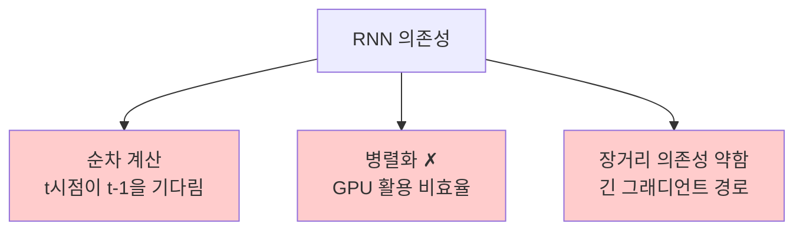

이 셋의 *공통 원인* 은 **순환 구조 그 자체**. 그렇다면 *순환을 없애면* 셋 다 풀린다.

### 1.2 Attention만으로 시퀀스를 다룰 수 있을까

> Vaswani, A., et al. (2017). *Attention Is All You Need*. *NeurIPS 2017*.[^1]

> *"Attention 메커니즘이 충분히 강력하다면, 굳이 RNN을 거칠 필요가 없지 않을까?"*

이 질문의 답이 **Self-Attention** — *시퀀스 안의 각 위치가 다른 모든 위치를 직접 본다*. 거리에 무관하게 *한 번에* 의존성을 잡고, 모든 위치를 *동시에* 계산할 수 있어 병렬화가 쉽다.

---

## 2. Self-Attention — 자기 자신을 보는 attention

### 2.1 무엇이 *self* 인가

[NLP ③](/ai/nlp-03-seq2seq-attention/)의 Bahdanau Attention은 *디코더가 인코더를 본다* — 두 시퀀스 사이의 attention이었다. **Self-Attention** 은 **하나의 시퀀스 안에서 각 위치가 같은 시퀀스의 다른 위치를 본다**.

```text
"The animal didn't cross the street because it was too tired"
```

여기서 *it* 이 가리키는 게 *animal* 인지 *street* 인지를 모델이 안다고 해보자. Self-attention이 학습되면 *it* 위치의 attention이 *animal* 에 강하게 걸린다 — *공지시 해소(coreference resolution)* 가 표현 자체에 들어간다.

### 2.2 Q, K, V — Attention의 일반화

Self-Attention의 가장 우아한 점은 모든 attention을 *세 가지 행렬* 로 추상화한 것이다.

| 기호 | 이름 | 직관 |
|---|---|---|
| **Q (Query)** | 질의 | *"나 지금 뭘 찾고 있지?"* — 정보를 *요청* 하는 쪽 |
| **K (Key)** | 키 | *"내가 가진 정보가 무엇인지 광고"* — 매칭 대상 |
| **V (Value)** | 값 | *"실제로 가져갈 정보"* — 합쳐질 페이로드 |

데이터베이스 비유:
- Q는 *검색어*
- K는 *인덱스*
- V는 *실제 레코드*

Q와 K의 *호환도* 로 가중치를 만들고, 그 가중치로 V를 *가중평균* 하면 결과가 나온다.

### 2.3 입력에서 Q, K, V 만들기

각 토큰 임베딩 *x* 를 세 개의 학습 가능한 행렬 *W_Q, W_K, W_V* 에 곱해서 만든다.

> **Q = X · W_Q,   K = X · W_K,   V = X · W_V**

여기서 X는 *시퀀스 길이 × 임베딩 차원* 행렬. 한 번의 행렬 곱으로 시퀀스 전체의 Q, K, V가 동시에 계산된다 — *완전한 병렬화*.

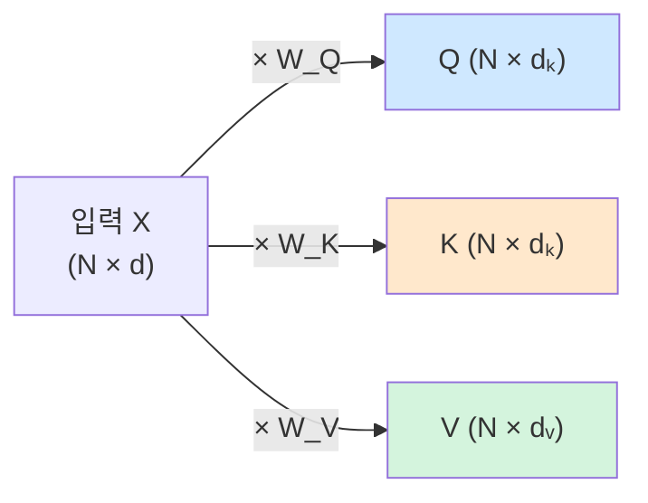

---

## 3. Scaled Dot-Product Attention — 핵심 수식


### 3.1 한 줄 정의

> **Attention(Q, K, V) = softmax( Q·Kᵀ / √dₖ ) · V**

이 한 줄에 Transformer의 핵심이 다 들어 있다. 한 항씩 뜯어보자.

### 3.2 Step by Step

#### Step 1: Q와 K의 내적 — 호환도 점수

> *score(qᵢ, kⱼ) = qᵢ · kⱼᵀ*

각 query와 각 key의 *내적* 으로 호환도를 잰다. 결과는 *N × N* 행렬 — 시퀀스 안의 *모든 위치 쌍* 사이의 점수.

#### Step 2: √dₖ로 나누기 — *Scaled*

> **scoresₛcₐₗₑd = (Q·Kᵀ) / √dₖ**

dₖ는 key의 차원. 왜 나눌까?

> *Q와 K의 차원이 커질수록 내적의 분산이 커진다. 분산이 크면 softmax가 *극단적으로 한쪽으로 쏠려* 그래디언트가 사라진다.*

논문 §3.2.1의 각주 4에 직접 명시된 이유. 차원 d_k를 쓰면 내적의 분산이 *대략 dₖ에 비례* 하므로 *√dₖ로 나눠 표준편차를 1로 보정* 한다.

> 🎯 **시험·면접 단골**: *"왜 Q·Kᵀ를 √dₖ로 나누는가?"* → *"내적의 분산을 안정화해 softmax 그래디언트가 죽는 걸 막기 위해"*. 이 한 줄.

#### Step 3: Softmax — 가중치 분포

> **αᵢⱼ = exp(scoresₛcₐₗₑd[i, j]) / Σₖ exp(scoresₛcₐₗₑd[i, k])**

각 query 위치 i에 대해 *모든 key 위치에 대한 확률 분포*. 합이 1.

#### Step 4: V에 가중평균

> **outputᵢ = Σⱼ αᵢⱼ · vⱼ**

가중치 α로 값(value) 벡터들을 합한다. 이게 위치 i의 *self-attention 출력*.

### 3.3 한 그림으로

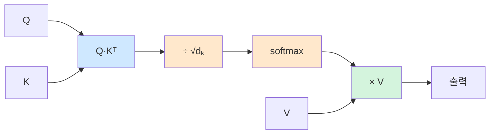

### 3.4 Bahdanau Attention과의 관계

| 측면 | **Bahdanau (additive)** | **Scaled Dot-Product** |
|---|---|---|
| Score 함수 | `vᵀ tanh(W₁s + W₂h)` | `qᵀk / √dₖ` |
| 학습 가능성 | MLP 한 층 학습 | W_Q, W_K가 흡수 |
| 계산 비용 | 더 비쌈 | 더 빠름 (행렬 곱 한 번) |
| 표현력 | 비슷 | 비슷 |

> 💡 *왜 dot-product를 골랐나*: 표현력은 비슷한데 *행렬 곱 하나로 끝나서 GPU에서 훨씬 빠름*. 대규모 학습에서 결정적 차이.

---

## 4. Multi-Head Attention — 여러 시점에서 동시에 보기

### 4.1 단일 attention의 한계

Self-Attention은 한 번에 *한 종류의 관계* 만 본다. 그런데 자연어에는 여러 차원의 관계가 동시에 있다 — *문법적 의존성, 공지시, 의미 유사성, 시제 대응*. 이걸 *하나의 attention 분포* 로 다 표현하긴 어렵다.

### 4.2 해법 — *여러 head를 병렬로*

> **MultiHead(Q, K, V) = Concat(head₁, ..., headₕ) · W_O**
>
> **headᵢ = Attention(Q · Wᵢ_Q, K · Wᵢ_K, V · Wᵢ_V)**

핵심:
1. *h개의 다른 (W_Q, W_K, W_V)* 로 *서로 다른 Q, K, V 부분공간* 을 만든다
2. 각 head가 *독립적으로* attention을 계산
3. 결과들을 *concat* 한 뒤 *W_O로 투영*

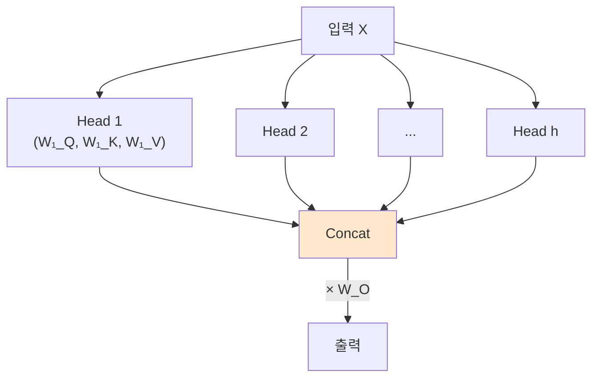

### 4.3 차원 설계

논문에서는 *d_model = 512, h = 8* 을 썼다.

> **dₖ = dᵥ = d_model / h = 512 / 8 = 64**

각 head는 *작은 차원(64)* 으로 attention을 계산하지만, 8개를 합치면 *원래 차원(512)* 으로 돌아간다. 총 계산량은 *단일 attention과 비슷* 하면서 *표현력은 풍부* 하다.

### 4.4 Head들이 각자 다른 걸 학습하는가

논문 부록 5에서 학습된 head들의 attention 패턴을 시각화. 어떤 head는 *문법적 의존성* (verb-object), 어떤 head는 *공지시* (it → animal), 어떤 head는 *근접 토큰 평균* 을 본다. 명시적 supervision 없이도 *다양한 언어 구조* 가 분리돼 학습된다.

> 🎯 **Multi-head 핵심**: *서로 다른 부분공간에서 서로 다른 관계를 동시에 학습*. 이게 단일 attention보다 강한 본질적 이유.

---

## 5. Positional Encoding — RNN을 뺐는데 순서는 어떻게

### 5.1 문제 — Self-Attention은 *순서를 모른다*

Self-Attention은 *집합(set) 연산* 이다. 토큰 순서를 바꿔도 *attention 결과는 같다* (순서에 따라 위치가 바뀌긴 하지만 토큰 자체의 표현은 변하지 않음). RNN은 시간 순으로 처리하니 순서가 자동으로 반영됐는데, RNN을 빼니 *순서 정보가 사라졌다*.

### 5.2 해법 — 위치 정보를 *임베딩에 더하기*

각 위치 *pos* 에 *고정된 벡터* PE(pos)를 더한다.

> **input_embeddingₚₒₛ = token_embeddingₚₒₛ + PE(pos)**

논문이 쓴 PE는 *사인·코사인 함수* 의 조합:

> **PE(pos, 2i) = sin(pos / 10000^(2i/d_model))**
> **PE(pos, 2i+1) = cos(pos / 10000^(2i/d_model))**

| 변수 | 의미 |
|---|---|
| *pos* | 시퀀스 안에서의 위치 (0, 1, 2, ...) |
| *i* | 임베딩 차원 인덱스 |
| *d_model* | 임베딩 전체 차원 (예: 512) |
| *10000* | 주파수 스케일 — 이 값으로 차원마다 다른 파장 부여 |

### 5.3 왜 sin·cos인가

세 가지 이유.

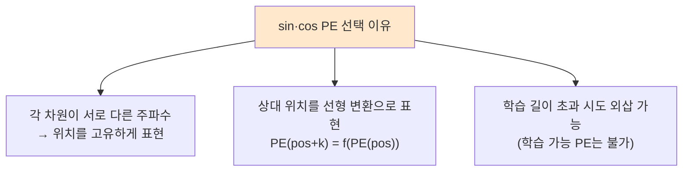

논문 §3.5에서 *학습 가능한 positional embedding* 과 *sin·cos PE* 를 비교했고, 성능은 거의 같았다. *외삽 가능성* 때문에 sin·cos를 선호.

> 💡 후속 모델에서는 *학습 가능한 PE* (BERT), *상대 위치 PE* (Transformer-XL, T5), *RoPE* (LLaMA) 등 다양한 변형이 등장. PE는 지금도 활발히 연구되는 영역.

### 5.4 작은 예시

d_model = 4, pos = 0, 1, 2일 때 PE:

```
PE(0) = [sin(0),    cos(0),    sin(0),    cos(0)   ] = [0,    1,    0,    1   ]
PE(1) = [sin(1),    cos(1),    sin(1/100), cos(1/100)] ≈ [0.84, 0.54, 0.01, 1.00]
PE(2) = [sin(2),    cos(2),    sin(2/100), cos(2/100)] ≈ [0.91, -0.42, 0.02, 1.00]
```

각 위치가 *서로 다른 벡터* 로 식별된다. 그리고 *상대 거리* 가 *벡터 간 관계* 로 표현된다.

---

## 6. Encoder Block — 한 층의 풀스택

이제 Transformer의 *기본 빌딩 블록* — 인코더 한 층 — 을 조립할 차례.

### 6.1 한 층의 구조

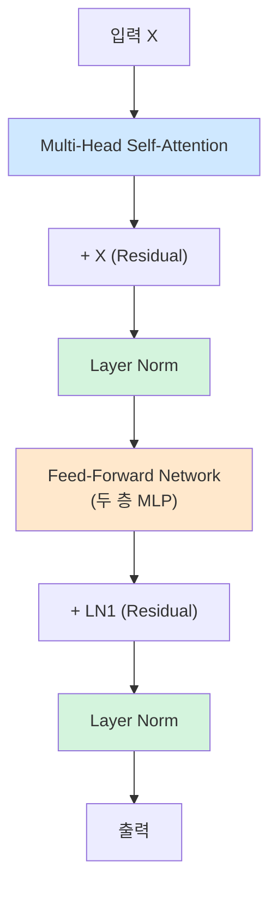

### 6.2 부품별 역할

| 부품 | 역할 |
|---|---|
| **Multi-Head Self-Attention** | 시퀀스 내부의 *위치 간 관계* 를 학습 |
| **Feed-Forward Network (FFN)** | 위치별 *비선형 변환* — 표현력 강화 |
| **Residual Connection** | 깊은 망 학습을 가능하게 — 그래디언트가 *지름길* 로 흐름 |
| **Layer Normalization** | 각 층의 *입력 분포 안정화* — 학습 안정성 |

### 6.3 Feed-Forward Network 상세

> **FFN(x) = max(0, x·W₁ + b₁) · W₂ + b₂**

ReLU 활성화를 가진 *두 층짜리 MLP*. 핵심은:

| 측면 | 값 |
|---|---|
| 입력 차원 | d_model = 512 |
| 중간 차원 | d_ff = 2048 (4배 확장) |
| 출력 차원 | d_model = 512 |
| 적용 단위 | *위치별로 독립* (position-wise) — 같은 FFN을 모든 위치에 |

> 💡 FFN은 *위치 간 정보 교환* 을 하지 않는다. 그건 self-attention의 일. FFN은 각 위치에서 *비선형 표현 변환* 만 담당.

### 6.4 Residual Connection의 역할

[He et al. (2016) ResNet](/ai/ai-advanced-cnn/)에서 확인된 결과 — *잔차 연결* 이 깊은 망 학습을 가능하게 한다. Transformer는 보통 *6~96층* 을 쌓으므로 잔차 연결이 필수.

> *output = LayerNorm(x + Sublayer(x))*

이 식이 한 층의 *Pre/Post-LayerNorm* 변형의 출발점.

### 6.5 Layer Normalization

배치 정규화(Batch Normalization)와 달리 *한 시퀀스 안의 한 토큰* 단위로 정규화.

> *LayerNorm(x) = γ · (x − μ) / σ + β*

- *μ, σ*: 한 토큰의 d_model 차원에 대한 평균·표준편차
- *γ, β*: 학습 가능한 스케일·시프트

배치 사이즈에 무관하게 작동하므로 *작은 배치·가변 길이* 에 강함.

---

## 7. Decoder Block — 두 가지 차이

### 7.1 인코더와 다른 두 가지

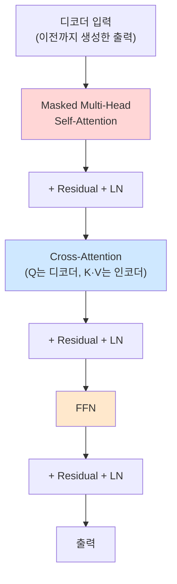

| 차이 | 인코더 | 디코더 |
|---|---|---|
| Self-Attention | 일반 | **Masked** (미래 위치 차단) |
| Cross-Attention | 없음 | **있음** (인코더 출력을 본다) |

### 7.2 Masked Self-Attention — *미래를 보면 안 된다*

언어 모델은 *지금까지 본 단어로 다음 단어를 예측* 한다. 그런데 self-attention은 기본적으로 *모든 위치를 본다*. 학습 시에 *정답 출력 시퀀스* 가 통째로 들어가는데, 위치 t에서 *t+1 이후* 를 보면 *cheating* 이다.

해법 — attention score 행렬에서 *미래 위치를 -∞로 마스킹*:

```text
원본 score:        Masked score:
[ s₁₁ s₁₂ s₁₃ ]    [ s₁₁ -∞  -∞ ]
[ s₂₁ s₂₂ s₂₃ ] →  [ s₂₁ s₂₂ -∞ ]
[ s₃₁ s₃₂ s₃₃ ]    [ s₃₁ s₃₂ s₃₃]
```

softmax 후에는 *미래 위치 가중치가 0* 이 된다. *과거와 현재만* 보고 다음을 예측 — 학습 시에도 추론 조건과 일치.

### 7.3 Cross-Attention — 인코더 정보 가져오기

이게 [NLP ③](/ai/nlp-03-seq2seq-attention/)의 *Bahdanau Attention과 같은 일을 하는 부분*. 다만 식 구조가 통일됐다.

> **Q = 디코더 현재 층의 출력**
> **K, V = 인코더 최종 층의 출력**

디코더가 *지금 만들 단어* 의 query를 가지고, 인코더의 *원문 표현* 에서 *어디를 볼지* 를 결정한다. 기계 번역에서 정렬(alignment)이 자동 학습되는 메커니즘이 그대로 살아 있다.

---

## 8. 전체 아키텍처 한눈에

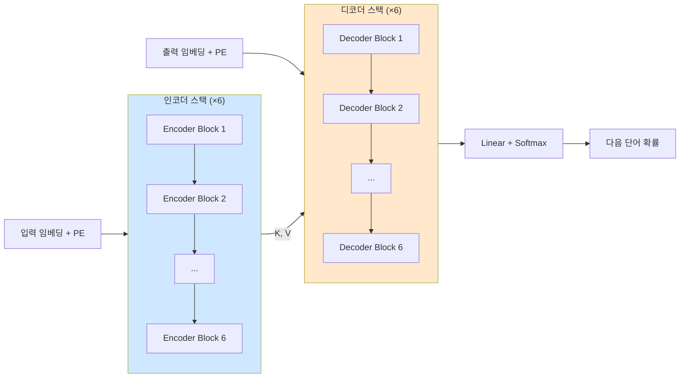

| 부품 | 차원/수 (논문 base 모델) |
|---|---|
| 인코더·디코더 층 수 | 6 each |
| d_model | 512 |
| Multi-Head 수 (h) | 8 |
| dₖ = dᵥ | 64 |
| FFN 중간 차원 (d_ff) | 2048 |
| 총 파라미터 수 | 65M |

*Big 모델* 은 d_model=1024, h=16, d_ff=4096, 213M 파라미터.

---

## 9. 학습 트릭 — *수치 안정성과 일반화*

### 9.1 Optimizer — Adam with custom β₂

> **β₁ = 0.9, β₂ = 0.98, ε = 10⁻⁹**

표준 β₂ = 0.999 대신 *0.98* 을 쓴다. *학습 초반 분산 추정이 빠르게 변해야* 학습이 안정. Transformer 학습이 민감해서 이런 디테일이 결과를 가른다.

### 9.2 Warmup Learning Rate

> **lr = d_model⁻⁰·⁵ · min(step⁻⁰·⁵, step · warmup⁻¹·⁵)**

학습률을 *warmup_steps까지 선형 증가* → 이후 *step의 역제곱근으로 감쇠*. 보통 warmup_steps = 4000.

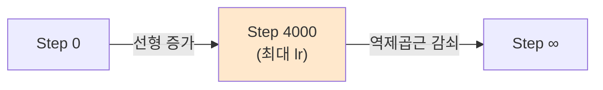

> 💡 *왜 warmup이 필요한가*: 초기 가중치는 무작위라 *큰 학습률을 견디지 못한다*. 천천히 끌어올려 안정화한 뒤 본격 학습.

### 9.3 Label Smoothing

정답 라벨을 *완전한 one-hot* 으로 두지 않고, *정답 0.9, 나머지 0.1/(V-1)* 로 살짝 부드럽게.

> 효과: *모델이 정답에 너무 자신감을 갖지 않게* 해서 *일반화 성능* ↑. BLEU 향상 확인.

### 9.4 Dropout

- 모든 sublayer 출력에 *p = 0.1*
- 임베딩 + PE 합 후에도 *p = 0.1*

과적합 방지. 큰 모델일수록 dropout 비중이 커짐.

---

## 10. 결과 — *같은 BLEU를 훨씬 빠르게*

### 10.1 영어 → 독일어, 영어 → 프랑스어 WMT'14

| 모델 | 영-독 BLEU | 영-불 BLEU | 학습 시간 |
|---|---|---|---|
| GNMT (Wu 2016, RNN+Attention) | 24.6 | 38.95 | ~수 주 |
| ConvS2S (Gehring 2017, CNN+Attention) | 25.2 | 40.46 | ~며칠 |
| **Transformer base (2017)** | **27.3** | **38.1** | **12시간 (8 GPU)** |
| **Transformer big (2017)** | **28.4** | **41.0** | **3.5일 (8 GPU)** |

핵심 메시지:
- *BLEU 점수도 더 높음* — 새 SOTA
- *학습 시간이 압도적으로 짧음* — 같은 결과를 *수십 배* 빠르게

### 10.2 *왜* 이렇게 빠른가

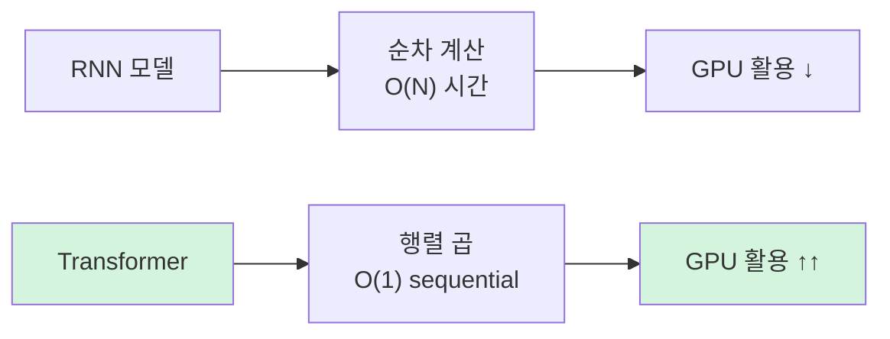

| 측면 | RNN | Self-Attention |
|---|---|---|
| Sequential ops | O(N) | O(1) |
| 시간 복잡도 | O(N · d²) | O(N² · d) |
| 병렬화 | ✗ | ✓ |
| 장거리 의존 경로 | O(N) | O(1) |

*N²이 늘어나는 비용* 이 있긴 하지만, GPU 병렬화 효과가 압도적. 그리고 *장거리 의존성을 한 번에* 잡는 게 결정적 강점.

> 🎯 **Transformer가 NLP를 다시 쓴 두 가지 이유**: (1) *학습 속도가 폭발적으로 빨라져* 큰 모델·큰 데이터가 가능 (2) *장거리 의존성* 이 거리에 무관해져 표현력 ↑. 이 두 가지가 곧 *LLM 시대의 토대*.

---

## 11. 영향 — *Transformer 이후*

논문 한 편이 NLP 전체와 그 너머까지 다시 썼다.

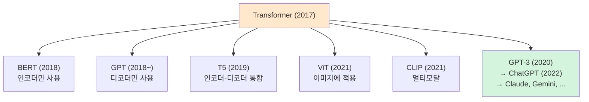

다음 편 [NLP ⑤] 에서는 *BERT(인코더-only)* 와 *GPT(디코더-only)* 가 같은 Transformer 위에서 *왜 정반대 방향* 으로 갈라졌는지를 본다. 사전학습 패러다임의 두 갈래.

---

## 12. 정리

이 글에서 다룬 내용을 한 줄로 압축하면:

- **Transformer**는 RNN을 빼고 *attention만으로* 시퀀스를 처리한 첫 모델
- **Self-Attention**: 시퀀스 내 모든 위치가 서로를 본다. *Q · K · V* 추상화로 표현
- **Scaled Dot-Product Attention**: `softmax(QKᵀ/√dₖ)V`. *√dₖ로 나누는* 이유는 *내적 분산 안정화*
- **Multi-Head Attention**: *서로 다른 부분공간* 에서 *서로 다른 관계* 를 동시에 학습
- **Positional Encoding**: sin·cos로 *위치 정보를 임베딩에 더해서* 순서를 알린다
- **Encoder block**: Self-Attention + FFN + Residual + LayerNorm
- **Decoder block**: *Masked* Self-Attention + *Cross-Attention* + FFN + Residual + LayerNorm
- 학습 트릭 — *Adam β₂=0.98, Warmup, Label Smoothing, Dropout 0.1*
- 같은 BLEU를 *수십 배 빠르게* 달성. *큰 모델·큰 데이터의 시대* 를 열었다
- 다음 편 [NLP ⑤] — *BERT vs GPT*, 같은 Transformer 위의 두 사전학습 갈래

---

## 13. 추가로 공부하면 좋을 개념

- **The Annotated Transformer** (Rush, 2018)[^2]: 논문을 PyTorch 코드로 *한 줄 한 줄* 따라가는 자료. 구현 디테일까지 이해하고 싶다면 필독
- **The Illustrated Transformer** (Alammar, 2018)[^3]: 시각적 직관에 강한 보조 자료. 이 글의 그림 다수가 여기서 영감
- **상대 위치 인코딩 (Relative Position Encoding)**: Transformer-XL (Dai 2019), T5 (Raffel 2020)에서 등장. sin·cos 절대 PE의 외삽 한계 보완
- **RoPE (Rotary Positional Encoding)**: LLaMA 등이 채택한 *회전 행렬 기반 PE*. 긴 컨텍스트에 강함 (Su et al., 2021)
- **Sparse Attention / Linear Attention**: O(N²) 비용을 줄이려는 시도들 — Longformer, Reformer, Performer 등. 긴 문서 처리에 필수
- **FlashAttention** (Dao 2022): 메모리 효율적 attention 구현. 현대 LLM 학습/추론의 표준
- **Pre-LN vs Post-LN**: 논문은 Post-LN이지만, 후속 연구는 *Pre-LN이 더 안정적* 임을 보임. 현대 구현은 대부분 Pre-LN

> ✍️ **다음 학습**: [NLP ⑤] BERT vs GPT — Encoder-only vs Decoder-only, 사전학습 패러다임. 작성 예정.

---

## 참고 문헌 (References)

[^1]: Vaswani, A., Shazeer, N., Parmar, N., Uszkoreit, J., Jones, L., Gomez, A. N., Kaiser, Ł., & Polosukhin, I. (2017). "Attention Is All You Need." *NeurIPS 2017*. *arXiv:1706.03762*.

[^2]: Rush, A. M. (2018). "The Annotated Transformer." *Harvard NLP*. <http://nlp.seas.harvard.edu/annotated-transformer/>

[^3]: Alammar, J. (2018). "The Illustrated Transformer." <https://jalammar.github.io/illustrated-transformer/>

[^4]: Jurafsky, D., & Martin, J. H. (2024). *Speech and Language Processing* (3rd ed. draft), Ch. 10 (Transformers). <https://web.stanford.edu/~jurafsky/slp3/>

---

## 부록 A. 이미지 생성 프롬프트

> 본 글은 Mermaid 차트가 풍부하지만, Transformer는 시리즈에서 가장 핵심적인 모델이라 두 장의 보조 이미지는 두면 좋다.

### A1. Transformer 전체 아키텍처 (`transformer_architecture.png`)

> 📁 저장 경로: `/assets/images/nlp/transformer_architecture.png`

```
Detailed technical illustration of the full Transformer architecture
based on Vaswani et al. (2017). Left side: encoder stack with N=6
identical blocks, each containing Multi-Head Self-Attention, Add &
Norm, Feed-Forward, Add & Norm. Right side: decoder stack with N=6
blocks, each containing Masked Multi-Head Self-Attention, Add & Norm,
Multi-Head Cross-Attention (arrows from encoder output), Add & Norm,
Feed-Forward, Add & Norm. Bottom: input/output embeddings with
positional encodings shown as sinusoidal waves added. Top: final
Linear + Softmax producing output probabilities. Clean technical
diagram style, labeled boxes, residual connections shown as curved
arrows bypassing each sublayer. White background, blue/orange/green
accent palette. 16:9.

CRITICAL: 이미지 내 모든 문자/라벨은 반드시 한글로 표시. 영문 텍스트 금지
(단, 표준 약어 N=6, Q, K, V, PE, FFN, LayerNorm, Softmax는 그대로 유지).
라벨:
- 좌측 스택 제목: "인코더 (N=6)"
- 우측 스택 제목: "디코더 (N=6)"
- 인코더 블록 내부: "Multi-Head Self-Attention", "잔차 연결 + Layer Norm", "Feed-Forward (위치별)"
- 디코더 블록 내부: "Masked Multi-Head Self-Attention", "Cross-Attention (Q는 디코더, K·V는 인코더)"
- 인코더 → 디코더 연결 화살표: "K, V (인코더 최종 출력)"
- 하단 좌측: "입력 임베딩 + 위치 인코딩 (PE)"
- 하단 우측: "출력 임베딩 + PE"
- 상단: "Linear + Softmax → 다음 단어 확률"
- 하단 가운데: "Transformer 전체 구조 (Vaswani et al., 2017)"
```

### A2. Scaled Dot-Product Attention 흐름 (`scaled_dot_product_attention.png`)

> 📁 저장 경로: `/assets/images/nlp/scaled_dot_product_attention.png`

```
Step-by-step illustration of the Scaled Dot-Product Attention mechanism.
Left to right flow: input X (sequence of embeddings) splits into three
parallel projections producing Q, K, V matrices via learnable weight
matrices W_Q, W_K, W_V. The Q and K matrices then multiply (matmul)
to produce a score matrix; this is divided by √dₖ for scaling,
optionally masked (shown as upper-triangular gray overlay for decoder
case), then passed through softmax to produce attention weights α.
Finally, α multiplies V to yield the output. Each step labeled with
its formula. Clean technical diagram with clearly separated stages,
blue/orange/green color coding for Q/K/V, modern educational
illustration. White background. 16:9.

CRITICAL: 이미지 내 모든 문자/라벨은 반드시 한글로 표시. 영문 텍스트 금지
(단, 수학 기호 X, Q, K, V, W_Q, W_K, W_V, α, dₖ, √, ·, ᵀ, softmax는 그대로 유지).
라벨:
- 좌측 입력: "입력 X (시퀀스 × 임베딩 차원)"
- Q/K/V 박스: "쿼리 Q", "키 K", "값 V"
- 가중치 행렬 라벨: "× W_Q", "× W_K", "× W_V"
- 첫 번째 곱셈 박스: "Q · Kᵀ (호환도 점수)"
- 스케일 박스: "÷ √dₖ (분산 안정화)"
- 마스크 박스 (선택적): "마스킹 (디코더 전용)"
- 소프트맥스 박스: "softmax → 가중치 α"
- 마지막 곱셈 박스: "α · V (가중평균)"
- 우측 출력: "출력"
- 하단 가운데: "Scaled Dot-Product Attention — Attention Is All You Need"
```

> 💡 위 프롬프트는 모두 본문 텍스트에 의존하지 않는 자기 완결형 이미지를 만들도록 작성됐다.
