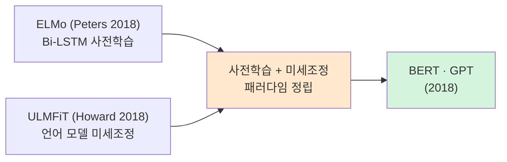
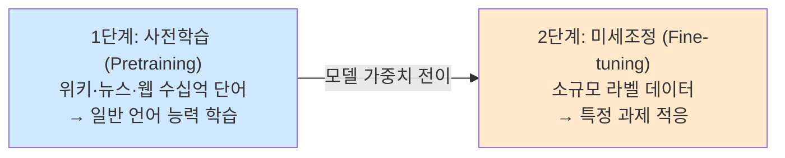
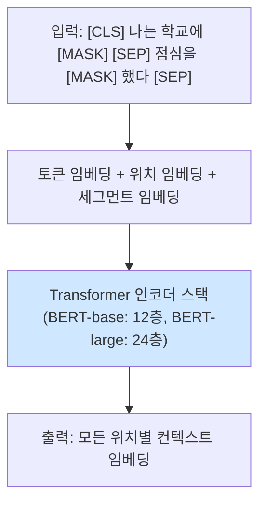
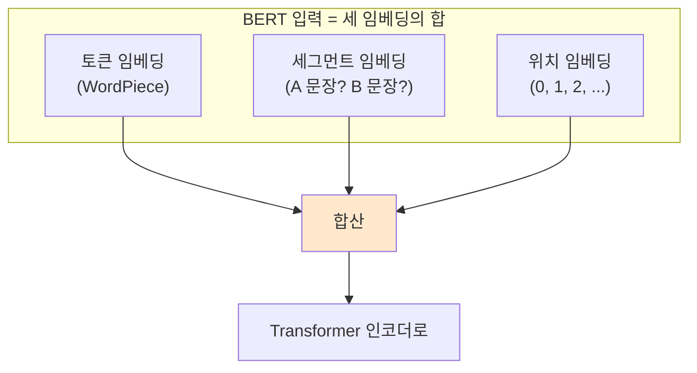
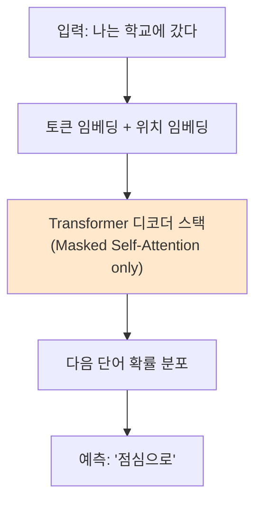
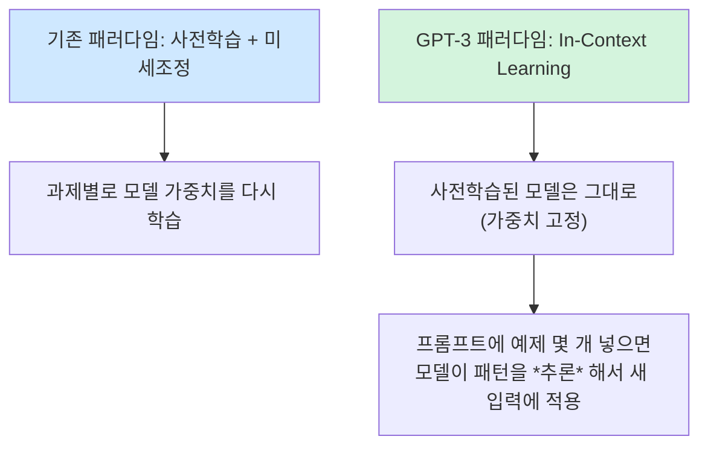
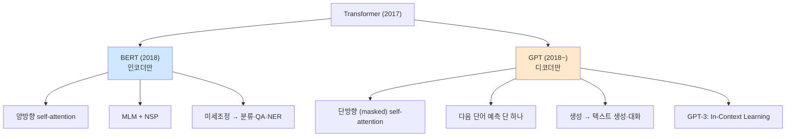
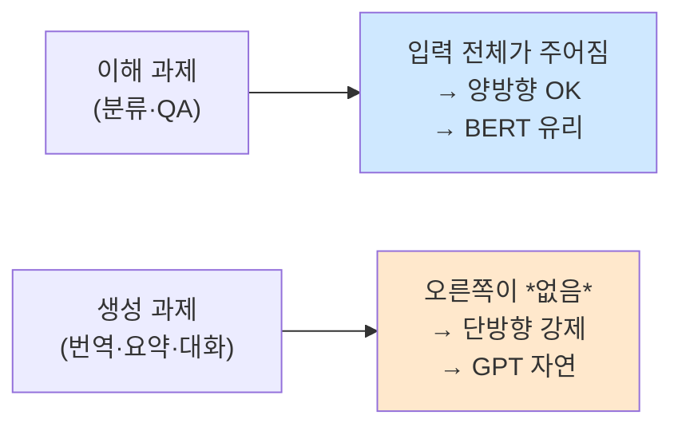
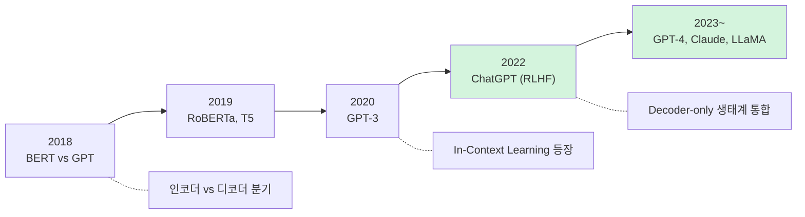

> **이 글의 목적**
>
> [NLP ④](/ai/nlp-04-transformer/)에서 *Transformer* 라는 통일된 빌딩 블록을 정리했다. 그 위에서 NLP는 *두 갈래로 갈라졌다*.
>
> - **BERT** (2018, Google): Transformer의 **인코더만** 떼서 *양방향 이해* 에 특화 → 분류·QA·NER에서 SOTA 갱신
> - **GPT** (2018, OpenAI): Transformer의 **디코더만** 떼서 *단방향 생성* 에 특화 → 결국 *ChatGPT* 까지 도달
>
> 같은 Transformer 위에서 *왜 정반대 방향* 으로 갈라졌고, 각각이 무엇을 잘 하며, 무엇이 결정적 차이를 만들었나. 이 편이 LLM 시대로 가는 마지막 다리다.
>
> 정리는 *Devlin et al. (2019)*[^1], *Radford et al. (2018, 2019)*[^2][^3], *Brown et al. (2020)*[^4]의 원전 논문과 *Howard & Ruder (2018)*[^5], *Peters et al. (2018)*[^6]의 사전 작업, *Jurafsky & Martin*의 *SLP* Ch.11[^7]을 토대로 했다.
>
> **읽고 나면 답할 수 있는 질문**:
>
> - **사전학습-미세조정** 패러다임이 NLP를 어떻게 바꿨나
> - **BERT**의 두 사전학습 과제 — *MLM(Masked Language Model)* 과 *NSP(Next Sentence Prediction)*
> - 왜 BERT는 *양방향* 인가, 그게 GPT의 *단방향* 과 어떻게 본질적으로 다른가
> - BERT 입력의 `[CLS]`, `[SEP]`, *segment embedding* 의 역할
> - **GPT**의 학습 목표는 왜 *다음 단어 예측* 단 하나인가
> - **GPT-1 → GPT-2 → GPT-3** 의 핵심 변화 — *Fine-tuning에서 In-Context Learning으로*
> - 같은 Transformer인데 왜 *생성은 GPT, 이해는 BERT* 로 갈라졌나
> - **T5** 가 둘을 다시 *통합* 한 방식 — *모든 NLP를 텍스트 → 텍스트* 로

---

## 1. 사전학습-미세조정 패러다임의 등장

### 1.1 *왜* 갑자기 사전학습인가

2018년 이전까지 NLP의 표준은 *과제별로 처음부터 학습* 하는 것이었다. 감성 분석, NER, QA — 각자 라벨링된 데이터를 가지고 *밑바닥부터 모델을 훈련*. 라벨이 적은 도메인은 성능이 낮을 수밖에 없었다.

이 흐름을 깬 직접적 선구자는 두 편의 논문이다.



> 핵심 발상: *대규모 비라벨 텍스트* 로 *언어 자체를 먼저 배우고*, 그 모델을 *소규모 라벨 데이터로 미세조정* 하면 거의 모든 NLP 과제가 좋아진다.

### 1.2 두 단계



| 단계 | 데이터 | 목표 | 자원 |
|---|---|---|---|
| **사전학습** | 비라벨 대규모 텍스트 | *언어 자체* 학습 | 막대 (GPU 수백·수천) |
| **미세조정** | 라벨된 과제별 소규모 | 특정 과제 적응 | 적당 (GPU 1~수십) |

이 패러다임 위에서 BERT와 GPT가 갈라진다.

---

## 2. BERT — Encoder-only, 양방향 이해

### 2.1 출발점

> Devlin, J., Chang, M.-W., Lee, K., & Toutanova, K. (2019). *BERT: Pre-training of Deep Bidirectional Transformers for Language Understanding*.[^1]

> *"분류·QA·NER 같은 *이해* 과제는 문장의 *양쪽 문맥* 을 모두 보는 게 자연스럽다. Transformer 인코더는 self-attention이 기본적으로 양방향이니, 인코더만 떼서 사전학습하면 어떨까?"*

### 2.2 BERT의 구조



핵심 디자인 결정:

| 측면 | BERT-base | BERT-large |
|---|---|---|
| 인코더 층 수 | 12 | 24 |
| 은닉 차원 | 768 | 1024 |
| Multi-Head 수 | 12 | 16 |
| 파라미터 수 | 110M | 340M |
| 학습 데이터 | BooksCorpus + Wikipedia (~3.3B 단어) | 동일 |

### 2.3 사전학습 과제 1 — Masked Language Model (MLM)


이게 BERT의 *결정적 발명*. 입력 토큰의 *15%를 무작위로 가린* 뒤(`[MASK]` 토큰으로 대체), *그 위치의 원래 단어를 맞히게* 학습한다.

```text
원문:    나는 학교에 갔다
입력:    나는 학교에 [MASK]
정답:    갔다
```

#### 왜 MLM인가

기존 언어 모델(GPT 같은)은 *다음 단어 예측* 이라 *단방향* 이다 — 왼쪽만 보고 오른쪽을 맞힌다. 그런데 분류·QA에서는 *양쪽 문맥* 이 다 필요하다. *"the bank of the river"* 의 *bank* 가 강가를 뜻하는 걸 알려면 *오른쪽의 river* 를 봐야 한다.

MLM은 이 문제를 우회한다. *가린 단어를 양쪽 문맥으로 맞히기* — 이게 양방향 self-attention과 자연스럽게 맞물린다.

#### 15%의 함정 — 학습-추론 불일치

학습 시에는 `[MASK]` 토큰이 입력에 등장하지만, *추론(미세조정·실사용)* 시에는 그런 토큰이 없다. 이 불일치를 줄이려고 BERT는 *15% 마스킹 대상* 을 다음과 같이 처리:

| 처리 | 비율 | 예 |
|---|---|---|
| `[MASK]`로 대체 | 80% | *나는 학교에 [MASK]* |
| **무작위 다른 단어** | 10% | *나는 학교에 사과* |
| **그대로 유지** | 10% | *나는 학교에 갔다* (그래도 정답 맞히기 학습) |

> 💡 *왜 이런 비율*: 모델이 `[MASK]` 토큰에만 의존하지 않고, *모든 위치의 표현을 항상 맥락 기반으로* 만들도록 강제. 추론 시에 마스크가 없어도 표현 품질이 유지된다.

### 2.4 사전학습 과제 2 — Next Sentence Prediction (NSP)

두 문장을 *이어서* 입력하고, 두 번째 문장이 *진짜 다음 문장인지 무작위 문장인지* 분류.

```text
입력:  [CLS] 나는 학교에 갔다 [SEP] 점심으로 김밥을 먹었다 [SEP]
정답:  IsNext (진짜 이어지는 문장)

입력:  [CLS] 나는 학교에 갔다 [SEP] 화성은 붉은 행성이다 [SEP]
정답:  NotNext (무관한 문장)
```

목표: *문장 간 관계* 를 학습 — QA·NLI(자연어 추론)·문장 쌍 분류에 도움.

> ⚠️ **후속 연구의 반전**: *RoBERTa (Liu et al., 2019)* 는 NSP를 *제거* 했더니 성능이 *오히려 향상* 됐음을 보고. NSP의 효용은 논쟁적이고 현대 BERT 변형은 NSP를 빼는 추세.

### 2.5 입력 형식의 디테일



특수 토큰:

| 토큰 | 역할 |
|---|---|
| `[CLS]` | 시퀀스 맨 앞. *전체 시퀀스 표현* 으로 사용 (분류 과제) |
| `[SEP]` | 문장 경계 표시 |
| `[MASK]` | MLM에서 가려진 위치 |
| `[PAD]` | 패딩 |

> 💡 [NLP ④](/ai/nlp-04-transformer/)의 *sin·cos 위치 인코딩* 과 달리 BERT는 *학습 가능한 위치 임베딩* 을 쓴다. 외삽 가능성보다 *학습 데이터 길이 안에서의 표현력* 을 우선.

### 2.6 미세조정 — *어떻게 활용하는가*

사전학습된 BERT를 *과제별로 살짝 더 학습* 한다. 과제 종류별 입력·출력 매핑:

| 과제 | 입력 형식 | 출력 |
|---|---|---|
| **문장 분류** (감성·스팸) | `[CLS] 문장 [SEP]` | `[CLS]` 위치 표현 → 분류 head |
| **문장 쌍 분류** (NLI·STS) | `[CLS] 문장1 [SEP] 문장2 [SEP]` | `[CLS]` 표현 → 분류 |
| **QA** (SQuAD) | `[CLS] 질문 [SEP] 본문 [SEP]` | 본문 토큰별 *시작·끝* 위치 예측 |
| **NER · 품사 태깅** | `[CLS] 문장 [SEP]` | 토큰별 라벨 분류 |

### 2.7 결과 — *11개 NLP 과제 SOTA*

BERT 논문은 *11개의 표준 벤치마크에서 SOTA* 를 동시에 갱신했다.

| 벤치마크 | BERT 이전 SOTA | BERT-large |
|---|---|---|
| GLUE 평균 | 70.0 | **82.1** |
| SQuAD v1.1 F1 | 91.7 | **93.2** |
| SWAG | 59.2 | **86.3** |

NLP 학계가 *"BERT 이전과 이후"* 로 나뉘었다고 평가받을 만큼의 충격.

> 🎯 **시험·면접 단골**: *"BERT의 두 사전학습 과제는?"* → *MLM (Masked LM) + NSP (Next Sentence Prediction)*. *"BERT는 양방향, GPT는 단방향"* 이 한 줄.

---

## 3. GPT — Decoder-only, 단방향 생성

### 3.1 출발점

> Radford, A., Narasimhan, K., Salimans, T., & Sutskever, I. (2018). *Improving Language Understanding by Generative Pre-Training*. (GPT-1)[^2]

> *"왼쪽에서 오른쪽으로 *다음 단어를 예측* 하는 가장 자연스러운 언어 모델 목표를 그대로 두자. 대신 모델을 Transformer 디코더로 키우고, 데이터를 폭발적으로 늘리자."*

GPT-1은 BERT보다 *4개월 먼저* 나왔다. 그런데 11개 SOTA를 휩쓴 BERT의 임팩트가 더 커서 *2018년은 BERT의 해* 로 기록됐다. 그러나 *장기적 흐름은 GPT 쪽이 더 컸다* — ChatGPT까지 이어진 갈래.

### 3.2 GPT의 구조



| 측면 | GPT-1 | GPT-2 | GPT-3 |
|---|---|---|---|
| 출시 연도 | 2018 | 2019 | 2020 |
| 디코더 층 수 | 12 | 48 | 96 |
| 은닉 차원 | 768 | 1600 | 12288 |
| 파라미터 수 | **117M** | **1.5B** | **175B** |
| 학습 데이터 | BooksCorpus | WebText (40GB) | CommonCrawl 등 (~570GB) |

> 💡 핵심 차이: *층 수보다 모델 크기와 데이터 크기가 폭발적으로 증가*. 이게 다음 편 [NLP ⑥]의 *Scaling Laws* 와 직결.

### 3.3 사전학습 과제 — *다음 단어 예측 단 하나*

> **L = - Σₜ log P(wₜ | w₁, ..., wₜ₋₁)**

전통적 *autoregressive language model*. *왼쪽까지의 단어로 다음 단어를 예측*. BERT가 두 과제(MLM+NSP)를 쓴 것과 대조적으로 GPT는 *오직 이 하나*.

#### Masked Self-Attention의 의미

[NLP ④](/ai/nlp-04-transformer/) §7에서 본 *Masked Self-Attention*. GPT는 디코더만 쓰므로 *모든 self-attention이 마스킹된다* — 위치 t에서 *t+1 이후* 를 보면 cheating이니까.

이게 BERT와의 *근본적 구조 차이*:

| 모델 | Self-Attention 방향 |
|---|---|
| **BERT** (인코더) | *양방향* — 모든 위치가 모든 위치 본다 |
| **GPT** (디코더) | *단방향* — 위치 t는 t 이전만 본다 |

### 3.4 GPT-1 → GPT-2 — *모델·데이터 키우면?*

> Radford, A., Wu, J., Child, R., Luan, D., Amodei, D., & Sutskever, I. (2019). *Language Models are Unsupervised Multitask Learners*. (GPT-2)[^3]

GPT-1과 같은 구조에 *1.5B 파라미터·40GB 데이터*. 결과는 충격적:

> *"모델이 명시적으로 학습하지 않은 과제도 *그냥 잘 한다*."*

요약·번역·QA를 *미세조정 없이* 해버렸다 — *zero-shot* 으로. 이게 *In-Context Learning* 의 시작점.

> ⚠️ OpenAI는 처음에 *위험성* 을 이유로 GPT-2의 *전체 모델 공개를 미뤘다*. NLP 모델이 *공개 보류 정책의 대상* 이 된 첫 사례. 학계 논쟁의 시작.

### 3.5 GPT-3 — *In-Context Learning의 본격화*

> Brown, T. B., et al. (2020). *Language Models are Few-Shot Learners*. (GPT-3)[^4]

175B 파라미터. 핵심 발견은 모델 크기가 아니라 **In-Context Learning** 이라는 새로운 활용 패러다임이다.



#### Zero-shot · One-shot · Few-shot

```text
[Few-shot 프롬프트 예시]
영어: I am happy
한국어: 나는 행복해

영어: She is reading
한국어: 그녀는 책을 읽고 있어

영어: We are hungry
한국어: ___

→ GPT-3가 빈칸을 "우리는 배고파" 로 채움
```

미세조정 없이, *몇 개의 예제만으로* 새 과제를 푼다. 이게 *NLP의 작동 방식 자체* 를 바꿨다.

### 3.6 GPT-3 → ChatGPT — *RLHF로 정렬*

GPT-3은 강력하지만 *지시를 따르는 데는 서툴렀다*. 이걸 푸는 결정타가 **RLHF (Reinforcement Learning from Human Feedback)** — 다음 편 [NLP ⑥]에서 본격적으로 다룸.

> 💡 *왜 ChatGPT가 갑자기 *말이 통하게* 됐나*: GPT-3 자체가 아니라 *RLHF로 정렬된 InstructGPT/ChatGPT* 가 결정적이다. 모델 크기보다 *학습 목표의 변화* 가 핵심.

---

## 4. BERT vs GPT — 한눈에 비교



| 측면 | **BERT** | **GPT** |
|---|---|---|
| Transformer 부품 | **Encoder only** | **Decoder only** |
| Self-Attention | 양방향 | 단방향 (Masked) |
| 사전학습 목표 | MLM + NSP | 다음 단어 예측 |
| 강점 | *이해* — 분류·QA·NER | *생성* — 텍스트·대화 |
| 활용 방식 | Fine-tuning | Fine-tuning → **In-Context Learning** |
| 출력 | 위치별 컨텍스트 표현 | 다음 단어 확률 분포 |
| 개발 주체 | Google | OpenAI |
| 첫 출시 | 2018-10 | 2018-06 (GPT-1) |
| 후속 | RoBERTa, ALBERT, DeBERTa | GPT-2, 3, 4, ChatGPT |

> 🎯 **한 줄 요약**: *"BERT는 이해, GPT는 생성. 그래서 양방향이냐 단방향이냐가 결정적으로 다르다."*

---

## 5. 왜 갈라졌는가 — Encoder vs Decoder의 본질

### 5.1 양방향이 *항상* 좋은가

직관적으로는 *양쪽을 다 보는 게* 정보가 많으니 좋아 보인다. 그런데 *생성 과제* 에서는 *불가능하다*. 다음 단어를 만들 때 *그 단어의 오른쪽* 을 알 수 없으니까.



이게 BERT와 GPT가 *과제 영역으로 갈라진* 본질적 이유.

### 5.2 그런데 *생성에 BERT를 쓸 수도 있나*

원리적으로 가능하지만 어색하다. BERT는 *모든 위치를 동시에 보는* 사전학습을 했으니, *왼쪽에서 오른쪽으로 한 단어씩 만드는* 추론 모드와 *학습 분포가 다르다*. 시도된 변형들(MASS, BART, T5)이 있지만 결국 *디코더를 따로 두는 인코더-디코더* 구조로 회귀.

### 5.3 그럼 *이해에 GPT를 쓸 수도 있나*

가능하다. 그리고 *충분히 크면* 잘 된다. GPT-3은 *zero-shot으로 분류·QA를 풀어버렸다*. 단방향이라는 *불리함* 을 *모델 크기·데이터 크기* 로 압도한 셈.

> 💡 이 결과가 NLP의 흐름을 한 번 더 바꿨다 — *"인코더-only가 이해에 유리하다"* 는 통념이 *"충분히 큰 디코더-only가 모든 걸 한다"* 로 옮겨갔고, 그게 *현대 LLM(GPT-4, Claude, LLaMA, Gemini)이 모두 디코더-only인 이유*.

### 5.4 후속 진화



---

## 6. 통합 시도 — T5와 인코더-디코더 부활

### 6.1 T5 — *모든 NLP를 텍스트 → 텍스트* 로

> Raffel, C., et al. (2020). *Exploring the Limits of Transfer Learning with a Unified Text-to-Text Transformer*. (T5)[^8]

T5의 핵심 발상: *모든 NLP 과제를 텍스트 입력 → 텍스트 출력으로 통일* 하면 *인코더-디코더* 구조가 자연스럽다.

```text
번역:    "translate English to German: That is good." → "Das ist gut."
분류:    "sentiment: I love this movie." → "positive"
요약:    "summarize: <긴 본문>" → "<요약>"
QA:      "question: ... context: ..." → "<답>"
```

| 측면 | BERT | GPT | T5 |
|---|---|---|---|
| 구조 | Encoder | Decoder | **Encoder + Decoder** |
| 입력/출력 | 임의 → 라벨 | 텍스트 → 다음 단어 | **텍스트 → 텍스트** |
| 사전학습 | MLM + NSP | 다음 단어 예측 | *Span Corruption* (MLM 변형) |

T5가 *NLP의 통일된 형식* 을 제안했지만, *대규모 LLM 시대* 에서는 *디코더-only* (GPT 계열)가 결국 표준이 된다. T5는 학술적 영향이 컸고 BART·mT5·FLAN-T5 등 후속이 활발.

### 6.2 BART

> Lewis, M., et al. (2020). *BART: Denoising Sequence-to-Sequence Pre-training*.[^9]

T5와 비슷한 인코더-디코더지만 사전학습이 *denoising autoencoder* (입력에 노이즈를 가하고 원본 복원). 요약·번역에서 강력.

---

## 7. 정리

이 글에서 다룬 내용을 한 줄로 압축하면:

- **사전학습-미세조정 패러다임**: 비라벨 대규모 텍스트로 *언어 자체를 먼저 배우고*, 과제별 라벨 데이터로 *미세조정*. NLP의 작동 방식을 통째로 바꿈
- **BERT** = Transformer **인코더만** + **MLM + NSP** + *양방향* — *이해 과제*(분류·QA·NER)에 강함. 11개 SOTA 갱신
- **GPT** = Transformer **디코더만** + *다음 단어 예측 단 하나* + *단방향* — *생성 과제*(텍스트·대화)에 자연
- BERT 입력 디테일 — `[CLS]`, `[SEP]`, *세그먼트 임베딩*, *학습 가능한 위치 임베딩*. MLM 마스킹은 *80/10/10 비율*
- GPT의 진화 — *GPT-1(117M) → GPT-2(1.5B) → GPT-3(175B)*. 결정적 변화는 **In-Context Learning** 의 등장 (GPT-3)
- *왜 갈라졌나*: *이해는 양방향이 자연, 생성은 단방향이 강제*. 그러나 *충분히 큰 디코더-only* 가 결국 *둘 다 한다*는 게 현대 LLM의 구도
- **T5** 가 *텍스트 → 텍스트* 로 통합 시도. 학술적 영향 큼
- 다음 편 [NLP ⑥] — *Scaling Laws · ICL · RLHF*. ChatGPT가 갑자기 *말이 통하게* 된 결정타

---

## 8. 추가로 공부하면 좋을 개념

- **RoBERTa** (Liu et al., 2019): BERT를 더 큰 데이터·더 긴 학습·NSP 제거로 다시 훈련 → *BERT의 진짜 잠재력* 을 확인
- **ALBERT** (Lan et al., 2020): 파라미터 공유로 BERT 경량화 + *Sentence Order Prediction* 으로 NSP 대체
- **DeBERTa** (He et al., 2021): *Disentangled Attention* + *Enhanced Mask Decoder* — BERT 계열 중 강한 성능
- **WordPiece vs BPE vs SentencePiece**: BERT는 WordPiece, GPT는 BPE 변형. 토크나이저가 결과에 미치는 영향
- **Prompt Engineering**: GPT-3 이후 등장한 *프롬프트 설계* 기술. CoT(Chain-of-Thought), Few-shot 예시 선택 전략
- **Instruction Tuning**: FLAN(Wei et al., 2022)·InstructGPT(Ouyang et al., 2022). *지시-응답 데이터로 미세조정* 해 *말이 통하게* 만드는 첫 단계
- **CLIP·DALL·E** — Transformer가 NLP를 넘어 *멀티모달* 로 확장. GPT-4V·Claude의 토대

> ✍️ **다음 학습**: [NLP ⑥] LLM 시대 — Scaling Laws, In-Context Learning, RLHF, ChatGPT 이후. 작성 예정.

---

## 참고 문헌 (References)

[^1]: Devlin, J., Chang, M.-W., Lee, K., & Toutanova, K. (2019). "BERT: Pre-training of Deep Bidirectional Transformers for Language Understanding." *NAACL 2019*. *arXiv:1810.04805*.

[^2]: Radford, A., Narasimhan, K., Salimans, T., & Sutskever, I. (2018). "Improving Language Understanding by Generative Pre-Training." OpenAI Technical Report. (GPT-1)

[^3]: Radford, A., Wu, J., Child, R., Luan, D., Amodei, D., & Sutskever, I. (2019). "Language Models are Unsupervised Multitask Learners." OpenAI Technical Report. (GPT-2)

[^4]: Brown, T. B., et al. (2020). "Language Models are Few-Shot Learners." *NeurIPS 2020*. *arXiv:2005.14165*. (GPT-3)

[^5]: Howard, J., & Ruder, S. (2018). "Universal Language Model Fine-tuning for Text Classification." *ACL 2018*. *arXiv:1801.06146*. (ULMFiT)

[^6]: Peters, M. E., Neumann, M., Iyyer, M., Gardner, M., Clark, C., Lee, K., & Zettlemoyer, L. (2018). "Deep Contextualized Word Representations." *NAACL 2018*. (ELMo)

[^7]: Jurafsky, D., & Martin, J. H. (2024). *Speech and Language Processing* (3rd ed. draft), Ch. 11 (Masked Language Models, Fine-tuning). <https://web.stanford.edu/~jurafsky/slp3/>

[^8]: Raffel, C., et al. (2020). "Exploring the Limits of Transfer Learning with a Unified Text-to-Text Transformer." *JMLR 21*. *arXiv:1910.10683*.

[^9]: Lewis, M., et al. (2020). "BART: Denoising Sequence-to-Sequence Pre-training for Natural Language Generation, Translation, and Comprehension." *ACL 2020*. *arXiv:1910.13461*.

---

## 부록 A. 이미지 생성 프롬프트

> 이번 편의 핵심은 *BERT vs GPT 두 갈래의 시각적 대비*. 두 장의 이미지가 글의 직관을 강하게 살려준다.

### A1. BERT vs GPT 구조 비교 (`bert_vs_gpt_architecture.png`)

> 📁 저장 경로: `/assets/images/nlp/bert_vs_gpt_architecture.png`

```
Wide horizontal infographic with two parallel architecture diagrams
side by side. Left side "BERT": Transformer encoder stack (12 blocks
shown abstractly), input tokens at bottom including special tokens
[CLS] and [SEP], with bidirectional arrows above the input showing
that every token attends to every other token (양방향 self-attention).
Above the input, illustrated mask tokens [MASK] showing MLM training.
Right side "GPT": Transformer decoder stack (12 blocks), input tokens
at bottom, with unidirectional arrows showing that each token only
attends to previous tokens (단방향 masked self-attention). At the top,
arrow pointing to "next word prediction". Connecting middle banner
shows both stem from the same Transformer (2017). Modern technical
illustration, blue palette for BERT, orange palette for GPT, white
background. 16:9.

CRITICAL: 이미지 내 모든 문자/라벨은 반드시 한글로 표시. 영문 텍스트 금지
(단, 모델명 BERT, GPT, Transformer, 특수 토큰 [CLS], [SEP], [MASK]는
영문 그대로 유지).
라벨:
- 좌측 패널 제목: "BERT — 인코더만 (Encoder-only)"
- 좌측 패널 부제: "양방향 Self-Attention"
- 좌측 패널 학습 라벨: "MLM (가려진 단어 맞추기) + NSP"
- 좌측 패널 강점: "이해 — 분류·QA·NER"
- 우측 패널 제목: "GPT — 디코더만 (Decoder-only)"
- 우측 패널 부제: "단방향 Masked Self-Attention"
- 우측 패널 학습 라벨: "다음 단어 예측 (Autoregressive LM)"
- 우측 패널 강점: "생성 — 텍스트·대화"
- 가운데 띠: "같은 Transformer (Vaswani 2017)에서 갈라진 두 갈래"
- 하단 가운데: "BERT vs GPT — 사전학습 패러다임의 두 갈래"
```

### A2. BERT MLM 학습 흐름 (`bert_mlm_training.png`)

> 📁 저장 경로: `/assets/images/nlp/bert_mlm_training.png`

```
Step-by-step illustration of BERT's Masked Language Model training.
Top: original sentence "나는 학교에 갔다 점심으로 김밥을 먹었다" with
WordPiece tokens in boxes. Middle-top: 15% of tokens highlighted with
three different colored overlays showing the 80/10/10 split — most
replaced with [MASK] token (red overlay), some replaced with random
word (yellow overlay), some kept as-is (green overlay). Middle:
modified sentence flowing into BERT encoder stack (abstract block).
Middle-bottom: model output predicting original tokens at masked
positions, with probability distributions shown above each prediction.
Bottom: cross-entropy loss arrow back to the encoder. Educational
infographic style, clear color coding for the 80/10/10 strategy,
white background. 16:9.

CRITICAL: 이미지 내 모든 문자/라벨은 반드시 한글로 표시. 영문 텍스트 금지
(단, 모델명 BERT, 특수 토큰 [MASK]와 비율 표기 80%, 10%, 10%는
영문/숫자 그대로 유지).
라벨:
- 상단: "원문 (학습 데이터)"
- 가운데 상단: "15% 토큰 무작위 선택 → 세 가지 처리"
- 빨간 영역: "80% — [MASK]로 대체"
- 노란 영역: "10% — 무작위 다른 단어로 교체"
- 초록 영역: "10% — 그대로 유지 (그래도 정답 맞히기 학습)"
- 가운데: "BERT 인코더 (양방향 Self-Attention)"
- 하단 출력: "가려진 위치의 원래 단어 예측"
- 하단 손실: "교차 엔트로피 손실"
- 하단 가운데: "BERT MLM 사전학습 — 80/10/10 마스킹 전략"
```

> 💡 위 프롬프트는 모두 본문 텍스트에 의존하지 않는 자기 완결형 이미지를 만들도록 작성됐다.
