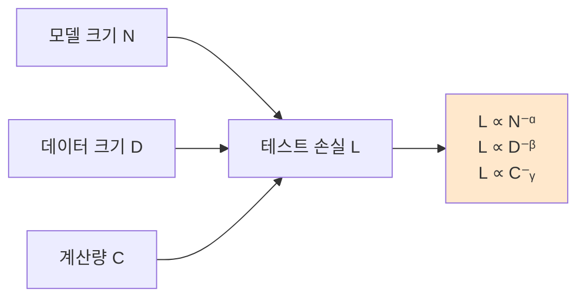
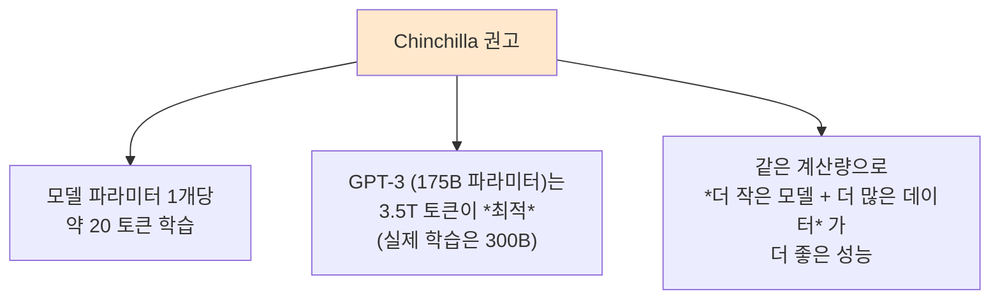
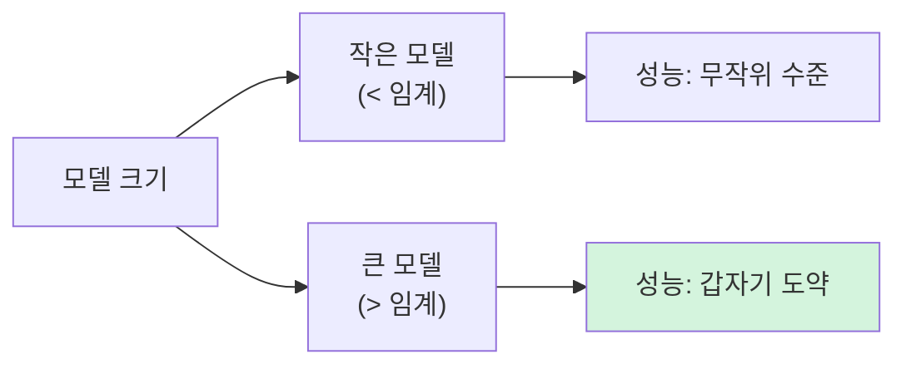
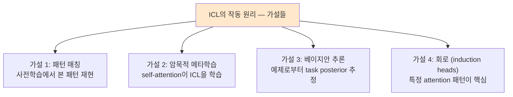
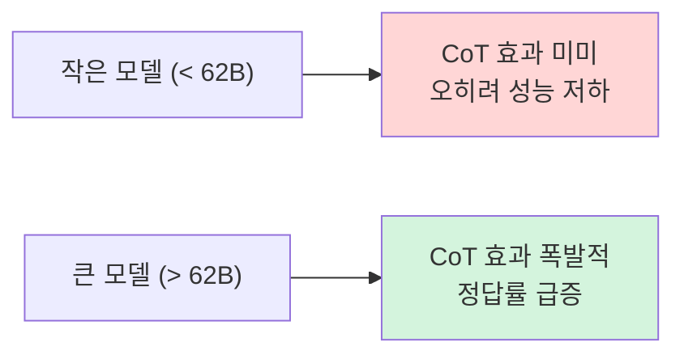
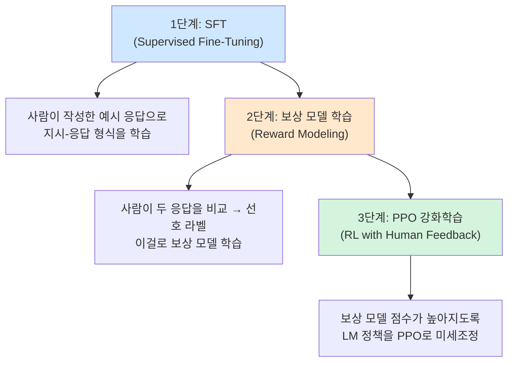
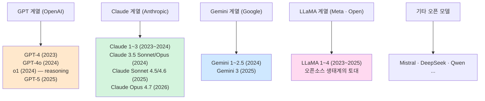
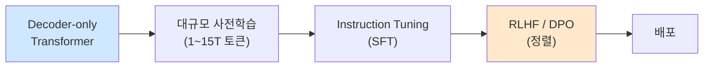
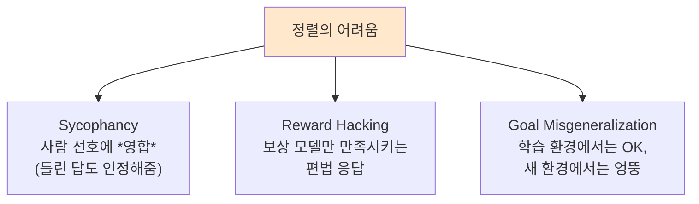
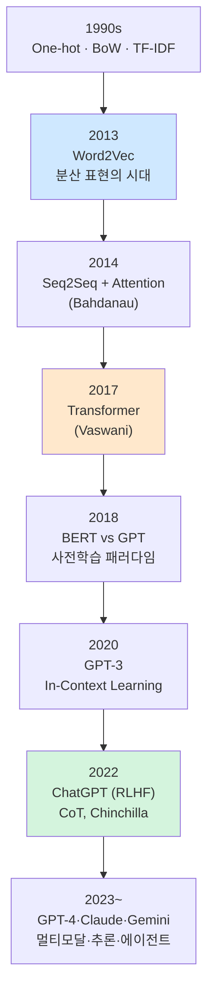

> **이 글의 목적**
>
> [NLP ⑤](/ai/nlp-05-bert-vs-gpt/)에서 BERT와 GPT가 같은 Transformer 위에서 *이해 vs 생성* 으로 갈라졌고, *충분히 큰 디코더-only* 가 결국 표준이 된다고 정리했다. 이번 편은 *그 "충분히 크다"가 무엇을 의미하는지* 와 *왜 ChatGPT가 갑자기 말이 통하게 됐는지* 를 답한다.
>
> 시리즈 ①~⑤가 *기술의 토대* 였다면, 이 편은 *그 토대 위에서 일어난 비선형적 도약* — **Scaling Laws · 창발 능력 · In-Context Learning · Chain-of-Thought · RLHF** — 을 본다. ChatGPT·Claude·Gemini·LLaMA가 *왜 지금처럼 작동하는지* 를 한 편으로 정리.
>
> 정리는 *Kaplan et al. (2020)*[^1], *Hoffmann et al. (2022)*[^2], *Wei et al. (2022a, b)*[^3][^4], *Christiano et al. (2017)*[^5], *Ouyang et al. (2022)*[^6]의 원전 논문을 1차 자료로 삼았다.
>
> **읽고 나면 답할 수 있는 질문**:
>
> - **Scaling Laws** 가 뭐고, *Chinchilla* 가 *왜 GPT-3 이후의 표준* 을 다시 썼나
> - **창발 능력(Emergent Abilities)** — *작은 모델에는 없는데 큰 모델엔 갑자기 나타나는* 능력의 의미 (와 그 *주의사항*)
> - **In-Context Learning** 의 직관 — *모델 가중치는 안 바뀌는데* 어떻게 학습이 일어나나
> - **Chain-of-Thought** 가 *왜 큰 모델에서만 작동* 하나
> - **RLHF** 의 3단계 — *SFT → 보상 모델 학습 → PPO 최적화*
> - *왜 ChatGPT가 갑자기 *말이 통하게* 됐나* — RLHF + Instruction Tuning의 결정타
> - **현대 LLM 지형** — GPT-4, Claude, Gemini, LLaMA의 차이점
> - LLM의 *진짜 한계* — 환각·정렬·평가·맥락 길이

---

## 1. Scaling Laws — *얼마나 키워야 좋아지나*

### 1.1 Kaplan et al. (2020) — *멱법칙(Power Law)*

> Kaplan, J., et al. (2020). *Scaling Laws for Neural Language Models*. *arXiv:2001.08361*.[^1]

OpenAI 연구진이 *모델 크기(N) · 데이터 크기(D) · 계산량(C)* 을 바꿔가며 LM을 학습하고, *손실(loss)* 의 변화를 정리했다. 결과:



> **L(N) ≈ (N_c / N)^α**,  α ≈ 0.076
> **L(D) ≈ (D_c / D)^β**,  β ≈ 0.095
> **L(C) ≈ (C_c / C)^γ**,  γ ≈ 0.050

세 변수가 *놀라울 정도로 매끄러운 멱법칙* 을 따랐다. 손실이 *지수적으로* 가 아니라 *멱법칙으로* 줄어든다는 건 — *적당히 키워서는 큰 개선이 어렵고, 정말 폭발적으로 키워야 한다* 는 뜻.

### 1.2 *모델 vs 데이터* — Kaplan의 결론

Kaplan은 *주어진 계산 예산에서* 어떻게 배분할지를 분석해 *"모델 크기를 데이터 크기보다 훨씬 빨리 키워라"* 고 권고했다. GPT-3(175B 파라미터, 300B 토큰)이 이 권고를 따른 대표 사례.

### 1.3 Chinchilla — Kaplan을 뒤집다

> Hoffmann, J., et al. (2022). *Training Compute-Optimal Large Language Models*. *NeurIPS 2022*.[^2]

DeepMind가 더 신중한 실험으로 Kaplan 결과를 다시 분석. 결론:

> *"모델과 데이터를 *거의 같은 비율* 로 키워야 한다. GPT-3과 그 후속들은 *데이터가 부족* 했다 — 즉, *모델이 너무 컸다*."*



#### 결과 검증

DeepMind는 같은 계산량으로 *Chinchilla(70B 파라미터, 1.4T 토큰)* 를 학습했고, *Gopher(280B 파라미터, 300B 토큰)* 를 거의 모든 벤치마크에서 능가했다. *4배 작은 모델이 4배 큰 모델보다 좋다* — 충격적 결과.

### 1.4 LLaMA의 등장과 *데이터 우선* 시대

> Touvron, H., et al. (2023). *LLaMA: Open and Efficient Foundation Language Models*. *arXiv:2302.13971*.

Meta는 Chinchilla 권고를 *더 극단적으로* 적용 — *7~65B 파라미터 모델을 1~1.4T 토큰으로* 학습. 결과적으로 *작지만 강한 모델* 이 가능해졌고, *오픈소스 LLM 생태계의 출발점* 이 됐다.

> 🎯 **2024~2025 핵심 흐름**: *모델은 작아지고 데이터는 폭발적으로 늘어난다*. *고품질 데이터 큐레이션* 이 *모델 크기 키우기* 보다 ROI가 높다는 게 표준이 됨.

---

## 2. 창발 능력 — *작은 모델엔 없는데 큰 모델엔 갑자기*

### 2.1 정의

> Wei, J., et al. (2022). *Emergent Abilities of Large Language Models*. *TMLR 2022*.[^3]

> *"창발 능력(Emergent Ability)이란, 작은 모델에서는 무작위 수준인데 *특정 임계 크기를 넘으면 갑자기 의미 있는 성능* 이 나타나는 능력이다."*



### 2.2 대표 사례

| 능력 | 임계 크기 (대략) | 예 |
|---|---|---|
| **3자리 덧셈** | ~10B | "237 + 489 = ?" 정확히 풂 |
| **다단계 추론** | ~62B | 여러 사실 결합한 QA |
| **CoT 효과** | ~62B | Chain-of-Thought 프롬프트 활용 |
| **다국어 번역** | ~30B | 명시적 학습 없이도 번역 |
| **코드 디버깅** | ~50B | 버그 위치·수정 제안 |

### 2.3 *진짜 창발인가* — 후속 연구의 반박

> Schaeffer, R., et al. (2023). *Are Emergent Abilities of Large Language Models a Mirage?* *NeurIPS 2023*.[^7]

스탠포드 연구진이 다음과 같이 반박:

> *"많은 '창발'이 *평가 지표의 비선형성* 때문에 만들어진 착시일 수 있다. 정확도(accuracy) 같은 *all-or-nothing* 지표를 쓰면 갑작스러워 보이지만, *연속 지표* (token-level log-prob, edit distance)로 보면 *매끄러운 개선* 이다."*

#### 의미

- *어떤* 창발은 진짜다 — 모델이 *질적으로 다른 행동* 을 한다
- *어떤* 창발은 평가 인공물일 수 있다 — 지표를 바꾸면 사라짐

> 💡 **균형 잡힌 정리**: LLM에는 *비선형적 도약* 이 분명히 존재하지만, 모든 *"창발"* 을 *마법* 으로 받아들이지 말고 *평가 방식* 도 함께 검토해야 한다. 둘 다 사실.

---

## 3. In-Context Learning — *학습 없이 학습*

### 3.1 기본 형태

[NLP ⑤](/ai/nlp-05-bert-vs-gpt/) §3.5에서 GPT-3과 함께 등장한 ICL. 핵심:

> *"사전학습된 모델의 *가중치는 그대로 두고*, 프롬프트 안에 예제 몇 개를 넣으면 모델이 *맥락에서 패턴을 추론* 해 새 입력에 적용한다."*

```text
[Few-shot 프롬프트]
영어: I am happy
한국어: 나는 행복해

영어: She is reading
한국어: 그녀는 책을 읽고 있어

영어: We are hungry
한국어: ___

→ GPT가 "우리는 배고파" 출력
```

### 3.2 *왜* 작동하는가 — 활발한 연구 영역

ICL은 *사전학습 분포 안에 *비슷한 패턴이 자주 등장* 했기 때문* 이라는 게 주류 설명. 그런데 *추론 시 가중치가 안 바뀌는데 왜 새 패턴을 학습하는 것처럼 보이는가* 는 여전히 논쟁적.



이 중 어떤 것도 단독 정답이 아니다. 활발한 연구 중.

### 3.3 *Zero-shot · One-shot · Few-shot*

| 방식 | 예제 수 | 사용 |
|---|---|---|
| **Zero-shot** | 0개 | 지시문만 — *"다음을 한국어로 번역하라"* |
| **One-shot** | 1개 | 예제 1개 + 새 입력 |
| **Few-shot** | 2~수십 개 | 가장 강력 — *모델 크기에 따라* 효과 달라짐 |

> 🎯 **GPT-3 논문의 발견**: *모델이 클수록 few-shot 효과가 크다*. 작은 모델은 *fine-tuning 없이는* 대부분 못 풀지만, 175B는 *예제 몇 개로* SOTA에 근접.

### 3.4 한계

- **컨텍스트 길이 제약**: 예제를 많이 넣으면 *입력 길이 한계* 에 부딪힘
- **예제 순서·선택 민감**: 같은 예제도 *순서·표현* 에 따라 결과가 흔들림
- **복잡한 추론 한계**: 단순 패턴은 잘 잡지만 *깊은 추론* 은 어려움 → CoT 필요

---

## 4. Chain-of-Thought — *생각의 사슬을 적게 하라*

### 4.1 발상

> Wei, J., et al. (2022). *Chain-of-Thought Prompting Elicits Reasoning in Large Language Models*. *NeurIPS 2022*.[^4]

Google Brain이 발견한 *놀라울 정도로 단순한 트릭*:

> *"모델에 답만 묻지 말고, *생각하는 과정* 을 함께 보여줘라. 그러면 추론 능력이 폭발적으로 향상된다."*

### 4.2 비교 예시

#### 표준 프롬프트 (잘 못 함)

```text
Q: 카페에 사과 23개가 있었다. 20개를 점심에 썼고, 6개를 더 샀다. 지금 사과는 몇 개?
A: 27개.        ← 틀림! (정답: 9개)
```

#### Chain-of-Thought 프롬프트 (잘 함)

```text
Q: 로저는 테니스 공 5개를 가지고 있었다. 테니스 공 캔 2개를 샀고, 각 캔에는 3개씩 들어 있다. 지금 몇 개?
A: 로저는 처음 5개를 가졌다. 캔 2개에 각 3개씩이니 6개. 5 + 6 = 11. 답은 11.

Q: 카페에 사과 23개가 있었다. 20개를 점심에 썼고, 6개를 더 샀다. 지금 사과는 몇 개?
A: 처음 23개에서 20개를 썼으니 3개 남는다. 6개를 더 샀으니 3 + 6 = 9. 답은 9.   ← 정답!
```

*"사고 과정을 적도록 유도하는 한 줄"* 이 정답률을 극적으로 올린다.

### 4.3 결과

GSM8K(초등 수학 단어 문제) 벤치마크:

| 방법 | PaLM 540B 정확도 |
|---|---|
| 표준 prompting | 18% |
| **Chain-of-Thought** | **57%** |
| CoT + Self-Consistency | **74%** |

3배 가까운 도약. 단순한 프롬프트 패턴 변화로.

### 4.4 *큰 모델에서만* 작동



이게 *창발 능력* 의 대표 예. *논리적 추론을 *사슬로 풀어내는* 능력 자체가 큰 모델에서 갑자기 등장* 한다.

### 4.5 후속 — *Self-Consistency*, *Tree of Thought*

- **Self-Consistency** (Wang et al., 2022): CoT를 *여러 번 샘플링* 해서 *다수결* 로 답 결정 → 정확도 추가 향상
- **Tree of Thought** (Yao et al., 2023): 단순 사슬이 아니라 *생각의 트리* 를 탐색 → 복잡 문제 해결력 ↑
- **Self-Refine** (Madaan et al., 2023): 모델이 자기 답을 *비평하고 다시 쓰기*

> 💡 *"프롬프트 엔지니어링"* 이라는 분야가 본격 등장한 게 CoT 이후. 같은 모델·같은 가중치로도 *프롬프트 디자인* 이 결과를 좌우.

---

## 5. RLHF — *말이 통하는 모델* 의 결정타


### 5.1 문제 제기 — *왜 GPT-3는 도움이 잘 안 됐나*

GPT-3은 강력하지만 *지시를 잘 따르지 못했다*.

```text
[GPT-3 (사전학습만)]
사용자: "다음을 한국어로 번역해주세요: I love you"
모델:   "I love you"를 한국어로 번역하면 어떻게 될까요?
        영어를 한국어로 옮기는 건 쉽지 않은 일입니다 ...
        (계속 자기 말만 함)
```

이게 사전학습된 LM의 *기본 행동* — *훈련 분포(웹 텍스트)와 비슷한 텍스트를 이어쓰는* 것. *사용자 지시에 응답하는* 것은 학습 목표에 *없다*.

### 5.2 RLHF — 3단계 정렬

> Christiano, P. F., et al. (2017). *Deep Reinforcement Learning from Human Preferences*. *NeurIPS 2017*.[^5]
>
> Ouyang, L., et al. (2022). *Training Language Models to Follow Instructions with Human Feedback*. (InstructGPT)[^6]



#### Step 1: SFT (Supervised Fine-Tuning)

사전학습된 GPT-3 위에 *사람이 작성한 (지시, 응답) 쌍* 으로 미세조정. 약 *수만 건*. 이 단계만으로도 *지시-응답 형식* 이 잡힌다.

#### Step 2: 보상 모델 (Reward Model) 학습

*같은 지시에 대한 두 응답* 중 *어느 쪽이 더 좋은지* 사람이 라벨링.

```text
지시: "양자역학이 뭔지 5살에게 설명해줘"

응답 A: "원자 단위에서 일어나는 일을 다루는 물리학..."   (어려움)
응답 B: "아주 작은 것들의 세계에서 일어나는 신기한 일들이야..."   (눈높이 OK)

→ 사람: B > A
```

이 *비교 데이터로 보상 모델 R(prompt, response)* 을 학습. 이제 모델 응답에 *수치 점수* 를 줄 수 있다.

#### Step 3: PPO (Proximal Policy Optimization)

> Schulman, J., et al. (2017). *Proximal Policy Optimization Algorithms*. *arXiv:1707.06347*.

LM을 *강화학습 정책* 으로 보고, *보상 모델 점수가 높아지는 방향* 으로 PPO로 업데이트.

> **objective = E[R(prompt, response)] − β · KL(π || π_SFT)**

| 항 | 의미 |
|---|---|
| `R(...)` | 사람 선호 기반 보상 |
| `KL(π || π_SFT)` | *SFT 모델로부터 너무 멀어지지 않게* 막는 패널티 |
| `β` | 정규화 계수 |

KL 패널티가 *없으면* 보상 모델 점수만 쫓다 *언어 능력 자체가 망가지는* *reward hacking* 이 일어남. 이게 RLHF 안정화의 핵심 트릭.

### 5.3 결과 — *말이 통하는 모델*

InstructGPT는 *13B 파라미터로 175B GPT-3을 능가* 했다 (사람 평가 기준). *모델 크기보다 정렬이 중요* 함을 입증.

> 🎯 **시험·면접 단골**: *"ChatGPT가 갑자기 말이 통하게 된 결정타는?"* → *RLHF + Instruction Tuning*. *모델 크기가 아니라 정렬(alignment)이 핵심*. 이 한 줄.

### 5.4 후속 — DPO와 그 너머

> Rafailov, R., et al. (2023). *Direct Preference Optimization: Your Language Model is Secretly a Reward Model*.[^8]

PPO는 강화학습이라 *불안정·복잡* 하다. *DPO* 는 *별도 보상 모델 없이* 선호 데이터로 *직접* LM을 최적화. 결과는 비슷하면서 구현이 훨씬 단순. 2023년 이후 표준이 되어가는 중.

### 5.5 Constitutional AI — Anthropic의 변형

> Bai, Y., et al. (2022). *Constitutional AI: Harmlessness from AI Feedback*.

Anthropic이 *사람 라벨링을 AI 피드백* 으로 부분 대체. *"헌법(원칙 집합)"* 을 주고 모델이 *자기 출력을 비평·수정* 하게 함. Claude 시리즈의 핵심 학습 기법.

---

## 6. 현대 LLM 지형 — *2024~2026 시점*

### 6.1 주요 모델 가족



### 6.2 모든 현대 LLM의 *공통점*



*어느 회사·어느 모델이든* 이 파이프라인 위에 있다. 차이는 *데이터 큐레이션·아키텍처 디테일·정렬 기법·후처리* 에서 갈린다.

### 6.3 새로운 흐름

| 흐름 | 설명 | 대표 |
|---|---|---|
| **추론 모델 (Reasoning)** | 추론에 *별도 학습·추론 시간* 투입 | OpenAI o1, DeepSeek R1, Claude (extended thinking) |
| **멀티모달 (Multimodal)** | 이미지·음성·비디오까지 통합 | GPT-4o, Gemini, Claude 3.5+ |
| **에이전트 (Agentic AI)** | *도구 사용 + 다단계 계획* | Claude Computer Use, GPT Operator, Gemini Agents |
| **긴 컨텍스트 (Long Context)** | 100K~1M+ 토큰 | Gemini 1.5 (1M), Claude (200K~1M) |
| **소형·효율 (Small & Efficient)** | *소형 모델 + 고품질 데이터* | Phi 시리즈, Llama 3.x small, Qwen2.5 |

### 6.4 2026년 시점의 표준 (이 글 작성 기준)

- *추론 모델* 이 일반 모델만큼 보편화
- *멀티모달이 기본* — 텍스트 전용 모델이 오히려 예외
- *에이전트가 주요 응용 영역* — 단순 챗봇을 넘어 *실제 작업 수행*
- *컨텍스트 길이 1M+ 가 흔함*
- *오픈소스와 폐쇄형의 격차가 줄어드는 중* (LLaMA 4·Qwen 3·DeepSeek R1)

---

## 7. LLM의 진짜 한계

### 7.1 환각 (Hallucination)

LLM은 *그럴듯하지만 사실이 아닌* 내용을 만들어낸다. 학습 데이터에 *없는 사실* 을 *있는 것처럼* 만들거나, *반대로* 진짜 사실을 잊는다.

원인:
- *다음 단어 예측* 이라는 학습 목표 자체가 *사실성을 보장하지 않음*
- 모델은 *확률적으로 그럴듯한* 토큰을 고를 뿐

대응:
- **RAG (Retrieval-Augmented Generation)**: 외부 지식베이스에서 검색해 컨텍스트로 제공
- **Citation 기반 답변**: 출처를 명시하도록 학습
- **불확실성 표현**: *"확실하지 않다"* 를 말할 수 있게 정렬

### 7.2 정렬 (Alignment) 문제

RLHF로 많은 게 풀렸지만 *근본 문제* 는 남는다:



*충분히 강력한 모델이 사람의 진짜 의도와 정렬되도록 만드는 일* 은 여전히 활발한 연구 영역.

### 7.3 평가의 어려움

LLM 능력이 늘어날수록 *평가가 더 어려워진다*.

- *벤치마크 포화*: GLUE·SuperGLUE는 이미 의미 없음. MMLU도 곧 포화
- *데이터 오염*: 평가 데이터가 학습 코퍼스에 들어갔을 가능성
- *질적 평가의 비용*: 사람 평가는 비싸고 일관성 떨어짐
- *LLM-as-Judge*: LLM으로 LLM을 평가하면 *편향이 전이* 됨

### 7.4 비용·환경

- 사전학습 1회에 *수백만~수천만 달러*
- 추론도 트래픽이 커지면 *큰 에너지 비용*
- 데이터센터 전력 수요가 *전력망 규모* 에서 문제됨

### 7.5 데이터의 한계

> Villalobos, P., et al. (2024). *Will We Run Out of Data? Limits of LLM Scaling Based on Human-Generated Data*.

고품질 인간 텍스트 데이터는 *2026~2032년 사이에 고갈* 될 수 있다는 분석. 합성 데이터·멀티모달 데이터·특수 도메인 데이터가 다음 자원.

---

## 8. 시리즈 마무리 — *우리가 본 60년*



이 시리즈에서 본 흐름을 한 줄로:

> *"단어를 더 좋은 숫자로 바꾸는 60년의 시도가, 결국 *말이 통하는 기계* 로 귀결됐다."*

각 편의 핵심:

| 편 | 핵심 발상 | 결정적 결과 |
|---|---|---|
| ① | 단어를 숫자로 — 통계 기반 | 한계가 분산 표현을 부름 |
| ② | Word2Vec — 분포 가설을 학습 | 의미가 *벡터 산술* 이 됨 |
| ③ | Attention — 매번 다르게 본다 | 정보 병목 해소 |
| ④ | Transformer — RNN을 빼다 | 병렬화 → 큰 모델 가능 |
| ⑤ | BERT vs GPT — 사전학습 갈래 | *이해 vs 생성* 의 분기 |
| ⑥ | LLM 시대 — Scaling + 정렬 | *말이 통하는* 모델 |

각 단계에서 *한 줄짜리 발상* 이 *전체 분야* 를 한 번씩 다시 썼다. 다음에 무엇이 NLP를 또 한 번 흔들지는 모르지만, *지금까지의 흐름을 알면 다음 변화도 더 빨리 이해할 수 있다* 는 게 이 시리즈의 의도다.

---

## 9. 정리

이 글에서 다룬 내용을 한 줄로 압축하면:

- **Scaling Laws** (Kaplan 2020): 손실은 모델·데이터·계산량에 *멱법칙* 으로 의존. *Chinchilla* (2022)는 *모델보다 데이터를 더 키우라* 고 권고. 현대 LLM 학습의 표준
- **창발 능력** (Wei 2022): 임계 크기를 넘으면 *갑자기 나타나는* 능력. *진짜 창발 vs 평가 인공물* 논쟁 중
- **In-Context Learning**: 가중치 안 바꾸고 *프롬프트의 예제만으로* 새 과제 수행. GPT-3에서 본격화
- **Chain-of-Thought**: *생각의 사슬을 쓰게 하는* 단순 트릭. *큰 모델에서만* 작동하는 대표 창발
- **RLHF** 3단계: *SFT → 보상 모델 → PPO*. KL 패널티가 안정화 핵심. *DPO·Constitutional AI* 등 후속
- **현대 LLM 공통 파이프라인**: *사전학습 → SFT → RLHF/DPO*. 차이는 데이터·디테일·정렬 기법
- **2026 시점 흐름**: 추론 모델·멀티모달·에이전트·긴 컨텍스트·소형 효율
- **진짜 한계**: 환각·정렬·평가·비용·데이터 고갈
- 60년 NLP의 흐름이 *단어를 숫자로 바꾸는 시도* 에서 *말이 통하는 기계* 로 귀결

---

## 10. 추가로 공부하면 좋을 개념

- **RAG (Retrieval-Augmented Generation)** (Lewis et al., 2020): 환각 완화의 표준. 외부 지식베이스 검색 → 프롬프트 주입
- **MoE (Mixture of Experts)**: GPT-4·Mixtral·DeepSeek가 채택. 일부 전문가만 활성화해 *효율적으로* 큰 모델 구현
- **Tool Use / Function Calling**: LLM이 *외부 도구를 호출* 해 작업 수행. 에이전트 시대의 토대
- **Agentic AI**: ReAct (Yao 2022) → AutoGPT → Claude Computer Use. *다단계 계획·도구 사용·자기 평가*
- **AI Safety / Alignment**: Anthropic·OpenAI·DeepMind 연구 흐름. *Constitutional AI*, *Scalable Oversight*, *Mechanistic Interpretability*
- **양자화·증류**: *큰 모델을 작게 압축*. INT4 양자화·LoRA·QLoRA — 소비자 GPU에서 LLM 돌리기의 토대
- **Mechanistic Interpretability**: *모델 내부 회로를 역공학* 해 *왜 그렇게 작동하는지* 이해. Anthropic의 핵심 연구 주제

> ✍️ **시리즈 마무리**. 다음에 NLP를 다시 본다면, 위 주제 중 하나를 별도 시리즈로 깊게 파볼 만하다.

---

## 참고 문헌 (References)

[^1]: Kaplan, J., McCandlish, S., Henighan, T., Brown, T. B., Chess, B., Child, R., Gray, S., Radford, A., Wu, J., & Amodei, D. (2020). "Scaling Laws for Neural Language Models." *arXiv:2001.08361*.

[^2]: Hoffmann, J., et al. (2022). "Training Compute-Optimal Large Language Models." *NeurIPS 2022*. *arXiv:2203.15556*. (Chinchilla)

[^3]: Wei, J., et al. (2022). "Emergent Abilities of Large Language Models." *TMLR 2022*. *arXiv:2206.07682*.

[^4]: Wei, J., et al. (2022). "Chain-of-Thought Prompting Elicits Reasoning in Large Language Models." *NeurIPS 2022*. *arXiv:2201.11903*.

[^5]: Christiano, P. F., Leike, J., Brown, T., Martic, M., Legg, S., & Amodei, D. (2017). "Deep Reinforcement Learning from Human Preferences." *NeurIPS 2017*. *arXiv:1706.03741*.

[^6]: Ouyang, L., et al. (2022). "Training Language Models to Follow Instructions with Human Feedback." *NeurIPS 2022*. *arXiv:2203.02155*. (InstructGPT)

[^7]: Schaeffer, R., Miranda, B., & Koyejo, S. (2023). "Are Emergent Abilities of Large Language Models a Mirage?" *NeurIPS 2023*. *arXiv:2304.15004*.

[^8]: Rafailov, R., Sharma, A., Mitchell, E., Ermon, S., Manning, C. D., & Finn, C. (2023). "Direct Preference Optimization: Your Language Model is Secretly a Reward Model." *NeurIPS 2023*. *arXiv:2305.18290*.

---

## 부록 A. 이미지 생성 프롬프트

> 시리즈 마지막 편이라 두 장의 핵심 이미지를 둔다 — *Scaling Laws* 와 *RLHF 3단계*.

### A1. Scaling Laws 그래프 (`scaling_laws.png`)

> 📁 저장 경로: `/assets/images/nlp/scaling_laws.png`

```
Three-panel scientific log-log plot illustration showing the scaling
laws of language models. Left panel: x-axis "model size N", y-axis
"test loss L", showing a clean downward power-law curve. Middle panel:
x-axis "data size D", same y-axis, similar power-law curve. Right
panel: x-axis "compute C", same y-axis, third power-law curve. All
three curves are smooth straight lines on log-log axes, with shaded
confidence regions. Color palette: blue, orange, green for the three
panels. Above the panels, large equations: L ∝ N^-α, L ∝ D^-β,
L ∝ C^-γ. Below the panels, a side note showing Chinchilla's revision:
"Chinchilla (2022): 모델보다 데이터를 더 키워라". Modern scientific
visualization style, white background, clean grid, professional. 16:9.

CRITICAL: 이미지 내 모든 문자/라벨은 반드시 한글로 표시. 영문 텍스트 금지
(단, 변수 N, D, C, L, α, β, γ, ∝, log와 인명 Kaplan, Chinchilla,
연도 2020, 2022는 영문/숫자 그대로 유지).
라벨:
- 좌측 패널 제목: "모델 크기 N의 스케일링"
- 좌측 패널 X축: "모델 파라미터 수 (log)"
- 좌측 패널 Y축: "테스트 손실 L (log)"
- 가운데 패널 제목: "데이터 크기 D의 스케일링"
- 가운데 패널 X축: "학습 토큰 수 (log)"
- 우측 패널 제목: "계산량 C의 스케일링"
- 우측 패널 X축: "총 FLOPs (log)"
- 상단 가운데: "Scaling Laws — 손실은 *멱법칙* 으로 줄어든다 (Kaplan 2020)"
- 하단 가운데 박스: "Chinchilla(2022)의 수정: 모델 1 파라미터당 약 20 토큰"
```

### A2. RLHF 3단계 (`rlhf_three_stages.png`)

> 📁 저장 경로: `/assets/images/nlp/rlhf_three_stages.png`

```
Wide horizontal infographic showing the three stages of RLHF.
Stage 1 (left, blue panel): "Supervised Fine-Tuning (SFT)" — illustration
of human writers creating example responses, then a pretrained LM
being fine-tuned on those examples. Stage 2 (middle, orange panel):
"Reward Model Training" — illustration of two model outputs side by
side with a human comparing them and labeling which is better, then
those preferences training a reward model. Stage 3 (right, green panel):
"PPO Reinforcement Learning" — illustration of the LM generating
responses, the reward model scoring them, and gradients flowing back
to update the LM, with a small KL-divergence penalty arrow keeping
it close to the SFT baseline. Arrows connecting the three stages
horizontally. Modern educational infographic, distinct color palettes
per stage, clean white background, illustrated humans and model boxes
in flat design. 16:9.

CRITICAL: 이미지 내 모든 문자/라벨은 반드시 한글로 표시. 영문 텍스트 금지
(단, 약어 SFT, PPO, KL과 수학 기호 R, π, β는 영문 그대로 유지).
라벨:
- 좌측 패널 제목: "1단계 — Supervised Fine-Tuning (SFT)"
- 좌측 패널 부제: "사람이 쓴 (지시·응답) 예시로 미세조정"
- 가운데 패널 제목: "2단계 — 보상 모델 학습"
- 가운데 패널 부제: "사람이 두 응답 비교 → 선호 라벨 → 보상 모델 R"
- 우측 패널 제목: "3단계 — PPO 강화학습"
- 우측 패널 부제: "보상 R을 최대화 + KL 패널티로 SFT 가까이 유지"
- 우측 패널 식 박스: "objective = E[R] − β · KL(π ‖ π_SFT)"
- 상단 가운데: "RLHF — 말이 통하는 모델을 만든 3단계"
- 하단 가운데: "InstructGPT (Ouyang et al., 2022) — ChatGPT의 토대"
```

> 💡 위 프롬프트는 모두 본문 텍스트에 의존하지 않는 자기 완결형 이미지를 만들도록 작성됐다.
