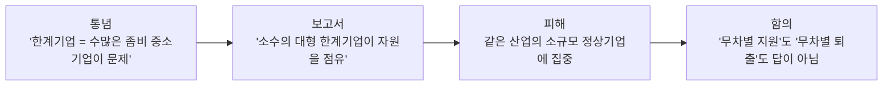

> 오늘부터 경제뉴스를 하루 한 건씩 정리해보려고 합니다. 기사를 그냥 읽고 넘기는 것과, 용어를 직접 풀어 쓰고 "그래서 이게 왜 중요한가"까지 적어보는 것은 머리에 남는 정도가 완전히 다르더군요. 면접 준비로 시작했지만, 경제를 보는 눈을 기르는 데도 이 누적이 가장 효과적이라고 봅니다.

## 오늘의 한 줄

한국은행 경제연구원이 "한계기업 문제의 핵심은 중소기업 수가 아니라 **대형 부실기업의 자원 점유**에 있고, 그 피해는 오히려 소규모 정상기업에 집중된다"는 분석을 내놨습니다.

---

## 무슨 일이 있었나

2026년 6월 15일, 한국은행 경제연구원 이경태 차장이 「큰 한계기업, 작은 피해기업: 행정전수자료를 활용한 혼잡효과 분석」 보고서를 발표했습니다. 행정 전수 데이터로 한계기업이 같은 산업의 정상기업에 미치는 영향을 정량 분석한 연구입니다.

핵심 수치를 정리하면:

| 항목 | 수치 |
|---|---|
| 2025년 한계기업 비중 | 약 **40%** (통계 작성 이래 최고 수준) |
| 한계기업 비중 1%p 상승 시 정상기업 투자·고용 성장률 | **0.14~0.18%p 하락** (2~3년 지속) |
| 외감 한계기업의 총자산 비중 (2023년) | **4.7%** |
| 비외감 한계기업의 총자산 비중 (2023년) | **2.3%** |
| 한계기업 25% 퇴출 시 총요소생산성(TFP) | **+0.20%** |
| 한계기업 25% 퇴출 시 부가가치 | **+0.35%** |

규모가 큰(외감) 한계기업이 차지하는 자산이 작은(비외감) 한계기업의 두 배인데, 정작 그 피해는 소규모 정상기업이 본다는 게 보고서의 핵심 메시지입니다.

---

## 용어 정리

기사를 읽다 보면 막히는 단어들을 먼저 풀어보겠습니다.

- *이자보상배율(ICR, Interest Coverage Ratio)*: 영업이익을 이자비용으로 나눈 값. 1보다 작으면 **영업으로 번 돈으로 이자도 못 갚는다**는 뜻입니다.
- *한계기업(限界企業)*: 이자보상배율이 **3년 연속 1을 밑도는** 기업. 흔히 '좀비기업'이라고도 부릅니다.
- *혼잡효과(congestion effect)*: 부실기업이 자원(자금·인력·시장)을 붙잡고 버티면서, 같은 산업의 멀쩡한 기업이 쓸 자원이 줄어드는 현상. 도로에 차가 막히듯 정상기업의 성장이 정체된다는 비유입니다.
- *총요소생산성(TFP, Total Factor Productivity)*: 노동·자본 같은 투입 요소로 설명되지 않는 생산성. 쉽게 말해 "같은 자원으로 얼마나 더 잘 뽑아내는가"입니다.
- *외감/비외감 기업*: '외감'은 외부감사 대상 기업으로, 자산 규모 등이 일정 기준 이상인 비교적 큰 기업입니다. 비외감은 그보다 작은 기업을 가리킵니다.

---

## 왜 중요한가 (내 해석)

이 보고서가 흥미로운 건, 한계기업 문제를 보는 시각을 한 번 뒤집었다는 점입니다.

흔히 "부실기업이 너무 많다"고 하면 수많은 영세 중소기업을 떠올리기 쉽습니다. 그런데 보고서는 자산 점유 기준으로 보면 **덩치 큰 한계기업**이 문제의 중심이고, 그 그늘에서 작은 정상기업이 성장 기회를 빼앗긴다고 봅니다.

여기서 바로 정책적 딜레마가 나옵니다. 한계기업을 25% 퇴출하면 생산성과 부가가치가 오르지만(TFP +0.20%, 부가가치 +0.35%), 동시에 정상기업이 부실해질 가능성도 약 0.3% 생긴다고 분석했습니다. 구조조정에는 부작용이 따른다는 거죠. 그래서 **일률적 지원**도, **일률적 퇴출**도 답이 아니고, "옥석 가리기"가 핵심이 됩니다. 일시적 유동성 위기 기업은 살리고, 회생 가능성이 없는 구조적 한계기업은 질서 있게 정리하는 선별이 필요하다는 결론으로 읽힙니다.

### 정책금융·보증기관 관점으로 한 번 더

이 이슈는 중소기업을 지원하는 정책금융·보증기관에 직접 닿습니다. 보증기관은 담보가 부족한 중소기업의 대출을 보증해주는데, 한계기업이 늘면 *대위변제*(기업이 빚을 못 갚을 때 기관이 대신 갚는 것) 부담이 커집니다. 동시에 "성장 가능성 있는 기업을 지원한다"는 존재 이유와, "부실 위험을 관리한다"는 책임이 충돌하죠.

그래서 데이터로 옥석을 가리는 역량(비재무 데이터 기반 신용평가, 부실 예측 모형)이 점점 중요해집니다. 한계기업이 40%에 달하는 환경에서는 "지원이냐 거절이냐"의 이분법보다, **선별의 정교함**이 기관 경쟁력이 됩니다.

---

## 정리

- 2025년 한계기업 비중이 약 40%로 역대 최고. 한국은행은 문제의 핵심이 **대형 한계기업의 자원 점유**라고 분석.
- 한계기업이 늘면 같은 산업 정상기업의 투자·고용 성장이 2~3년간 눌린다(혼잡효과).
- 구조조정은 생산성을 올리지만 부작용도 있어, **일괄 지원도 일괄 퇴출도 아닌 선별**이 관건.
- 정책금융·보증기관 입장에선 **데이터 기반 옥석 가리기** 역량이 핵심 과제로 떠오름.

---

## 참고 (References)

- 이경태, 「큰 한계기업, 작은 피해기업: 행정전수자료를 활용한 혼잡효과 분석」, 한국은행 경제연구원, 2026.6.15.
- 아주경제, "벌어도 이자 못 갚는데…'대형 한계기업' 버티자 중소기업 '휘청'", 2026.6.15. <https://www.ajunews.com/view/20260615112158359>
- 헤럴드경제, "한계기업 비중 1%P↑, 정상기업 투자·고용 성장률 최대 0.18%P↓", 2026.6.15. <https://biz.heraldcorp.com/article/10771956>
- 이투데이, "한계기업 비중 높을수록 정상기업도 악영향…산업별 적시 퇴출 시급", 2026.6.15. <https://www.etoday.co.kr/news/view/2593633>

> 수치는 위 보도와 한국은행 보고서 기준입니다. 보고서 원문은 한국은행 경제연구원 페이지에서 다시 확인하는 것을 권합니다.
