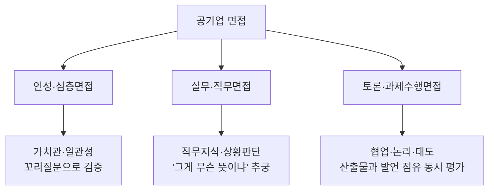
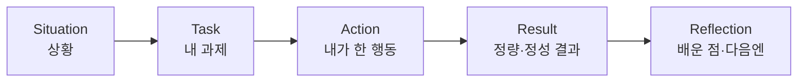
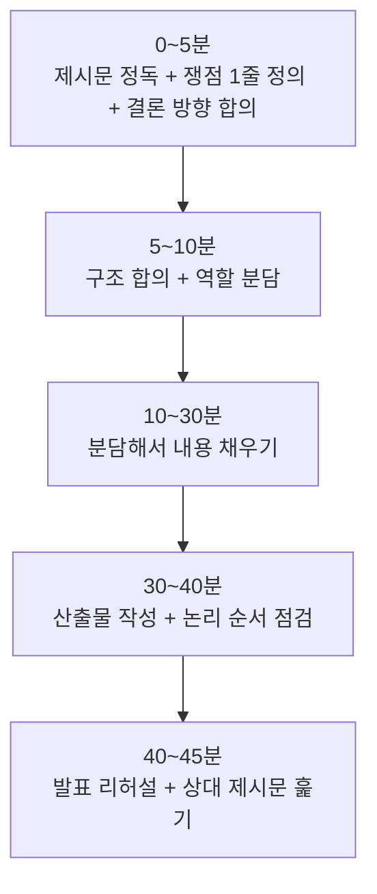

## 들어가며

요즘 한 금융 공기업의 데이터 분석 직무 면접을 준비하고 있습니다. 준비하면서 가장 먼저 부딪힌 벽이 "꼬리질문"이었어요. 인성·실무·토론 어느 면접이든 답 하나를 던지면 면접관이 그 답을 물고 늘어집니다. "왜 그렇게 했나요?", "그게 본인 기여가 맞나요?", "결과는 어떻게 측정했죠?" 같은 식으로요.

처음에는 예상 질문 100개를 외우면 되지 않을까 생각했는데, 외우는 방식으로는 두세 번째 꼬리질문에서 바로 무너지더군요. 질문 리스트가 아니라 **답변을 만드는 구조**가 필요했습니다. 이 글에서는 제가 면접 준비 자료를 정리하면서 세운 방법론을 공유합니다. 특정 기업 기출이 아니라, 공기업·공공기관 면접 전반에 쓸 수 있는 틀로 일반화했습니다.

---

## 공기업 면접의 정체부터 파악하기

방법론을 만들기 전에 "내가 상대하는 면접이 뭘 보려는 것인지"부터 정리했습니다. 후기를 모아 보니 공기업 면접은 대체로 세 갈래였습니다.



세 갈래의 공통점이 하나 있었습니다. **면접관은 내 답을 믿지 않고, 근거를 캐묻는다**는 것. 그래서 "무슨 답을 할까"보다 "어떤 답이든 캐물려도 버틸 수 있게 만들까"가 핵심이라고 판단했습니다.

여기서 제가 택한 두 가지 도구가 **STAR-R**(경험 답변용)와 **2층 구조**(토론·실무 답변용)입니다. 왜 이 둘을 골랐는지, 다른 방식과 비교해서 정리해보겠습니다.

---

## 경험 질문: 왜 STAR가 아니라 STAR-R인가

면접 경험 답변에는 보통 *STAR(Situation-Task-Action-Result)* 프레임을 많이 씁니다. 상황을 깔고, 내 과제를 말하고, 행동과 결과를 붙이는 구조죠. 그런데 공기업 면접에서 STAR만으로는 부족하다고 느꼈습니다.

면접관의 꼬리질문은 거의 항상 마지막에 "그래서 **뭘 배웠나요**", "다시 한다면 **어떻게** 하겠어요"로 끝나거든요. 결과(Result)까지만 준비하면 이 지점에서 말문이 막힙니다. 그래서 마지막에 **R(Reflection, 배운 점·다음 행동)**을 하나 더 붙인 STAR-R로 모든 경험 답변을 압축해뒀습니다.



### Step 1: 경험을 STAR-R 한 덩어리로 압축한다

자기소개, 갈등 경험, 실패 경험, 설득 실패 경험 같은 단골 질문마다 STAR-R 카드를 한 장씩 만듭니다. 이때 중요한 건 **분량이 아니라 각 칸이 꼬리질문을 견디느냐**입니다.

### Step 2: 1인칭 행동(Action)을 팀 성과에서 분리한다

팀 경험을 말하면 면접관은 반드시 "그건 팀이 한 거고, **본인은** 뭘 했죠?"를 묻습니다. 그래서 Action 칸은 처음부터 "내가 한 것"만 남깁니다. "우리가 ~했다"가 아니라 "나는 ~를 맡아서 ~했다"로요.

### Step 3: 숫자나 고유명사를 하나씩 쥐고 들어간다

"리뷰 시간을 줄였다"보다 "리뷰 시간을 며칠에서 몇 시간으로 줄였다"가 강합니다. 단, 여기서 함정이 있습니다. **정량값을 과장하면 면접관이 더 집요하게 팝니다.** 측정하지 않은 건 "정확히 재진 않았지만 체감상" 하고 솔직하게 한정하는 편이 안전합니다. 작은 진짜 숫자가 큰 가짜 숫자보다 낫습니다.

---

## 꼬리질문 생존 5원칙

STAR-R 카드를 만들었으면, 그걸 어떻게 방어하느냐가 다음 문제입니다. 꼬리질문 유형별로 면접관의 의도와 대응을 표로 정리해뒀습니다.

| 꼬리질문 유형 | 면접관 의도 | 내 대응 |
|---|---|---|
| "왜 그렇게 했나요?" | 판단 근거 검증 | 당시 제약조건 + 비교한 대안 + 선택 이유 |
| "다른 방법은 없었나요?" | 사고 유연성 | 대안 1~2개 인정 + 그래도 이걸 고른 트레이드오프 |
| "그게 본인 기여 맞나요?" | 과장 검증 | 팀/내 행동 분리, 철저히 1인칭으로 |
| "결과를 어떻게 측정했나요?" | 정량성 | 숫자 하나 + 없으면 솔직히 "미측정, 체감상" |
| "모순 아닌가요?" | 일관성 | 강점·약점·사례를 사전에 한 세트로 정합성 맞추기 |
| 모르는 지식 질문 | 정직성·태도 | 지어내지 말고 "모릅니다 + 어떻게 알아낼지" |

여기서 가장 중요한 원칙 세 가지를 따로 뽑으면:

1. **모르면 "모른다 + 접근법"으로.** 지어내면 공기업 면접은 더 깊이 파고들어 결국 들통납니다. "그 부분은 깊이 다뤄보지 못했습니다. 다만 접근한다면 이런 방식으로 확인하겠습니다"가 정직하면서도 점수를 방어합니다.
2. **압박형 질문("그래도 하나만 고르라면")은 회피하지 말 것.** 입장을 정하되 근거를 붙입니다. 회피하면 그 자체가 감점입니다.
3. **자소서·인성·실무 답을 하나의 일관된 사람으로 묶기.** 인성면접에서 "꼼꼼함이 강점"이라 해놓고 단점에서 "마감을 자주 놓친다"고 하면 바로 모순으로 걸립니다.

이 부분이 사실 *PAAR(Problem-Analyze-Action-Result)* 사고방식과 맞닿아 있습니다. "왜 이 선택을 했는가"를 평소에 정리해두는 습관이 면접에서 그대로 무기가 됩니다. 기술 선택이든 경험이든, 대안을 비교하고 근거를 남겨두면 "왜 그렇게 했냐"는 질문이 두렵지 않습니다.

---

## 토론·과제수행 면접: 2층 구조와 6칸 틀

공기업 토론면접(또는 과제수행면접)은 인성·실무면접과 완전히 다른 게임입니다. 후기를 보면 평가가 **논리·설득력 + 협력·경청·적극성(태도)**를 동시에 채점하는 방식이더군요. 발언을 많이 해도 태도가 나쁘면 깎이고, 태도만 좋고 기여가 없어도 밀립니다.

### 핵심 무기 1: 해결방안은 항상 2층으로

제가 가장 효과적이라고 본 건 해결방안을 **2층 구조**로 말하는 습관입니다.

> "일반적 차원에서는 ~한 대응이 필요하고, (지원 기관) 차원에서는 ~ 방식으로 연결할 수 있습니다."

후기에서 "기관 대응에만 집중했다가 일반적 대응방안을 못 답한" 사례가 감점 포인트로 자주 나왔습니다. 면접관은 "그 기관이 할 수 있는 것"과 "원론적으로 옳은 것"을 둘 다 묻습니다. 그래서 처음부터 두 층을 분리해 말하면 이 추가 질문이 막힙니다.

### 핵심 무기 2: 어떤 주제든 같은 6칸 틀로

토론 주제는 매번 달라지지만(ESG, 공급망, 지방소멸, 딥페이크 등 폭이 넓습니다), 분석 틀을 고정하면 어떤 주제가 나와도 흐름이 같아집니다.

```
1) 한 줄 정의 — 이 주제/제도가 무엇인가
2) 현 상황·배경 — 왜 지금 이슈인가 (수치 1~2개)
3) 핵심 쟁점 — 찬/반 또는 문제의 핵심
4) 문제점 — 2~3개
5) 해결방안 — 사전적(예방) + 사후적(대응)
6) 기관 연결 — 지원 기관의 역할로 어떻게 잇는가
```

### Step by Step: 준비 45분을 어떻게 쪼개는가

과제수행면접은 "시간이 극도로 촉박하다"가 후기 공통 코멘트였습니다. 그래서 시간 배분을 미리 정해뒀습니다.



특히 **초반 5분**이 승부처입니다. 여기서 "쟁점부터 한 줄로 정의하고 시작하면 어떨까요?"를 내가 먼저 던지면, 리더가 아니어도 "판을 짜는 사람"으로 점수를 받습니다. 반대로 회의에 참여만 하고 주도하지 못하면 발언 점유율이 낮아 순위가 밀립니다.

---

## 정리

면접 준비를 하면서 정리한 핵심을 요약하면:

- 공기업 면접은 답을 외우는 게임이 아니라 **캐물려도 버티는 구조를 만드는** 게임이다.
- 경험 답변은 **STAR-R**로 압축하되, Action은 1인칭으로, 숫자는 과장 없이.
- 모르는 건 지어내지 말고 "모른다 + 접근법", 압박엔 회피 말고 근거 있는 입장.
- 토론·과제수행은 **해결방안 2층 구조 + 6칸 틀 + 초반 5분 주도**.

결국 평소에 "왜 이렇게 했는가"를 기록해두는 습관(PAAR)이 면접에서 그대로 답이 됩니다.

---

## 추가로 공부하면 좋을 개념

면접 준비를 더 단단하게 하려면 아래도 함께 보면 좋습니다.

- **PAAR 프레임워크**: 경험과 기술 선택의 의사결정 과정을 기록하는 사고법. 면접 답변의 뼈대가 됩니다. ([PAAR 프레임워크로 이력서 쓰기](/2026/04/21/paar-framework-developer-resume.html))
- **시사 이슈 정리 습관**: 실무·토론면접의 "관심 시사이슈" 질문에 대비하려면 매일 경제뉴스를 한 건씩 정리해두는 게 가장 효과적입니다. 면접 직전에 몰아서 보는 것보다 누적이 강합니다.
- **직무 용어 사전화**: 지원 직무·기관의 핵심 용어를 "내 입으로 정의할 수 있는" 수준까지 만들어두기. 실무면접 꼬리질문 방어의 기본입니다.
